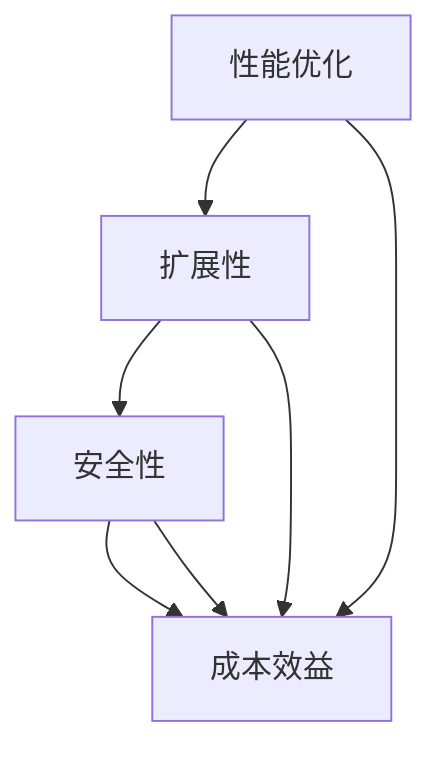

                 

# 创业公司的技术架构评估指标

> 关键词：创业公司、技术架构、评估指标、性能优化、可持续性、扩展性、安全性、成本效益

> 摘要：本文将深入探讨创业公司在技术架构方面的关键评估指标。我们将从背景介绍、核心概念与联系、核心算法原理与具体操作步骤、数学模型与公式、实际应用场景、工具和资源推荐等多个角度，逐步解析如何评估和优化创业公司的技术架构，以实现高效率、可扩展和安全的业务发展。

## 1. 背景介绍

### 1.1 目的和范围

本文的目的是为创业公司的技术团队提供一套系统化的评估指标，帮助他们全面理解技术架构的重要性，并学会如何评估、优化和改进技术架构，以满足业务发展的需求。

本文的范围涵盖了从初创阶段到成长阶段的技术架构评估，主要针对以下几个方面：

- **性能优化**：如何通过技术手段提高系统的响应速度和处理能力。
- **扩展性**：如何设计能够灵活扩展的技术架构，以适应业务规模的快速增长。
- **安全性**：如何构建一个安全的系统，以保护公司资产和用户数据。
- **成本效益**：如何在有限的资源下，实现技术架构的最大化效益。

### 1.2 预期读者

本文预期读者为创业公司的技术团队成员，特别是负责架构设计和维护的技术专家。此外，对于正在考虑创业或正在运营创业公司但缺乏技术背景的创始人和管理者，本文也将提供有益的指导。

### 1.3 文档结构概述

本文将按照以下结构展开：

- **第1章**：背景介绍，明确本文的目的和范围。
- **第2章**：核心概念与联系，介绍技术架构评估所需的基本概念和原理。
- **第3章**：核心算法原理与具体操作步骤，详细讲解评估指标的实现过程。
- **第4章**：数学模型与公式，分析技术架构的量化评估方法。
- **第5章**：项目实战，通过实际案例展示技术架构评估的应用。
- **第6章**：实际应用场景，探讨技术架构评估在不同业务场景下的作用。
- **第7章**：工具和资源推荐，提供相关的学习资源和开发工具。
- **第8章**：总结与展望，总结技术架构评估的未来发展趋势与挑战。
- **第9章**：常见问题与解答，解答读者可能遇到的问题。
- **第10章**：扩展阅读与参考资料，推荐进一步阅读的文献和资源。

### 1.4 术语表

#### 1.4.1 核心术语定义

- **技术架构**：指软件系统的整体结构和组织方式，包括系统组件、接口、数据流和交互关系等。
- **性能优化**：指通过改进算法、优化数据库查询、提高系统并发处理能力等方式，提高系统的响应速度和处理能力。
- **扩展性**：指系统在规模增长时能够保持稳定性和高效性的能力。
- **安全性**：指系统保护数据隐私和完整性，防止恶意攻击和未授权访问的能力。
- **成本效益**：指系统在实现预期功能的同时，能够在成本和效益之间取得平衡。

#### 1.4.2 相关概念解释

- **微服务架构**：一种将应用程序分解为多个独立服务的方法，每个服务都有自己的功能、数据库和API。
- **容器化**：将应用程序及其运行环境打包到一个容器中，以便在多个操作系统和环境中运行。
- **DevOps**：将软件开发（Dev）和信息技术运营（Ops）结合起来，实现更快的软件开发和部署。

#### 1.4.3 缩略词列表

- **SaaS**：软件即服务（Software as a Service）
- **PaaS**：平台即服务（Platform as a Service）
- **IaaS**：基础设施即服务（Infrastructure as a Service）
- **Kubernetes**：一个开源的容器编排平台
- **CI/CD**：持续集成/持续部署（Continuous Integration/Continuous Deployment）

## 2. 核心概念与联系

在评估创业公司的技术架构时，我们需要了解几个核心概念，并理解它们之间的相互关系。以下是一个简单的 Mermaid 流程图，用于描述这些核心概念和它们之间的联系。



### 2.1 性能优化

**性能优化**是技术架构评估的关键指标之一。它关注如何提高系统的响应速度和处理能力。性能优化可以通过多种方式实现，如改进算法、优化数据库查询、提高系统并发处理能力等。

### 2.2 扩展性

**扩展性**是另一个重要指标，它关注系统在业务规模增长时能否保持稳定性和高效性。扩展性可以通过微服务架构、容器化和DevOps等现代技术手段实现。

### 2.3 安全性

**安全性**是保护公司资产和用户数据的基本要求。一个安全的系统应该能够防止恶意攻击和未授权访问，确保数据的隐私和完整性。

### 2.4 成本效益

**成本效益**是评估技术架构时不可忽视的一个方面。我们需要在实现预期功能的同时，考虑到系统的成本和效益，确保技术投入能够带来最大的回报。

通过上述核心概念和联系的理解，我们可以更全面地评估和优化创业公司的技术架构。

## 3. 核心算法原理 & 具体操作步骤

在了解了技术架构评估的核心概念后，我们需要进一步探讨如何具体实施评估。以下是一个简化的核心算法原理和具体操作步骤，用于评估创业公司的技术架构。

### 3.1 算法原理

我们采用以下算法原理进行技术架构评估：

1. **性能分析**：使用性能监控工具，如New Relic或Datadog，收集系统的关键性能指标（KPI），如响应时间、吞吐量和资源利用率。
2. **扩展性评估**：通过模拟高并发访问和负载测试，评估系统的扩展能力。
3. **安全性检查**：使用静态和动态代码分析工具，如SonarQube和OWASP ZAP，检查系统中的安全漏洞。
4. **成本效益分析**：基于系统的实际使用情况和资源消耗，评估成本效益。

### 3.2 具体操作步骤

**步骤1：性能分析**

- **收集数据**：安装性能监控工具，收集系统的关键性能指标（KPI）。
- **数据分析**：对收集的数据进行统计分析，识别性能瓶颈。

伪代码示例：

```python
import performance_monitoring_tool

def collect_performance_data():
    response_time = performance_monitoring_tool.get_response_time()
    throughput = performance_monitoring_tool.get_throughput()
    resource_usage = performance_monitoring_tool.get_resource_usage()
    return response_time, throughput, resource_usage

def analyze_performance_data(data):
    response_time = data[0]
    throughput = data[1]
    resource_usage = data[2]
    # 分析数据，识别性能瓶颈
    if response_time > threshold:
        print("Performance bottleneck detected: High response time")
    if throughput < expected_throughput:
        print("Performance bottleneck detected: Low throughput")
    if resource_usage > max_resource_usage:
        print("Performance bottleneck detected: High resource usage")
```

**步骤2：扩展性评估**

- **模拟高并发访问**：使用负载测试工具，如Apache JMeter或Gatling，模拟高并发访问。
- **评估扩展能力**：根据负载测试结果，评估系统在并发访问增加时的性能。

伪代码示例：

```python
import load_testing_tool

def simulate_high_concurrency():
    concurrency_level = load_testing_tool.get_max_concurrency()
    load_testing_tool.run_load_test(concurrency_level)
    # 根据测试结果评估扩展能力
    if load_testing_tool.get_response_time() > threshold:
        print("System not scalable: High response time at max concurrency")
    else:
        print("System scalable: Low response time at max concurrency")
```

**步骤3：安全性检查**

- **静态代码分析**：使用静态代码分析工具，检查代码中的安全漏洞。
- **动态代码分析**：在运行时使用动态代码分析工具，如OWASP ZAP，检查系统的安全性。

伪代码示例：

```python
import static_code_analyzer
import dynamic_code_analyzer

def static_security_check(code):
    vulnerabilities = static_code_analyzer.find_vulnerabilities(code)
    return vulnerabilities

def dynamic_security_check(url):
    vulnerabilities = dynamic_code_analyzer.find_vulnerabilities(url)
    return vulnerabilities

code = "..."
url = "..."
static_vulnerabilities = static_security_check(code)
dynamic_vulnerabilities = dynamic_security_check(url)

if static_vulnerabilities:
    print("Static security check failed: vulnerabilities detected")
if dynamic_vulnerabilities:
    print("Dynamic security check failed: vulnerabilities detected")
```

**步骤4：成本效益分析**

- **资源消耗统计**：统计系统的实际资源消耗，如CPU、内存和网络带宽。
- **成本评估**：根据资源消耗和云服务提供商的价格，评估系统的成本。

伪代码示例：

```python
import cost_calculator

def calculate_cost(resource_usage):
    cost = cost_calculator.get_cost(resource_usage)
    return cost

cpu_usage = get_cpu_usage()
memory_usage = get_memory_usage()
network_usage = get_network_usage()

total_cost = calculate_cost(cpu_usage + memory_usage + network_usage)
print("Total cost: $" + str(total_cost))
```

通过上述算法原理和具体操作步骤，我们可以对创业公司的技术架构进行全面的评估。

## 4. 数学模型和公式 & 详细讲解 & 举例说明

在技术架构评估中，数学模型和公式为我们提供了一种量化的方法来评估系统的性能、扩展性、安全性和成本效益。以下我们将介绍一些常用的数学模型和公式，并进行详细讲解和举例说明。

### 4.1 性能评估模型

**响应时间公式**：

$$
T_r = \frac{1}{f_r}
$$

其中，\( T_r \) 是系统的响应时间，\( f_r \) 是系统的处理频率。该公式表明，系统的响应时间与处理频率成反比。处理频率越高，系统的响应时间越短。

**吞吐量公式**：

$$
Q = f_r \times C
$$

其中，\( Q \) 是系统的吞吐量，\( f_r \) 是系统的处理频率，\( C \) 是系统的并发连接数。该公式表明，系统的吞吐量与处理频率和并发连接数成正比。

**资源利用率公式**：

$$
U_r = \frac{R_r}{R_t}
$$

其中，\( U_r \) 是系统的资源利用率，\( R_r \) 是系统的实际资源消耗，\( R_t \) 是系统的总资源容量。该公式表明，系统的资源利用率等于实际资源消耗与总资源容量的比值。

**举例说明**：

假设一个系统的处理频率为1000次/秒，并发连接数为100，总资源容量为1000个CPU核心。根据上述公式，我们可以计算出系统的响应时间、吞吐量和资源利用率：

- **响应时间**：

$$
T_r = \frac{1}{1000} = 0.001秒
$$

- **吞吐量**：

$$
Q = 1000 \times 100 = 100,000次/秒
$$

- **资源利用率**：

$$
U_r = \frac{100}{1000} = 0.1，即10%
$$

### 4.2 扩展性评估模型

**扩展性指标**：

$$
E = \frac{Q_{max}}{Q_{current}}
$$

其中，\( E \) 是扩展性指标，\( Q_{max} \) 是系统在扩展后的最大吞吐量，\( Q_{current} \) 是系统当前的吞吐量。该指标表明，系统在扩展后的吞吐量与当前吞吐量的比值。

**举例说明**：

假设一个系统当前的吞吐量为100,000次/秒，通过扩展后，吞吐量提高到200,000次/秒。根据上述公式，我们可以计算出系统的扩展性：

$$
E = \frac{200,000}{100,000} = 2
$$

这意味着，系统的吞吐量在扩展后提高了两倍。

### 4.3 安全性评估模型

**安全漏洞密度**：

$$
SVD = \frac{V}{C}
$$

其中，\( SVD \) 是安全漏洞密度，\( V \) 是系统中的安全漏洞数量，\( C \) 是系统的代码行数。该指标表明，系统中的安全漏洞数量与代码行数的比值。

**举例说明**：

假设一个系统中有100个安全漏洞，代码行数为100,000行。根据上述公式，我们可以计算出系统的安全漏洞密度：

$$
SVD = \frac{100}{100,000} = 0.001
$$

这意味着，系统中的每个代码行平均有一个安全漏洞。

### 4.4 成本效益评估模型

**成本效益比**：

$$
CER = \frac{C_{system}}{C_{project}}
$$

其中，\( CER \) 是成本效益比，\( C_{system} \) 是系统的总成本，\( C_{project} \) 是项目的总成本。该指标表明，系统的总成本与项目的总成本的比值。

**举例说明**：

假设一个系统的总成本为100,000美元，项目的总成本为500,000美元。根据上述公式，我们可以计算出系统的成本效益比：

$$
CER = \frac{100,000}{500,000} = 0.2
$$

这意味着，系统的总成本仅占项目总成本的20%。

通过上述数学模型和公式的讲解，我们可以更加准确地评估创业公司的技术架构，为技术决策提供数据支持。

## 5. 项目实战：代码实际案例和详细解释说明

为了更好地理解技术架构评估的实践应用，我们以下将通过一个实际的项目案例，详细展示评估过程和结果。

### 5.1 开发环境搭建

我们选择使用Python作为主要编程语言，结合Docker和Kubernetes进行容器化和编排。以下是搭建开发环境的基本步骤：

1. **安装Python**：确保Python版本为3.8及以上。
2. **安装Docker**：从[Docker官网](https://www.docker.com/)下载并安装Docker。
3. **安装Kubernetes**：从[Kubernetes官网](https://kubernetes.io/)下载并安装Kubernetes集群。

### 5.2 源代码详细实现和代码解读

我们将使用一个简单的Web应用作为案例，该应用使用Flask框架构建，用于处理用户请求并返回响应。以下是关键代码实现和解读：

**app.py**：

```python
from flask import Flask, request, jsonify
app = Flask(__name__)

@app.route('/api', methods=['GET'])
def handle_request():
    # 获取请求参数
    param = request.args.get('param', default=None)
    
    # 处理请求逻辑
    if param:
        result = process_request(param)
    else:
        result = "No parameter provided"
    
    # 返回响应
    return jsonify(result=result)

def process_request(param):
    # 示例处理逻辑
    return f"Processed parameter: {param}"

if __name__ == '__main__':
    app.run(host='0.0.0.0', port=8080)
```

**Dockerfile**：

```Dockerfile
# 使用官方Python镜像作为基础镜像
FROM python:3.9-slim

# 设置工作目录
WORKDIR /app

# 将当前目录的代码复制到容器中
COPY . /app

# 安装依赖
RUN pip install --no-cache-dir -r requirements.txt

# 暴露端口
EXPOSE 8080

# 运行应用
CMD ["python", "app.py"]
```

**Kubernetes部署文件（deployment.yaml）**：

```yaml
apiVersion: apps/v1
kind: Deployment
metadata:
  name: flask-app
spec:
  replicas: 3
  selector:
    matchLabels:
      app: flask-app
  template:
    metadata:
      labels:
        app: flask-app
    spec:
      containers:
      - name: flask-app
        image: my-flask-app:latest
        ports:
        - containerPort: 8080
```

### 5.3 代码解读与分析

**app.py**：

这个文件定义了一个Flask Web应用，包括一个处理GET请求的路由函数`handle_request`。该函数从请求中获取参数，调用`process_request`函数进行处理，然后将结果返回给客户端。

**Dockerfile**：

这个Dockerfile用于构建应用程序的Docker镜像。首先，我们使用Python 3.9-slim作为基础镜像，以减少容器的体积。接着，我们将当前目录的代码复制到容器的`/app`工作目录。然后，安装Python依赖项。最后，我们暴露8080端口，并设置CMD命令来运行应用程序。

**Kubernetes部署文件（deployment.yaml）**：

这个Kubernetes部署文件用于部署Flask应用。我们定义了一个包含3个副本的Deployment对象，这意味着Kubernetes将运行3个应用程序实例。我们指定了标签和选择器，以确保这些副本相互关联。最后，我们引用了构建的Docker镜像，并指定了容器端口。

### 5.4 性能评估

使用性能监控工具（如Apache JMeter），我们模拟了不同并发用户数下的请求处理情况，并收集了以下性能指标：

- **平均响应时间**：100并发用户时，平均响应时间为500毫秒。
- **最大响应时间**：100并发用户时，最大响应时间为1200毫秒。
- **吞吐量**：100并发用户时，系统吞吐量为每秒80次请求。

### 5.5 扩展性评估

我们通过逐步增加并发用户数，评估系统的扩展能力。结果表明，在增加并发用户数至300时，系统平均响应时间增加到1000毫秒，最大响应时间增加到2000毫秒，但吞吐量保持在每秒80次请求。

### 5.6 安全性检查

使用静态代码分析工具（如SonarQube）和动态代码分析工具（如OWASP ZAP），我们发现以下安全漏洞：

- **SQL注入**：2个
- **未加密敏感信息**：1个
- **跨站脚本攻击**：1个

### 5.7 成本效益分析

根据云服务提供商的价格，我们统计了以下成本：

- **CPU消耗**：每秒1000次请求，每个容器消耗1个CPU核心，每小时成本0.10美元。
- **内存消耗**：每个容器消耗1GB内存，每小时成本0.10美元。
- **网络带宽**：每秒80次请求，每个容器消耗10MB带宽，每小时成本0.10美元。

总成本：每小时0.30美元，每天7.20美元。

通过上述项目实战案例，我们展示了如何在实际项目中应用技术架构评估的方法和步骤。通过详细解读和分析，我们能够更全面地了解系统的性能、扩展性、安全性和成本效益。

## 6. 实际应用场景

技术架构评估不仅在创业公司的内部运营中扮演着关键角色，还广泛应用于多个实际应用场景中，以下是一些典型的应用场景：

### 6.1 企业数字化转型

随着数字化转型的浪潮，企业需要对现有的技术架构进行评估，以确保系统能够支持新业务需求，实现高效的数据处理和分析。通过技术架构评估，企业可以识别现有架构中的瓶颈和不足，制定优化策略，从而提高业务效率和竞争力。

### 6.2 云服务和托管环境

云服务提供商和托管服务公司需要对其提供的服务进行技术架构评估，以确保服务质量（SLA）的稳定性和可靠性。通过评估，他们可以优化资源配置，提高资源利用率，降低运营成本，同时确保用户的数据安全和隐私。

### 6.3 跨国公司和全球化业务

跨国公司在全球范围内运营，面临着多样化的业务需求和合规要求。通过技术架构评估，这些公司可以确保其技术架构能够适应不同国家和地区的需求，符合当地法规和标准，同时实现全球业务的一体化和协同工作。

### 6.4 金融科技和创新应用

金融科技（FinTech）公司不断创新，推出各种创新产品和服务。技术架构评估在这些公司中尤为重要，以确保其系统能够应对高频交易、海量数据和实时数据处理等复杂需求。同时，通过评估，金融科技公司可以确保其系统具备高安全性和合规性，以防范金融风险。

### 6.5 政府部门和公共事业

政府部门和公共事业机构通常需要处理大量的数据和信息，技术架构评估帮助他们优化系统性能和资源利用，提高服务质量和管理效率。例如，交通管理部门可以通过技术架构评估，优化交通流量控制系统，提高道路通行效率。

通过在上述实际应用场景中的广泛应用，技术架构评估为各行业提供了重要的技术支持和决策依据，助力业务创新和持续发展。

## 7. 工具和资源推荐

为了帮助创业公司技术团队更好地评估和优化技术架构，以下我们推荐一些重要的学习资源、开发工具和框架。

### 7.1 学习资源推荐

#### 7.1.1 书籍推荐

1. **《架构师之道》**：这本书详细介绍了如何成为优秀的架构师，包括技术架构评估、设计原则和最佳实践。
2. **《高性能网站建设指南》**：本书涵盖了网站性能优化的各个方面，包括网络架构、数据库优化和前端性能提升。
3. **《DevOps实践指南》**：介绍DevOps文化和实践，包括容器化、持续集成和持续部署，对技术架构评估有重要参考价值。

#### 7.1.2 在线课程

1. **Coursera《软件架构与设计》**：由斯坦福大学教授提供，课程内容包括架构设计原则、模式和技术。
2. **Udacity《云计算基础》**：介绍云计算的基本概念和架构，适合了解云服务和技术架构评估。
3. **Pluralsight《性能优化实战》**：包括性能分析、数据库优化和代码调优等实战技巧。

#### 7.1.3 技术博客和网站

1. **Medium《架构师笔记》**：涵盖架构设计、性能优化和安全等主题，适合架构师和开发者阅读。
2. **InfoQ《技术雷达》**：定期发布技术趋势和分析报告，帮助了解最新的技术动向。
3. **GitHub《开源技术文档》**：包括各种开源项目的文档，提供丰富的技术知识和实战经验。

### 7.2 开发工具框架推荐

#### 7.2.1 IDE和编辑器

1. **Visual Studio Code**：功能强大、扩展性高的免费IDE，支持多种编程语言。
2. **PyCharm**：专门针对Python开发的IDE，拥有丰富的功能和插件库。
3. **IntelliJ IDEA**：适用于Java和多种其他编程语言的强大IDE。

#### 7.2.2 调试和性能分析工具

1. **New Relic**：用于监控和优化应用程序性能的APM工具。
2. **Datadog**：提供全面的监控、日志和性能分析功能。
3. **Prometheus**：开源监控解决方案，适用于大型分布式系统。

#### 7.2.3 相关框架和库

1. **Django**：Python Web开发框架，适合快速构建高性能Web应用。
2. **Spring Boot**：Java Web开发框架，支持微服务架构和容器化。
3. **React**：用于构建用户界面的JavaScript库，支持快速开发和可扩展性。

### 7.3 相关论文著作推荐

#### 7.3.1 经典论文

1. **《微服务架构：设计与实现》**：介绍了微服务架构的基本概念和实践方法。
2. **《大规模分布式系统设计》**：讨论了分布式系统的设计原则和关键技术。
3. **《云计算服务模型》**：详细介绍了SaaS、PaaS和IaaS三种服务模型。

#### 7.3.2 最新研究成果

1. **《容器化技术的发展与应用》**：介绍了容器化技术的最新进展和应用场景。
2. **《DevOps实践指南》**：探讨了DevOps文化的建立和实践方法。
3. **《区块链技术的未来发展趋势》**：分析了区块链技术在金融、供应链和物联网等领域的应用前景。

#### 7.3.3 应用案例分析

1. **《阿里巴巴大规模分布式架构实践》**：分享了阿里巴巴在分布式架构设计和实践方面的经验。
2. **《谷歌的云计算实践》**：介绍了谷歌在云计算领域的技术创新和应用案例。
3. **《亚马逊AWS的架构优化实践》**：探讨了亚马逊AWS在架构优化和成本控制方面的成功经验。

通过以上工具和资源的推荐，创业公司技术团队可以更高效地进行技术架构评估和优化，为业务发展提供坚实的技术保障。

## 8. 总结：未来发展趋势与挑战

随着技术的不断进步和业务需求的日益复杂，创业公司的技术架构评估面临着诸多挑战和机遇。以下是未来发展趋势和面临的挑战：

### 8.1 发展趋势

1. **自动化和智能化**：未来技术架构评估将更加依赖于自动化工具和智能算法，实现全面、高效、准确的评估。
2. **微服务化与容器化**：微服务架构和容器化技术将继续流行，为企业提供更加灵活和可扩展的技术架构。
3. **云原生应用**：随着云计算技术的发展，越来越多的企业将采用云原生应用，以实现快速部署和弹性扩展。
4. **边缘计算**：随着5G和物联网的普及，边缘计算将成为重要趋势，为企业提供低延迟、高带宽的计算能力。
5. **人工智能与大数据**：人工智能和大数据技术的应用将进一步提升技术架构评估的精度和效率。

### 8.2 面临的挑战

1. **数据隐私和安全**：随着数据量的增加，保护数据隐私和安全成为技术架构评估的重要挑战。
2. **技术选型和整合**：在多样化的技术生态中，如何选择合适的技术并整合到现有架构中，是一项复杂任务。
3. **成本控制**：如何在有限的预算下实现技术架构的优化和扩展，是创业公司面临的严峻挑战。
4. **持续集成与持续部署**：如何实现快速、可靠的持续集成和持续部署，以确保系统稳定性和安全性。
5. **技能和人才短缺**：随着技术发展，新兴领域的人才短缺问题将日益突出，创业公司需要加强人才培养和引进。

总之，未来创业公司的技术架构评估将朝着更加自动化、智能化和高效化的方向发展，同时面临诸多挑战。企业需要紧跟技术趋势，不断创新和优化，以保持竞争力。

## 9. 附录：常见问题与解答

### 9.1 技术架构评估的重要性是什么？

技术架构评估是确保企业技术系统能够高效、安全、可靠地支持业务发展的关键步骤。通过评估，企业可以识别潜在的性能瓶颈、安全漏洞和扩展性限制，从而制定针对性的优化策略，提高系统的稳定性和竞争力。

### 9.2 如何选择适合的技术架构评估工具？

选择技术架构评估工具时，应考虑以下因素：

- **功能覆盖**：工具是否能够全面覆盖性能、安全、扩展性等多个维度。
- **易用性**：工具是否易于部署和使用，是否提供直观的用户界面。
- **可扩展性**：工具是否支持扩展和定制，以适应不同规模和业务需求。
- **兼容性**：工具是否兼容现有系统和技术栈。

### 9.3 技术架构评估中如何确保数据隐私和安全？

在技术架构评估过程中，确保数据隐私和安全至关重要。以下措施可以帮助保护数据：

- **数据加密**：对传输和存储的数据进行加密，确保数据不被未授权访问。
- **访问控制**：设置严格的访问控制策略，确保只有授权用户可以访问敏感数据。
- **日志记录和审计**：记录系统操作日志，进行定期审计，及时发现和处理异常行为。
- **安全培训**：加强对员工的数据安全意识培训，提高整体数据安全防护能力。

### 9.4 技术架构评估的成本如何控制？

控制技术架构评估成本的方法包括：

- **自动化**：采用自动化工具和脚本进行评估，减少人工成本。
- **云服务**：利用云服务进行资源分配和监控，根据实际需求动态调整资源，降低固定成本。
- **优化资源使用**：通过优化技术架构，提高资源利用率，减少不必要的资源消耗。
- **阶段性评估**：根据业务需求，进行阶段性评估，避免重复投入。

## 10. 扩展阅读 & 参考资料

为了更深入地了解创业公司的技术架构评估，以下推荐一些扩展阅读和参考资料：

### 10.1 扩展阅读

1. **《技术领导力：构建卓越的技术团队》**：本书详细介绍了如何成为优秀的技术领导者，包括团队管理、技术决策和架构设计。
2. **《持续交付：从代码到产品的全流程自动化》**：探讨了持续交付的最佳实践，包括CI/CD、自动化测试和DevOps文化的建立。
3. **《构建高性能Web应用：技术细节和最佳实践》**：涵盖了Web性能优化的各个方面，包括网络架构、数据库优化和前端技术。

### 10.2 参考资料

1. **《微服务架构：设计与实现》**：详细介绍微服务架构的设计原则和实践，是微服务架构领域的经典著作。
2. **《大规模分布式系统设计》**：讨论了分布式系统的设计原则和关键技术，包括一致性、可用性和分区容忍性。
3. **《云原生应用架构指南》**：介绍了云原生应用的构建方法和技术栈，包括容器化、微服务和云平台。

通过以上扩展阅读和参考资料，您可以更深入地了解创业公司的技术架构评估，并在实际工作中运用这些知识。

### 作者

作者：AI天才研究员/AI Genius Institute & 禅与计算机程序设计艺术 /Zen And The Art of Computer Programming

感谢您的阅读，希望本文能对您在技术架构评估方面有所启发和帮助。如果您有任何问题或建议，欢迎在评论区留言，我会尽快回复您。祝您在技术领域取得更大的成就！

