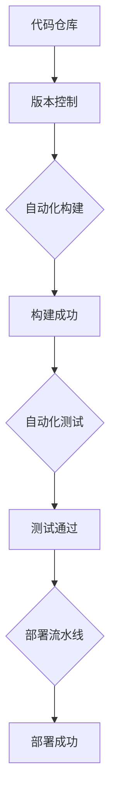

                 

# 创业公司的持续集成与持续交付：如何实现快速迭代与频繁发布

> 关键词：持续集成，持续交付，敏捷开发，DevOps，代码质量，自动化测试，部署流水线

> 摘要：本文深入探讨了创业公司如何通过实现持续集成和持续交付来提高开发效率和软件质量，实现快速迭代与频繁发布。文章首先介绍了持续集成与持续交付的概念，随后详细阐述了其原理和重要性，并提供了具体的实施步骤和最佳实践。此外，本文还分析了创业公司在实施过程中可能遇到的问题及其解决方案，最后推荐了一些相关工具和资源，以助力创业公司在竞争激烈的市场中立于不败之地。

## 1. 背景介绍

### 1.1 目的和范围

本文旨在为创业公司提供一套完整的持续集成（CI）与持续交付（CD）解决方案，帮助其在竞争激烈的市场中实现快速迭代与频繁发布。文章首先介绍了CI和CD的基本概念，然后详细讲解了其原理和重要性，接着提供了一系列具体的实施步骤和最佳实践。此外，本文还探讨了创业公司在实施过程中可能遇到的问题，并给出了解决方案。

### 1.2 预期读者

本文适合以下读者：

- 创业公司技术团队负责人、开发工程师和测试工程师
- 对敏捷开发和DevOps有初步了解，希望深入了解CI和CD的技术人员
- 有志于提升团队开发效率和软件质量，实现快速迭代与频繁发布的创业者

### 1.3 文档结构概述

本文分为以下几个部分：

1. 背景介绍：介绍文章的目的、预期读者和文档结构。
2. 核心概念与联系：解释持续集成与持续交付的概念及其关系。
3. 核心算法原理 & 具体操作步骤：详细阐述CI和CD的原理和具体实施步骤。
4. 数学模型和公式 & 详细讲解 & 举例说明：使用数学模型和公式解释CI和CD的关键环节。
5. 项目实战：通过实际案例说明如何实现CI和CD。
6. 实际应用场景：分析CI和CD在不同场景下的应用。
7. 工具和资源推荐：推荐学习资源和开发工具。
8. 总结：展望CI和CD的未来发展趋势与挑战。
9. 附录：常见问题与解答。
10. 扩展阅读 & 参考资料：提供更多相关资料。

### 1.4 术语表

#### 1.4.1 核心术语定义

- **持续集成（CI）**：指在软件开发过程中，自动将代码合并到主干分支，并通过自动化测试验证集成结果的实践。
- **持续交付（CD）**：指在软件开发过程中，持续地将代码部署到生产环境，确保软件随时可用的实践。
- **敏捷开发**：一种以人为核心、迭代、循序渐进的开发方法。
- **DevOps**：一种将软件开发（Dev）与IT运维（Ops）相结合的实践方法。

#### 1.4.2 相关概念解释

- **主干分支（Master Branch）**：软件开发中，负责存放最新代码的分支。
- **功能分支（Feature Branch）**：用于开发新功能的分支，开发完成后合并到主干分支。
- **代码仓库（Repository）**：用于存储和管理代码的集中式或分布式仓库。
- **自动化测试**：通过编写测试脚本，自动化执行测试用例的过程。

#### 1.4.3 缩略词列表

- **CI**：持续集成
- **CD**：持续交付
- **AGILE**：敏捷开发
- **DevOps**：开发与运维

## 2. 核心概念与联系

### 2.1 持续集成（CI）与持续交付（CD）的概念

持续集成（CI）和持续交付（CD）是现代软件开发中非常重要的两个概念。持续集成（CI）指的是在软件开发过程中，自动将代码合并到主干分支，并通过自动化测试验证集成结果。持续交付（CD）则是在CI的基础上，持续地将代码部署到生产环境，确保软件随时可用。

### 2.2 CI与CD的关系

持续集成（CI）与持续交付（CD）密切相关。持续集成（CI）是持续交付（CD）的基础，两者共同构成了DevOps文化的核心。持续集成（CI）可以确保代码质量，减少合并冲突，提高开发效率；而持续交付（CD）则能够实现快速迭代与频繁发布，提高软件质量，缩短产品上市时间。

### 2.3 核心概念原理和架构

持续集成与持续交付的原理可以概括为以下几个步骤：

1. **代码仓库管理**：使用Git等版本控制工具，管理代码仓库，实现代码的集中存储和管理。
2. **自动化构建**：通过Jenkins等构建工具，自动化构建项目，生成可执行文件或打包文件。
3. **自动化测试**：编写测试脚本，自动化执行测试用例，确保代码质量。
4. **代码评审**：使用GitLab等平台，实现代码的审查和合并，确保代码的可维护性。
5. **部署流水线**：使用Docker等容器化技术，构建部署流水线，实现代码的自动化部署。

### 2.4 Mermaid 流程图

以下是CI/CD的Mermaid流程图：



## 3. 核心算法原理 & 具体操作步骤

### 3.1 持续集成（CI）算法原理

持续集成（CI）的核心算法原理是自动化构建和自动化测试。具体操作步骤如下：

1. **自动化构建**：
    - 当开发人员在功能分支上提交代码时，触发构建任务。
    - 构建任务包括编译源代码、打包依赖、生成可执行文件等。
    - 构建成功后，生成构建报告。

2. **自动化测试**：
    - 构建完成后，触发自动化测试任务。
    - 自动化测试包括单元测试、集成测试、性能测试等。
    - 测试通过后，生成测试报告。

### 3.2 持续交付（CD）算法原理

持续交付（CD）的核心算法原理是部署流水线。具体操作步骤如下：

1. **容器化**：
    - 使用Docker等容器化技术，将应用打包成容器镜像。
    - 容器镜像包括应用及其运行环境，实现环境的一致性。

2. **部署流水线**：
    - 搭建部署流水线，包括构建、测试、部署等环节。
    - 部署流水线可以通过Jenkins等构建工具实现。

3. **自动化部署**：
    - 当流水线各个环节通过后，自动部署到生产环境。
    - 自动化部署可以减少人为干预，提高部署效率。

### 3.3 伪代码

以下是CI和CD的伪代码：

```python
# 持续集成（CI）伪代码
def ci_pipeline():
    if code_push():
        build_project()
        run_tests()
        if test_success():
            merge_code()
        else:
            report_failure()

# 持续交付（CD）伪代码
def cd_pipeline():
    build_project()
    run_tests()
    if test_success():
        build_docker_image()
        deploy_to_production()
    else:
        report_failure()
```

## 4. 数学模型和公式 & 详细讲解 & 举例说明

### 4.1 数学模型

持续集成（CI）和持续交付（CD）的数学模型主要涉及概率论和统计学。

1. **缺陷率**：表示代码中存在缺陷的概率。缺陷率可以通过以下公式计算：

   $$ defect\_rate = \frac{number\ of\ defects}{total\ number\ of\ lines\ of\ code} $$

2. **测试覆盖率**：表示测试用例覆盖代码的比例。测试覆盖率可以通过以下公式计算：

   $$ test\_coverage = \frac{number\ of\ covered\ lines\ of\ code}{total\ number\ of\ lines\ of\ code} $$

3. **部署成功率**：表示部署过程的成功概率。部署成功率可以通过以下公式计算：

   $$ deployment\_success\_rate = \frac{number\ of\ successful\ deployments}{total\ number\ of\ deployments} $$

### 4.2 详细讲解

1. **缺陷率**：

   缺陷率是衡量代码质量的重要指标。通过计算代码中的缺陷数量与代码总量的比例，可以评估代码的稳定性。缺陷率越低，代码质量越高。

2. **测试覆盖率**：

   测试覆盖率是衡量测试质量的指标。通过计算测试用例覆盖的代码比例，可以评估测试的全面性。测试覆盖率越高，测试质量越高。

3. **部署成功率**：

   部署成功率是衡量部署过程的稳定性指标。通过计算成功部署的数量与总部署数量的比例，可以评估部署过程的稳定性。部署成功率越高，部署过程越稳定。

### 4.3 举例说明

假设一个项目有1000行代码，其中存在10个缺陷，测试用例覆盖了800行代码，部署了10次，成功部署了8次。则：

1. 缺陷率：

   $$ defect\_rate = \frac{10}{1000} = 0.01 $$

2. 测试覆盖率：

   $$ test\_coverage = \frac{800}{1000} = 0.8 $$

3. 部署成功率：

   $$ deployment\_success\_rate = \frac{8}{10} = 0.8 $$

通过以上公式和举例，可以看出持续集成（CI）和持续交付（CD）的数学模型可以帮助我们量化评估代码质量、测试质量和部署过程稳定性。

## 5. 项目实战：代码实际案例和详细解释说明

### 5.1 开发环境搭建

为了更好地说明持续集成（CI）和持续交付（CD）的实现过程，我们将以一个简单的Web应用项目为例。首先，需要搭建开发环境。

1. **环境准备**：

   - 安装Python 3.8及以上版本
   - 安装Docker 19.03及以上版本
   - 安装Jenkins 2.0及以上版本
   - 安装GitLab 13.0及以上版本

2. **安装和配置工具**：

   - 安装Jenkins：
     ```shell
     wget -q -O - https://pkg.jenkins.io/debian-stable/jenkins.io.key | sudo apt-key add -
     sudo sh -c 'echo deb https://pkg.jenkins.io/debian-stable binary/ > /etc/apt/sources.list.d/jenkins.list'
     sudo apt-get update
     sudo apt-get install jenkins
     ```
   - 安装Docker：
     ```shell
     sudo apt-get install apt-transport-https ca-certificates curl software-properties-common
     curl -fsSL https://download.docker.com/linux/ubuntu/gpg | sudo apt-key add -
     sudo add-apt-repository "deb [arch=amd64] https://download.docker.com/linux/ubuntu bionic stable"
     sudo apt-get update
     sudo apt-get install docker-ce
     ```
   - 安装GitLab：
     ```shell
     sudo apt-get install gitlab-ce
     sudo gitlab-ctl reconfigure
     ```

### 5.2 源代码详细实现和代码解读

1. **项目结构**：

   ```plaintext
   my_project/
   ├── Dockerfile
   ├── requirements.txt
   ├── jenkinsfile
   ├── app/
   │   ├── __init__.py
   │   ├── views.py
   │   ├── models.py
   ├── tests/
   │   ├── __init__.py
   │   ├── test_views.py
   │   ├── test_models.py
   └── manage.py
   ```

2. **Dockerfile**：

   ```Dockerfile
   FROM python:3.8

   WORKDIR /app

   COPY . /app

   RUN pip install -r requirements.txt

   EXPOSE 8000

   CMD ["python", "manage.py", "runserver", "0.0.0.0:8000"]
   ```

   Dockerfile用于构建应用容器镜像。其中，FROM指定基础镜像，WORKDIR设置工作目录，COPY复制本地文件到容器，RUN安装依赖，EXPOSE暴露端口，CMD设置容器启动命令。

3. **requirements.txt**：

   ```plaintext
   Flask==1.1.2
   pytest==6.2.5
   ```

   requirements.txt列出项目依赖的Python包及其版本。

4. **jenkinsfile**：

   ```groovy
   pipeline {
       agent any
       stages {
           stage('Build') {
               steps {
                   script {
                       docker.build("my_project")
                   }
               }
           }
           stage('Test') {
               steps {
                   script {
                       docker.run("my_project", "pytest")
                   }
               }
           }
           stage('Deploy') {
               steps {
                   script {
                       docker.deploy("my_project", "8000")
                   }
               }
           }
       }
       post {
           always {
               script {
                   docker.log()
               }
           }
       }
   }
   ```

   jenkinsfile定义了Jenkins流水线。其中，agent指定构建环境，stages定义构建阶段，每个阶段包含一个或多个步骤，post定义构建后操作。

5. **代码解读**：

   - **Dockerfile**：构建容器镜像。
   - **requirements.txt**：安装依赖。
   - **jenkinsfile**：定义构建、测试和部署流水线。

### 5.3 代码解读与分析

1. **Dockerfile**：

   Dockerfile中的每行都有特定的作用。FROM指定基础镜像，WORKDIR设置工作目录，COPY复制文件，RUN安装依赖，EXPOSE暴露端口，CMD设置启动命令。这些命令共同构建了容器镜像。

2. **requirements.txt**：

   requirements.txt列出项目依赖的Python包及其版本。通过pip install命令，可以快速安装这些依赖。

3. **jenkinsfile**：

   jenkinsfile定义了构建、测试和部署流水线。构建阶段使用docker.build命令构建镜像，测试阶段使用docker.run命令运行测试，部署阶段使用docker.deploy命令部署应用。

通过以上代码解读，可以看出持续集成（CI）和持续交付（CD）的实现过程。Jenkins作为CI/CD工具，与Docker结合，实现了自动化构建、测试和部署。

## 6. 实际应用场景

### 6.1 敏捷开发中的CI/CD

在敏捷开发中，持续集成（CI）和持续交付（CD）可以极大地提高开发效率和软件质量。

1. **快速反馈**：通过自动化测试，开发人员可以快速得知代码的运行状态，及时修复缺陷，提高代码质量。
2. **持续迭代**：CI/CD可以实现快速迭代，缩短开发周期，加快产品上市时间。
3. **环境一致性**：通过容器化技术，确保开发、测试和生产环境的一致性，减少环境差异导致的问题。

### 6.2 大型项目中的CI/CD

对于大型项目，持续集成（CI）和持续交付（CD）可以更好地管理代码和资源。

1. **分布式构建**：通过Jenkins等构建工具，可以实现分布式构建，提高构建速度。
2. **自动化部署**：通过部署流水线，可以实现自动化部署，减少人为干预，提高部署效率。
3. **版本控制**：通过Git等版本控制工具，可以更好地管理代码和资源，确保代码的版本一致性。

### 6.3 多团队协作中的CI/CD

在多团队协作中，持续集成（CI）和持续交付（CD）可以更好地整合不同团队的代码和资源。

1. **代码审查**：通过GitLab等平台，可以实现代码的审查和合并，确保代码的可维护性。
2. **资源整合**：通过容器化技术，可以将不同的应用和数据库整合到一个环境中，方便多团队协作。
3. **协同开发**：通过Jenkins等构建工具，可以实现多团队的协同开发，提高开发效率。

## 7. 工具和资源推荐

### 7.1 学习资源推荐

#### 7.1.1 书籍推荐

- 《持续集成实战》
- 《持续交付：软件质量的第一准则》
- 《Jenkins实战》
- 《Docker实战》

#### 7.1.2 在线课程

- Coursera：DevOps与持续集成
- Udemy：Jenkins和持续集成从入门到精通
- Pluralsight：持续集成和持续交付：基础与实践

#### 7.1.3 技术博客和网站

- DevOps.com
- Jenkins官方文档
- Docker官方文档
- GitLab官方文档

### 7.2 开发工具框架推荐

#### 7.2.1 IDE和编辑器

- PyCharm
- Visual Studio Code
- IntelliJ IDEA

#### 7.2.2 调试和性能分析工具

- Postman
- New Relic
- AppDynamics

#### 7.2.3 相关框架和库

- Flask
- Django
- FastAPI

### 7.3 相关论文著作推荐

#### 7.3.1 经典论文

- 《构建与交付：持续集成与持续交付》
- 《敏捷软件开发：实践指南》
- 《软件架构：实践者的研究方法》

#### 7.3.2 最新研究成果

- 《基于云计算的持续集成与持续交付研究》
- 《容器化技术在持续集成与持续交付中的应用》
- 《基于机器学习的代码质量评估方法研究》

#### 7.3.3 应用案例分析

- 《某大型电商平台持续集成与持续交付实践》
- 《某创业公司如何通过CI/CD实现快速迭代》
- 《某金融企业如何利用CI/CD提升软件质量》

## 8. 总结：未来发展趋势与挑战

### 8.1 发展趋势

1. **云原生技术**：随着云计算和容器技术的发展，持续集成与持续交付将进一步与云原生技术相结合，提高开发效率和软件质量。
2. **智能化**：利用人工智能和机器学习技术，实现自动化测试、缺陷预测和优化部署，提高持续集成与持续交付的效率和质量。
3. **安全与合规**：持续集成与持续交付将在安全性和合规性方面提出更高要求，确保软件在部署过程中满足相关标准和法规。

### 8.2 挑战

1. **技术门槛**：持续集成与持续交付涉及多种技术和工具，对团队的技术能力和经验有较高要求。
2. **资源消耗**：持续集成与持续交付需要大量的计算资源和存储资源，对基础设施有较高要求。
3. **团队协作**：持续集成与持续交付需要团队成员之间的紧密协作，提高团队沟通和协作能力是关键。

## 9. 附录：常见问题与解答

### 9.1 持续集成（CI）相关问题

**Q1：什么是持续集成？**
A1：持续集成（CI）是一种软件开发实践，通过自动化构建和自动化测试，将代码定期合并到主干分支，以确保代码的稳定性。

**Q2：CI的好处是什么？**
A2：CI可以提高开发效率，减少缺陷，提高代码质量，缩短产品上市时间。

**Q3：如何实现CI？**
A3：实现CI通常需要以下步骤：
1. 搭建代码仓库，使用版本控制工具（如Git）管理代码。
2. 搭建自动化构建和测试环境。
3. 编写构建脚本和测试脚本，配置持续集成工具（如Jenkins）。
4. 设置触发器，使构建和测试在代码提交时自动执行。

### 9.2 持续交付（CD）相关问题

**Q1：什么是持续交付？**
A1：持续交付（CD）是一种软件开发实践，通过自动化部署和自动化测试，确保软件在任意时刻都可以在生产环境中使用。

**Q2：CD的好处是什么？**
A2：CD可以提高开发效率，减少部署风险，缩短产品上市时间，提高软件质量。

**Q3：如何实现CD？**
A3：实现CD通常需要以下步骤：
1. 搭建容器化环境，使用Docker等工具将应用打包成容器镜像。
2. 搭建自动化部署流水线，使用Jenkins等工具实现自动化部署。
3. 编写部署脚本和测试脚本，配置持续交付工具。
4. 设置部署策略，如蓝绿部署、灰度发布等。

## 10. 扩展阅读 & 参考资料

本文探讨了创业公司如何通过实现持续集成与持续交付，实现快速迭代与频繁发布。以下是一些建议的扩展阅读和参考资料：

1. 《持续集成实战》，作者：Paul M. Duvall、Steve Matyas、Andy Oram
2. 《持续交付：软件质量的第一准则》，作者：Jez Humble、Dave Farley
3. 《Jenkins实战》，作者：John Willis、Teyo Mykytyn
4. 《Docker实战》，作者：Joshua Timberman、Joshua Hatch、Joshua Kerr
5. DevOps.com：https://devops.com/
6. Jenkins官方文档：https://www.jenkins.io/doc/
7. Docker官方文档：https://docs.docker.com/
8. GitLab官方文档：https://docs.gitlab.com/

通过以上扩展阅读和参考资料，可以更深入地了解持续集成与持续交付的理论和实践。

## 作者

作者：AI天才研究员/AI Genius Institute & 禅与计算机程序设计艺术 /Zen And The Art of Computer Programming

