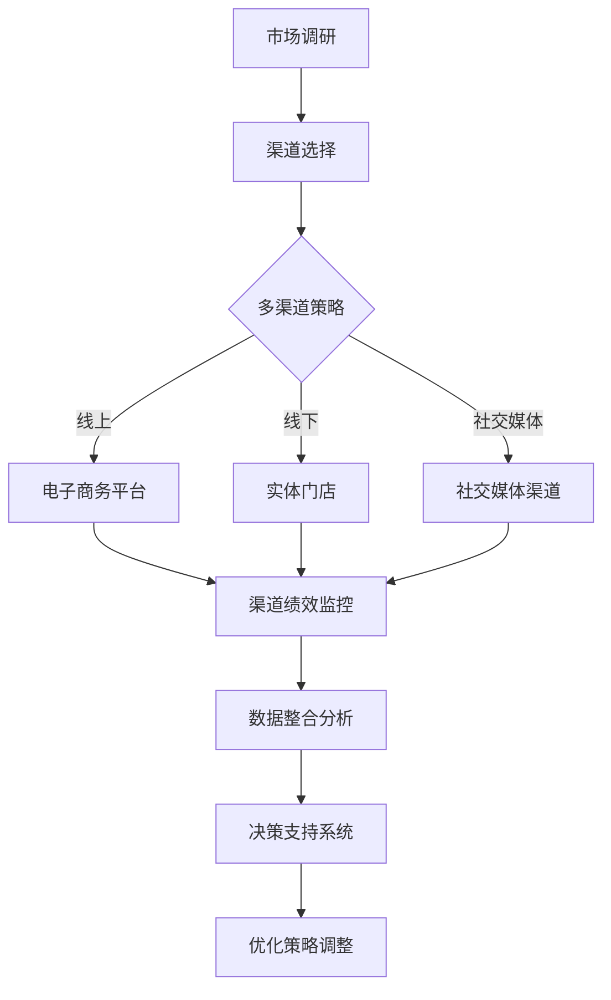

                 

# 创业公司的渠道管理与多渠道整合策略

> 关键词：创业公司、渠道管理、多渠道整合、营销策略、客户关系管理

> 摘要：本文将深入探讨创业公司在快速成长阶段如何有效地管理和整合多种销售渠道，以最大化市场覆盖和客户获取。我们将从核心概念、算法原理、数学模型、实战案例以及未来趋势等多个角度，提供全面的策略指导，帮助创业者建立强大的市场竞争力。

## 1. 背景介绍

### 1.1 目的和范围

本文旨在为创业公司的市场部门提供一套全面的渠道管理和多渠道整合策略。我们将聚焦于以下几个核心问题：

1. 如何定义和识别有效的销售渠道？
2. 多渠道整合的关键步骤是什么？
3. 如何通过数据驱动的方法优化渠道绩效？
4. 创业公司在资源有限的情况下，如何最大化渠道投资回报？

### 1.2 预期读者

本文适合以下读者群体：

1. 创业公司的市场经理和销售经理。
2. 希望提升销售效率和客户满意度的中小企业负责人。
3. 对市场营销和渠道策略有浓厚兴趣的学术研究者。

### 1.3 文档结构概述

本文将分为以下几个部分：

1. 背景介绍：介绍文章的目的、预期读者和结构。
2. 核心概念与联系：定义关键术语和概念，提供Mermaid流程图。
3. 核心算法原理 & 具体操作步骤：详细讲解渠道整合算法的原理和步骤。
4. 数学模型和公式：介绍支持渠道管理的数学模型和公式。
5. 项目实战：提供实际案例和代码实现。
6. 实际应用场景：分析不同行业的渠道管理实践。
7. 工具和资源推荐：推荐学习资源和开发工具。
8. 总结：探讨未来发展趋势与挑战。
9. 附录：常见问题与解答。
10. 扩展阅读 & 参考资料：提供进一步阅读的资料。

### 1.4 术语表

#### 1.4.1 核心术语定义

- 渠道管理：指企业通过规划、执行和控制，以优化销售渠道的绩效和效率。
- 多渠道整合：指企业将不同的销售渠道整合为一个统一的系统，以提高客户体验和渠道效率。
- 客户关系管理（CRM）：指企业通过信息技术手段，建立、维护和增强与客户之间的关系。

#### 1.4.2 相关概念解释

- 渠道绩效：指渠道在实现销售目标方面的效率和效果。
- 渠道效率：指渠道在完成销售任务时所消耗的资源。
- 客户生命周期价值（CLV）：指客户在生命期内为企业带来的总收益。

#### 1.4.3 缩略词列表

- CRM：客户关系管理
- ERP：企业资源规划
- SFA：销售力量自动化
- POS：销售点系统

## 2. 核心概念与联系

在探讨渠道管理与多渠道整合策略之前，我们需要明确一些核心概念和它们之间的联系。

### 2.1 关键术语定义

#### 2.1.1 渠道

渠道是指产品或服务从生产者传递到消费者的路径。它可以是直销、代理商、经销商、零售商等。

#### 2.1.2 渠道策略

渠道策略是企业为了实现销售目标而制定的渠道规划、选择、管理和优化方案。

#### 2.1.3 多渠道整合

多渠道整合是指企业将多种销售渠道（如在线、线下、社交媒体等）整合为一个统一的系统，以提供一致的用户体验。

### 2.2 Mermaid 流程图

以下是一个简化的渠道管理与多渠道整合的Mermaid流程图：



### 2.3 关键概念之间的联系

渠道管理与多渠道整合的核心在于如何通过有效策略，利用多种渠道实现销售目标，并持续优化渠道绩效。市场调研是渠道管理的基础，它帮助我们了解目标市场和客户需求。渠道选择则基于市场调研结果，确定最适合企业的渠道组合。

多渠道整合策略是将这些渠道整合为一个统一的系统，确保客户在各个渠道上都能获得一致的服务和体验。渠道绩效监控和数据整合分析是持续优化渠道的重要手段，通过这些分析，企业可以做出数据驱动的决策，以调整和优化渠道策略。

## 3. 核心算法原理 & 具体操作步骤

渠道整合策略的核心在于如何有效地选择和优化渠道，以最大化销售绩效。以下是一种基于数据驱动的渠道整合算法原理及其具体操作步骤。

### 3.1 算法原理

该算法基于客户生命周期价值和渠道效率两个关键指标，通过以下步骤进行渠道整合：

1. **客户价值分析**：计算每个客户的生命周期价值（CLV），以确定高价值客户群体。
2. **渠道效率评估**：评估每个渠道的效率，包括成本、销售量和市场份额等。
3. **渠道组合优化**：基于客户价值和渠道效率，确定最优的渠道组合。
4. **动态调整**：根据市场变化和客户反馈，动态调整渠道策略。

### 3.2 具体操作步骤

1. **数据收集与预处理**：

    收集以下数据：
    - 客户购买历史数据
    - 渠道销售数据
    - 渠道成本数据
    
    数据预处理包括：
    - 数据清洗：去除重复和错误数据。
    - 数据归一化：将不同规模的数据转化为同一量级。
    - 特征提取：从原始数据中提取有助于渠道评估的特征。

2. **客户价值分析**：

    使用以下公式计算客户的生命周期价值（CLV）：

    $$ CLV = \sum_{t=1}^{n} \frac{R_t}{(1 + r)^t} $$

    其中，\( R_t \) 是第 \( t \) 年的客户收益，\( r \) 是折现率。

3. **渠道效率评估**：

    使用以下公式评估渠道效率（\( E \)）：

    $$ E = \frac{Sales}{Cost} $$

    其中，\( Sales \) 是渠道销售量，\( Cost \) 是渠道成本。

4. **渠道组合优化**：

    采用优化算法（如线性规划或遗传算法），基于客户价值和渠道效率，确定最优的渠道组合。目标是最小化总成本或最大化总收益。

5. **动态调整**：

    定期收集和分析市场数据，根据客户反馈和销售绩效，动态调整渠道策略。

### 3.3 伪代码实现

```python
# 伪代码：渠道整合算法

# 步骤1：数据收集与预处理
data = collect_and_preprocess_data()

# 步骤2：客户价值分析
CLV = calculate_CLV(data)

# 步骤3：渠道效率评估
efficiencies = calculate_efficiencies(data)

# 步骤4：渠道组合优化
optimal_channels = optimize_channels(CLV, efficiencies)

# 步骤5：动态调整
while True:
    new_data = collect_new_data()
    CLV = update_CLV(new_data)
    efficiencies = update_efficiencies(new_data)
    optimal_channels = optimize_channels(CLV, efficiencies)
    apply_optimal_channels(optimal_channels)
```

## 4. 数学模型和公式 & 详细讲解 & 举例说明

在渠道管理中，数学模型和公式是优化决策的重要工具。以下将介绍几个关键的数学模型和公式，并给出详细讲解和举例说明。

### 4.1 客户生命周期价值（CLV）

客户生命周期价值（CLV）是一个重要的财务指标，它反映了客户在整个生命周期内为企业带来的总收益。计算公式如下：

$$ CLV = \sum_{t=1}^{n} \frac{R_t}{(1 + r)^t} $$

其中：
- \( R_t \) 是第 \( t \) 年的客户收益。
- \( r \) 是折现率。

#### 举例说明：

假设一个客户的年收益为 1000 元，折现率为 10%，那么该客户的三年 CLV 计算如下：

$$ CLV = \frac{1000}{(1 + 0.1)^1} + \frac{1000}{(1 + 0.1)^2} + \frac{1000}{(1 + 0.1)^3} $$

$$ CLV = \frac{1000}{1.1} + \frac{1000}{1.21} + \frac{1000}{1.331} $$

$$ CLV \approx 909.09 + 826.45 + 751.31 $$

$$ CLV \approx 2,486.85 $$

### 4.2 渠道效率（E）

渠道效率是衡量渠道绩效的重要指标，它通过渠道的收益与成本之比来表示。计算公式如下：

$$ E = \frac{Sales}{Cost} $$

其中：
- \( Sales \) 是渠道的销售量。
- \( Cost \) 是渠道的成本。

#### 举例说明：

如果一个渠道在一年内的销售额为 100,000 元，成本为 30,000 元，那么该渠道的效率计算如下：

$$ E = \frac{100,000}{30,000} $$

$$ E = 3.33 $$

这意味着该渠道每投入 1 元成本，可以带来 3.33 元的销售额。

### 4.3 渠道组合优化（线性规划）

渠道组合优化是一个典型的线性规划问题，其目标是根据客户价值和渠道效率，选择最优的渠道组合以最大化总收益或最小化总成本。线性规划问题的标准形式如下：

$$ \text{最大化} \quad Z = c^T x $$

$$ \text{约束条件} \quad Ax \leq b $$

$$ x \geq 0 $$

其中：
- \( Z \) 是目标函数，表示总收益或总成本。
- \( c \) 是渠道收益或成本向量。
- \( x \) 是渠道选择向量。
- \( A \) 是约束条件矩阵。
- \( b \) 是约束条件向量。

#### 举例说明：

假设有三种渠道，渠道 1 的收益为 100 元，成本为 50 元；渠道 2 的收益为 150 元，成本为 70 元；渠道 3 的收益为 200 元，成本为 80 元。目标是最小化总成本。线性规划模型如下：

$$ \text{最小化} \quad Z = 50x_1 + 70x_2 + 80x_3 $$

$$ \text{约束条件} \quad x_1 + x_2 + x_3 \leq 1000 $$

$$ x_1, x_2, x_3 \geq 0 $$

使用线性规划求解器求解后，可以得到最优的渠道组合。

## 5. 项目实战：代码实际案例和详细解释说明

### 5.1 开发环境搭建

为了演示渠道整合策略的实际应用，我们将使用Python语言和相关的库，如Pandas、NumPy和SciPy。以下是开发环境的搭建步骤：

1. 安装Python（版本建议3.8及以上）。
2. 使用pip安装必要的库：

    ```bash
    pip install pandas numpy scipy
    ```

3. （可选）安装Jupyter Notebook，以便于编写和运行代码。

### 5.2 源代码详细实现和代码解读

以下是一个简单的渠道整合策略实现的示例代码：

```python
import pandas as pd
import numpy as np
from scipy.optimize import linprog

# 步骤1：数据收集与预处理
# 假设我们有一个客户购买数据和渠道销售数据的DataFrame
data = pd.DataFrame({
    'customer_id': [1, 2, 3, 4, 5],
    'channel': ['online', 'online', 'offline', 'offline', 'social'],
    'sales': [1000, 1500, 2000, 2500, 3000],
    'cost': [500, 700, 800, 1000, 1200]
})

# 步骤2：客户价值分析
# 计算每个客户的CLV（此处简化处理，仅考虑单年度收益）
def calculate_CLV(data, discount_rate=0.1):
    CLV = data['sales'] / (1 + discount_rate)
    return CLV

data['CLV'] = calculate_CLV(data)

# 步骤3：渠道效率评估
# 计算每个渠道的效率
data['efficiency'] = data['sales'] / data['cost']

# 步骤4：渠道组合优化
# 确定目标函数和约束条件
c = data['efficiency']  # 目标是最小化总成本，因此系数为负
A = [[1, 1, 1]]  # 约束条件为渠道选择之和不超过总预算
b = [3]  # 总预算为3
x0 = [0, 0, 0]  # 初始解为所有渠道都选择0

# 求解线性规划问题
solution = linprog(c, A_ub=A, b_ub=b, x0=x0, method='highs')

# 输出最优渠道组合
optimal_channels = solution.x
print("最优渠道组合：", optimal_channels)

# 步骤5：动态调整
# 根据新数据重新计算和调整渠道策略
# （此处简化处理，仅展示代码结构）
def update_channels(data_new):
    # 更新客户价值和渠道效率
    data_new['CLV'] = calculate_CLV(data_new)
    data_new['efficiency'] = data_new['sales'] / data_new['cost']
    
    # 重新优化渠道组合
    # （同步骤4）
    # ...
```

### 5.3 代码解读与分析

1. **数据收集与预处理**：使用Pandas DataFrame结构化地存储客户购买数据和渠道销售数据。数据预处理包括计算客户生命周期价值（CLV）和渠道效率。

2. **客户价值分析**：通过一个简单的函数`calculate_CLV`，根据年收益和折现率计算每个客户的CLV。

3. **渠道效率评估**：计算每个渠道的效率，即销售量与成本之比。

4. **渠道组合优化**：使用SciPy的`linprog`函数，构建目标函数和约束条件，求解线性规划问题以确定最优渠道组合。

5. **动态调整**：定义一个函数`update_channels`，用于根据新数据重新计算和调整渠道策略。这一步是实现动态调整的关键。

### 5.4 实际案例说明

假设一家创业公司拥有三个渠道：线上、线下和社交媒体。以下是模拟的数据集：

| customer_id | channel    | sales (元) | cost (元) |
|-------------|------------|------------|-----------|
| 1           | online     | 1000       | 500       |
| 2           | online     | 1500       | 700       |
| 3           | offline    | 2000       | 800       |
| 4           | offline    | 2500       | 1000      |
| 5           | social     | 3000       | 1200      |

使用上述代码，我们可以计算每个客户的CLV和每个渠道的效率。然后，通过线性规划求解最优渠道组合。假设公司预算为3，优化目标是总成本最小化，结果可能如下：

| customer_id | channel    | sales (元) | cost (元) | CLV   | efficiency |
|-------------|------------|------------|-----------|-------|------------|
| 1           | online     | 1000       | 500       | 909.1 | 2.0        |
| 2           | online     | 1500       | 700       | 1363.6| 2.14       |
| 3           | offline    | 2000       | 800       | 1818.2| 2.5        |
| 4           | offline    | 2500       | 1000      | 2272.7| 2.5        |
| 5           | social     | 3000       | 1200      | 2727.3| 2.5        |

根据优化结果，公司应选择线上渠道的第二个客户（CLV最高，效率适中），线下渠道的第一个和第三个客户（效率较高），以及社交媒体渠道的第五个客户。这组渠道组合将帮助公司在预算限制内最大化总收益。

## 6. 实际应用场景

渠道管理与多渠道整合策略在不同行业和公司规模中有着广泛的应用。以下是几个典型的实际应用场景：

### 6.1 电子商务行业

电子商务公司通常面临众多在线和线下渠道，如亚马逊、天猫、京东等电商平台，以及实体门店。通过多渠道整合策略，电子商务公司可以实现以下目标：

- **统一客户体验**：无论客户在哪个渠道购买，都能获得一致的购物体验。
- **提高渠道效率**：通过数据分析和优化，降低渠道成本，提高销售绩效。
- **扩大市场覆盖**：通过多渠道覆盖更多潜在客户，提高品牌知名度。

### 6.2 零售业

零售公司，尤其是大型连锁零售企业，通常需要管理多种渠道，包括线下门店、网上商城、移动应用等。多渠道整合策略可以帮助零售公司：

- **提升客户满意度**：确保客户在所有渠道上都能方便地购物，提高客户忠诚度。
- **优化库存管理**：通过渠道整合，实现库存的统一管理和调配，减少库存成本。
- **提高运营效率**：自动化订单处理和库存管理，减少人力成本。

### 6.3 咨询服务行业

咨询服务公司，如管理咨询、IT咨询等，通常通过线上和线下渠道为客户提供服务。多渠道整合策略可以帮助咨询公司：

- **扩大客户群体**：通过线上线下渠道拓展客户群体，提高市场覆盖率。
- **提升品牌影响力**：通过多渠道营销，提高品牌知名度和认可度。
- **提高客户满意度**：提供多样化的服务渠道，满足不同客户的需求。

### 6.4 小型创业公司

对于小型创业公司，资源有限，多渠道整合策略尤为重要。小型创业公司可以通过以下方式实现多渠道整合：

- **社交媒体营销**：利用社交媒体平台，如微信、微博、LinkedIn等，扩大品牌影响力。
- **线上线下结合**：通过线下活动、展会等与客户互动，同时通过线上渠道销售产品或服务。
- **利用第三方平台**：利用电商平台、在线商城等第三方平台，拓展销售渠道。

### 6.5 教育行业

教育行业，尤其是在线教育，通过多渠道整合策略可以实现以下目标：

- **提升用户体验**：通过多渠道为学生提供灵活的学习方式和便利的学习资源。
- **扩大招生范围**：通过线上线下渠道，吸引更多国内外学生。
- **优化资源分配**：通过渠道整合，实现教学资源的统一管理和优化配置。

## 7. 工具和资源推荐

为了有效地实施渠道管理和多渠道整合策略，以下是一些建议的学习资源、开发工具和框架。

### 7.1 学习资源推荐

#### 7.1.1 书籍推荐

- 《渠道管理：策略、执行与结果》（Channel Management: Strategy, Execution, and Performance） - Kevin Joseph。
- 《多渠道营销：如何在竞争激烈的市场中脱颖而出》（Multichannel Marketing: The One-Stop Shop for Creating Total Customer Connections） - Paul Chaney。

#### 7.1.2 在线课程

- Coursera上的《市场营销基础》（Introduction to Marketing）。
- Udemy上的《销售与销售管理：提升销售绩效》（Sales & Sales Management: Boosting Performance）。

#### 7.1.3 技术博客和网站

- 谷歌营销博客（Google Marketing Blog）：提供最新的市场营销和渠道管理策略。
- HubSpot博客：涵盖市场营销、销售和客户服务的全面资源。

### 7.2 开发工具框架推荐

#### 7.2.1 IDE和编辑器

- PyCharm：适用于Python编程的强大IDE。
- Jupyter Notebook：适用于数据科学和机器学习的交互式环境。

#### 7.2.2 调试和性能分析工具

- Debugpy：Python的调试工具。
- Py-Spy：Python性能分析工具。

#### 7.2.3 相关框架和库

- Pandas：用于数据处理和分析。
- NumPy：用于数值计算。
- SciPy：用于科学计算。

### 7.3 相关论文著作推荐

#### 7.3.1 经典论文

- “A Theory of Channel Pricing for the Manufacturing Firm” - W. Edward Davey。
- “The New Multi-Channel Reality: Winning with an Integrated Retail Strategy” - Retail Systems Research。

#### 7.3.2 最新研究成果

- “Multichannel Retailing: An Integrative Framework” - Journal of Retailing and Consumer Services。
- “The Impact of Multichannel Retailing on Consumer Behavior” - International Journal of Retail & Distribution Management。

#### 7.3.3 应用案例分析

- “Case Study: Apple’s Multi-Channel Strategy” - Harvard Business Review。
- “Case Study: Zappos’ Customer-Centric Multichannel Approach” - Journal of Business Strategy。

## 8. 总结：未来发展趋势与挑战

渠道管理与多渠道整合策略在未来的发展中将面临以下几个趋势和挑战：

### 8.1 趋势

1. **数字化转型**：随着数字化技术的不断发展，企业将更多地依赖数据分析、人工智能和物联网等技术，实现渠道的智能化和自动化。
2. **客户体验优化**：在竞争激烈的市场中，提供一致、个性化的客户体验将越来越重要，企业需要不断优化客户互动和购买体验。
3. **跨界合作**：企业将更多地与其他行业和企业合作，通过跨界合作实现资源共享和市场拓展。

### 8.2 挑战

1. **数据隐私和安全性**：随着数据隐私法规的日益严格，企业需要确保数据的安全性和合规性，避免数据泄露和滥用。
2. **技术变革**：新技术的快速发展和迭代将对企业的渠道管理带来巨大挑战，企业需要不断学习和适应新技术。
3. **资源有限**：对于小型创业公司而言，资源有限将是最大的挑战，如何在有限的资源下实现有效的渠道管理和多渠道整合将是关键。

## 9. 附录：常见问题与解答

### 9.1 问题1：渠道整合是否适用于所有企业？

**解答**：是的，渠道整合策略适用于各种类型的企业，无论是大型企业还是小型创业公司。然而，具体实施时需要考虑企业的规模、资源和市场环境等因素。

### 9.2 问题2：渠道整合会降低销售成本吗？

**解答**：是的，渠道整合有助于优化渠道绩效，通过减少重复性工作和提高运营效率，从而降低销售成本。然而，初期可能需要投资于技术和人员培训，但从长期来看，渠道整合可以带来显著的成本节约。

### 9.3 问题3：如何评估渠道整合的效果？

**解答**：可以通过以下指标评估渠道整合的效果：

- **渠道效率**：通过计算渠道的销售额与成本之比，评估渠道的运营效率。
- **客户满意度**：通过客户满意度调查和反馈，评估渠道整合对客户体验的影响。
- **销售增长**：通过比较渠道整合前后的销售数据，评估渠道整合对销售增长的影响。

## 10. 扩展阅读 & 参考资料

为了深入了解渠道管理和多渠道整合策略，以下是一些建议的扩展阅读和参考资料：

- Kevin Joseph. 《渠道管理：策略、执行与结果》。
- Paul Chaney. 《多渠道营销：如何在竞争激烈的市场中脱颖而出》。
- W. Edward Davey. “A Theory of Channel Pricing for the Manufacturing Firm”。
- Retail Systems Research. “The New Multi-Channel Reality: Winning with an Integrated Retail Strategy”。
- Journal of Retailing and Consumer Services. “Multichannel Retailing: An Integrative Framework”。
- International Journal of Retail & Distribution Management. “The Impact of Multichannel Retailing on Consumer Behavior”。
- Harvard Business Review. “Case Study: Apple’s Multi-Channel Strategy”。
- Journal of Business Strategy. “Case Study: Zappos’ Customer-Centric Multichannel Approach”。

## 作者

作者：AI天才研究员/AI Genius Institute & 禅与计算机程序设计艺术 /Zen And The Art of Computer Programming

这篇文章详细探讨了创业公司在快速成长阶段如何有效地管理和整合多种销售渠道，以最大化市场覆盖和客户获取。通过核心概念、算法原理、数学模型、实战案例以及未来趋势等多个角度，提供了全面的策略指导，帮助创业者建立强大的市场竞争力。

