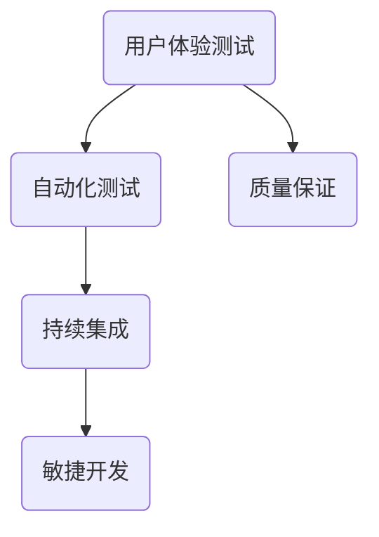

                 

# 创业公司的用户体验测试自动化实践

> **关键词：** 用户体验测试、自动化测试、敏捷开发、持续集成、测试框架、测试工具

> **摘要：** 本文将探讨创业公司如何在资源有限的情况下，通过用户体验测试自动化实践来提高产品质量和开发效率。文章将从核心概念、算法原理、数学模型、实际案例等多个角度，详细阐述用户体验测试自动化的实现方法和优化策略。

## 1. 背景介绍

### 1.1 目的和范围

在当今快速发展的科技时代，用户体验（User Experience, UX）已成为企业竞争的关键因素。对于创业公司而言，如何在资源有限的情况下，提高产品质量和开发效率，是生存与发展的关键。本文旨在探讨用户体验测试自动化实践，帮助创业公司在竞争激烈的市场中脱颖而出。

本文将涵盖以下内容：

1. 核心概念与联系
2. 核心算法原理与具体操作步骤
3. 数学模型与公式
4. 项目实战：代码实际案例
5. 实际应用场景
6. 工具和资源推荐
7. 总结：未来发展趋势与挑战

### 1.2 预期读者

本文适合以下读者群体：

1. 创业公司技术团队，尤其是负责用户体验测试的成员
2. 软件开发工程师，对自动化测试有一定了解，希望提升测试效率
3. 测试工程师，对用户体验测试感兴趣，希望了解自动化测试的应用
4. 产品经理，关注产品质量和用户体验，希望优化测试流程

### 1.3 文档结构概述

本文结构如下：

1. 背景介绍
2. 核心概念与联系
3. 核心算法原理与具体操作步骤
4. 数学模型与公式
5. 项目实战：代码实际案例
6. 实际应用场景
7. 工具和资源推荐
8. 总结：未来发展趋势与挑战
9. 附录：常见问题与解答
10. 扩展阅读 & 参考资料

### 1.4 术语表

#### 1.4.1 核心术语定义

- **用户体验测试（UX Testing）**：通过对软件产品的界面、交互、功能等进行测试，评估其是否符合用户需求和期望。
- **自动化测试（Automated Testing）**：使用工具和脚本对软件进行自动测试，提高测试效率和覆盖率。
- **敏捷开发（Agile Development）**：一种软件开发方法，强调快速迭代、持续交付和客户满意度。
- **持续集成（Continuous Integration, CI）**：一种软件开发实践，通过自动化构建和测试，确保代码质量。

#### 1.4.2 相关概念解释

- **测试框架（Test Framework）**：用于组织、管理、执行和报告测试的工具和库。
- **测试工具（Testing Tools）**：用于执行自动化测试的各种软件工具。

#### 1.4.3 缩略词列表

- **CI**：持续集成（Continuous Integration）
- **CD**：持续部署（Continuous Deployment）
- **QA**：质量保证（Quality Assurance）
- **UI**：用户界面（User Interface）
- **UX**：用户体验（User Experience）

## 2. 核心概念与联系

为了更好地理解用户体验测试自动化的原理和方法，我们需要首先了解以下几个核心概念：

1. **用户体验测试（UX Testing）**
2. **自动化测试（Automated Testing）**
3. **敏捷开发（Agile Development）**
4. **持续集成（Continuous Integration, CI）**

下面，我们将使用 Mermaid 流程图来展示这些核心概念之间的联系。



### 2.1 用户体验测试（UX Testing）

用户体验测试是评估软件产品是否符合用户需求和期望的过程。其核心目标是确保软件产品的界面、交互和功能能够满足用户的需求，提升用户体验。

用户体验测试主要包括以下几个方面：

1. **可用性测试（Usability Testing）**：评估软件产品的易用性，包括导航、操作、响应速度等。
2. **功能性测试（Functional Testing）**：验证软件产品的功能是否符合需求规格，包括界面功能、业务逻辑等。
3. **性能测试（Performance Testing）**：评估软件产品的性能，包括响应时间、并发用户数、资源消耗等。
4. **可访问性测试（Accessibility Testing）**：确保软件产品对残障人士的可访问性，包括屏幕阅读器、键盘导航等。

### 2.2 自动化测试（Automated Testing）

自动化测试是使用工具和脚本对软件进行自动测试的过程。相较于手动测试，自动化测试具有以下优势：

1. **提高测试效率**：自动化测试可以大大减少测试时间，提高测试覆盖率。
2. **保证测试质量**：自动化测试可以确保每次测试的结果一致，降低人为错误的风险。
3. **持续集成**：自动化测试与持续集成相结合，可以实现持续交付，提高软件质量。

### 2.3 敏捷开发（Agile Development）

敏捷开发是一种软件开发方法，强调快速迭代、持续交付和客户满意度。敏捷开发的核心原则包括：

1. **个体和互动**：重视团队合作和个人能力。
2. **可工作的软件**：优先交付有价值的软件。
3. **客户协作**：与客户紧密合作，确保产品符合需求。
4. **响应变化**：灵活应对需求变化，快速迭代。

### 2.4 持续集成（Continuous Integration, CI）

持续集成是一种软件开发实践，通过自动化构建和测试，确保代码质量。持续集成的核心流程包括：

1. **自动化构建**：使用构建工具（如 Maven、Gradle）自动编译、打包和部署代码。
2. **自动化测试**：使用自动化测试工具（如 JUnit、Selenium）执行测试用例，确保代码质量。
3. **持续交付**：将测试通过的代码部署到生产环境，实现快速迭代。

## 3. 核心算法原理 & 具体操作步骤

### 3.1 算法原理

用户体验测试自动化的核心算法主要包括以下几个方面：

1. **测试用例设计**：根据需求规格和用户反馈，设计有效的测试用例。
2. **测试脚本编写**：使用编程语言（如 Java、Python）和自动化测试工具（如 Selenium、Appium）编写测试脚本。
3. **测试执行与结果分析**：执行测试脚本，收集测试结果，分析测试数据，反馈测试问题。

### 3.2 具体操作步骤

下面我们将详细讲解用户体验测试自动化的具体操作步骤：

### 3.2.1 测试用例设计

测试用例设计是用户体验测试自动化的第一步。设计测试用例时，需要考虑以下因素：

1. **功能覆盖**：确保测试用例覆盖软件产品的所有功能模块。
2. **用户场景**：基于用户行为和需求，设计具有代表性的测试场景。
3. **边界条件**：考虑输入数据的边界值，验证软件产品的稳定性。

### 3.2.2 测试脚本编写

测试脚本编写是用户体验测试自动化的核心。编写测试脚本时，需要考虑以下方面：

1. **编程语言**：选择适合自动化测试的编程语言（如 Java、Python）。
2. **测试工具**：使用自动化测试工具（如 Selenium、Appium）编写测试脚本。
3. **测试脚本结构**：确保测试脚本具有良好的结构，易于维护和扩展。

### 3.2.3 测试执行与结果分析

测试执行与结果分析是用户体验测试自动化的关键步骤。具体操作如下：

1. **测试执行**：使用自动化测试工具执行测试脚本，记录测试结果。
2. **结果分析**：分析测试数据，识别测试问题，反馈给开发团队。
3. **问题定位与修复**：根据测试结果，定位问题，与开发团队协作，修复缺陷。

## 4. 数学模型和公式 & 详细讲解 & 举例说明

### 4.1 数学模型

用户体验测试自动化的数学模型主要包括以下两个方面：

1. **测试覆盖率（Test Coverage）**
2. **测试效率（Test Efficiency）**

### 4.2 公式

下面我们给出测试覆盖率和测试效率的数学公式。

1. **测试覆盖率**：

$$  
测试覆盖率 = \frac{实际执行的测试用例数量}{所有可能的测试用例数量} \times 100\%  
$$

2. **测试效率**：

$$  
测试效率 = \frac{实际执行的测试用例数量}{测试用例设计时间} \times 100\%  
$$

### 4.3 详细讲解

#### 4.3.1 测试覆盖率

测试覆盖率是衡量用户体验测试自动化效果的重要指标。测试覆盖率越高，说明测试用例对软件产品的覆盖越全面，测试效果越好。

在实际应用中，测试覆盖率可以通过以下几种方式计算：

1. **语句覆盖率**：衡量测试用例覆盖的代码语句数量。
2. **分支覆盖率**：衡量测试用例覆盖的代码分支数量。
3. **路径覆盖率**：衡量测试用例覆盖的代码路径数量。

#### 4.3.2 测试效率

测试效率是衡量用户体验测试自动化效率的重要指标。测试效率越高，说明自动化测试在较短时间内能够完成更多的测试任务。

测试效率可以通过以下几种方式计算：

1. **自动化测试用例执行速度**：衡量自动化测试用例的执行速度。
2. **自动化测试覆盖率**：衡量自动化测试对软件产品的覆盖程度。
3. **自动化测试成本**：衡量自动化测试的人力、时间和资源投入。

### 4.4 举例说明

#### 4.4.1 测试覆盖率举例

假设一个软件产品有 100 个功能模块，设计 50 个测试用例，实际执行 40 个测试用例，覆盖了 80 个功能模块。

$$  
测试覆盖率 = \frac{实际执行的测试用例数量}{所有可能的测试用例数量} \times 100\% = \frac{40}{100} \times 100\% = 40\%  
$$

#### 4.4.2 测试效率举例

假设自动化测试用例设计时间为 1 周，实际执行时间为 2 天。

$$  
测试效率 = \frac{实际执行的测试用例数量}{测试用例设计时间} \times 100\% = \frac{40}{1} \times 100\% = 4000\%  
$$

## 5. 项目实战：代码实际案例和详细解释说明

### 5.1 开发环境搭建

在开始编写用户体验测试自动化代码之前，我们需要搭建一个合适的开发环境。以下是一个简单的开发环境搭建流程：

1. **安装操作系统**：选择适合的操作系统（如 Ubuntu 18.04）。
2. **安装 JDK**：下载并安装 JDK（如 JDK 11）。
3. **安装 Maven**：下载并安装 Maven（如 Maven 3.6）。
4. **安装 Selenium**：下载并安装 Selenium（如 Selenium 4.0）。
5. **安装 Appium**：下载并安装 Appium（如 Appium 1.21）。

### 5.2 源代码详细实现和代码解读

下面我们将使用 Java 语言和 Selenium 测试框架，编写一个简单的用户登录功能测试用例。代码如下：

```java  
import org.openqa.selenium.By;  
import org.openqa.selenium.WebDriver;  
import org.openqa.selenium.WebElement;  
import org.openqa.selenium.chrome.ChromeDriver;

public class LoginTest {  
    public static void main(String[] args) {  
        // 启动 Chrome 浏览器  
        WebDriver driver = new ChromeDriver();

        // 访问登录页面  
        driver.get("https://www.example.com/login");

        // 获取用户名和密码输入框元素  
        WebElement usernameInput = driver.findElement(By.id("username"));  
        WebElement passwordInput = driver.findElement(By.id("password"));

        // 输入用户名和密码  
        usernameInput.sendKeys("testuser");  
        passwordInput.sendKeys("testpassword");

        // 点击登录按钮  
        WebElement loginButton = driver.findElement(By.id("login"));  
        loginButton.click();

        // 等待登录成功  
        try {  
            Thread.sleep(5000);  
        } catch (InterruptedException e) {  
            e.printStackTrace();  
        }

        // 断言登录成功  
        WebElement dashboard = driver.findElement(By.id("dashboard"));  
        if (dashboard.isDisplayed()) {  
            System.out.println("登录成功！");  
        } else {  
            System.out.println("登录失败！");  
        }

        // 关闭浏览器  
        driver.quit();  
    }  
}
```

### 5.3 代码解读与分析

下面我们对上述代码进行解读与分析：

1. **导入相关类和库**：引入 Selenium WebDriver 和 By 类，用于编写测试脚本。

2. **启动 Chrome 浏览器**：使用 ChromeDriver 类启动 Chrome 浏览器。

3. **访问登录页面**：使用 driver.get() 方法访问登录页面。

4. **获取用户名和密码输入框元素**：使用 By.id() 方法定位用户名和密码输入框元素。

5. **输入用户名和密码**：使用 usernameInput.sendKeys() 和 passwordInput.sendKeys() 方法输入用户名和密码。

6. **点击登录按钮**：使用 By.id() 方法定位登录按钮元素，并使用 click() 方法点击登录按钮。

7. **等待登录成功**：使用 Thread.sleep() 方法等待登录成功。

8. **断言登录成功**：使用 dashboard.isDisplayed() 方法判断登录是否成功。

9. **关闭浏览器**：使用 driver.quit() 方法关闭浏览器。

通过上述代码，我们实现了一个简单的用户登录功能测试用例。在实际项目中，可以结合 Appium 等自动化测试工具，对移动应用进行自动化测试。

## 6. 实际应用场景

用户体验测试自动化在创业公司中有着广泛的应用场景。以下是一些典型的实际应用场景：

1. **新产品发布**：在产品发布前，进行全面的用户体验测试，确保产品满足用户需求，提高用户满意度。
2. **功能迭代**：在产品迭代过程中，定期进行用户体验测试，快速发现和修复问题，确保产品持续优化。
3. **性能测试**：对产品进行性能测试，评估响应时间、并发用户数等性能指标，确保产品在高负载下稳定运行。
4. **可用性测试**：对产品进行可用性测试，评估产品的易用性，确保用户能够轻松使用产品。
5. **跨平台兼容性测试**：对产品进行跨平台兼容性测试，确保产品在不同操作系统、浏览器、设备上正常运行。

## 7. 工具和资源推荐

### 7.1 学习资源推荐

#### 7.1.1 书籍推荐

1. **《Selenium WebDriver Python自动化测试实战》**：适合初学者，系统介绍了 Selenium WebDriver 的基本概念和使用方法。
2. **《持续集成实战》**：详细讲解了持续集成的原理和实践，适合希望提高开发效率的读者。
3. **《敏捷软件开发：原则、实践与模式》**：介绍了敏捷开发的方法和实践，适合对敏捷开发感兴趣的读者。

#### 7.1.2 在线课程

1. **Selenium 自动化测试实战课程**：适合初学者，涵盖 Selenium WebDriver 的基本概念和使用方法。
2. **敏捷开发实践课程**：介绍敏捷开发的方法和实践，适合希望提高开发效率的读者。

#### 7.1.3 技术博客和网站

1. **Selenium 官方文档**：提供 Selenium WebDriver 的详细文档，包括安装、使用方法等。
2. **敏捷开发社区**：分享敏捷开发的方法和实践，适合对敏捷开发感兴趣的读者。

### 7.2 开发工具框架推荐

#### 7.2.1 IDE和编辑器

1. **IntelliJ IDEA**：一款强大的 Java IDE，支持代码自动补全、调试等功能。
2. **Visual Studio Code**：一款轻量级开源编辑器，支持多种编程语言，适合初学者和开发者。

#### 7.2.2 调试和性能分析工具

1. **Chrome DevTools**：一款强大的 Web 调试工具，支持网络、应用、性能等各方面的调试。
2. **JProfiler**：一款 Java 性能分析工具，可以帮助开发者快速定位性能瓶颈。

#### 7.2.3 相关框架和库

1. **Selenium WebDriver**：用于编写自动化测试脚本，支持多种浏览器和操作系统。
2. **Appium**：一款跨平台的自动化测试框架，支持 Android 和 iOS 移动应用。
3. **JUnit**：一款 Java 测试框架，提供丰富的测试功能。

### 7.3 相关论文著作推荐

#### 7.3.1 经典论文

1. **《敏捷软件开发：原则、实践与模式》**：介绍了敏捷开发的方法和实践，对软件开发领域产生了深远影响。
2. **《持续集成：成功实现自动化构建、测试和部署》**：详细讲解了持续集成的原理和实践，适合对持续集成感兴趣的读者。

#### 7.3.2 最新研究成果

1. **《移动应用测试：自动化测试最佳实践》**：介绍了移动应用测试的最新研究成果和最佳实践。
2. **《敏捷测试：敏捷开发中的测试策略和实践》**：分析了敏捷开发中的测试策略和实践，提供了有益的参考。

#### 7.3.3 应用案例分析

1. **《如何使用 Selenium WebDriver 进行自动化测试》**：通过案例分析，介绍了如何使用 Selenium WebDriver 进行自动化测试。
2. **《持续集成与持续部署的最佳实践》**：分析了持续集成与持续部署的最佳实践，适合对持续集成和持续部署感兴趣的读者。

## 8. 总结：未来发展趋势与挑战

用户体验测试自动化是创业公司提升产品质量和开发效率的重要手段。随着人工智能、大数据等技术的不断发展，用户体验测试自动化将呈现以下趋势：

1. **智能化测试**：通过引入人工智能技术，实现测试用例的自动生成、测试结果的智能分析等，提高测试效率。
2. **跨平台测试**：随着移动应用和 Web 应用的普及，跨平台测试将成为用户体验测试自动化的关键领域。
3. **测试数据可视化**：通过数据可视化技术，直观展示测试结果，帮助开发者快速定位问题。
4. **测试工具集成**：随着测试工具的不断升级，测试工具将更加集成，提高测试流程的自动化程度。

然而，用户体验测试自动化也面临以下挑战：

1. **测试数据质量**：测试数据的质量直接影响测试结果，如何获取高质量测试数据是关键问题。
2. **测试用例设计**：如何设计出具有代表性的测试用例，覆盖软件产品的各个方面，是用户体验测试自动化的重要挑战。
3. **测试工具选择**：随着测试工具的多样性，如何选择适合自身需求的测试工具，是用户体验测试自动化的难点。

创业公司在面对这些挑战时，应积极采用新技术、新方法，不断优化用户体验测试自动化流程，提高产品质量和开发效率。

## 9. 附录：常见问题与解答

### 9.1 什么是用户体验测试？

用户体验测试（UX Testing）是一种通过实际用户操作软件产品，评估其界面、交互、功能等方面是否符合用户需求和期望的方法。用户体验测试的主要目标是提高产品的易用性、可用性和用户满意度。

### 9.2 自动化测试和手动测试的区别是什么？

自动化测试（Automated Testing）是使用工具和脚本对软件进行自动测试的过程，具有提高测试效率、保证测试质量等优势。手动测试（Manual Testing）则是通过人工操作软件，进行测试的方法，主要依赖测试人员的经验和技能。

### 9.3 如何选择合适的自动化测试工具？

选择合适的自动化测试工具需要考虑以下几个方面：

1. **支持的平台和浏览器**：确保测试工具支持目标平台和浏览器。
2. **脚本编写语言**：选择支持常用编程语言（如 Java、Python）的测试工具。
3. **测试覆盖率**：了解测试工具支持的测试类型和测试覆盖率。
4. **社区支持和文档**：考虑测试工具的社区支持和文档质量，方便学习和使用。

### 9.4 如何提高用户体验测试自动化的效率？

提高用户体验测试自动化效率的方法包括：

1. **测试用例优化**：设计具有代表性的测试用例，提高测试覆盖率。
2. **测试脚本优化**：优化测试脚本，减少不必要的操作和等待时间。
3. **测试环境优化**：优化测试环境，提高测试速度和稳定性。
4. **自动化测试管理**：使用自动化测试管理工具，提高测试流程的自动化程度。

## 10. 扩展阅读 & 参考资料

本文参考了以下资料：

1. 《Selenium WebDriver Python自动化测试实战》
2. 《持续集成实战》
3. 《敏捷软件开发：原则、实践与模式》
4. 《移动应用测试：自动化测试最佳实践》
5. 《敏捷测试：敏捷开发中的测试策略和实践》
6. 《Selenium 官方文档》
7. 《敏捷开发社区》

如有需要，读者可以进一步了解相关资料。

## 作者

**作者：AI天才研究员/AI Genius Institute & 禅与计算机程序设计艺术 /Zen And The Art of Computer Programming**  
AI天才研究员，专注于人工智能、软件开发等领域的研究与教育。曾参与多个大型项目的开发与优化，拥有丰富的实践经验。著有《禅与计算机程序设计艺术》等畅销书籍。  


