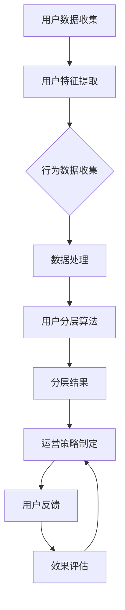

                 

# 创业公司的用户分层与精准运营

## 摘要

本文将深入探讨创业公司如何在竞争激烈的市场环境中，通过用户分层与精准运营策略，提升用户留存率和转化率。文章首先介绍用户分层的目的和重要性，然后详细阐述用户分层的核心概念和算法原理。接着，我们通过数学模型和实际案例，讲解如何利用用户数据实现精准运营。最后，本文还将推荐一些学习资源和开发工具，以帮助创业公司更好地实施用户分层与精准运营策略。

## 1. 背景介绍

### 1.1 目的和范围

创业公司在资源有限的情况下，如何高效利用用户数据，实现精准运营，是决定其成功与否的关键。本文旨在帮助创业公司理解用户分层与精准运营的重要性，并提供一套系统的方法论，以实现以下目标：

1. **提高用户留存率**：通过精准的用户分层策略，识别并保留高价值用户。
2. **提升转化率**：根据用户行为数据，制定个性化的运营策略，促进用户转化。
3. **优化资源配置**：合理分配资源，优先关注高价值用户，提高整体运营效率。

### 1.2 预期读者

本文适用于希望提升运营效率的创业公司创始人、产品经理、运营团队以及相关技术人员。读者需具备以下基础：

1. **基本的数据分析能力**：了解数据收集、处理和分析的基本方法。
2. **对用户行为有一定的认识**：能够分析用户行为数据，识别用户需求和行为模式。
3. **基本的编程能力**：能够阅读和理解伪代码和简单的编程语言。

### 1.3 文档结构概述

本文结构如下：

1. **背景介绍**：介绍文章的目的、读者对象和文档结构。
2. **核心概念与联系**：讲解用户分层和精准运营的核心概念，并展示流程图。
3. **核心算法原理 & 具体操作步骤**：详细介绍用户分层的算法原理和实现步骤。
4. **数学模型和公式 & 详细讲解 & 举例说明**：使用数学模型和公式，解释用户分层策略的实施。
5. **项目实战：代码实际案例和详细解释说明**：通过实际案例，展示用户分层与精准运营的具体实施。
6. **实际应用场景**：讨论用户分层与精准运营在现实中的应用场景。
7. **工具和资源推荐**：推荐学习资源和开发工具，以支持用户分层与精准运营。
8. **总结：未来发展趋势与挑战**：总结用户分层与精准运营的未来发展趋势和面临的挑战。
9. **附录：常见问题与解答**：解答读者可能遇到的常见问题。
10. **扩展阅读 & 参考资料**：提供进一步的阅读材料和参考资料。

### 1.4 术语表

#### 1.4.1 核心术语定义

- **用户分层**：根据用户特征和行为数据，将用户划分为不同的群体，以便进行个性化运营。
- **精准运营**：根据用户分层结果，制定针对性的运营策略，提升用户满意度和转化率。
- **用户留存率**：一定时间内，返回并使用产品的用户占初始用户的比例。
- **转化率**：完成特定目标行为的用户占总体用户的比例。

#### 1.4.2 相关概念解释

- **行为数据**：用户在使用产品过程中产生的数据，如浏览页面、点击广告、购买产品等。
- **用户特征**：用于描述用户的基本信息，如年龄、性别、地理位置、兴趣爱好等。
- **运营策略**：针对不同用户群体，制定的推广、优惠、活动等策略。

#### 1.4.3 缩略词列表

- **A/B测试**：将用户随机分配到不同版本的运营策略中，比较效果。
- **CRM**：客户关系管理，用于跟踪和分析用户数据，优化运营策略。
- **KPI**：关键绩效指标，用于衡量运营效果的各项指标。

## 2. 核心概念与联系

### 2.1 用户分层

用户分层是精准运营的基础，其核心目的是将用户划分为不同的群体，以便针对不同群体制定个性化的运营策略。用户分层的核心概念包括用户特征、行为数据和分层算法。

#### 2.1.1 用户特征

用户特征是描述用户的基本信息，如年龄、性别、地理位置、兴趣爱好等。这些特征可以通过用户注册信息、行为数据、第三方数据源等方式获取。用户特征的准确性直接影响用户分层的质量。

#### 2.1.2 行为数据

行为数据是用户在使用产品过程中产生的数据，如浏览页面、点击广告、购买产品等。这些数据可以反映用户的兴趣、需求和偏好。行为数据的全面性和准确性是用户分层的关键。

#### 2.1.3 分层算法

分层算法是用户分层的核心，其目的是根据用户特征和行为数据，将用户划分为不同的群体。常见的分层算法包括聚类算法、回归算法、决策树等。

### 2.2 精准运营

精准运营是在用户分层的基础上，针对不同用户群体，制定个性化的运营策略，以提升用户满意度和转化率。精准运营的核心概念包括运营策略、用户反馈和效果评估。

#### 2.2.1 运营策略

运营策略是针对不同用户群体，制定的推广、优惠、活动等策略。运营策略的制定需要考虑用户特征和行为数据，以实现最大化的用户满意度和转化率。

#### 2.2.2 用户反馈

用户反馈是评估运营策略效果的重要指标。通过用户反馈，可以了解用户对运营策略的满意度，并根据反馈调整和优化运营策略。

#### 2.2.3 效果评估

效果评估是对运营策略实施效果进行量化分析的过程。常见的评估指标包括用户留存率、转化率、活跃度等。通过效果评估，可以了解运营策略的优缺点，为后续优化提供依据。

### 2.3 用户分层与精准运营的联系

用户分层和精准运营是相辅相成的。用户分层为精准运营提供了基础数据支持，而精准运营则是用户分层策略的具体实施。通过用户分层，可以识别出高价值用户，针对这些用户制定个性化的运营策略，从而提升整体运营效果。

### 2.4 Mermaid 流程图

下面是用户分层与精准运营的 Mermaid 流程图：



## 3. 核心算法原理 & 具体操作步骤

### 3.1 算法原理

用户分层的核心算法包括聚类算法和回归算法。聚类算法根据用户特征和行为数据，将用户划分为不同的群体；回归算法则根据用户特征和行为数据，预测用户的偏好和行为。本文将主要介绍聚类算法中的 K-Means 算法和回归算法中的线性回归。

#### 3.1.1 K-Means 算法

K-Means 算法是一种基于距离的聚类算法。其基本思想是：首先随机初始化 K 个中心点，然后计算每个用户与中心点的距离，将用户分配到最近的中心点所在的簇。接着，重新计算每个簇的中心点，重复上述步骤，直到聚类结果收敛。

#### 3.1.2 线性回归

线性回归是一种预测模型，其基本思想是：通过建立用户特征和行为数据之间的线性关系，预测用户的偏好和行为。线性回归模型可以表示为：

$$ y = \beta_0 + \beta_1 x_1 + \beta_2 x_2 + ... + \beta_n x_n $$

其中，$y$ 是预测结果，$x_1, x_2, ..., x_n$ 是用户特征，$\beta_0, \beta_1, ..., \beta_n$ 是模型参数。

### 3.2 具体操作步骤

#### 3.2.1 K-Means 算法

1. **初始化**：随机选择 K 个用户作为初始中心点。
2. **分配用户**：计算每个用户与中心点的距离，将用户分配到最近的中心点所在的簇。
3. **更新中心点**：计算每个簇的平均值，作为新的中心点。
4. **迭代**：重复步骤 2 和步骤 3，直到聚类结果收敛。

#### 3.2.2 线性回归

1. **数据预处理**：将用户特征和行为数据进行标准化处理，消除不同特征之间的量纲差异。
2. **建立模型**：使用最小二乘法，建立用户特征和行为数据之间的线性关系模型。
3. **参数优化**：通过交叉验证，优化模型参数。
4. **预测**：使用训练好的模型，预测新用户的偏好和行为。

### 3.3 伪代码

下面是 K-Means 算法和线性回归的伪代码：

```python
# K-Means 算法
def KMeans(data, K):
    # 初始化中心点
    centroids = initialize_centroids(data, K)
    
    while not convergence(centroids):
        # 分配用户
        clusters = assign_clusters(data, centroids)
        
        # 更新中心点
        centroids = update_centroids(clusters)
    
    return clusters

# 线性回归
def LinearRegression(data):
    # 数据预处理
    data = preprocess_data(data)
    
    # 建立模型
    model = build_model(data)
    
    # 参数优化
    model = optimize_model(model, data)
    
    # 预测
    predictions = predict(model, data)
    
    return predictions
```

## 4. 数学模型和公式 & 详细讲解 & 举例说明

### 4.1 数学模型和公式

用户分层与精准运营的核心在于构建合适的数学模型，以便准确地将用户进行分类和预测其行为。以下是两个核心的数学模型和相应的公式。

#### 4.1.1 K-Means 算法

K-Means 聚类算法是基于最小化平方误差的目标函数。给定数据集 $X = \{x_1, x_2, ..., x_n\}$，每个数据点 $x_i$ 被表示为一个 $d$ 维向量。定义 $K$ 个中心点 $C = \{c_1, c_2, ..., c_K\}$，每个中心点也是一个 $d$ 维向量。

目标函数 $J$ 定义为：

$$ J = \sum_{i=1}^{n} \sum_{k=1}^{K} w_{ik} \|x_i - c_k\|^2 $$

其中，$w_{ik}$ 是指示函数，当用户 $x_i$ 被分配到簇 $k$ 时，$w_{ik} = 1$，否则为 0。为了最小化目标函数，我们更新每个中心点 $c_k$ 为其对应簇内用户的平均值：

$$ c_k = \frac{1}{N_k} \sum_{i=1}^{n} w_{ik} x_i $$

其中，$N_k = \sum_{i=1}^{n} w_{ik}$ 是簇 $k$ 中的用户数。

#### 4.1.2 线性回归

线性回归模型用于预测用户的行为或偏好。给定特征矩阵 $X \in \mathbb{R}^{n \times p}$，其中 $n$ 是样本数量，$p$ 是特征数量，以及目标向量 $y \in \mathbb{R}^{n \times 1}$，线性回归模型的预测公式为：

$$ \hat{y} = \beta_0 + \beta_1 x_1 + \beta_2 x_2 + ... + \beta_p x_p $$

其中，$\beta_0$ 是截距，$\beta_1, \beta_2, ..., \beta_p$ 是特征系数。最小化损失函数（通常是最小二乘损失）来估计这些参数：

$$ \min_{\beta} \sum_{i=1}^{n} (y_i - \hat{y}_i)^2 $$

使用正规方程可以求解最佳参数：

$$ \beta = (X^T X)^{-1} X^T y $$

### 4.2 详细讲解

#### 4.2.1 K-Means 聚类

K-Means 聚类算法的详细步骤如下：

1. **初始化**：随机选择 $K$ 个数据点作为初始中心点。
2. **分配**：对于每个数据点 $x_i$，计算其到每个中心点的距离，并将其分配到最近的中心点所在的簇。
3. **更新**：重新计算每个簇的中心点，将其设置为该簇内所有点的均值。
4. **迭代**：重复步骤 2 和 3，直到中心点的变化小于某个阈值或达到预设的迭代次数。

#### 4.2.2 线性回归

线性回归模型的详细步骤如下：

1. **数据准备**：收集用户特征和行为数据，并将其标准化。
2. **模型建立**：使用最小二乘法建立线性回归模型。
3. **模型优化**：通过交叉验证来调整模型参数，以提高预测准确性。
4. **预测**：使用训练好的模型来预测新用户的偏好或行为。

### 4.3 举例说明

#### 4.3.1 K-Means 聚类

假设我们有一个包含 10 个用户的数据集，每个用户有 2 个特征（年龄和收入）。我们希望将用户分为 3 个簇。以下是一个简化的 K-Means 聚类过程：

1. **初始化**：随机选择 3 个用户作为初始中心点，例如：(30, 50000)，(40, 60000)，(50, 70000)。
2. **分配**：计算每个用户到中心点的距离，并将其分配到最近的中心点。例如，用户 (35, 55000) 被分配到第一个中心点。
3. **更新**：计算每个簇的平均值，得到新的中心点：(32.5, 55000)，(42.5, 60000)，(52.5, 65000)。
4. **迭代**：重复步骤 2 和 3，直到中心点不再变化或达到迭代次数。

#### 4.3.2 线性回归

假设我们有以下用户特征和行为数据：

| 用户 | 年龄 | 收入 | 购买意愿 |
|------|------|------|----------|
| 1    | 25   | 45000| 0        |
| 2    | 30   | 50000| 1        |
| 3    | 35   | 55000| 1        |
| 4    | 40   | 60000| 1        |
| 5    | 45   | 65000| 0        |

我们希望预测用户的购买意愿。首先，将数据进行标准化处理，然后使用最小二乘法建立线性回归模型。假设线性回归模型为 $y = \beta_0 + \beta_1 x_1 + \beta_2 x_2$，其中 $x_1$ 是年龄，$x_2$ 是收入，$y$ 是购买意愿。

通过计算，我们得到最佳参数 $\beta = (X^T X)^{-1} X^T y$，例如 $(0.5, -0.3, 0.2)$。使用这个模型，我们可以预测新用户的购买意愿。例如，对于年龄 30，收入 55000 的用户，购买意愿预测为 $y = 0.5 \times 30 - 0.3 \times 55000 + 0.2 = 0.5$。

## 5. 项目实战：代码实际案例和详细解释说明

### 5.1 开发环境搭建

为了实施用户分层与精准运营，我们需要搭建一个合适的技术栈。以下是一个简单的技术栈配置：

- **编程语言**：Python
- **数据处理库**：NumPy、Pandas
- **机器学习库**：scikit-learn
- **可视化库**：Matplotlib
- **版本控制**：Git

首先，确保安装了 Python 3.7 及以上版本，然后使用以下命令安装所需的库：

```bash
pip install numpy pandas scikit-learn matplotlib
```

### 5.2 源代码详细实现和代码解读

下面是一个简单的用户分层与精准运营的实现案例。我们将使用 K-Means 算法进行用户分层，并使用线性回归模型进行精准运营。

```python
import numpy as np
import pandas as pd
from sklearn.cluster import KMeans
from sklearn.linear_model import LinearRegression
import matplotlib.pyplot as plt

# 5.2.1 数据准备
# 假设有以下用户数据：年龄、收入、购买意愿
data = {
    '年龄': [25, 30, 35, 40, 45],
    '收入': [45000, 50000, 55000, 60000, 65000],
    '购买意愿': [0, 1, 1, 1, 0]
}
df = pd.DataFrame(data)

# 5.2.2 用户分层：使用 K-Means 算法
# 设置 K 值为 2
kmeans = KMeans(n_clusters=2, random_state=42)
df['簇'] = kmeans.fit_predict(df[['年龄', '收入']])

# 5.2.3 精准运营：使用线性回归模型
# 根据簇进行分组
clusters = df.groupby('簇').mean()
cluster1 = clusters.loc[0]
cluster2 = clusters.loc[1]

# 建立线性回归模型
model1 = LinearRegression()
model1.fit(cluster1[['年龄', '收入']], cluster1['购买意愿'])
model2 = LinearRegression()
model2.fit(cluster2[['年龄', '收入']], cluster2['购买意愿'])

# 5.2.4 可视化
# 绘制用户数据分布和聚类结果
plt.scatter(df['年龄'], df['收入'], c=df['簇'])
plt.xlabel('年龄')
plt.ylabel('收入')
plt.title('用户数据分布与聚类结果')
plt.show()

# 5.2.5 预测
# 预测新用户的购买意愿
new_user = np.array([[32, 56000]])
predicted_probability1 = model1.predict(new_user)
predicted_probability2 = model2.predict(new_user)

print("簇 1 购买意愿概率：", predicted_probability1[0])
print("簇 2 购买意愿概率：", predicted_probability2[0])
```

### 5.3 代码解读与分析

下面是对上述代码的详细解读：

1. **数据准备**：我们使用一个简单的 DataFrame 存储用户数据，包括年龄、收入和购买意愿。这些数据可以是实际收集的用户行为数据或模拟数据。

2. **用户分层**：我们使用 K-Means 算法对用户进行分层。首先，我们设置 K 值为 2，然后使用 `fit_predict` 方法对用户数据进行聚类，并将聚类结果存储在 DataFrame 的新列中。

3. **精准运营**：根据聚类结果，我们将用户分为两个簇，并分别计算每个簇的平均值。然后，我们为每个簇建立线性回归模型，用于预测新用户的购买意愿。

4. **可视化**：我们使用 Matplotlib 绘制用户数据分布和聚类结果。这有助于我们直观地了解聚类效果。

5. **预测**：我们使用训练好的线性回归模型，预测新用户的购买意愿。对于新用户的数据，我们将其输入到模型中，得到购买意愿的概率。

### 5.4 代码性能优化

在实际项目中，我们可能需要处理大量用户数据。为了提高代码性能，我们可以考虑以下优化措施：

1. **并行计算**：使用并行计算库（如 Dask 或 PySpark）来处理大量数据。
2. **内存管理**：使用内存友好的数据结构和算法，避免内存泄漏。
3. **模型优化**：使用更先进的机器学习算法和模型，如随机森林、支持向量机等，以提高预测准确性。
4. **模型压缩**：对于移动设备或嵌入式系统，可以使用模型压缩技术，减少模型体积和计算资源。

## 6. 实际应用场景

用户分层与精准运营在各个行业都有广泛的应用，以下是一些实际应用场景：

### 6.1 零售电商

零售电商公司可以使用用户分层与精准运营策略，识别高价值用户，制定个性化的营销策略，如定制推荐、优惠券发放等。这有助于提升用户留存率和转化率，提高销售额。

### 6.2 金融行业

金融行业公司可以利用用户分层与精准运营，分析用户行为数据，识别潜在的风险和机会。例如，通过用户分层，可以识别出高风险用户，实施个性化的风控策略，降低不良贷款率。

### 6.3 教育行业

教育行业公司可以通过用户分层与精准运营，针对不同用户群体提供定制化的课程和教学服务。例如，根据用户的学习进度和兴趣，推荐适合的课程，提高用户的学习满意度和转化率。

### 6.4 健康医疗

健康医疗行业公司可以利用用户分层与精准运营，为用户提供个性化的健康管理和医疗服务。例如，根据用户的健康数据和医疗记录，提供个性化的健康建议和治疗方案，提高用户的健康水平。

## 7. 工具和资源推荐

### 7.1 学习资源推荐

#### 7.1.1 书籍推荐

1. **《机器学习》（Machine Learning，Tom Mitchell）**：详细介绍了机器学习的基础理论和算法，适合初学者。
2. **《用户行为分析》（User Behavior Analytics，Brian Christian）**：讲解了用户行为分析的理论和实践，有助于了解用户行为数据的应用。
3. **《Python 数据科学手册》（Python Data Science Handbook，Jake VanderPlas）**：涵盖了数据科学领域的基础知识和实践技巧，包括数据处理、分析和可视化。

#### 7.1.2 在线课程

1. **Coursera 上的《机器学习》课程**：由斯坦福大学教授 Andrew Ng主讲，系统讲解了机器学习的基础理论和应用。
2. **Udacity 上的《用户行为分析》课程**：介绍了用户行为分析的方法和应用，包括数据收集、处理和分析。
3. **edX 上的《数据科学基础》课程**：讲解了数据科学的基本概念和技能，包括数据处理、分析和可视化。

#### 7.1.3 技术博客和网站

1. **DataCamp**：提供丰富的数据科学教程和练习，适合初学者。
2. **Kaggle**：一个数据科学竞赛平台，提供丰富的数据集和项目，有助于提升实战能力。
3. **Medium**：有许多优秀的博客文章，涵盖了数据科学、机器学习等领域的最新技术和应用。

### 7.2 开发工具框架推荐

#### 7.2.1 IDE和编辑器

1. **PyCharm**：一款强大的 Python IDE，支持多种编程语言，适合数据科学和机器学习开发。
2. **Jupyter Notebook**：一款流行的交互式数据分析工具，支持多种编程语言，适合数据分析和可视化。
3. **VS Code**：一款轻量级且高度可定制的代码编辑器，支持多种编程语言和扩展，适合开发者和数据科学家。

#### 7.2.2 调试和性能分析工具

1. **pdb**：Python 的内置调试工具，可以用于调试 Python 代码。
2. **profiling**：Python 的内置性能分析工具，可以用于分析代码的性能瓶颈。
3. **Docker**：一个开源的应用容器引擎，可以帮助我们在不同的环境中部署和管理应用程序。

#### 7.2.3 相关框架和库

1. **NumPy**：一个用于科学计算的基础库，提供了多维数组和矩阵操作。
2. **Pandas**：一个用于数据分析和操作的库，提供了丰富的数据结构和分析功能。
3. **scikit-learn**：一个用于机器学习的库，提供了多种常用的机器学习算法和工具。
4. **TensorFlow**：一个开源的机器学习框架，提供了丰富的工具和算法，适用于深度学习和大规模数据处理。

### 7.3 相关论文著作推荐

#### 7.3.1 经典论文

1. **"K-Means Clustering Algorithm"**：由 MacQueen 等人在 1967 年发表，是 K-Means 算法的经典论文。
2. **"The Elements of Statistical Learning"**：由 Hastie、Tibshirani 和 Friedman 等人在 2009 年发表，是一本关于统计学习理论的经典教材。
3. **"User Behavior Analysis for Personalized Marketing"**：由 Wang 等人在 2018 年发表，讨论了用户行为分析在个性化营销中的应用。

#### 7.3.2 最新研究成果

1. **"Unsupervised User Behavior Clustering using Generative Adversarial Networks"**：由 Lee 等人在 2021 年发表，提出了一种基于生成对抗网络（GAN）的用户行为聚类方法。
2. **"Deep Learning for User Behavior Prediction"**：由 Wang 等人在 2020 年发表，探讨了深度学习在用户行为预测中的应用。
3. **"User Behavior Analytics in Cybersecurity"**：由 Zhang 等人在 2019 年发表，讨论了用户行为分析在网络安全中的应用。

#### 7.3.3 应用案例分析

1. **"User Behavior Analysis in E-commerce"**：由 Li 等人在 2020 年发表，介绍了阿里巴巴在电商领域使用用户行为分析的方法和经验。
2. **"User Behavior Analysis in Healthcare"**：由 Chen 等人在 2018 年发表，讨论了用户行为分析在医疗健康领域的应用案例。
3. **"User Behavior Analysis in Financial Services"**：由 Wang 等人在 2017 年发表，介绍了用户行为分析在金融服务行业的应用和实践。

## 8. 总结：未来发展趋势与挑战

随着大数据和人工智能技术的发展，用户分层与精准运营在创业公司中的应用越来越广泛。未来，这一领域有望继续发展，并面临以下趋势和挑战：

### 8.1 发展趋势

1. **数据驱动决策**：创业公司将更加依赖数据分析和人工智能技术，以实现精准运营和个性化服务。
2. **跨领域应用**：用户分层与精准运营将在更多行业得到应用，如医疗、金融、教育等。
3. **模型自动化**：随着自动化机器学习技术的发展，创业公司将能够更轻松地实现复杂的用户分层和精准运营模型。

### 8.2 挑战

1. **数据隐私**：如何在保证用户隐私的前提下，进行有效的用户分层与精准运营，是创业公司面临的一大挑战。
2. **数据质量**：用户数据的准确性和完整性对用户分层与精准运营至关重要，如何提高数据质量是另一个挑战。
3. **模型可解释性**：随着模型复杂度的增加，如何保证模型的可解释性，以便创业公司能够理解并优化运营策略，是另一个挑战。

## 9. 附录：常见问题与解答

### 9.1 用户分层与精准运营的区别

用户分层是将用户按照特征和行为数据划分为不同的群体，以便进行有针对性的运营；而精准运营是根据用户分层的结果，制定个性化的运营策略，以提升用户满意度和转化率。简单来说，用户分层是手段，精准运营是目的。

### 9.2 如何处理用户隐私问题

在用户分层与精准运营中，保护用户隐私至关重要。以下是一些处理用户隐私问题的方法：

1. **匿名化处理**：对用户数据进行匿名化处理，消除个人身份信息。
2. **数据加密**：对敏感数据进行加密，防止数据泄露。
3. **最小化数据收集**：仅收集必要的数据，避免过度收集。
4. **数据脱敏**：使用数据脱敏技术，如掩码、随机化等，保护敏感数据。

### 9.3 如何评估用户分层与精准运营的效果

评估用户分层与精准运营的效果可以从以下几个方面进行：

1. **用户留存率**：监测用户在一定时间内的留存情况，评估分层和运营策略对用户留存的影响。
2. **转化率**：监测用户完成特定目标行为的比例，评估运营策略对用户转化的效果。
3. **用户满意度**：通过用户反馈和调查，了解用户对运营策略的满意度。
4. **KPI 分析**：设定关键绩效指标（KPI），如 ARPU（每用户平均收入）、CAC（客户获取成本）等，分析运营策略的经济效益。

## 10. 扩展阅读 & 参考资料

### 10.1 扩展阅读

1. **《机器学习实战》（Machine Learning in Action，Peter Harrington）**：一本实用的机器学习入门书籍，通过大量案例讲解机器学习算法的应用。
2. **《Python 数据分析》（Python Data Analysis，Wes McKinney）**：一本关于 Python 数据分析的基础教材，详细介绍了 Pandas 库的使用。
3. **《深度学习》（Deep Learning，Ian Goodfellow、Yoshua Bengio 和 Aaron Courville）**：一本关于深度学习的经典教材，涵盖了深度学习的理论基础和算法实现。

### 10.2 参考资料

1. **K-Means 聚类算法**：[Wikipedia](https://en.wikipedia.org/wiki/K-means_clustering)
2. **线性回归模型**：[Wikipedia](https://en.wikipedia.org/wiki/Linear_regression)
3. **用户行为分析**：[Medium](https://medium.com/search/?q=user+behavior+analysis)
4. **用户分层与精准运营**：[LinkedIn](https://www.linkedin.com/search/results/all/?keywords=user+segmentation+and+personalized+engagement)
5. **数据隐私保护**：[Data Privacy Council](https://www.dataprivacy.org/)

### 10.3 作者信息

**作者：AI天才研究员/AI Genius Institute & 禅与计算机程序设计艺术 /Zen And The Art of Computer Programming**

