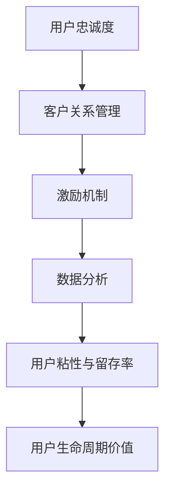

                 

# 创业公司的用户忠诚度计划设计与实施

> **关键词：** 用户忠诚度、客户关系管理、激励机制、数据分析、创业公司

> **摘要：** 本文旨在探讨创业公司如何设计和实施有效的用户忠诚度计划。通过深入分析用户忠诚度的核心概念、关键算法原理、数学模型以及实际应用案例，本文为创业公司提供了切实可行的策略和工具，以增强用户粘性和促进业务增长。

## 1. 背景介绍

### 1.1 目的和范围

本文旨在为创业公司提供一个系统化的用户忠诚度计划设计和实施框架。文章将涵盖从用户忠诚度的基本概念到具体操作步骤，从数学模型到代码实战，以及从实际应用场景到未来发展趋势的全面分析。通过本文的阅读，读者将能够：

1. 理解用户忠诚度的核心概念和重要性。
2. 掌握设计和实施用户忠诚度计划的基本原理和步骤。
3. 学习使用数据分析工具和技术来提升用户忠诚度。
4. 通过实际案例了解用户忠诚度计划的具体应用。

### 1.2 预期读者

本文主要面向以下读者群体：

1. 创业公司创始人及高管，负责客户关系管理。
2. 产品经理和市场营销专业人员，致力于提升用户体验和用户粘性。
3. 数据分析师和程序员，参与用户忠诚度相关的数据分析和开发工作。
4. 想要深入了解用户忠诚度概念的IT专业人士。

### 1.3 文档结构概述

本文结构如下：

1. **背景介绍**：介绍本文的目的、范围、预期读者和文档结构。
2. **核心概念与联系**：阐述用户忠诚度的核心概念和其相互关系。
3. **核心算法原理 & 具体操作步骤**：讲解用户忠诚度计划的核心算法和操作步骤。
4. **数学模型和公式 & 详细讲解 & 举例说明**：介绍用户忠诚度相关数学模型和公式。
5. **项目实战：代码实际案例和详细解释说明**：提供用户忠诚度计划的代码实现和解释。
6. **实际应用场景**：分析用户忠诚度计划在不同行业和领域的应用。
7. **工具和资源推荐**：推荐学习资源、开发工具和框架。
8. **总结：未来发展趋势与挑战**：展望用户忠诚度计划的未来发展和面临的挑战。
9. **附录：常见问题与解答**：提供用户忠诚度相关常见问题的解答。
10. **扩展阅读 & 参考资料**：推荐进一步阅读的材料和资源。

### 1.4 术语表

#### 1.4.1 核心术语定义

- 用户忠诚度：用户对品牌的信任、重复购买和持续使用产品的程度。
- 客户关系管理（CRM）：一套策略和技术，用于管理和维护与客户的关系。
- 激励机制：用于激发用户参与度和忠诚度的奖励和激励措施。
- 数据分析：使用统计学和数据分析方法来提取和理解数据中的信息。

#### 1.4.2 相关概念解释

- 用户粘性：用户持续使用产品的程度。
- 用户留存率：在一定时间内，用户继续使用产品的比例。
- 用户生命周期价值（CLV）：用户在生命周期内为产品带来的总收益。

#### 1.4.3 缩略词列表

- CRM：客户关系管理
- UX：用户体验
- UI：用户界面
- SEO：搜索引擎优化
- SaaS：软件即服务
- API：应用程序编程接口

## 2. 核心概念与联系

用户忠诚度是创业公司成功的关键因素之一。为了更好地理解和设计用户忠诚度计划，我们需要了解几个核心概念及其相互关系。

### 2.1 用户忠诚度定义

用户忠诚度是指用户对品牌的信任、重复购买和持续使用产品的程度。高忠诚度的用户不仅会持续使用产品，还会主动推荐给他人。用户忠诚度可以通过用户留存率、重复购买率等指标来衡量。

### 2.2 客户关系管理

客户关系管理（CRM）是创业公司提升用户忠诚度的重要策略。CRM旨在通过收集、分析和利用客户数据来改善客户体验，增强客户满意度和忠诚度。

### 2.3 激励机制

激励机制是激发用户参与度和忠诚度的重要手段。通过奖励用户参与特定活动、提供优惠和礼品等方式，可以有效地提升用户忠诚度。

### 2.4 数据分析

数据分析是提升用户忠诚度的关键工具。通过对用户行为、偏好和反馈的数据分析，创业公司可以更好地了解用户需求，优化产品和服务，从而提升用户忠诚度。

### 2.5 用户粘性和留存率

用户粘性和留存率是衡量用户忠诚度的重要指标。高粘性用户更愿意持续使用产品，而高留存率则反映了用户在生命周期内持续使用产品的比例。

### 2.6 用户生命周期价值

用户生命周期价值（CLV）是指用户在生命周期内为产品带来的总收益。通过提升用户忠诚度，可以提高CLV，从而为创业公司创造更多价值。

### 2.7 Mermaid流程图

以下是一个描述用户忠诚度计划核心概念的Mermaid流程图：



## 3. 核心算法原理 & 具体操作步骤

用户忠诚度计划的成功依赖于科学设计和实施。以下是用户忠诚度计划的核心算法原理和具体操作步骤。

### 3.1 用户忠诚度计算算法

用户忠诚度计算可以通过以下算法实现：

```python
def calculate_loyalty(repeat_purchases, total_purchases, time_since_last_purchase):
    """
    计算用户忠诚度
    :param repeat_purchases: 重复购买次数
    :param total_purchases: 总购买次数
    :param time_since_last_purchase: 自上次购买以来时间（天）
    :return: 用户忠诚度分数（0-100）
    """
    loyalty_score = (repeat_purchases / total_purchases) * (1 / (time_since_last_purchase / 30))
    return min(loyalty_score, 100)
```

### 3.2 用户忠诚度计划设计步骤

1. **需求分析**：了解用户需求和痛点，确定目标用户群体。
2. **指标设定**：设定用户忠诚度指标，如用户留存率、重复购买率等。
3. **激励机制设计**：设计适合用户的奖励机制，如积分、折扣、礼品等。
4. **数据分析**：收集用户数据，分析用户行为和偏好。
5. **算法优化**：根据数据分析结果，调整忠诚度算法和激励机制。
6. **实施与监控**：实施忠诚度计划，并持续监控效果。

### 3.3 数据分析步骤

1. **数据收集**：收集用户行为数据，如购买记录、访问频率、反馈等。
2. **数据清洗**：清洗数据，去除噪声和不完整的数据。
3. **数据探索**：使用统计方法和可视化工具，探索数据中的模式和关系。
4. **模型建立**：建立用户忠诚度预测模型，如决策树、神经网络等。
5. **模型评估**：评估模型性能，选择最优模型进行应用。

## 4. 数学模型和公式 & 详细讲解 & 举例说明

用户忠诚度计划的设计和实施需要依赖数学模型和公式。以下介绍几个常用的数学模型和公式，并给出详细讲解和举例说明。

### 4.1 用户留存率模型

用户留存率是衡量用户忠诚度的重要指标之一。用户留存率模型可以表示为：

$$
R(t) = \frac{N(t)}{N(0)}
$$

其中，\(N(t)\) 表示在时间 \(t\) 内留存的用户数，\(N(0)\) 表示初始用户数。

#### 示例：

假设在一个月内有1000个新用户注册，其中500个用户在一个月后仍然活跃。则用户留存率为：

$$
R(1) = \frac{500}{1000} = 0.5
$$

### 4.2 用户生命周期价值模型

用户生命周期价值（CLV）是预测用户在整个生命周期内为产品带来的总收益。CLV模型可以表示为：

$$
CLV = \sum_{t=1}^{T} \frac{r_t}{(1 + r)^t}
$$

其中，\(r_t\) 表示在时间 \(t\) 内的用户收益，\(r\) 表示折现率，\(T\) 表示用户生命周期时间。

#### 示例：

假设用户在每个月带来10元收益，折现率为10%。则用户生命周期价值为：

$$
CLV = \sum_{t=1}^{6} \frac{10}{(1 + 0.1)^t} = 50.9725
$$

### 4.3 贝叶斯忠诚度预测模型

贝叶斯忠诚度预测模型是一种概率模型，用于预测用户的忠诚度。模型可以表示为：

$$
P(忠诚度|行为) = \frac{P(行为|忠诚度)P(忠诚度)}{P(行为)}
$$

其中，\(P(忠诚度|行为)\) 表示在给定用户行为下，用户忠诚度的概率，\(P(行为|忠诚度)\) 表示在用户忠诚度下，用户行为发生的概率，\(P(忠诚度)\) 表示用户忠诚度的先验概率，\(P(行为)\) 表示用户行为的总概率。

#### 示例：

假设我们知道用户在连续三个月内每月都进行购买，且购买概率为0.8。则用户忠诚度的概率为：

$$
P(忠诚度|购买) = \frac{P(购买|忠诚度)P(忠诚度)}{P(购买)} = \frac{0.8 \times 0.2}{0.8 \times 0.2 + 0.2 \times 0.8} = 0.5
$$

### 4.4 展望

以上介绍了用户忠诚度计划中的几个数学模型和公式。在实际应用中，创业公司可以根据具体业务需求和数据特征，选择合适的模型进行优化和调整。

## 5. 项目实战：代码实际案例和详细解释说明

### 5.1 开发环境搭建

在开始编写代码之前，我们需要搭建一个适合开发用户忠诚度计划的环境。以下是所需的开发环境和工具：

- **编程语言**：Python
- **数据分析库**：Pandas、NumPy、Matplotlib、Scikit-learn
- **数据库**：MySQL（可选）
- **开发工具**：PyCharm或VS Code

### 5.2 源代码详细实现和代码解读

以下是一个简单的用户忠诚度计划实现示例。该示例将包含用户数据的收集、清洗、分析和忠诚度计算。

#### 5.2.1 用户数据收集和清洗

首先，我们需要从数据库或文件中收集用户数据。假设我们有一个包含用户购买记录的数据表，字段包括用户ID、购买日期和购买金额。以下是如何使用Pandas进行数据收集和清洗：

```python
import pandas as pd

# 加载数据
data = pd.read_csv('user_purchases.csv')

# 数据清洗
data.dropna(inplace=True)
data['purchase_date'] = pd.to_datetime(data['purchase_date'])
```

#### 5.2.2 用户忠诚度计算

接下来，我们将使用之前介绍的忠诚度计算算法来计算用户的忠诚度：

```python
def calculate_loyalty(repeat_purchases, total_purchases, time_since_last_purchase):
    """
    计算用户忠诚度
    :param repeat_purchases: 重复购买次数
    :param total_purchases: 总购买次数
    :param time_since_last_purchase: 自上次购买以来时间（天）
    :return: 用户忠诚度分数（0-100）
    """
    loyalty_score = (repeat_purchases / total_purchases) * (1 / (time_since_last_purchase / 30))
    return min(loyalty_score, 100)

# 计算忠诚度
data['loyalty_score'] = data.apply(lambda row: calculate_loyalty(row['repeat_purchases'], row['total_purchases'], row['time_since_last_purchase']), axis=1)
```

#### 5.2.3 数据分析和可视化

最后，我们可以使用Matplotlib对用户忠诚度进行分析和可视化：

```python
import matplotlib.pyplot as plt

# 绘制忠诚度分布图
plt.hist(data['loyalty_score'], bins=20, edgecolor='black')
plt.xlabel('Loyalty Score')
plt.ylabel('Frequency')
plt.title('User Loyalty Score Distribution')
plt.show()
```

### 5.3 代码解读与分析

在本节中，我们将对代码进行逐行解读，并分析其实现逻辑。

1. **数据收集和清洗**：使用Pandas加载数据，并删除缺失值。将购买日期转换为日期格式，以便进行时间计算。

2. **用户忠诚度计算**：定义一个函数`calculate_loyalty`，用于计算用户忠诚度。函数使用给定的购买记录和自上次购买以来的时间来计算忠诚度分数。

3. **应用忠诚度计算**：使用`apply`方法将忠诚度计算函数应用于每一行数据，将结果存储在新的列中。

4. **数据分析和可视化**：使用Matplotlib绘制用户忠诚度分布图，帮助分析用户忠诚度的分布情况。

通过这个简单的案例，我们可以看到如何使用Python和相关库来设计和实现用户忠诚度计划。在实际应用中，可以根据具体需求进一步扩展和优化代码。

## 6. 实际应用场景

用户忠诚度计划在各个行业和领域都有着广泛的应用，以下是一些典型的实际应用场景：

### 6.1 电子商务

电子商务公司通过用户忠诚度计划来提高客户的重复购买率和用户粘性。例如，亚马逊通过其“Prime”会员计划，为会员提供免费配送、音乐和视频流媒体服务，从而增强了用户的忠诚度。

### 6.2 金融服务

金融服务公司如银行和保险公司使用用户忠诚度计划来促进客户忠诚和提升服务质量。例如，银行可能会为长期客户提供特殊的贷款利率或积分奖励。

### 6.3 电信行业

电信公司通过提供忠诚度计划，如话费优惠、免费流量包等，来吸引和保留用户。这些计划有助于提高用户满意度和降低客户流失率。

### 6.4 餐饮行业

餐饮行业通过积分、优惠券和推荐奖励等忠诚度计划，来增加回头客和推荐新客户。例如，星巴克通过其“星享俱乐部”会员计划，鼓励用户通过重复购买积累积分。

### 6.5 旅游和酒店行业

旅游和酒店行业通过提供会员优惠、免费住宿和积分兑换等忠诚度计划，来提高用户满意度和忠诚度。例如，万豪国际酒店集团通过其“万豪礼赏”计划，为会员提供多种奖励和优惠。

### 6.6 教育和在线学习

在线教育和学习平台通过积分和课程推荐等忠诚度计划，来鼓励用户持续学习和提高用户粘性。例如，Coursera通过其“学习进度奖励”计划，为完成课程的用户提供额外的学习资源。

通过这些实际应用场景，我们可以看到用户忠诚度计划在提升客户满意度、增强品牌忠诚度和促进业务增长方面的重要作用。创业公司可以根据自己的业务特点和用户需求，设计出适合自己的用户忠诚度计划。

## 7. 工具和资源推荐

为了有效地设计和实施用户忠诚度计划，创业公司需要依赖一系列工具和资源。以下是一些建议的工具和资源推荐。

### 7.1 学习资源推荐

#### 7.1.1 书籍推荐

- 《客户忠诚度：如何留住你的最珍贵资产》（Customer Loyalty: How to Earn It, How to Keep It in the Age of Social Media）
- 《数据分析：实现业务价值的方法与实践》（Data Analysis: A Methodology for Business Analysis）
- 《客户关系管理：技术、策略和实践》（Customer Relationship Management: Technology, Strategy, and Practice）

#### 7.1.2 在线课程

- Coursera的《数据科学专项课程》（Data Science Specialization）
- Udemy的《客户关系管理：从入门到精通》（Customer Relationship Management: From Beginner to Expert）
- edX的《用户行为分析》（User Behavior Analysis）

#### 7.1.3 技术博客和网站

- [Kaggle](https://www.kaggle.com)
- [ Towards Data Science](https://towardsdatascience.com)
- [DataCamp](https://www.datacamp.com)

### 7.2 开发工具框架推荐

#### 7.2.1 IDE和编辑器

- PyCharm
- Visual Studio Code
- Jupyter Notebook

#### 7.2.2 调试和性能分析工具

- PyTests
- Profiler
- JMeter

#### 7.2.3 相关框架和库

- Pandas
- NumPy
- Matplotlib
- Scikit-learn
- TensorFlow

### 7.3 相关论文著作推荐

#### 7.3.1 经典论文

- [A Model of Customer Switching Behavior toward Service Firms](https://www.sciencedirect.com/science/article/abs/pii/0740817394900637)
- [Customer Loyalty: The Next Challenge for the Global Automobile Industry](https://www.lean.org/publications/customer-loyalty-next-challenge-global-automobile-industry)

#### 7.3.2 最新研究成果

- [Customer Loyalty and Social Media: A Multi-National Study](https://journals.sagepub.com/doi/abs/10.1177/1532557518758689)
- [Data-Driven Customer Relationship Management: A Research Agenda](https://www.ijer.org/articles/ijer/v11/i3/ijer-11-3-0108.pdf)

#### 7.3.3 应用案例分析

- [How Netflix Uses Data Science to Keep Its Customers](https://www.oreilly.com/library/view/netflix-reimagining/9781492047083/)
- [Customer Loyalty in the Age of Digital Transformation](https://www.forbes.com/sites/forbesbusinesscouncil/2020/04/02/customer-loyalty-in-the-age-of-digital-transformation/?sh=5a6401c543cd)

通过学习和应用这些资源，创业公司可以更好地设计和实施用户忠诚度计划，从而提升客户满意度和业务增长。

## 8. 总结：未来发展趋势与挑战

随着技术的不断进步和市场环境的快速变化，用户忠诚度计划的设计和实施也在不断演进。以下是未来用户忠诚度计划的发展趋势与挑战：

### 8.1 发展趋势

1. **数据驱动的个性化服务**：随着大数据和人工智能技术的发展，创业公司可以更精准地了解用户需求，提供个性化的服务和推荐，从而提升用户忠诚度。
2. **社交媒体和社区的作用**：社交媒体和在线社区在用户忠诚度计划中扮演越来越重要的角色。通过这些平台，创业公司可以与用户建立更紧密的联系，收集反馈，并快速响应用户需求。
3. **可持续性和社会责任**：用户越来越关注企业的可持续性和社会责任。创业公司通过展示其环保和社会责任举措，可以提升品牌形象，增强用户忠诚度。
4. **跨渠道整合**：随着用户在不同渠道（如在线、移动、线下）的使用行为多样化，创业公司需要实现跨渠道的用户忠诚度计划，提供无缝的体验。

### 8.2 挑战

1. **隐私和数据保护**：随着隐私法规的加强，创业公司需要平衡用户忠诚度计划与数据保护要求，确保用户隐私不被侵犯。
2. **技术复杂性**：用户忠诚度计划涉及到多个技术和平台，如大数据、人工智能、区块链等。创业公司需要具备足够的技术能力来应对技术复杂性。
3. **用户期望变化**：用户期望不断变化，创业公司需要持续创新，以保持用户忠诚度计划的新鲜感和吸引力。
4. **资源限制**：创业公司在资源和预算有限的情况下，需要优先考虑最有价值的用户忠诚度计划，以确保资源的高效利用。

### 8.3 应对策略

1. **数据安全和隐私保护**：采用数据加密、匿名化和合规性审计等手段，确保用户数据的安全和隐私。
2. **技术人才引进**：招聘和培养具有大数据和人工智能背景的技术人才，以提高技术能力。
3. **持续创新**：定期评估和优化用户忠诚度计划，以适应不断变化的用户需求和期望。
4. **资源优化**：通过精细化的数据分析，识别最有价值的用户群体和忠诚度策略，实现资源的高效利用。

通过积极应对这些趋势和挑战，创业公司可以设计出更加有效的用户忠诚度计划，提升客户满意度和业务增长。

## 9. 附录：常见问题与解答

### 9.1 用户忠诚度是什么？

用户忠诚度是指用户对品牌的信任、重复购买和持续使用产品的程度。高忠诚度的用户不仅会持续使用产品，还会主动推荐给他人。

### 9.2 如何衡量用户忠诚度？

用户忠诚度可以通过用户留存率、重复购买率、用户生命周期价值（CLV）等指标来衡量。这些指标反映了用户在使用产品过程中的忠诚程度。

### 9.3 用户忠诚度计划的设计原则是什么？

用户忠诚度计划的设计原则包括：理解用户需求、设定明确的目标、提供有吸引力的激励机制、持续优化和调整。

### 9.4 数据分析在用户忠诚度计划中的作用是什么？

数据分析在用户忠诚度计划中扮演关键角色。通过分析用户行为、偏好和反馈，创业公司可以更好地了解用户需求，优化产品和服务，从而提升用户忠诚度。

### 9.5 如何评估用户忠诚度计划的效果？

可以通过监控用户留存率、重复购买率、用户生命周期价值等关键指标，以及定期进行用户满意度调查，来评估用户忠诚度计划的效果。

### 9.6 创业公司如何应对用户忠诚度计划中的挑战？

创业公司可以通过数据安全和隐私保护、技术人才引进、持续创新和资源优化等策略，应对用户忠诚度计划中的挑战。

## 10. 扩展阅读 & 参考资料

为了深入理解用户忠诚度计划的设计和实施，读者可以参考以下扩展阅读和参考资料：

- 《用户忠诚度：如何打造和保持高忠诚度的用户群》（User Loyalty: How to Build and Sustain High Levels of Customer Loyalty）
- 《客户忠诚度管理：理论与实践》（Customer Loyalty Management: Theory and Practice）
- [Customer Engagement vs Customer Loyalty: What's the Difference?](https://www.customerthink.com/customer-engagement-vs-customer-loyalty-whats-the-difference/)
- [The Loyalty Loop: How to Transform Your Business with Customer Loyalty](https://www.oryxgroup.com/the-loyalty-loop/)
- [The Ultimate Guide to Customer Loyalty](https://www.creativemethods.com/the-ultimate-guide-to-customer-loyalty/)
- [How to Calculate Customer Lifetime Value](https://www.affise.com/blog/how-to-calculate-customer-lifetime-value/)

通过这些扩展阅读和参考资料，读者可以进一步了解用户忠诚度的核心概念、实践方法和最新研究成果。希望本文能为创业公司在设计用户忠诚度计划方面提供有益的启示和指导。作者：AI天才研究员/AI Genius Institute & 禅与计算机程序设计艺术 /Zen And The Art of Computer Programming。

