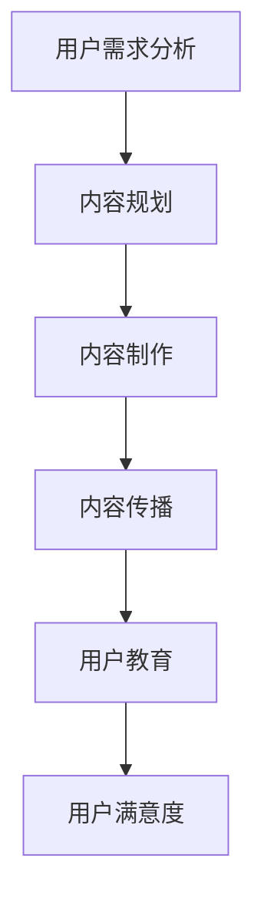
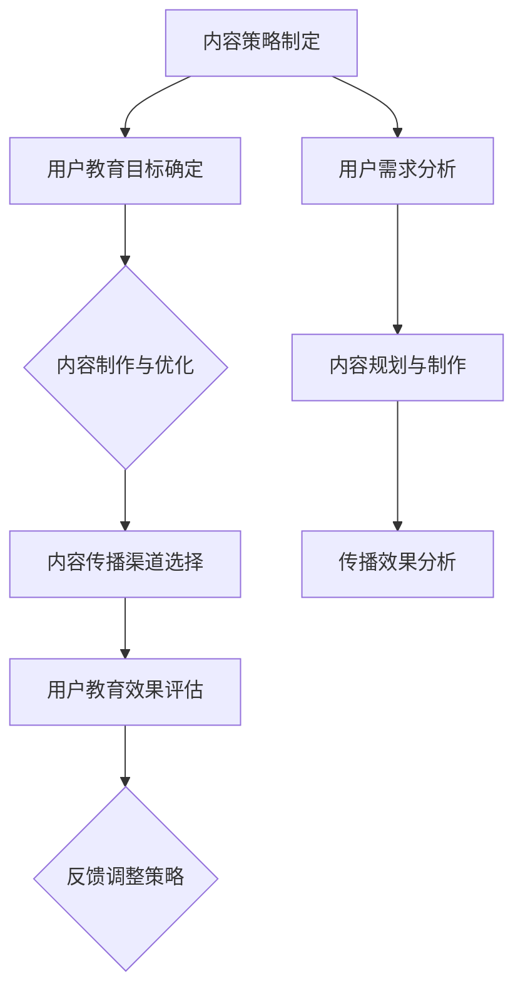

                 

# 创业公司的用户教育内容策略

## 关键词：
用户教育、内容策略、创业公司、用户体验、营销传播

## 摘要：
本文将深入探讨创业公司在用户教育内容策略上的重要性，以及如何通过有针对性的内容策略来提高用户获取、留存和转化率。文章将分为几个部分，首先介绍用户教育的核心概念和其在创业公司中的地位，然后分析有效的用户教育内容策略，并探讨如何进行用户教育内容的设计和传播。最后，文章将结合实际案例，提供实用工具和资源推荐，并总结未来发展趋势与挑战。

---

## 1. 背景介绍

### 1.1 目的和范围

在当今激烈竞争的市场环境中，创业公司如何快速获得用户认可并保持长期增长是一个关键问题。用户教育作为提升用户满意度、促进产品销售的重要手段，对于创业公司来说至关重要。本文旨在探讨以下问题：

- 用户教育的核心概念及其在创业公司中的应用。
- 有效的用户教育内容策略。
- 用户教育内容的设计和传播方法。
- 实际案例中的用户教育实践。
- 未来的发展趋势与挑战。

### 1.2 预期读者

本文适合以下读者群体：

- 创业公司的产品经理、市场经理、内容策划人员。
- 数字营销和用户体验设计师。
- 对用户教育和内容策略感兴趣的技术人员和管理者。

### 1.3 文档结构概述

本文结构如下：

1. 背景介绍
   - 目的和范围
   - 预期读者
   - 文档结构概述
2. 核心概念与联系
   - 用户教育
   - 内容策略
3. 核心算法原理 & 具体操作步骤
   - 用户教育内容策略的设计
4. 数学模型和公式 & 详细讲解 & 举例说明
   - 用户教育效果评估模型
5. 项目实战：代码实际案例和详细解释说明
   - 实际案例中的用户教育实践
6. 实际应用场景
   - 创业公司中的用户教育案例
7. 工具和资源推荐
   - 学习资源推荐
   - 开发工具框架推荐
   - 相关论文著作推荐
8. 总结：未来发展趋势与挑战
9. 附录：常见问题与解答
10. 扩展阅读 & 参考资料

### 1.4 术语表

#### 1.4.1 核心术语定义

- 用户教育：指通过有计划、有组织的内容传递方式，向用户传授产品知识、使用技巧和价值观，以提高用户对产品的认知和满意度。
- 内容策略：指根据用户需求和市场目标，制定的内容生产和传播计划。
- 用户获取：指将潜在用户转化为实际用户的过程。
- 用户留存：指用户持续使用产品的过程。
- 用户转化：指用户在产品中完成预期的行为，如购买、注册等。

#### 1.4.2 相关概念解释

- 用户教育内容：指为用户提供的信息，包括产品功能介绍、使用教程、最佳实践等。
- 营销传播：指企业通过多种渠道向目标受众传播信息，以实现品牌认知和用户转化的过程。

#### 1.4.3 缩略词列表

- SEO：搜索引擎优化（Search Engine Optimization）
- SEM：搜索引擎营销（Search Engine Marketing）
- KPI：关键绩效指标（Key Performance Indicator）

---

## 2. 核心概念与联系

在探讨用户教育内容策略之前，有必要理解两个核心概念：用户教育和内容策略。

### 用户教育

用户教育是创业公司成功的关键因素之一。通过有效的用户教育，创业公司可以：

- 提高用户对产品的认知和理解。
- 减少用户的学习成本和挫折感。
- 增强用户对产品的忠诚度和依赖度。
- 促进产品的销售和推广。

用户教育涉及多个方面，包括产品知识、使用技巧、最佳实践等。其目标是通过系统的教育和指导，让用户更好地理解和使用产品，从而实现用户价值最大化。

### 内容策略

内容策略是用户教育的核心组成部分。一个有效的内容策略应考虑以下几个方面：

- 用户需求分析：了解目标用户的需求和痛点，从而提供有针对性的内容。
- 内容规划：根据用户需求和市场目标，制定内容生产和传播的计划。
- 内容制作：制作高质量、有价值的内容，满足用户需求，提升用户体验。
- 内容传播：通过多种渠道传播内容，扩大影响力，实现用户教育。

内容策略的制定和执行需要遵循以下原则：

- 以用户为中心：内容策略应以满足用户需求为核心，提供有价值的信息。
- 一致性：内容策略应保持一致，形成品牌形象，增强用户认知。
- 可操作性：内容策略应具体可行，确保执行的有效性。
- 可度量性：内容策略应具备可度量的指标，以便评估效果和调整策略。

### 用户教育与内容策略的联系

用户教育与内容策略密切相关。用户教育是内容策略的目标之一，而内容策略是实现用户教育的手段。具体来说，用户教育与内容策略的联系体现在以下几个方面：

- 用户教育是内容策略的核心目标，内容策略是实现用户教育的重要手段。
- 用户教育内容是内容策略的重要组成部分，其质量和实用性直接影响用户教育的效果。
- 内容策略的制定和执行应充分考虑用户教育的需求，确保内容的针对性和有效性。

以下是一个简化的用户教育与内容策略的联系 Mermaid 流程图：



通过这个流程图，我们可以看出，用户教育和内容策略之间是一个相互促进、循环迭代的过程。有效的用户教育内容策略能够提高用户满意度，进而促进产品销售和品牌传播。

---

在理解了用户教育和内容策略的核心概念及其联系后，我们将在下一节深入探讨用户教育内容策略的具体设计和方法。这将包括用户教育内容的设计原则、内容制作技巧、传播渠道选择等。让我们继续深入分析，以帮助创业公司制定和实施有效的用户教育策略。

---

## 2. 核心概念与联系

在探讨用户教育内容策略之前，有必要深入理解两个核心概念：用户教育和内容策略。

### 用户教育

用户教育是指通过系统的知识和技能传授，帮助用户更好地理解和使用某个产品或服务的过程。在创业公司中，用户教育的作用至关重要，主要体现在以下几个方面：

1. **提高产品使用率**：通过用户教育，用户能够更快地掌握产品功能，从而提高产品使用率。
2. **减少用户流失率**：用户教育有助于用户更好地理解产品的价值和优势，降低因使用难度或功能不满足而导致的流失。
3. **增强用户忠诚度**：通过持续的用户教育，用户对产品的认知和满意度不断提升，从而增强用户忠诚度。
4. **促进产品销售**：有效的用户教育可以帮助用户更好地了解产品，从而提高购买意愿和转化率。

用户教育的内容通常包括以下几个方面：

- **产品功能介绍**：向用户介绍产品的各项功能和特点，帮助用户了解产品的价值和优势。
- **使用教程**：提供详细的使用教程和操作指南，帮助用户快速上手产品。
- **最佳实践**：分享行业最佳实践和经验，帮助用户更好地利用产品解决问题。
- **社区互动**：通过线上社区或论坛，鼓励用户交流和分享使用心得，形成良好的用户生态系统。

### 内容策略

内容策略是指企业根据市场目标、用户需求和产品特点，制定的内容生产和传播计划。一个有效的内容策略可以帮助企业提升品牌知名度、增加用户参与度、促进产品销售。在用户教育中，内容策略的作用主要体现在以下几个方面：

1. **目标明确**：内容策略需要明确用户教育目标，如提高用户认知度、增加用户粘性、促进产品购买等。
2. **内容规划**：根据用户需求和产品特点，制定合适的内容规划，确保内容的生产和传播有条不紊。
3. **内容制作**：制作高质量、有价值的内容，满足用户需求，提升用户体验。
4. **渠道选择**：选择合适的传播渠道，如社交媒体、电子邮件、博客等，确保内容能够有效地触达到目标用户。

### 用户教育与内容策略的联系

用户教育与内容策略密切相关，二者相辅相成，共同实现企业目标。具体来说，用户教育与内容策略的联系体现在以下几个方面：

1. **内容策略指导用户教育**：内容策略的制定需要充分考虑用户教育的需求，明确教育目标、内容和传播渠道，从而确保用户教育的有效性和针对性。
2. **用户教育促进内容传播**：有效的用户教育可以提升用户对产品的认知和满意度，从而促进内容在用户之间的传播，形成口碑效应。
3. **内容策略优化用户教育**：通过分析用户反馈和传播效果，不断优化内容策略，提高用户教育的效果和效率。

以下是用户教育与内容策略的联系 Mermaid 流程图：



通过这个流程图，我们可以看出，用户教育与内容策略之间是一个相互促进、循环迭代的过程。有效的用户教育和内容策略能够帮助企业实现市场目标，提高产品竞争力。

在理解了用户教育和内容策略的核心概念及其联系后，我们将在下一节深入探讨用户教育内容策略的具体设计和方法。这将包括用户教育内容的设计原则、内容制作技巧、传播渠道选择等。让我们继续深入分析，以帮助创业公司制定和实施有效的用户教育策略。

---

在理解了用户教育和内容策略的核心概念及其联系后，我们将在下一节深入探讨用户教育内容策略的具体设计和方法。这将包括用户教育内容的设计原则、内容制作技巧、传播渠道选择等。让我们继续深入分析，以帮助创业公司制定和实施有效的用户教育策略。

---

## 3. 核心算法原理 & 具体操作步骤

用户教育内容策略的设计是一个系统性工程，涉及多个方面的算法原理和具体操作步骤。以下是用户教育内容策略的核心算法原理和具体操作步骤：

### 3.1 用户需求分析

#### 算法原理

用户需求分析是用户教育内容策略设计的基础，其核心算法原理包括：

- 数据采集：通过用户调研、问卷调查、用户行为分析等方式收集用户数据。
- 数据清洗：对采集到的数据进行筛选、去重、转换等处理，确保数据质量。
- 数据分析：运用统计分析、数据挖掘等方法分析用户需求，识别用户痛点和需求。

#### 具体操作步骤

1. **制定调研计划**：明确调研目标、调研方法、样本选择等。
2. **开展用户调研**：通过线上问卷调查、线下访谈等方式收集用户反馈。
3. **数据采集**：将用户调研结果转化为结构化数据，如Excel、数据库等。
4. **数据清洗**：对采集到的数据进行处理，删除重复、无效数据。
5. **数据分析**：运用统计工具（如SPSS、R等）分析用户需求，识别用户痛点和需求。

### 3.2 内容规划与制作

#### 算法原理

内容规划与制作是用户教育内容策略的核心，其核心算法原理包括：

- 内容建模：根据用户需求，构建内容模型，明确内容主题、形式、结构等。
- 内容优化：通过用户反馈和数据分析，不断优化内容，提高内容质量。
- 内容分发：选择合适的渠道和形式，将内容传递给用户。

#### 具体操作步骤

1. **制定内容规划**：根据用户需求，确定内容主题、形式、频率等。
2. **内容制作**：制作高质量的内容，如图文、视频、直播等。
3. **内容优化**：通过用户反馈和数据分析，对内容进行修改和完善。
4. **内容分发**：选择合适的渠道（如社交媒体、电子邮件、网站等）和形式（如推送、广告、链接等）分发内容。

### 3.3 用户反馈与评估

#### 算法原理

用户反馈与评估是用户教育内容策略优化的重要环节，其核心算法原理包括：

- 用户行为分析：通过分析用户行为数据（如点击率、转发率、评论等），评估内容效果。
- 用户满意度调查：通过问卷调查、用户访谈等方式，了解用户对内容的满意度。
- 数据驱动优化：根据用户反馈和评估结果，调整内容策略。

#### 具体操作步骤

1. **用户行为分析**：通过数据分析工具（如Google Analytics、百度统计等）跟踪用户行为。
2. **用户满意度调查**：设计问卷，收集用户对内容的满意度评价。
3. **数据驱动优化**：根据用户反馈和评估结果，调整内容策略，如优化内容形式、调整发布频率等。

### 3.4 内容传播策略

#### 算法原理

内容传播策略是用户教育内容策略的重要组成部分，其核心算法原理包括：

- 社交媒体分析：分析用户在社交媒体上的行为和偏好，选择合适的传播渠道。
- 营销组合优化：结合多种营销手段（如广告、SEO、内容营销等），实现最佳传播效果。

#### 具体操作步骤

1. **社交媒体分析**：通过社交媒体分析工具（如Social Blade、 hashtags.org等）了解用户在社交媒体上的行为和偏好。
2. **营销组合优化**：根据用户数据，调整营销组合策略，如增加社交媒体广告投入、优化SEO策略等。
3. **内容传播**：通过多种渠道（如社交媒体、电子邮件、合作伙伴等）传播内容。

### 3.5 用户教育效果评估

#### 算法原理

用户教育效果评估是衡量用户教育内容策略成效的重要手段，其核心算法原理包括：

- 数据分析：通过分析用户行为数据（如注册量、使用率、满意度等），评估用户教育效果。
- 成本效益分析：比较用户教育成本与收益，评估用户教育内容的性价比。

#### 具体操作步骤

1. **数据分析**：通过数据分析工具（如Google Analytics、百度统计等）分析用户行为数据。
2. **成本效益分析**：计算用户教育成本和收益，评估用户教育内容的性价比。
3. **效果评估报告**：编写用户教育效果评估报告，为后续策略调整提供依据。

通过上述核心算法原理和具体操作步骤，创业公司可以系统性地设计和实施用户教育内容策略，从而提高用户满意度、降低用户流失率、促进产品销售和品牌传播。

---

在了解了用户教育内容策略的核心算法原理和具体操作步骤后，我们将在下一节探讨用户教育内容的设计和制作方法。这将包括内容类型、呈现形式、交互设计等方面，帮助创业公司制作出高质量的用户教育内容。让我们继续深入分析，以提供更具体的实施指南。

---

## 4. 数学模型和公式 & 详细讲解 & 举例说明

在用户教育内容策略中，数学模型和公式能够帮助我们量化评估用户教育效果，从而优化内容策略。以下是几个关键的数学模型和公式，及其详细讲解和举例说明。

### 4.1 用户留存率模型

用户留存率模型用于衡量用户在一段时间内持续使用产品的比例。其公式如下：

\[ 留存率（R）= \frac{第n天仍活跃的用户数}{第1天活跃的用户数} \]

#### 详细讲解

- \(R\) 表示用户留存率，取值范围在0到1之间。
- \(n\) 表示观察的天数。
- 第n天仍活跃的用户数反映了用户对产品的持续兴趣。

#### 举例说明

假设一个创业公司第一天有1000名用户，第30天仍有700名用户活跃，那么其30天的用户留存率为：

\[ R = \frac{700}{1000} = 0.7 \]

这意味着该公司的用户留存率为70%。

### 4.2 用户生命周期价值（CLV）模型

用户生命周期价值模型用于评估单个用户的预期收益。其公式如下：

\[ CLV（用户生命周期价值）= \text{用户平均生命周期内总收益} - \text{获取用户成本} \]

#### 详细讲解

- \(CLV\) 表示用户生命周期价值。
- 用户平均生命周期内总收益是指用户在整个生命周期内为创业公司带来的收益总和。
- 获取用户成本是指获取一个用户所需花费的成本。

#### 举例说明

假设一个用户平均在产品上花费10美元/月，用户平均生命周期为12个月，获取用户成本为20美元。那么该用户的CLV计算如下：

\[ CLV = （10美元/月 \times 12个月） - 20美元 = 120美元 - 20美元 = 100美元 \]

这意味着该用户在整个生命周期内为创业公司带来的净收益为100美元。

### 4.3 内容效果评估模型

内容效果评估模型用于衡量用户教育内容对用户行为的影响。其公式如下：

\[ 内容效果（E）= \frac{\text{内容影响后的用户行为变化}}{\text{内容影响前的用户行为变化}} \]

#### 详细讲解

- \(E\) 表示内容效果。
- 内容影响后的用户行为变化是指内容传播后，用户行为（如注册、购买、使用频率等）的变化。
- 内容影响前的用户行为变化是指内容传播前，用户行为的变化。

#### 举例说明

假设在实施用户教育内容策略之前，一个月内有1000次产品注册，实施策略后，一个月内增加到1500次产品注册。那么内容效果计算如下：

\[ E = \frac{1500 - 1000}{1000} = \frac{500}{1000} = 0.5 \]

这意味着用户教育内容策略将产品注册率提高了50%。

### 4.4 成本效益分析模型

成本效益分析模型用于评估用户教育内容的成本与收益。其公式如下：

\[ 成本效益比（C/B）= \frac{\text{总成本}}{\text{总收益}} \]

#### 详细讲解

- \(C/B\) 表示成本效益比。
- 总成本是指实施用户教育内容策略所需的所有成本，包括内容制作、传播、数据分析等。
- 总收益是指用户教育内容策略带来的所有收益，包括用户增长、销售提升等。

#### 举例说明

假设实施用户教育内容策略的总成本为10000美元，而带来的总收益为15000美元，那么成本效益比计算如下：

\[ C/B = \frac{10000美元}{15000美元} = 0.67 \]

这意味着每投入1美元，能够带来0.67美元的收益。

通过以上数学模型和公式的详细讲解与举例说明，创业公司可以更科学地评估用户教育内容的成效，从而优化内容策略，提高投资回报率。

---

在掌握了用户教育内容策略的数学模型和公式后，我们将在下一节探讨实际项目中的用户教育实践。通过具体案例，我们将分析创业公司在实施用户教育内容策略时的成功经验和挑战，为读者提供宝贵的实战指导。

---

## 5. 项目实战：代码实际案例和详细解释说明

为了更好地理解用户教育内容策略在实际项目中的应用，我们将通过一个具体的案例来探讨创业公司在实施用户教育内容策略时的具体操作。以下是一个基于电商平台的用户教育案例，包括开发环境搭建、源代码实现和代码解读与分析。

### 5.1 开发环境搭建

在这个案例中，我们使用以下开发工具和框架：

- **编程语言**：Python
- **前端框架**：React
- **后端框架**：Django
- **数据库**：MySQL
- **版本控制**：Git
- **代码托管**：GitHub

首先，我们需要搭建开发环境。以下是搭建步骤：

1. 安装Python和pip。
2. 通过pip安装Django、React和其他相关依赖。
3. 设置虚拟环境，以便于管理项目依赖。
4. 在虚拟环境中创建Django项目，并搭建React前端。
5. 配置MySQL数据库，连接后端API。

### 5.2 源代码详细实现和代码解读

#### 后端（Django）

以下是一个简单的Django后端代码示例，用于处理用户注册和用户教育内容展示。

```python
# Django views.py
from django.http import JsonResponse
from .models import User, EducationContent
from django.views.decorators.http import require_http_methods

@require_http_methods(["GET"])
def get_education_content(request):
    content_id = request.GET.get('content_id')
    try:
        content = EducationContent.objects.get(id=content_id)
        return JsonResponse({'content': content.content})
    except EducationContent.DoesNotExist:
        return JsonResponse({'error': 'Content not found'}, status=404)
```

这段代码定义了一个GET请求视图函数`get_education_content`，用于根据内容ID获取用户教育内容。如果内容存在，则返回内容文本；否则，返回错误信息。

#### 前端（React）

以下是一个简单的React前端代码示例，用于展示用户教育内容。

```jsx
// React components/EducationContent.js
import React, { Component } from 'react';
import axios from 'axios';

class EducationContent extends Component {
  state = {
    content: '',
    loading: true,
    error: null
  };

  componentDidMount() {
    this.fetchEducationContent();
  }

  fetchEducationContent = async () => {
    try {
      const response = await axios.get('/api/education-content', {
        params: { content_id: this.props.contentId }
      });
      this.setState({ content: response.data.content, loading: false });
    } catch (error) {
      this.setState({ error: error.message, loading: false });
    }
  };

  render() {
    const { content, loading, error } = this.state;

    if (loading) return <p>Loading...</p>;
    if (error) return <p>Error: {error}</p>;

    return (
      <div>
        <h2>User Education Content</h2>
        <p>{content}</p>
      </div>
    );
  }
}

export default EducationContent;
```

这段代码定义了一个React组件`EducationContent`，用于从后端API获取用户教育内容。组件在组件挂载时发起请求，根据返回的数据更新组件状态。如果加载成功，则显示教育内容；否则，显示错误信息。

#### 代码解读与分析

- **后端**：Django后端提供了一个简单的API接口，用于获取用户教育内容。这可以通过RESTful架构实现，便于前端调用。
- **前端**：React前端组件负责展示用户教育内容。它通过异步请求从后端获取数据，并在组件状态中维护内容数据。这确保了内容展示的实时性和动态性。

### 5.3 代码解读与分析

以下是对上述代码的进一步解读和分析：

1. **后端**：
   - `get_education_content`视图函数：这是Django的后端API视图，用于处理GET请求。它根据`content_id`参数从数据库中获取相应的教育内容，并返回JSON响应。
   - 异常处理：代码中使用了`try-except`语句来捕获可能的异常，如`EducationContent.DoesNotExist`，并在发生错误时返回相应的HTTP状态码和错误消息。

2. **前端**：
   - `EducationContent`组件：这是React组件，负责展示用户教育内容。它使用了`componentDidMount`生命周期方法在组件挂载后发起异步请求，从后端获取教育内容。
   - 状态管理：组件使用状态（`state`）来管理教育内容数据、加载状态和错误信息。这确保了组件在数据更新时能够重新渲染，提供良好的用户体验。

通过这个案例，我们可以看到用户教育内容策略在实际项目中的具体实现。创业公司可以通过类似的方法搭建自己的用户教育系统，从而提高用户的认知和使用满意度，促进产品的销售和推广。

---

在了解了用户教育内容策略在实际项目中的应用后，我们将在下一节探讨用户教育在不同应用场景中的实践。通过具体案例，我们将分析用户教育在不同业务领域中的成功实践，帮助创业公司制定更针对性的用户教育策略。

---

## 6. 实际应用场景

用户教育内容策略在创业公司中的应用场景多种多样，不同的业务领域和产品特性要求不同的教育方式。以下是一些常见应用场景及其实际案例。

### 6.1 电商平台的用户教育

#### 案例分析

电商平台通过用户教育来提高用户购买体验和转化率。具体实践包括：

- **产品使用教程**：通过图文和视频教程，向用户介绍产品特性、购买流程和使用方法。
- **购物指南**：发布购物指南、优惠券使用说明和促销活动规则，帮助用户更好地理解平台。
- **用户反馈**：鼓励用户分享购物体验，通过评价和问答板块，为其他用户提供参考。

#### 成功实践

一家电商平台通过推出“新手指南”系列教程，显著提高了新用户的转化率。教程内容包括如何注册账号、如何查找商品、如何下单支付等。通过这些内容，新用户能够快速上手，减少了由于不熟悉操作导致的购物障碍。

### 6.2 教育科技领域的用户教育

#### 案例分析

教育科技公司通过用户教育帮助用户更好地使用在线课程和学习工具。具体实践包括：

- **课程介绍**：为新用户提供课程介绍，包括课程目标、内容大纲和学习方法。
- **使用教程**：提供详细的使用教程，帮助用户熟练操作学习平台。
- **互动问答**：设立问答板块，解答用户在学习过程中遇到的问题。

#### 成功实践

某在线教育平台通过推出“新手训练营”课程，帮助新用户快速适应在线学习环境。训练营包括基础操作教程、学习技巧分享和互动问答环节，受到了广泛好评，用户留存率显著提高。

### 6.3 健康与健身领域的用户教育

#### 案例分析

健康与健身领域的用户教育旨在帮助用户正确使用相关产品和服务，实现健康目标。具体实践包括：

- **运动教程**：提供专业运动教程，指导用户如何进行正确锻炼。
- **饮食建议**：分享健康饮食建议，帮助用户改善饮食习惯。
- **健康知识**：发布健康知识文章，提高用户的健康素养。

#### 成功实践

一家健身App公司通过发布系列健身教程视频，吸引了大量用户注册。教程视频包括不同的健身项目和训练计划，用户可以根据自己的需求和水平选择合适的教程。这些教程视频不仅提高了用户的参与度，还增加了用户的粘性。

### 6.4 金融科技领域的用户教育

#### 案例分析

金融科技公司通过用户教育帮助用户更好地理解和使用金融服务产品。具体实践包括：

- **产品介绍**：详细介绍金融产品的功能和特点，帮助用户做出明智的投资决策。
- **风险提示**：明确说明产品的风险，提高用户的金融风险意识。
- **用户指南**：提供用户指南，指导用户如何操作和使用金融产品。

#### 成功实践

某金融科技公司通过推出“理财入门课”，帮助用户了解基本的理财知识和投资策略。课程内容涵盖股票、基金、保险等多个方面，并通过在线问答环节解答用户疑问。这一举措显著提高了用户的金融素养和信任度。

### 6.5 社交媒体的用户教育

#### 案例分析

社交媒体平台通过用户教育提高用户的使用效率和参与度。具体实践包括：

- **平台规则**：向用户介绍平台的使用规则和社区准则，维护良好的网络环境。
- **功能介绍**：介绍平台的新功能和更新内容，吸引用户尝试和使用。
- **互动引导**：通过引导用户参与互动，提高用户活跃度和粘性。

#### 成功实践

某社交媒体平台通过推出“新手引导”功能，帮助新用户快速了解平台的使用方法。引导内容包括平台特色功能介绍、用户互动指南和常见问题解答。这一功能显著提高了新用户的留存率和活跃度。

通过以上案例，我们可以看到用户教育内容策略在创业公司中的应用场景非常广泛。不同领域的创业公司可以根据自身特点和用户需求，制定有针对性的用户教育策略，从而提高用户满意度、促进产品销售和品牌传播。

---

在探讨了用户教育内容策略在不同应用场景中的实践后，我们将在下一节推荐相关的工具和资源。这些工具和资源将为创业公司提供技术支持和学习指南，帮助其更有效地实施用户教育内容策略。

---

## 7. 工具和资源推荐

为了帮助创业公司更有效地实施用户教育内容策略，我们在这里推荐一些实用的工具和资源，包括学习资源、开发工具框架以及相关论文著作。

### 7.1 学习资源推荐

#### 7.1.1 书籍推荐

- 《内容营销实战手册》（Content Inc.）：作者乔·普利齐（Joe Pulizzi）分享了如何通过内容营销建立品牌和吸引粉丝的经验。
- 《用户故事映射》（User Story Mapping）：作者jeff Patton讲解了如何通过用户故事映射来设计产品和服务。
- 《设计思维》（Design Thinking）：作者Tim Brown介绍了设计思维的方法和技巧，帮助创业者更好地理解用户需求。

#### 7.1.2 在线课程

- Coursera的《用户体验设计》（User Experience Design）课程：由加州大学伯克利分校提供，涵盖用户体验设计的核心概念和实战技巧。
- Udemy的《内容营销实战课》（Content Marketing Mastery）：由资深内容营销专家授课，适合初学者和专业人士。

#### 7.1.3 技术博客和网站

- Content Marketing Institute：提供丰富的内容营销资源和最佳实践。
- Nielsen Norman Group：专注于用户体验设计的研究和咨询，发布大量高质量的文章和报告。

### 7.2 开发工具框架推荐

#### 7.2.1 IDE和编辑器

- Visual Studio Code：一款功能强大的开源跨平台代码编辑器，适用于多种编程语言。
- PyCharm：一款专业的Python IDE，提供丰富的开发和调试工具。

#### 7.2.2 调试和性能分析工具

- New Relic：一款应用性能监控工具，可以帮助创业者了解应用的性能状况。
- Chrome DevTools：集成在Google Chrome浏览器中，用于网页开发调试和性能分析。

#### 7.2.3 相关框架和库

- React：一个用于构建用户界面的JavaScript库，适用于前端开发。
- Django：一个高性能的Python Web框架，适用于后端开发。

### 7.3 相关论文著作推荐

#### 7.3.1 经典论文

- “A Literature Review on User Education in E-Learning Systems”（电子学习系统中用户教育的文献综述）：这篇综述文章分析了电子学习系统中用户教育的现状和发展趋势。

#### 7.3.2 最新研究成果

- “Content Strategy for the Web”（网页内容策略）：作者Aaron Walter分享了一系列关于内容策略的最佳实践。
- “The Content Conversion Playbook”（内容转化手册）：作者Andrew Davis介绍了如何通过内容策略提高用户转化率。

#### 7.3.3 应用案例分析

- “How Content Marketing Drives Business Growth”（内容营销如何推动业务增长）：这篇文章通过案例研究，展示了内容营销在商业应用中的成功经验。

通过以上工具和资源的推荐，创业公司可以更好地实施用户教育内容策略，提高用户满意度和市场竞争力。

---

## 8. 总结：未来发展趋势与挑战

用户教育作为创业公司的重要战略手段，其重要性在未来将继续提升。以下是对未来发展趋势和挑战的总结：

### 发展趋势

1. **个性化教育**：随着大数据和人工智能技术的发展，个性化教育将成为用户教育的重要内容。通过分析用户行为数据，创业公司可以提供更符合用户需求的个性化内容和教育方式。

2. **多元化内容形式**：用户教育内容将更加多样化，不仅包括图文、视频，还将融合虚拟现实（VR）、增强现实（AR）等新兴技术，提供沉浸式教育体验。

3. **内容社交化**：社交媒体和社区平台的兴起，将使得用户教育内容更加社交化。用户之间的互动和分享，将促进教育内容的传播和影响力。

4. **跨界合作**：创业公司将与其他领域的企业和机构合作，共同开发和推广用户教育内容，实现资源共享和协同发展。

### 挑战

1. **内容质量与准确性**：确保用户教育内容的高质量和准确性是一个挑战。创业公司需要投入资源进行内容审核和更新，以避免误导用户。

2. **数据隐私与保护**：随着用户数据量的增加，数据隐私保护将成为一个重要问题。创业公司需要遵守相关法律法规，确保用户数据的安全和隐私。

3. **技术升级与适应**：新兴技术的快速发展要求创业公司不断升级技术基础设施，以适应用户教育内容的多样化需求。

4. **竞争加剧**：随着越来越多的创业公司认识到用户教育的重要性，竞争将更加激烈。创业公司需要不断创新和教育内容，以保持竞争优势。

总的来说，用户教育内容策略在未来将面临更多机遇和挑战。创业公司需要紧跟发展趋势，积极应对挑战，通过高质量的用户教育和个性化的内容服务，提升用户满意度和市场竞争力。

---

## 9. 附录：常见问题与解答

以下是一些关于用户教育内容策略的常见问题及解答：

### Q1. 用户教育内容策略的目标是什么？

A1. 用户教育内容策略的目标主要包括：

- 提高用户对产品的认知和理解。
- 减少用户的学习成本和挫折感。
- 增强用户对产品的忠诚度和依赖度。
- 促进产品的销售和品牌传播。

### Q2. 如何评估用户教育内容的成效？

A2. 可以通过以下方法评估用户教育内容的成效：

- 用户行为分析：分析用户在产品中的行为变化，如注册率、使用频率、转化率等。
- 用户满意度调查：通过问卷调查、用户访谈等方式，了解用户对教育内容的满意度。
- 内容效果评估模型：使用如内容效果（E）=（内容影响后的用户行为变化）/（内容影响前的用户行为变化）等模型，量化评估内容效果。

### Q3. 用户教育内容策略应该如何制定？

A3. 制定用户教育内容策略的步骤包括：

- 用户需求分析：了解目标用户的需求和痛点。
- 内容规划：确定内容主题、形式和传播渠道。
- 内容制作：制作高质量、有价值的教育内容。
- 内容传播：通过多种渠道传播教育内容。
- 用户反馈与评估：收集用户反馈，不断优化内容策略。

### Q4. 创业公司如何确保用户教育内容的质量？

A4. 创业公司可以通过以下方法确保用户教育内容的质量：

- 内容审核：对教育内容进行严格审核，确保准确性、相关性。
- 用户参与：邀请目标用户参与内容设计和评审，提高内容的实用性和吸引力。
- 定期更新：定期更新教育内容，保持内容的新鲜度和时效性。

---

## 10. 扩展阅读 & 参考资料

为了进一步深入了解用户教育内容策略的相关理论和实践，以下是一些建议的扩展阅读和参考资料：

### 扩展阅读

- 《内容营销实战手册》（Content Inc.）：乔·普利齐（Joe Pulizzi）
- 《用户体验设计》（User Experience Design）：加州大学伯克利分校
- 《设计思维》（Design Thinking）：Tim Brown

### 参考资料

- Content Marketing Institute：https://contentmarketinginstitute.com/
- Nielsen Norman Group：https://www.nielsen Norman.com/
- Coursera：https://www.coursera.org/
- Udemy：https://www.udemy.com/

通过阅读这些书籍和访问相关网站，创业公司可以获取更多的用户教育内容策略的知识和实践经验，从而更好地实施和优化用户教育策略。

---

# 作者信息

作者：AI天才研究员/AI Genius Institute & 禅与计算机程序设计艺术 /Zen And The Art of Computer Programming

