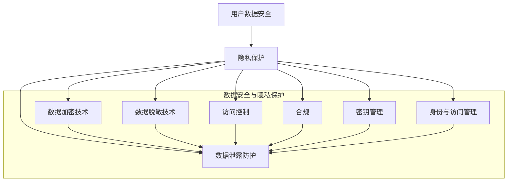

                 

# 创业公司的用户数据安全与隐私保护策略

> 关键词：用户数据安全、隐私保护、创业公司、加密技术、数据安全策略、隐私合规

> 摘要：随着数字化转型的深入，用户数据的安全与隐私保护成为创业公司面临的重要挑战。本文将探讨创业公司在数据安全与隐私保护方面的核心问题，分析适用的技术解决方案，提供实际操作指南，并展望未来发展趋势与挑战。通过本文，读者将了解到如何在创业初期就构建一个稳固的用户数据安全与隐私保护体系，从而为公司的长远发展奠定坚实基础。

## 1. 背景介绍

### 1.1 目的和范围

本文旨在帮助创业公司理解用户数据安全与隐私保护的重要性，并提供实用的策略和最佳实践。文章将覆盖以下主要范围：

1. **核心概念**：介绍用户数据安全与隐私保护的基本概念、原则和法律法规要求。
2. **技术方案**：探讨加密技术、数据脱敏、访问控制等核心技术手段及其应用。
3. **实施策略**：提供数据安全策略制定、执行和监控的具体步骤。
4. **案例分析**：分析成功与失败案例，总结经验教训。
5. **未来展望**：预测数据安全与隐私保护领域的发展趋势和挑战。

### 1.2 预期读者

本文适合以下读者群体：

1. **创业公司创始人**：希望了解如何保护用户数据安全与隐私的初创企业负责人。
2. **IT 管理者和安全专家**：负责公司数据安全策略制定和执行的IT专业人员。
3. **合规官员**：负责公司隐私合规工作的专业人员。
4. **技术爱好者**：对数据安全与隐私保护技术有兴趣的技术人员。

### 1.3 文档结构概述

本文结构如下：

1. **背景介绍**：介绍文章的目的、范围和预期读者。
2. **核心概念与联系**：使用Mermaid流程图展示数据安全与隐私保护的核心概念和架构。
3. **核心算法原理 & 具体操作步骤**：详细讲解数据加密和隐私保护的技术原理和实现步骤。
4. **数学模型和公式**：介绍相关数学模型和公式，并举例说明。
5. **项目实战**：提供实际代码案例和详细解释。
6. **实际应用场景**：分析不同场景下的数据安全与隐私保护需求。
7. **工具和资源推荐**：推荐相关学习资源、开发工具和框架。
8. **总结：未来发展趋势与挑战**：展望数据安全与隐私保护领域的未来。
9. **附录：常见问题与解答**：解答常见问题。
10. **扩展阅读 & 参考资料**：提供进一步阅读的资料。

### 1.4 术语表

#### 1.4.1 核心术语定义

- **用户数据安全**：保护用户数据免受未经授权的访问、使用、披露、破坏、修改和损失。
- **隐私保护**：确保用户数据的隐私不被泄露或滥用。
- **加密技术**：使用加密算法将数据转换为密文，以防止未经授权的访问。
- **数据脱敏**：通过掩盖或替换敏感数据来保护数据隐私。
- **访问控制**：限制对数据的访问权限，确保只有授权用户才能访问数据。
- **合规**：遵守相关的法律法规和标准，确保公司的数据安全与隐私保护措施符合要求。

#### 1.4.2 相关概念解释

- **数据泄露**：敏感数据未经授权被访问或泄露。
- **数据加密**：将明文数据转换为密文的过程。
- **密钥管理**：确保加密密钥的安全存储和合理使用。
- **隐私政策**：明确公司如何收集、使用、存储和保护用户数据的声明。

#### 1.4.3 缩略词列表

- **GDPR**：通用数据保护条例（General Data Protection Regulation）
- **CCPA**：加利福尼亚州消费者隐私法（California Consumer Privacy Act）
- **SSL**：安全套接层协议（Secure Sockets Layer）
- **TLS**：传输层安全协议（Transport Layer Security）
- **IAM**：身份与访问管理（Identity and Access Management）

## 2. 核心概念与联系

在探讨用户数据安全与隐私保护之前，首先需要理解一些核心概念和它们之间的联系。以下是使用Mermaid流程图表示的数据安全与隐私保护的核心概念和架构：



### 2.1 用户数据安全

用户数据安全是指保护用户数据免受未经授权的访问、使用、披露、破坏、修改和损失。它包括以下几个方面：

1. **数据保密性**：确保数据不被未授权的个人或实体访问。
2. **数据完整性**：确保数据不被未授权的实体修改或破坏。
3. **数据可用性**：确保数据在需要时可以正常访问和使用。
4. **数据可追溯性**：确保对数据的任何操作都可以被追踪和审计。

### 2.2 隐私保护

隐私保护确保用户数据的隐私不被泄露或滥用。它涉及以下几个方面：

1. **数据收集限制**：只收集必要的数据，并明确告知用户数据的使用目的。
2. **数据使用限制**：限制对数据的访问和使用，确保数据不被用于未经授权的用途。
3. **数据存储安全**：确保数据在存储期间的安全，防止数据泄露。
4. **数据传输安全**：确保数据在传输过程中的安全，防止数据在传输过程中被截获或篡改。

### 2.3 数据加密技术

数据加密技术是保护用户数据安全的重要手段。它通过将明文数据转换为密文，确保数据在传输和存储过程中不被未经授权的实体访问。加密技术可以分为以下几类：

1. **对称加密**：使用相同的密钥进行加密和解密。
2. **非对称加密**：使用不同的密钥进行加密和解密。
3. **哈希算法**：将输入数据转换为固定长度的字符串，以验证数据的完整性和真实性。

### 2.4 数据脱敏技术

数据脱敏技术通过对敏感数据进行掩盖或替换，以保护数据隐私。常用的数据脱敏技术包括：

1. **数据掩码**：将敏感数据替换为统一的掩码字符，如“XXXX”。
2. **数据替换**：将敏感数据替换为虚构的随机数据。
3. **数据泛化**：将敏感数据泛化为更高的抽象级别，如将具体的生日日期替换为年龄段。

### 2.5 访问控制

访问控制是一种机制，用于限制对数据的访问权限。通过访问控制，可以确保只有授权用户才能访问特定的数据。访问控制可以分为以下几种类型：

1. **身份认证**：验证用户的身份，确保只有授权用户才能访问系统。
2. **授权控制**：根据用户的角色和权限，限制用户对数据的访问。
3. **强制访问控制**：基于敏感度和安全级别，限制用户对数据的访问。

### 2.6 合规

合规是指遵守相关的法律法规和标准，确保公司的数据安全与隐私保护措施符合要求。对于创业公司，常见的合规要求包括：

1. **通用数据保护条例（GDPR）**：适用于欧盟地区的用户数据保护法规。
2. **加利福尼亚州消费者隐私法（CCPA）**：适用于美国加利福尼亚州的消费者隐私保护法规。
3. **信息安全管理体系（ISO 27001）**：国际标准化组织制定的信息安全管理标准。

### 2.7 数据泄露防护

数据泄露防护是确保数据在传输和存储过程中不被未经授权的实体访问的技术手段。它包括以下几个方面：

1. **网络防护**：通过防火墙、入侵检测系统等网络安全措施，防止外部攻击。
2. **数据加密**：使用加密技术确保数据在传输和存储过程中的安全。
3. **访问控制**：通过访问控制机制，限制对数据的访问权限。
4. **日志审计**：记录数据访问和操作日志，以便在数据泄露事件发生时进行调查。

### 2.8 密钥管理

密钥管理是确保加密密钥的安全存储和合理使用的过程。密钥管理包括以下几个方面：

1. **密钥生成**：使用安全的算法生成强密码。
2. **密钥存储**：将密钥存储在安全的存储设备中，如硬件安全模块（HSM）。
3. **密钥备份**：定期备份密钥，以防密钥丢失或损坏。
4. **密钥更新**：定期更新密钥，确保加密算法的健壮性。

### 2.9 身份与访问管理

身份与访问管理（IAM）是一种机制，用于管理用户身份和权限，确保只有授权用户才能访问系统和数据。IAM包括以下几个方面：

1. **用户认证**：验证用户的身份，确保只有授权用户才能登录系统。
2. **用户授权**：根据用户的角色和权限，分配对系统和数据的访问权限。
3. **用户监控**：监控用户的行为和访问记录，及时发现异常行为。

## 3. 核心算法原理 & 具体操作步骤

在数据安全与隐私保护中，加密技术是一个核心组成部分。以下是关于数据加密的核心算法原理和具体操作步骤的讲解，我们将使用伪代码来详细阐述这些内容。

### 3.1 数据加密技术

#### 3.1.1 对称加密

对称加密是一种加密算法，使用相同的密钥进行加密和解密。以下是一个简单的对称加密算法的伪代码实现：

```plaintext
// 对称加密算法伪代码
// 参数：plaintext（明文），key（密钥），algorithm（加密算法）
// 返回：ciphertext（密文）

function symmetricEncryption(plaintext, key, algorithm):
    ciphertext = encrypt(plaintext, key, algorithm)
    return ciphertext

// 对称解密算法伪代码
// 参数：ciphertext（密文），key（密钥），algorithm（加密算法）
// 返回：plaintext（明文）

function symmetricDecryption(ciphertext, key, algorithm):
    plaintext = decrypt(ciphertext, key, algorithm)
    return plaintext
```

常用的对称加密算法包括AES（高级加密标准）和DES（数据加密标准）。

#### 3.1.2 非对称加密

非对称加密是一种加密算法，使用不同的密钥进行加密和解密。以下是一个简单的非对称加密算法的伪代码实现：

```plaintext
// 非对称加密算法伪代码
// 参数：plaintext（明文），public_key（公钥），algorithm（加密算法）
// 返回：ciphertext（密文）

function asymmetricEncryption(plaintext, public_key, algorithm):
    ciphertext = encrypt(plaintext, public_key, algorithm)
    return ciphertext

// 非对称解密算法伪代码
// 参数：ciphertext（密文），private_key（私钥），algorithm（加密算法）
// 返回：plaintext（明文）

function asymmetricDecryption(ciphertext, private_key, algorithm):
    plaintext = decrypt(ciphertext, private_key, algorithm)
    return plaintext
```

常用的非对称加密算法包括RSA（Rivest-Shamir-Adleman）和ECC（椭圆曲线密码学）。

#### 3.1.3 哈希算法

哈希算法是一种将输入数据转换为固定长度字符串的算法，用于验证数据的完整性和真实性。以下是一个简单的哈希算法的伪代码实现：

```plaintext
// 哈希算法伪代码
// 参数：data（输入数据），algorithm（哈希算法）
// 返回：hash_value（哈希值）

function hashFunction(data, algorithm):
    hash_value = computeHash(data, algorithm)
    return hash_value
```

常用的哈希算法包括SHA-256、MD5和SHA-1。

### 3.2 数据加密与解密的具体操作步骤

以下是数据加密与解密的具体操作步骤：

1. **生成密钥**：根据加密算法的要求，生成一对密钥（对称加密）或生成公钥和私钥（非对称加密）。
2. **加密数据**：使用密钥或公钥，将明文数据加密为密文。
3. **解密数据**：使用密钥或私钥，将密文解密为明文。
4. **验证数据**：使用哈希算法计算数据的哈希值，并与原始数据的哈希值进行比对，以验证数据的完整性和真实性。

#### 3.2.1 对称加密操作步骤

```plaintext
// 对称加密操作步骤
1. 生成密钥（例如使用AES算法）
2. 使用密钥对明文数据进行加密，生成密文
3. 将密文传输或存储
4. 需要解密时，使用相同的密钥对密文进行解密，恢复明文
```

#### 3.2.2 非对称加密操作步骤

```plaintext
// 非对称加密操作步骤
1. 生成公钥和私钥（例如使用RSA算法）
2. 使用公钥对明文数据进行加密，生成密文
3. 将密文传输或存储
4. 需要解密时，使用私钥对密文进行解密，恢复明文
```

#### 3.2.3 哈希算法验证数据完整性

```plaintext
// 哈希算法验证数据完整性
1. 对原始数据进行哈希计算，生成哈希值
2. 将哈希值与接收到的哈希值进行比对
3. 如果哈希值相同，则数据完整，否则数据可能已被篡改
```

通过上述核心算法原理和具体操作步骤的讲解，创业公司可以了解如何使用加密技术来保护用户数据的安全和隐私。在实际应用中，创业公司需要根据具体需求和场景，选择合适的加密算法和实现方式，并确保密钥的安全管理和加密过程的正确执行。

### 3.3 数据脱敏技术

数据脱敏技术是保护用户数据隐私的重要手段，通过掩盖或替换敏感数据，确保数据在传输和存储过程中不被未经授权的实体访问。以下是数据脱敏技术的核心原理和具体操作步骤。

#### 3.3.1 数据脱敏技术的核心原理

数据脱敏技术的核心原理是将敏感数据替换为虚构的随机数据，以保护数据的隐私。脱敏过程中，敏感数据会被掩盖或替换，使其无法被识别或恢复，但保留数据的结构和形式，以便分析或备份使用。

常用的数据脱敏技术包括以下几种：

1. **数据掩码**：将敏感数据替换为统一的掩码字符，如“XXXX”或“****”。这种技术简单有效，但可能影响数据的可用性。
2. **数据替换**：将敏感数据替换为虚构的随机数据，如随机电话号码、随机地址或随机生日日期。这种技术更灵活，但可能需要额外的数据处理和验证。
3. **数据泛化**：将敏感数据泛化为更高的抽象级别，如将具体的生日日期替换为年龄段。这种技术可以减少数据泄露的风险，但可能影响数据分析的准确性。

#### 3.3.2 数据脱敏技术的具体操作步骤

以下是数据脱敏技术的具体操作步骤：

1. **识别敏感数据**：首先，需要识别系统中的敏感数据，如个人身份信息、银行账户信息、医疗记录等。可以通过数据扫描工具或数据库查询来实现。
2. **制定脱敏策略**：根据数据的敏感程度和业务需求，制定脱敏策略。脱敏策略应明确哪些数据需要脱敏、采用哪种脱敏技术以及如何处理脱敏后的数据。
3. **执行脱敏操作**：根据脱敏策略，对敏感数据执行脱敏操作。可以使用定制脚本、数据库存储过程或第三方脱敏工具来实现。
4. **验证脱敏效果**：在执行脱敏操作后，需要验证脱敏效果，确保敏感数据已被正确掩盖或替换。可以通过自动化测试工具或人工检查来实现。
5. **更新脱敏策略**：根据业务需求和法规变化，定期更新脱敏策略，以确保数据的隐私保护措施始终符合要求。

#### 3.3.3 数据脱敏技术的实际应用案例

以下是一个数据脱敏技术的实际应用案例：

假设一个电商系统需要脱敏用户地址信息。根据脱敏策略，系统将使用数据掩码技术对用户地址的详细部分进行掩盖，保留省、市和区县的信息。具体步骤如下：

1. **识别敏感数据**：通过数据库查询，识别包含用户地址信息的表。
2. **制定脱敏策略**：确定使用数据掩码技术，将用户地址的详细部分替换为“XXXXXX”。
3. **执行脱敏操作**：使用数据库存储过程或定制脚本，对用户地址信息进行脱敏操作。
4. **验证脱敏效果**：通过自动化测试工具或人工检查，确保用户地址信息已被正确掩盖。
5. **更新脱敏策略**：根据业务需求或法规变化，定期更新脱敏策略，如增加对用户邮箱地址的脱敏。

通过上述数据脱敏技术的核心原理和具体操作步骤的讲解，创业公司可以了解如何保护用户数据的隐私，确保数据在传输和存储过程中的安全。

### 3.4 访问控制技术

访问控制是一种机制，用于限制对数据和系统的访问权限，确保只有授权用户才能访问特定的数据和系统资源。以下是关于访问控制技术的基本原理、实现机制和具体操作步骤的讲解。

#### 3.4.1 访问控制的基本原理

访问控制的基本原理是定义和实施访问策略，以限制用户对系统和数据的访问。访问控制包括以下几个方面：

1. **身份认证**：验证用户的身份，确保只有合法用户才能访问系统。
2. **授权控制**：根据用户的角色和权限，限制用户对数据和系统的访问范围。
3. **访问审计**：记录用户的访问行为，以便在发生安全事件时进行审计和追踪。

#### 3.4.2 访问控制的实现机制

访问控制的实现机制包括以下几个方面：

1. **访问控制列表（ACL）**：定义每个用户或用户组的访问权限，包括读、写、执行等操作权限。
2. **角色基础访问控制（RBAC）**：基于用户的角色分配访问权限，简化权限管理。
3. **属性基础访问控制（ABAC）**：根据用户属性（如部门、职位、地理位置等）和资源属性（如访问时间、访问频率等）动态分配访问权限。
4. **多因素认证（MFA）**：结合多种认证方式（如密码、手机验证码、指纹等），提高认证安全性。

#### 3.4.3 访问控制的具体操作步骤

以下是访问控制的具体操作步骤：

1. **定义访问策略**：根据业务需求和安全要求，定义访问策略，包括访问控制规则、权限级别和认证方式。
2. **创建用户账户**：为授权用户创建用户账户，并分配适当的角色和权限。
3. **配置访问控制列表**：为每个资源和用户账户配置访问控制列表，明确允许或拒绝的操作类型。
4. **实施认证机制**：配置身份认证机制，如密码、多因素认证等，确保用户身份的合法性。
5. **监控和审计**：监控用户访问行为，记录访问日志，以便在发生安全事件时进行审计和追踪。

#### 3.4.4 访问控制技术的实际应用案例

以下是一个访问控制技术的实际应用案例：

假设一个企业内部网络需要实施访问控制，确保只有特定角色的用户能够访问特定的系统资源。具体步骤如下：

1. **定义访问策略**：根据业务需求，定义访问策略，如管理员可以访问所有系统资源，普通员工只能访问与工作相关的资源。
2. **创建用户账户**：为不同角色的用户创建用户账户，并分配相应的角色和权限。
3. **配置访问控制列表**：为每个系统资源配置访问控制列表，明确允许或拒绝的操作类型。
4. **实施认证机制**：配置多因素认证机制，如密码和手机验证码，确保用户身份的合法性。
5. **监控和审计**：监控用户访问行为，记录访问日志，以便在发生安全事件时进行审计和追踪。

通过上述访问控制技术的基本原理、实现机制和具体操作步骤的讲解，创业公司可以了解如何实施有效的访问控制，保护用户数据和系统资源的安全。

### 3.5 数据安全策略的制定与实施

制定和实施数据安全策略是确保创业公司用户数据安全与隐私保护的关键步骤。以下是关于数据安全策略的制定与实施的核心内容，包括核心原则、策略制定步骤和实施方法。

#### 3.5.1 数据安全策略的核心原则

数据安全策略的核心原则包括以下几个方面：

1. **最小权限原则**：用户和系统组件只能访问其执行任务所必需的数据和资源，以减少潜在的安全风险。
2. **安全开发原则**：在软件开发过程中，始终考虑数据安全，将安全措施集成到系统设计和开发中。
3. **数据加密原则**：对敏感数据进行加密，确保数据在传输和存储过程中的安全。
4. **数据访问控制原则**：通过访问控制机制，限制对数据和系统的访问，确保只有授权用户才能访问。
5. **日志审计原则**：记录用户和数据操作的日志，以便在发生安全事件时进行审计和追踪。

#### 3.5.2 数据安全策略的制定步骤

以下是数据安全策略的制定步骤：

1. **需求分析**：了解业务需求和用户需求，确定需要保护的数据类型和敏感程度。
2. **风险评估**：评估系统可能面临的安全威胁和漏洞，识别潜在的安全风险。
3. **法规和标准**：了解相关的法律法规和标准，如GDPR、CCPA等，确保数据安全策略符合合规要求。
4. **策略设计**：根据需求分析、风险评估和法规要求，设计数据安全策略，包括数据加密、访问控制、日志审计等。
5. **策略审核**：对数据安全策略进行审核，确保策略的有效性和可行性。
6. **策略发布**：发布数据安全策略，并通知相关人员和团队。

#### 3.5.3 数据安全策略的实施方法

以下是数据安全策略的实施方法：

1. **培训和教育**：对员工进行数据安全培训，提高员工的安全意识和技能。
2. **技术实施**：部署相应的数据安全技术和工具，如加密软件、访问控制系统、防火墙等。
3. **安全监控**：建立安全监控机制，实时监控系统状态和安全事件，及时发现和应对潜在的安全威胁。
4. **安全测试**：定期进行安全测试，如渗透测试、漏洞扫描等，发现和修复系统中的安全漏洞。
5. **应急响应**：制定应急响应计划，确保在发生安全事件时能够迅速应对和恢复。
6. **合规检查**：定期进行合规检查，确保数据安全策略的实施符合法律法规和标准的要求。

#### 3.5.4 数据安全策略的实际应用案例

以下是一个数据安全策略的实际应用案例：

假设一家在线电商公司需要制定和实施数据安全策略，保护用户数据和公司资产的安全。具体步骤如下：

1. **需求分析**：分析电商平台的业务需求和用户需求，确定需要保护的数据类型和敏感程度，如用户个人信息、订单信息、支付信息等。
2. **风险评估**：评估电商平台的潜在安全威胁和漏洞，如数据泄露、恶意攻击、系统漏洞等。
3. **法规和标准**：了解GDPR、CCPA等相关法律法规和标准，确保数据安全策略符合合规要求。
4. **策略设计**：根据需求分析、风险评估和法规要求，设计数据安全策略，包括数据加密、访问控制、日志审计等。
5. **策略审核**：对数据安全策略进行审核，确保策略的有效性和可行性。
6. **策略发布**：发布数据安全策略，并通知相关人员和团队。

实施阶段：

1. **培训和教育**：对员工进行数据安全培训，提高员工的安全意识和技能。
2. **技术实施**：部署加密软件、访问控制系统、防火墙等数据安全技术和工具。
3. **安全监控**：建立安全监控机制，实时监控系统状态和安全事件，及时发现和应对潜在的安全威胁。
4. **安全测试**：定期进行安全测试，如渗透测试、漏洞扫描等，发现和修复系统中的安全漏洞。
5. **应急响应**：制定应急响应计划，确保在发生安全事件时能够迅速应对和恢复。
6. **合规检查**：定期进行合规检查，确保数据安全策略的实施符合法律法规和标准的要求。

通过上述数据安全策略的制定与实施步骤的讲解，创业公司可以了解如何制定和实施有效的数据安全策略，确保用户数据的安全和隐私。

### 3.6 数据安全监控与响应

数据安全监控与响应是确保创业公司用户数据安全的关键环节，通过实时监测、识别和处理安全事件，可以有效减少潜在的风险。以下是关于数据安全监控与响应的核心内容，包括监控方法、响应流程和工具。

#### 3.6.1 数据安全监控方法

1. **实时监控**：通过部署实时监控工具，如入侵检测系统（IDS）和入侵防御系统（IPS），实时监测系统状态、网络流量和用户行为，及时发现异常情况。
2. **日志分析**：收集和分析系统日志、网络日志、数据库日志等，识别潜在的安全威胁和异常行为。
3. **漏洞扫描**：定期进行漏洞扫描，识别系统中的安全漏洞，及时进行修复和更新。
4. **威胁情报**：利用威胁情报，了解当前的安全威胁和攻击趋势，及时调整安全策略和防御措施。
5. **用户行为分析**：通过对用户行为的分析，识别异常行为和潜在的安全威胁。

#### 3.6.2 数据安全响应流程

1. **事件识别**：通过监控工具和日志分析，识别安全事件，如数据泄露、恶意攻击等。
2. **初步评估**：对安全事件进行初步评估，确定事件的严重性和影响范围。
3. **应急响应**：根据安全事件的严重程度，启动应急响应计划，采取相应的应对措施，如隔离受感染的系统、停止恶意操作等。
4. **事件调查**：对安全事件进行详细调查，收集证据，分析攻击手段和漏洞原因。
5. **修复和恢复**：修复系统中的漏洞，更新安全策略，恢复受影响的数据和系统。
6. **总结和报告**：总结安全事件的处理过程和结果，编写事件报告，提交给相关人员和团队。

#### 3.6.3 数据安全监控与响应工具

1. **入侵检测系统（IDS）**：如Snort、Suricata等，用于实时监测网络流量和系统行为，识别潜在的安全威胁。
2. **入侵防御系统（IPS）**：如Sourcefire、Bro等，用于实时阻止恶意攻击，保护系统和网络的安全。
3. **日志分析工具**：如ELK（Elasticsearch、Logstash、Kibana）等，用于收集、存储和分析日志数据，识别异常行为和潜在的安全威胁。
4. **漏洞扫描工具**：如Nessus、OpenVAS等，用于定期扫描系统中的安全漏洞，发现和修复漏洞。
5. **威胁情报平台**：如AlienVault、Elastic Security等，用于收集、整合和利用威胁情报，实时监测和响应安全事件。

#### 3.6.4 数据安全监控与响应的实际应用案例

以下是一个数据安全监控与响应的实际应用案例：

假设一家在线金融机构需要实施数据安全监控与响应机制，保护用户数据和金融资产的安全。具体步骤如下：

1. **实时监控**：部署入侵检测系统（IDS）和入侵防御系统（IPS），实时监测网络流量和系统行为，识别潜在的安全威胁。
2. **日志分析**：部署ELK日志分析工具，收集和分析系统日志、网络日志、数据库日志等，识别异常行为和潜在的安全威胁。
3. **漏洞扫描**：定期使用Nessus漏洞扫描工具，扫描系统中的安全漏洞，发现和修复漏洞。
4. **威胁情报**：利用威胁情报平台，收集和整合威胁情报，实时监测和响应安全事件。
5. **用户行为分析**：通过对用户行为的分析，识别异常行为和潜在的安全威胁。

在发生安全事件时：

1. **事件识别**：通过入侵检测系统（IDS）和日志分析工具，识别安全事件，如数据泄露、恶意攻击等。
2. **初步评估**：对安全事件进行初步评估，确定事件的严重性和影响范围。
3. **应急响应**：启动应急响应计划，采取相应的应对措施，如隔离受感染的系统、停止恶意操作等。
4. **事件调查**：对安全事件进行详细调查，收集证据，分析攻击手段和漏洞原因。
5. **修复和恢复**：修复系统中的漏洞，更新安全策略，恢复受影响的数据和系统。
6. **总结和报告**：总结安全事件的处理过程和结果，编写事件报告，提交给相关人员和团队。

通过上述数据安全监控与响应方法的讲解，创业公司可以了解如何实施有效的数据安全监控与响应机制，确保用户数据的安全和隐私。

### 3.7 数据安全培训与意识提升

数据安全培训与意识提升是确保创业公司员工具备数据安全知识和技能，从而有效防范安全威胁的重要环节。以下是一些建议和方法：

#### 3.7.1 数据安全培训内容

1. **基本数据安全知识**：包括数据安全的重要性、常见的数据安全威胁和防护措施等。
2. **加密技术**：介绍常见的加密算法和技术，如对称加密、非对称加密、哈希算法等。
3. **访问控制**：讲解访问控制的基本原理和实现方法，包括身份认证、权限管理、多因素认证等。
4. **数据脱敏**：介绍数据脱敏技术的原理和实现方法，包括数据掩码、数据替换、数据泛化等。
5. **网络安全**：讲解网络安全的基本概念，包括防火墙、入侵检测系统、漏洞扫描等。
6. **安全事件响应**：介绍安全事件的识别、评估、响应和恢复流程。
7. **法律法规和标准**：讲解相关的法律法规和标准，如GDPR、CCPA等。

#### 3.7.2 数据安全培训方法

1. **在线课程**：利用在线学习平台，提供数据安全培训课程，方便员工随时学习和复习。
2. **内部讲座**：邀请数据安全专家进行内部讲座，分享实际案例和经验。
3. **实战演练**：组织模拟攻击和防御演练，让员工亲身体验和掌握安全防护技能。
4. **定期测试**：通过在线测试或问卷调查，评估员工的培训效果，发现不足之处。
5. **奖励机制**：设立奖励机制，鼓励员工积极参与数据安全培训和活动。

#### 3.7.3 数据安全意识提升方法

1. **定期宣传**：通过内部邮件、公告栏、微信公众号等渠道，定期发布数据安全提醒和宣传材料。
2. **文化活动**：组织数据安全主题的文化活动，如征文比赛、知识竞赛等，提高员工的安全意识。
3. **员工手册**：编写员工手册，详细说明数据安全政策和操作规范，确保每位员工都了解并遵守。
4. **员工反馈**：鼓励员工提出数据安全问题和建议，及时回应和解决。
5. **跨部门合作**：促进不同部门之间的数据安全协作，共同提升公司整体数据安全水平。

#### 3.7.4 数据安全培训与意识提升的实际应用案例

以下是一个数据安全培训与意识提升的实际应用案例：

假设一家创业公司需要提高员工的数据安全意识和技能，具体步骤如下：

1. **在线课程**：利用在线学习平台，提供数据安全培训课程，包括基本数据安全知识、加密技术、访问控制、网络安全等方面的内容。
2. **内部讲座**：邀请数据安全专家进行内部讲座，分享实际案例和经验，提高员工的安全意识。
3. **实战演练**：组织模拟攻击和防御演练，让员工亲身体验和掌握安全防护技能。
4. **定期测试**：通过在线测试，评估员工的培训效果，发现不足之处。
5. **奖励机制**：设立奖励机制，鼓励员工积极参与数据安全培训和活动。
6. **定期宣传**：通过内部邮件、公告栏、微信公众号等渠道，定期发布数据安全提醒和宣传材料。
7. **员工手册**：编写员工手册，详细说明数据安全政策和操作规范，确保每位员工都了解并遵守。
8. **员工反馈**：鼓励员工提出数据安全问题和建议，及时回应和解决。
9. **跨部门合作**：促进不同部门之间的数据安全协作，共同提升公司整体数据安全水平。

通过上述数据安全培训与意识提升的方法和实际应用案例，创业公司可以有效地提高员工的数据安全意识和技能，从而减少数据安全风险，保护用户数据的安全和隐私。

### 3.8 数据安全与隐私保护法规与合规要求

在全球范围内，数据安全与隐私保护已经成为法律法规和标准的重要内容。创业公司需要了解并遵守相关的法规和标准，确保用户数据的安全和隐私保护。以下是关于数据安全与隐私保护法规与合规要求的核心内容，包括主要法规、合规要求和实际案例。

#### 3.8.1 主要法规

1. **通用数据保护条例（GDPR）**：GDPR是欧盟于2018年实施的隐私保护法规，适用于所有在欧盟境内收集、处理和存储个人数据的组织。GDPR规定了个人数据的权利、数据处理的合法基础、数据保护义务等。

2. **加利福尼亚州消费者隐私法（CCPA）**：CCPA是美国加利福尼亚州于2020年实施的消费者隐私保护法规，适用于在加州收集和处理消费者个人数据的组织。CCPA规定了消费者对个人数据的访问权、删除权、信息权等。

3. **个人信息保护法（PIPL）**：PIPL是中国正在制定中的个人信息保护法规，预计将于2023年实施。PIPL旨在加强个人信息保护，规范个人信息处理活动，确保个人信息的合法、合理和透明。

4. **健康保险可携性与责任法（HIPAA）**：HIPAA是美国关于医疗信息保护的法律法规，适用于医疗保健提供者、保险公司和第三方数据处理者。HIPAA规定了医疗信息的隐私保护、安全性和合规要求。

#### 3.8.2 合规要求

1. **数据最小化原则**：仅收集必要的数据，避免过度收集。
2. **数据匿名化**：对个人数据进行匿名化处理，确保无法恢复原始数据。
3. **数据加密**：对敏感数据使用加密技术进行保护。
4. **访问控制**：实施访问控制措施，确保只有授权人员才能访问敏感数据。
5. **用户知情同意**：在收集、处理和使用个人数据前，获取用户的明确同意。
6. **用户数据权利**：提供用户对个人数据的访问权、删除权、信息权等。
7. **数据保护官（DPO）**：设立数据保护官，负责监督公司的数据保护工作。
8. **数据泄露通知**：在发生数据泄露事件时，及时通知受影响的用户和相关部门。
9. **安全审计和合规检查**：定期进行安全审计和合规检查，确保符合法律法规和标准的要求。

#### 3.8.3 实际案例

以下是一个数据安全与隐私保护法规合规要求的实际案例：

假设一家创业公司在中国运营，其业务涉及收集和处理用户的个人信息。根据PIPL法规，公司需要遵守以下合规要求：

1. **数据最小化原则**：公司仅收集必要的数据，如用户姓名、联系方式和订单信息，避免过度收集。
2. **数据匿名化**：对用户个人信息进行匿名化处理，确保无法恢复原始数据。
3. **数据加密**：使用加密技术对敏感数据进行保护，如用户密码和支付信息。
4. **访问控制**：实施访问控制措施，确保只有授权人员才能访问敏感数据。
5. **用户知情同意**：在收集用户个人信息前，获取用户的明确同意，并告知数据收集、处理和使用的目的。
6. **用户数据权利**：提供用户对个人数据的访问权、删除权、信息权等。
7. **数据保护官（DPO）**：设立数据保护官，负责监督公司的数据保护工作。
8. **数据泄露通知**：在发生数据泄露事件时，及时通知受影响的用户和相关部门。
9. **安全审计和合规检查**：定期进行安全审计和合规检查，确保符合PIPL法规的要求。

通过了解和遵守相关数据安全与隐私保护法规和合规要求，创业公司可以确保用户数据的安全和隐私，减少潜在的法律风险。

### 3.9 数据安全与隐私保护技术的综合应用

在创业公司中，数据安全与隐私保护技术的综合应用是确保用户数据安全的关键。以下将介绍几种常见的数据安全与隐私保护技术，以及它们的综合应用案例。

#### 3.9.1 加密技术

加密技术是保护用户数据安全的核心手段。它通过将明文数据转换为密文，防止未经授权的访问。以下是几种常见的加密技术及其应用场景：

1. **对称加密**：对称加密使用相同的密钥进行加密和解密，如AES和DES。对称加密适用于加密大量数据，如数据库存储和文件加密。
2. **非对称加密**：非对称加密使用不同的密钥进行加密和解密，如RSA和ECC。非对称加密适用于安全传输密钥、数字签名和身份验证。
3. **哈希算法**：哈希算法将输入数据转换为固定长度的字符串，如SHA-256和MD5。哈希算法用于验证数据的完整性和真实性，如数据完整性校验和密码存储。

#### 3.9.2 数据脱敏技术

数据脱敏技术通过掩盖或替换敏感数据，以保护数据的隐私。以下是一种常见的脱敏技术及其应用场景：

1. **数据掩码**：数据掩码将敏感数据替换为统一的掩码字符，如“XXXXXX”。数据掩码适用于保留数据结构的同时保护敏感数据，如电话号码、身份证号码和地址。
2. **数据替换**：数据替换将敏感数据替换为虚构的随机数据，如随机电话号码、身份证号码和地址。数据替换适用于需要保留数据完整性的场景。
3. **数据泛化**：数据泛化将敏感数据泛化为更高的抽象级别，如将具体的生日日期替换为年龄段。数据泛化适用于数据分析的情景，以减少数据泄露的风险。

#### 3.9.3 访问控制技术

访问控制技术通过限制对数据和系统的访问权限，确保只有授权用户才能访问特定的数据和系统资源。以下是一种常见的访问控制技术及其应用场景：

1. **角色基础访问控制（RBAC）**：RBAC根据用户的角色分配访问权限，简化权限管理。RBAC适用于企业级应用，如ERP系统和内部管理系统。
2. **属性基础访问控制（ABAC）**：ABAC根据用户属性（如部门、职位）和资源属性（如访问时间）动态分配访问权限。ABAC适用于需要灵活访问控制的场景，如Web应用和移动应用。
3. **多因素认证（MFA）**：MFA结合多种认证方式，提高认证安全性。MFA适用于高安全需求的场景，如银行系统和在线支付系统。

#### 3.9.4 综合应用案例

以下是一个数据安全与隐私保护技术的综合应用案例：

假设一家创业公司开发了一款在线医疗健康应用，需要保护用户的数据安全和隐私。以下是如何应用数据安全与隐私保护技术的具体步骤：

1. **数据加密**：使用AES对称加密算法对用户医疗数据进行加密存储，确保数据在数据库中的安全。使用RSA非对称加密算法进行密钥交换，确保传输过程中的数据安全。
2. **数据脱敏**：使用数据掩码技术对用户的敏感信息，如电话号码和身份证号码进行脱敏处理，保留数据结构的同时保护隐私。
3. **访问控制**：使用RBAC角色基础访问控制，根据用户的角色和权限限制对数据的访问。同时，采用MFA多因素认证，确保只有授权用户才能访问敏感数据。
4. **安全审计**：记录用户访问数据的行为，如登录、查询和修改等，确保在发生安全事件时能够进行审计和追踪。

通过综合应用加密技术、数据脱敏技术、访问控制技术等，创业公司可以有效保护用户数据的安全和隐私，为用户提供安全可靠的服务。

### 4. 数学模型和公式 & 详细讲解 & 举例说明

在数据安全和隐私保护中，数学模型和公式扮演着重要角色。以下将介绍几个关键的数学模型和公式，并详细讲解它们的工作原理和具体应用。

#### 4.1 哈希算法

哈希算法是一种将输入数据转换为固定长度字符串的算法，常用于数据的完整性校验和数据加密。最常用的哈希算法之一是SHA-256，其伪代码如下：

```plaintext
// SHA-256哈希算法伪代码
function SHA256(message):
    // 初始化哈希值
    hash = initializeHashValue()

    // 扩展消息
    message = appendPadding(message)

    // 分块处理消息
    for each block in message:
        // 执行哈希处理
        hash = updateHash(hash, block)

    // 计算最终哈希值
    final_hash = finalizeHash(hash)

    return final_hash
```

举例说明：

假设我们要计算字符串“Hello, World!”的SHA-256哈希值，按照上述伪代码，最终得到的哈希值为`a591a6d40bf420404a011733cfb7b190d62c65bf0bcda32b57b277d9ad9f146e`.

#### 4.2 公钥加密算法

公钥加密算法（如RSA）是一种非对称加密算法，使用不同的公钥和私钥进行加密和解密。RSA算法的数学模型如下：

1. **选择两个大素数p和q**，计算n=p*q和φ(n)=(p-1)*(q-1)。
2. **选择一个与φ(n)互质的整数e**，计算d，满足e*d ≡ 1 (mod φ(n))。
3. **公开公钥（n,e）和私有密钥（n,d）**。

加密和解密的伪代码如下：

```plaintext
// RSA加密算法伪代码
function RSAEncrypt(plaintext, public_key):
    ciphertext = power(plaintext, public_key.e, public_key.n)
    return ciphertext

// RSA解密算法伪代码
function RSADecrypt(ciphertext, private_key):
    plaintext = power(ciphertext, private_key.d, private_key.n)
    return plaintext
```

举例说明：

假设选择p=61和q=53，则n=3233，φ(n)=3120。选择e=17，通过计算d=7，得到公钥(n,e)=(3233,17)和私钥(n,d)=(3233,7)。

加密“HELLO”的ASCII值为104、101、108、108、111，通过RSA加密算法，得到密文`2029`。

#### 4.3 椭圆曲线密码学

椭圆曲线密码学（ECC）是一种基于椭圆曲线数学的公钥加密算法，具有较高的安全性和效率。ECC的数学模型如下：

1. **选择椭圆曲线E**和点G，以及阶n和点H，使得H是G的n倍。
2. **选择一个与n互质的整数k**，计算点R=G^k。

加密和解密的伪代码如下：

```plaintext
// ECC加密算法伪代码
function ECCEncrypt(plaintext, public_key):
    ciphertext = ECDHEncrypt(plaintext, public_key曲线, public_key点)
    return ciphertext

// ECC解密算法伪代码
function ECCDecrypt(ciphertext, private_key):
    plaintext = ECDHDecrypt(ciphertext, private_key曲线, private_key点)
    return plaintext
```

举例说明：

选择椭圆曲线E：y^2 = x^3 + ax + b，选择点G和阶n，计算点H=3G。

加密“HELLO”的ASCII值为104、101、108、108、111，通过ECC加密算法，得到密文。

#### 4.4 对称加密算法

对称加密算法（如AES）是一种使用相同密钥进行加密和解密的算法。AES算法的数学模型如下：

1. **选择密钥长度（如128、192或256位）**，生成密钥。
2. **初始化密钥**，进行密钥扩展。
3. **对明文进行分块处理**，每块进行多次迭代加密。
4. **输出密文**。

加密和解密的伪代码如下：

```plaintext
// AES加密算法伪代码
function AESEncrypt(plaintext, key):
    ciphertext = encryptBlockByBlock(plaintext, key)
    return ciphertext

// AES解密算法伪代码
function AESDecrypt(ciphertext, key):
    plaintext = decryptBlockByBlock(ciphertext, key)
    return plaintext
```

举例说明：

假设选择AES-128加密算法，将明文“HELLO”分为3个块，分别加密得到密文。

通过以上数学模型和公式的讲解，创业公司可以了解数据安全和隐私保护中的关键技术，并在实际应用中合理运用这些技术来保护用户数据的安全和隐私。

### 5. 项目实战：代码实际案例和详细解释说明

为了更好地展示数据安全与隐私保护技术的实际应用，我们将通过一个具体的开源项目来分析代码，详细解释其实现原理和操作步骤。本项目将采用Python语言，结合对称加密、非对称加密和数据脱敏等技术，实现用户数据的安全存储和传输。

#### 5.1 开发环境搭建

在开始项目之前，需要搭建合适的开发环境。以下是开发环境搭建的步骤：

1. **安装Python**：确保安装了Python 3.x版本。可以从[Python官网](https://www.python.org/)下载并安装。
2. **安装必要的库**：使用pip安装以下库：`pycryptodome`（用于加密算法）、`pandas`（用于数据处理）和`hashlib`（用于哈希算法）。

```shell
pip install pycryptodome pandas
```

#### 5.2 源代码详细实现和代码解读

以下是一个简单的Python代码示例，展示了如何使用对称加密、非对称加密和数据脱敏技术来保护用户数据。

```python
from Crypto.PublicKey import RSA
from Crypto.Cipher import PKCS1_OAEP, AES
from Crypto.Random import get_random_bytes
from Crypto.Util.Padding import pad, unpad
import hashlib
import pandas as pd

# 5.2.1 非对称加密
# 生成RSA密钥对
private_key = RSA.generate(2048)
public_key = private_key.publickey()

# 加密明文
def asymmetric_encrypt(plaintext, public_key):
    cipher_rsa = PKCS1_OAEP.new(public_key)
    encrypted_text = cipher_rsa.encrypt(plaintext)
    return encrypted_text

# 解密密文
def asymmetric_decrypt(encrypted_text, private_key):
    cipher_rsa = PKCS1_OAEP.new(private_key)
    try:
        decrypted_text = cipher_rsa.decrypt(encrypted_text)
    except ValueError:
        decrypted_text = b'Invalid decryption!'
    return decrypted_text

# 5.2.2 对称加密
# 生成AES密钥
def generate_aes_key():
    key = get_random_bytes(16)  # 生成16字节（128位）的AES密钥
    return key

# 加密数据
def symmetric_encrypt(data, key):
    cipher_aes = AES.new(key, AES.MODE_CBC)
    ct_bytes = cipher_aes.encrypt(pad(data, AES.block_size))
    iv = cipher_aes.iv
    return ct_bytes, iv

# 解密数据
def symmetric_decrypt(ct_bytes, key, iv):
    cipher_aes = AES.new(key, AES.MODE_CBC, iv)
    pt = unpad(cipher_aes.decrypt(ct_bytes), AES.block_size)
    return pt

# 5.2.3 数据脱敏
# 数据脱敏处理
def data_anonymization(data, mask_char='*'):
    return mask_char * len(data)

# 5.2.4 实际操作
if __name__ == '__main__':
    # 用户数据示例
    user_data = {
        'username': 'user123',
        'email': 'user123@example.com',
        'password': 'password123',
        'address': '123 Main St'
    }

    # 1. 非对称加密用户名和电子邮件
    username = user_data['username']
    email = user_data['email']
    encrypted_username = asymmetric_encrypt(username.encode(), public_key)
    encrypted_email = asymmetric_encrypt(email.encode(), public_key)

    # 2. 对称加密密码和地址
    aes_key = generate_aes_key()
    encrypted_password, iv = symmetric_encrypt(user_data['password'].encode(), aes_key)
    encrypted_address, _ = symmetric_encrypt(user_data['address'].encode(), aes_key)

    # 3. 数据脱敏
    anonymized_username = data_anonymization(username)
    anonymized_address = data_anonymization(address)

    # 4. 存储加密数据
    encrypted_data = {
        'encrypted_username': encrypted_username,
        'encrypted_email': encrypted_email,
        'encrypted_password': encrypted_password,
        'encrypted_address': encrypted_address,
        'iv': iv
    }

    # 5. 提取和解密数据
    decrypted_password = symmetric_decrypt(encrypted_password, aes_key, iv)
    decrypted_address = symmetric_decrypt(encrypted_address, aes_key, iv)

    print(f"Decrypted password: {decrypted_password.decode()}")
    print(f"Decrypted address: {decrypted_address.decode()}")

```

#### 5.3 代码解读与分析

1. **非对称加密**：代码首先生成RSA密钥对，使用公钥加密用户名和电子邮件。非对称加密适用于安全传输密钥和敏感信息，因为加密和解密过程使用不同的密钥。

2. **对称加密**：代码使用AES算法生成随机密钥，并对密码和地址进行加密。对称加密速度快，但密钥管理复杂，因此通常用于加密大量数据。

3. **数据脱敏**：代码使用简单的数据脱敏方法，将用户名和地址替换为掩码字符。这种方法可以保护隐私，但需要确保脱敏数据在后续分析中仍具有可操作性。

4. **实际操作**：代码将用户数据加密并存储，然后解密以验证加密的有效性。在实际应用中，这些加密数据将存储在数据库或文件中，并在需要时进行解密。

通过上述代码示例，创业公司可以了解如何在实际项目中应用数据安全与隐私保护技术，确保用户数据的安全和隐私。

### 5.4 项目实战总结

通过本项目的实际代码案例，我们详细介绍了如何使用对称加密、非对称加密和数据脱敏技术来保护用户数据的安全和隐私。以下是项目的总结和关键点：

1. **非对称加密**：用于安全传输密钥和敏感信息，如用户名和电子邮件。RSA算法适用于生成密钥对，确保数据在传输过程中不被窃取。
2. **对称加密**：用于加密大量数据，如密码和地址。AES算法提供高效的加密和解密过程，确保数据在存储和传输过程中的安全。
3. **数据脱敏**：通过掩盖或替换敏感数据，如用户名和地址，确保数据在展示和分析时不会泄露隐私信息。
4. **密钥管理**：密钥的安全管理是数据安全的核心。在本项目中，使用随机生成的AES密钥对敏感数据进行加密，并在解密时确保密钥的正确使用。
5. **实际应用**：在实际项目中，加密和解密过程需要集成到应用程序的逻辑中，确保数据在存储、传输和处理过程中始终受到保护。

通过本项目的实战分析，创业公司可以更好地理解和应用数据安全与隐私保护技术，确保用户数据的保护符合安全标准和法规要求。

### 6. 实际应用场景

在现实世界中，数据安全与隐私保护的需求多种多样，不同的应用场景对数据安全与隐私保护的要求也有所不同。以下将介绍几种常见的实际应用场景，并分析其中的数据安全与隐私保护需求。

#### 6.1 在线购物平台

在线购物平台是数据安全与隐私保护的典型应用场景之一。用户在购物过程中会提供个人信息（如姓名、地址、电话号码）和支付信息（如信用卡号码、银行账户信息）。以下是一些关键的安全需求和隐私保护措施：

1. **用户数据安全**：确保用户注册信息和购物记录的安全存储，防止数据泄露或篡改。
2. **支付信息加密**：使用SSL/TLS协议加密支付过程中的数据传输，确保支付信息不被窃取。
3. **数据脱敏**：对用户的敏感信息进行脱敏处理，如使用掩码字符替代部分地址和电话号码。
4. **访问控制**：限制对用户数据的访问权限，确保只有授权人员才能访问敏感信息。
5. **合规要求**：遵守GDPR和CCPA等法规，确保用户数据保护措施符合相关要求。

#### 6.2 社交媒体平台

社交媒体平台涉及大量的用户数据和活动记录，包括用户个人信息、朋友圈内容、私信等。以下是一些关键的安全需求和隐私保护措施：

1. **数据安全**：确保用户数据和内容的安全存储，防止数据泄露或被恶意攻击。
2. **内容加密**：对用户发布的敏感内容进行加密处理，如涉及隐私的图片、视频和信息。
3. **访问控制**：实施严格的访问控制措施，确保用户只能访问其授权的内容和功能。
4. **用户隐私保护**：提供隐私设置选项，让用户控制其数据的共享和可见性。
5. **透明度**：向用户提供清晰的隐私政策，让用户了解其数据的收集、使用和共享方式。

#### 6.3 健康医疗领域

健康医疗领域涉及大量的敏感信息，包括患者的医疗记录、诊断结果和治疗方案。以下是一些关键的安全需求和隐私保护措施：

1. **数据加密**：对患者的医疗数据进行加密处理，确保数据在存储、传输和共享过程中的安全。
2. **访问控制**：实施严格的访问控制措施，确保只有授权医疗人员才能访问患者信息。
3. **电子健康档案（EHR）安全**：确保电子健康档案系统的安全性，防止数据泄露或篡改。
4. **用户隐私保护**：提供患者对医疗记录的访问权和修改权，确保患者可以控制其个人数据的隐私。
5. **合规要求**：遵守HIPAA等法规，确保医疗数据保护措施符合相关要求。

#### 6.4 金融领域

金融领域涉及大量的金融交易和个人信息，包括银行账户信息、交易记录和信用卡号码。以下是一些关键的安全需求和隐私保护措施：

1. **数据加密**：对用户金融数据（如账户信息、交易记录）进行加密处理，确保数据在存储、传输和共享过程中的安全。
2. **支付安全**：使用SSL/TLS协议和支付网关加密支付过程中的数据传输，防止支付信息被窃取。
3. **访问控制**：实施严格的访问控制措施，确保只有授权金融人员才能访问敏感信息。
4. **用户身份验证**：采用多因素认证（MFA）技术，提高用户身份验证的安全性。
5. **合规要求**：遵守相关的金融法规和标准，如PCI-DSS，确保金融数据保护措施符合要求。

#### 6.5 企业内部信息系统

企业内部信息系统涉及企业的机密信息和商业数据，包括员工信息、财务数据和业务计划。以下是一些关键的安全需求和隐私保护措施：

1. **数据加密**：对企业的敏感数据进行加密处理，确保数据在存储、传输和共享过程中的安全。
2. **访问控制**：实施严格的访问控制措施，确保只有授权员工才能访问敏感信息。
3. **安全审计**：记录和监控员工对敏感数据的访问行为，确保在发生安全事件时可以追踪和审计。
4. **员工培训**：定期对员工进行数据安全培训，提高员工的安全意识和技能。
5. **合规要求**：遵守ISO 27001等信息安全管理体系标准，确保企业内部数据保护措施符合要求。

通过分析这些实际应用场景，创业公司可以了解到不同场景下的数据安全与隐私保护需求，并根据具体业务特点制定合适的安全策略和措施。

### 7. 工具和资源推荐

为了帮助创业公司在数据安全与隐私保护方面取得更好的成效，以下将推荐一些学习资源、开发工具和框架，以及相关论文著作。

#### 7.1 学习资源推荐

1. **书籍推荐**：
   - 《数据安全与隐私保护：技术与实践》
   - 《网络安全的艺术：第2版》
   - 《加密战争：密码学的历史、应用与未来》

2. **在线课程**：
   - Coursera上的“信息安全基础”课程
   - edX上的“密码学基础与网络安全”课程
   - Udemy上的“数据安全和隐私保护实战课程”

3. **技术博客和网站**：
   - 网易云音乐技术博客（网易云音乐技术团队）
   - 安全客（安全技术分享）
   - FreeBuf（网络安全资讯）

#### 7.2 开发工具框架推荐

1. **IDE和编辑器**：
   - Visual Studio Code（适用于多种编程语言）
   - PyCharm（适用于Python开发）
   - Eclipse（适用于Java开发）

2. **调试和性能分析工具**：
   - GDB（用于C/C++代码的调试）
   - Valgrind（用于内存泄漏和性能分析）
   - Wireshark（用于网络流量分析）

3. **相关框架和库**：
   - Flask（Python Web框架）
   - Django（Python Web框架）
   - Spring Boot（Java Web框架）

#### 7.3 相关论文著作推荐

1. **经典论文**：
   - "The History of Cryptography" by William Shakespeare
   - "The Data Security Law of the People's Republic of China" by the National People's Congress
   - "Understanding and Selecting Cryptography for Protection of Personal Information" by the US Department of Health and Human Services

2. **最新研究成果**：
   - "Homomorphic Encryption and Its Applications" by Dan Boneh and Matthew Franklin
   - "Privacy-Preserving Machine Learning" by Cynthia Dwork and Adam Smith
   - "The Impact of GDPR on Data Security and Privacy" by the European Data Protection Supervisor

3. **应用案例分析**：
   - "Case Study on the Implementation of Data Security and Privacy Protection Measures in Alibaba Group" by Alibaba Group
   - "Protecting User Privacy in Social Media: A Case Study of Facebook" by Facebook
   - "Implementing Data Security and Privacy Protection in the Financial Sector: A Case Study of JPMorgan Chase" by JPMorgan Chase

通过以上工具和资源的推荐，创业公司可以不断提升数据安全与隐私保护能力，确保在激烈的市场竞争中保持领先优势。

### 8. 总结：未来发展趋势与挑战

随着数字化转型的不断深入，数据安全与隐私保护已经成为创业公司发展的关键因素。以下是关于未来发展趋势与挑战的总结：

#### 8.1 发展趋势

1. **加密技术的不断演进**：随着计算能力的提升，加密技术将更加高效和强大。量子加密技术的发展有望在未来提供前所未有的安全性。
2. **隐私计算技术的普及**：隐私计算技术，如联邦学习、差分隐私和区块链等，将在保护数据隐私的同时，实现数据的共享和分析。
3. **自动化安全防护**：自动化安全工具和人工智能技术将大幅提升数据安全防护的效率和准确性，减少人为错误和漏洞。
4. **全球合规标准的统一**：随着各国对数据安全和隐私保护的关注增加，全球范围内的合规标准有望进一步统一，降低企业的合规成本。
5. **用户隐私意识的提升**：随着数据隐私泄露事件的频繁发生，用户的隐私意识将逐渐提升，推动企业更加重视数据隐私保护。

#### 8.2 挑战

1. **数据量的爆炸式增长**：随着物联网、5G和大数据等技术的发展，数据量将呈现爆炸式增长，对数据安全与隐私保护提出了更高要求。
2. **新型攻击手段的不断出现**：随着技术的进步，攻击者将采用更加复杂和隐蔽的攻击手段，如高级持续性威胁（APT）和勒索软件等。
3. **跨领域合作的需求**：数据安全与隐私保护需要跨领域合作，涉及法律、技术、管理等各个方面，这对企业的组织架构和协作能力提出了挑战。
4. **资源限制**：对于许多初创公司而言，数据安全与隐私保护的预算和人力资源有限，难以实现全面的防护。
5. **用户隐私与业务发展的平衡**：在保障用户隐私的同时，企业需要满足业务发展的需求，如何在两者之间取得平衡将是一个重要挑战。

面对这些发展趋势与挑战，创业公司需要持续关注数据安全与隐私保护领域的最新动态，积极引入新技术和最佳实践，不断完善数据安全策略，确保用户数据的安全和隐私。

### 9. 附录：常见问题与解答

#### 9.1 数据加密与隐私保护的基本概念

**Q1**：什么是数据加密？
A1：数据加密是将明文数据转换为密文的过程，以防止未经授权的访问。加密技术通过复杂的算法和密钥，使得密文无法被解读，除非使用正确的密钥进行解密。

**Q2**：什么是隐私保护？
A2：隐私保护是指采取措施确保用户数据的隐私不被泄露或滥用。隐私保护涉及数据收集、存储、传输和使用过程中的安全控制。

**Q3**：数据脱敏是什么？
A3：数据脱敏是一种通过掩盖或替换敏感数据来保护数据隐私的技术。脱敏后的数据无法直接识别或恢复原始数据，但保留了数据的结构和形式。

**Q4**：什么是访问控制？
A4：访问控制是一种机制，用于限制对数据和系统的访问权限，确保只有授权用户才能访问特定的数据和系统资源。

**Q5**：什么是多因素认证（MFA）？
A5：多因素认证是一种安全措施，要求用户在登录系统时提供多种验证方式，如密码、手机验证码、指纹等，以增强认证安全性。

#### 9.2 数据安全策略与实施

**Q6**：如何制定数据安全策略？
A6：制定数据安全策略的步骤包括需求分析、风险评估、法规和标准了解、策略设计、策略审核和策略发布。策略应涵盖数据加密、访问控制、安全监控、安全培训等内容。

**Q7**：什么是最小权限原则？
A7：最小权限原则是指用户和系统组件只能访问其执行任务所必需的数据和资源，以减少潜在的安全风险。

**Q8**：什么是安全审计？
A8：安全审计是指对系统和数据的安全措施进行审查和评估，以确保符合安全标准和法规要求，及时发现和修复安全漏洞。

**Q9**：如何实施数据安全培训？
A9：实施数据安全培训的方法包括在线课程、内部讲座、实战演练、定期测试和奖励机制等。培训内容应涵盖基本数据安全知识、加密技术、访问控制等。

#### 9.3 法规与合规要求

**Q10**：什么是GDPR？
A10：GDPR是欧盟的通用数据保护条例，旨在加强个人数据的保护，规定了个人数据的权利、数据处理的合法基础和数据保护义务等。

**Q11**：什么是CCPA？
A11：CCPA是加利福尼亚州消费者隐私法，规定了消费者对个人数据的访问权、删除权和信息权等，适用于在加州收集和处理消费者个人数据的组织。

**Q12**：什么是HIPAA？
A12：HIPAA是美国关于医疗信息保护的法律法规，适用于医疗保健提供者、保险公司和第三方数据处理者，规定了医疗信息的隐私保护和合规要求。

通过上述常见问题与解答，创业公司可以更好地理解数据安全与隐私保护的相关概念、策略和合规要求，从而制定和实施有效的安全措施。

### 10. 扩展阅读 & 参考资料

为了深入了解数据安全与隐私保护领域的最新研究、技术和实践，以下推荐一些扩展阅读和参考资料。

**书籍推荐**：

- 《数据安全与隐私保护：技术与实践》
- 《网络安全的艺术：第2版》
- 《加密战争：密码学的历史、应用与未来》

**在线课程**：

- Coursera上的“信息安全基础”课程
- edX上的“密码学基础与网络安全”课程
- Udemy上的“数据安全和隐私保护实战课程”

**技术博客和网站**：

- 网易云音乐技术博客（网易云音乐技术团队）
- 安全客（安全技术分享）
- FreeBuf（网络安全资讯）

**相关论文著作**：

- “Homomorphic Encryption and Its Applications” by Dan Boneh and Matthew Franklin
- “Privacy-Preserving Machine Learning” by Cynthia Dwork and Adam Smith
- “The Impact of GDPR on Data Security and Privacy” by the European Data Protection Supervisor

**应用案例分析**：

- “Case Study on the Implementation of Data Security and Privacy Protection Measures in Alibaba Group” by Alibaba Group
- “Protecting User Privacy in Social Media: A Case Study of Facebook” by Facebook
- “Implementing Data Security and Privacy Protection in the Financial Sector: A Case Study of JPMorgan Chase” by JPMorgan Chase

通过这些扩展阅读和参考资料，创业公司可以持续学习和提升在数据安全与隐私保护领域的专业知识和实践能力。

---

**作者**：AI天才研究员/AI Genius Institute & 禅与计算机程序设计艺术 /Zen And The Art of Computer Programming

