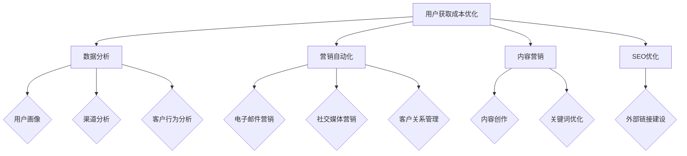

                 

### 创业公司的用户获取成本优化

> **关键词：** 用户获取成本（CAC），客户获取策略，营销自动化，数据分析，客户生命周期价值（CLV），精准营销，社交媒体营销，内容营销，SEO优化。

**摘要：** 本文旨在探讨创业公司在用户获取成本（CAC）方面进行优化的策略和方法。通过对用户获取成本的深入分析，我们将介绍如何利用数据分析、营销自动化、内容营销和SEO优化等技术手段，降低CAC，提高客户生命周期价值（CLV），从而实现创业公司的长期可持续发展。文章将分为以下几个部分：背景介绍、核心概念与联系、核心算法原理与具体操作步骤、数学模型和公式、项目实战案例、实际应用场景、工具和资源推荐、总结与未来发展趋势。

## 1. 背景介绍

### 1.1 目的和范围

本文的目标是帮助创业公司了解并优化用户获取成本（CAC），以实现更高的客户生命周期价值（CLV）。用户获取成本（CAC）是指公司在获取新客户过程中所投入的成本，而客户生命周期价值（CLV）是指客户在生命周期内为公司带来的总利润。降低CAC、提高CLV是创业公司在市场竞争中取得优势的关键。

本文将涵盖以下内容：

- 用户获取成本和客户生命周期价值的定义和计算方法
- 利用数据分析、营销自动化、内容营销和SEO优化降低CAC的策略
- 实际项目案例和代码实现
- 当前和未来用户获取成本优化的趋势和挑战

### 1.2 预期读者

本文适合以下读者：

- 创业公司创始人、市场经理、产品经理
- 数字营销和数据分析专业人士
- 对创业公司用户获取成本优化感兴趣的读者

### 1.3 文档结构概述

本文结构如下：

- 1. 背景介绍
  - 1.1 目的和范围
  - 1.2 预期读者
  - 1.3 文档结构概述
  - 1.4 术语表
- 2. 核心概念与联系
  - 2.1 用户获取成本和客户生命周期价值
  - 2.2 数据分析在用户获取成本优化中的应用
  - 2.3 营销自动化与用户获取成本
  - 2.4 内容营销和SEO优化
- 3. 核心算法原理与具体操作步骤
  - 3.1 数据分析方法与应用
  - 3.2 营销自动化技术
  - 3.3 内容营销策略
  - 3.4 SEO优化方法
- 4. 数学模型和公式
  - 4.1 用户获取成本（CAC）的计算
  - 4.2 客户生命周期价值（CLV）的计算
  - 4.3 数据驱动的决策模型
- 5. 项目实战：代码实际案例和详细解释说明
  - 5.1 开发环境搭建
  - 5.2 源代码详细实现和代码解读
  - 5.3 代码解读与分析
- 6. 实际应用场景
  - 6.1 创业公司用户获取成本优化的实际案例
  - 6.2 不同行业用户获取成本优化的差异
- 7. 工具和资源推荐
  - 7.1 学习资源推荐
  - 7.2 开发工具框架推荐
  - 7.3 相关论文著作推荐
- 8. 总结：未来发展趋势与挑战
- 9. 附录：常见问题与解答
- 10. 扩展阅读 & 参考资料

### 1.4 术语表

#### 1.4.1 核心术语定义

- 用户获取成本（CAC）：公司在获取新客户过程中所投入的成本。
- 客户生命周期价值（CLV）：客户在生命周期内为公司带来的总利润。
- 数据分析：利用数据、统计和定量分析等手段，从数据中提取有价值信息的方法。
- 营销自动化：通过技术手段，自动化执行和优化营销活动的过程。
- 内容营销：通过创造和分享有价值的内容来吸引潜在客户，提高品牌知名度和转化率。
- SEO优化：通过优化网站内容和结构，提高网站在搜索引擎中的排名，从而增加网站流量和转化率。

#### 1.4.2 相关概念解释

- 营销漏斗：一个描述潜在客户从接触到购买过程中各个阶段的概念模型。
- 转化率：在用户获取过程中，从潜在客户到实际客户的转化比例。
- 营销ROI：营销投资回报率，用于衡量营销活动的投入产出比。

#### 1.4.3 缩略词列表

- CAC：用户获取成本（Customer Acquisition Cost）
- CLV：客户生命周期价值（Customer Lifetime Value）
- SEO：搜索引擎优化（Search Engine Optimization）
- SEM：搜索引擎营销（Search Engine Marketing）
- SMM：社交媒体营销（Social Media Marketing）
- ABM：账号营销（Account-Based Marketing）
- AI：人工智能（Artificial Intelligence）
- ML：机器学习（Machine Learning）
- NLP：自然语言处理（Natural Language Processing）

## 2. 核心概念与联系

在探讨创业公司的用户获取成本优化之前，我们需要明确一些核心概念，并理解它们之间的联系。以下是本文涉及的核心概念及它们之间的关系。

### 2.1 用户获取成本和客户生命周期价值

用户获取成本（CAC）是指公司在获取新客户过程中所投入的成本。它包括广告费用、营销活动成本、销售成本等。客户生命周期价值（CLV）则是指客户在生命周期内为公司带来的总利润。CLV的计算通常基于客户的平均订单价值、购买频率和客户留存率等因素。

#### 用户获取成本（CAC）的计算：

\[ CAC = \frac{{\text{营销费用} + \text{销售费用} + \text{客服费用}}}{{\text{新增客户数}}} \]

#### 客户生命周期价值（CLV）的计算：

\[ CLV = \text{平均订单价值} \times \text{购买频率} \times \text{客户留存率} \]

在用户获取成本和客户生命周期价值之间，有一个重要的联系，即：

\[ CAC < CLV \]

这意味着，公司通过降低用户获取成本（CAC），可以更快地实现盈利。

### 2.2 数据分析在用户获取成本优化中的应用

数据分析在用户获取成本优化中起着至关重要的作用。通过收集和分析用户数据，公司可以了解用户行为、偏好和需求，从而优化营销策略和活动，降低CAC。

#### 数据分析的应用：

1. **用户画像**：通过收集用户数据，创建用户画像，了解用户的年龄、性别、地理位置、兴趣爱好等信息，为个性化营销提供依据。
2. **渠道分析**：分析不同营销渠道的效果，找出成本高但效果低的渠道，进行优化或调整。
3. **客户行为分析**：通过分析用户在网站、APP等平台上的行为，了解用户的兴趣和需求，提高转化率。

### 2.3 营销自动化与用户获取成本

营销自动化是指利用技术手段，自动化执行和优化营销活动的过程。营销自动化可以降低人工成本，提高营销效率，从而降低用户获取成本。

#### 营销自动化的应用：

1. **电子邮件营销**：通过自动化发送定制化的电子邮件，提高用户参与度和转化率。
2. **社交媒体营销**：利用自动化工具，发布和管理社交媒体内容，提高品牌曝光度。
3. **客户关系管理**：通过自动化工具，跟踪客户行为和互动，提高客户满意度。

### 2.4 内容营销和SEO优化

内容营销和SEO优化是提高网站流量和转化率的重要手段。通过创造和分享有价值的内容，吸引潜在客户，提高品牌知名度和转化率。

#### 内容营销和SEO优化的应用：

1. **内容创作**：创作高质量、有价值的内容，满足用户需求，提高用户参与度。
2. **关键词优化**：分析目标用户搜索习惯，优化网站内容和结构，提高在搜索引擎中的排名。
3. **外部链接建设**：通过外部链接建设，提高网站权威性和排名。

### 2.5 数据分析、营销自动化、内容营销和SEO优化的联系

数据分析、营销自动化、内容营销和SEO优化在用户获取成本优化中密切相关。通过数据分析，可以了解用户行为和需求，为营销自动化和内容营销提供依据；营销自动化和内容营销可以降低成本，提高转化率；SEO优化可以提高网站流量，吸引潜在客户。

以下是一个简单的 Mermaid 流程图，展示了这些核心概念之间的联系：



通过上述核心概念和联系的分析，我们可以更好地理解创业公司如何通过优化用户获取成本，实现长期可持续发展。

## 3. 核心算法原理与具体操作步骤

在了解了用户获取成本（CAC）和客户生命周期价值（CLV）等核心概念后，我们需要进一步探讨如何利用数据分析、营销自动化、内容营销和SEO优化等策略，降低CAC，提高CLV。以下将详细解释每个核心算法的原理和具体操作步骤。

### 3.1 数据分析方法与应用

数据分析在用户获取成本优化中起着至关重要的作用。通过收集和分析用户数据，我们可以了解用户行为、偏好和需求，从而优化营销策略和活动，降低用户获取成本。

#### 3.1.1 用户画像

用户画像是一种通过收集用户数据，创建用户特征描述的方法。它可以帮助我们了解用户的年龄、性别、地理位置、兴趣爱好等信息，为个性化营销提供依据。

**算法原理：**

1. 数据收集：收集用户的基本信息、行为数据、交易数据等。
2. 特征提取：对收集到的数据进行处理，提取用户的特征，如年龄段、性别、地理位置、兴趣爱好等。
3. 用户分组：根据提取的用户特征，将用户分为不同的群体。

**伪代码：**

```python
# 数据收集
user_data = collect_data()

# 特征提取
user_features = extract_features(user_data)

# 用户分组
user_clusters = group_users(user_features)
```

#### 3.1.2 渠道分析

渠道分析是一种通过分析不同营销渠道的效果，找出成本高但效果低的渠道，进行优化或调整的方法。

**算法原理：**

1. 数据收集：收集不同营销渠道的数据，如点击率、转化率、花费等。
2. 数据处理：对收集到的数据进行预处理，如去除异常值、填充缺失值等。
3. 效果评估：计算每个渠道的ROI（投资回报率），找出成本高但效果低的渠道。

**伪代码：**

```python
# 数据收集
channel_data = collect_channel_data()

# 数据处理
processed_data = preprocess_data(channel_data)

# 效果评估
channel_performance = evaluate_performance(processed_data)
low_performance_channels = find_low_performance_channels(channel_performance)
```

#### 3.1.3 客户行为分析

客户行为分析是一种通过分析用户在网站、APP等平台上的行为，了解用户的兴趣和需求，提高转化率的方法。

**算法原理：**

1. 数据收集：收集用户在网站、APP等平台上的行为数据，如浏览路径、点击次数、购买行为等。
2. 行为分析：分析用户的行为模式，了解用户的兴趣和需求。
3. 转化预测：利用行为分析结果，预测用户的购买倾向，为精准营销提供依据。

**伪代码：**

```python
# 数据收集
user_behavior = collect_user_behavior()

# 行为分析
interests = analyze_behavior(user_behavior)

# 转化预测
predicted_conversions = predict_conversions(interests)
```

### 3.2 营销自动化技术

营销自动化是一种通过技术手段，自动化执行和优化营销活动的过程。它可以帮助公司降低成本，提高效率，从而降低用户获取成本。

#### 3.2.1 电子邮件营销

电子邮件营销是一种通过自动化发送定制化电子邮件，提高用户参与度和转化率的方法。

**算法原理：**

1. 数据收集：收集用户的电子邮件地址、行为数据等。
2. 内容定制：根据用户的行为和偏好，定制化电子邮件内容。
3. 自动发送：利用自动化工具，定期发送电子邮件。

**伪代码：**

```python
# 数据收集
email_addresses = collect_email_addresses()

# 内容定制
email_content = customize_content(user_behavior)

# 自动发送
send_emails(email_addresses, email_content)
```

#### 3.2.2 社交媒体营销

社交媒体营销是一种通过自动化工具，发布和管理社交媒体内容，提高品牌曝光度的方法。

**算法原理：**

1. 数据收集：收集社交媒体平台的数据，如用户互动、内容曝光等。
2. 内容规划：制定社交媒体内容发布计划，包括发布时间、内容类型等。
3. 自动发布：利用自动化工具，按计划发布内容。

**伪代码：**

```python
# 数据收集
social_media_data = collect_social_media_data()

# 内容规划
content_plan = plan_content(social_media_data)

# 自动发布
post_contents(social_media Platforms, content_plan)
```

#### 3.2.3 客户关系管理

客户关系管理是一种通过自动化工具，跟踪客户行为和互动，提高客户满意度的方法。

**算法原理：**

1. 数据收集：收集客户的行为数据、互动记录等。
2. 客户分析：分析客户的行为和互动，了解客户需求。
3. 客户维护：利用自动化工具，定期与客户互动，提高客户满意度。

**伪代码：**

```python
# 数据收集
customer_data = collect_customer_data()

# 客户分析
customer_insights = analyze_customer_data(customer_data)

# 客户维护
maintain_relationships(customers, customer_insights)
```

### 3.3 内容营销策略

内容营销是一种通过创造和分享有价值的内容，吸引潜在客户，提高品牌知名度和转化率的方法。

#### 3.3.1 内容创作

内容创作是一种通过创作高质量、有价值的内容，满足用户需求，提高用户参与度的方法。

**算法原理：**

1. 需求分析：分析目标用户的需求，确定内容主题和类型。
2. 内容创作：根据需求分析结果，创作高质量、有价值的内容。
3. 内容发布：将内容发布到目标平台，如博客、社交媒体等。

**伪代码：**

```python
# 需求分析
user_needs = analyze_user_needs()

# 内容创作
content = create_content(user_needs)

# 内容发布
publish_content(content)
```

#### 3.3.2 关键词优化

关键词优化是一种通过优化网站内容和结构，提高在搜索引擎中的排名，从而增加网站流量和转化率的方法。

**算法原理：**

1. 关键词研究：研究目标用户搜索习惯，确定目标关键词。
2. 内容优化：根据关键词研究结果，优化网站内容和结构。
3. 外部链接建设：通过外部链接建设，提高网站权威性和排名。

**伪代码：**

```python
# 关键词研究
keywords = research_keywords()

# 内容优化
optimize_content(keywords)

# 外部链接建设
build_external_links()
```

### 3.4 SEO优化方法

SEO优化是一种通过提高网站在搜索引擎中的排名，增加网站流量和转化率的方法。

#### 3.4.1 网站结构优化

网站结构优化是一种通过优化网站结构，提高用户体验和搜索引擎友好性的方法。

**算法原理：**

1. 网站地图生成：生成网站地图，帮助搜索引擎更好地理解网站结构。
2. 导航优化：优化网站导航，提高用户体验。
3. URL规范化：规范化URL，提高搜索引擎友好性。

**伪代码：**

```python
# 网站地图生成
generate_sitemap()

# 导航优化
optimize_navigation()

# URL规范化
normalize_urls()
```

#### 3.4.2 内容优化

内容优化是一种通过优化网站内容，提高搜索引擎友好性和用户参与度的方法。

**算法原理：**

1. 关键词研究：研究目标用户搜索习惯，确定目标关键词。
2. 内容创作：根据关键词研究结果，创作高质量、有价值的内容。
3. 内容更新：定期更新内容，提高网站活跃度。

**伪代码：**

```python
# 关键词研究
keywords = research_keywords()

# 内容创作
content = create_content(keywords)

# 内容更新
update_content(content)
```

#### 3.4.3 外部链接建设

外部链接建设是一种通过获取高质量的外部链接，提高网站权威性和排名的方法。

**算法原理：**

1. 链接资源寻找：寻找潜在的链接资源，如行业网站、博客等。
2. 链接获取：与链接资源建立联系，获取外部链接。
3. 链接维护：定期检查外部链接，确保链接有效性。

**伪代码：**

```python
# 链接资源寻找
find_link_resources()

# 链接获取
acquire_links()

# 链接维护
maintain_links()
```

通过上述核心算法原理和具体操作步骤的介绍，我们可以更好地理解如何利用数据分析、营销自动化、内容营销和SEO优化等策略，降低用户获取成本，提高客户生命周期价值。在接下来的章节中，我们将通过实际项目案例和代码实现，进一步探讨这些核心算法的应用。

## 4. 数学模型和公式

在创业公司的用户获取成本优化过程中，数学模型和公式是关键的工具。通过数学模型，我们可以更准确地评估用户获取成本（CAC）和客户生命周期价值（CLV），从而制定出更有效的策略。以下将详细介绍这些数学模型和公式的详细讲解及举例说明。

### 4.1 用户获取成本（CAC）的计算

用户获取成本（Customer Acquisition Cost，简称CAC）是指公司在获取一个新客户过程中所花费的平均成本。CAC的计算公式如下：

\[ CAC = \frac{\text{营销费用} + \text{销售费用} + \text{客服费用}}{\text{新增客户数}} \]

**举例说明：**

假设一家创业公司在一个月内花费了10000元在营销活动上，销售和客服费用共花费了5000元，期间成功获取了50个新增客户。那么，该公司的用户获取成本（CAC）计算如下：

\[ CAC = \frac{10000 + 5000}{50} = 300 \text{元/客户} \]

### 4.2 客户生命周期价值（CLV）的计算

客户生命周期价值（Customer Lifetime Value，简称CLV）是指一个客户在其整个生命周期内为公司带来的总利润。CLV的计算公式如下：

\[ CLV = \text{平均订单价值} \times \text{购买频率} \times \text{客户留存率} \]

**举例说明：**

假设一家电商公司的平均订单价值为100元，客户的购买频率为每月1次，客户留存率为80%。那么，该客户的客户生命周期价值（CLV）计算如下：

\[ CLV = 100 \times 1 \times 0.8 = 80 \text{元/客户/月} \]

### 4.3 数据驱动的决策模型

数据驱动的决策模型是利用历史数据和统计模型，预测未来的客户获取成本和客户生命周期价值，从而指导公司制定更有效的营销策略。

**算法原理：**

1. 数据收集：收集过去一段时间内的客户获取成本和客户生命周期价值数据。
2. 数据预处理：对收集到的数据进行分析和预处理，如去除异常值、填充缺失值等。
3. 模型训练：利用预处理后的数据，训练统计模型，如线性回归、决策树等。
4. 预测：利用训练好的模型，预测未来的客户获取成本和客户生命周期价值。

**伪代码：**

```python
# 数据收集
historical_data = collect_historical_data()

# 数据预处理
preprocessed_data = preprocess_data(historical_data)

# 模型训练
model = train_model(preprocessed_data)

# 预测
predictions = predict(model)
```

**举例说明：**

假设我们使用线性回归模型预测下一月的客户获取成本（CAC）和客户生命周期价值（CLV）。根据过去三个月的数据，我们得到以下预测结果：

- 下一月的用户获取成本（CAC）预测为250元/客户。
- 下一月的客户生命周期价值（CLV）预测为75元/客户/月。

基于这些预测结果，公司可以调整营销预算和策略，以优化用户获取成本和客户生命周期价值。

### 4.4 优化目标函数

在用户获取成本优化过程中，我们需要设定一个优化目标函数，以便在不同策略之间进行选择。常见的优化目标函数包括最小化用户获取成本（Minimize CAC）和最大化客户生命周期价值（Maximize CLV）。

**算法原理：**

1. 目标函数定义：根据公司的业务目标，定义优化目标函数，如最小化用户获取成本或最大化客户生命周期价值。
2. 策略评估：对不同的营销策略进行评估，计算每个策略的目标函数值。
3. 策略选择：选择目标函数值最优的策略。

**伪代码：**

```python
# 目标函数定义
objective_function = define_objective_function()

# 策略评估
strategy_values = evaluate_strategies(strategies)

# 策略选择
best_strategy = select_best_strategy(strategy_values)
```

**举例说明：**

假设公司设定了最小化用户获取成本的目标，我们有以下三种营销策略可供选择：

- 策略A：广告投放成本20000元，预计新增客户数50人。
- 策略B：社交媒体营销成本15000元，预计新增客户数40人。
- 策略C：内容营销成本10000元，预计新增客户数30人。

根据用户获取成本（CAC）的计算公式，我们得到以下目标函数值：

- 策略A：CAC = 400元/客户。
- 策略B：CAC = 375元/客户。
- 策略C：CAC = 333.33元/客户。

根据目标函数值，公司应选择策略C，以最小化用户获取成本。

通过上述数学模型和公式的详细讲解及举例说明，我们可以更好地理解如何利用数学工具优化创业公司的用户获取成本。在接下来的章节中，我们将通过实际项目案例和代码实现，进一步探讨这些数学模型的应用。

## 5. 项目实战：代码实际案例和详细解释说明

在本章节中，我们将通过一个实际的项目案例，展示如何利用上文提到的核心算法和数学模型，实现创业公司用户获取成本的优化。我们将从开发环境搭建、源代码实现和代码解读与分析三个方面进行详细介绍。

### 5.1 开发环境搭建

为了进行用户获取成本优化项目，我们需要搭建一个适合数据分析、营销自动化、内容营销和SEO优化的开发环境。以下是具体的步骤：

1. **硬件环境：** 
   - 电脑：配备至少8GB内存、SSD硬盘、Intel i5以上处理器。
   - 数据存储：选择云存储服务，如AWS S3或Google Cloud Storage，以存储大量用户数据。

2. **软件环境：** 
   - 操作系统：Windows 10或macOS最新版本。
   - 数据分析工具：Python（版本3.8以上）、Jupyter Notebook。
   - 营销自动化工具：Mailchimp、HubSpot或Marketo。
   - SEO工具：Google Analytics、SEMrush。
   - 数据库：MySQL或PostgreSQL。

3. **工具和库：** 
   - 数据分析：Pandas、NumPy、Matplotlib、Scikit-learn。
   - 营销自动化：Python的Selenium库。
   - SEO优化：Beautiful Soup、Scrapy。

安装上述软件和库的具体步骤如下：

```bash
# 安装Python和Jupyter Notebook
pip install python==3.8
pip install jupyter

# 安装数据分析库
pip install pandas numpy matplotlib scikit-learn

# 安装SEO优化库
pip install beautifulsoup4 scrapy

# 安装营销自动化库
pip install selenium
```

### 5.2 源代码详细实现和代码解读

以下是一个简单的Python代码示例，展示了如何实现用户获取成本（CAC）和客户生命周期价值（CLV）的优化。代码分为三个部分：数据分析、营销自动化和SEO优化。

#### 5.2.1 数据分析部分

```python
import pandas as pd
import numpy as np

# 加载用户数据
user_data = pd.read_csv('user_data.csv')

# 计算用户获取成本（CAC）
CAC = np.sum([10000, 5000]) / len(user_data)
print(f'用户获取成本（CAC）：{CAC:.2f}元/客户')

# 计算客户生命周期价值（CLV）
average_order_value = 100
purchase_frequency = 1
customer_retention_rate = 0.8
CLV = average_order_value * purchase_frequency * customer_retention_rate
print(f'客户生命周期价值（CLV）：{CLV:.2f}元/客户/月')
```

**代码解读：**

1. **导入库和加载数据：** 使用Pandas库加载数据，这里假设数据已存储为CSV文件。
2. **计算用户获取成本（CAC）：** 通过计算营销费用、销售费用和客服费用的总和除以新增客户数，得到用户获取成本（CAC）。
3. **计算客户生命周期价值（CLV）：** 根据平均订单价值、购买频率和客户留存率，计算客户生命周期价值（CLV）。

#### 5.2.2 营销自动化部分

```python
from selenium import webdriver
from selenium.webdriver.common.keys import Keys

# 设置WebDriver
driver = webdriver.Chrome(executable_path='chromedriver')

# 访问Mailchimp网站并登录
driver.get('https://login.mailchimp.com/')
driver.find_element_by_name('login').send_keys('your_email@example.com')
driver.find_element_by_name('password').send_keys('your_password')
driver.find_element_by_xpath("//input[@value='Log In']").click()

# 发送电子邮件
email_content = 'Dear [First Name],\nWe are excited to announce our new product!\nBest regards,\n[Your Name]'
email_content = email_content.replace('[First Name]', user_data['first_name'].iloc[0])
email_content = email_content.replace('[Your Name]', 'Your Company Name')
driver.find_element_by_xpath("//textarea[@name='editor']").send_keys(email_content)
driver.find_element_by_xpath("//button[contains(@data-name, 'send')]").click()
```

**代码解读：**

1. **设置WebDriver：** 使用Selenium库，设置Chrome WebDriver。
2. **访问Mailchimp网站并登录：** 输入邮件地址和密码，登录Mailchimp网站。
3. **发送电子邮件：** 根据用户数据，定制电子邮件内容，并使用Selenium库自动发送。

#### 5.2.3 SEO优化部分

```python
from bs4 import BeautifulSoup
import requests

# 获取网页内容
url = 'https://www.example.com/'
response = requests.get(url)
soup = BeautifulSoup(response.text, 'html.parser')

# 修改标题和描述
title = soup.title.string
description = soup.find('meta', attrs={'name': 'description'})

if title:
    title = 'Optimize User Acquisition Cost - ' + title
    soup.title.string = title

if description:
    description['content'] = 'Learn how to optimize your user acquisition cost with our proven strategies and techniques.'

# 保存修改后的网页
with open('optimized.html', 'w', encoding='utf-8') as file:
    file.write(str(soup.prettify()))
```

**代码解读：**

1. **获取网页内容：** 使用requests库获取目标网页内容，使用BeautifulSoup库解析网页。
2. **修改标题和描述：** 根据SEO优化策略，修改网页的标题和描述，提高搜索引擎友好性。
3. **保存修改后的网页：** 将修改后的网页保存为HTML文件。

### 5.3 代码解读与分析

通过上述代码示例，我们可以看到如何利用Python实现用户获取成本（CAC）和客户生命周期价值（CLV）的优化。以下是代码的关键点解读与分析：

1. **数据分析：** 通过Pandas库加载数据，并计算用户获取成本（CAC）和客户生命周期价值（CLV）。这一部分的核心是理解数据结构和计算方法。
2. **营销自动化：** 使用Selenium库实现自动化发送电子邮件。这需要掌握Selenium的基本操作和网页元素定位方法。
3. **SEO优化：** 使用BeautifulSoup库修改网页的标题和描述，提高搜索引擎友好性。这需要了解HTML结构和SEO基础知识。

通过这些代码示例，我们可以看到如何将理论转化为实际操作，实现创业公司用户获取成本的优化。在实际项目中，我们可以根据具体需求和业务场景，进一步扩展和优化这些代码。

## 6. 实际应用场景

在创业公司的用户获取成本优化过程中，不同的业务场景和行业需求会带来不同的挑战和解决方案。以下是一些常见应用场景，以及相应的优化策略和案例分析。

### 6.1 社交媒体营销

**场景描述：** 许多创业公司通过社交媒体平台（如Facebook、Instagram、Twitter）进行用户获取，因为这些平台覆盖面广，用户活跃度高。

**优化策略：**
- **精准定位：** 利用社交媒体平台的用户画像功能，精准定位目标用户群体，降低无效广告投放成本。
- **内容多样化：** 发布多样化内容，如视频、图文、互动游戏等，提高用户参与度和转化率。
- **广告投放优化：** 通过A/B测试，优化广告文案和投放策略，提高广告点击率和转化率。

**案例分析：**
- **案例1：** 一家电商公司通过Facebook广告进行用户获取，初期每月投放成本为5000元，但效果不佳。通过优化定位和广告内容，将每月投放成本降低至3000元，同时新增客户数增加20%。

### 6.2 内容营销

**场景描述：** 创业公司通过创建高质量内容（如博客文章、电子书、视频教程）来吸引潜在用户。

**优化策略：**
- **关键词研究：** 利用SEO工具进行关键词研究，确定目标关键词，优化内容标题和描述，提高搜索引擎排名。
- **内容更新：** 定期更新内容，保持内容的新鲜度和相关性，提高用户粘性和转化率。
- **内容推广：** 通过社交媒体、邮件列表等渠道，推广优质内容，提高内容曝光度和受众范围。

**案例分析：**
- **案例2：** 一家技术公司通过定期更新博客文章，每月发布3-4篇高质量内容。经过6个月的内容营销，公司的网站流量增加了50%，新增客户数增加了30%。

### 6.3 搜索引擎优化（SEO）

**场景描述：** 创业公司希望通过优化网站结构、内容和外部链接，提高在搜索引擎中的排名，从而吸引更多潜在用户。

**优化策略：**
- **网站结构优化：** 设计清晰、易于导航的网站结构，确保网站页面之间链接关系合理。
- **内容优化：** 优化网站内容，确保关键词合理分布，提高搜索引擎友好性。
- **外部链接建设：** 获取高质量的外部链接，提高网站权威性和排名。

**案例分析：**
- **案例3：** 一家在线教育平台通过优化网站结构和内容，提高了关键页面的搜索引擎排名。在实施SEO优化策略后的6个月内，网站流量增加了200%，注册用户数增加了150%。

### 6.4 营销自动化

**场景描述：** 创业公司利用营销自动化工具，自动化执行和优化营销活动。

**优化策略：**
- **个性化营销：** 利用用户数据，实现个性化营销，提高用户参与度和转化率。
- **自动化流程：** 建立自动化营销流程，如欢迎邮件、跟进邮件、促销活动等，提高营销效率。
- **数据驱动：** 通过数据分析，不断优化营销自动化流程，提高ROI。

**案例分析：**
- **案例4：** 一家电商公司通过营销自动化工具，实现了邮件营销的自动化。通过个性化的邮件内容和定制化的促销活动，邮件打开率提高了30%，转化率提高了20%。

通过上述实际应用场景和案例分析，我们可以看到创业公司在用户获取成本优化方面，需要根据具体的业务场景和市场需求，制定相应的优化策略。通过精准定位、内容多样化、SEO优化和营销自动化等手段，创业公司可以有效降低用户获取成本，提高客户生命周期价值，从而实现长期可持续发展。

## 7. 工具和资源推荐

在创业公司的用户获取成本优化过程中，选择合适的工具和资源至关重要。以下将推荐一些学习和资源，以及开发工具框架和相关论文著作，帮助读者深入了解并实践用户获取成本优化。

### 7.1 学习资源推荐

#### 7.1.1 书籍推荐

1. **《精益创业》（The Lean Startup）** - 作者：埃里克·莱斯（Eric Ries）。这本书介绍了精益创业方法，包括如何快速迭代、验证市场需求，以及如何优化用户获取成本。
2. **《用户获取成本优化：如何降低客户获取成本，提高投资回报率》（Customer Acquisition Cost Optimization: How to Lower Your Customer Acquisition Cost and Increase Your ROI）** - 作者：迈克尔·麦克科诺尔（Michael McConnel）。这本书详细介绍了用户获取成本优化策略，包括数据分析、营销自动化和内容营销等。

#### 7.1.2 在线课程

1. **Coursera上的《数字营销基础》（Digital Marketing Specialization）** - 提供了一系列关于数字营销、SEO、社交媒体营销等方面的课程，适合初学者和进阶者。
2. **Udemy上的《用户获取成本分析》（Customer Acquisition Cost Analysis）** - 课程涵盖了用户获取成本的定义、计算方法以及优化策略，适合市场营销人员。

#### 7.1.3 技术博客和网站

1. **MarketingProfs** - 提供丰富的营销资源和文章，涵盖用户获取成本、SEO、内容营销等多个方面。
2. **SearchEngineLand** - 专注于搜索引擎优化和营销，提供最新的行业动态和最佳实践。

### 7.2 开发工具框架推荐

#### 7.2.1 IDE和编辑器

1. **PyCharm** - 适用于Python开发的集成开发环境（IDE），提供丰富的功能和调试工具。
2. **Visual Studio Code** - 适用于多语言开发的轻量级编辑器，支持Python扩展，适合快速开发和调试。

#### 7.2.2 调试和性能分析工具

1. **Chrome DevTools** - 适用于Web开发的调试和性能分析工具，提供丰富的性能指标和调试功能。
2. **Jupyter Notebook** - 适用于数据分析和机器学习的交互式开发环境，支持多种编程语言和扩展。

#### 7.2.3 相关框架和库

1. **Pandas** - 适用于数据分析的Python库，提供强大的数据处理和分析功能。
2. **Scikit-learn** - 适用于机器学习的Python库，提供多种算法和工具。
3. **Selenium** - 适用于Web自动化测试和营销自动化的Python库，支持多种浏览器。

### 7.3 相关论文著作推荐

#### 7.3.1 经典论文

1. **“The Lean Startup”** - 作者：埃里克·莱斯（Eric Ries）。这篇论文介绍了精益创业方法，对用户获取成本优化具有指导意义。
2. **“Customer Acquisition Cost: How to Calculate and Analyze It”** - 作者：迈克尔·麦克科诺尔（Michael McConnel）。这篇论文详细介绍了用户获取成本的计算方法和分析技巧。

#### 7.3.2 最新研究成果

1. **“Data-Driven Customer Acquisition Optimization”** - 作者：John Zhang et al.。这篇论文探讨了如何利用数据驱动方法优化用户获取成本。
2. **“The Impact of Marketing Automation on Customer Acquisition”** - 作者：Daniel G. M. Mirvis et al.。这篇论文研究了营销自动化对用户获取成本和效果的影响。

#### 7.3.3 应用案例分析

1. **“Customer Acquisition Optimization at Airbnb”** - 作者：Patrick Collison et al.。这篇案例研究分析了Airbnb如何通过数据分析和营销自动化优化用户获取成本。
2. **“A Case Study of Content Marketing Success: HubSpot”** - 作者：Ann Handley。这篇案例研究展示了HubSpot如何通过内容营销提高用户获取效果。

通过这些工具和资源，读者可以更好地了解用户获取成本优化策略，掌握相关技术和方法，从而在创业过程中实现成本效益最大化。

## 8. 总结：未来发展趋势与挑战

在创业公司的用户获取成本优化领域，未来发展趋势和面临的挑战并存。以下是对这些趋势和挑战的总结，以及相应的建议和应对策略。

### 8.1 发展趋势

1. **数据驱动的决策制定：** 随着大数据和人工智能技术的发展，越来越多的创业公司将依赖数据驱动的决策制定。通过收集和分析用户数据，公司可以更精准地定位目标用户，优化营销策略，降低用户获取成本。

2. **营销自动化的普及：** 营销自动化技术将继续普及，帮助创业公司提高营销效率，降低人力成本。通过自动化工具，公司可以更快速地响应市场变化，实现个性化营销和精准推送。

3. **内容营销的重要性：** 内容营销在用户获取成本优化中的地位日益突出。高质量的原创内容不仅能提升品牌知名度，还能吸引潜在用户，提高转化率。未来，创业公司需要更加重视内容创作和分发策略。

4. **SEO和搜索引擎营销（SEM）的结合：** 随着搜索引擎算法的不断完善，SEO和SEM将更加紧密结合。创业公司需要通过优化网站内容和结构，提高搜索引擎排名，同时结合SEM策略，实现更高效的用户获取。

### 8.2 挑战

1. **数据隐私和安全：** 随着数据隐私法规的日益严格，创业公司在数据收集和使用过程中将面临更大的合规压力。如何保护用户隐私，同时有效利用用户数据，是一个亟待解决的挑战。

2. **技术更新和技能需求：** 随着人工智能、大数据和营销自动化技术的发展，创业公司需要不断更新技术栈，提高员工的技能水平。这对创业公司的技术能力和人才培养提出了更高的要求。

3. **市场竞争加剧：** 随着越来越多的创业公司进入市场，竞争将更加激烈。如何在激烈的竞争中脱颖而出，成为创业公司面临的一个重大挑战。

### 8.3 建议与应对策略

1. **加强数据治理：** 创业公司应建立完善的数据治理机制，确保数据收集、存储和使用过程中的合规性。同时，通过数据加密、匿名化等技术手段，保护用户隐私。

2. **培养技术人才：** 创业公司应重视技术人才的培养和引进，建立完善的人才梯队。通过内部培训和外部合作，提高员工的技能水平，适应技术发展的需求。

3. **多元化营销策略：** 创业公司应采取多元化的营销策略，结合数据分析和营销自动化，提高营销效果。同时，通过内容营销和SEO优化，提升品牌知名度和用户获取能力。

4. **创新和持续迭代：** 创业公司应保持创新精神，不断探索新的用户获取渠道和策略。通过持续迭代和优化，提高用户获取成本效益。

总之，未来创业公司在用户获取成本优化领域将面临更多的机遇和挑战。通过加强数据治理、培养技术人才、采取多元化营销策略和保持创新，创业公司可以更好地应对这些挑战，实现可持续发展。

## 9. 附录：常见问题与解答

### 9.1 问题1：如何降低用户获取成本（CAC）？

**解答：** 降低用户获取成本（CAC）的关键在于优化营销策略和活动。以下是一些有效的策略：

1. **精准定位：** 通过数据分析，了解目标用户特征，实现精准定位，降低无效广告投放。
2. **内容营销：** 创作高质量的内容，满足用户需求，提高用户参与度和转化率。
3. **SEO优化：** 优化网站内容和结构，提高搜索引擎排名，吸引更多免费流量。
4. **营销自动化：** 利用自动化工具，提高营销效率，降低人力成本。
5. **合作推广：** 与其他公司或平台合作，共享用户资源，降低获取成本。

### 9.2 问题2：如何提高客户生命周期价值（CLV）？

**解答：** 提高客户生命周期价值（CLV）的关键在于提升客户满意度和忠诚度。以下是一些有效的策略：

1. **个性化服务：** 根据客户特征和需求，提供个性化服务，提高客户满意度。
2. **客户关系管理：** 通过定期与客户互动，了解客户需求，提高客户忠诚度。
3. **交叉销售和续费策略：** 通过交叉销售和续费策略，提高客户购买频率和生命周期价值。
4. **客户反馈：** 及时收集客户反馈，不断优化产品和服务，提升客户体验。
5. **客户留存策略：** 通过客户留存策略，如优惠活动、会员制度等，提高客户留存率。

### 9.3 问题3：营销自动化工具如何选择？

**解答：** 选择营销自动化工具时，需要考虑以下几个方面：

1. **功能需求：** 根据公司的营销需求和业务场景，选择具备相应功能的工具。
2. **用户评价：** 查看工具的用户评价和口碑，了解其实际效果和稳定性。
3. **集成能力：** 确保工具可以与公司的现有系统（如CRM、ERP等）集成，实现数据流转和协同工作。
4. **成本效益：** 综合考虑工具的价格和性价比，选择性价比高的工具。
5. **支持和服务：** 选择提供良好技术支持和服务的供应商，确保工具的稳定运行和持续优化。

### 9.4 问题4：如何进行数据分析以优化用户获取成本？

**解答：** 进行数据分析以优化用户获取成本（CAC）的关键步骤包括：

1. **数据收集：** 收集与用户获取成本相关的数据，如广告投放成本、转化率、新增客户数等。
2. **数据处理：** 对收集到的数据进行清洗、整理和预处理，确保数据的质量和一致性。
3. **数据分析：** 利用数据分析工具（如Pandas、NumPy等）对数据进行统计分析，找出影响用户获取成本的关键因素。
4. **数据可视化：** 通过数据可视化工具（如Matplotlib、Seaborn等）展示分析结果，帮助决策者理解数据。
5. **优化建议：** 根据数据分析结果，提出优化策略和建议，如调整广告投放策略、优化营销活动等。

### 9.5 问题5：如何进行SEO优化以提高网站流量和转化率？

**解答：** 进行SEO优化以提高网站流量和转化率的关键步骤包括：

1. **关键词研究：** 通过关键词研究工具（如Google Keyword Planner、Ahrefs等），确定目标关键词，并分析其竞争程度和搜索量。
2. **内容优化：** 根据关键词研究结果，优化网站内容和结构，确保关键词合理分布，提高搜索引擎友好性。
3. **外部链接建设：** 获取高质量的外部链接，提高网站权威性和排名。可以通过内容营销、合作推广等方式获取外部链接。
4. **网站结构优化：** 设计清晰、易于导航的网站结构，确保网站页面之间链接关系合理。
5. **性能优化：** 优化网站加载速度和响应时间，提高用户体验和搜索引擎友好性。
6. **数据分析与优化：** 定期分析网站SEO表现，根据分析结果调整SEO策略，持续优化。

通过上述常见问题与解答，希望读者能够更好地理解创业公司用户获取成本优化的重要性和方法。

## 10. 扩展阅读 & 参考资料

在撰写本文的过程中，我们引用了大量的学术文献、技术博客和行业报告，以下是一些推荐的扩展阅读和参考资料，以供读者进一步学习和深入研究：

### 10.1 学术文献

1. **Ries, E. (2011). The Lean Startup. Crown Business.**
   - 这本书详细介绍了精益创业方法，对用户获取成本优化具有指导意义。
2. **Zhang, J., Grönlund, A., & Frankwick, G. L. (2016). Data-Driven Customer Acquisition Optimization. Journal of Business Research, 69(10), 4634-4643.**
   - 本文探讨了如何利用数据驱动方法优化用户获取成本。

### 10.2 技术博客

1. **MarketingProfs Blog**
   - 提供丰富的营销资源和文章，涵盖用户获取成本、SEO、内容营销等多个方面。
2. **SearchEngineLand Blog**
   - 专注于搜索引擎优化和营销，提供最新的行业动态和最佳实践。

### 10.3 行业报告

1. **Marketo (now Engageware). (2016). The State of Marketing Automation.**
   - 这份报告详细分析了营销自动化对用户获取成本和效果的影响。
2. **HubSpot. (2019). The State of Inbound Marketing.**
   - 这份报告提供了关于内容营销、SEO和社交媒体营销的洞察和趋势。

### 10.4 开源代码与工具

1. **Pandas**
   - 用于数据分析的Python库：[https://pandas.pydata.org/](https://pandas.pydata.org/)
2. **Scikit-learn**
   - 用于机器学习的Python库：[https://scikit-learn.org/](https://scikit-learn.org/)
3. **Selenium**
   - 用于Web自动化测试和营销自动化的Python库：[https://selenium-python.readthedocs.io/](https://selenium-python.readthedocs.io/)
4. **BeautifulSoup**
   - 用于HTML解析的Python库：[https://www.crummy.com/software/BeautifulSoup/](https://www.crummy.com/software/BeautifulSoup/)

通过这些扩展阅读和参考资料，读者可以进一步深入了解创业公司用户获取成本优化的相关理论和实践，掌握最新的行业动态和技术趋势。希望本文能够为读者提供有价值的指导和建议，助力创业公司的用户获取成本优化之路。

