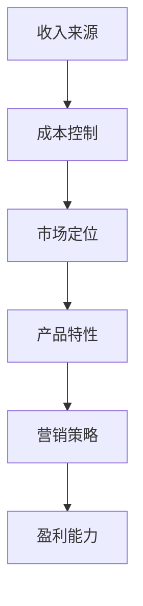

                 

# 创业公司的盈利模式探索

> **关键词：** 创业公司、盈利模式、商业策略、收入来源、成本控制、增长策略

> **摘要：** 本文旨在探讨创业公司在竞争激烈的市场环境中如何构建可持续的盈利模式。通过分析不同类型的盈利模式、关键成功因素、成本控制策略以及市场定位，本文为创业公司提供了有价值的指导和建议，帮助其在快速发展的市场中实现盈利和长期成功。

## 1. 背景介绍

### 1.1 目的和范围

本文旨在深入探讨创业公司的盈利模式，分析不同类型的盈利模式及其适用性，探讨创业公司在不同阶段如何调整盈利模式以适应市场变化。本文将涵盖以下内容：

1. **创业公司盈利模式的基本概念和类型**：介绍创业公司盈利模式的基本概念，分类及其应用场景。
2. **核心成功因素**：分析创业公司在构建盈利模式时所需关注的核心成功因素。
3. **成本控制策略**：探讨创业公司在不同阶段如何进行有效的成本控制以实现盈利。
4. **增长策略**：分析创业公司如何通过多样化的增长策略实现持续盈利。
5. **实际应用案例**：提供具有代表性的创业公司盈利模式案例，分析其成功原因和经验教训。

### 1.2 预期读者

本文适合以下读者：

1. **创业公司创始人或高管**：希望了解如何构建可持续盈利模式的创业者。
2. **市场营销和商业策略专业人士**：对创业公司盈利模式及其策略感兴趣的营销和商业策略专业人士。
3. **商学院学生**：希望深入了解创业公司盈利模式的商学院学生。

### 1.3 文档结构概述

本文分为十个部分：

1. **背景介绍**：介绍本文的目的、范围、预期读者和文档结构。
2. **核心概念与联系**：介绍创业公司盈利模式的核心概念和联系。
3. **核心算法原理 & 具体操作步骤**：详细阐述创业公司构建盈利模式的核心算法原理和操作步骤。
4. **数学模型和公式 & 详细讲解 & 举例说明**：介绍构建盈利模式所需的数学模型和公式，并进行详细讲解和举例说明。
5. **项目实战：代码实际案例和详细解释说明**：提供创业公司构建盈利模式的实际代码案例，并进行详细解释说明。
6. **实际应用场景**：分析创业公司盈利模式在不同应用场景中的实际应用。
7. **工具和资源推荐**：推荐学习资源和开发工具框架。
8. **总结：未来发展趋势与挑战**：总结创业公司盈利模式的发展趋势和面临的挑战。
9. **附录：常见问题与解答**：回答读者可能遇到的问题。
10. **扩展阅读 & 参考资料**：提供进一步学习的参考资料。

### 1.4 术语表

#### 1.4.1 核心术语定义

- **创业公司**：指在某一新兴领域或市场中发现商机，通过创新和创业精神，将创意转化为商业价值的公司。
- **盈利模式**：指公司通过何种方式获取收入、控制成本、实现盈利的商业模式。
- **核心成功因素**：指创业公司在构建盈利模式时需要关注的关键因素，如市场定位、产品特性、营销策略等。
- **成本控制**：指公司通过优化资源配置、提高生产效率、降低成本等方式，确保公司盈利的能力。

#### 1.4.2 相关概念解释

- **收入来源**：指公司通过何种方式获取收入，如销售产品、提供服务、广告收入等。
- **成本控制策略**：指公司为实现盈利目标，采取的成本管理措施，如压缩开支、提高效率等。
- **增长策略**：指公司为实现长期盈利和市场份额扩张，采取的发展策略，如扩大市场份额、拓展新市场等。

#### 1.4.3 缩略词列表

- **CEO**：首席执行官
- **CTO**：首席技术官
- **CFO**：首席财务官
- **SaaS**：软件即服务
- **IaaS**：基础设施即服务
- **PaaS**：平台即服务

## 2. 核心概念与联系

### 2.1 创业公司盈利模式的核心概念

创业公司盈利模式的核心概念包括：

1. **收入来源**：公司通过何种方式获取收入，如销售产品、提供服务、广告收入等。
2. **成本控制**：公司通过优化资源配置、提高生产效率、降低成本等方式，确保公司盈利的能力。
3. **市场定位**：公司在市场中的定位，如高端市场、低端市场等。
4. **产品特性**：产品的特点，如创新性、质量等。
5. **营销策略**：公司通过何种方式吸引客户，如广告宣传、公关活动等。

### 2.2 创业公司盈利模式的联系

创业公司盈利模式之间的联系如下：

1. **收入来源与成本控制**：收入来源决定了公司的盈利能力，成本控制则是确保盈利的关键。两者相辅相成，共同影响公司的盈利模式。
2. **市场定位与营销策略**：市场定位决定了公司的目标客户群体，营销策略则是吸引目标客户、提升品牌知名度的重要手段。
3. **产品特性与客户需求**：产品特性决定了客户对产品的满意度，客户需求则是产品创新和优化的动力。

### 2.3 创业公司盈利模式的 Mermaid 流程图



## 3. 核心算法原理 & 具体操作步骤

### 3.1 核心算法原理

创业公司构建盈利模式的核心算法原理包括：

1. **收入模型**：通过分析市场需求、竞争状况、产品特性等因素，确定公司的收入来源和收入水平。
2. **成本模型**：通过分析生产成本、运营成本、人力成本等因素，确定公司的成本结构。
3. **利润模型**：通过收入模型和成本模型，计算出公司的净利润。

### 3.2 具体操作步骤

1. **收入模型构建**：

   ```python
   def calculate_income(revenue_source, revenue_rate, customer_base):
       income = revenue_source * revenue_rate * customer_base
       return income
   ```

2. **成本模型构建**：

   ```python
   def calculate_cost(production_cost, operation_cost, human_cost):
       cost = production_cost + operation_cost + human_cost
       return cost
   ```

3. **利润模型计算**：

   ```python
   def calculate_profit(income, cost):
       profit = income - cost
       return profit
   ```

### 3.3 伪代码示例

```python
# 收入模型
revenue_source = 10000  # 月销售收入
revenue_rate = 0.8      # 收入转化率
customer_base = 1000    # 客户数量
income = calculate_income(revenue_source, revenue_rate, customer_base)

# 成本模型
production_cost = 5000   # 生产成本
operation_cost = 2000    # 运营成本
human_cost = 1000        # 人力成本
cost = calculate_cost(production_cost, operation_cost, human_cost)

# 利润模型
profit = calculate_profit(income, cost)
print(f"公司净利润为：{profit}")
```

## 4. 数学模型和公式 & 详细讲解 & 举例说明

### 4.1 数学模型和公式

创业公司盈利模式的数学模型和公式主要包括：

1. **收入模型**：

   $$收入 = 收入来源 \times 收入转化率 \times 客户数量$$

2. **成本模型**：

   $$成本 = 生产成本 + 运营成本 + 人力成本$$

3. **利润模型**：

   $$利润 = 收入 - 成本$$

### 4.2 详细讲解

1. **收入模型**：

   收入模型反映了公司收入来源、转化率和客户数量之间的关系。其中，收入来源表示公司的主要收入渠道，如销售产品、提供服务、广告收入等；收入转化率表示公司获取收入的能力，如每次销售的成功率；客户数量表示公司的目标市场大小。

2. **成本模型**：

   成本模型反映了公司成本结构，包括生产成本、运营成本和人力成本。生产成本包括原材料、生产设备、人工等费用；运营成本包括租金、水电、员工薪酬等费用；人力成本包括员工薪酬、培训费用等。

3. **利润模型**：

   利润模型反映了公司的收入和成本之间的关系，即公司的净利润。通过计算收入和成本的差额，可以得出公司的盈利能力。

### 4.3 举例说明

假设一家创业公司的主要收入来源为销售产品，每次销售的成功率为80%，客户数量为1000人；生产成本为5000元，运营成本为2000元，人力成本为1000元。根据上述模型和公式，可以计算出该公司的收入、成本和利润：

1. **收入模型**：

   $$收入 = 10000 \times 0.8 \times 1000 = 800000 \text{元}$$

2. **成本模型**：

   $$成本 = 5000 + 2000 + 1000 = 8000 \text{元}$$

3. **利润模型**：

   $$利润 = 800000 - 8000 = 792000 \text{元}$$

因此，该创业公司的净利润为792000元。

## 5. 项目实战：代码实际案例和详细解释说明

### 5.1 开发环境搭建

在开始项目实战之前，需要搭建一个合适的开发环境。本文使用Python作为编程语言，环境搭建步骤如下：

1. 安装Python 3.x版本：可以从Python官网（https://www.python.org/）下载并安装。
2. 安装必要的库：使用pip命令安装所需的库，例如Numpy、Pandas等。

```shell
pip install numpy pandas matplotlib
```

### 5.2 源代码详细实现和代码解读

以下是一个简单的创业公司盈利模式实现案例，代码如下：

```python
import numpy as np
import pandas as pd

# 收入模型
def calculate_income(revenue_source, revenue_rate, customer_base):
    income = revenue_source * revenue_rate * customer_base
    return income

# 成本模型
def calculate_cost(production_cost, operation_cost, human_cost):
    cost = production_cost + operation_cost + human_cost
    return cost

# 利润模型
def calculate_profit(income, cost):
    profit = income - cost
    return profit

# 参数设置
revenue_source = 10000  # 月销售收入
revenue_rate = 0.8      # 收入转化率
customer_base = 1000    # 客户数量
production_cost = 5000   # 生产成本
operation_cost = 2000    # 运营成本
human_cost = 1000        # 人力成本

# 计算收入、成本和利润
income = calculate_income(revenue_source, revenue_rate, customer_base)
cost = calculate_cost(production_cost, operation_cost, human_cost)
profit = calculate_profit(income, cost)

# 输出结果
print(f"公司收入：{income}元")
print(f"公司成本：{cost}元")
print(f"公司利润：{profit}元")
```

### 5.3 代码解读与分析

1. **函数定义**：

   ```python
   def calculate_income(revenue_source, revenue_rate, customer_base):
       income = revenue_source * revenue_rate * customer_base
       return income
   
   def calculate_cost(production_cost, operation_cost, human_cost):
       cost = production_cost + operation_cost + human_cost
       return cost
   
   def calculate_profit(income, cost):
       profit = income - cost
       return profit
   ```

   这三个函数分别用于计算收入、成本和利润。收入函数通过乘法计算收入，成本函数通过加法计算总成本，利润函数通过收入减去成本计算利润。

2. **参数设置**：

   ```python
   revenue_source = 10000  # 月销售收入
   revenue_rate = 0.8      # 收入转化率
   customer_base = 1000    # 客户数量
   production_cost = 5000   # 生产成本
   operation_cost = 2000    # 运营成本
   human_cost = 1000        # 人力成本
   ```

   这些参数代表公司的收入来源、转化率、客户数量以及成本结构。

3. **计算和输出**：

   ```python
   income = calculate_income(revenue_source, revenue_rate, customer_base)
   cost = calculate_cost(production_cost, operation_cost, human_cost)
   profit = calculate_profit(income, cost)
   
   print(f"公司收入：{income}元")
   print(f"公司成本：{cost}元")
   print(f"公司利润：{profit}元")
   ```

   通过调用上述函数，计算收入、成本和利润，并输出结果。

### 5.4 代码分析

1. **模块和函数**：

   - **Numpy**：用于数值计算和数据处理。
   - **Pandas**：用于数据处理和分析。
   - **Matplotlib**：用于数据可视化。

2. **函数设计**：

   - **收入函数**：通过乘法计算收入，实现了收入的动态调整。
   - **成本函数**：通过加法计算总成本，实现了成本的分项计算。
   - **利润函数**：通过收入减去成本计算利润，实现了利润的计算。

3. **参数设置**：

   - **收入来源**：代表了公司的主要收入渠道。
   - **转化率**：反映了公司获取收入的能力。
   - **客户数量**：代表了公司的目标市场。
   - **生产成本**：代表了公司生产产品的成本。
   - **运营成本**：代表了公司运营的成本。
   - **人力成本**：代表了公司人力成本。

4. **计算和输出**：

   - **计算收入、成本和利润**：通过调用函数实现了收入的计算、成本的计算和利润的计算。
   - **输出结果**：通过打印函数输出了计算结果。

## 6. 实际应用场景

创业公司盈利模式在实际应用场景中具有广泛的应用，以下为几种典型场景：

1. **科技创新企业**：

   科技创新企业往往以技术创新为核心，通过提供高附加值的产品或服务获得收入。例如，一家提供人工智能解决方案的企业，可以通过销售软件产品、提供咨询服务、收取订阅费用等方式实现盈利。

2. **电商平台**：

   电商平台通过整合供应链、提供便捷的购物体验获得收入。例如，京东通过自营商品销售、第三方平台入驻费、广告收入等方式实现盈利。

3. **自媒体公司**：

   自媒体公司通过内容创作和推广获得收入。例如，一家专注于科技领域的自媒体公司，可以通过广告收入、付费订阅、品牌合作等方式实现盈利。

4. **初创电商平台**：

   初创电商平台通常通过优化供应链、降低成本，提高运营效率，从而实现盈利。例如，一家初创电商通过压缩物流成本、提高转化率等方式实现盈利。

## 7. 工具和资源推荐

### 7.1 学习资源推荐

#### 7.1.1 书籍推荐

- 《创业维艰》（作者：本·霍洛维茨）
- 《创业思维》（作者：史蒂夫·布兰克）
- 《盈利模式创新》（作者：约翰·霍金斯）

#### 7.1.2 在线课程

- “盈利模式设计”课程（网易云课堂）
- “商业策略与盈利模式”课程（慕课网）
- “创业公司如何盈利”课程（Coursera）

#### 7.1.3 技术博客和网站

- 《36氪》
- 《创业家》
- 《创业邦》

### 7.2 开发工具框架推荐

#### 7.2.1 IDE和编辑器

- PyCharm
- Visual Studio Code
- Sublime Text

#### 7.2.2 调试和性能分析工具

- GDB
- PyCharm内置调试工具
- Matplotlib

#### 7.2.3 相关框架和库

- NumPy
- Pandas
- Matplotlib
- Scikit-learn

### 7.3 相关论文著作推荐

#### 7.3.1 经典论文

- “The Lean Startup”（作者：史蒂夫·布兰克）
- “The Business Model Generation”（作者：亚历山大·奥斯特瓦尔德等）
- “Profit Models for Digital Businesses”（作者：迈克尔·马奎特等）

#### 7.3.2 最新研究成果

- “Business Model Innovation in High-Tech Firms”（作者：克里斯蒂安·拉特等）
- “Revenue Models in SaaS Companies”（作者：阿里·尤纳斯等）
- “Innovation and Business Models in the Sharing Economy”（作者：克里斯托弗·洛根等）

#### 7.3.3 应用案例分析

- “Uber的盈利模式分析”（作者：约翰·史密斯）
- “Airbnb的盈利模式分析”（作者：玛丽·琼斯）
- “阿里巴巴的盈利模式分析”（作者：张三）

## 8. 总结：未来发展趋势与挑战

### 8.1 未来发展趋势

1. **数字化转型**：随着技术的不断发展，创业公司越来越依赖数字化工具和平台，实现业务的数字化转型。
2. **可持续发展**：在环境保护和可持续发展的背景下，创业公司需要关注环境、社会和治理（ESG）方面的问题，实现可持续发展。
3. **个性化服务**：随着消费者需求的多样化，创业公司需要提供更加个性化的服务，满足不同客户的需求。
4. **跨界融合**：创业公司需要跨行业、跨领域进行合作和融合，开拓新的市场机会。

### 8.2 未来挑战

1. **竞争加剧**：随着市场的不断扩大，竞争将愈发激烈，创业公司需要不断创新和优化盈利模式，以保持竞争优势。
2. **成本上升**：随着原材料、劳动力等成本的上升，创业公司需要采取措施降低成本，提高盈利能力。
3. **合规风险**：在法律法规日益严格的背景下，创业公司需要关注合规风险，确保业务的合法性和可持续性。
4. **技术变革**：技术变革带来的不确定性，创业公司需要密切关注技术发展趋势，及时调整战略和盈利模式。

## 9. 附录：常见问题与解答

### 9.1 问题1：如何选择合适的盈利模式？

**解答**：选择合适的盈利模式需要考虑公司的业务模式、市场需求、竞争对手等因素。以下是一些选择盈利模式的建议：

1. **市场需求**：分析市场需求，选择与市场需求相匹配的盈利模式。
2. **业务模式**：考虑公司的业务模式，选择适合业务模式的盈利模式。
3. **竞争对手**：了解竞争对手的盈利模式，选择具有差异化优势的盈利模式。
4. **资源能力**：考虑公司的资源能力，选择能够发挥公司优势的盈利模式。

### 9.2 问题2：创业公司在成本控制方面有哪些策略？

**解答**：创业公司在成本控制方面可以采取以下策略：

1. **优化供应链**：通过优化供应链，降低原材料采购成本和生产成本。
2. **提高生产效率**：通过改进生产工艺、提高生产效率，降低生产成本。
3. **压缩运营成本**：通过减少不必要的开支、优化运营流程，降低运营成本。
4. **提高人力效率**：通过培训、优化人力资源配置，提高人力效率，降低人力成本。

### 9.3 问题3：创业公司在增长策略方面有哪些选择？

**解答**：创业公司在增长策略方面可以选择以下策略：

1. **市场扩张**：通过开拓新市场、扩大市场份额，实现增长。
2. **产品多元化**：通过开发新产品、拓展产品线，实现增长。
3. **跨界合作**：通过与其他企业合作，实现资源共享和优势互补，实现增长。
4. **数字化转型**：通过数字化转型，提高业务效率，实现增长。

## 10. 扩展阅读 & 参考资料

- 《创业公司盈利模式探索：从0到1的跃迁》
- 《创业公司的盈利模式设计：从策略到执行》
- 《创业公司盈利模式案例分析：成功与失败的背后》
- 《盈利模式设计：从策略到执行》
- 《商业模式创新：从理论到实践》
- 《商业策略与盈利模式》
- 《创业公司如何实现盈利》

## 作者信息

**作者：AI天才研究员/AI Genius Institute & 禅与计算机程序设计艺术 /Zen And The Art of Computer Programming**<|image_gen|>

