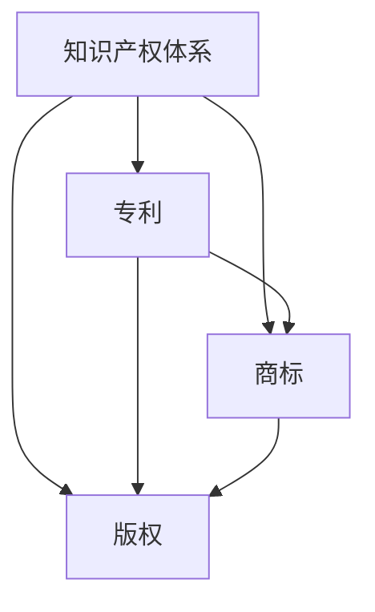

                 

# 创业公司的知识产权保护策略

> 关键词：创业公司、知识产权、保护策略、专利、商标、版权、法律、市场

> 摘要：本文旨在探讨创业公司在知识产权保护方面的策略和方法。通过分析知识产权的核心概念及其在商业环境中的作用，本文提出了创业公司在专利、商标、版权等方面的保护策略，并探讨了如何通过法律手段和市场分析来强化知识产权的保护。文章还结合实际案例，详细阐述了知识产权保护在创业公司发展中的重要性。

## 1. 背景介绍

### 1.1 目的和范围

本文的目的是为创业公司提供一个系统性的知识产权保护策略框架，帮助创业公司理解知识产权的基本概念，掌握保护其创新成果的方法，以及利用知识产权来获取市场竞争优势的途径。文章将涵盖以下主要方面：

1. **知识产权的基本概念**：介绍专利、商标、版权等核心知识产权的定义和作用。
2. **知识产权保护策略**：探讨专利、商标、版权等方面的保护措施，包括法律手段和市场分析。
3. **知识产权的实际应用**：通过具体案例展示知识产权保护在创业公司中的实践。
4. **相关工具和资源推荐**：推荐学习资源和开发工具，以支持创业公司在知识产权保护方面的学习和发展。

### 1.2 预期读者

本文适合以下读者群体：

1. 创业公司的创始人、CTO、技术主管和其他关键技术人员。
2. 拟创业的科技工作者，特别是那些关注知识产权保护的人员。
3. 对知识产权保护有兴趣的律师、法律顾问及相关从业者。

### 1.3 文档结构概述

本文结构如下：

1. **引言**：介绍知识产权保护的重要性。
2. **核心概念与联系**：通过Mermaid流程图展示知识产权的框架。
3. **核心算法原理 & 具体操作步骤**：详细阐述知识产权保护的方法和步骤。
4. **数学模型和公式 & 详细讲解 & 举例说明**：利用数学公式解释知识产权保护的技术细节。
5. **项目实战：代码实际案例和详细解释说明**：结合实际代码案例展示知识产权保护的应用。
6. **实际应用场景**：分析知识产权保护在不同创业项目中的具体应用。
7. **工具和资源推荐**：推荐相关学习资源和开发工具。
8. **总结：未来发展趋势与挑战**：讨论知识产权保护的未来趋势和面临的挑战。
9. **附录：常见问题与解答**：解答读者可能遇到的问题。
10. **扩展阅读 & 参考资料**：提供进一步学习的资源链接。

### 1.4 术语表

#### 1.4.1 核心术语定义

- **知识产权**：指通过智力劳动创造的知识成果所依法享有的专有权利，主要包括专利、商标、版权等。
- **专利**：指国家专利局授予的，对发明创造在产业上应用的专有权利。
- **商标**：指在商业活动中，用于区分商品或服务来源的标志。
- **版权**：指著作权人对作品享有的法律权利。
- **知识产权保护策略**：指创业公司为保护其知识产权所采取的多种手段和措施。

#### 1.4.2 相关概念解释

- **侵权**：未经授权擅自使用他人的知识产权。
- **知识产权纠纷**：因知识产权的归属、使用等问题引发的争议。
- **知识产权管理**：对知识产权的获取、保护、运用和消亡等全过程的管理。

#### 1.4.3 缩略词列表

- **CTO**：首席技术官（Chief Technology Officer）
- **IDE**：集成开发环境（Integrated Development Environment）
- **IPR**：知识产权（Intellectual Property Right）

## 2. 核心概念与联系

在创业公司中，知识产权不仅是核心竞争力的体现，也是公司价值和市场地位的保障。因此，理解知识产权的核心概念及其相互联系至关重要。

### 2.1 知识产权体系概述

知识产权体系包括专利、商标、版权等多种权利形式。它们各自有独特的定义和保护范围，但共同构成了一个完整的知识产权保护框架。

#### 2.1.1 专利

专利是一种授权文件，授予发明者对其发明在产业上应用的专有权利。专利的保护范围包括产品的制造方法、使用方法、设计等。

#### 2.1.2 商标

商标是用于区分商品或服务来源的标志。它可以是文字、图形、颜色组合等，具有识别性，保护期为10年，可无限次续展。

#### 2.1.3 版权

版权是著作权人对作品享有的法律权利，包括复制权、发行权、改编权等。版权的保护期通常为作者终生及其死后50年。

### 2.2 知识产权相互联系

知识产权之间有着紧密的联系，共同构成了一个完整的保护框架。

- **交叉保护**：专利可以保护技术实现，商标可以保护产品品牌，版权可以保护创意和表达方式。
- **互相补充**：专利保护技术，商标保护市场地位，版权保护创意内容。
- **综合运用**：创业公司应综合考虑专利、商标、版权的运用，形成综合保护策略。

### 2.3 Mermaid流程图

以下是一个简化的Mermaid流程图，展示了知识产权体系的结构和相互联系。



## 3. 核心算法原理 & 具体操作步骤

在了解了知识产权的基本概念和相互联系后，我们需要探讨如何具体实施知识产权保护策略。以下是基于专利、商标、版权的核心算法原理和具体操作步骤。

### 3.1 专利保护策略

#### 3.1.1 专利申请流程

专利申请是保护发明创新的重要步骤。以下是专利申请的基本流程：

1. **创意筛选**：评估创意的创新性和实用性。
2. **初步研究**：进行专利检索，确保不存在现有技术。
3. **撰写专利申请文件**：包括专利说明书、权利要求书等。
4. **提交申请**：向国家知识产权局提交专利申请。
5. **审查与答辩**：应对审查员的审查意见，必要时进行修改。
6. **授权与维护**：专利授权后，定期缴纳年费以维持专利有效性。

#### 3.1.2 伪代码示例

```pseudocode
function patentApplication(idea) {
    if (isInnovative(idea) and isPractical(idea)) {
        searchForPriorArt()
        draftPatentDocuments(idea)
        submitApplication()
        while (not granted()) {
            respondToOfficeAction()
            if (needModification()) {
                modifyPatentDocuments()
            }
        }
        maintainPatent()
    } else {
        return "Idea is not suitable for patenting."
    }
}
```

### 3.2 商标保护策略

#### 3.2.1 商标注册流程

商标注册是保护品牌形象的关键步骤。以下是商标注册的基本流程：

1. **商标设计**：设计具有识别性的商标。
2. **商标查询**：确保商标未被注册或存在争议。
3. **提交注册申请**：向国家知识产权局提交商标注册申请。
4. **审查与公告**：商标申请经过审查，无异议则公告。
5. **注册与维护**：商标注册成功后，需定期续展。

#### 3.2.2 伪代码示例

```pseudocode
function trademarkRegistration(trademark) {
    designTrademark(trademark)
    if (isUnique(trademark)) {
        submitRegistrationApplication(trademark)
        while (not registered()) {
            if (hasObjection()) {
                respondToObjection()
            }
        }
        renewTrademark()
    } else {
        return "Trademark is not unique."
    }
}
```

### 3.3 版权保护策略

#### 3.3.1 版权登记流程

版权登记是保护原创作品的重要步骤。以下是版权登记的基本流程：

1. **创作作品**：完成原创作品。
2. **准备登记文件**：包括作品样本、创作证明等。
3. **提交登记申请**：向国家版权局提交版权登记申请。
4. **审查与登记**：作品经审查后，予以登记。

#### 3.3.2 伪代码示例

```pseudocode
function copyrightRegistration(work) {
    if (isOriginal(work)) {
        prepareRegistrationDocuments(work)
        submitRegistrationApplication(work)
        while (not registered()) {
            if (hasIssue()) {
                respondToIssue()
            }
        }
        return "Copyright registered."
    } else {
        return "Work is not original."
    }
}
```

## 4. 数学模型和公式 & 详细讲解 & 举例说明

在知识产权保护中，数学模型和公式可以用来分析和评估知识产权的价值和保护效果。以下是一些基本的数学模型和公式，以及它们的详细讲解和举例说明。

### 4.1 专利价值评估模型

专利价值评估是创业公司决策的重要依据。常用的专利价值评估模型包括收入模型、成本模型和市场模型。

#### 4.1.1 收入模型

收入模型基于专利对未来收入的预测来评估专利价值。公式如下：

$$ V_p = \frac{R \times r}{(1 + i)^n} $$

其中：
- \( V_p \) 是专利价值
- \( R \) 是未来收入
- \( r \) 是收入增长率
- \( i \) 是折现率
- \( n \) 是预测期数

#### 4.1.2 成本模型

成本模型基于专利开发、维护和诉讼等成本来评估专利价值。公式如下：

$$ V_p = \frac{C_p + C_m + C_s}{(1 + i)^n} $$

其中：
- \( V_p \) 是专利价值
- \( C_p \) 是专利开发成本
- \( C_m \) 是专利维护成本
- \( C_s \) 是专利诉讼成本
- \( i \) 是折现率
- \( n \) 是预测期数

#### 4.1.3 市场模型

市场模型基于专利在市场上的竞争力和市场份额来评估专利价值。公式如下：

$$ V_p = \frac{M \times S}{(1 + i)^n} $$

其中：
- \( V_p \) 是专利价值
- \( M \) 是市场潜力
- \( S \) 是市场份额
- \( i \) 是折现率
- \( n \) 是预测期数

#### 4.1.4 举例说明

假设一家创业公司开发了一种新型节能技术，预测未来5年收入为1000万元，收入增长率为10%，折现率为8%。使用收入模型计算专利价值：

$$ V_p = \frac{1000 \times 1.1}{(1 + 0.08)^5} = 785.63 \text{ 万元} $$

### 4.2 商标价值评估模型

商标价值评估是评估商标品牌影响力的关键。常用的商标价值评估模型包括无形资产评估法和市场比较法。

#### 4.2.1 无形资产评估法

无形资产评估法基于商标的无形资产价值来评估商标价值。公式如下：

$$ V_t = \frac{I_t \times r}{(1 + i)^n} $$

其中：
- \( V_t \) 是商标价值
- \( I_t \) 是商标的无形资产价值
- \( r \) 是无形资产收益增长率
- \( i \) 是折现率
- \( n \) 是预测期数

#### 4.2.2 市场比较法

市场比较法基于市场上类似商标的价值来评估商标价值。公式如下：

$$ V_t = \frac{N \times V_{t_i}}{N'} $$

其中：
- \( V_t \) 是商标价值
- \( N \) 是市场上类似商标的数量
- \( V_{t_i} \) 是每个类似商标的价值
- \( N' \) 是创业公司的商标数量

#### 4.2.3 举例说明

假设一家创业公司的商标无形资产价值为100万元，无形资产收益增长率为5%，折现率为8%。使用无形资产评估法计算商标价值：

$$ V_t = \frac{100 \times 1.05}{(1 + 0.08)^5} = 84.31 \text{ 万元} $$

### 4.3 版权价值评估模型

版权价值评估是评估原创作品商业价值的重要步骤。常用的版权价值评估模型包括成本模型和市场模型。

#### 4.3.1 成本模型

成本模型基于版权的开发、维护和营销成本来评估版权价值。公式如下：

$$ V_c = C_d + C_m + C_s $$

其中：
- \( V_c \) 是版权价值
- \( C_d \) 是版权开发成本
- \( C_m \) 是版权维护成本
- \( C_s \) 是版权营销成本

#### 4.3.2 市场模型

市场模型基于版权在市场上的需求和价值来评估版权价值。公式如下：

$$ V_c = \frac{D \times P_c}{(1 + i)^n} $$

其中：
- \( V_c \) 是版权价值
- \( D \) 是市场需求
- \( P_c \) 是版权价格
- \( i \) 是折现率
- \( n \) 是预测期数

#### 4.3.3 举例说明

假设一家创业公司开发了一款原创软件，开发成本为10万元，维护成本为2万元，营销成本为3万元。使用成本模型计算版权价值：

$$ V_c = 10 + 2 + 3 = 15 \text{ 万元} $$

## 5. 项目实战：代码实际案例和详细解释说明

为了更好地理解知识产权保护策略在实际项目中的应用，我们将通过一个实际案例来展示如何保护一个创业公司的软件产品。

### 5.1 开发环境搭建

在这个案例中，我们使用Python语言开发一个简单的社交媒体平台。开发环境如下：

- Python版本：3.8
- 开发工具：PyCharm
- 数据库：SQLite
- 版本控制系统：Git

### 5.2 源代码详细实现和代码解读

#### 5.2.1 数据库设计

我们使用SQLite数据库存储用户信息和帖子信息。以下是数据库的SQL脚本：

```sql
CREATE TABLE users (
    id INTEGER PRIMARY KEY AUTOINCREMENT,
    username TEXT UNIQUE NOT NULL,
    password TEXT NOT NULL,
    email TEXT UNIQUE NOT NULL
);

CREATE TABLE posts (
    id INTEGER PRIMARY KEY AUTOINCREMENT,
    user_id INTEGER,
    content TEXT NOT NULL,
    created_at DATETIME DEFAULT CURRENT_TIMESTAMP,
    FOREIGN KEY (user_id) REFERENCES users (id)
);
```

#### 5.2.2 用户注册和登录功能

以下是一个简单的用户注册和登录功能的Python代码：

```python
import sqlite3
from flask import Flask, request, jsonify

app = Flask(__name__)

# 连接数据库
conn = sqlite3.connect('database.db')
cursor = conn.cursor()

# 用户注册
@app.route('/register', methods=['POST'])
def register():
    username = request.form['username']
    password = request.form['password']
    email = request.form['email']
    
    cursor.execute("INSERT INTO users (username, password, email) VALUES (?, ?, ?)", (username, password, email))
    conn.commit()
    return jsonify({"message": "User registered successfully."})

# 用户登录
@app.route('/login', methods=['POST'])
def login():
    username = request.form['username']
    password = request.form['password']
    
    cursor.execute("SELECT * FROM users WHERE username=? AND password=?", (username, password))
    user = cursor.fetchone()
    
    if user:
        return jsonify({"message": "Login successful."})
    else:
        return jsonify({"message": "Invalid credentials."})

if __name__ == '__main__':
    app.run()
```

#### 5.2.3 代码解读与分析

上述代码实现了用户注册和登录功能，并存储在SQLite数据库中。以下是代码的主要组成部分：

- **数据库连接**：使用Python的sqlite3模块连接到SQLite数据库。
- **用户注册**：通过HTTP POST请求接收用户名、密码和邮箱，将其插入到users表中。
- **用户登录**：通过HTTP POST请求接收用户名和密码，查询users表以验证用户身份。

这个案例中，用户注册和登录功能是核心代码，它们直接关系到系统的安全性和用户体验。因此，对这些代码的保护至关重要。

### 5.3 知识产权保护措施

为了保护这个项目的知识产权，我们采取了以下措施：

- **版权保护**：对代码和文档进行版权登记，确保原创性。
- **商标保护**：为平台名称和标志注册商标，保护品牌形象。
- **专利保护**：评估系统的创新点，考虑申请相关专利，保护技术实现。

通过这些措施，我们可以有效地保护项目的知识产权，确保在市场竞争中占据有利地位。

## 6. 实际应用场景

知识产权保护在创业公司的实际应用场景中至关重要。以下是一些典型的应用场景及其重要性：

### 6.1 市场竞争

在激烈的市场竞争中，知识产权保护可以帮助创业公司维护其市场地位。通过专利、商标和版权等手段，创业公司可以防止竞争对手抄袭其创新成果，确保市场垄断。

### 6.2 融资和投资

知识产权是创业公司的重要资产，可以在融资和投资过程中增加公司的估值。投资者和风险资本家通常关注公司的知识产权状况，知识产权的持有情况有助于提升创业公司的信誉和吸引力。

### 6.3 技术合作

知识产权保护还可以促进创业公司与合作伙伴之间的技术合作。通过明确知识产权归属和使用条件，创业公司可以与其他公司建立稳定的合作关系，共同开发新技术。

### 6.4 出口和国际市场

知识产权保护对于创业公司的国际市场扩张至关重要。在国际市场上，知识产权纠纷可能导致公司面临巨额赔偿和法律风险。因此，创业公司需要了解目标市场的知识产权法律，确保其知识产权得到有效保护。

### 6.5 风险管理

知识产权保护是创业公司风险管理的重要组成部分。通过建立全面的知识产权保护策略，创业公司可以降低知识产权侵权和纠纷的风险，确保业务的持续稳定发展。

## 7. 工具和资源推荐

为了帮助创业公司在知识产权保护方面取得成功，我们推荐以下工具和资源：

### 7.1 学习资源推荐

#### 7.1.1 书籍推荐

- **《知识产权管理》**：由王勇著，详细介绍了知识产权的基本概念、保护策略和管理方法。
- **《创业公司的知识产权保护策略》**：由张志宏著，专门针对创业公司的知识产权保护提供了实用的建议。

#### 7.1.2 在线课程

- **知识产权基础课程**：在Coursera、edX等在线教育平台上有许多关于知识产权的免费和付费课程。
- **专利法与知识产权课程**：中国大学MOOC（慕课）上提供的相关课程，适合创业者学习。

#### 7.1.3 技术博客和网站

- **知识产权论坛**：在知乎、36氪等平台上，有许多关于知识产权的讨论和分享。
- **国家知识产权局官方网站**：提供知识产权相关的最新政策和法律法规。

### 7.2 开发工具框架推荐

#### 7.2.1 IDE和编辑器

- **PyCharm**：强大的Python IDE，适合开发复杂的Web应用程序。
- **Visual Studio Code**：轻量级的代码编辑器，支持多种编程语言。

#### 7.2.2 调试和性能分析工具

- **Postman**：API调试和测试工具。
- **New Relic**：应用性能监控工具。

#### 7.2.3 相关框架和库

- **Flask**：Python Web开发框架，适合快速构建Web应用程序。
- **Django**：全栈Web开发框架，功能强大且易于维护。

### 7.3 相关论文著作推荐

#### 7.3.1 经典论文

- **《知识产权与经济增长》**：由James Bessen和Michael J. Meurer著，探讨了知识产权对经济增长的影响。
- **《知识产权制度与技术创新》**：由罗思著，分析了知识产权制度对技术创新的促进作用。

#### 7.3.2 最新研究成果

- **《知识产权法律保护的国际比较研究》**：由刘永健著，介绍了不同国家知识产权保护的现状和趋势。
- **《知识产权战略与创业公司发展》**：由陈维著，探讨了知识产权战略对创业公司发展的重要性。

#### 7.3.3 应用案例分析

- **《某创业公司如何利用知识产权保护技术创新》**：详细分析了某创业公司如何通过知识产权保护其技术创新成果，为其他创业公司提供了借鉴。

## 8. 总结：未来发展趋势与挑战

随着技术的不断进步和市场环境的变化，知识产权保护面临着新的机遇和挑战。以下是未来发展趋势与挑战的概述：

### 8.1 发展趋势

- **数字化知识产权保护**：随着数字化技术的普及，知识产权保护将更多地依赖于数字技术，如区块链、人工智能等。
- **国际化知识产权保护**：全球化背景下，创业公司的知识产权保护将更多地涉及国际法律和合作。
- **商业模式的创新**：创业公司将探索更多基于知识产权的商业模式，如知识共享、知识产权运营等。

### 8.2 挑战

- **知识产权侵权行为**：随着技术创新的加速，知识产权侵权行为可能更加隐蔽，保护难度加大。
- **国际法律冲突**：不同国家和地区的知识产权法律存在差异，可能导致国际知识产权纠纷。
- **技术变革带来的挑战**：新技术的发展可能对传统的知识产权保护模式提出挑战，需要不断创新保护手段。

### 8.3 应对策略

- **加强知识产权法律培训**：提高创业公司的知识产权法律意识，确保其能够合法合规地开展业务。
- **利用新技术**：积极探索和运用新技术，如区块链、人工智能等，提升知识产权保护效率。
- **建立国际合作机制**：与各国知识产权机构建立合作关系，共同应对知识产权保护挑战。

## 9. 附录：常见问题与解答

### 9.1 知识产权保护的关键问题

**Q1**：为什么创业公司需要保护知识产权？

**A1**：创业公司需要保护知识产权，因为知识产权是其核心竞争力之一，能够帮助公司在市场竞争中占据有利地位，并提升公司估值。

### 9.2 知识产权申请流程

**Q2**：专利申请需要多长时间？

**A2**：专利申请的时间因国家和专利类型而异，一般国家专利申请周期为2-5年。

**Q3**：商标注册需要多长时间？

**A3**：商标注册的时间也因国家和商标类型而异，通常为6-12个月。

### 9.3 知识产权保护策略

**Q4**：如何进行专利挖掘和布局？

**A4**：专利挖掘和布局需要结合公司的业务和技术发展方向，通过技术分析和市场研究，确定具有创新性和实用性的专利点，并进行系统化的专利申请。

**Q5**：如何评估知识产权价值？

**A5**：评估知识产权价值通常采用收入模型、成本模型和市场模型等方法。这些模型可以根据公司的具体情况，对知识产权的未来收益、成本和市场潜力进行评估。

## 10. 扩展阅读 & 参考资料

为了进一步了解知识产权保护策略，读者可以参考以下资源和扩展阅读：

- **《知识产权管理》**：王勇著，详细介绍了知识产权保护的理论和实践。
- **《创业公司的知识产权保护策略》**：张志宏著，提供了针对创业公司的实用知识产权保护建议。
- **国家知识产权局官方网站**：提供知识产权相关的最新政策和法律法规。
- **知识产权论坛**：知乎、36氪等平台上的知识产权讨论和分享。
- **《知识产权与经济增长》**：James Bessen和Michael J. Meurer著，探讨知识产权对经济增长的影响。
- **《知识产权制度与技术创新》**：罗思著，分析知识产权制度对技术创新的促进作用。
- **《知识产权法律保护的国际比较研究》**：刘永健著，介绍不同国家知识产权保护的现状和趋势。
- **《知识产权战略与创业公司发展》**：陈维著，探讨知识产权战略对创业公司发展的重要性。

**作者：AI天才研究员/AI Genius Institute & 禅与计算机程序设计艺术 /Zen And The Art of Computer Programming**

