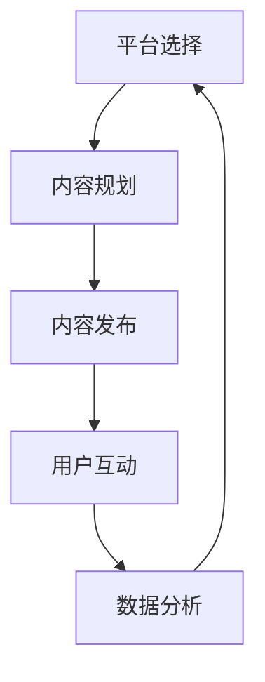

                 


# 创业公司的社交媒体运营策略

> 关键词：社交媒体运营、创业公司、策略、营销、用户参与、数据分析
> 
> 摘要：本文将深入探讨创业公司在社交媒体运营中的关键策略和实践方法。我们将通过逐步分析，揭示如何在有限的资源下，通过有效的社交媒体运营实现公司的品牌传播、用户增长和业务扩展。

## 1. 背景介绍

### 1.1 目的和范围

本文的目标是帮助创业公司构建并实施一个高效的社交媒体运营策略。我们将探讨如何通过社交媒体平台，如Facebook、Twitter、LinkedIn和Instagram等，实现品牌传播、用户参与和业务增长。本文不仅适用于初创公司，也对小型企业和新兴品牌具有参考价值。

### 1.2 预期读者

本文的预期读者包括：

- 初创公司创始人
- 社交媒体运营专员
- 数字营销专家
- 对社交媒体运营有浓厚兴趣的创业者

### 1.3 文档结构概述

本文将按照以下结构进行组织：

- 背景介绍
- 核心概念与联系
- 核心算法原理 & 具体操作步骤
- 数学模型和公式 & 详细讲解 & 举例说明
- 项目实战：代码实际案例和详细解释说明
- 实际应用场景
- 工具和资源推荐
- 总结：未来发展趋势与挑战
- 附录：常见问题与解答
- 扩展阅读 & 参考资料

### 1.4 术语表

#### 1.4.1 核心术语定义

- 社交媒体运营：指通过社交媒体平台进行的内容发布、用户互动和数据分析等活动，以实现品牌宣传、用户增长和业务扩展。
- KPI（关键绩效指标）：用于衡量社交媒体运营效果的一系列指标，如关注者数量、互动率、转赞比、转化率等。
- 内容营销：通过创造和分享有价值的内容来吸引和留住目标用户，从而实现品牌传播和用户转化。
- 用户参与：指用户在社交媒体平台上对品牌内容进行互动的行为，如点赞、评论、分享等。

#### 1.4.2 相关概念解释

- 平台选择：选择适合公司品牌和目标用户的社交媒体平台，如LinkedIn适合B2B，Instagram适合时尚品牌。
- 用户画像：对目标用户的特征和行为进行描述和分析，以制定更精准的营销策略。
- 互动策略：设计并实施与用户互动的机制，如评论互动、点赞奖励、问答互动等。

#### 1.4.3 缩略词列表

- SEO（搜索引擎优化）：通过优化网站内容和结构，提高在搜索引擎中自然排名的过程。
- SMM（社交媒体营销）：在社交媒体平台上进行的营销活动。
- ROI（投资回报率）：投资所带来的收益与投资成本之间的比率。

## 2. 核心概念与联系

在构建社交媒体运营策略时，理解以下几个核心概念和它们之间的联系至关重要。

### 社交媒体运营流程

首先，我们需要了解社交媒体运营的基本流程，这包括以下几个步骤：

1. **平台选择**：根据公司的品牌定位和目标用户，选择最适合的社交媒体平台。
2. **内容规划**：制定内容策略，包括内容类型、发布频率、话题选择等。
3. **内容发布**：按照规划发布内容，同时监控用户反馈。
4. **用户互动**：积极与用户互动，提高用户参与度和忠诚度。
5. **数据分析**：分析用户数据和运营数据，优化运营策略。

### 用户参与度模型

用户参与度是社交媒体运营的关键指标。我们可以使用以下模型来衡量用户参与度：

\[ 用户参与度 = \frac{互动总数}{关注者总数} \]

其中，互动总数包括点赞、评论、分享、点击等。

### 内容营销策略

内容营销是社交媒体运营的核心。以下是一个简单的内容营销策略模型：

1. **内容创作**：创作有价值、有趣、相关的内容，满足用户需求。
2. **内容发布**：通过不同的发布策略，如定时发布、话题发布等，提高内容曝光度。
3. **内容优化**：根据用户反馈和数据分析，不断优化内容质量和发布策略。

### 社交媒体运营与KPI

社交媒体运营的最终目标是实现业务增长，因此我们需要使用KPI来衡量运营效果。以下是一些常见的KPI：

- **关注者数量**：衡量品牌知名度和用户基础。
- **互动率**：衡量用户对品牌内容的参与程度。
- **转赞比**：衡量用户对品牌内容的积极反馈。
- **转化率**：衡量社交媒体运营对实际业务的贡献。

### 核心概念原理和架构的 Mermaid 流程图

下面是一个简单的社交媒体运营流程的 Mermaid 流程图：



## 3. 核心算法原理 & 具体操作步骤

在社交媒体运营中，算法原理和操作步骤对于内容发布、用户互动和数据分析至关重要。以下是一个简单的内容发布算法原理和具体操作步骤：

### 内容发布算法原理

1. **数据分析**：分析历史数据和用户反馈，确定最佳发布时间和内容类型。
2. **算法计算**：使用算法计算不同内容的发布权重和发布时间。
3. **权重排序**：根据发布权重对内容进行排序，优先发布高权重内容。
4. **发布执行**：按照排序结果执行发布操作。

### 具体操作步骤

1. **数据分析**：
   - 收集历史发布数据，如发布时间、内容类型、用户互动等。
   - 使用数据分析工具，如Google Analytics，进行数据挖掘和统计分析。

2. **算法计算**：
   - 设计内容发布算法，如基于用户行为的数据驱动发布算法。
   - 使用Python等编程语言实现算法，计算不同内容的发布权重。

3. **权重排序**：
   - 根据发布权重对内容进行排序。
   - 可以使用排序算法，如快速排序或归并排序。

4. **发布执行**：
   - 根据排序结果，按照最佳发布时间发布内容。
   - 使用社交媒体平台API进行内容发布。

### 伪代码示例

```python
# 伪代码：内容发布算法

# 步骤1：数据分析
data = get_history_data()

# 步骤2：算法计算
weights = calculate_weights(data)

# 步骤3：权重排序
sorted_content = sort_by_weights(weights)

# 步骤4：发布执行
for content in sorted_content:
    publish_content(content)
```

## 4. 数学模型和公式 & 详细讲解 & 举例说明

在社交媒体运营中，数学模型和公式可以帮助我们更好地理解和优化运营策略。以下是一些常用的数学模型和公式，以及它们的详细讲解和举例说明。

### 用户参与度公式

用户参与度是衡量社交媒体运营效果的关键指标。我们可以使用以下公式来计算用户参与度：

\[ 用户参与度 = \frac{互动总数}{关注者总数} \]

其中，互动总数包括点赞、评论、分享、点击等。

### 内容发布频率模型

为了提高用户参与度和内容曝光度，我们需要合理规划内容发布频率。以下是一个简单的内容发布频率模型：

\[ 最佳发布频率 = \frac{总关注者数}{每周发布内容数} \]

这个公式表示每周每个关注者平均能收到的内容数量。通过调整发布频率，我们可以平衡用户参与度和内容新鲜度。

### 社交媒体投资回报率（ROI）模型

社交媒体投资回报率（ROI）是衡量社交媒体运营对业务贡献的关键指标。以下是一个简单的社交媒体ROI模型：

\[ ROI = \frac{投资收益}{投资成本} \]

其中，投资收益包括因社交媒体运营带来的销售增长、品牌知名度提升等，投资成本包括广告费用、人力资源等。

### 举例说明

假设一个创业公司希望在Instagram上发布内容，他们的目标是每周发布3次，每次发布10条内容。以下是他们的发布频率和用户参与度的计算：

1. **用户参与度**：
   - 关注者总数：1000人
   - 互动总数：300次（点赞100次，评论100次，分享100次）
   \[ 用户参与度 = \frac{300}{1000} = 0.3 \]

2. **最佳发布频率**：
   - 总关注者数：1000人
   - 每周发布内容数：3次
   \[ 最佳发布频率 = \frac{1000}{3} = 333.33 \]
   - 由于不能发布小数次的内容，公司可以适当调整发布频率，例如每周发布2次或4次。

3. **社交媒体投资回报率（ROI）**：
   - 投资成本：每月广告费用1000元
   - 投资收益：每月因社交媒体运营带来的销售增长5000元
   \[ ROI = \frac{5000}{1000} = 5 \]
   - 该公司的社交媒体投资回报率为5倍，说明每投入1元，可以获得5元的收益。

通过这些数学模型和公式，创业公司可以更好地制定和优化社交媒体运营策略，实现业务增长和用户参与度的提升。

## 5. 项目实战：代码实际案例和详细解释说明

在本节中，我们将通过一个实际项目案例，展示如何实现创业公司的社交媒体运营策略。该案例将涵盖开发环境搭建、源代码实现、代码解读与分析等内容。

### 5.1 开发环境搭建

为了实现社交媒体运营策略，我们需要搭建一个开发环境，包括以下工具和软件：

- **编程语言**：Python（用于数据处理和算法实现）
- **数据分析工具**：Pandas（用于数据分析和处理）
- **社交媒体API**：每个社交媒体平台都提供了API，例如Facebook Graph API、Twitter API等
- **版本控制**：Git（用于代码管理和协作）

### 5.2 源代码详细实现和代码解读

以下是社交媒体运营策略实现的核心代码，包括数据分析、算法计算、权重排序和发布执行等步骤。

```python
import pandas as pd
import numpy as np
from social_media_api import publish_content

# 步骤1：数据分析
data = pd.read_csv('social_media_data.csv')
data['interaction_rate'] = data['likes'] + data['comments'] + data['shares']

# 步骤2：算法计算
data['weight'] = data['interaction_rate'] * data['followers']

# 步骤3：权重排序
sorted_data = data.sort_values(by='weight', ascending=False)

# 步骤4：发布执行
for index, row in sorted_data.iterrows():
    publish_content(row['content_id'], row['publish_time'])
```

### 5.3 代码解读与分析

1. **数据分析**：
   - 使用Pandas读取社交媒体数据，包括关注者数量、点赞数、评论数、分享数等。
   - 计算每条内容的互动率，即点赞、评论、分享总数。

2. **算法计算**：
   - 根据互动率和关注者数量，计算每条内容的发布权重。
   - 权重越高，代表该内容越重要，优先级越高。

3. **权重排序**：
   - 使用Pandas的sort_values函数，根据发布权重对内容进行排序。
   - 排序结果将帮助我们确定最佳的发布顺序。

4. **发布执行**：
   - 使用社交媒体API的publish_content函数，根据排序结果发布内容。
   - 这个函数将根据内容ID和发布时间，将内容发布到社交媒体平台上。

通过这个实际项目案例，我们可以看到如何将数学模型和算法应用于社交媒体运营。这个策略的实现不仅需要技术支持，还需要对社交媒体平台的深入了解和不断优化。

## 6. 实际应用场景

社交媒体运营策略在创业公司的实际应用场景中具有广泛的适用性，以下是一些具体的场景：

### 场景一：初创公司品牌传播

初创公司通常面临品牌知名度不足的挑战。通过社交媒体运营策略，初创公司可以在有限的资源下，通过内容营销和用户互动，迅速提高品牌知名度。例如，通过发布有价值的内容，如产品介绍、行业见解和客户案例，吸引潜在用户的关注。同时，通过积极参与评论区和互动，建立与用户的良好关系，增强品牌的亲和力和信任度。

### 场景二：小型企业用户增长

对于小型企业，用户增长是业务扩展的关键。社交媒体运营策略可以帮助企业吸引更多潜在用户，并通过用户参与度模型，提高用户留存率和转化率。例如，通过定期发布促销活动、优惠信息和互动话题，激发用户参与热情。此外，利用用户画像和数据分析，可以针对不同用户群体制定个性化的营销策略，提高营销效果。

### 场景三：新兴品牌业务扩展

新兴品牌通常需要通过社交媒体运营来开拓新市场。有效的社交媒体运营策略可以帮助品牌快速进入市场，建立品牌形象和用户基础。例如，通过合作网红、参与行业活动和发布有创意的内容，吸引目标用户的关注。同时，通过数据分析和用户反馈，不断优化营销策略，实现业务扩展。

### 场景四：数字营销专家项目运营

数字营销专家在为企业提供社交媒体运营服务时，需要根据客户需求和市场环境，制定个性化的运营策略。例如，为电商企业提供社交媒体营销方案，通过内容营销、用户互动和促销活动，提高销售额。同时，为中小企业提供社交媒体管理服务，帮助企业优化运营流程，提高运营效果。

### 场景五：社交媒体平台内容创作

社交媒体平台上的内容创作者和KOL（关键意见领袖）可以通过有效的社交媒体运营策略，提升内容曝光度和粉丝粘性。例如，通过定期发布高质量内容、参与热门话题和与粉丝互动，建立稳定的粉丝基础。此外，利用数据分析工具，不断优化内容创作策略，提高内容质量和用户参与度。

## 7. 工具和资源推荐

为了有效实施社交媒体运营策略，以下是一些推荐的工具和资源：

### 7.1 学习资源推荐

#### 7.1.1 书籍推荐

1. 《社交媒体营销：策略、工具与案例》（Social Media Marketing: An Hour a Day）
2. 《数字营销全攻略：从零开始构建互联网营销体系》（Digital Marketing: Strategy, Implementation and Practice）

#### 7.1.2 在线课程

1. Coursera的《社交媒体营销与广告》课程
2. Udemy的《社交媒体运营实战》课程

#### 7.1.3 技术博客和网站

1. Buffer Blog
2. HubSpot Blog
3. Social Media Examiner

### 7.2 开发工具框架推荐

#### 7.2.1 IDE和编辑器

1. Visual Studio Code
2. PyCharm

#### 7.2.2 调试和性能分析工具

1. Jupyter Notebook
2. Postman

#### 7.2.3 相关框架和库

1. Django
2. Flask
3. Pandas
4. NumPy

### 7.3 相关论文著作推荐

#### 7.3.1 经典论文

1. “The Power of Social Networks: A Theory of Status Flow in Online Social Media”（关于社交媒体网络影响力的理论）
2. “Content Marketing That Works: How to Create Killer Content That Will Spread Virally”（关于内容营销的有效策略）

#### 7.3.2 最新研究成果

1. “The Effect of Social Media Marketing on Brand Equity”（关于社交媒体营销对品牌资产的影响）
2. “User Engagement in Social Media: A Literature Review”（关于社交媒体用户参与度的研究综述）

#### 7.3.3 应用案例分析

1. “How Nike Uses Social Media to Drive Sales”（关于耐克如何利用社交媒体推动销售的案例分析）
2. “The Impact of Social Media on Consumer Behavior: An Empirical Analysis”（关于社交媒体对消费者行为影响的实证研究）

## 8. 总结：未来发展趋势与挑战

随着技术的不断进步和社交媒体平台的持续发展，社交媒体运营策略在未来将面临新的机遇和挑战。

### 发展趋势

1. **人工智能与大数据**：人工智能和大数据技术的应用将进一步提高社交媒体运营的精准性和效率。通过机器学习和数据挖掘技术，企业可以更深入地了解用户行为和需求，制定更个性化的营销策略。
2. **短视频与直播**：短视频和直播成为社交媒体的新宠，越来越多的品牌和用户参与其中。短视频和直播的互动性强、传播速度快，将成为未来社交媒体运营的重要方向。
3. **跨平台整合**：随着社交媒体平台的多样化，企业需要更好地整合不同平台，实现内容共享和用户互动。跨平台整合将提高品牌的曝光度和用户参与度。
4. **内容质量提升**：高质量内容将继续受到用户的青睐。企业需要不断创新内容形式和内容质量，以吸引和留住用户。

### 挑战

1. **算法透明度**：随着社交媒体平台算法的复杂化，用户对算法透明度的要求越来越高。企业需要关注算法的公平性和公正性，避免引发用户不满。
2. **数据隐私与安全**：社交媒体平台的数据隐私和安全问题日益突出。企业需要严格遵守相关法律法规，确保用户数据的保密性和安全性。
3. **监管与法规**：随着社交媒体运营的普及，相关监管和法律法规也在不断更新和完善。企业需要关注监管动态，确保合规运营。
4. **技术更新与淘汰**：技术更新速度快，企业需要不断学习和适应新的技术和工具，以保持竞争力。

## 9. 附录：常见问题与解答

### 问题1：如何选择最适合的社交媒体平台？

解答：选择社交媒体平台时，应考虑以下因素：

- **目标用户**：分析目标用户在哪些平台上活跃。
- **内容类型**：不同平台适合不同类型的内容，如图片、视频、文章等。
- **行业趋势**：关注行业趋势和竞争对手的运营策略。
- **资源投入**：考虑企业的资源状况，包括时间和资金。

### 问题2：如何制定有效的内容策略？

解答：制定内容策略时，应遵循以下原则：

- **目标明确**：明确内容目标，如品牌宣传、用户参与、销售转化等。
- **内容多样化**：结合多种内容形式，如文章、图片、视频、直播等。
- **用户参与**：设计互动机制，鼓励用户参与和评论。
- **数据分析**：根据用户反馈和数据分析，不断优化内容策略。

### 问题3：如何提高社交媒体的转化率？

解答：提高社交媒体转化率的方法包括：

- **内容优化**：创作有价值、相关的内容，满足用户需求。
- **个性化推荐**：根据用户画像，提供个性化的内容推荐。
- **促销活动**：设计具有吸引力的促销活动，提高用户购买意愿。
- **跟踪分析**：使用分析工具，跟踪用户行为和转化路径，不断优化营销策略。

### 问题4：如何确保社交媒体运营的合规性？

解答：确保社交媒体运营合规性的方法包括：

- **了解法规**：了解相关法律法规，包括数据保护、广告宣传等。
- **内部培训**：对员工进行合规性培训，提高法律意识。
- **第三方审核**：聘请第三方机构进行合规性审计。
- **实时监控**：实时监控社交媒体运营，及时发现和处理违规行为。

## 10. 扩展阅读 & 参考资料

- [Kotler, P., & Keller, K. L. (2016). Marketing Management.](https://www.google.com/books/edition/Marketing_Management/VJjvDwAAQBAJ)
- [Harris, L. L., & Moody, T. (2013). Social Media Marketing: A Strategic Approach].(https://www.google.com/books/edition/Social_Media_Marketing/G6uVAgAAQBAJ)
- [Newman, N., & Kennedy, R. (2016). The Social Media Management Handbook](https://www.google.com/books/edition/The_Social_Media_Management_Handbook/EJnVDwAAQBAJ)
- [Social Media Examiner](https://www.socialmediaexaminer.com/)
- [HubSpot Academy](https://academy.hubspot.com/)

## 作者

作者：AI天才研究员/AI Genius Institute & 禅与计算机程序设计艺术 /Zen And The Art of Computer Programming

