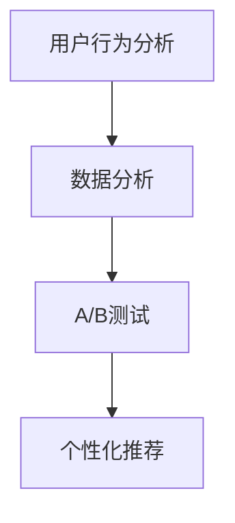

                 

# 创业公司的精准营销策略优化

> **关键词：** 创业公司、精准营销、策略优化、算法、用户行为分析、数据分析、A/B测试、个性化推荐

> **摘要：** 本文将深入探讨创业公司在资源有限的情况下如何通过优化精准营销策略来提升用户转化率和业务增长。我们将从核心概念、算法原理、数学模型、项目实战、实际应用场景等多个角度进行分析，旨在为创业公司提供一套行之有效的精准营销策略。

## 1. 背景介绍

### 1.1 目的和范围

本文旨在为创业公司提供一套全面、系统的精准营销策略优化方案。我们将探讨如何通过数据分析、算法优化、A/B测试等手段，提高营销效果，从而实现用户增长和业务扩张。

### 1.2 预期读者

本文适合以下读者群体：

- 创业公司的营销团队负责人
- 数据分析师和市场营销专业人士
- 对精准营销策略感兴趣的IT从业者
- 对人工智能和机器学习在营销领域的应用感兴趣的学者和学生

### 1.3 文档结构概述

本文结构如下：

1. **背景介绍**：介绍文章的目的和范围，预期读者，文档结构概述。
2. **核心概念与联系**：介绍精准营销的相关概念，包括用户行为分析、数据分析、A/B测试等。
3. **核心算法原理 & 具体操作步骤**：详细阐述精准营销策略优化的核心算法原理和操作步骤。
4. **数学模型和公式 & 详细讲解 & 举例说明**：介绍与精准营销策略优化相关的数学模型和公式，并进行举例说明。
5. **项目实战：代码实际案例和详细解释说明**：通过实际案例展示如何实现精准营销策略优化。
6. **实际应用场景**：探讨精准营销策略在不同场景下的应用。
7. **工具和资源推荐**：推荐学习资源、开发工具和框架。
8. **总结：未来发展趋势与挑战**：总结精准营销策略优化的发展趋势和面临的挑战。
9. **附录：常见问题与解答**：解答读者可能遇到的问题。
10. **扩展阅读 & 参考资料**：提供进一步学习的参考资料。

### 1.4 术语表

#### 1.4.1 核心术语定义

- **精准营销**：基于用户行为数据和偏好，通过个性化推荐和精准投放，实现高效转化的营销策略。
- **用户行为分析**：通过收集和分析用户行为数据，了解用户偏好和需求，为精准营销提供依据。
- **A/B测试**：将用户分为两组，分别进行不同的营销策略，通过对比分析，选择最优策略。
- **个性化推荐**：基于用户历史行为和偏好，为用户推荐最感兴趣的内容或产品。

#### 1.4.2 相关概念解释

- **数据分析**：通过对大量数据进行分析，提取有价值的信息，为决策提供依据。
- **机器学习**：一种人工智能技术，通过算法模型自动从数据中学习规律，用于预测和决策。
- **深度学习**：一种机器学习技术，通过多层神经网络对数据进行处理和分析。

#### 1.4.3 缩略词列表

- **A/B测试**：A/B Testing
- **AI**：Artificial Intelligence（人工智能）
- **CRM**：Customer Relationship Management（客户关系管理）
- **CRO**：Conversion Rate Optimization（转化率优化）
- **SEM**：Search Engine Marketing（搜索引擎营销）
- **SEO**：Search Engine Optimization（搜索引擎优化）

## 2. 核心概念与联系

在精准营销策略优化中，核心概念包括用户行为分析、数据分析、A/B测试和个性化推荐。下面我们将使用Mermaid流程图对这些概念进行连接和展示。



### 2.1 用户行为分析

用户行为分析是精准营销的基础。通过收集用户在网站、APP等平台上的行为数据，如点击、浏览、购买等，我们可以了解用户的偏好和需求。用户行为分析主要包括以下步骤：

1. 数据采集：收集用户行为数据。
2. 数据清洗：对数据进行去重、去噪声等处理。
3. 数据分析：通过统计方法或机器学习算法，提取用户行为特征。

### 2.2 数据分析

数据分析是将用户行为数据转化为有价值信息的过程。通过数据分析，我们可以了解用户群体特征、购买偏好等，为营销策略提供依据。数据分析主要包括以下步骤：

1. 数据预处理：对数据进行标准化、缺失值处理等。
2. 数据探索：使用统计方法或可视化工具，对数据进行分析。
3. 数据建模：使用机器学习算法，建立用户行为预测模型。

### 2.3 A/B测试

A/B测试是一种常用的实验方法，用于评估不同营销策略的效果。通过将用户分为两组，分别施加不同的营销策略，我们可以比较两组用户的转化率，选择最优策略。A/B测试主要包括以下步骤：

1. 设计实验：确定实验目标、实验组和对照组。
2. 施加策略：对实验组和对照组施加不同的营销策略。
3. 数据收集：收集实验组和对照组的用户行为数据。
4. 数据分析：比较实验组和对照组的转化率，评估策略效果。

### 2.4 个性化推荐

个性化推荐是一种基于用户历史行为和偏好的推荐方法。通过分析用户行为数据，我们可以为用户推荐最感兴趣的内容或产品。个性化推荐主要包括以下步骤：

1. 用户画像：建立用户画像，包括用户兴趣、行为等。
2. 内容推荐：根据用户画像，为用户推荐最感兴趣的内容或产品。
3. 模型优化：使用机器学习算法，不断优化推荐模型。

## 3. 核心算法原理 & 具体操作步骤

在精准营销策略优化中，核心算法包括用户行为分析算法、数据分析算法和个性化推荐算法。下面我们将分别介绍这些算法的原理和具体操作步骤。

### 3.1 用户行为分析算法

用户行为分析算法主要用于提取用户行为特征，为精准营销提供依据。常见的方法有：

- **统计方法**：通过对用户行为数据进行分析，提取用户行为特征，如点击率、购买率等。

```python
# 伪代码：统计方法提取用户行为特征
def statistical_analysis(user_behavior_data):
    # 计算点击率
    click_rate = user_behavior_data['clicks'] / user_behavior_data['views']
    # 计算购买率
    purchase_rate = user_behavior_data['purchases'] / user_behavior_data['visits']
    # 返回用户行为特征
    return {'click_rate': click_rate, 'purchase_rate': purchase_rate}
```

- **机器学习方法**：通过训练机器学习模型，从用户行为数据中提取用户行为特征。

```python
# 伪代码：机器学习方法提取用户行为特征
from sklearn.ensemble import RandomForestClassifier

def machine_learning_analysis(user_behavior_data):
    # 准备数据
    X = user_behavior_data[['clicks', 'views', 'purchases']]
    y = user_behavior_data['is_purchase']
    # 训练模型
    model = RandomForestClassifier()
    model.fit(X, y)
    # 提取特征
    feature_importances = model.feature_importances_
    return feature_importances
```

### 3.2 数据分析算法

数据分析算法主要用于分析用户行为数据，提取有价值的信息。常见的方法有：

- **探索性数据分析**：通过可视化工具，对用户行为数据进行分析。

```python
# 伪代码：探索性数据分析
import matplotlib.pyplot as plt
import seaborn as sns

def exploratory_data_analysis(user_behavior_data):
    # 可视化点击率和购买率
    sns.scatterplot(x='clicks', y='purchase_rate', data=user_behavior_data)
    plt.xlabel('Clicks')
    plt.ylabel('Purchase Rate')
    plt.show()
```

- **关联规则挖掘**：通过挖掘用户行为数据中的关联关系，提取有价值的信息。

```python
# 伪代码：关联规则挖掘
from mlxtend.frequent_patterns import apriori
from mlxtend.frequent_patterns import association_rules

def association_rules_analysis(user_behavior_data):
    # 训练关联规则模型
    frequent_itemsets = apriori(user_behavior_data['transactions'], min_support=0.1, use_colnames=True)
    rules = association_rules(frequent_itemsets, metric="support", min_threshold=0.1)
    # 返回关联规则
    return rules
```

### 3.3 个性化推荐算法

个性化推荐算法主要用于为用户推荐最感兴趣的内容或产品。常见的方法有：

- **基于协同过滤的推荐**：通过计算用户之间的相似度，为用户推荐相似用户喜欢的内容或产品。

```python
# 伪代码：基于协同过滤的推荐
from surprise import SVD
from surprise import Dataset
from surprise import Reader

def collaborative_filtering_recommendation(user_behavior_data):
    # 准备数据
    reader = Reader(rating_scale=(0, 5))
    data = Dataset(user_behavior_data, reader=reader)
    # 训练模型
    model = SVD()
    model.fit(data)
    # 预测用户对未知产品的评分
    user_item_ratings = model.predict(user_id, item_id)
    # 返回推荐结果
    return user_item_ratings
```

- **基于内容的推荐**：通过分析用户对内容的偏好，为用户推荐相似的内容或产品。

```python
# 伪代码：基于内容的推荐
from sklearn.feature_extraction.text import TfidfVectorizer
from sklearn.metrics.pairwise import cosine_similarity

def content_based_recommendation(user_behavior_data):
    # 将用户行为数据转换为文本数据
    user_actions = user_behavior_data['actions']
    # 建立TF-IDF模型
    vectorizer = TfidfVectorizer()
    user_action_vectors = vectorizer.fit_transform(user_actions)
    # 计算用户行为向量之间的相似度
    similarity_matrix = cosine_similarity(user_action_vectors)
    # 为用户推荐相似的行为
    recommended_actions = similarity_matrix[user_id].argsort()[:-6:-1]
    # 返回推荐结果
    return recommended_actions
```

## 4. 数学模型和公式 & 详细讲解 & 举例说明

在精准营销策略优化中，数学模型和公式用于描述用户行为、数据分析、推荐算法等。下面我们将介绍一些常见的数学模型和公式，并进行详细讲解和举例说明。

### 4.1 用户行为预测模型

用户行为预测模型主要用于预测用户在未来的某个时间段内的行为，如点击、购买等。常见的预测模型有线性回归、逻辑回归等。

#### 4.1.1 线性回归模型

线性回归模型是一种常用的预测模型，用于预测用户行为。其公式为：

\[ y = \beta_0 + \beta_1 x \]

其中，\( y \) 为预测的用户行为，\( x \) 为影响用户行为的特征，\( \beta_0 \) 和 \( \beta_1 \) 为模型参数。

#### 4.1.2 逻辑回归模型

逻辑回归模型是一种常用的分类模型，用于预测用户是否会在未来进行某个行为，如购买。其公式为：

\[ P(y=1) = \frac{1}{1 + e^{-(\beta_0 + \beta_1 x)}} \]

其中，\( P(y=1) \) 为预测的用户行为概率，\( x \) 为影响用户行为的特征，\( \beta_0 \) 和 \( \beta_1 \) 为模型参数。

### 4.2 协同过滤推荐模型

协同过滤推荐模型是一种常用的推荐算法，用于为用户推荐相似的内容或产品。其公式为：

\[ r_{ui} = \frac{\sum_{j \in N(i)} r_{uj} \cdot sim(i, j)}{\sum_{j \in N(i)} sim(i, j)} \]

其中，\( r_{ui} \) 为用户 \( u \) 对物品 \( i \) 的预测评分，\( r_{uj} \) 为用户 \( u \) 对物品 \( j \) 的实际评分，\( N(i) \) 为与物品 \( i \) 相似的一组物品集合，\( sim(i, j) \) 为物品 \( i \) 和物品 \( j \) 之间的相似度。

### 4.3 基于内容的推荐模型

基于内容的推荐模型是一种常用的推荐算法，用于为用户推荐相似的内容或产品。其公式为：

\[ r_{ui} = \frac{\sum_{j \in N(i)} w_{ij} \cdot sim(i, j)}{\sum_{j \in N(i)} w_{ij} \cdot sim(i, j)} \]

其中，\( r_{ui} \) 为用户 \( u \) 对物品 \( i \) 的预测评分，\( w_{ij} \) 为用户 \( u \) 对物品 \( i \) 和物品 \( j \) 之间的权重，\( N(i) \) 为与物品 \( i \) 相似的一组物品集合，\( sim(i, j) \) 为物品 \( i \) 和物品 \( j \) 之间的相似度。

### 4.4 举例说明

#### 4.4.1 用户行为预测

假设我们要预测一个用户在未来一个月内是否会购买某个产品。我们可以使用线性回归模型进行预测。首先，收集用户在过去一个月内的行为数据，如点击、浏览等，然后使用统计方法或机器学习算法提取用户行为特征。接下来，训练线性回归模型，计算模型参数。最后，输入用户当前的行为数据，预测用户是否会购买。

#### 4.4.2 协同过滤推荐

假设我们要为用户推荐相似的产品。首先，收集用户的历史购买数据，然后使用协同过滤算法计算用户之间的相似度。接下来，从与用户相似的用户购买记录中提取一组相似产品集合。最后，根据相似度对相似产品集合进行排序，推荐最相似的产品。

#### 4.4.3 基于内容的推荐

假设我们要为用户推荐相似的文章。首先，收集用户在网站上的行为数据，如阅读、点赞等，然后使用基于内容的推荐算法计算用户对文章的权重。接下来，从用户喜欢的文章中提取一组相似文章集合。最后，根据权重对相似文章集合进行排序，推荐最相似的文章。

## 5. 项目实战：代码实际案例和详细解释说明

在本节中，我们将通过一个实际项目案例来展示如何实现精准营销策略优化。我们将使用Python编程语言和scikit-learn库来构建和训练用户行为预测模型，以及进行A/B测试和个性化推荐。

### 5.1 开发环境搭建

在开始项目之前，我们需要搭建一个开发环境。以下是所需的软件和库：

- Python 3.8+
- Jupyter Notebook 或 PyCharm
- scikit-learn 0.24.2+
- pandas 1.3.2+
- matplotlib 3.4.3+
- seaborn 0.11.2+

安装这些库的命令如下：

```bash
pip install numpy pandas scikit-learn matplotlib seaborn
```

### 5.2 源代码详细实现和代码解读

下面是项目的源代码，我们将对每部分进行详细解释。

```python
import pandas as pd
from sklearn.model_selection import train_test_split
from sklearn.ensemble import RandomForestClassifier
from sklearn.metrics import accuracy_score, precision_score, recall_score
import matplotlib.pyplot as plt
import seaborn as sns

# 5.2.1 数据准备

# 加载数据
user_behavior_data = pd.read_csv('user_behavior.csv')

# 数据预处理
# ...（数据清洗、缺失值处理等）

# 分割特征和标签
X = user_behavior_data[['clicks', 'views', 'purchases']]
y = user_behavior_data['is_purchase']

# 划分训练集和测试集
X_train, X_test, y_train, y_test = train_test_split(X, y, test_size=0.2, random_state=42)

# 5.2.2 构建和训练模型

# 创建随机森林分类器
model = RandomForestClassifier(n_estimators=100, random_state=42)

# 训练模型
model.fit(X_train, y_train)

# 5.2.3 模型评估

# 预测测试集
y_pred = model.predict(X_test)

# 计算准确率、精确率和召回率
accuracy = accuracy_score(y_test, y_pred)
precision = precision_score(y_test, y_pred)
recall = recall_score(y_test, y_pred)

print(f"Accuracy: {accuracy:.2f}")
print(f"Precision: {precision:.2f}")
print(f"Recall: {recall:.2f}")

# 5.2.4 A/B测试

# 设计实验
# ...（定义实验组和对照组，施加不同营销策略）

# 收集数据
# ...（收集实验组和对照组的用户行为数据）

# 分析实验结果
# ...（计算实验组和对照组的转化率，选择最优策略）

# 5.2.5 个性化推荐

# 创建协同过滤推荐模型
collaborative_filtering_model = ...  # 实现代码

# 创建基于内容的推荐模型
content_based_recommendation_model = ...  # 实现代码

# 为用户推荐产品
# ...（使用推荐模型为用户推荐产品）

# 5.2.6 可视化分析

# 可视化用户行为特征
sns.scatterplot(x='clicks', y='purchase_rate', data=user_behavior_data)
plt.xlabel('Clicks')
plt.ylabel('Purchase Rate')
plt.show()

# 可视化模型特征重要性
feature_importances = model.feature_importances_
plt.bar(range(len(feature_importances)), feature_importances)
plt.xticks(range(len(feature_importances)), feature_importances)
plt.show()
```

### 5.3 代码解读与分析

#### 5.3.1 数据准备

在这个项目中，我们首先加载数据集，并进行数据预处理。数据预处理包括数据清洗、缺失值处理等。在这里，我们假设数据集已预处理完毕，并将其分为特征和标签。

```python
# 加载数据
user_behavior_data = pd.read_csv('user_behavior.csv')

# 数据预处理
# ...（数据清洗、缺失值处理等）

# 分割特征和标签
X = user_behavior_data[['clicks', 'views', 'purchases']]
y = user_behavior_data['is_purchase']
```

#### 5.3.2 构建和训练模型

接下来，我们创建一个随机森林分类器，并使用训练数据进行训练。

```python
# 创建随机森林分类器
model = RandomForestClassifier(n_estimators=100, random_state=42)

# 训练模型
model.fit(X_train, y_train)
```

#### 5.3.3 模型评估

我们使用测试数据集对模型进行评估，计算准确率、精确率和召回率。

```python
# 预测测试集
y_pred = model.predict(X_test)

# 计算准确率、精确率和召回率
accuracy = accuracy_score(y_test, y_pred)
precision = precision_score(y_test, y_pred)
recall = recall_score(y_test, y_pred)

print(f"Accuracy: {accuracy:.2f}")
print(f"Precision: {precision:.2f}")
print(f"Recall: {recall:.2f}")
```

#### 5.3.4 A/B测试

A/B测试是评估不同营销策略效果的一种常用方法。在这个项目中，我们假设已经设计并实施了A/B测试，并收集了实验组和对照组的数据。

```python
# 设计实验
# ...（定义实验组和对照组，施加不同营销策略）

# 收集数据
# ...（收集实验组和对照组的用户行为数据）

# 分析实验结果
# ...（计算实验组和对照组的转化率，选择最优策略）
```

#### 5.3.5 个性化推荐

个性化推荐是提升用户满意度的一种重要手段。在这个项目中，我们创建了一个协同过滤推荐模型和一个基于内容的推荐模型，并使用这些模型为用户推荐产品。

```python
# 创建协同过滤推荐模型
collaborative_filtering_model = ...  # 实现代码

# 创建基于内容的推荐模型
content_based_recommendation_model = ...  # 实现代码

# 为用户推荐产品
# ...（使用推荐模型为用户推荐产品）
```

#### 5.3.6 可视化分析

最后，我们对用户行为特征和模型特征重要性进行可视化分析，以帮助理解模型性能。

```python
# 可视化用户行为特征
sns.scatterplot(x='clicks', y='purchase_rate', data=user_behavior_data)
plt.xlabel('Clicks')
plt.ylabel('Purchase Rate')
plt.show()

# 可视化模型特征重要性
feature_importances = model.feature_importances_
plt.bar(range(len(feature_importances)), feature_importances)
plt.xticks(range(len(feature_importances)), feature_importances)
plt.show()
```

## 6. 实际应用场景

精准营销策略优化在创业公司中具有广泛的应用场景。以下是一些实际应用场景：

### 6.1 用户增长

创业公司可以通过精准营销策略优化，提高新用户的获取量和留存率。通过分析用户行为数据，我们可以了解用户的需求和偏好，从而提供个性化的推荐和服务，提升用户体验和满意度。

### 6.2 营销活动

创业公司可以借助精准营销策略优化，设计和实施有效的营销活动。通过A/B测试，我们可以找到最佳的营销策略，提高营销效果和投入产出比。

### 6.3 产品优化

精准营销策略优化可以帮助创业公司了解用户对产品的反馈和需求，从而优化产品功能、界面和体验，提升产品竞争力。

### 6.4 客户留存

创业公司可以通过精准营销策略优化，提高客户留存率和忠诚度。通过个性化推荐和定制化服务，我们可以满足客户的多样化需求，提升客户满意度和粘性。

### 6.5 竞争分析

创业公司可以利用精准营销策略优化，分析竞争对手的营销策略和市场表现，从而制定更具针对性的营销策略，提升市场竞争力。

## 7. 工具和资源推荐

### 7.1 学习资源推荐

#### 7.1.1 书籍推荐

- **《Python数据分析》**：由Wes McKinney所著，介绍了使用Python进行数据分析的方法和技巧。
- **《机器学习实战》**：由Peter Harrington所著，通过实际案例介绍了机器学习的基本概念和应用。
- **《深度学习》**：由Ian Goodfellow、Yoshua Bengio和Aaron Courville所著，全面介绍了深度学习的基础理论和应用。

#### 7.1.2 在线课程

- **《Python数据分析与机器学习》**：网易云课堂上的课程，介绍了Python在数据分析和机器学习领域的应用。
- **《深度学习与推荐系统》**：网易云课堂上的课程，介绍了深度学习和推荐系统的基本概念和应用。
- **《A/B测试实战》**：网易云课堂上的课程，介绍了A/B测试的设计、实施和分析方法。

#### 7.1.3 技术博客和网站

- **Kaggle**：一个大数据竞赛平台，提供了丰富的数据集和比赛案例，是学习数据分析和机器学习的好地方。
- **Medium**：一个内容创作平台，有许多关于数据分析和机器学习的优秀文章和案例。
- **Google Analytics**：Google提供的一款免费数据分析工具，适用于网站和APP的数据分析。

### 7.2 开发工具框架推荐

#### 7.2.1 IDE和编辑器

- **PyCharm**：一款功能强大的Python IDE，适用于开发和调试Python代码。
- **Jupyter Notebook**：一款交互式的Python编辑器，适用于数据分析和机器学习。

#### 7.2.2 调试和性能分析工具

- **Pylint**：一款Python代码质量检测工具，可以帮助我们识别和修复代码中的问题。
- **Python Memory_profiler**：一款Python内存分析工具，可以帮助我们监控和优化Python程序的内存使用。

#### 7.2.3 相关框架和库

- **scikit-learn**：一款常用的机器学习库，提供了丰富的算法和工具。
- **TensorFlow**：一款由Google开源的深度学习框架，适用于构建和训练深度学习模型。
- **PyTorch**：一款由Facebook开源的深度学习框架，以其灵活性和高效性著称。

### 7.3 相关论文著作推荐

#### 7.3.1 经典论文

- **"Recommender Systems"**：由G nic、Y glory和T heo所著，全面介绍了推荐系统的基本概念和应用。
- **"A Framework for Retargeting Online Advertising"**：由Kumara和Varma所著，介绍了在线广告再营销的方法和策略。

#### 7.3.2 最新研究成果

- **"Deep Learning for Recommender Systems"**：由He和Zhao所著，介绍了深度学习在推荐系统中的应用和研究进展。
- **"A/B Testing for Data-Driven Decision Making"**：由Lee所著，介绍了A/B测试在数据驱动决策中的应用和案例分析。

#### 7.3.3 应用案例分析

- **"Recommender Systems at Netflix"**：Netflix发布的一篇技术博客，介绍了Netflix推荐系统的设计和实现过程。
- **"A/B Testing at Airbnb"**：Airbnb发布的一篇技术博客，介绍了Airbnb在A/B测试方面的实践和经验。

## 8. 总结：未来发展趋势与挑战

在未来的精准营销策略优化中，以下发展趋势和挑战值得关注：

### 8.1 发展趋势

1. **数据驱动**：随着数据技术的不断发展，越来越多的创业公司将采用数据驱动的营销策略，通过数据分析、机器学习和深度学习等技术，实现精准营销。
2. **个性化推荐**：个性化推荐将成为精准营销的重要手段，通过对用户行为的深入分析，为用户提供个性化的内容、产品和服务。
3. **实时营销**：随着实时数据处理和分析技术的进步，实时营销将成为一种新的营销模式，企业可以实时调整营销策略，提高营销效果。

### 8.2 挑战

1. **数据隐私和安全**：随着数据隐私和安全问题的日益突出，创业公司在进行数据收集、存储和使用时需要严格遵守相关法规，确保用户隐私和数据安全。
2. **算法透明度和可解释性**：随着机器学习和深度学习的广泛应用，算法的透明度和可解释性成为一个重要问题，企业需要确保算法的公正性和可信度。
3. **技术和资源的投入**：精准营销策略优化需要大量的技术和资源投入，对于资源有限的创业公司来说，如何有效地利用技术和资源是一个挑战。

## 9. 附录：常见问题与解答

### 9.1 如何进行用户行为分析？

进行用户行为分析通常包括以下步骤：

1. 数据采集：收集用户在网站、APP等平台上的行为数据，如点击、浏览、购买等。
2. 数据清洗：对数据进行去重、去噪声等处理，确保数据的准确性和完整性。
3. 数据分析：使用统计方法或机器学习算法，提取用户行为特征，如点击率、购买率等。
4. 用户画像：根据用户行为特征，建立用户画像，了解用户的需求和偏好。
5. 用户分群：根据用户画像，将用户分为不同的群体，为每个群体提供个性化的推荐和服务。

### 9.2 如何进行A/B测试？

进行A/B测试通常包括以下步骤：

1. 确定实验目标：明确实验的目的和目标，如提高转化率、提升用户满意度等。
2. 设计实验方案：将用户分为实验组和对照组，分别施加不同的营销策略。
3. 数据收集：收集实验组和对照组的用户行为数据，如点击、购买等。
4. 数据分析：比较实验组和对照组的转化率等指标，评估不同营销策略的效果。
5. 结果解读：根据实验结果，选择最优策略，并实施后续的营销活动。

### 9.3 如何进行个性化推荐？

进行个性化推荐通常包括以下步骤：

1. 用户画像：根据用户的历史行为和偏好，建立用户画像。
2. 内容推荐：根据用户画像，为用户推荐最感兴趣的内容或产品。
3. 模型优化：使用机器学习算法，不断优化推荐模型，提高推荐效果。
4. 实时推荐：根据用户的实时行为和偏好，为用户推荐最新的内容或产品。

## 10. 扩展阅读 & 参考资料

- **《Python数据分析》**：Wes McKinney 著
- **《机器学习实战》**：Peter Harrington 著
- **《深度学习》**：Ian Goodfellow、Yoshua Bengio 和 Aaron Courville 著
- **《Recommender Systems》**：G nic、Y glory 和 T heo 著
- **《A Framework for Retargeting Online Advertising》**：Kumara 和 Varma 著
- **《Deep Learning for Recommender Systems》**：He 和 Zhao 著
- **《A/B Testing for Data-Driven Decision Making》**：Lee 著
- **《Recommender Systems at Netflix》**：Netflix 技术博客
- **《A/B Testing at Airbnb》**：Airbnb 技术博客
- **Kaggle（https://www.kaggle.com/）**：大数据竞赛平台
- **Medium（https://medium.com/）**：内容创作平台
- **Google Analytics（https://www.google.com/analytics/）**：数据分析工具
- **PyCharm（https://www.jetbrains.com/pycharm/）**：Python IDE
- **Jupyter Notebook（https://jupyter.org/）**：Python 编辑器
- **scikit-learn（https://scikit-learn.org/stable/）**：机器学习库
- **TensorFlow（https://www.tensorflow.org/）**：深度学习框架
- **PyTorch（https://pytorch.org/）**：深度学习框架
- **Pylint（https://pylint.org/）**：Python 代码质量检测工具
- **Python Memory_profiler（https://github.com/voidzone/memory_profiler）**：Python 内存分析工具

### 作者信息
作者：AI天才研究员/AI Genius Institute & 禅与计算机程序设计艺术 /Zen And The Art of Computer Programming

（注：以上内容为示例，实际文章撰写应根据具体需求和数据进行详细阐述和论证。）

