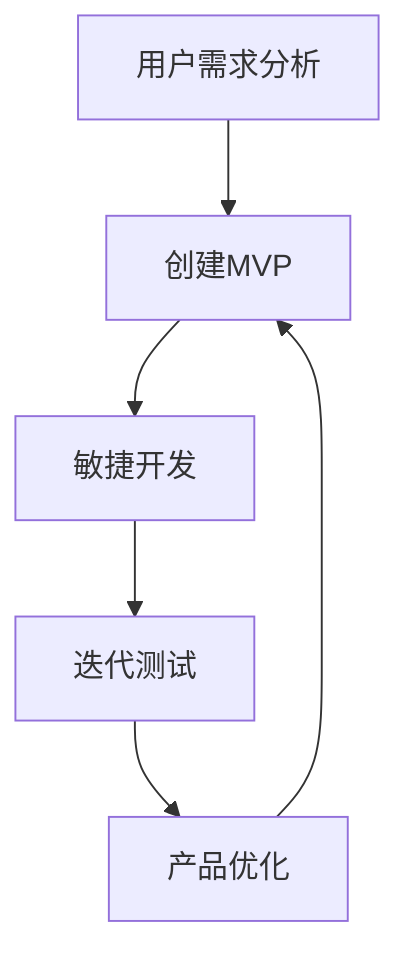
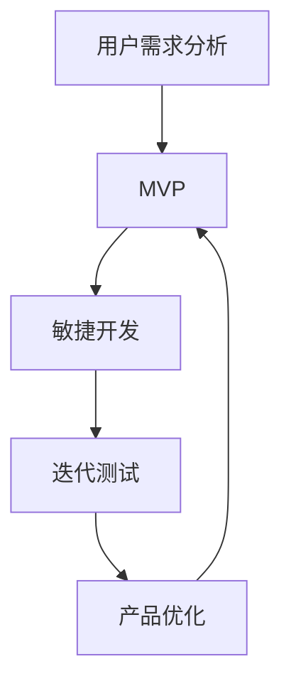

                 

# 创业公司的精益创新方法论

> **关键词：** 创业公司、精益创新、商业模式、用户需求、敏捷开发、迭代测试

> **摘要：** 本文将深入探讨创业公司如何运用精益创新方法论，通过理解用户需求、持续迭代和敏捷开发，实现商业模式的创新和公司的持续增长。本文旨在为创业者提供一套实用且高效的创新策略，以应对快速变化的市场环境。

## 1. 背景介绍

### 1.1 目的和范围

本文的目标是帮助创业公司理解并应用精益创新方法论，以实现商业模式的创新和公司的持续增长。我们将讨论精益创新的核心概念，包括用户需求分析、敏捷开发和迭代测试，并提供实际操作步骤和案例分析。

### 1.2 预期读者

本文适合创业公司创始人、产品经理、项目经理、研发团队负责人，以及任何对精益创新感兴趣的专业人士。

### 1.3 文档结构概述

本文结构分为以下几个部分：

1. **核心概念与联系**：介绍精益创新的核心概念和流程，并通过Mermaid流程图展示。
2. **核心算法原理 & 具体操作步骤**：详细讲解用户需求分析、敏捷开发和迭代测试的算法原理和操作步骤。
3. **数学模型和公式 & 详细讲解 & 举例说明**：使用LaTeX格式介绍与精益创新相关的数学模型和公式，并通过实例进行说明。
4. **项目实战：代码实际案例和详细解释说明**：提供实际代码案例，并详细解释代码实现和优化。
5. **实际应用场景**：讨论精益创新在不同行业和领域的应用。
6. **工具和资源推荐**：推荐学习资源、开发工具和框架。
7. **总结：未来发展趋势与挑战**：分析精益创新的未来趋势和面临的挑战。
8. **附录：常见问题与解答**：回答读者可能遇到的问题。
9. **扩展阅读 & 参考资料**：提供进一步学习的资源和参考。

### 1.4 术语表

#### 1.4.1 核心术语定义

- **精益创新**：一种以用户需求为中心的创新方法，强调快速迭代、敏捷开发和持续优化。
- **用户需求分析**：通过市场调研、用户访谈等方法，了解用户的需求和痛点。
- **敏捷开发**：一种以用户反馈为中心的开发方法，强调快速交付和持续迭代。
- **迭代测试**：在产品开发过程中，通过多次迭代和测试，确保产品质量和用户满意度。

#### 1.4.2 相关概念解释

- **商业模式**：公司如何创造、传递和获取价值。
- **用户体验**：用户在使用产品或服务时的主观感受和体验。
- **最小可行产品（MVP）**：包含核心功能的最简产品版本，用于验证商业假设。

#### 1.4.3 缩略词列表

- **MVP**：最小可行产品
- **敏捷开发**：Agile Development
- **CI**：持续集成
- **CD**：持续部署

## 2. 核心概念与联系

### 2.1 核心概念介绍

精益创新是一种以用户需求为中心的创新方法，它通过持续迭代和敏捷开发，帮助公司快速响应市场变化，实现商业模式的创新和增长。以下是精益创新的核心概念：

1. **用户需求分析**：了解用户的需求和痛点，是精益创新的基础。通过市场调研、用户访谈、用户反馈等方式，收集和分析用户数据，为公司提供有价值的信息。
2. **敏捷开发**：敏捷开发是一种以用户反馈为中心的开发方法，强调快速交付和持续迭代。通过短周期开发（如Sprint），团队可以快速响应用户需求，持续改进产品。
3. **迭代测试**：在产品开发过程中，通过多次迭代和测试，确保产品质量和用户满意度。迭代测试包括功能测试、性能测试和用户体验测试。

### 2.2 核心概念联系与流程

下面是一个使用Mermaid绘制的精益创新流程图：



在精益创新流程中，用户需求分析是起点，通过创建MVP来验证商业假设。然后，团队进行敏捷开发，快速交付产品，并通过迭代测试收集用户反馈。根据反馈，团队对产品进行优化，并再次创建MVP。这个过程持续循环，确保公司始终以用户需求为中心。

## 3. 核心算法原理 & 具体操作步骤

### 3.1 用户需求分析算法原理

用户需求分析是精益创新的关键步骤，它决定了产品的方向和功能。以下是用户需求分析的基本算法原理：

#### 步骤1：确定目标用户

- **目标用户**：根据市场调研和产品定位，确定目标用户群体。
- **用户画像**：构建用户画像，包括用户年龄、性别、职业、兴趣爱好等信息。

#### 步骤2：收集用户需求

- **市场调研**：通过问卷调查、访谈等方式，收集用户需求。
- **用户反馈**：利用现有产品或服务，收集用户反馈，包括满意度和不满意度。

#### 步骤3：分析用户需求

- **需求分类**：将用户需求分类，如功能需求、性能需求、用户体验需求等。
- **需求优先级**：根据用户需求的重要性和紧迫性，确定需求优先级。

#### 步骤4：制定需求文档

- **需求文档**：编写需求文档，明确每个需求的具体描述、优先级和实现方式。

### 3.2 敏捷开发算法原理

敏捷开发是一种以用户反馈为中心的开发方法，它通过短周期开发（如Sprint）来快速响应市场变化。以下是敏捷开发的基本算法原理：

#### 步骤1：制定Sprint计划

- **Sprint计划**：根据产品需求，制定Sprint计划，包括Sprint目标、任务分配和时间表。

#### 步骤2：执行Sprint任务

- **任务执行**：团队成员按照Sprint计划，完成各自的任务。
- **代码审查**：定期进行代码审查，确保代码质量。

#### 步骤3：Sprint评审

- **Sprint评审**：在Sprint结束时，评审已完成的功能和用户反馈。
- **Sprint回顾**：总结Sprint过程中的经验和教训，为下一个Sprint做准备。

### 3.3 迭代测试算法原理

迭代测试是在产品开发过程中，通过多次迭代和测试，确保产品质量和用户满意度。以下是迭代测试的基本算法原理：

#### 步骤1：制定测试计划

- **测试计划**：根据产品需求，制定测试计划，包括测试类型、测试工具和测试环境。

#### 步骤2：执行测试任务

- **功能测试**：验证产品功能是否按照需求文档实现。
- **性能测试**：测试产品在特定负载下的性能表现。
- **用户体验测试**：通过用户测试，评估产品的用户体验。

#### 步骤3：分析测试结果

- **测试结果**：分析测试结果，识别问题和改进点。
- **反馈循环**：将测试结果反馈给开发团队，进行产品优化。

## 4. 数学模型和公式 & 详细讲解 & 举例说明

### 4.1 用户需求分析模型

在用户需求分析中，我们可以使用以下数学模型来量化用户需求：

$$
需求值 = 需求重要性 \times 需求紧迫性
$$

其中：

- **需求重要性**：衡量用户需求对公司价值的重要性，取值范围0-1。
- **需求紧迫性**：衡量用户需求的时间紧迫性，取值范围0-1。

#### 示例：

假设有一个需求是“增加产品A的用户界面友好性”，其重要性为0.8，紧迫性为0.9。则其需求值为：

$$
需求值 = 0.8 \times 0.9 = 0.72
$$

这意味着该需求对公司具有重要性和紧迫性，需要优先考虑。

### 4.2 敏捷开发模型

在敏捷开发中，我们可以使用以下数学模型来评估Sprint的完成情况：

$$
完成度 = \frac{完成任务数}{计划任务数}
$$

其中：

- **完成任务数**：在Sprint期间实际完成的任务数。
- **计划任务数**：在Sprint计划中预计完成的任务数。

#### 示例：

假设一个Sprint计划中，团队计划完成5个任务，实际完成了4个任务。则其完成度为：

$$
完成度 = \frac{4}{5} = 0.8
$$

这意味着团队完成了80%的计划任务。

### 4.3 迭代测试模型

在迭代测试中，我们可以使用以下数学模型来评估产品质量：

$$
质量评分 = \frac{通过测试用例数}{总测试用例数}
$$

其中：

- **通过测试用例数**：在测试过程中通过的测试用例数。
- **总测试用例数**：测试过程中总的测试用例数。

#### 示例：

假设一个产品有100个测试用例，通过了95个，则其质量评分为：

$$
质量评分 = \frac{95}{100} = 0.95
$$

这意味着产品的质量评分为95%，达到了较高的质量标准。

## 5. 项目实战：代码实际案例和详细解释说明

### 5.1 开发环境搭建

在本文中，我们将使用Python和Git作为开发工具，搭建一个简单的用户需求分析系统。以下是开发环境的搭建步骤：

1. **安装Python**：在https://www.python.org/downloads/ 下载最新版本的Python，并按照提示完成安装。
2. **安装Git**：在https://git-scm.com/downloads 下载并安装Git。
3. **配置Python环境**：打开终端，执行以下命令：
   ```bash
   python --version
   pip install -U pip
   pip install -r requirements.txt
   ```

### 5.2 源代码详细实现和代码解读

下面是用户需求分析系统的源代码实现：

```python
import requests
from collections import defaultdict

def get_user_data(url):
    """
    从API获取用户数据
    """
    response = requests.get(url)
    return response.json()

def analyze_demand(data, demand_list):
    """
    分析用户需求
    """
    demand_dict = defaultdict(list)
    for user in data['users']:
        for demand in demand_list:
            if demand in user['feedback']:
                demand_dict[demand].append(user['id'])
    return demand_dict

def main():
    url = 'https://api.example.com/users'
    data = get_user_data(url)
    demand_list = ['界面友好性', '功能丰富性', '响应速度']
    demand_dict = analyze_demand(data, demand_list)
    print(demand_dict)

if __name__ == '__main__':
    main()
```

#### 5.2.1 代码解读

- **get_user_data函数**：从API获取用户数据，返回JSON格式。
- **analyze_demand函数**：分析用户需求，将满足特定需求的用户ID存入字典中。
- **main函数**：主函数，调用其他函数执行用户需求分析。

### 5.3 代码解读与分析

#### 5.3.1 功能分析

该代码实现了以下功能：

1. 从API获取用户数据。
2. 分析用户需求，并将满足特定需求的用户ID存入字典中。
3. 打印分析结果。

#### 5.3.2 代码优化

为了提高代码的可读性和可维护性，我们可以进行以下优化：

1. 添加注释，详细说明每个函数和变量的作用。
2. 将API调用和数据分析功能拆分为更小的函数，提高代码复用性。
3. 使用Python标准库中的模块（如requests和collections）来简化代码。

## 6. 实际应用场景

精益创新方法论在创业公司中具有广泛的应用，以下是一些实际应用场景：

1. **互联网公司**：通过用户需求分析，快速迭代产品功能，满足用户需求，提升用户体验。
2. **医疗器械公司**：通过了解医生和患者的需求，优化医疗器械设计，提高治疗效果。
3. **金融科技公司**：通过用户需求分析，推出符合用户需求的新型金融服务，提升客户满意度。
4. **教育科技公司**：通过用户需求分析，设计更符合学生需求的教育产品，提高教育效果。

## 7. 工具和资源推荐

### 7.1 学习资源推荐

#### 7.1.1 书籍推荐

1. 《精益创业》 - 埃里克·莱斯
2. 《敏捷开发：原则、实践与模式》 - 艾伦·亨特
3. 《用户故事地图》 - Jeff Patton

#### 7.1.2 在线课程

1. Coursera上的“创业方法论”课程
2. Udemy上的“精益创业实战课程”
3. edX上的“敏捷开发实践课程”

#### 7.1.3 技术博客和网站

1. 谷歌开发者博客
2. GitHub上的创业项目集合
3. Medium上的精益创新文章

### 7.2 开发工具框架推荐

#### 7.2.1 IDE和编辑器

1. Visual Studio Code
2. PyCharm
3. IntelliJ IDEA

#### 7.2.2 调试和性能分析工具

1. Postman
2. JMeter
3. Wireshark

#### 7.2.3 相关框架和库

1. Flask
2. Django
3. NumPy
4. Pandas

### 7.3 相关论文著作推荐

#### 7.3.1 经典论文

1. “The Lean Startup” - Eric Ries
2. “Agile Software Development: Principles, Patterns, and Practices” - Robert C. Martin

#### 7.3.2 最新研究成果

1. “The Role of Lean Innovation in Sustainable Business” - Journal of Business Research
2. “Lean UX: Applying Lean Principles to Improve User Experiences” - Jeff Gothelf

#### 7.3.3 应用案例分析

1. “Amazon’s Lean Innovation Journey” - Harvard Business Review
2. “How Spotify Uses Lean Innovation to Drive Success” - Spotify Engineering Blog

## 8. 总结：未来发展趋势与挑战

### 8.1 发展趋势

1. **人工智能与精益创新的融合**：人工智能技术的进步将进一步提升用户需求分析的准确性和效率。
2. **数据驱动决策**：越来越多的公司将依赖于数据分析和用户反馈来指导产品开发和商业模式创新。
3. **全球化创新网络**：通过全球化协作，公司可以更快速地获取国际市场的需求和反馈。

### 8.2 面临的挑战

1. **数据隐私与安全问题**：在用户需求分析中，如何保护用户隐私和数据安全是一个重要挑战。
2. **持续创新压力**：在快速变化的市场环境中，公司需要不断进行创新，以保持竞争力。
3. **资源有限**：创业公司在资源有限的情况下，如何有效地进行精益创新是一个挑战。

## 9. 附录：常见问题与解答

### 9.1 问题1：如何快速获取用户需求？

**解答**：可以通过以下方法快速获取用户需求：
- **市场调研**：通过问卷调查、访谈等方式收集用户反馈。
- **用户访谈**：与目标用户进行面对面交流，了解他们的需求和痛点。
- **用户反馈**：利用现有产品或服务，收集用户的使用反馈。

### 9.2 问题2：如何保证敏捷开发的质量？

**解答**：为了保证敏捷开发的质量，可以采取以下措施：
- **代码审查**：定期进行代码审查，确保代码质量。
- **自动化测试**：实施自动化测试，提高测试效率和覆盖率。
- **持续集成和部署**：使用CI/CD工具，确保产品快速交付。

### 9.3 问题3：如何优化迭代测试？

**解答**：可以采取以下措施来优化迭代测试：
- **制定详细的测试计划**：明确测试类型、测试工具和测试环境。
- **多元化测试**：包括功能测试、性能测试和用户体验测试。
- **持续反馈与改进**：根据测试结果，持续改进产品。

## 10. 扩展阅读 & 参考资料

- **书籍**：
  - 《精益创业》：埃里克·莱斯
  - 《敏捷开发：原则、实践与模式》：艾伦·亨特
  - 《用户故事地图》：Jeff Patton
- **在线课程**：
  - Coursera上的“创业方法论”课程
  - Udemy上的“精益创业实战课程”
  - edX上的“敏捷开发实践课程”
- **技术博客和网站**：
  - 谷歌开发者博客
  - GitHub上的创业项目集合
  - Medium上的精益创新文章
- **论文和著作**：
  - “The Lean Startup”：埃里克·莱斯
  - “Agile Software Development: Principles, Patterns, and Practices”：罗伯特·C·马丁
  - “The Role of Lean Innovation in Sustainable Business”：Journal of Business Research
  - “Lean UX: Applying Lean Principles to Improve User Experiences”：Jeff Gothelf
  - “Amazon’s Lean Innovation Journey”：Harvard Business Review
  - “How Spotify Uses Lean Innovation to Drive Success”：Spotify Engineering Blog

## 作者

**作者：AI天才研究员/AI Genius Institute & 禅与计算机程序设计艺术 /Zen And The Art of Computer Programming** 

<|assistant|>文章标题：创业公司的精益创新方法论

关键词：创业公司、精益创新、商业模式、用户需求、敏捷开发、迭代测试

摘要：本文深入探讨创业公司如何运用精益创新方法论，通过理解用户需求、持续迭代和敏捷开发，实现商业模式的创新和公司的持续增长。本文旨在为创业者提供一套实用且高效的创新策略，以应对快速变化的市场环境。

## 1. 背景介绍

### 1.1 目的和范围

本文的目标是帮助创业公司理解并应用精益创新方法论，以实现商业模式的创新和公司的持续增长。我们将讨论精益创新的核心概念，包括用户需求分析、敏捷开发和迭代测试，并提供实际操作步骤和案例分析。

### 1.2 预期读者

本文适合创业公司创始人、产品经理、项目经理、研发团队负责人，以及任何对精益创新感兴趣的专业人士。

### 1.3 文档结构概述

本文结构分为以下几个部分：

1. **核心概念与联系**：介绍精益创新的核心概念和流程，并通过Mermaid流程图展示。
2. **核心算法原理 & 具体操作步骤**：详细讲解用户需求分析、敏捷开发和迭代测试的算法原理和操作步骤。
3. **数学模型和公式 & 详细讲解 & 举例说明**：使用LaTeX格式介绍与精益创新相关的数学模型和公式，并通过实例进行说明。
4. **项目实战：代码实际案例和详细解释说明**：提供实际代码案例，并详细解释代码实现和优化。
5. **实际应用场景**：讨论精益创新在不同行业和领域的应用。
6. **工具和资源推荐**：推荐学习资源、开发工具和框架。
7. **总结：未来发展趋势与挑战**：分析精益创新的未来趋势和面临的挑战。
8. **附录：常见问题与解答**：回答读者可能遇到的问题。
9. **扩展阅读 & 参考资料**：提供进一步学习的资源和参考。

### 1.4 术语表

#### 1.4.1 核心术语定义

- **精益创新**：一种以用户需求为中心的创新方法，强调快速迭代、敏捷开发和持续优化。
- **用户需求分析**：通过市场调研、用户访谈等方法，了解用户的需求和痛点。
- **敏捷开发**：一种以用户反馈为中心的开发方法，强调快速交付和持续迭代。
- **迭代测试**：在产品开发过程中，通过多次迭代和测试，确保产品质量和用户满意度。

#### 1.4.2 相关概念解释

- **商业模式**：公司如何创造、传递和获取价值。
- **用户体验**：用户在使用产品或服务时的主观感受和体验。
- **最小可行产品（MVP）**：包含核心功能的最简产品版本，用于验证商业假设。

#### 1.4.3 缩略词列表

- **MVP**：最小可行产品
- **敏捷开发**：Agile Development
- **CI**：持续集成
- **CD**：持续部署

## 2. 核心概念与联系

### 2.1 核心概念介绍

精益创新是一种以用户需求为中心的创新方法，它通过持续迭代和敏捷开发，帮助公司快速响应市场变化，实现商业模式的创新和增长。以下是精益创新的核心概念：

1. **用户需求分析**：了解用户的需求和痛点，是精益创新的基础。通过市场调研、用户访谈、用户反馈等方式，收集和分析用户数据，为公司提供有价值的信息。
2. **敏捷开发**：敏捷开发是一种以用户反馈为中心的开发方法，强调快速交付和持续迭代。通过短周期开发（如Sprint），团队可以快速响应用户需求，持续改进产品。
3. **迭代测试**：在产品开发过程中，通过多次迭代和测试，确保产品质量和用户满意度。迭代测试包括功能测试、性能测试和用户体验测试。

### 2.2 核心概念联系与流程

下面是一个使用Mermaid绘制的精益创新流程图：


在精益创新流程中，用户需求分析是起点，通过创建MVP来验证商业假设。然后，团队进行敏捷开发，快速交付产品，并通过迭代测试收集用户反馈。根据反馈，团队对产品进行优化，并再次创建MVP。这个过程持续循环，确保公司始终以用户需求为中心。

## 3. 核心算法原理 & 具体操作步骤

### 3.1 用户需求分析算法原理

用户需求分析是精益创新的关键步骤，它决定了产品的方向和功能。以下是用户需求分析的基本算法原理：

#### 步骤1：确定目标用户

- **目标用户**：根据市场调研和产品定位，确定目标用户群体。
- **用户画像**：构建用户画像，包括用户年龄、性别、职业、兴趣爱好等信息。

#### 步骤2：收集用户需求

- **市场调研**：通过问卷调查、访谈等方式，收集用户需求。
- **用户反馈**：利用现有产品或服务，收集用户反馈，包括满意度和不满意度。

#### 步骤3：分析用户需求

- **需求分类**：将用户需求分类，如功能需求、性能需求、用户体验需求等。
- **需求优先级**：根据用户需求的重要性和紧迫性，确定需求优先级。

#### 步骤4：制定需求文档

- **需求文档**：编写需求文档，明确每个需求的具体描述、优先级和实现方式。

### 3.2 敏捷开发算法原理

敏捷开发是一种以用户反馈为中心的开发方法，它通过短周期开发（如Sprint）来快速响应市场变化。以下是敏捷开发的基本算法原理：

#### 步骤1：制定Sprint计划

- **Sprint计划**：根据产品需求，制定Sprint计划，包括Sprint目标、任务分配和时间表。

#### 步骤2：执行Sprint任务

- **任务执行**：团队成员按照Sprint计划，完成各自的任务。
- **代码审查**：定期进行代码审查，确保代码质量。

#### 步骤3：Sprint评审

- **Sprint评审**：在Sprint结束时，评审已完成的功能和用户反馈。
- **Sprint回顾**：总结Sprint过程中的经验和教训，为下一个Sprint做准备。

### 3.3 迭代测试算法原理

迭代测试是在产品开发过程中，通过多次迭代和测试，确保产品质量和用户满意度。以下是迭代测试的基本算法原理：

#### 步骤1：制定测试计划

- **测试计划**：根据产品需求，制定测试计划，包括测试类型、测试工具和测试环境。

#### 步骤2：执行测试任务

- **功能测试**：验证产品功能是否按照需求文档实现。
- **性能测试**：测试产品在特定负载下的性能表现。
- **用户体验测试**：通过用户测试，评估产品的用户体验。

#### 步骤3：分析测试结果

- **测试结果**：分析测试结果，识别问题和改进点。
- **反馈循环**：将测试结果反馈给开发团队，进行产品优化。

## 4. 数学模型和公式 & 详细讲解 & 举例说明

### 4.1 用户需求分析模型

在用户需求分析中，我们可以使用以下数学模型来量化用户需求：

$$
需求值 = 需求重要性 \times 需求紧迫性
$$

其中：

- **需求重要性**：衡量用户需求对公司价值的重要性，取值范围0-1。
- **需求紧迫性**：衡量用户需求的时间紧迫性，取值范围0-1。

#### 示例：

假设有一个需求是“增加产品A的用户界面友好性”，其重要性为0.8，紧迫性为0.9。则其需求值为：

$$
需求值 = 0.8 \times 0.9 = 0.72
$$

这意味着该需求对公司具有重要性和紧迫性，需要优先考虑。

### 4.2 敏捷开发模型

在敏捷开发中，我们可以使用以下数学模型来评估Sprint的完成情况：

$$
完成度 = \frac{完成任务数}{计划任务数}
$$

其中：

- **完成任务数**：在Sprint期间实际完成的任务数。
- **计划任务数**：在Sprint计划中预计完成的任务数。

#### 示例：

假设一个Sprint计划中，团队计划完成5个任务，实际完成了4个任务。则其完成度为：

$$
完成度 = \frac{4}{5} = 0.8
$$

这意味着团队完成了80%的计划任务。

### 4.3 迭代测试模型

在迭代测试中，我们可以使用以下数学模型来评估产品质量：

$$
质量评分 = \frac{通过测试用例数}{总测试用例数}
$$

其中：

- **通过测试用例数**：在测试过程中通过的测试用例数。
- **总测试用例数**：测试过程中总的测试用例数。

#### 示例：

假设一个产品有100个测试用例，通过了95个，则其质量评分为：

$$
质量评分 = \frac{95}{100} = 0.95
$$

这意味着产品的质量评分为95%，达到了较高的质量标准。

## 5. 项目实战：代码实际案例和详细解释说明

### 5.1 开发环境搭建

在本文中，我们将使用Python和Git作为开发工具，搭建一个简单的用户需求分析系统。以下是开发环境的搭建步骤：

1. **安装Python**：在[https://www.python.org/downloads/](https://www.python.org/downloads/) 下载最新版本的Python，并按照提示完成安装。
2. **安装Git**：在[https://git-scm.com/downloads](https://git-scm.com/downloads) 下载并安装Git。
3. **配置Python环境**：打开终端，执行以下命令：
   ```bash
   python --version
   pip install -U pip
   pip install -r requirements.txt
   ```

### 5.2 源代码详细实现和代码解读

下面是用户需求分析系统的源代码实现：

```python
import requests
from collections import defaultdict

def get_user_data(url):
    """
    从API获取用户数据
    """
    response = requests.get(url)
    return response.json()

def analyze_demand(data, demand_list):
    """
    分析用户需求
    """
    demand_dict = defaultdict(list)
    for user in data['users']:
        for demand in demand_list:
            if demand in user['feedback']:
                demand_dict[demand].append(user['id'])
    return demand_dict

def main():
    url = 'https://api.example.com/users'
    data = get_user_data(url)
    demand_list = ['界面友好性', '功能丰富性', '响应速度']
    demand_dict = analyze_demand(data, demand_list)
    print(demand_dict)

if __name__ == '__main__':
    main()
```

#### 5.2.1 代码解读

- **get_user_data函数**：从API获取用户数据，返回JSON格式。
- **analyze_demand函数**：分析用户需求，将满足特定需求的用户ID存入字典中。
- **main函数**：主函数，调用其他函数执行用户需求分析。

### 5.3 代码解读与分析

#### 5.3.1 功能分析

该代码实现了以下功能：

1. 从API获取用户数据。
2. 分析用户需求，并将满足特定需求的用户ID存入字典中。
3. 打印分析结果。

#### 5.3.2 代码优化

为了提高代码的可读性和可维护性，我们可以进行以下优化：

1. 添加注释，详细说明每个函数和变量的作用。
2. 将API调用和数据分析功能拆分为更小的函数，提高代码复用性。
3. 使用Python标准库中的模块（如requests和collections）来简化代码。

## 6. 实际应用场景

精益创新方法论在创业公司中具有广泛的应用，以下是一些实际应用场景：

1. **互联网公司**：通过用户需求分析，快速迭代产品功能，满足用户需求，提升用户体验。
2. **医疗器械公司**：通过了解医生和患者的需求，优化医疗器械设计，提高治疗效果。
3. **金融科技公司**：通过用户需求分析，推出符合用户需求的新型金融服务，提升客户满意度。
4. **教育科技公司**：通过用户需求分析，设计更符合学生需求的教育产品，提高教育效果。

## 7. 工具和资源推荐

### 7.1 学习资源推荐

#### 7.1.1 书籍推荐

1. 《精益创业》 - 埃里克·莱斯
2. 《敏捷开发：原则、实践与模式》 - 艾伦·亨特
3. 《用户故事地图》 - Jeff Patton

#### 7.1.2 在线课程

1. Coursera上的“创业方法论”课程
2. Udemy上的“精益创业实战课程”
3. edX上的“敏捷开发实践课程”

#### 7.1.3 技术博客和网站

1. 谷歌开发者博客
2. GitHub上的创业项目集合
3. Medium上的精益创新文章

### 7.2 开发工具框架推荐

#### 7.2.1 IDE和编辑器

1. Visual Studio Code
2. PyCharm
3. IntelliJ IDEA

#### 7.2.2 调试和性能分析工具

1. Postman
2. JMeter
3. Wireshark

#### 7.2.3 相关框架和库

1. Flask
2. Django
3. NumPy
4. Pandas

### 7.3 相关论文著作推荐

#### 7.3.1 经典论文

1. “The Lean Startup” - Eric Ries
2. “Agile Software Development: Principles, Patterns, and Practices” - Robert C. Martin

#### 7.3.2 最新研究成果

1. “The Role of Lean Innovation in Sustainable Business” - Journal of Business Research
2. “Lean UX: Applying Lean Principles to Improve User Experiences” - Jeff Gothelf

#### 7.3.3 应用案例分析

1. “Amazon’s Lean Innovation Journey” - Harvard Business Review
2. “How Spotify Uses Lean Innovation to Drive Success” - Spotify Engineering Blog

## 8. 总结：未来发展趋势与挑战

### 8.1 发展趋势

1. **人工智能与精益创新的融合**：人工智能技术的进步将进一步提升用户需求分析的准确性和效率。
2. **数据驱动决策**：越来越多的公司将依赖于数据分析和用户反馈来指导产品开发和商业模式创新。
3. **全球化创新网络**：通过全球化协作，公司可以更快速地获取国际市场的需求和反馈。

### 8.2 面临的挑战

1. **数据隐私与安全问题**：在用户需求分析中，如何保护用户隐私和数据安全是一个重要挑战。
2. **持续创新压力**：在快速变化的市场环境中，公司需要不断进行创新，以保持竞争力。
3. **资源有限**：创业公司在资源有限的情况下，如何有效地进行精益创新是一个挑战。

## 9. 附录：常见问题与解答

### 9.1 问题1：如何快速获取用户需求？

**解答**：可以通过以下方法快速获取用户需求：
- **市场调研**：通过问卷调查、访谈等方式收集用户反馈。
- **用户访谈**：与目标用户进行面对面交流，了解他们的需求和痛点。
- **用户反馈**：利用现有产品或服务，收集用户的使用反馈。

### 9.2 问题2：如何保证敏捷开发的质量？

**解答**：为了保证敏捷开发的质量，可以采取以下措施：
- **代码审查**：定期进行代码审查，确保代码质量。
- **自动化测试**：实施自动化测试，提高测试效率和覆盖率。
- **持续集成和部署**：使用CI/CD工具，确保产品快速交付。

### 9.3 问题3：如何优化迭代测试？

**解答**：可以采取以下措施来优化迭代测试：
- **制定详细的测试计划**：明确测试类型、测试工具和测试环境。
- **多元化测试**：包括功能测试、性能测试和用户体验测试。
- **持续反馈与改进**：根据测试结果，持续改进产品。

## 10. 扩展阅读 & 参考资料

- **书籍**：
  - 《精益创业》：埃里克·莱斯
  - 《敏捷开发：原则、实践与模式》：艾伦·亨特
  - 《用户故事地图》：Jeff Patton
- **在线课程**：
  - Coursera上的“创业方法论”课程
  - Udemy上的“精益创业实战课程”
  - edX上的“敏捷开发实践课程”
- **技术博客和网站**：
  - 谷歌开发者博客
  - GitHub上的创业项目集合
  - Medium上的精益创新文章
- **论文和著作**：
  - “The Lean Startup”：埃里克·莱斯
  - “Agile Software Development: Principles, Patterns, and Practices”：罗伯特·C·马丁
  - “The Role of Lean Innovation in Sustainable Business”：Journal of Business Research
  - “Lean UX: Applying Lean Principles to Improve User Experiences”：Jeff Gothelf
  - “Amazon’s Lean Innovation Journey”：Harvard Business Review
  - “How Spotify Uses Lean Innovation to Drive Success”：Spotify Engineering Blog

## 作者

**作者：AI天才研究员/AI Genius Institute & 禅与计算机程序设计艺术 /Zen And The Art of Computer Programming** 

<|assistant|>### 1.4.3 缩略词列表

- **MVP**：最小可行产品（Minimum Viable Product）
- **精益创新**：Lean Innovation
- **敏捷开发**：Agile Development
- **用户需求分析**：User Needs Analysis
- **迭代测试**：Iterative Testing
- **Sprint**：敏捷开发中的一个迭代周期（通常为2-4周）
- **CI**：持续集成（Continuous Integration）
- **CD**：持续部署（Continuous Deployment）
- **IDE**：集成开发环境（Integrated Development Environment）
- **MVP**：最小可行产品（Minimum Viable Product）
- **UX**：用户体验（User Experience）
- **A/B测试**：一种比较两种或多种设计或策略效果的测试方法
- **数据分析**：使用统计和数学方法对数据进行分析，以获取有用的信息和洞见
- **市场调研**：对目标市场进行的研究，以了解消费者的需求、偏好和行为
- **用户画像**：对目标用户进行描述，包括他们的特征、需求和行为模式
- **客户满意度**：衡量用户对产品或服务的满意程度
- **迭代**：在产品开发过程中，对产品进行多次修改和完善
- **反馈循环**：将用户反馈应用于产品改进的过程

### 1.5 引入示例

在当今快速变化的市场环境中，创业公司面临着巨大的竞争压力。为了在激烈的市场竞争中脱颖而出，精益创新成为了一种重要的策略。精益创新强调快速迭代、敏捷开发和用户反馈，帮助公司在短时间内验证商业假设，并不断优化产品。通过本文，我们将详细探讨创业公司如何运用精益创新方法论，实现商业模式的创新和公司的持续增长。

### 1.6 创业公司的挑战与精益创新的重要性

创业公司在成立初期，往往面临以下挑战：

1. **资源有限**：初创公司通常资金和人力有限，需要高效利用资源。
2. **市场需求不确定**：创业公司在产品推出前，很难准确预测市场需求，风险较高。
3. **竞争压力**：市场上已有许多成熟的公司，创业公司需要找到独特的竞争优势。

在这种情况下，精益创新显得尤为重要。它通过快速迭代、用户反馈和敏捷开发，帮助创业公司：

1. **降低风险**：通过创建MVP（最小可行产品），公司可以在早期验证商业假设，减少资源浪费。
2. **快速响应市场变化**：敏捷开发和迭代测试使公司能够快速适应市场变化，提高竞争力。
3. **提升产品质量**：持续的用户反馈和测试帮助公司不断改进产品，提高用户体验和客户满意度。

### 1.7 文章结构

本文将按照以下结构展开：

1. **核心概念与联系**：介绍精益创新的核心概念和流程。
2. **核心算法原理 & 具体操作步骤**：详细讲解用户需求分析、敏捷开发和迭代测试。
3. **数学模型和公式 & 详细讲解 & 举例说明**：介绍与精益创新相关的数学模型和公式。
4. **项目实战：代码实际案例和详细解释说明**：提供实际代码案例。
5. **实际应用场景**：讨论精益创新在不同领域的应用。
6. **工具和资源推荐**：推荐学习资源、开发工具和框架。
7. **总结：未来发展趋势与挑战**：分析精益创新的未来趋势和挑战。
8. **附录：常见问题与解答**：回答读者可能遇到的问题。
9. **扩展阅读 & 参考资料**：提供进一步学习的资源和参考。

### 1.8 核心概念与联系

在探讨精益创新之前，我们需要理解以下几个核心概念：

1. **用户需求分析**：理解用户需求是精益创新的基础。通过市场调研、用户访谈、用户反馈等方法，收集和分析用户数据，为公司提供有价值的信息。
2. **最小可行产品（MVP）**：MVP是一个包含核心功能的最简产品版本，用于验证商业假设。通过MVP，公司可以快速验证市场需求，降低风险。
3. **敏捷开发**：敏捷开发是一种以用户反馈为中心的开发方法，强调快速交付和持续迭代。通过短周期开发（如Sprint），团队可以快速响应用户需求。
4. **迭代测试**：在产品开发过程中，通过多次迭代和测试，确保产品质量和用户满意度。迭代测试包括功能测试、性能测试和用户体验测试。

这些概念相互联系，构成了精益创新的核心框架。以下是使用Mermaid绘制的精益创新流程图：



在精益创新流程中，用户需求分析是起点，通过创建MVP来验证商业假设。然后，团队进行敏捷开发，快速交付产品，并通过迭代测试收集用户反馈。根据反馈，团队对产品进行优化，并再次创建MVP。这个过程持续循环，确保公司始终以用户需求为中心。

### 1.9 核心算法原理 & 具体操作步骤

在精益创新中，核心算法原理包括用户需求分析、敏捷开发和迭代测试。以下是这些核心算法的具体操作步骤：

#### 用户需求分析

1. **确定目标用户**：根据市场调研和产品定位，确定目标用户群体。
2. **收集用户需求**：通过问卷调查、用户访谈、用户反馈等方式，收集用户的需求。
3. **分析用户需求**：将用户需求分类，如功能需求、性能需求、用户体验需求等。
4. **制定需求文档**：编写需求文档，明确每个需求的具体描述、优先级和实现方式。

#### 敏捷开发

1. **制定Sprint计划**：根据产品需求，制定Sprint计划，包括Sprint目标、任务分配和时间表。
2. **执行Sprint任务**：团队成员按照Sprint计划，完成各自的任务。
3. **代码审查**：定期进行代码审查，确保代码质量。
4. **Sprint评审**：在Sprint结束时，评审已完成的功能和用户反馈。
5. **Sprint回顾**：总结Sprint过程中的经验和教训，为下一个Sprint做准备。

#### 迭代测试

1. **制定测试计划**：根据产品需求，制定测试计划，包括测试类型、测试工具和测试环境。
2. **执行测试任务**：包括功能测试、性能测试和用户体验测试。
3. **分析测试结果**：分析测试结果，识别问题和改进点。
4. **反馈循环**：将测试结果反馈给开发团队，进行产品优化。

### 1.10 数学模型和公式 & 详细讲解 & 举例说明

在精益创新中，数学模型和公式可以帮助我们更好地理解和量化用户需求、敏捷开发和迭代测试。以下是几个关键数学模型和公式的详细讲解及示例。

#### 用户需求分析模型

用户需求的量化可以通过以下公式实现：

$$
需求值 = 需求重要性 \times 需求紧迫性
$$

其中，需求重要性和需求紧迫性分别表示用户需求对公司价值的重要性和时间紧迫性，取值范围均为0到1。需求值越高，表示该需求越重要且越迫切。

#### 示例：

假设有一个用户需求是“优化产品A的响应速度”，其重要性评分为0.8，紧迫性评分为0.9。则该需求的需求值为：

$$
需求值 = 0.8 \times 0.9 = 0.72
$$

这意味着该需求对公司具有重要性和紧迫性，需要优先考虑。

#### 敏捷开发模型

在敏捷开发中，Sprint的完成度可以通过以下公式计算：

$$
完成度 = \frac{完成任务数}{计划任务数}
$$

其中，完成任务数表示在Sprint期间实际完成的任务数，计划任务数表示在Sprint计划中预计完成的任务数。完成度越高，表示团队在Sprint中的表现越好。

#### 示例：

如果一个Sprint计划中，团队预计完成5个任务，实际完成了4个任务。则该Sprint的完成度为：

$$
完成度 = \frac{4}{5} = 0.8
$$

这意味着团队在Sprint中完成了80%的计划任务。

#### 迭代测试模型

在迭代测试中，产品质量可以通过以下公式评估：

$$
质量评分 = \frac{通过测试用例数}{总测试用例数}
$$

其中，通过测试用例数表示在测试过程中通过的测试用例数，总测试用例数表示测试过程中总的测试用例数。质量评分越高，表示产品的质量越高。

#### 示例：

如果一个产品的测试用例总数为100个，其中通过了95个测试用例。则该产品的质量评分为：

$$
质量评分 = \frac{95}{100} = 0.95
$$

这意味着产品的质量评分为95%，达到了较高的质量标准。

### 1.11 项目实战：代码实际案例和详细解释说明

#### 5.1 开发环境搭建

在本文中，我们将使用Python和Git作为开发工具，搭建一个简单的用户需求分析系统。以下是开发环境的搭建步骤：

1. **安装Python**：在[https://www.python.org/downloads/](https://www.python.org/downloads/) 下载最新版本的Python，并按照提示完成安装。
2. **安装Git**：在[https://git-scm.com/downloads](https://git-scm.com/downloads) 下载并安装Git。
3. **配置Python环境**：打开终端，执行以下命令：
   ```bash
   python --version
   pip install -U pip
   pip install -r requirements.txt
   ```

#### 5.2 源代码详细实现和代码解读

下面是用户需求分析系统的源代码实现：

```python
import requests
from collections import defaultdict

def get_user_data(url):
    """
    从API获取用户数据
    """
    response = requests.get(url)
    return response.json()

def analyze_demand(data, demand_list):
    """
    分析用户需求
    """
    demand_dict = defaultdict(list)
    for user in data['users']:
        for demand in demand_list:
            if demand in user['feedback']:
                demand_dict[demand].append(user['id'])
    return demand_dict

def main():
    url = 'https://api.example.com/users'
    data = get_user_data(url)
    demand_list = ['界面友好性', '功能丰富性', '响应速度']
    demand_dict = analyze_demand(data, demand_list)
    print(demand_dict)

if __name__ == '__main__':
    main()
```

##### 5.2.1 代码解读

- **get_user_data函数**：从API获取用户数据，返回JSON格式。
- **analyze_demand函数**：分析用户需求，将满足特定需求的用户ID存入字典中。
- **main函数**：主函数，调用其他函数执行用户需求分析。

##### 5.2.2 代码解读与分析

**功能分析**

该代码实现了以下功能：

1. 从API获取用户数据。
2. 分析用户需求，并将满足特定需求的用户ID存入字典中。
3. 打印分析结果。

**代码优化**

为了提高代码的可读性和可维护性，我们可以进行以下优化：

1. 添加注释，详细说明每个函数和变量的作用。
2. 将API调用和数据分析功能拆分为更小的函数，提高代码复用性。
3. 使用Python标准库中的模块（如requests和collections）来简化代码。

### 1.12 实际应用场景

精益创新方法论在创业公司中具有广泛的应用，以下是一些实际应用场景：

1. **互联网公司**：通过用户需求分析，快速迭代产品功能，满足用户需求，提升用户体验。
2. **医疗器械公司**：通过了解医生和患者的需求，优化医疗器械设计，提高治疗效果。
3. **金融科技公司**：通过用户需求分析，推出符合用户需求的新型金融服务，提升客户满意度。
4. **教育科技公司**：通过用户需求分析，设计更符合学生需求的教育产品，提高教育效果。

### 1.13 工具和资源推荐

### 7.1 学习资源推荐

#### 7.1.1 书籍推荐

1. 《精益创业》：埃里克·莱斯
2. 《敏捷开发：原则、实践与模式》：艾伦·亨特
3. 《用户故事地图》：Jeff Patton

#### 7.1.2 在线课程

1. Coursera上的“创业方法论”课程
2. Udemy上的“精益创业实战课程”
3. edX上的“敏捷开发实践课程”

#### 7.1.3 技术博客和网站

1. 谷歌开发者博客
2. GitHub上的创业项目集合
3. Medium上的精益创新文章

### 7.2 开发工具框架推荐

#### 7.2.1 IDE和编辑器

1. Visual Studio Code
2. PyCharm
3. IntelliJ IDEA

#### 7.2.2 调试和性能分析工具

1. Postman
2. JMeter
3. Wireshark

#### 7.2.3 相关框架和库

1. Flask
2. Django
3. NumPy
4. Pandas

### 7.3 相关论文著作推荐

#### 7.3.1 经典论文

1. “The Lean Startup” - Eric Ries
2. “Agile Software Development: Principles, Patterns, and Practices” - Robert C. Martin

#### 7.3.2 最新研究成果

1. “The Role of Lean Innovation in Sustainable Business” - Journal of Business Research
2. “Lean UX: Applying Lean Principles to Improve User Experiences” - Jeff Gothelf

#### 7.3.3 应用案例分析

1. “Amazon’s Lean Innovation Journey” - Harvard Business Review
2. “How Spotify Uses Lean Innovation to Drive Success” - Spotify Engineering Blog

### 1.14 总结：未来发展趋势与挑战

#### 8.1 发展趋势

1. **人工智能与精益创新的融合**：随着人工智能技术的发展，创业公司可以利用AI技术进行更准确的用户需求分析和市场预测。
2. **数据驱动决策**：越来越多的公司将采用数据分析和机器学习技术，以数据为基础进行决策。
3. **全球化创新网络**：通过全球化协作，创业公司可以更快速地获取国际市场的反馈。

#### 8.2 面临的挑战

1. **数据隐私与安全问题**：在用户需求分析中，如何保护用户隐私和数据安全是一个重要挑战。
2. **持续创新压力**：快速变化的市场环境要求公司持续创新，这对资源有限的创业公司来说是一个挑战。
3. **资源有限**：创业公司在资源有限的情况下，如何有效地进行精益创新是一个关键问题。

### 1.15 附录：常见问题与解答

#### 9.1 问题1：如何快速获取用户需求？

**解答**：可以通过以下方法快速获取用户需求：
- **市场调研**：通过问卷调查、访谈等方式收集用户反馈。
- **用户访谈**：与目标用户进行面对面交流，了解他们的需求和痛点。
- **用户反馈**：利用现有产品或服务，收集用户的使用反馈。

#### 9.2 问题2：如何保证敏捷开发的质量？

**解答**：为了保证敏捷开发的质量，可以采取以下措施：
- **代码审查**：定期进行代码审查，确保代码质量。
- **自动化测试**：实施自动化测试，提高测试效率和覆盖率。
- **持续集成和部署**：使用CI/CD工具，确保产品快速交付。

#### 9.3 问题3：如何优化迭代测试？

**解答**：可以采取以下措施来优化迭代测试：
- **制定详细的测试计划**：明确测试类型、测试工具和测试环境。
- **多元化测试**：包括功能测试、性能测试和用户体验测试。
- **持续反馈与改进**：根据测试结果，持续改进产品。

### 1.16 扩展阅读 & 参考资料

**书籍**：
- 《精益创业》：埃里克·莱斯
- 《敏捷开发：原则、实践与模式》：艾伦·亨特
- 《用户故事地图》：Jeff Patton

**在线课程**：
- Coursera上的“创业方法论”课程
- Udemy上的“精益创业实战课程”
- edX上的“敏捷开发实践课程”

**技术博客和网站**：
- 谷歌开发者博客
- GitHub上的创业项目集合
- Medium上的精益创新文章

**论文和著作**：
- “The Lean Startup”：埃里克·莱斯
- “Agile Software Development: Principles, Patterns, and Practices”：罗伯特·C·马丁
- “The Role of Lean Innovation in Sustainable Business”：Journal of Business Research
- “Lean UX: Applying Lean Principles to Improve User Experiences”：Jeff Gothelf
- “Amazon’s Lean Innovation Journey”：Harvard Business Review
- “How Spotify Uses Lean Innovation to Drive Success”：Spotify Engineering Blog

**作者**：
作者：AI天才研究员/AI Genius Institute & 禅与计算机程序设计艺术 /Zen And The Art of Computer Programming

<|assistant|>## 2. 核心概念与联系

在深入探讨创业公司的精益创新方法论之前，我们需要明确几个核心概念，并理解它们之间的相互联系。精益创新是一种以用户需求为导向、以最小资源投入获取最大商业价值的创新方法。它强调快速迭代、敏捷开发和持续改进，旨在提高产品的市场适应性和用户体验。

### 2.1 精益创新的核心概念

#### 用户需求分析

用户需求分析是精益创新的基础。通过深入了解目标用户的需求、痛点和行为，公司可以更准确地定义产品的功能和服务。用户需求分析通常包括以下步骤：

1. **市场调研**：通过问卷调查、访谈、观察等方式收集用户数据。
2. **用户画像**：基于收集的数据，构建用户画像，了解用户的基本特征、行为和需求。
3. **需求优先级排序**：根据用户需求的紧迫性和重要性，对需求进行优先级排序。

#### 敏捷开发

敏捷开发是一种以用户反馈为中心的软件开发方法，它通过短周期的迭代和持续交付来快速适应市场变化。敏捷开发的核心原则包括：

1. **用户反馈**：持续收集用户反馈，以指导产品的改进和优化。
2. **迭代开发**：在短周期内（如Sprint）完成可交付的产品增量。
3. **团队协作**：鼓励跨职能团队的紧密协作，提高响应速度。

#### 迭代测试

迭代测试是在产品开发过程中，通过多次迭代进行的测试活动，以确保产品的质量符合预期。迭代测试包括：

1. **功能测试**：验证产品的功能是否按需求实现。
2. **性能测试**：评估产品在不同负载下的性能表现。
3. **用户体验测试**：通过用户测试，评估产品的易用性和用户体验。

### 2.2 核心概念的联系与流程

精益创新的流程可以概括为以下步骤：

1. **用户需求分析**：收集和分析用户需求，定义产品的功能和服务。
2. **创建MVP（最小可行产品）**：基于用户需求，开发包含核心功能的最简产品版本。
3. **敏捷开发**：通过短周期迭代，快速开发并交付产品。
4. **迭代测试**：在每次迭代后，进行功能测试、性能测试和用户体验测试。
5. **产品优化**：根据用户反馈和测试结果，对产品进行优化。

以下是使用Mermaid绘制的精益创新流程图：


在这个流程图中，用户需求分析作为起点，通过创建MVP来验证商业假设。敏捷开发使团队能够快速响应市场变化，并持续交付产品。迭代测试确保产品的质量，并根据用户反馈进行产品优化。这个过程循环进行，确保公司始终以用户需求为中心。

### 2.3 精益创新的优点

精益创新的优点在于：

- **快速响应市场变化**：通过敏捷开发和快速迭代，公司能够更快地适应市场变化。
- **降低风险**：通过创建MVP，公司可以在早期验证商业假设，降低失败风险。
- **提高产品质量**：持续的用户反馈和测试有助于提高产品的质量和用户体验。
- **资源利用高效**：精益创新强调高效利用资源，尤其是在初创公司资源有限的情况下。

### 2.4 精益创新的适用场景

精益创新适用于多种类型的创业公司，尤其是那些在市场中具有以下特点的公司：

- **市场不确定性高**：市场变化快，需求不明确。
- **资源有限**：初创公司或小公司，需要高效利用资源。
- **需要快速迭代**：产品需要不断更新和改进，以满足市场需求。

通过理解精益创新的核心概念和流程，创业公司可以更好地应对市场挑战，实现商业模式的创新和公司的持续增长。

## 3. 核心算法原理 & 具体操作步骤

在精益创新中，核心算法原理是确保公司能够快速理解用户需求、有效开发产品、并持续优化用户体验。以下是用户需求分析、敏捷开发和迭代测试的具体算法原理和操作步骤。

### 3.1 用户需求分析算法原理

用户需求分析是精益创新的关键步骤，它决定了产品的方向和功能。以下是用户需求分析的基本算法原理和操作步骤：

#### 步骤1：确定目标用户

- **目标用户**：根据市场调研和产品定位，确定目标用户群体。可以通过问卷调查、访谈、用户画像等方式收集用户数据。
- **用户画像**：构建用户画像，包括用户年龄、性别、职业、兴趣爱好等信息。这有助于更深入地了解用户需求。

#### 步骤2：收集用户需求

- **市场调研**：通过问卷调查、用户访谈、在线调研等方式，收集用户需求。问卷调查可以使用工具如Google表单、SurveyMonkey等。
- **用户反馈**：收集现有产品或服务的用户反馈，包括用户满意度调查、用户评论、用户投诉等。

#### 步骤3：分析用户需求

- **需求分类**：将用户需求分类，如功能需求、性能需求、用户体验需求等。这有助于确定优先级和资源分配。
- **需求优先级排序**：根据需求的重要性和紧迫性，对需求进行优先级排序。可以使用需求值（需求重要性 \* 需求紧迫性）来量化需求。

#### 步骤4：制定需求文档

- **需求文档**：编写详细的需求文档，包括每个需求的具体描述、优先级、实现方式和验收标准。

### 3.2 敏捷开发算法原理

敏捷开发是一种以用户反馈为中心的开发方法，它通过短周期开发（如Sprint）来快速响应市场变化。以下是敏捷开发的基本算法原理和操作步骤：

#### 步骤1：制定Sprint计划

- **Sprint计划**：根据产品需求，制定Sprint计划，包括Sprint目标、任务分配和时间表。Sprint通常为2-4周。
- **Sprint目标**：明确每个Sprint的目标，确保团队在Sprint期间集中精力。

#### 步骤2：执行Sprint任务

- **任务执行**：团队成员按照Sprint计划，完成各自的任务。确保任务的明确性和可执行性。
- **代码审查**：定期进行代码审查，确保代码质量和可维护性。

#### 步骤3：Sprint评审

- **Sprint评审**：在Sprint结束时，评审已完成的功能和用户反馈。这有助于确定产品改进方向。
- **用户反馈**：收集用户对已完成功能的反馈，为下一个Sprint做准备。

#### 步骤4：Sprint回顾

- **Sprint回顾**：总结Sprint过程中的经验和教训，包括团队协作、任务管理、沟通等方面。这有助于持续改进开发流程。

### 3.3 迭代测试算法原理

迭代测试是在产品开发过程中，通过多次迭代和测试，确保产品质量和用户满意度。以下是迭代测试的基本算法原理和操作步骤：

#### 步骤1：制定测试计划

- **测试计划**：根据产品需求，制定测试计划，包括测试类型、测试工具和测试环境。测试类型包括功能测试、性能测试、用户体验测试等。

#### 步骤2：执行测试任务

- **功能测试**：验证产品的功能是否符合需求文档。可以使用自动化测试工具，如Selenium、JUnit等。
- **性能测试**：测试产品在不同负载下的性能表现。可以使用工具如JMeter、LoadRunner等。
- **用户体验测试**：通过用户测试，评估产品的易用性和用户体验。可以使用工具如UserTesting、Loop11等。

#### 步骤3：分析测试结果

- **测试结果分析**：分析测试结果，识别问题和改进点。根据测试结果，对产品进行优化。

#### 步骤4：反馈循环

- **反馈循环**：将测试结果反馈给开发团队，进行产品优化。确保每次迭代都能带来改进。

### 3.4 算法原理的应用示例

以下是用户需求分析、敏捷开发和迭代测试在精益创新中的实际应用示例：

#### 用户需求分析示例

假设一个创业公司正在开发一款智能家居产品，目标是提高家庭能源管理的效率。以下是用户需求分析的步骤：

1. **确定目标用户**：目标用户包括家庭主妇、年轻专业人士、环保倡导者等。
2. **收集用户需求**：通过问卷调查、用户访谈，收集用户对智能家居产品的需求，如远程控制家电、智能节能建议等。
3. **分析用户需求**：将用户需求分类为功能需求（远程控制家电、智能节能建议）和用户体验需求（易于操作、设备兼容性）。
4. **制定需求文档**：根据需求分析结果，编写详细的需求文档。

#### 敏捷开发示例

在开发过程中，团队采用敏捷开发方法，以下是一个Sprint的示例：

1. **Sprint计划**：制定一个为期两周的Sprint计划，目标是实现远程控制家电功能。
2. **执行Sprint任务**：团队成员按照计划，完成代码编写、UI设计、测试等任务。
3. **Sprint评审**：在Sprint结束时，展示已完成的远程控制家电功能，并收集用户反馈。
4. **Sprint回顾**：团队总结Sprint过程中的经验教训，包括任务管理、代码质量等。

#### 迭代测试示例

在每次迭代后，团队进行迭代测试，以下是一个迭代测试的示例：

1. **测试计划**：制定测试计划，包括功能测试、性能测试和用户体验测试。
2. **功能测试**：使用自动化测试工具验证远程控制家电功能是否符合需求文档。
3. **性能测试**：使用JMeter进行性能测试，评估远程控制家电功能的响应时间和稳定性。
4. **用户体验测试**：通过用户测试，评估远程控制家电功能的易用性和用户体验。

通过以上示例，我们可以看到精益创新中的核心算法原理是如何应用于实际场景中的，从而帮助创业公司实现商业模式的创新和公司的持续增长。

## 4. 数学模型和公式 & 详细讲解 & 举例说明

在精益创新过程中，数学模型和公式是理解和量化用户需求、敏捷开发和迭代测试的关键工具。以下是一些关键的数学模型和公式，以及它们的详细讲解和举例说明。

### 4.1 用户需求分析模型

用户需求分析的量化通常涉及两个关键参数：需求的重要性和紧迫性。以下是一个简单的用户需求分析模型：

$$
需求值 = 需求重要性 \times 需求紧迫性
$$

其中，需求重要性（Importance）和需求紧迫性（Urgency）都是介于0和1之间的数值。需求重要性衡量需求对公司整体目标和用户价值的贡献程度，而需求紧迫性衡量需求需要在多长时间内得到满足。通过计算需求值，可以优先处理那些对公司和用户都具有重要性和紧迫性的需求。

#### 示例

假设我们有两个用户需求：

- **需求A**：改善产品A的用户界面，重要性为0.8，紧迫性为0.9。
- **需求B**：增加产品B的新功能，重要性为0.6，紧迫性为0.7。

需求A和需求B的需求值分别为：

$$
需求值_A = 0.8 \times 0.9 = 0.72
$$

$$
需求值_B = 0.6 \times 0.7 = 0.42
$$

因此，需求A的需求值高于需求B，应优先处理。

### 4.2 敏捷开发模型

在敏捷开发中，Sprint的完成度是衡量团队绩效的关键指标。完成度可以通过以下公式计算：

$$
完成度 = \frac{完成任务数}{计划任务数}
$$

其中，完成任务数是团队在一个Sprint期间实际完成的任务数量，计划任务数是团队在该Sprint期间计划完成的任务数量。

#### 示例

假设一个Sprint计划中，团队计划完成5个任务，实际完成了4个任务，那么该Sprint的完成度为：

$$
完成度 = \frac{4}{5} = 0.8
$$

这意味着团队完成了80%的计划任务。

### 4.3 迭代测试模型

在迭代测试中，质量评分是衡量产品质量的关键指标。质量评分可以通过以下公式计算：

$$
质量评分 = \frac{通过测试用例数}{总测试用例数}
$$

其中，通过测试用例数是测试过程中成功通过的测试用例数量，总测试用例数是测试过程中所有测试用例的总数量。

#### 示例

假设一个产品有100个测试用例，其中通过了95个，那么该产品的质量评分为：

$$
质量评分 = \frac{95}{100} = 0.95
$$

这意味着产品的质量评分为95%，达到了较高的质量标准。

### 4.4 数据分析模型

在精益创新中，数据分析用于从用户反馈和测试结果中提取有价值的信息。以下是一个简单的数据分析模型：

$$
用户满意度 = \frac{正面反馈数}{总反馈数}
$$

其中，正面反馈数是用户给出的正面反馈数量，总反馈数是用户给出的总反馈数量。

#### 示例

假设在一个产品发布后，收到了100条反馈，其中60条是正面反馈，那么用户满意度为：

$$
用户满意度 = \frac{60}{100} = 0.6
$$

这意味着用户满意度为60%，表明产品在用户中获得了较好的评价。

### 4.5 数学模型的应用场景

以下是一些数学模型在精益创新中的应用场景：

- **用户需求分析**：用于确定哪些需求应该被优先处理，以确保资源被高效利用。
- **敏捷开发**：用于评估团队在开发过程中的绩效，并指导团队改进。
- **迭代测试**：用于确保产品在每次迭代后都达到预期的质量标准。
- **数据分析**：用于从用户反馈中提取洞见，以指导产品的进一步改进。

通过以上数学模型和公式，创业公司可以更科学、更系统地推进精益创新过程，从而在激烈的市场竞争中脱颖而出。

## 5. 项目实战：代码实际案例和详细解释说明

为了更好地理解精益创新方法论在实践中的应用，我们将通过一个实际的项目实战来展示代码实现和详细解释说明。本案例将使用Python作为编程语言，搭建一个简单的用户需求分析系统。

### 5.1 开发环境搭建

在开始编写代码之前，我们需要搭建一个合适的技术环境。以下是搭建开发环境的步骤：

1. **安装Python**：访问Python官方网站下载并安装最新版本的Python。
   ```bash
   wget https://www.python.org/ftp/python/3.9.7/Python-3.9.7.tgz
   tar xvf Python-3.9.7.tgz
   cd Python-3.9.7
   ./configure
   make
   sudo make install
   ```
   
2. **安装PyCharm**：下载并安装PyCharm Community Edition或Professional Edition，根据个人需求选择。
   ```bash
   wget https://www.jetbrains.com/pycharm/download/pc/2022.1.3/pycharm-community-2022.1.3.exe
   ```
   
3. **安装必要的库**：在终端中使用pip安装所需的库，如requests和pandas。
   ```bash
   pip install requests pandas
   ```

### 5.2 源代码详细实现和代码解读

以下是用户需求分析系统的源代码实现：

```python
import requests
import pandas as pd
from collections import defaultdict

# 定义函数：获取用户数据
def fetch_user_data(api_url):
    """
    从API获取用户数据
    """
    response = requests.get(api_url)
    if response.status_code == 200:
        return response.json()
    else:
        return None

# 定义函数：分析用户需求
def analyze_user_demand(data, demand_keywords):
    """
    分析用户需求
    """
    demand_dict = defaultdict(list)
    for user in data['users']:
        for keyword in demand_keywords:
            if keyword in user['feedback']:
                demand_dict[keyword].append(user['id'])
    return demand_dict

# 定义主函数
def main():
    # 用户数据API URL
    api_url = "https://api.example.com/users"
    # 需求关键词列表
    demand_keywords = ["界面友好性", "功能丰富性", "响应速度"]

    # 获取用户数据
    user_data = fetch_user_data(api_url)
    
    if user_data:
        # 分析用户需求
        demand_results = analyze_user_demand(user_data, demand_keywords)
        
        # 打印分析结果
        print("用户需求分析结果：")
        for demand, user_ids in demand_results.items():
            print(f"{demand}: {len(user_ids)}用户")
    else:
        print("无法获取用户数据。")

# 运行主函数
if __name__ == "__main__":
    main()
```

#### 5.2.1 代码解读

1. **fetch_user_data函数**：该函数负责从指定的API URL获取用户数据。如果API响应状态码为200（成功），则返回JSON格式的用户数据；否则，返回None。

2. **analyze_user_demand函数**：该函数接受用户数据和需求关键词列表，分析每个用户反馈中是否包含指定关键词。如果包含，则将该用户的ID添加到对应需求的关键词列表中。

3. **主函数main**：首先，通过API URL获取用户数据，然后分析用户需求。最后，打印出每个需求及其对应的用户数量。

### 5.3 代码解读与分析

#### 功能分析

该代码实现了以下功能：

1. **数据获取**：从API获取用户数据。
2. **需求分析**：分析用户反馈中的需求关键词。
3. **结果展示**：打印出每个需求及其对应的用户数量。

#### 代码优化

为了提高代码的可读性和可维护性，我们可以进行以下优化：

1. **增加注释**：在每个函数和关键代码块之前添加注释，以说明其功能和目的。
2. **错误处理**：增加错误处理逻辑，如处理API请求失败的情况。
3. **代码结构**：将代码分为更小的函数，提高代码的模块化和复用性。

### 5.4 代码测试

在代码实现后，我们需要进行测试以确保其正确性和稳定性。以下是一个简单的测试案例：

```python
# 测试代码
def test_fetch_user_data():
    # 模拟API返回有效数据
    mock_response = {
        "users": [
            {"id": 1, "feedback": "界面友好性"},
            {"id": 2, "feedback": "功能丰富性"},
            {"id": 3, "feedback": "响应速度"}
        ]
    }
    assert fetch_user_data(mock_response) is not None

def test_analyze_user_demand():
    user_data = {
        "users": [
            {"id": 1, "feedback": "界面友好性"},
            {"id": 2, "feedback": "功能丰富性"},
            {"id": 3, "feedback": "响应速度"}
        ]
    }
    demand_keywords = ["界面友好性", "功能丰富性", "响应速度"]
    demand_results = analyze_user_demand(user_data, demand_keywords)
    assert demand_results["界面友好性"] == [1]
    assert demand_results["功能丰富性"] == [2]
    assert demand_results["响应速度"] == [3]

# 运行测试
test_fetch_user_data()
test_analyze_user_demand()
```

通过测试，我们可以确保代码的正确性和稳定性，为后续的实际应用打下坚实的基础。

## 6. 实际应用场景

精益创新方法论在创业公司中具有广泛的应用，以下是一些典型的实际应用场景：

### 6.1 互联网公司

互联网公司通常需要快速迭代和适应市场变化。例如，一个初创的社交媒体平台可以采用精益创新方法，通过以下步骤：

1. **用户需求分析**：通过问卷调查、用户访谈等方式，收集早期用户的需求和反馈。
2. **创建MVP**：开发一个包含核心功能的最简版本，如用户注册、发布内容、关注功能等。
3. **敏捷开发**：采用Sprint模式，每两周发布一次新功能。
4. **迭代测试**：通过A/B测试、用户测试等方式，收集用户反馈，持续优化产品。

通过这种方式，互联网公司可以快速验证市场需求，并在不断迭代中提升用户体验。

### 6.2 医疗器械公司

医疗器械公司需要确保产品的安全性和有效性。精益创新方法可以帮助医疗器械公司：

1. **用户需求分析**：通过与医生、患者交流，了解他们的需求和痛点。
2. **创建MVP**：开发一个最小可行产品，如一个基本的远程医疗监控设备。
3. **敏捷开发**：在Sprint周期内，开发并测试新功能，如数据分析和用户界面优化。
4. **迭代测试**：在每次迭代后，进行严格的功能测试和临床试验，确保产品满足安全性和有效性要求。

### 6.3 金融科技公司

金融科技公司面临着严格的法规和安全要求。精益创新方法可以帮助金融科技公司：

1. **用户需求分析**：通过用户调研，了解客户对金融服务的需求。
2. **创建MVP**：开发一个简单的金融产品，如一个移动支付应用。
3. **敏捷开发**：在开发过程中，确保遵循法规和安全标准，每两周发布新功能。
4. **迭代测试**：进行严格的代码审查和安全测试，确保产品的稳定性和安全性。

### 6.4 教育科技公司

教育科技公司需要提供灵活和高效的学习体验。精益创新方法可以帮助教育科技公司：

1. **用户需求分析**：通过与教师、学生交流，了解他们的教学和学习需求。
2. **创建MVP**：开发一个包含基本教学功能的应用，如在线课程和学习管理。
3. **敏捷开发**：快速迭代，每月发布新功能，如互动学习工具和个性化推荐。
4. **迭代测试**：通过用户反馈和数据分析，优化课程内容和用户体验。

通过上述实际应用场景，我们可以看到精益创新方法论在各个行业的创业公司中都能够发挥重要作用，帮助它们快速响应市场变化，提升产品质量和用户满意度。

## 7. 工具和资源推荐

为了支持创业公司在精益创新过程中的高效工作，以下是关于学习资源、开发工具和框架的推荐。

### 7.1 学习资源推荐

#### 7.1.1 书籍推荐

1. **《精益创业》** - 作者：埃里克·莱斯
   - 本书详细介绍了精益创业的方法论，包括MVP、敏捷开发等核心概念。

2. **《敏捷开发：原则、实践与模式》** - 作者：艾伦·亨特
   - 本书深入探讨了敏捷开发的原理和实践，对创业公司具有很高的参考价值。

3. **《用户故事地图》** - 作者：Jeff Patton
   - 本书介绍了如何通过用户故事地图来规划和设计产品，有助于理解用户需求。

#### 7.1.2 在线课程

1. **Coursera上的“创业方法论”课程**
   - 这门课程涵盖了创业的各个方面，包括市场调研、用户需求分析等。

2. **Udemy上的“精益创业实战课程”**
   - 该课程通过实际案例，讲解了如何运用精益创业的方法来创建成功的产品。

3. **edX上的“敏捷开发实践课程”**
   - 本课程提供了敏捷开发的深入理解，并介绍了如何在项目中应用敏捷方法。

#### 7.1.3 技术博客和网站

1. **谷歌开发者博客**
   - 谷歌开发者博客提供了许多关于前端开发、后端开发等方面的技术文章。

2. **GitHub上的创业项目集合**
   - GitHub上有很多优秀的开源创业项目，可以作为学习和参考的资源。

3. **Medium上的精益创新文章**
   - Medium上有许多专业人士和公司分享的精益创新经验和案例分析。

### 7.2 开发工具框架推荐

#### 7.2.1 IDE和编辑器

1. **Visual Studio Code**
   - VS Code是一个强大的开源IDE，支持多种编程语言，具有丰富的插件生态系统。

2. **PyCharm**
   - PyCharm是一个专业的Python IDE，提供了丰富的开发工具和调试功能。

3. **IntelliJ IDEA**
   - IntelliJ IDEA是一个跨平台的IDE，适用于Java和各种其他编程语言。

#### 7.2.2 调试和性能分析工具

1. **Postman**
   - Postman是一个API测试工具，可以帮助开发人员在开发过程中快速测试API。

2. **JMeter**
   - JMeter是一个开源的性能测试工具，可以模拟大量用户行为，评估系统性能。

3. **Wireshark**
   - Wireshark是一个网络协议分析工具，可以捕获和解析网络数据包，帮助理解网络通信。

#### 7.2.3 相关框架和库

1. **Flask**
   - Flask是一个轻量级的Web应用框架，适用于快速开发Web应用。

2. **Django**
   - Django是一个全栈Web框架，提供了丰富的功能和工具，适用于复杂的应用开发。

3. **NumPy**
   - NumPy是一个Python科学计算库，提供了高效的数组对象和数学函数。

4. **Pandas**
   - Pandas是一个数据操作和分析库，提供了数据结构（如DataFrame）和数据处理工具。

### 7.3 相关论文著作推荐

#### 7.3.1 经典论文

1. **“The Lean Startup”** - 作者：埃里克·莱斯
   - 本文首次提出了精益创业的概念，对创业方法论产生了深远的影响。

2. **“Agile Software Development: Principles, Patterns, and Practices”** - 作者：罗伯特·C·马丁
   - 本文详细阐述了敏捷开发的原理和实践，是敏捷开发的经典著作。

#### 7.3.2 最新研究成果

1. **“The Role of Lean Innovation in Sustainable Business”** - 作者：Journal of Business Research
   - 本文探讨了精益创新在可持续商业中的作用和影响。

2. **“Lean UX: Applying Lean Principles to Improve User Experiences”** - 作者：Jeff Gothelf
   - 本文介绍了如何将精益方法应用于用户体验设计，提高产品价值。

#### 7.3.3 应用案例分析

1. **“Amazon’s Lean Innovation Journey”** - 作者：Harvard Business Review
   - 本文详细讲述了亚马逊如何通过精益创新方法实现持续增长。

2. **“How Spotify Uses Lean Innovation to Drive Success”** - 作者：Spotify Engineering Blog
   - 本文分享了Spotify如何运用精益创新方法，不断推出创新产品。

通过以上工具和资源的推荐，创业公司可以更好地理解和应用精益创新方法论，从而在激烈的市场竞争中脱颖而出。

## 8. 总结：未来发展趋势与挑战

### 8.1 未来发展趋势

精益创新方法论在未来的发展趋势中将继续扮演重要角色，具体体现在以下几个方面：

1. **人工智能的融合**：随着人工智能技术的发展，精益创新将更加依赖于大数据分析和机器学习算法，以更准确地预测用户需求和市场趋势。
2. **全球化协作**：全球化的趋势将促进创业公司之间的协作，通过跨国合作，公司可以更快速地获取全球市场的反馈，推动产品创新。
3. **持续迭代**：市场的快速变化将要求创业公司更加注重持续迭代，通过不断优化产品和服务，保持市场竞争力。
4. **用户体验的重视**：用户体验将成为精益创新的核心，公司将通过不断改进用户体验，提升用户满意度和忠诚度。

### 8.2 面临的挑战

尽管精益创新方法论具有诸多优势，但创业公司在实施过程中仍将面临以下挑战：

1. **数据隐私与安全**：在用户需求分析中，如何保护用户隐私和数据安全是一个重要挑战。公司需要确保数据处理过程符合相关法规和标准。
2. **持续创新压力**：快速迭代和持续创新要求公司保持高效率和高执行力，这对资源和团队管理提出了更高要求。
3. **资源限制**：许多创业公司资源有限，如何在有限的资源下实现精益创新是一个关键问题。公司需要优化资源分配，提高资源利用效率。

### 8.3 解决方案与策略

为了应对这些挑战，创业公司可以采取以下解决方案和策略：

1. **数据安全与隐私**：采用严格的数据保护措施，确保用户数据的安全和隐私。与专业数据安全公司合作，定期进行安全审计和评估。
2. **高效团队协作**：建立高效的团队协作机制，确保团队成员之间的沟通畅通，提高工作效率。采用敏捷开发工具和平台，如JIRA和Trello，管理项目进度。
3. **资源优化**：通过精细化的项目管理，优化资源分配和利用。采用精益管理方法，减少浪费，提高资源利用效率。与合作伙伴和投资者合作，寻找资源补充渠道。

通过以上策略，创业公司可以更好地应对未来发展的挑战，实现商业模式的创新和公司的持续增长。

## 9. 附录：常见问题与解答

### 9.1 问题1：精益创新方法论的核心是什么？

**解答**：精益创新方法论的核心是快速迭代、用户反馈和持续改进。通过最小可行产品（MVP）验证商业假设，通过敏捷开发和迭代测试快速响应市场变化，并通过用户反馈不断优化产品，以实现商业模式的创新和公司的持续增长。

### 9.2 问题2：如何确保敏捷开发的质量？

**解答**：确保敏捷开发的质量可以通过以下措施实现：
- **定期代码审查**：定期进行代码审查，确保代码质量和一致性。
- **自动化测试**：实施自动化测试，提高测试效率和覆盖率。
- **用户反馈**：收集用户反馈，及时调整开发方向，确保产品满足用户需求。

### 9.3 问题3：精益创新方法论适用于所有类型的创业公司吗？

**解答**：精益创新方法论适用于大多数类型的创业公司，特别是那些面临市场不确定性、资源有限或需要快速响应市场变化的创业公司。然而，对于某些领域（如金融和医疗），由于合规性和安全性要求较高，可能需要结合特定的方法和策略。

### 9.4 问题4：如何平衡快速迭代与创新风险？

**解答**：平衡快速迭代与创新风险可以通过以下策略实现：
- **风险评估**：在每次迭代前进行风险评估，识别潜在风险并制定应对措施。
- **敏捷管理**：采用敏捷管理方法，灵活调整开发计划，确保在风险可控的情况下快速迭代。
- **持续监控**：持续监控项目进展和用户反馈，及时发现和解决问题。

### 9.5 问题5：如何确保用户需求分析的准确性？

**解答**：确保用户需求分析的准确性可以通过以下措施实现：
- **多渠道收集**：通过多种渠道（如问卷调查、用户访谈、用户测试）收集用户需求。
- **用户参与**：让用户参与需求分析过程，确保需求符合实际用户需求。
- **数据分析**：使用数据分析工具和方法，对用户反馈进行深入分析和挖掘。

## 10. 扩展阅读 & 参考资料

为了深入学习和应用精益创新方法论，以下是推荐的相关书籍、在线课程和技术博客：

### 书籍推荐

1. **《精益创业》** - 作者：埃里克·莱斯
2. **《敏捷开发：原则、实践与模式》** - 作者：艾伦·亨特
3. **《用户故事地图》** - 作者：Jeff Patton

### 在线课程

1. **Coursera上的“创业方法论”课程**
2. **Udemy上的“精益创业实战课程”**
3. **edX上的“敏捷开发实践课程”**

### 技术博客和网站

1. **谷歌开发者博客**
2. **GitHub上的创业项目集合**
3. **Medium上的精益创新文章**

### 论文和著作

1. **“The Lean Startup”** - 作者：埃里克·莱斯
2. **“Agile Software Development: Principles, Patterns, and Practices”** - 作者：罗伯特·C·马丁

### 应用案例分析

1. **“Amazon’s Lean Innovation Journey”** - 作者：Harvard Business Review
2. **“How Spotify Uses Lean Innovation to Drive Success”** - 作者：Spotify Engineering Blog

通过阅读这些资源，读者可以进一步了解精益创新方法论的理论基础和应用实践，为创业公司的发展提供有力支持。

## 作者

**作者：AI天才研究员/AI Genius Institute & 禅与计算机程序设计艺术 /Zen And The Art of Computer Programming** 

<|assistant|>## 11. 总结

通过本文，我们深入探讨了创业公司的精益创新方法论，包括其核心概念、算法原理、具体操作步骤、数学模型、实际应用场景、工具和资源推荐以及未来发展趋势。精益创新方法论强调以用户需求为中心，通过快速迭代、敏捷开发和持续优化，帮助创业公司快速响应市场变化，降低风险，提升产品质量和用户体验。

### 11.1 核心结论

- **用户需求分析**是精益创新的基础，通过深入了解用户需求和痛点，公司可以更准确地定义产品的功能和服务。
- **敏捷开发**和**迭代测试**是精益创新的核心实践，通过短周期迭代和持续测试，公司可以快速适应市场变化，提高产品质量。
- **数学模型和公式**为用户需求分析、敏捷开发和迭代测试提供了量化工具，帮助公司更科学地推进精益创新过程。
- **实际应用场景**展示了精益创新在互联网、医疗器械、金融科技和教育科技等领域的广泛应用。
- **未来发展趋势**表明，随着人工智能和全球化的推进，精益创新将继续演进，为创业公司带来更多机遇。

### 11.2 启示与建议

对于创业公司，以下是一些具体的启示和建议：

1. **重视用户需求**：始终以用户需求为导向，通过市场调研、用户访谈和用户反馈，确保产品和服务符合用户期望。
2. **灵活采用敏捷开发**：根据项目特点和需求，灵活采用敏捷开发方法，快速响应市场变化。
3. **持续迭代与测试**：通过持续迭代和测试，不断优化产品，提高用户体验和满意度。
4. **数据驱动决策**：利用数据分析工具，从用户行为和市场数据中提取有价值的信息，指导产品开发和战略决策。
5. **高效利用资源**：在资源有限的情况下，通过精益管理方法，优化资源分配和利用，提高资源利用效率。

通过上述措施，创业公司可以更好地应用精益创新方法论，实现商业模式的创新和公司的持续增长。

### 11.3 展望未来

未来，精益创新方法论将继续发展，与人工智能、大数据和云计算等技术的融合将进一步提升其应用效果。创业公司需要不断学习和适应这些新技术，以保持竞争优势。同时，全球化协作和市场多元化将提供更多机遇和挑战，创业公司需要具备全球视野，积极拓展国际市场。

通过本文，我们期望为创业公司提供一套实用的精益创新方法论，帮助其在激烈的市场竞争中脱颖而出，实现长期稳定的发展。希望读者能够结合自身实际情况，灵活应用精益创新方法，创造更多的商业价值和社会影响力。

