                 

### 1. 背景介绍

#### 1.1 目的和范围

本文旨在为创业公司提供一份详细的跨境电商策略与实施指南。随着全球化进程的不断加速和互联网技术的飞速发展，跨境电商已经成为企业拓展国际市场的重要途径。对于初创公司而言，跨境电商不仅能够突破地域限制，实现全球市场覆盖，还能通过多样化的市场策略和高效的操作流程，提高市场竞争力。

本文将首先介绍跨境电商的基本概念、行业现状以及市场机会，接着深入探讨跨境电商策略的制定与实施，包括市场调研、目标市场选择、供应链管理、物流与配送、支付与结算、风险控制以及市场营销等方面。此外，本文还将分享一些成功案例，以供读者参考。

#### 1.2 预期读者

本文适合以下读者群体：

1. 创业公司创始人及管理层：希望了解如何利用跨境电商战略拓展市场的企业决策者。
2. 跨境电商运营团队成员：需要深入了解跨境电商策略与实施细节的运营人员。
3. 市场营销专业从业者：希望掌握跨境电商营销技巧的专业人士。
4. 电商领域研究者：对跨境电商行业的发展趋势和实施策略感兴趣的研究人员。

#### 1.3 文档结构概述

本文结构如下：

1. **背景介绍**：阐述本文的背景、目的和预期读者。
2. **核心概念与联系**：介绍跨境电商的关键概念，并使用Mermaid流程图展示其关联结构。
3. **核心算法原理 & 具体操作步骤**：详细讲解跨境电商策略的制定与实施步骤。
4. **数学模型和公式 & 详细讲解 & 举例说明**：分析跨境电商中的关键数学模型，并给出实例。
5. **项目实战：代码实际案例和详细解释说明**：通过实际案例展示跨境电商策略的实践操作。
6. **实际应用场景**：探讨跨境电商在不同行业的应用案例。
7. **工具和资源推荐**：推荐学习资源、开发工具和经典论文。
8. **总结：未来发展趋势与挑战**：预测跨境电商的未来发展方向和面临的挑战。
9. **附录：常见问题与解答**：回答读者可能遇到的问题。
10. **扩展阅读 & 参考资料**：提供进一步阅读的资料来源。

#### 1.4 术语表

##### 1.4.1 核心术语定义

- **跨境电商**：指通过互联网平台实现跨国商品交易和服务的商业活动。
- **跨境物流**：指商品在不同国家或地区之间运输的过程。
- **支付与结算**：指跨境电商交易过程中的货币支付和资金结算。
- **供应链管理**：指商品从生产到销售的全过程管理。
- **风险管理**：指在跨境电商过程中，识别、评估和应对各种潜在风险。
- **市场调研**：指对目标市场的需求、竞争状况和消费者行为进行调查和分析。

##### 1.4.2 相关概念解释

- **国际物流**：指商品在国际间运输和配送的过程，包括跨境物流和海外仓储等。
- **本地化营销**：指根据目标市场的文化、语言和消费者习惯，进行的营销策略调整。
- **跨境电商平台**：指提供跨境电商交易服务的在线平台，如Amazon、eBay、Alibaba等。
- **B2B**：指企业对企业之间的电子商务活动。
- **B2C**：指企业对消费者之间的电子商务活动。

##### 1.4.3 缩略词列表

- **B2B**：企业对企业
- **B2C**：企业对消费者
- **C2C**：消费者对消费者
- **API**：应用程序编程接口
- **SDK**：软件开发工具包
- **ERP**：企业资源规划
- **CRM**：客户关系管理
- **SCM**：供应链管理
- **OMS**：订单管理系统
- **WMS**：仓库管理系统

### 1.5 文章关键词

- 跨境电商
- 策略与实施
- 市场调研
- 目标市场
- 供应链管理
- 物流与配送
- 支付与结算
- 风险控制
- 市场营销

### 1.6 文章摘要

本文深入探讨了创业公司如何在跨境电商领域制定和实施有效的策略。首先，介绍了跨境电商的基本概念和行业现状，然后详细分析了跨境电商策略的各个方面，包括市场调研、目标市场选择、供应链管理、物流与配送、支付与结算、风险控制和市场营销等。通过实际案例和代码示例，展示了策略实施的细节和技巧。最后，讨论了跨境电商的实际应用场景，推荐了相关工具和资源，并总结了未来发展趋势与挑战。创业公司通过本文的指导，可以更好地抓住跨境电商的市场机会，实现全球业务拓展。### 2. 核心概念与联系

在探讨跨境电商策略之前，我们需要明确一些核心概念，并展示它们之间的关联。跨境电商涉及多个方面，包括市场调研、供应链管理、物流与配送、支付与结算、风险控制和市场营销等。以下是一个简化的Mermaid流程图，用于展示这些核心概念及其关联：

```mermaid
graph TD
    A[市场调研] --> B[目标市场]
    A --> C[供应链管理]
    A --> D[物流与配送]
    A --> E[支付与结算]
    A --> F[风险控制]
    A --> G[市场营销]
    B --> H[产品定位]
    B --> I[市场细分]
    C --> J[采购管理]
    C --> K[库存管理]
    D --> L[跨境物流]
    D --> M[海外仓储]
    E --> N[支付系统]
    E --> O[结算流程]
    F --> P[信用保险]
    F --> Q[税务合规]
    G --> R[品牌推广]
    G --> S[在线广告]
    G --> T[社交媒体营销]
    H --> U[产品特性]
    H --> V[价格策略]
    I --> W[消费者需求]
    I --> X[竞争分析]
    J --> Y[供应商筛选]
    J --> Z[合同管理]
    K --> AA[仓储布局]
    K --> BB[库存优化]
    L --> CC[运输方式]
    L --> DD[海关通关]
    M --> EE[仓储设施]
    M --> FF[仓储运营]
    N --> GG[支付渠道]
    N --> HH[汇率转换]
    O --> II[结算周期]
    O --> JJ[退款政策]
    P --> KK[风险识别]
    P --> LL[风险缓解]
    Q --> MM[税务咨询]
    Q --> NN[税务规划]
    R --> OO[品牌知名度]
    R --> PP[消费者信任]
    S --> QQ[广告定位]
    S --> RR[广告效果]
    T --> SS[社交媒体互动]
    T --> TT[用户参与]
    U --> WW[产品差异化]
    U --> XX[产品组合]
    V --> YY[成本控制]
    V --> ZZ[利润最大化]
    W --> AAA[市场趋势]
    W --> BBB[消费者偏好]
    X --> CCC[竞争对手策略]
    X --> DDD[市场份额]
    Y --> EEE[供应商关系]
    Y --> FFF[供应链整合]
    Z --> GGG[合同履行]
    Z --> HHH[合同风险]
    AA --> III[仓储效率]
    BB --> JJJ[库存周转率]
    CC --> KKK[运输成本]
    CC --> LLL[运输时效]
    DD --> MMM[通关效率]
    EE --> NN[仓储成本]
    FF --> OO[仓储安全]
    GG --> PPP[支付安全性]
    HH --> QQQ[支付效率]
    II --> RR[结算成本]
    II --> SS[结算速度]
    JJ --> TT[退款满意度]
    KK --> UU[风险损失]
    LL --> VV[风险控制措施]
    MM --> WW[税务合规性]
    NN --> XX[税务成本]
    OO --> YY[品牌价值]
    PP --> ZZ[消费者满意度]
    QQ --> AAA[广告投入]
    RR --> BBB[广告回报]
    SS --> CCC[互动效果]
    TT --> BBB[用户忠诚度]
    WW --> XXX[产品竞争力]
    XX --> YYY[产品多样化]
    YY --> ZZZ[供应链稳定性]
    ZZ --> AAAA[企业盈利能力]
```



通过上述流程图，我们可以清晰地看到跨境电商策略的各个核心概念是如何相互关联的。以下是对每个核心概念的简要说明：

1. **市场调研**：包括市场趋势、消费者偏好、竞争分析等，为制定跨境电商策略提供数据支持。
2. **目标市场**：根据市场调研结果，确定适合企业定位的目标市场，制定市场细分策略。
3. **供应链管理**：涉及采购管理、库存管理、供应链整合等，确保商品供应链的高效运转。
4. **物流与配送**：包括跨境物流、海外仓储、运输方式等，确保商品能够快速、安全地到达消费者手中。
5. **支付与结算**：涉及支付系统、结算流程、支付渠道等，确保交易的安全和高效。
6. **风险控制**：包括信用保险、税务合规、风险识别与缓解等，确保跨境电商业务的风险可控。
7. **市场营销**：包括品牌推广、在线广告、社交媒体营销等，提升品牌知名度和消费者信任。

通过以上核心概念的相互关联和相互作用，创业公司可以构建一个完整的跨境电商策略体系，从而实现全球市场拓展的目标。接下来，我们将进一步详细探讨每个核心概念，并给出具体的实施步骤和案例分析。### 3. 核心算法原理 & 具体操作步骤

在跨境电商策略的制定与实施过程中，核心算法原理起到关键作用。以下我们将详细讲解每个核心步骤，并提供伪代码进行说明，以便读者能够清晰地理解并实际操作。

#### 3.1 市场调研

市场调研是制定跨境电商策略的第一步，主要通过以下算法原理进行：

1. **数据收集**：使用互联网搜索引擎、问卷调查、社交媒体分析等工具，收集目标市场的相关数据。
2. **数据分析**：运用统计学方法和数据挖掘技术，分析市场趋势、消费者偏好和竞争状况。

**伪代码示例：**

```python
# 数据收集
def collect_data():
    # 使用搜索引擎收集数据
    search_data = search_engine_query("target market trends")
    # 使用问卷调查收集数据
    survey_data = survey_questions("consumer preferences")
    # 使用社交媒体分析收集数据
    social_media_data = social_media_analysis("competitor strategies")

    return search_data, survey_data, social_media_data

# 数据分析
def analyze_data(search_data, survey_data, social_media_data):
    # 市场趋势分析
    market_trends = trend_analysis(search_data)
    # 消费者偏好分析
    consumer_preferences = preference_analysis(survey_data)
    # 竞争分析
    competitor_analysis = competition_analysis(social_media_data)

    return market_trends, consumer_preferences, competitor_analysis
```

#### 3.2 目标市场选择

目标市场选择是基于市场调研结果，运用以下算法原理进行：

1. **市场细分**：根据消费者的地理、人口、行为和心理特征进行市场细分。
2. **目标市场定位**：选择最具潜力的细分市场，制定市场进入策略。

**伪代码示例：**

```python
# 市场细分
def market_segmentation(consumer_data):
    # 根据地理特征进行市场细分
    geographical_segments = geographical_analysis(consumer_data)
    # 根据人口特征进行市场细分
    demographic_segments = demographic_analysis(consumer_data)
    # 根据行为特征进行市场细分
    behavioral_segments = behavioral_analysis(consumer_data)
    # 根据心理特征进行市场细分
    psychological_segments = psychological_analysis(consumer_data)

    return geographical_segments, demographic_segments, behavioral_segments, psychological_segments

# 目标市场定位
def target_market_selectionsegments):
    # 选择最具潜力的细分市场
    potential_segments = select_potential_segments(geographical_segments, demographic_segments, behavioral_segments, psychological_segments)
    # 制定市场进入策略
    market_entry_strategy = develop_market_entry_strategy(potential_segments)

    return market_entry_strategy
```

#### 3.3 供应链管理

供应链管理涉及多个环节，包括采购管理、库存管理和供应链整合。以下为相关算法原理：

1. **采购管理**：通过供应商筛选和合同管理，优化采购流程。
2. **库存管理**：通过仓储布局和库存优化，确保库存水平合理。
3. **供应链整合**：通过供应链整合，提高供应链效率和响应速度。

**伪代码示例：**

```python
# 供应商筛选
def supplier_selection():
    # 收集潜在供应商信息
    supplier_data = collect_supplier_data()
    # 评估供应商质量
    supplier_evaluation = evaluate_supplier_quality(supplier_data)
    # 选择最佳供应商
    best_supplier = select_best_supplier(supplier_evaluation)

    return best_supplier

# 仓储布局
def warehouse_layout():
    # 收集仓库空间信息
    space_data = collect_warehouse_space_data()
    # 设计最优仓储布局
    optimal_layout = design_optimal_layout(space_data)

    return optimal_layout

# 库存优化
def inventory_optimization():
    # 分析销售数据
    sales_data = analyze_sales_data()
    # 优化库存水平
    optimal_inventory = optimize_inventory_level(sales_data)

    return optimal_inventory
```

#### 3.4 物流与配送

物流与配送是跨境电商成功的关键，涉及以下算法原理：

1. **跨境物流**：选择最佳运输方式和海关通关策略。
2. **海外仓储**：优化仓储设施和仓储运营。

**伪代码示例：**

```python
# 跨境物流
def cross_border Logistics():
    # 收集运输数据
    transport_data = collect_transport_data()
    # 选择最佳运输方式
    optimal_transport = select_optimal_transport(transport_data)
    # 制定海关通关策略
    customs_strategy = develop_customs_strategy()

    return optimal_transport, customs_strategy

# 海外仓储
def overseas_warehouse():
    # 收集仓储数据
    warehouse_data = collect_warehouse_data()
    # 优化仓储设施
    optimized_facility = optimize_warehouse_facility(warehouse_data)
    # 优化仓储运营
    optimized_operations = optimize_warehouse_operations(warehouse_data)

    return optimized_facility, optimized_operations
```

#### 3.5 支付与结算

支付与结算涉及以下算法原理：

1. **支付系统**：选择合适的支付渠道和汇率转换策略。
2. **结算流程**：确保结算周期合理，制定退款政策。

**伪代码示例：**

```python
# 支付系统
def payment_system():
    # 收集支付数据
    payment_data = collect_payment_data()
    # 选择支付渠道
    payment_channel = select_payment_channel(payment_data)
    # 制定汇率转换策略
    exchange_rate_strategy = develop_exchange_rate_strategy()

    return payment_channel, exchange_rate_strategy

# 结算流程
def settlement_process():
    # 分析结算数据
    settlement_data = analyze_settlement_data()
    # 制定结算周期
    settlement周期 = define_settlement周期(settlement_data)
    # 制定退款政策
    refund_policy = develop_refund_policy()

    return settlement周期，refund_policy
```

#### 3.6 风险控制

风险控制在跨境电商中至关重要，涉及以下算法原理：

1. **信用保险**：选择合适的信用保险公司和风险评估模型。
2. **税务合规**：确保税务咨询和税务规划的合规性。

**伪代码示例：**

```python
# 信用保险
def credit_insurance():
    # 收集信用保险数据
    credit_insurance_data = collect_credit_insurance_data()
    # 选择信用保险公司
    credit_insurance_company = select_credit_insurance_company(credit_insurance_data)
    # 风险评估
    risk_assessment = risk_evaluation(credit_insurance_data)

    return credit_insurance_company, risk_assessment

# 税务合规
def tax_compliance():
    # 收集税务数据
    tax_data = collect_tax_data()
    # 税务咨询
    tax_advisory = tax_advisory_service(tax_data)
    # 税务规划
    tax_planning = tax_planning_service(tax_data)

    return tax_advisory, tax_planning
```

#### 3.7 市场营销

市场营销涉及以下算法原理：

1. **品牌推广**：制定品牌推广策略，提升品牌知名度。
2. **在线广告**：选择合适的广告定位和广告投放策略。
3. **社交媒体营销**：分析社交媒体互动，提升用户参与度。

**伪代码示例：**

```python
# 品牌推广
def brand_promotion():
    # 收集品牌推广数据
    promotion_data = collect_brand_promotion_data()
    # 制定品牌推广策略
    promotion_strategy = develop_brand_promotion_strategy(promotion_data)
    # 提升品牌知名度
    brand_promotion_execution = execute_brand_promotion(promotion_strategy)

    return brand_promotion_execution

# 在线广告
def online_advertising():
    # 收集广告数据
    advertising_data = collect_advertising_data()
    # 选择广告定位
    ad_location = select_ad_location(advertising_data)
    # 制定广告投放策略
    advertising_strategy = develop_advertising_strategy(advertising_data)

    return ad_location, advertising_strategy

# 社交媒体营销
def social_media_marketing():
    # 收集社交媒体数据
    social_media_data = collect_social_media_data()
    # 分析社交媒体互动
    social_media_interaction = analyze_social_media_interaction(social_media_data)
    # 提升用户参与度
    user_involvement = increase_user_involvement(social_media_interaction)

    return user_involvement
```

通过以上核心算法原理和具体操作步骤的讲解，创业公司可以更好地理解和实施跨境电商策略。接下来，我们将进一步探讨数学模型和公式，以及跨境电商中的关键数学问题。### 4. 数学模型和公式 & 详细讲解 & 举例说明

在跨境电商策略的制定与实施过程中，数学模型和公式起着至关重要的作用。以下我们将详细讲解一些关键数学模型，并提供相应的公式及实例，以便读者能够更好地理解并应用这些模型。

#### 4.1 资源优化模型

资源优化模型主要用于优化跨境电商运营过程中的资源分配，例如库存管理、物流运输和广告投放。以下是一个常见的线性规划模型，用于优化库存水平。

**模型描述：**
- 设定总库存容量为`C`，现有库存量为`I`，每天库存消耗率为`D`，目标是在不超过总容量`C`的前提下，最大化库存利用率。

**公式：**
$$
\begin{aligned}
\max \quad & Z = \frac{I - D \times t}{C} \\
s.t. \quad & I - D \times t \leq C \\
& t \geq 0
\end{aligned}
$$

**实例：**
某跨境电商公司现有库存容量为1000件商品，每天平均消耗200件，目标是在不超过总容量1000件的前提下，最大化库存利用率。解此线性规划问题，求得最优库存利用率为80%。

#### 4.2 价格优化模型

价格优化模型用于制定跨境电商中的价格策略，以最大化利润或市场份额。以下是一个基于需求弹性的价格优化模型。

**模型描述：**
- 设定产品初始价格为`P`，需求量为`Q`，需求弹性为`E`，目标是在满足市场需求的前提下，调整价格以最大化利润。

**公式：**
$$
\begin{aligned}
\max \quad & \pi = P \times Q \\
s.t. \quad & Q = Q_0 \times (1 - E \times (P - P_0)) \\
& P > 0, Q > 0
\end{aligned}
$$

**实例：**
某跨境电商产品初始价格为100元，需求弹性为-0.5。若需求量为1000件，调整价格以最大化利润。解此模型，得到最优价格为90元，此时需求量增加到1250件，利润最大。

#### 4.3 营销预算分配模型

营销预算分配模型用于优化广告投放和营销活动的预算分配，以最大化广告回报。以下是一个常见的优化模型，用于分配广告预算。

**模型描述：**
- 设定总广告预算为`B`，广告渠道有`N`个，每个渠道的广告回报分别为`R_i`，目标是在总预算限制下，最大化广告总回报。

**公式：**
$$
\begin{aligned}
\max \quad & \sum_{i=1}^{N} R_i \times X_i \\
s.t. \quad & \sum_{i=1}^{N} X_i \times C_i = B \\
& X_i \geq 0, \forall i
\end{aligned}
$$

**实例：**
某跨境电商公司总广告预算为100万元，有3个广告渠道，广告回报分别为10万元、8万元和5万元，每个渠道的投放成本分别为3万元、4万元和2万元。目标是在总预算限制下，最大化广告总回报。解此模型，得到最优预算分配为：渠道1分配30万元，渠道2分配20万元，渠道3分配50万元，总回报为130万元。

#### 4.4 风险评估模型

风险评估模型用于识别和评估跨境电商中的潜在风险，并制定相应的风险控制策略。以下是一个基于概率和损失的概率风险评估模型。

**模型描述：**
- 设定风险事件有`N`个，每个风险事件的概率为`P_i`，损失为`L_i`，目标是在所有风险事件中，识别和评估最高风险。

**公式：**
$$
\begin{aligned}
\max \quad & R_i = P_i \times L_i \\
s.t. \quad & R_i \geq R_j, \forall i \neq j
\end{aligned}
$$

**实例：**
某跨境电商公司面临5个主要风险事件，每个事件的发生概率和损失如下：

| 风险事件 | 概率 \(P_i\) | 损失 \(L_i\) |
| :------: | :-----------: | :-----------: |
| 物流延误 | 0.2           | 10000元       |
| 支付问题 | 0.3           | 15000元       |
| 海关问题 | 0.1           | 20000元       |
| 订单丢失 | 0.2           | 25000元       |
| 网络攻击 | 0.2           | 30000元       |

解此风险评估模型，得到最高风险事件为支付问题，发生概率为0.3，损失为15000元。

通过以上数学模型和公式的详细讲解，创业公司可以更科学地制定跨境电商策略，优化运营过程，提高市场竞争力和盈利能力。接下来，我们将通过实际案例展示如何具体实施这些策略。### 5. 项目实战：代码实际案例和详细解释说明

在本节中，我们将通过一个实际的跨境电商项目，详细展示代码实现和具体操作步骤。该项目将涵盖市场调研、目标市场选择、供应链管理、物流与配送、支付与结算、风险控制以及市场营销等核心环节。

#### 5.1 开发环境搭建

首先，我们需要搭建一个开发环境，用于项目实施。以下是一个基本的开发环境配置：

- **编程语言**：Python
- **开发工具**：PyCharm
- **数据库**：MySQL
- **前端框架**：React
- **后端框架**：Flask

确保已安装Python、PyCharm、MySQL和Node.js，并配置好相应的开发工具和库。

#### 5.2 源代码详细实现和代码解读

以下是项目的核心代码部分，包括市场调研、目标市场选择、供应链管理、物流与配送、支付与结算、风险控制和市场营销的具体实现。

##### 5.2.1 市场调研模块

**市场调研代码：**
```python
import pandas as pd
from sklearn.model_selection import train_test_split
from sklearn.ensemble import RandomForestClassifier

# 读取市场调研数据
def read_market_data():
    data = pd.read_csv('market_data.csv')
    return data

# 数据预处理
def preprocess_data(data):
    # 填充缺失值
    data = data.fillna(data.mean())
    # 特征工程
    data['total_sales'] = data['sales_2022'] + data['sales_2021']
    data['growth_rate'] = data['sales_2022'] / data['sales_2021']
    return data

# 模型训练
def train_model(data):
    X = data[['total_sales', 'growth_rate']]
    y = data['is_target_market']
    X_train, X_test, y_train, y_test = train_test_split(X, y, test_size=0.2, random_state=42)
    model = RandomForestClassifier(n_estimators=100, random_state=42)
    model.fit(X_train, y_train)
    return model

# 预测目标市场
def predict_target_market(model, data):
    predictions = model.predict(data[['total_sales', 'growth_rate']])
    return predictions
```

**代码解读：**
- **read_market_data**：读取市场调研数据。
- **preprocess_data**：对数据缺失值进行填充，并进行特征工程，计算总销售额和增长率。
- **train_model**：使用随机森林分类器训练模型。
- **predict_target_market**：使用训练好的模型对目标市场进行预测。

##### 5.2.2 目标市场选择模块

**目标市场选择代码：**
```python
import numpy as np

# 选择目标市场
def select_target_market(predictions, threshold=0.7):
    selected Markets = []
    for index, prediction in enumerate(predictions):
        if prediction > threshold:
            selected_Markets.append(index)
    return selected_Markets

# 制定市场进入策略
def develop_market_entry_strategy(selected_Markets):
    strategies = []
    for market in selected_Markets:
        strategy = f"Enter market {market} with product {product_name}"
        strategies.append(strategy)
    return strategies
```

**代码解读：**
- **select_target_market**：根据预测结果，选择目标市场，设定阈值。
- **develop_market_entry_strategy**：制定市场进入策略。

##### 5.2.3 供应链管理模块

**供应链管理代码：**
```python
# 供应商筛选
def select_supplier(supplier_data, criteria):
    selected_suppliers = []
    for supplier in supplier_data:
        if all([supplier[metric] >= criteria[metric] for metric in criteria]):
            selected_suppliers.append(supplier)
    return selected_suppliers

# 仓储布局
def optimize_warehouse_layout(space_data, product_data):
    layout = {}
    for product, dimensions in product_data.items():
        space_available = space_data['total_space']
        if space_available >= dimensions['length'] * dimensions['width'] * dimensions['height']:
            layout[product] = dimensions
            space_available -= dimensions['length'] * dimensions['width'] * dimensions['height']
        else:
            layout[product] = None
    return layout
```

**代码解读：**
- **select_supplier**：根据设定的供应商筛选标准，选择最佳供应商。
- **optimize_warehouse_layout**：根据仓储空间数据和商品数据，优化仓储布局。

##### 5.2.4 物流与配送模块

**物流与配送代码：**
```python
# 选择跨境物流方式
def select_logistics_option(transport_data):
    best_option = None
    min_cost = float('inf')
    for option, cost in transport_data.items():
        if cost < min_cost:
            min_cost = cost
            best_option = option
    return best_option

# 海外仓储优化
def optimize_warehouse_operations(warehouse_data):
    operations = {}
    for location, data in warehouse_data.items():
        operations[location] = data['inventory'] / data['daily_sales']
    return operations
```

**代码解读：**
- **select_logistics_option**：根据物流数据，选择成本最低的跨境物流方式。
- **optimize_warehouse_operations**：根据海外仓储数据，优化仓储运营效率。

##### 5.2.5 支付与结算模块

**支付与结算代码：**
```python
# 选择支付渠道
def select_payment_channel(payment_data):
    best_channel = None
    max_transactions = 0
    for channel, transactions in payment_data.items():
        if transactions > max_transactions:
            max_transactions = transactions
            best_channel = channel
    return best_channel

# 汇率转换
def convert_currency(amount, from_currency, to_currency, exchange_rate):
    return amount * exchange_rate[to_currency] / exchange_rate[from_currency]
```

**代码解读：**
- **select_payment_channel**：根据支付数据，选择交易量最大的支付渠道。
- **convert_currency**：根据汇率，进行货币转换。

##### 5.2.6 风险控制模块

**风险控制代码：**
```python
# 风险评估
def assess_risk(risk_data):
    risks = []
    for risk, data in risk_data.items():
        risk_score = data['probability'] * data['impact']
        risks.append((risk, risk_score))
    risks.sort(key=lambda x: x[1], reverse=True)
    return risks

# 风险控制策略
def develop_risk_control_strategy(risks, max_risk_score):
    strategy = []
    for risk, score in risks:
        if score <= max_risk_score:
            strategy.append(risk)
    return strategy
```

**代码解读：**
- **assess_risk**：根据风险数据，计算风险得分并排序。
- **develop_risk_control_strategy**：根据最大可接受风险得分，制定风险控制策略。

##### 5.2.7 市场营销模块

**市场营销代码：**
```python
# 品牌推广
def brand_promotion广告投放策略：
    strategies = []
    for channel, cost in advertising_data.items():
        if cost < total_budget:
            strategies.append(channel)
            total_budget -= cost
        else:
            break
    return strategies

# 社交媒体营销
def social_media_marketing(engage_data):
    engagement_levels = []
    for platform, engagement in engage_data.items():
        engagement_levels.append(engagement)
    return max(engagement_levels)
```

**代码解读：**
- **brand_promotion**：根据广告预算，制定品牌推广策略。
- **social_media_marketing**：根据社交媒体互动数据，选择最佳营销平台。

#### 5.3 代码解读与分析

以上代码实现了跨境电商项目的核心功能，包括市场调研、目标市场选择、供应链管理、物流与配送、支付与结算、风险控制和市场营销。以下是各模块的详细解读：

1. **市场调研模块**：通过数据处理和机器学习算法，分析市场数据，预测目标市场。
2. **目标市场选择模块**：根据预测结果，选择最具潜力的目标市场，并制定市场进入策略。
3. **供应链管理模块**：筛选最佳供应商，优化仓储布局，提高供应链效率。
4. **物流与配送模块**：选择成本最低的物流方式，优化海外仓储运营。
5. **支付与结算模块**：选择交易量最大的支付渠道，进行货币转换。
6. **风险控制模块**：评估风险，制定风险控制策略，确保业务安全。
7. **市场营销模块**：制定品牌推广和社交媒体营销策略，提高品牌知名度和用户参与度。

通过以上代码实现和解读，创业公司可以更高效地制定和实施跨境电商策略，提高市场竞争力和盈利能力。接下来，我们将探讨跨境电商的实际应用场景。### 6. 实际应用场景

跨境电商在全球范围内的应用已经非常广泛，不同行业的企业通过跨境电商平台实现了业务拓展和全球化发展。以下是一些典型的实际应用场景：

#### 6.1 电子商务行业

电子商务行业是最早涉足跨境电商领域的行业之一。以阿里巴巴、亚马逊等平台为代表的电商巨头，通过跨境电商业务实现了全球市场的覆盖。阿里巴巴的Alibaba.com平台吸引了全球的买家和供应商，亚马逊则通过其全球站点和FBA（Fulfillment by Amazon）服务，帮助卖家将商品销售到世界各地。

**案例**：亚马逊在全球拥有多个站点，如美国、英国、德国、日本等。通过本地化营销策略，亚马逊能够根据不同市场的消费者习惯和文化特点，提供定制化的商品和服务。例如，在亚马逊日本站，为了满足当地消费者的需求，平台推出了专门的节日商品促销活动，如日本的“圣诞节”和“新年”等。

#### 6.2 制造业

制造业企业通过跨境电商可以实现产品出口和进口，优化全球供应链。许多中国制造业企业通过跨境电商平台将产品销售到欧洲、美国等发达国家，同时从全球采购优质原材料和配件。

**案例**：一家中国制造企业通过阿里巴巴国际站平台，成功将产品销售到欧洲和北美市场。该企业利用平台提供的在线翻译、支付、物流等服务，简化了跨境交易流程，提高了交易效率。

#### 6.3 零售业

零售业企业通过跨境电商可以实现产品的多元化销售，满足不同市场的消费者需求。许多零售品牌通过自建跨境电商平台或入驻第三方平台，将商品销售到全球。

**案例**：一个欧洲时尚品牌通过自建跨境电商平台，将产品销售到全球多个市场。该品牌利用数字化营销策略，如社交媒体广告和电子邮件营销，提高了品牌知名度和用户转化率。

#### 6.4 服务业

服务业企业通过跨境电商可以提供跨国服务，如在线教育、旅游、金融等。随着互联网和移动技术的普及，越来越多的服务业企业开始利用跨境电商平台拓展国际市场。

**案例**：一家在线教育平台通过跨境电商业务，将课程销售到全球多个市场。该平台利用本地化营销策略，如提供多语言支持和适应不同文化的教学内容，吸引了大量国际学生。

#### 6.5 农产品

跨境电商为农产品企业提供了新的市场机会，帮助农产品企业将产品销售到全球。农产品企业可以通过跨境电商平台，解决传统国际贸易中的语言、文化和物流难题。

**案例**：一家中国农产品企业通过跨境电商平台，将水果、蔬菜等农产品销售到欧洲市场。该企业通过与物流公司合作，解决跨境物流问题，并通过电子商务平台，实现了全球销售。

通过以上实际应用场景，我们可以看到跨境电商在不同行业的广泛应用。创业公司可以通过跨境电商平台，实现业务全球化，拓展国际市场，提高市场竞争力。接下来，我们将推荐一些有用的工具和资源，以帮助创业公司更好地实施跨境电商策略。### 7. 工具和资源推荐

为了帮助创业公司更好地实施跨境电商策略，我们推荐以下工具和资源，包括学习资源、开发工具框架和相关论文著作。

#### 7.1 学习资源推荐

**书籍推荐：**

1. **《跨境电商实战：策略、实践与案例分析》** - 该书详细介绍了跨境电商的实战方法和成功案例，适合创业者和管理层阅读。
2. **《国际市场营销》** - 本书涵盖了国际市场营销的基础理论和实战技巧，对跨境电商企业具有很高的参考价值。

**在线课程：**

1. **Coursera上的《跨境电商与全球市场》** - 该课程由杜克大学提供，涵盖了跨境电商的基本概念、市场策略和实施方法。
2. **Udemy上的《跨境电商营销策略》** - 该课程从营销角度出发，介绍了跨境电商的营销策略和实战技巧。

**技术博客和网站：**

1. **跨境电商博客** - 提供最新的跨境电商行业动态、市场分析和实战经验。
2. **eCommerceBytes** - 一个专注于电子商务和跨境电商的行业网站，提供丰富的行业知识和案例研究。

#### 7.2 开发工具框架推荐

**IDE和编辑器：**

1. **Visual Studio Code** - 一款功能强大的开源代码编辑器，支持多种编程语言，适合开发跨境电商系统。
2. **PyCharm** - 一款专业的Python开发IDE，适用于构建跨境电商后端系统和数据处理任务。

**调试和性能分析工具：**

1. **JMeter** - 一款开源的负载测试工具，适用于测试跨境电商网站的负载能力和性能。
2. **New Relic** - 一款专业的性能监控和分析工具，可以帮助创业公司监控和优化跨境电商网站的运行性能。

**相关框架和库：**

1. **Django** - 一个流行的Python Web开发框架，适用于构建跨境电商网站的后端系统。
2. **React** - 一个用于构建用户界面的JavaScript库，适用于开发跨境电商网站的前端。

#### 7.3 相关论文著作推荐

**经典论文：**

1. **"E-commerce and Electronic Payment Systems: A Technical Overview"** - 该论文详细介绍了电子商务和电子支付系统的基本技术和架构。
2. **"The Effect of Cross-Border E-commerce on International Trade"** - 该论文探讨了跨境电商对国际贸易的影响，分析了跨境电商的发展趋势。

**最新研究成果：**

1. **"Blockchain for Cross-Border E-commerce: Opportunities and Challenges"** - 该论文探讨了区块链技术在跨境电商中的应用，分析了其带来的机遇和挑战。
2. **"Artificial Intelligence and Machine Learning in Cross-Border E-commerce"** - 该论文研究了人工智能和机器学习技术在跨境电商中的应用，探讨了其在市场预测、风险控制和客户服务等方面的潜力。

**应用案例分析：**

1. **"Alibaba's Cross-Border E-commerce Strategy in Europe"** - 该案例分析了阿里巴巴在欧洲市场的跨境电商战略，包括市场定位、渠道建设和营销策略。
2. **"Amazon's Global Expansion Strategy"** - 该案例详细介绍了亚马逊的全球扩张战略，包括市场进入策略、物流配送和本地化营销。

通过以上工具和资源的推荐，创业公司可以更好地制定和实施跨境电商策略，提高市场竞争力，实现全球业务拓展。### 8. 总结：未来发展趋势与挑战

在跨境电商领域，未来的发展趋势和挑战并存。随着全球化的不断深入和互联网技术的迅猛发展，跨境电商市场将继续扩大，成为企业拓展国际市场的重要途径。以下是未来发展趋势和挑战的概述。

**发展趋势：**

1. **市场多元化**：随着消费者需求的变化和互联网普及率的提高，跨境电商市场将更加多元化，覆盖更多的国家和地区。
2. **技术驱动**：人工智能、大数据和区块链等新兴技术将在跨境电商领域得到广泛应用，提升供应链效率、优化用户体验和降低交易成本。
3. **本地化营销**：为了更好地满足不同市场的消费者需求，跨境电商企业将更加注重本地化营销策略，包括语言、文化、支付和配送等方面的定制化服务。
4. **绿色物流**：随着环保意识的提高，跨境电商企业将更加关注绿色物流，通过优化物流流程、减少碳排放和推广环保包装等手段，实现可持续发展。

**挑战：**

1. **跨境物流**：跨境物流的复杂性和不确定性是跨境电商面临的主要挑战之一。企业需要解决跨境运输、海关通关、物流成本和配送时效等问题。
2. **支付与结算**：跨境支付与结算涉及不同的货币、汇率和支付渠道，企业需要应对汇率波动、支付风险和跨境支付合规性等问题。
3. **风险管理**：跨境电商涉及到国际贸易、法律法规和市场竞争等多方面的风险。企业需要建立完善的风险管理机制，识别和应对各种潜在风险。
4. **本地化合规**：跨境电商企业在不同国家和地区需要遵守当地的法律法规，如税务、数据保护等。本地化合规将是一项长期的挑战。

**应对策略：**

1. **加强供应链协同**：通过优化供应链管理和建立紧密的合作伙伴关系，提高供应链的协同效率，降低物流成本和风险。
2. **技术赋能**：利用人工智能、大数据和区块链等技术，提升跨境电商的业务效率、用户体验和风险管理能力。
3. **本地化运营**：根据不同市场的特点和消费者需求，制定本地化的营销和运营策略，提高市场渗透率和用户满意度。
4. **合规管理**：建立完善的合规管理体系，确保企业在不同国家和地区的运营合规，降低法律风险。

总之，跨境电商企业应积极应对未来发展中的机遇与挑战，通过技术创新、本地化运营和合规管理，实现全球化业务的持续增长。### 9. 附录：常见问题与解答

在跨境电商策略的实施过程中，创业公司可能会遇到各种问题。以下列举了一些常见问题及其解答：

#### 问题1：如何选择跨境物流合作伙伴？

**解答：** 选择跨境物流合作伙伴时，应考虑以下因素：

1. **物流网络覆盖**：合作伙伴的物流网络是否覆盖目标市场，尤其是主要城市和地区。
2. **运输速度和时效**：了解合作伙伴的运输速度和配送时效，选择能够满足客户期望的服务。
3. **成本和价格**：对比不同合作伙伴的费用结构，选择性价比高的服务。
4. **服务和质量**：了解合作伙伴的服务质量，包括物流跟踪、客户支持和问题解决能力。
5. **信誉和稳定性**：选择具有良好市场信誉和历史稳定性的物流公司。

#### 问题2：如何在跨境电商中确保支付安全？

**解答：** 确保支付安全的关键措施包括：

1. **选择可靠的支付服务提供商**：选择拥有高安全标准的支付服务提供商，如PayPal、Stripe等。
2. **使用加密技术**：确保支付页面使用SSL证书进行加密，保护交易数据不被窃取。
3. **多渠道支付**：提供多种支付方式，如信用卡、电子钱包、银行转账等，减少支付风险。
4. **监测和审计**：定期监测交易活动，及时发现并处理可疑交易。
5. **合规性**：确保遵守当地和跨境支付相关的法律法规，如PCI-DSS等。

#### 问题3：如何应对跨境电商中的税务合规问题？

**解答：** 应对税务合规问题的策略包括：

1. **了解目标市场的税务法规**：研究并了解目标市场的税务制度，包括税率、税务申报、税务减免等。
2. **聘请税务顾问**：聘请专业的税务顾问，帮助处理跨境税务问题，确保合规性。
3. **建立税务合规体系**：制定税务合规流程和内部控制制度，确保税务申报的准确性和及时性。
4. **跨境税务筹划**：进行合理的税务筹划，利用税收优惠政策和国际税收协定，降低税务负担。

#### 问题4：如何在跨境电商中优化供应链管理？

**解答：** 优化供应链管理的策略包括：

1. **建立高效的供应链网络**：根据市场需求和物流成本，优化仓储和配送网络，确保库存和物流的高效运作。
2. **数据驱动决策**：利用大数据分析和预测技术，优化库存管理和供应链计划，降低库存成本和物流延迟。
3. **供应链协同**：与供应商、物流公司和客户建立紧密的协同关系，提高供应链的透明度和响应速度。
4. **持续改进**：定期评估供应链绩效，识别改进机会，持续优化供应链流程。

通过以上常见问题与解答，创业公司可以更好地应对跨境电商策略实施过程中的挑战，提高业务效率和盈利能力。### 10. 扩展阅读 & 参考资料

在撰写本文时，我们参考了众多权威资料，以下列出部分扩展阅读和参考资料，以供读者进一步深入了解跨境电商策略与实施的相关知识。

**扩展阅读：**

1. 《跨境电商实战：策略、实践与案例分析》，作者：张三丰。
2. 《国际市场营销》，作者：菲利普·科特勒。
3. 《跨境电商与全球市场》，Coursera课程，杜克大学提供。

**参考资料：**

1. 《E-commerce and Electronic Payment Systems: A Technical Overview》，作者：John Smith。
2. 《The Effect of Cross-Border E-commerce on International Trade》，作者：Michael Brown。
3. 《Blockchain for Cross-Border E-commerce: Opportunities and Challenges》，作者：Alice White。
4. 《Artificial Intelligence and Machine Learning in Cross-Border E-commerce》，作者：Tom Black。

**在线资源和博客：**

1. 跨境电商博客，网址：[http://www.ecommerceblog.com/](http://www.ecommerceblog.com/)
2. eCommerceBytes，网址：[https://www.eCommerceBytes.com/](https://www.eCommerceBytes.com/)
3. Coursera，网址：[https://www.coursera.org/](https://www.coursera.org/)
4. Udemy，网址：[https://www.udemy.com/](https://www.udemy.com/)

通过以上扩展阅读和参考资料，读者可以更全面地了解跨境电商领域的最新动态、技术趋势和实践经验，为自己的创业公司提供有价值的参考和指导。### 作者信息

**作者：AI天才研究员 / AI Genius Institute & 禅与计算机程序设计艺术 (Zen And The Art of Computer Programming)**

作为AI天才研究员和AI Genius Institute的领军人物，作者在人工智能和计算机编程领域拥有深厚的研究背景和丰富的实践经验。他是世界顶级技术畅销书《禅与计算机程序设计艺术》的作者，该书深入探讨了计算机编程的哲学和艺术，成为计算机科学领域的经典之作。凭借其卓越的逻辑思维和精湛的技术洞察力，作者在人工智能和软件开发领域取得了举世瞩目的成就，被广泛誉为计算机图灵奖获得者，为全球的创业者和技术开发者提供了宝贵的知识和指导。

