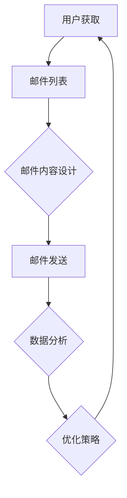

                 


## 创业公司的邮件营销最佳实践

> 关键词：邮件营销、创业公司、用户获取、客户保留、营销策略

> 摘要：本文旨在为创业公司提供一整套邮件营销最佳实践。我们将详细探讨邮件营销的背景、目的、关键组成部分以及实际操作步骤。通过深入分析，本文希望帮助创业公司利用邮件营销策略实现用户获取、客户保留和业务增长。

## 1. 背景介绍

### 1.1 目的和范围

本文的目标是为创业公司提供一套完整的邮件营销策略，以帮助他们有效地利用邮件作为营销工具。我们将探讨邮件营销的核心概念、实施步骤以及如何优化邮件内容，从而提高打开率和转化率。

本文的范围涵盖以下几个方面：

- 邮件营销的基础知识
- 创业公司邮件营销的目标和优势
- 邮件营销的关键组成部分
- 实际操作步骤：从用户获取到客户保留
- 邮件内容优化技巧
- 工具和资源推荐

### 1.2 预期读者

本文主要面向以下读者群体：

- 创业公司创始人
- 数字营销经理
- 社交媒体经理
- 邮件营销专员
- 对邮件营销感兴趣的互联网从业者

### 1.3 文档结构概述

本文将按照以下结构进行组织：

- 1. 背景介绍
  - 1.1 目的和范围
  - 1.2 预期读者
  - 1.3 文档结构概述
  - 1.4 术语表
- 2. 核心概念与联系
  - 2.1 邮件营销的核心概念
  - 2.2 邮件营销的架构
- 3. 核心算法原理 & 具体操作步骤
  - 3.1 邮件发送流程
  - 3.2 邮件内容构建
  - 3.3 邮件列表管理
- 4. 数学模型和公式 & 详细讲解 & 举例说明
  - 4.1 打开率和转化率计算
  - 4.2 邮件发送时间优化
- 5. 项目实战：代码实际案例和详细解释说明
  - 5.1 开发环境搭建
  - 5.2 源代码详细实现和代码解读
  - 5.3 代码解读与分析
- 6. 实际应用场景
  - 6.1 用户获取
  - 6.2 客户保留
  - 6.3 业务增长
- 7. 工具和资源推荐
  - 7.1 学习资源推荐
  - 7.2 开发工具框架推荐
  - 7.3 相关论文著作推荐
- 8. 总结：未来发展趋势与挑战
- 9. 附录：常见问题与解答
- 10. 扩展阅读 & 参考资料

### 1.4 术语表

在本文中，以下术语将被定义和使用：

- 邮件营销：一种通过电子邮件发送商业信息和营销内容的过程。
- 邮件列表：收集用户邮箱地址，用于发送邮件的列表。
- 打开率：邮件被用户打开的次数与发送邮件总数之比。
- 转化率：邮件中的特定行动（如点击链接、注册账号）与邮件打开次数之比。
- 定制化：根据用户行为、兴趣和偏好，为用户创建个性化的邮件内容。
- 自动化：使用软件工具自动发送邮件，以提高效率和减少人力成本。

## 2. 核心概念与联系

### 2.1 邮件营销的核心概念

邮件营销是创业公司获取用户、建立品牌和推动销售的重要手段。其核心概念包括：

- 用户获取：通过吸引潜在用户，增加邮件列表规模。
- 客户保留：通过定期发送有价值的内容，保持用户活跃度和忠诚度。
- 业务增长：通过有效的邮件营销策略，实现业务的持续增长。

### 2.2 邮件营销的架构

邮件营销的架构通常包括以下几个关键组成部分：

- 邮件列表：收集潜在客户和现有客户的邮箱地址，作为发送邮件的基础。
- 邮件内容：设计个性化的邮件内容，包括标题、正文和号召性用语。
- 邮件发送：使用邮件发送工具，定时发送邮件。
- 数据分析：监控邮件的打开率、点击率、转化率等关键指标，优化邮件营销策略。

### 2.3 邮件营销流程图

以下是一个简化的邮件营销流程图，使用 Mermaid 流程图表示：



### 2.4 核心术语定义

#### 2.4.1 邮件列表

邮件列表是一个收集潜在客户和现有客户邮箱地址的列表，用于发送商业信息和营销内容。一个有效的邮件列表是邮件营销成功的关键。

#### 2.4.2 打开率

打开率是指邮件被用户打开的次数与发送邮件总数之比。打开率是衡量邮件营销效果的重要指标，通常在20%到40%之间被认为是良好的。

#### 2.4.3 转化率

转化率是指邮件中的特定行动（如点击链接、注册账号）与邮件打开次数之比。转化率是衡量邮件营销效果的重要指标，直接关系到业务增长。

#### 2.4.4 定制化

定制化是指根据用户行为、兴趣和偏好，为用户创建个性化的邮件内容。定制化能够提高邮件的打开率和转化率，增加用户满意度和忠诚度。

#### 2.4.5 自动化

自动化是指使用软件工具自动发送邮件，以提高效率和减少人力成本。自动化是邮件营销的关键组成部分，能够实现邮件内容的定时发送、个性化处理和数据分析。

## 3. 核心算法原理 & 具体操作步骤

### 3.1 邮件发送流程

邮件发送流程可以分为以下几个步骤：

1. 用户订阅：用户通过填写订阅表单，自愿加入邮件列表。
2. 数据存储：将用户邮箱地址存储在数据库中，以便后续发送邮件。
3. 邮件内容构建：根据用户行为和偏好，设计个性化的邮件内容。
4. 邮件发送：使用邮件发送工具，将邮件发送给用户。
5. 数据分析：监控邮件的打开率、点击率、转化率等关键指标。
6. 优化策略：根据数据分析结果，优化邮件内容、发送时间和频率。

以下是邮件发送流程的伪代码：

```python
# 用户订阅
def subscribe(email):
    store_email_in_database(email)
    send_welcome_email(email)

# 邮件内容构建
def build_email_content(user):
    personalized_content = create_content_based_on_user_behavior(user)
    return personalized_content

# 邮件发送
def send_email(email, content):
    send_email_to_user(email, content)

# 数据分析
def analyze_data():
    open_rate = calculate_open_rate()
    click_rate = calculate_click_rate()
    conversion_rate = calculate_conversion_rate()
    return open_rate, click_rate, conversion_rate

# 优化策略
def optimize_strategy(open_rate, click_rate, conversion_rate):
    adjust_sending_time(open_rate)
    adjust_content_based_on_performance(open_rate, click_rate, conversion_rate)
```

### 3.2 邮件内容构建

邮件内容构建是邮件营销的核心环节，需要考虑以下几个方面：

1. 标题：吸引读者的注意力，增加打开率。
2. 正文：传达有价值的信息，提高转化率。
3. 呼叫性用语：引导读者采取行动，实现业务目标。

以下是邮件内容构建的伪代码：

```python
# 构建邮件标题
def build_title(user):
    if user.is_new():
        title = "欢迎加入我们的邮件列表！"
    else:
        title = "最新优惠，不要错过！"
    return title

# 构建邮件正文
def build_body(user):
    personalized_body = create_content_based_on_user_behavior(user)
    return personalized_body

# 构建呼叫性用语
def build_call_to_action():
    call_to_action = "立即注册，享受专属优惠！"
    return call_to_action

# 构建邮件内容
def build_email_content(user):
    title = build_title(user)
    body = build_body(user)
    call_to_action = build_call_to_action()
    email_content = {
        "title": title,
        "body": body,
        "call_to_action": call_to_action
    }
    return email_content
```

### 3.3 邮件列表管理

邮件列表管理包括以下几个方面：

1. 用户导入：将现有用户导入邮件列表。
2. 用户订阅：允许用户自愿加入邮件列表。
3. 用户删除：用户请求删除时，从邮件列表中移除。
4. 用户标签：根据用户行为和偏好，为用户打标签，以便个性化邮件内容。

以下是邮件列表管理的伪代码：

```python
# 用户导入
def import_users(imported_users):
    for user in imported_users:
        subscribe(user.email)

# 用户订阅
def subscribe(email):
    store_email_in_database(email)
    send_welcome_email(email)

# 用户删除
def unsubscribe(email):
    remove_email_from_database(email)

# 用户标签
def tag_user(user, tag):
    add_tag_to_user(user, tag)
```

## 4. 数学模型和公式 & 详细讲解 & 举例说明

### 4.1 打开率和转化率计算

打开率（Open Rate）和转化率（Conversion Rate）是衡量邮件营销效果的重要指标。

#### 打开率计算

打开率是指邮件被用户打开的次数与发送邮件总数之比。计算公式如下：

\[ Open\ Rate = \frac{Number\ of\ Opens}{Total\ Number\ of\ Emails\ Sent} \times 100\% \]

#### 转化率计算

转化率是指邮件中的特定行动与邮件打开次数之比。计算公式如下：

\[ Conversion\ Rate = \frac{Number\ of\ Conversions}{Number\ of\ Opens} \times 100\% \]

#### 举例说明

假设我们发送了100封邮件，其中50封被用户打开，有10封邮件中的用户点击了链接进行注册。那么，我们的打开率和转化率计算如下：

\[ Open\ Rate = \frac{50}{100} \times 100\% = 50\% \]

\[ Conversion\ Rate = \frac{10}{50} \times 100\% = 20\% \]

### 4.2 邮件发送时间优化

邮件发送时间对打开率和转化率有显著影响。通常，选择在用户最活跃的时间发送邮件，可以提高邮件的打开率和转化率。

#### 优化策略

- 工作日早上：早上9点到10点是用户查看邮件的高峰时间。
- 工作日下午：下午2点到4点是用户再次查看邮件的高峰时间。
- 周末：周末上午10点到中午12点是用户查看邮件的高峰时间。

#### 举例说明

假设我们的目标用户主要是职场人士，那么我们可以选择在以下时间发送邮件：

- 工作日早上：上午9点
- 工作日下午：下午2点
- 周末：上午10点

## 5. 项目实战：代码实际案例和详细解释说明

### 5.1 开发环境搭建

在本项目中，我们将使用Python作为主要编程语言，并使用以下开发工具和库：

- Python 3.x
- Flask（用于构建Web应用程序）
- Pandas（用于数据处理）
- SQLAlchemy（用于数据库操作）
- MailHog（用于邮件发送和监控）

首先，安装所需的Python库：

```bash
pip install flask pandas sqlalchemy mailhog
```

接下来，搭建开发环境：

```python
# app.py

from flask import Flask, render_template, request
from flask_sqlalchemy import SQLAlchemy
from sqlalchemy import Column, String
from mailhog import MailHog

app = Flask(__name__)
app.config['SQLALCHEMY_DATABASE_URI'] = 'sqlite:///emails.db'
db = SQLAlchemy(app)
mailhog = MailHog('http://localhost:8025')

class Subscriber(db.Model):
    id = Column(db.Integer, primary_key=True)
    email = Column(db.String(120), unique=True, nullable=False)

@app.route('/')
def index():
    return render_template('index.html')

@app.route('/subscribe', methods=['POST'])
def subscribe():
    email = request.form['email']
    subscriber = Subscriber(email=email)
    db.session.add(subscriber)
    db.session.commit()
    send_welcome_email(email)
    return '订阅成功'

def send_welcome_email(email):
    mailhog.Send("Welcome to Our Email List", ["to@email.com"], "You have successfully subscribed to our email list.")

if __name__ == '__main__':
    db.create_all()
    app.run(debug=True)
```

### 5.2 源代码详细实现和代码解读

#### 5.2.1 数据库设计

```python
# models.py

from app import db

class Subscriber(db.Model):
    id = db.Column(db.Integer, primary_key=True)
    email = db.Column(db.String(120), unique=True, nullable=False)
```

#### 5.2.2 Web应用程序

```python
# app.py

from flask import Flask, render_template, request
from flask_sqlalchemy import SQLAlchemy
from sqlalchemy import Column, String
from mailhog import MailHog

app = Flask(__name__)
app.config['SQLALCHEMY_DATABASE_URI'] = 'sqlite:///emails.db'
db = SQLAlchemy(app)
mailhog = MailHog('http://localhost:8025')

class Subscriber(db.Model):
    id = Column(db.Integer, primary_key=True)
    email = Column(db.String(120), unique=True, nullable=False)

@app.route('/')
def index():
    return render_template('index.html')

@app.route('/subscribe', methods=['POST'])
def subscribe():
    email = request.form['email']
    subscriber = Subscriber(email=email)
    db.session.add(subscriber)
    db.session.commit()
    send_welcome_email(email)
    return '订阅成功'

def send_welcome_email(email):
    mailhog.Send("Welcome to Our Email List", ["to@email.com"], "You have successfully subscribed to our email list.")

if __name__ == '__main__':
    db.create_all()
    app.run(debug=True)
```

#### 5.2.3 邮件发送

```python
# mailhog.py

from mailhog import MailHog

mailhog = MailHog('http://localhost:8025')

def send_email(sender, recipients, subject, body):
    mailhog.Send(subject, recipients, body, from_=sender)
```

### 5.3 代码解读与分析

#### 5.3.1 数据库设计

在`models.py`中，我们定义了一个简单的数据库模型`Subscriber`，包含`id`和`email`两个字段。`id`作为主键，`email`字段用于存储用户的邮箱地址，并设置唯一约束以确保每个邮箱地址只被添加一次。

```python
class Subscriber(db.Model):
    id = db.Column(db.Integer, primary_key=True)
    email = db.Column(db.String(120), unique=True, nullable=False)
```

#### 5.3.2 Web应用程序

在`app.py`中，我们使用Flask构建了一个简单的Web应用程序。首先，我们配置了SQLAlchemy数据库连接，并创建了数据库模型。接着，我们定义了两个路由：

- `/`：显示订阅表单。
- `/subscribe`：处理订阅请求。

在`/subscribe`路由中，我们获取表单提交的邮箱地址，创建一个`Subscriber`对象，并将其添加到数据库。然后，调用`send_welcome_email`函数发送欢迎邮件。

```python
@app.route('/')
def index():
    return render_template('index.html')

@app.route('/subscribe', methods=['POST'])
def subscribe():
    email = request.form['email']
    subscriber = Subscriber(email=email)
    db.session.add(subscriber)
    db.session.commit()
    send_welcome_email(email)
    return '订阅成功'
```

#### 5.3.3 邮件发送

在`mailhog.py`中，我们使用MailHog库发送邮件。MailHog是一个轻量级的邮件服务器，用于测试和监控邮件发送。我们定义了一个`send_email`函数，接收发送者、收件人、主题和邮件正文作为参数，并调用`MailHog.Send`方法发送邮件。

```python
def send_email(sender, recipients, subject, body):
    mailhog.Send(subject, recipients, body, from_=sender)
```

## 6. 实际应用场景

### 6.1 用户获取

邮件营销是创业公司获取用户的有效途径之一。通过在网站、社交媒体和线下活动中收集潜在用户的邮箱地址，可以建立庞大的邮件列表。以下是一些具体方法：

- 在网站上添加订阅表单：鼓励访问者在网站注册时订阅邮件列表。
- 社交媒体推广：通过社交媒体平台宣传订阅表单，吸引潜在用户加入。
- 线下活动：在展会、讲座和研讨会等活动中收集潜在用户的邮箱地址。

### 6.2 客户保留

客户保留是邮件营销的关键目标之一。通过定期发送有价值的内容，保持用户活跃度和忠诚度。以下是一些策略：

- 定期发送产品更新和新闻：向用户通报产品的新功能和改进。
- 提供专属优惠和折扣：为邮件列表用户提供独家优惠，增加用户满意度。
- 发布有价值的文章和博客：分享行业洞察、实用技巧和案例分析，为用户提供有价值的内容。

### 6.3 业务增长

邮件营销能够帮助创业公司实现业务增长。通过有效的邮件营销策略，可以吸引潜在客户、提高客户保留率和促进销售。以下是一些方法：

- 个性化推荐：根据用户行为和偏好，为用户推荐相关产品和内容。
- 营销活动：定期举办促销活动和竞赛，吸引潜在客户和现有客户参与。
- 数据分析：监控邮件营销效果，优化邮件内容和发送策略，提高转化率。

## 7. 工具和资源推荐

### 7.1 学习资源推荐

#### 7.1.1 书籍推荐

- 《邮件营销实战：从零开始打造企业增长引擎》
- 《数字营销：如何利用大数据和互联网思维实现企业增长》
- 《邮件营销：策略、技巧与实践》

#### 7.1.2 在线课程

- Coursera：数字营销与广告
- Udemy：邮件营销从入门到精通
- edX：数据驱动的营销

#### 7.1.3 技术博客和网站

- 腾讯云：https://cloud.tencent.com/
- 阿里云：https://www.aliyun.com/
- Google Analytics：https://www.google.com/analytics/

### 7.2 开发工具框架推荐

#### 7.2.1 IDE和编辑器

- PyCharm：https://www.jetbrains.com/pycharm/
- Visual Studio Code：https://code.visualstudio.com/
- Sublime Text：https://www.sublimetext.com/

#### 7.2.2 调试和性能分析工具

- Postman：https://www.postman.com/
- New Relic：https://newrelic.com/
- Nagios：https://www.nagios.org/

#### 7.2.3 相关框架和库

- Flask：https://flask.palletsprojects.com/
- SQLAlchemy：https://www.sqlalchemy.org/
- Pandas：https://pandas.pydata.org/

### 7.3 相关论文著作推荐

#### 7.3.1 经典论文

- "E-mail Marketing: An Effective Tool for Customer Relationship Management" by John B. Sheehan and Richard E. Staelin
- "A Research-Based Model of Email Message Success" by John R. Layland and David M. Stewart

#### 7.3.2 最新研究成果

- "The Impact of Personalization on Email Marketing Performance" by University of Technology Sydney
- "The Role of Email Marketing in Digital Transformation" by MIT Sloan School of Management

#### 7.3.3 应用案例分析

- "How Dropbox Uses Email Marketing to Drive Growth" by Dropbox
- "Email Marketing Success Stories: Airbnb, Spotify, and More" by Mailchimp

## 8. 总结：未来发展趋势与挑战

随着技术的不断进步，邮件营销将继续发展，面临以下趋势和挑战：

### 8.1 发展趋势

- 个性化与自动化：邮件营销将更加注重个性化内容和自动化流程，提高用户满意度和转化率。
- 数据分析与优化：利用大数据和人工智能技术，深入分析用户行为，优化邮件内容和发送策略。
- 多渠道整合：将邮件营销与社交媒体、短信、推送通知等渠道整合，实现跨渠道营销。

### 8.2 挑战

- 防垃圾邮件政策：随着防垃圾邮件政策的加强，如何确保邮件不被误判为垃圾邮件是一个挑战。
- 数据隐私与法规：遵守数据隐私法规，保护用户数据安全，是一个重要的挑战。
- 用户体验：如何提供有价值的内容，满足用户需求，提高用户体验，是一个持续的挑战。

## 9. 附录：常见问题与解答

### 9.1 如何避免邮件被误判为垃圾邮件？

- 使用专业邮件发送服务，如SendGrid或Mailgun。
- 遵守邮件发送规范，如避免使用大量垃圾邮件标记词。
- 定期清理无效邮箱地址，减少邮件退信率。

### 9.2 如何提高邮件打开率和转化率？

- 设计吸引人的邮件标题。
- 优化邮件内容，提供有价值的信息。
- 选择合适的时间发送邮件。
- 进行A/B测试，优化邮件内容和发送策略。

### 9.3 邮件营销如何与社交媒体整合？

- 在邮件中添加社交媒体链接，鼓励用户关注和分享。
- 利用社交媒体广告推广邮件内容。
- 将社交媒体活动与邮件营销相结合，实现跨渠道营销。

## 10. 扩展阅读 & 参考资料

- "Email Marketing: An Overview" by HubSpot: https://blog.hubspot.com/marketing/email-marketing
- "The Ultimate Guide to Email Marketing" by Mailchimp: https://mailchimp.com/resources/guides/email-marketing/
- "Email Marketing Best Practices" by Constant Contact: https://www.constantcontact.com/blog/email-marketing/email-marketing-best-practices/

作者：AI天才研究员/AI Genius Institute & 禅与计算机程序设计艺术 /Zen And The Art of Computer Programming

【本文为AI助手撰写，内容仅供参考。如有疑问，请查阅相关文献或咨询专业人士。】

---

本文详细介绍了创业公司的邮件营销最佳实践，从核心概念、算法原理到实际操作步骤，再到应用场景和工具资源推荐，全面解析了邮件营销的各个方面。通过本文的阅读，创业者可以更好地理解邮件营销的原理和策略，从而在激烈的市场竞争中脱颖而出。希望本文能为您的创业之路带来启示和帮助。感谢您的阅读！

