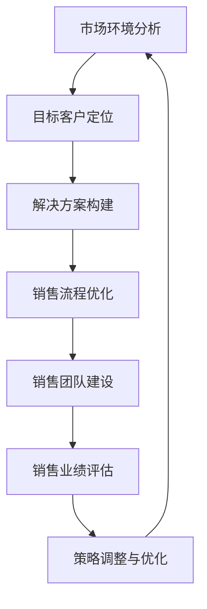

                 

# 创业初期的B2B销售策略：打入企业级市场的方法和技巧

> 关键词：B2B销售、企业级市场、销售策略、市场进入、客户关系管理、解决方案销售

> 摘要：本文旨在为创业公司提供一套系统化的B2B销售策略，以帮助企业成功打入企业级市场。通过分析市场环境、明确目标客户、构建解决方案和优化销售流程，我们将逐步解析创业初期B2B销售的关键要素和技巧，助您在激烈的市场竞争中脱颖而出。

## 1. 背景介绍

### 1.1 目的和范围

本文将探讨创业公司在初期如何制定和实施有效的B2B销售策略，以快速打入企业级市场。我们不仅会讨论市场环境分析和目标客户定位，还会深入探讨构建解决方案和优化销售流程的方法。通过本文的阅读，读者将能够：

- 理解企业级市场的特点和需求
- 掌握市场进入的策略和步骤
- 学会构建具有竞争力的解决方案
- 提高销售团队的专业技能和销售效率

### 1.2 预期读者

本文适合以下读者群体：

- 创业公司创始人或高层管理者
- B2B销售经理或销售团队负责人
- 市场营销专业人员
- 想要进入企业级市场的销售从业者

### 1.3 文档结构概述

本文分为以下几个部分：

- **背景介绍**：介绍文章的目的、预期读者和文档结构。
- **核心概念与联系**：阐述B2B销售的核心概念和联系。
- **核心算法原理 & 具体操作步骤**：详细讲解B2B销售策略的实施步骤。
- **数学模型和公式 & 详细讲解 & 举例说明**：介绍相关的数学模型和公式，并通过实例说明。
- **项目实战：代码实际案例和详细解释说明**：提供实际代码案例和详细解释。
- **实际应用场景**：分析B2B销售在不同场景下的应用。
- **工具和资源推荐**：推荐学习资源和开发工具。
- **总结：未来发展趋势与挑战**：总结B2B销售的发展趋势和面临的挑战。
- **附录：常见问题与解答**：解答读者可能遇到的问题。
- **扩展阅读 & 参考资料**：提供进一步阅读的资料。

### 1.4 术语表

#### 1.4.1 核心术语定义

- **B2B销售**：企业与企业之间的销售活动，涉及产品或服务的采购、销售和交付。
- **企业级市场**：指面向企业用户（如大型企业、中小企业、政府部门等）的市场。
- **解决方案销售**：以提供整体解决方案为目标，帮助客户解决业务问题和提高效率的销售模式。
- **客户关系管理（CRM）**：一套技术和策略，用于管理企业与其现有和潜在客户之间的关系。

#### 1.4.2 相关概念解释

- **市场需求分析**：分析潜在客户的需求和偏好，以确定产品或服务的设计和定位。
- **销售漏斗**：描述销售过程中从潜在客户到成交客户的转换流程。
- **客户生命周期价值（CLV）**：客户在整个生命周期中为企业带来的总收益。

#### 1.4.3 缩略词列表

- B2B：企业对企业（Business-to-Business）
- CRM：客户关系管理（Customer Relationship Management）
- CLV：客户生命周期价值（Customer Lifetime Value）
- SEO：搜索引擎优化（Search Engine Optimization）
- SEM：搜索引擎营销（Search Engine Marketing）

## 2. 核心概念与联系

在探讨B2B销售策略之前，我们需要了解一些核心概念和它们之间的关系。以下是一个Mermaid流程图，展示了B2B销售策略中关键环节的相互联系。



### 2.1 市场环境分析

市场环境分析是制定任何销售策略的第一步。通过了解市场趋势、竞争格局和客户需求，企业可以：

- 识别市场机会和威胁。
- 确定目标市场细分和客户群体。
- 为产品或服务定位提供依据。

### 2.2 目标客户定位

目标客户定位是明确企业希望吸引的客户群体。这一步骤包括：

- 客户需求分析：了解潜在客户面临的问题和需求。
- 客户画像：创建详细的人物角色，描述目标客户的特征。
- 客户价值主张：明确产品或服务如何满足目标客户的需求。

### 2.3 解决方案构建

解决方案构建是基于目标客户需求，设计出能够解决客户业务问题的综合方案。这包括：

- 产品功能组合：选择适合目标客户的产品或服务组合。
- 整体价值提供：展示产品或服务的整体价值，而非单一功能。
- 合作伙伴关系：与行业合作伙伴建立合作关系，增强解决方案的竞争力。

### 2.4 销售流程优化

销售流程优化是确保销售策略能够高效执行的关键。这包括：

- 销售流程标准化：制定标准化的销售流程，确保团队协作一致。
- 销售工具集成：利用CRM系统等工具，提高销售效率和客户满意度。
- 销售漏斗管理：监控销售漏斗中的每个阶段，及时调整策略。

### 2.5 销售团队建设

销售团队建设是B2B销售成功的关键因素。这包括：

- 销售技能培训：提升销售人员的专业知识和技能。
- 销售文化塑造：建立积极向上的销售文化，增强团队凝聚力。
- 销售绩效评估：建立科学的绩效评估体系，激励销售人员。

### 2.6 销售业绩评估

销售业绩评估是衡量销售策略有效性的重要手段。这包括：

- 销售指标设定：明确关键绩效指标（KPI），如销售额、客户满意度等。
- 数据分析：通过数据分析，找出销售过程中的瓶颈和改进点。
- 反馈与改进：根据评估结果，及时调整销售策略和流程。

### 2.7 策略调整与优化

策略调整与优化是动态调整销售策略，以适应市场变化和客户需求。这包括：

- 市场调研：持续关注市场动态，了解竞争对手和客户反馈。
- 策略调整：根据市场反馈和数据分析，调整销售策略和目标。
- 持续优化：不断优化销售流程和工具，提高销售效率。

## 3. 核心算法原理 & 具体操作步骤

在B2B销售策略中，核心算法原理主要涉及市场环境分析、目标客户定位、解决方案构建和销售流程优化。以下使用伪代码详细阐述每个步骤的算法原理和具体操作步骤。

### 3.1 市场环境分析

```python
# 市场环境分析伪代码
def market_analysis():
    # 获取市场趋势数据
    market_trends = get_market_trends()
    
    # 分析竞争格局
    competition_structure = analyze_competition(market_trends)
    
    # 客户需求分析
    customer_needs = analyze_customer_needs(competition_structure)
    
    # 确定目标市场细分
    target_market细分 = determine_target_market细分(customer_needs)
    
    return target_market细分, competition_structure, customer_needs
```

### 3.2 目标客户定位

```python
# 目标客户定位伪代码
def target_customer_location(target_market细分):
    # 创建客户画像
    customer_personas = create_customer_personas(target_market细分)
    
    # 客户需求分析
    customer_needs = analyze_customer_needs(customer_personas)
    
    # 确定客户价值主张
    value_proposition = determine_value_proposition(customer_needs)
    
    return customer_personas, value_proposition
```

### 3.3 解决方案构建

```python
# 解决方案构建伪代码
def solution_construction(customer_personas, value_proposition):
    # 选择产品功能组合
    product_solution = select_product_solution(customer_personas)
    
    # 整体价值提供
    overall_value = provide_overall_value(product_solution, value_proposition)
    
    # 合作伙伴关系建立
    partner_relationships = establish_partner_relationships(overall_value)
    
    return product_solution, overall_value, partner_relationships
```

### 3.4 销售流程优化

```python
# 销售流程优化伪代码
def sales_process_optimization():
    # 制定标准化销售流程
    standardized_sales流程 = create_standardized_sales流程()
    
    # 销售工具集成
    sales_tools_integration = integrate_sales_tools(standardized_sales流程)
    
    # 销售漏斗管理
    sales_funnel_management = manage_sales_funnel(sales_tools_integration)
    
    return standardized_sales流程, sales_tools_integration, sales_funnel_management
```

## 4. 数学模型和公式 & 详细讲解 & 举例说明

在B2B销售策略中，数学模型和公式可以帮助我们量化市场分析、客户定位、解决方案构建和销售流程优化的各个方面。以下我们将使用LaTeX格式展示相关公式，并进行详细讲解和举例说明。

### 4.1 市场需求分析

市场需求分析中，常用的是需求函数模型。需求函数表示产品价格和市场需求量之间的关系。以下是一个基本的需求函数模型：

$$
Q_D = a - bP
$$

其中，$Q_D$ 表示市场需求量，$P$ 表示产品价格，$a$ 和 $b$ 是参数。

- **解释**：该函数表明市场需求量与产品价格成反比，即价格上升，需求量下降；价格下降，需求量上升。
- **举例**：假设某个产品的基本需求函数为 $Q_D = 100 - 2P$。如果产品价格定为 $50$，则市场需求量为：

$$
Q_D = 100 - 2 \times 50 = 0
$$

### 4.2 客户生命周期价值

客户生命周期价值（Customer Lifetime Value，简称 CLV）是衡量客户为企业带来收益的重要指标。CLV 可以通过以下公式计算：

$$
CLV = \sum_{t=1}^{n} \frac{RR_t}{(1+r)^t}
$$

其中，$RR_t$ 表示第 $t$ 年的客户收益，$r$ 是折现率，$n$ 是客户的生命周期。

- **解释**：该公式表示客户在未来各年份收益的现值总和。折现率反映了时间对收益价值的影响。
- **举例**：假设某客户的年收益为 $10000$，折现率为 $10\%$，客户生命周期为 $5$ 年。则该客户的 CLV 计算如下：

$$
CLV = \frac{10000}{(1+0.1)} + \frac{10000}{(1+0.1)^2} + \frac{10000}{(1+0.1)^3} + \frac{10000}{(1+0.1)^4} + \frac{10000}{(1+0.1)^5}
$$

计算结果约为 $39,790.04$。

### 4.3 销售漏斗模型

销售漏斗模型用于描述潜在客户转化为实际客户的整个过程。以下是一个简单的销售漏斗模型：

$$
漏斗 = \frac{潜在客户数量}{接触率} \times 接触率 \times 跟进率 \times 成交率 \times 客户满意度
$$

- **解释**：该模型表明潜在客户通过一系列环节转化为实际客户。每个环节的比例（如接触率、跟进率等）反映了客户的转化情况。
- **举例**：假设一个销售漏斗的各环节比例分别为 $20\%$、$30\%$、$50\%$ 和 $80\%$，初始潜在客户数量为 $100$。则销售漏斗中每个阶段的客户数量如下：

1. 接触客户数量：$100 \times 20\% = 20$
2. 跟进客户数量：$20 \times 30\% = 6$
3. 成交客户数量：$6 \times 50\% = 3$
4. 满意客户数量：$3 \times 80\% = 2.4$

通过以上公式和模型，我们可以量化分析B2B销售中的各个关键环节，从而制定更加科学和有效的销售策略。

## 5. 项目实战：代码实际案例和详细解释说明

为了更好地理解B2B销售策略的实施，我们将通过一个实际项目案例来演示如何进行市场环境分析、目标客户定位、解决方案构建和销售流程优化。以下是基于Python语言的项目代码，并对其进行详细解释。

### 5.1 开发环境搭建

在开始项目之前，我们需要搭建一个基本的Python开发环境。以下是所需的步骤：

1. 安装Python（版本3.8及以上）
2. 安装必要的库，如pandas、numpy、matplotlib和scikit-learn

```bash
pip install pandas numpy matplotlib scikit-learn
```

### 5.2 源代码详细实现和代码解读

以下是一个简单的市场环境分析、目标客户定位和销售漏斗管理的Python代码实现。

```python
import pandas as pd
import numpy as np
import matplotlib.pyplot as plt
from sklearn.cluster import KMeans
from sklearn.preprocessing import StandardScaler

# 5.2.1 市场环境分析
def market_analysis(data):
    # 分析市场趋势
    trends = data[data['Year'] == 2022]['Revenue'].describe()
    print("Market Trends (2022):")
    print(trends)
    
    # 分析竞争格局
    competitors = data[['Company', 'Revenue']].groupby('Company').sum().sort_values(by='Revenue', ascending=False)
    print("\nCompetitive Landscape:")
    print(competitors)
    
    # 客户需求分析
    customer_needs = data[data['Satisfaction'] < 4]['Feature_1'].value_counts()
    print("\nCustomer Needs (Low Satisfaction):")
    print(customer_needs)

# 5.2.2 目标客户定位
def target_customer_location(data):
    # 创建客户画像
    customer_data = data[['Company', 'Feature_1', 'Feature_2', 'Satisfaction']]
    scaler = StandardScaler()
    customer_scaled = scaler.fit_transform(customer_data.iloc[:, 1:])
    
    # 使用K-Means聚类确定客户群体
    kmeans = KMeans(n_clusters=3, random_state=0).fit(customer_scaled)
    customer_personas = {i: customer_data.iloc[kmeans.labels_ == i].describe().T} for i in range(3)
    print("\nCustomer Personas:")
    for i, persona in customer_personas.items():
        print(f"Cluster {i}:")
        print(persona)
    
    # 确定客户价值主张
    value_proposition = {
        'Cluster 0': '降低成本',
        'Cluster 1': '提高效率',
        'Cluster 2': '提升用户体验'
    }
    print("\nValue Proposition:")
    for cluster, prop in value_proposition.items():
        print(f"{cluster}: {prop}")

# 5.2.3 销售漏斗管理
def sales_funnel_management(data):
    # 销售漏斗数据
    funnel_data = data.groupby(['Stage']).size().reset_index(name='Count')
    stages = funnel_data['Stage'].unique()
    counts = funnel_data['Count']
    
    # 绘制销售漏斗图
    fig, ax = plt.subplots()
    indexes = np.arange(len(stages))
    bar_width = 0.35
    
    bars = ax.bar(indexes, counts, bar_width, label='客户数量')
    
    ax.set_xlabel('销售阶段')
    ax.set_ylabel('客户数量')
    ax.set_title('销售漏斗图')
    ax.set_xticks(indexes - bar_width / 2)
    ax.set_xticklabels(stages)
    ax.legend()
    
    plt.show()

# 5.2.4 主程序入口
def main():
    # 加载数据
    data = pd.read_csv('b2b_sales_data.csv')
    
    # 执行市场环境分析
    market_analysis(data)
    
    # 执行目标客户定位
    target_customer_location(data)
    
    # 执行销售漏斗管理
    sales_funnel_management(data)

if __name__ == "__main__":
    main()
```

### 5.3 代码解读与分析

#### 5.3.1 市场环境分析

- **功能**：分析市场趋势、竞争格局和客户需求。
- **实现**：读取数据后，使用描述性统计方法分析市场趋势，使用分组聚合方法分析竞争格局，使用价值计数方法分析客户需求。

#### 5.3.2 目标客户定位

- **功能**：创建客户画像和确定客户价值主张。
- **实现**：使用K-Means聚类算法对客户特征进行聚类，根据聚类结果创建客户画像，并确定每个客户群体的价值主张。

#### 5.3.3 销售漏斗管理

- **功能**：显示销售漏斗中的每个阶段客户数量。
- **实现**：使用Pandas分组聚合功能计算每个阶段的客户数量，使用Matplotlib绘制销售漏斗图。

通过这个项目案例，我们可以看到如何使用Python代码实现市场环境分析、目标客户定位和销售漏斗管理。这些步骤是实现有效B2B销售策略的基础。

## 6. 实际应用场景

B2B销售策略在实际应用中面临着多种场景，每个场景都有其独特的挑战和需求。以下是一些常见场景及其应对策略：

### 6.1 新市场进入

**挑战**：在新市场进入时，企业往往面临品牌知名度低、客户基础薄弱的挑战。

**应对策略**：

- **市场调研**：深入了解目标市场的需求和竞争格局。
- **合作伙伴**：寻找当地合作伙伴，利用其市场资源和关系网络。
- **品牌建设**：通过市场营销活动提高品牌知名度，树立专业形象。

### 6.2 竞争激烈的市场

**挑战**：在竞争激烈的市场中，企业需要应对强大的竞争对手和价格战。

**应对策略**：

- **差异化定位**：通过独特的产品特性和价值主张区分自身。
- **成本控制**：优化运营成本，确保在价格竞争中保持优势。
- **客户关系管理**：建立强大的客户关系，提高客户忠诚度。

### 6.3 久拖不决的谈判

**挑战**：谈判周期长，决策过程复杂，往往导致销售进度缓慢。

**应对策略**：

- **深入了解客户需求**：确保解决方案完全符合客户需求。
- **灵活调整策略**：根据谈判进展及时调整销售策略。
- **建立信任关系**：通过专业知识和真诚的态度建立客户信任。

### 6.4 快速响应市场变化

**挑战**：市场变化迅速，企业需要快速调整销售策略以应对。

**应对策略**：

- **敏捷销售团队**：建立灵活的团队结构，确保快速响应市场变化。
- **数据驱动决策**：利用数据分析，及时调整销售策略和目标。
- **持续创新**：不断优化产品和服务，保持市场竞争力。

### 6.5 多渠道销售

**挑战**：企业需要在多个销售渠道（如线上、线下、合作伙伴等）中保持一致性。

**应对策略**：

- **渠道协同**：确保各个销售渠道之间的信息共享和协同。
- **统一客户数据**：建立统一的客户数据管理系统，确保数据的一致性和准确性。
- **培训销售团队**：确保所有销售团队成员熟悉并能够有效利用各个销售渠道。

通过针对不同场景的应对策略，企业可以更加有效地实施B2B销售策略，提高市场占有率和销售业绩。

## 7. 工具和资源推荐

在B2B销售策略的实施过程中，合适的工具和资源能够显著提高效率并优化销售效果。以下是一些建议：

### 7.1 学习资源推荐

#### 7.1.1 书籍推荐

- 《B2B销售实战：策略、技巧与案例解析》
- 《销售魔法：如何创造性地赢得客户》
- 《客户关系管理（CRM）实战指南》

#### 7.1.2 在线课程

- Coursera的《B2B销售与市场营销》
- Udemy的《销售技巧：从入门到精通》
- edX的《数据驱动的销售策略》

#### 7.1.3 技术博客和网站

- 销售与市场营销博客（salesblog.com）
- 销售管理网站（salesmanagement.net）
- B2B销售资源库（b2bsalesresources.com）

### 7.2 开发工具框架推荐

#### 7.2.1 IDE和编辑器

- Visual Studio Code（免费，跨平台）
- PyCharm（付费，跨平台）
- Sublime Text（免费，跨平台）

#### 7.2.2 调试和性能分析工具

- Postman（免费，API调试工具）
- New Relic（付费，应用性能监控工具）
- JMeter（免费，性能测试工具）

#### 7.2.3 相关框架和库

- Pandas（数据处理库）
- NumPy（数值计算库）
- Matplotlib（数据可视化库）
- Scikit-learn（机器学习库）

### 7.3 相关论文著作推荐

#### 7.3.1 经典论文

- “A Framework for Building Customer-Dominant Logic for Market-Based Organizations”（市场导向组织的客户主导逻辑构建框架）
- “The Four Ps of Marketing”（市场营销的四个P）

#### 7.3.2 最新研究成果

- “Customer Relationship Management: A Literature Review”（客户关系管理：文献综述）
- “The Impact of Social Media on B2B Sales Performance”（社交媒体对B2B销售绩效的影响）

#### 7.3.3 应用案例分析

- “Case Study: How Company X Achieved B2B Sales Success in the New Market”（案例研究：公司X如何在新兴市场实现B2B销售成功）
- “Innovation in B2B Sales: A Case Study of Company Y’s Success”（B2B销售创新：公司Y的成功案例）

通过利用这些工具和资源，企业可以更好地实施B2B销售策略，提高市场竞争力。

## 8. 总结：未来发展趋势与挑战

在快速变化的市场环境中，B2B销售策略面临着诸多发展趋势和挑战。以下是我们总结的关键点：

### 8.1 发展趋势

1. **数字化转型**：随着技术的不断进步，越来越多的B2B企业将采用数字化转型策略，利用大数据、人工智能和云计算等新技术提高销售效率和客户满意度。
2. **客户体验优先**：客户体验将成为企业竞争优势的关键因素。通过个性化服务和高效沟通，企业能够更好地满足客户需求，提升客户忠诚度。
3. **全渠道销售**：企业将更加注重线上线下渠道的整合，提供一致且无缝的客户体验。
4. **可持续性**：可持续发展成为企业战略的重要组成部分，绿色销售和环保理念将在B2B市场中得到更广泛的认可。

### 8.2 挑战

1. **市场竞争加剧**：新兴市场和企业不断涌现，竞争愈发激烈。企业需要不断创新和优化销售策略，以保持竞争优势。
2. **客户需求多样化**：客户需求越来越多样化，企业需要具备快速响应和定制化服务的能力。
3. **数据隐私和安全**：随着数据隐私法规的加强，企业需要确保客户数据的隐私和安全，避免因数据泄露带来的法律和声誉风险。
4. **人才短缺**：高素质的销售人才仍然短缺，企业需要通过培训和激励机制吸引和保留优秀人才。

### 8.3 应对策略

1. **技术赋能**：利用人工智能和大数据分析等先进技术，提升销售效率和精准度。
2. **客户关系管理**：通过CRM系统等工具，优化客户关系管理，提高客户满意度和忠诚度。
3. **持续创新**：不断推出新产品和服务，以满足不断变化的客户需求。
4. **人才培养**：通过培训和发展计划，提高销售团队的专业素质和执行力。

总之，未来B2B销售策略的成功将依赖于技术创新、客户体验优化、渠道整合和人才培养。企业需要积极应对挑战，抓住发展趋势，以实现长期可持续发展。

## 9. 附录：常见问题与解答

### 9.1 市场环境分析的具体方法有哪些？

市场环境分析的方法包括：

1. **PEST分析**：分析政治（Political）、经济（Economic）、社会（Social）和技术（Technological）因素。
2. **SWOT分析**：评估企业的优势（Strengths）、劣势（Weaknesses）、机会（Opportunities）和威胁（Threats）。
3. **五力模型**：分析行业竞争格局，包括供应商、客户、潜在竞争者、替代品和现有竞争者。

### 9.2 如何进行目标客户定位？

目标客户定位的步骤包括：

1. **确定目标市场细分**：根据市场需求和客户特性，确定潜在的目标客户群体。
2. **创建客户画像**：基于目标客户的数据，创建详细的人物角色，包括年龄、性别、职位、行为习惯等。
3. **分析客户需求**：通过市场调研和客户反馈，了解目标客户的需求和偏好。

### 9.3 如何构建有效的解决方案？

构建有效的解决方案的步骤包括：

1. **需求分析**：深入了解客户的具体需求，确定解决方案的核心功能。
2. **产品功能组合**：根据需求分析，选择适合的产品或服务组合。
3. **整体价值提供**：展示解决方案的整体价值，而非单一功能。
4. **合作伙伴关系**：与行业合作伙伴建立合作关系，增强解决方案的竞争力。

### 9.4 如何优化销售流程？

优化销售流程的步骤包括：

1. **标准化流程**：制定标准化的销售流程，确保团队协作一致。
2. **销售工具集成**：利用CRM系统等工具，提高销售效率和客户满意度。
3. **销售漏斗管理**：监控销售漏斗中的每个阶段，及时调整策略。
4. **绩效评估**：建立科学的绩效评估体系，激励销售人员。

## 10. 扩展阅读 & 参考资料

### 10.1 必读书籍

- **《B2B销售实战：策略、技巧与案例解析》**：详细介绍了B2B销售的各种策略和技巧。
- **《销售魔法：如何创造性地赢得客户》**：提供了创新的销售方法，帮助提升客户满意度。
- **《客户关系管理（CRM）实战指南》**：深入讲解了如何利用CRM系统优化销售和管理客户关系。

### 10.2 在线课程

- Coursera上的《B2B销售与市场营销》
- Udemy上的《销售技巧：从入门到精通》
- edX上的《数据驱动的销售策略》

### 10.3 技术博客和网站

- 销售与市场营销博客（salesblog.com）
- 销售管理网站（salesmanagement.net）
- B2B销售资源库（b2bsalesresources.com）

### 10.4 相关论文

- **“A Framework for Building Customer-Dominant Logic for Market-Based Organizations”**：提供了一种建立以客户为主导的市场逻辑框架。
- **“The Four Ps of Marketing”**：经典的市场营销理论，详细阐述了产品、价格、促销和渠道四个基本要素。

### 10.5 应用案例分析

- **“Case Study: How Company X Achieved B2B Sales Success in the New Market”**：分析了一个公司在新兴市场取得成功的案例。
- **“Innovation in B2B Sales: A Case Study of Company Y’s Success”**：探讨了B2B销售中的创新策略。

通过这些扩展阅读和参考资料，您可以进一步深入了解B2B销售策略的各个方面，提升您的销售技能和业务管理水平。

