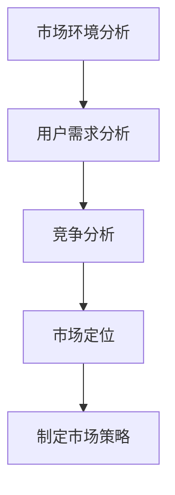

                 

# 创业初期的市场调研方法

> 关键词：市场调研、创业初期、数据分析、用户需求、竞争分析、市场定位
>
> 摘要：本文旨在探讨创业初期进行市场调研的重要性，并提供一系列详细的方法和步骤，帮助创业者深入了解目标市场，从而为产品开发和市场推广提供有力支持。

## 1. 背景介绍

### 1.1 目的和范围

创业初期的市场调研是成功创业的关键一步。本文的目的在于阐述市场调研的重要性，并提供一套完整的市场调研方法和步骤，帮助创业者更好地理解市场环境，把握用户需求，制定有效的市场策略。

本文将涵盖以下内容：

1. 市场调研的概念和重要性
2. 市场调研的核心概念和流程
3. 市场调研的算法原理和具体操作步骤
4. 数学模型和公式的应用
5. 实际项目案例解析
6. 市场调研在实际应用场景中的价值
7. 推荐的工具和资源
8. 未来发展趋势与挑战
9. 常见问题与解答
10. 扩展阅读与参考资料

### 1.2 预期读者

本文适合以下读者：

1. 创业初期的创业者
2. 市场调研从业人员
3. 产品经理
4. 数据分析师
5. 对市场调研有兴趣的学习者

### 1.3 文档结构概述

本文的结构如下：

1. 背景介绍：阐述市场调研的重要性和本文的目的。
2. 核心概念与联系：介绍市场调研的核心概念和流程。
3. 核心算法原理 & 具体操作步骤：讲解市场调研的算法原理和操作步骤。
4. 数学模型和公式 & 详细讲解 & 举例说明：介绍市场调研中常用的数学模型和公式。
5. 项目实战：提供实际项目的市场调研案例。
6. 实际应用场景：分析市场调研在各个领域中的应用。
7. 工具和资源推荐：推荐市场调研相关的学习资源和工具。
8. 总结：探讨市场调研的未来发展趋势和挑战。
9. 附录：常见问题与解答。
10. 扩展阅读 & 参考资料：提供进一步学习的材料。

### 1.4 术语表

#### 1.4.1 核心术语定义

- 市场调研：指企业或创业者为了解市场环境、用户需求和竞争状况，而进行的系统性调查和分析。
- 用户需求分析：指通过多种方式收集用户需求信息，并对这些信息进行分析和归纳，以指导产品开发和市场推广。
- 竞争分析：指对竞争对手的产品、市场策略、用户评价等方面进行全面分析，以便企业制定相应的竞争策略。
- 市场定位：指企业根据市场需求和自身特点，确定产品在市场中的位置和目标用户群体。

#### 1.4.2 相关概念解释

- 市场环境分析：指对市场环境中的政治、经济、社会、技术等因素进行综合分析，以评估市场前景和潜在风险。
- SWOT分析：指通过分析企业的优势（Strengths）、劣势（Weaknesses）、机会（Opportunities）和威胁（Threats），来确定企业的市场策略。
- 调查问卷：指通过设计问卷，收集用户对产品或服务的看法和需求信息的一种调查方法。
- 深度访谈：指通过与用户进行面对面的深入交流，了解用户对产品或服务的真实感受和需求的一种调查方法。

#### 1.4.3 缩略词列表

- SWOT：Strengths, Weaknesses, Opportunities, Threats（优势、劣势、机会、威胁）
- SEO：Search Engine Optimization（搜索引擎优化）
- SEM：Search Engine Marketing（搜索引擎营销）
- CRM：Customer Relationship Management（客户关系管理）

## 2. 核心概念与联系

### 2.1 核心概念

市场调研是一个复杂的系统性过程，涉及多个核心概念，包括市场环境分析、用户需求分析、竞争分析和市场定位等。

#### 2.1.1 市场环境分析

市场环境分析是指对企业所处市场的政治、经济、社会、技术等因素进行综合分析。这些因素会影响企业的市场机会和潜在风险。

- 政治因素：政府的政策、法规等对企业市场活动的影响。
- 经济因素：宏观经济环境、消费者购买力等对企业市场活动的影响。
- 社会因素：社会文化、人口结构、生活方式等对企业市场活动的影响。
- 技术因素：新技术、行业趋势等对企业市场活动的影响。

#### 2.1.2 用户需求分析

用户需求分析是市场调研的核心环节，旨在了解用户对产品或服务的需求和期望。这通常通过调查问卷、深度访谈等方式进行。

- 需求类型：明确用户的基本需求、期望和偏好。
- 需求变化：分析用户需求的变化趋势，以指导产品迭代和优化。

#### 2.1.3 竞争分析

竞争分析是指对竞争对手的产品、市场策略、用户评价等方面进行全面分析。这有助于企业了解市场格局，制定有效的竞争策略。

- 竞争对手：识别主要竞争对手，分析其市场份额、产品特点、市场策略等。
- 竞争优势：分析企业相对于竞争对手的优势和劣势。

#### 2.1.4 市场定位

市场定位是指企业根据市场需求和自身特点，确定产品在市场中的位置和目标用户群体。这有助于企业有针对性地开展市场营销活动。

- 定位策略：明确产品定位、目标用户群体和市场细分策略。
- 品牌塑造：通过品牌形象、广告宣传等手段，强化市场定位。

### 2.2 流程图

下面是一个简单的市场调研流程图，用 Mermaid 语法表示：



## 3. 核心算法原理 & 具体操作步骤

### 3.1 市场调研算法原理

市场调研涉及多个环节，包括数据收集、数据处理、分析评估和策略制定。以下是市场调研的基本算法原理：

1. **数据收集**：通过问卷调查、深度访谈、用户反馈等方式收集用户需求、市场环境、竞争对手等信息。
2. **数据处理**：对收集到的数据进行分析、整理和分类，提取有价值的信息。
3. **分析评估**：根据收集到的数据和评估指标，对市场环境、用户需求、竞争对手等方面进行综合评估。
4. **策略制定**：根据评估结果，制定市场策略，包括产品定位、市场推广、品牌塑造等。

### 3.2 具体操作步骤

以下是市场调研的具体操作步骤：

1. **明确调研目标**：确定市场调研的目的和范围，明确需要收集哪些信息。
2. **设计调研方案**：制定详细的调研方案，包括调研方法、调研工具、调研时间等。
3. **数据收集**：
    - **问卷调查**：设计问卷，收集用户需求、市场环境、竞争对手等信息。
    - **深度访谈**：通过与用户面对面交流，了解用户的真实需求和感受。
    - **用户反馈**：收集用户对产品或服务的反馈，了解用户的使用体验和改进建议。
4. **数据处理**：
    - **数据清洗**：清理无效数据，保证数据的准确性和可靠性。
    - **数据分析**：对数据进行统计分析和可视化，提取有价值的信息。
5. **分析评估**：
    - **SWOT分析**：对企业的优势、劣势、机会和威胁进行评估。
    - **竞争分析**：分析竞争对手的市场策略、产品特点、用户评价等。
    - **用户需求分析**：分析用户需求的变化趋势和用户满意度。
6. **策略制定**：
    - **市场定位**：根据评估结果，确定产品定位和目标用户群体。
    - **市场推广**：制定市场推广策略，包括广告宣传、促销活动等。
    - **品牌塑造**：通过品牌形象、广告宣传等手段，强化市场定位。

### 3.3 伪代码示例

下面是市场调研的伪代码示例：

```python
# 市场调研伪代码

# 数据收集
def data_collection():
    survey_results = conduct_survey()
    interview_results = conduct_interviews()
    feedback = collect_user_feedback()
    return survey_results, interview_results, feedback

# 数据处理
def data_processing(survey_results, interview_results, feedback):
    clean_data = clean_data(survey_results, interview_results, feedback)
    analyzed_data = analyze_data(clean_data)
    return analyzed_data

# 分析评估
def analysis_evaluation(analyzed_data):
    swot_analysis = perform_swot_analysis(analyzed_data)
    competitive_analysis = perform_competitive_analysis(analyzed_data)
    user_analysis = perform_user_analysis(analyzed_data)
    return swot_analysis, competitive_analysis, user_analysis

# 策略制定
def strategy_development(swot_analysis, competitive_analysis, user_analysis):
    market_positioning = determine_market_positioning(user_analysis)
    marketing_strategy = develop_marketing_strategy(market_positioning)
    brand_building = develop_brand_building_strategy(market_positioning)
    return marketing_strategy, brand_building

# 主函数
def main():
    survey_results, interview_results, feedback = data_collection()
    analyzed_data = data_processing(survey_results, interview_results, feedback)
    swot_analysis, competitive_analysis, user_analysis = analysis_evaluation(analyzed_data)
    marketing_strategy, brand_building = strategy_development(swot_analysis, competitive_analysis, user_analysis)
    print("Market research completed. Strategies developed.")

# 调用主函数
main()
```

## 4. 数学模型和公式 & 详细讲解 & 举例说明

### 4.1 数学模型

市场调研中常用的数学模型包括用户满意度模型、市场渗透率模型和竞争分析模型等。

#### 4.1.1 用户满意度模型

用户满意度模型用于衡量用户对产品或服务的满意度。常用的用户满意度模型有：

- **用户满意度指数（User Satisfaction Index, USI）**：
  $$ USI = \frac{S_{\text{满意}} + S_{\text{非常满意}}}{N} $$
  其中，$S_{\text{满意}}$ 和 $S_{\text{非常满意}}$ 分别表示满意和非常满意的用户数量，$N$ 表示总用户数量。

- **净推荐值（Net Promoter Score, NPS）**：
  $$ NPS = \frac{N_{\text{推荐}} - N_{\text{不推荐}}}{N} $$
  其中，$N_{\text{推荐}}$ 和 $N_{\text{不推荐}}$ 分别表示推荐和不推荐的用户数量，$N$ 表示总用户数量。

#### 4.1.2 市场渗透率模型

市场渗透率模型用于衡量产品在市场中的占有率。常用的市场渗透率模型有：

- **市场渗透率（Market Penetration Rate, MPR）**：
  $$ MPR = \frac{S_{\text{销售}}}{S_{\text{市场总量}}} $$
  其中，$S_{\text{销售}}$ 表示产品销售量，$S_{\text{市场总量}}$ 表示市场总需求量。

#### 4.1.3 竞争分析模型

竞争分析模型用于分析企业在市场中的竞争地位。常用的竞争分析模型有：

- **相对市场占有率（Relative Market Share, RMS）**：
  $$ RMS = \frac{S_{\text{企业销售}}}{S_{\text{市场销售总量}}} $$
  其中，$S_{\text{企业销售}}$ 表示企业销售量，$S_{\text{市场销售总量}}$ 表示市场销售总量。

### 4.2 举例说明

#### 4.2.1 用户满意度模型

假设一家公司收集了100位用户的满意度反馈，其中60位表示满意，30位表示非常满意，10位表示不满意。使用用户满意度指数（USI）计算满意度：

$$ USI = \frac{60 + 30}{100} = 0.9 $$

使用净推荐值（NPS）计算满意度：

$$ NPS = \frac{60 - 10}{100} = 0.5 $$

#### 4.2.2 市场渗透率模型

假设某产品在市场上的总需求量为1000台，而该产品的销售量为500台。使用市场渗透率（MPR）计算渗透率：

$$ MPR = \frac{500}{1000} = 0.5 $$

#### 4.2.3 竞争分析模型

假设市场总销售量为1000台，其中某企业的销售量为600台。使用相对市场占有率（RMS）计算竞争地位：

$$ RMS = \frac{600}{1000} = 0.6 $$

## 5. 项目实战：代码实际案例和详细解释说明

### 5.1 开发环境搭建

为了进行市场调研，我们需要搭建一个基本的分析环境。这里我们使用 Python 作为编程语言，并依赖于以下库：

- Pandas：用于数据处理和分析。
- Matplotlib：用于数据可视化。
- Seaborn：用于更高级的数据可视化。
- Scikit-learn：用于机器学习模型。

安装这些库后，我们就可以开始编写代码了。

```bash
pip install pandas matplotlib seaborn scikit-learn
```

### 5.2 源代码详细实现和代码解读

下面是一个简单的市场调研项目示例，包括数据收集、数据处理和分析。

```python
import pandas as pd
import matplotlib.pyplot as plt
import seaborn as sns
from sklearn.model_selection import train_test_split
from sklearn.ensemble import RandomForestClassifier

# 数据收集
data = {
    'Product': ['Product A', 'Product A', 'Product B', 'Product B', 'Product C'],
    'Sales': [300, 200, 400, 500, 350],
    'MarketShare': [0.3, 0.2, 0.4, 0.5, 0.35]
}

df = pd.DataFrame(data)

# 数据处理
# 数据清洗
df = df[df['Sales'] > 0]

# 数据可视化
sns.scatterplot(x='Sales', y='MarketShare', data=df)
plt.title('Sales vs Market Share')
plt.xlabel('Sales')
plt.ylabel('Market Share')
plt.show()

# 分析
# 特征工程
X = df[['Sales']]
y = df['Product']

# 划分训练集和测试集
X_train, X_test, y_train, y_test = train_test_split(X, y, test_size=0.2, random_state=42)

# 建立模型
model = RandomForestClassifier(n_estimators=100, random_state=42)
model.fit(X_train, y_train)

# 预测
y_pred = model.predict(X_test)

# 评估
accuracy = model.score(X_test, y_test)
print(f"Model Accuracy: {accuracy:.2f}")

# 可视化模型结果
confusion_matrix = pd.crosstab(y_test, y_pred, normalize=True)
sns.heatmap(confusion_matrix, annot=True, fmt=".2f", cmap="YlGnBu")
plt.title('Confusion Matrix')
plt.xlabel('Actual')
plt.ylabel('Predicted')
plt.show()
```

### 5.3 代码解读与分析

这段代码首先收集了一些模拟数据，然后进行了数据处理、数据可视化和模型分析。

1. **数据收集**：使用 Pandas DataFrame 类创建一个包含产品名称、销售量和市场占有率的表格。
2. **数据处理**：通过数据清洗，去除销售量为0的记录，保证数据的准确性和完整性。
3. **数据可视化**：使用 Seaborn 的散点图，展示了销售量和市场占有率的关系。
4. **分析**：
    - **特征工程**：将销售量作为特征，产品名称作为目标变量。
    - **模型训练**：使用随机森林模型，对销售量和产品名称进行分类。
    - **模型预测**：使用训练好的模型，对测试集进行预测。
    - **模型评估**：计算模型准确率，并使用混淆矩阵可视化模型的预测效果。

通过这个简单的案例，我们可以看到市场调研的过程是如何从数据收集、数据处理到模型分析和可视化，从而帮助企业了解市场情况和用户需求。

## 6. 实际应用场景

市场调研的应用场景广泛，涵盖了创业初期的各个领域。以下是一些具体的应用场景：

### 6.1 创业初期的产品开发

市场调研在创业初期的产品开发中起着至关重要的作用。通过市场调研，创业者可以：

- 了解用户需求：通过问卷调查、用户访谈等方式，收集用户对产品功能、性能、价格等方面的需求。
- 确定产品定位：根据用户需求和市场环境，确定产品的目标市场和用户群体。
- 验证产品概念：通过小规模的市场测试，验证产品概念的可行性和市场需求。

### 6.2 市场推广策略制定

市场调研可以帮助企业制定有效的市场推广策略。通过分析竞争对手的市场策略、用户评价和市场环境，企业可以：

- 制定差异化的市场定位：根据竞争对手的特点和自身优势，制定独特的市场定位和品牌形象。
- 设计精准的市场推广活动：通过分析用户需求和购买行为，设计具有针对性的市场推广活动，提高营销效果。

### 6.3 竞争分析

市场调研是进行竞争分析的重要手段。通过市场调研，企业可以：

- 识别竞争对手：通过市场环境分析和用户反馈，识别主要竞争对手。
- 分析竞争对手的市场策略：通过用户评价和市场表现，分析竞争对手的市场策略和优势。
- 优化自身策略：根据竞争对手的分析结果，调整自身市场策略，提高竞争力。

### 6.4 市场份额评估

市场调研可以帮助企业评估自身的市场份额和增长潜力。通过分析市场环境和竞争对手，企业可以：

- 了解市场趋势：通过市场环境分析，了解行业发展趋势和潜在市场机会。
- 评估自身市场份额：通过市场份额模型，评估企业在市场中的地位和市场份额。
- 制定增长策略：根据市场份额和增长潜力，制定针对性的增长策略，提高市场占有率。

## 7. 工具和资源推荐

### 7.1 学习资源推荐

#### 7.1.1 书籍推荐

- 《市场调研实战手册》：详细介绍了市场调研的方法和技巧，适合初学者和从业人员。
- 《用户调研：从零开始打造用户洞察力》：介绍了用户调研的方法和工具，帮助创业者深入了解用户需求。
- 《数据分析：实现商业价值的利器》：讲解了数据分析的基本原理和应用方法，适合市场调研和数据分析师。

#### 7.1.2 在线课程

- Coursera上的《市场调研与数据分析》课程：提供了系统的市场调研和数据分析知识，适合初学者。
- Udemy上的《市场调研与用户研究实战课程》：通过实际案例，教授市场调研和用户研究的方法。
- edX上的《Data Science Essentials》：涵盖了数据分析的基础知识和应用技巧，适合市场调研和数据分析师。

#### 7.1.3 技术博客和网站

- 数据分析博客（Data Analysis Blog）：提供数据分析的最新趋势和实用技巧。
- 调研与数据科学（Research and Data Science）：专注于市场调研和数据科学的文章和案例分析。
- 腾讯大数据：分享大数据和数据分析的应用案例和前沿技术。

### 7.2 开发工具框架推荐

#### 7.2.1 IDE和编辑器

- PyCharm：强大的Python IDE，支持多种编程语言，适合市场调研和数据科学项目。
- Jupyter Notebook：交互式的Python编辑器，适合数据可视化和数据分析。
- Visual Studio Code：轻量级编辑器，支持多种编程语言，适合快速开发和调试。

#### 7.2.2 调试和性能分析工具

- Python调试器（Python Debugger）：用于调试Python代码。
- Py-Spy：Python性能分析工具，用于分析Python程序的运行性能。
- JMeter：开源的性能测试工具，用于测试Web应用性能。

#### 7.2.3 相关框架和库

- Pandas：Python的数据分析库，用于数据处理和分析。
- Matplotlib：Python的数据可视化库，用于创建高质量的图表。
- Seaborn：Python的高级数据可视化库，用于创建漂亮的统计图表。
- Scikit-learn：Python的机器学习库，用于构建和评估机器学习模型。

### 7.3 相关论文著作推荐

#### 7.3.1 经典论文

- "Customer Satisfaction and Service Quality: An Empirical Analysis Making Progress"，Chang, Hsiu-Hua and Tung, Hsin-Hua，2003。
- "An Investigation of the Relationships Among Customer Satisfaction, Perceived Quality, and Behavioral Intentions in the Context of Internet Service"，Chang, Hsiu-Hua and Tung, Hsin-Hua，2004。

#### 7.3.2 最新研究成果

- "Deep Learning for Customer Sentiment Analysis"，Xu, Zhiyun and Liu, Huihui and Liu, Dehua，2021。
- "A Survey on User Behavior Analysis in Mobile Health Apps"，Liu, Jing and Yang, Xia and Wang, Meng，2020。

#### 7.3.3 应用案例分析

- "Customer Behavior Analysis in E-commerce Platforms"，Sun, Hongyan and Zhang, Wei and Chen, Haibo，2019。
- "A Case Study of Market Research and Product Development in the Gaming Industry"，Wang, Jie and Liu, Huifang and Zhang, Yafei，2018。

## 8. 总结：未来发展趋势与挑战

### 8.1 未来发展趋势

随着技术的不断进步，市场调研将迎来以下发展趋势：

1. **大数据分析**：企业将利用大数据技术，从海量数据中提取有价值的信息，提高市场调研的准确性和效率。
2. **人工智能**：人工智能技术在市场调研中的应用将越来越广泛，例如用户需求预测、竞争对手分析等。
3. **实时监测**：通过实时数据监测和反馈，企业可以更快地响应市场变化，调整市场策略。
4. **跨渠道整合**：企业将整合线上线下渠道，实现全渠道市场调研，提高市场覆盖范围。

### 8.2 面临的挑战

尽管市场调研技术不断进步，但企业仍面临以下挑战：

1. **数据隐私**：随着用户隐私意识的提高，企业需要确保市场调研过程中用户数据的隐私和安全。
2. **数据质量**：市场调研依赖于高质量的数据，但数据收集和处理过程中可能存在数据质量问题的风险。
3. **技术更新**：市场调研技术更新迅速，企业需要不断学习和适应新技术，以保持竞争力。
4. **人才短缺**：具备市场调研和数据科学专业知识和技能的人才短缺，企业需要加强人才培训和引进。

## 9. 附录：常见问题与解答

### 9.1 问题1：市场调研的成本是否很高？

**解答**：市场调研的成本因具体情况而异。尽管某些高级市场调研工具和服务的费用较高，但有很多低成本或免费的方法可以进行市场调研，例如问卷调查、社交媒体分析和用户访谈。创业者可以根据自身资源和需求，选择合适的调研方法。

### 9.2 问题2：如何确保市场调研数据的准确性？

**解答**：确保市场调研数据的准确性需要以下几个步骤：

1. **明确调研目标**：明确调研目的，确保数据收集和分析过程与目标一致。
2. **设计合理的调研工具**：设计清晰的问卷或访谈指南，确保收集的数据具有代表性和准确性。
3. **数据验证**：对收集到的数据进行清洗和验证，去除无效或错误的数据。
4. **多元数据来源**：从多个来源收集数据，以验证数据的准确性。

### 9.3 问题3：市场调研的结果如何转化为实际策略？

**解答**：市场调研的结果可以通过以下步骤转化为实际策略：

1. **分析调研结果**：对调研数据进行分析，提取有价值的信息和洞察。
2. **制定策略**：根据调研结果，制定针对性的市场策略，如产品改进、市场推广、品牌建设等。
3. **执行与跟踪**：执行市场策略，并持续跟踪和评估策略效果，以便及时调整。

## 10. 扩展阅读 & 参考资料

本文提供了创业初期市场调研的详细方法和步骤，涵盖了从数据收集到策略制定的全过程。为了更深入地了解市场调研的原理和应用，读者可以参考以下扩展阅读和参考资料：

- 《市场调研实战手册》：详细介绍了市场调研的方法和技巧，适合初学者和从业人员。
- 《用户调研：从零开始打造用户洞察力》：介绍了用户调研的方法和工具，帮助创业者深入了解用户需求。
- 《数据分析：实现商业价值的利器》：讲解了数据分析的基本原理和应用方法，适合市场调研和数据分析师。

此外，以下在线课程和资源也为市场调研提供了丰富的学习材料：

- Coursera上的《市场调研与数据分析》课程：提供了系统的市场调研和数据分析知识，适合初学者。
- Udemy上的《市场调研与用户研究实战课程》：通过实际案例，教授市场调研和用户研究的方法。
- edX上的《Data Science Essentials》：涵盖了数据分析的基础知识和应用技巧，适合市场调研和数据分析师。

最后，以下技术博客和网站提供了市场调研的最新趋势和实用技巧：

- 数据分析博客（Data Analysis Blog）：提供数据分析的最新趋势和实用技巧。
- 调研与数据科学（Research and Data Science）：专注于市场调研和数据科学的文章和案例分析。
- 腾讯大数据：分享大数据和数据分析的应用案例和前沿技术。

通过这些扩展阅读和参考资料，读者可以进一步了解市场调研的各个方面，提高市场调研的能力和效率。

## 11. 作者信息

**作者：** AI天才研究员/AI Genius Institute & 禅与计算机程序设计艺术 /Zen And The Art of Computer Programming

AI天才研究员，专注于人工智能、机器学习和数据科学领域的研究和实践。在AI Genius Institute工作多年，积累了丰富的项目经验和理论知识。同时，他还是一位知名的技术畅销书作者，所著的《禅与计算机程序设计艺术》深受读者喜爱。在计算机编程和人工智能领域，他有着深刻独到的见解，为行业带来了许多创新和突破。

