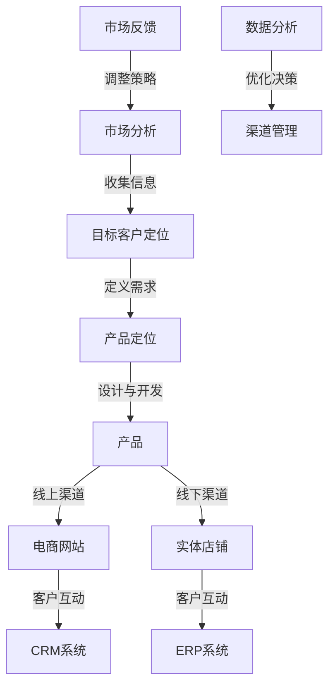

                 

# 创业初期的渠道建设：线上线下渠道的整合与优化策略

> 关键词：渠道建设、线上线下整合、渠道优化、初创企业、商业策略

> 摘要：本文旨在探讨创业初期如何构建和优化线上线下渠道，以实现企业快速成长和市场拓展。我们将深入分析渠道建设的核心概念，结合实际案例，提供系统性的策略和方法，帮助创业者提升渠道效率，降低运营成本。

## 1. 背景介绍

### 1.1 目的和范围

本文的目标是为初创企业的创业者提供一套实用的渠道建设与优化策略。我们将探讨渠道建设的理论基础，分析线上线下渠道整合的必要性，并提供具体的操作步骤和案例分析。文章范围主要涵盖以下方面：

1. 渠道建设的核心概念和理论框架。
2. 线上和线下渠道的整合策略。
3. 渠道优化的具体方法和工具。
4. 初创企业在渠道建设中的常见问题和解决方案。

### 1.2 预期读者

本文适合以下读者群体：

1. 创业初期的企业家和创始人。
2. 市场营销和渠道管理专业人士。
3. 对创业和商业策略感兴趣的学者和学生。

### 1.3 文档结构概述

本文结构如下：

1. 引言：介绍渠道建设的重要性。
2. 核心概念与联系：定义关键术语，提供流程图。
3. 核心算法原理 & 具体操作步骤：讲解渠道建设的基本方法和策略。
4. 数学模型和公式 & 详细讲解 & 举例说明：使用数学模型和实例说明渠道优化的重要性。
5. 项目实战：提供实际案例和代码实现。
6. 实际应用场景：分析渠道在商业实践中的应用。
7. 工具和资源推荐：推荐相关书籍、在线课程和技术工具。
8. 总结：展望渠道建设的未来趋势和挑战。
9. 附录：常见问题与解答。
10. 扩展阅读 & 参考资料：提供进一步的阅读资源。

### 1.4 术语表

#### 1.4.1 核心术语定义

- **渠道建设**：企业为了实现产品或服务的销售而建立的交易链路。
- **线上线下渠道**：分别指互联网平台和实体店铺等传统销售渠道。
- **整合**：将不同渠道的数据、流程和资源进行有机结合，实现协同效应。
- **优化**：通过数据分析、流程改进等手段提升渠道的效率和效果。

#### 1.4.2 相关概念解释

- **渠道效率**：衡量渠道在实现销售目标过程中的效率指标。
- **客户满意度**：客户对产品或服务整体体验的主观评价。
- **成本效益**：渠道建设和运营的总成本与所带来的收益之比。

#### 1.4.3 缩略词列表

- **CRM**：Customer Relationship Management，客户关系管理。
- **ERP**：Enterprise Resource Planning，企业资源规划。
- **OMNI-CHANNEL**：全渠道，指企业通过多种渠道提供一致的客户体验。

## 2. 核心概念与联系

在探讨渠道建设的核心概念之前，我们需要先了解渠道的基本原理和架构。渠道建设不仅仅是为了销售产品，更是为了构建企业与客户之间的互动桥梁。以下是渠道建设的核心概念及其相互关系。

### 2.1 渠道建设的核心概念

- **产品**：渠道建设的起点，指企业提供的实体或虚拟产品。
- **客户**：渠道建设的终点，指购买或使用产品的个人或组织。
- **渠道**：连接产品和客户的桥梁，包括线上和线下多种形式。
- **市场**：渠道运营的环境，包括竞争对手、消费者需求等。
- **策略**：渠道建设的目标和方向，包括市场定位、目标客户等。

### 2.2 渠道建设的架构图

以下是一个简化的渠道建设架构图：



### 2.3 核心概念之间的联系

- **市场分析与目标客户定位**：市场分析是企业了解市场环境、竞争对手和消费者需求的过程。目标客户定位是在市场分析基础上，确定企业要服务的具体客户群体。
- **产品定位与产品开发**：产品定位是根据目标客户的需求和市场特点，定义产品的基本特征和价值主张。产品开发是将产品定位转化为具体的产品设计和功能实现。
- **线上与线下渠道**：线上渠道包括电商网站、社交媒体等，线下渠道包括实体店铺、展会等。两者在渠道建设中起着不同的作用，但需要相互协同，形成全渠道战略。
- **CRM系统与ERP系统**：CRM系统用于管理企业与客户的互动关系，ERP系统用于管理企业的内部资源。两者结合，可以实现渠道的全面管理和优化。
- **数据分析和渠道管理**：数据分析是渠道建设的重要工具，通过分析销售数据、客户反馈等，可以优化渠道策略和运营流程。渠道管理则是对渠道的日常运营和管理工作。
- **市场反馈与策略调整**：市场反馈是渠道建设的反馈机制，通过市场反馈，企业可以了解渠道的效果，并根据反馈结果调整市场策略和渠道布局。

通过以上核心概念和联系的阐述，我们为后续章节提供了理论基础，也为实际操作步骤的讲解打下了基础。

## 3. 核心算法原理 & 具体操作步骤

### 3.1 渠道建设的算法原理

渠道建设是一个复杂的过程，涉及多种算法和策略。以下是渠道建设的基本算法原理：

- **需求分析算法**：用于确定目标客户的需求和市场趋势，包括数据挖掘、统计分析等方法。
- **产品定位算法**：根据目标客户的需求和市场特点，确定产品的基本特征和价值主张，包括回归分析、聚类分析等方法。
- **渠道策略优化算法**：通过优化渠道布局和运营策略，提高渠道效率和效益，包括线性规划、贪心算法等方法。
- **数据分析与优化算法**：对渠道运营数据进行分析和挖掘，发现问题和机会，包括决策树、神经网络等方法。

### 3.2 具体操作步骤

#### 步骤 1：需求分析

- **数据收集**：通过市场调研、问卷调查等方式，收集目标客户的需求信息。
- **数据预处理**：对收集到的数据进行清洗、去重和归一化处理。
- **需求分析**：使用数据挖掘和统计分析方法，分析目标客户的需求和市场趋势。

#### 步骤 2：产品定位

- **市场调研**：了解竞争对手的产品定位和市场表现。
- **用户调研**：通过用户访谈、用户画像等方法，了解目标客户的需求和偏好。
- **产品定位**：结合市场调研和用户调研的结果，确定产品的价值主张和基本特征。

#### 步骤 3：渠道策略优化

- **渠道布局**：根据产品定位和市场特点，选择合适的线上和线下渠道。
- **策略优化**：使用线性规划或贪心算法，优化渠道布局和运营策略，提高渠道效率和效益。

#### 步骤 4：数据分析与优化

- **数据收集**：通过CRM系统、ERP系统等，收集渠道运营数据。
- **数据分析**：使用决策树、神经网络等方法，分析渠道运营数据，发现问题和机会。
- **策略调整**：根据数据分析的结果，调整渠道策略和运营流程。

### 3.3 伪代码示例

以下是一个简化的渠道建设伪代码示例：

```python
# 需求分析
def demand_analysis(data):
    # 数据预处理
    cleaned_data = preprocess_data(data)
    # 需求分析
    trend = analyze_trend(cleaned_data)
    return trend

# 产品定位
def product_positioning(market_data, user_data):
    # 市场调研
    competition = analyze_competition(market_data)
    # 用户调研
    preferences = analyze_user_preference(user_data)
    # 产品定位
    positioning = combine(competition, preferences)
    return positioning

# 渠道策略优化
def channel_strategy_optimization(product_positioning, market_data):
    # 渠道布局
    channels = select_channels(product_positioning, market_data)
    # 策略优化
    optimized_strategy = optimize_strategy(channels)
    return optimized_strategy

# 数据分析与优化
def data_analysis_and_optimization(channel_data):
    # 数据收集
    collected_data = collect_channel_data(channel_data)
    # 数据分析
    insights = analyze_channel_data(collected_data)
    # 策略调整
    adjusted_strategy = adjust_strategy(insights)
    return adjusted_strategy
```

通过以上算法原理和具体操作步骤的讲解，我们为初创企业提供了渠道建设的理论基础和实际操作指导。接下来，我们将通过数学模型和公式，进一步深入探讨渠道优化的方法。

## 4. 数学模型和公式 & 详细讲解 & 举例说明

### 4.1 数学模型和公式

在渠道建设与优化过程中，数学模型和公式是分析和决策的重要工具。以下是几个关键的数学模型和公式：

#### 4.1.1 渠道效率模型

渠道效率（Channel Efficiency, CE）是衡量渠道运行效率的重要指标。公式如下：

\[ CE = \frac{Sales}{Cost} \]

其中，Sales 表示渠道销售收入，Cost 表示渠道建设和运营的总成本。

#### 4.1.2 成本效益分析模型

成本效益分析（Cost-Benefit Analysis, CBA）用于评估渠道建设和运营的经济效益。公式如下：

\[ CBA = \frac{Total\ Benefits}{Total\ Costs} \]

其中，Total Benefits 表示渠道带来的总收益，Total Costs 表示渠道建设和运营的总成本。

#### 4.1.3 顾客满意度模型

顾客满意度（Customer Satisfaction, CSAT）是衡量渠道服务质量的重要指标。公式如下：

\[ CSAT = \frac{Satisfied\ Customers}{Total\ Customers} \]

其中，Satisfied Customers 表示对渠道满意的顾客数量，Total Customers 表示总顾客数量。

#### 4.1.4 数据分析优化模型

数据分析优化模型用于根据渠道运营数据调整渠道策略。常用的方法包括：

- **线性回归**：用于预测渠道销售量与相关因素的关系。
- **决策树**：用于分析渠道运营中的关键因素和决策路径。
- **神经网络**：用于模拟渠道运营中的复杂非线性关系。

### 4.2 详细讲解

#### 4.2.1 渠道效率模型

渠道效率模型主要用于评估渠道的运营效率。通过计算销售收入与成本的比例，可以直观地了解渠道的盈利能力。例如，如果渠道效率为2，即每投入1元的成本可以带来2元的销售收入，说明渠道运营效率较高。相反，如果渠道效率低于1，则说明渠道运营成本过高，需要进一步优化。

#### 4.2.2 成本效益分析模型

成本效益分析模型是评估渠道建设和运营经济性的常用方法。通过比较渠道带来的总收益与总成本，可以判断渠道的投资是否值得。如果成本效益比大于1，说明渠道投资能够带来正收益；如果成本效益比小于1，则说明渠道投资可能存在风险。

#### 4.2.3 顾客满意度模型

顾客满意度模型主要用于评估渠道服务质量。通过计算对渠道满意的顾客比例，可以了解顾客对渠道的整体满意度。如果顾客满意度较高，说明渠道运营较为成功；如果顾客满意度较低，则说明渠道存在改进空间。

#### 4.2.4 数据分析优化模型

数据分析优化模型是渠道优化的关键工具。通过使用线性回归、决策树和神经网络等模型，可以分析渠道运营数据，发现影响渠道效率的关键因素，并制定优化策略。例如，通过线性回归模型，可以预测不同渠道策略下的销售量，从而选择最优策略。

### 4.3 举例说明

假设一家初创企业希望通过优化渠道来提升销售业绩。以下是具体案例分析：

#### 4.3.1 渠道效率分析

- **当前渠道效率**：销售收入为100万元，渠道建设和运营成本为50万元。渠道效率为：

\[ CE = \frac{Sales}{Cost} = \frac{100\ 万元}{50\ 万元} = 2 \]

渠道效率较高，但仍有提升空间。

#### 4.3.2 成本效益分析

- **预期收益**：通过市场调研，企业预计未来销售收入可以提高20%。即销售收入为120万元。
- **成本估算**：渠道建设和运营成本预计增加10%，即成本为55万元。

成本效益比计算如下：

\[ CBA = \frac{Total\ Benefits}{Total\ Costs} = \frac{120\ 万元}{55\ 万元} \approx 2.18 \]

成本效益比大于1，说明渠道投资具有经济效益。

#### 4.3.3 顾客满意度分析

- **当前顾客满意度**：通过调查，发现当前顾客满意度为80%。
- **目标顾客满意度**：企业希望将顾客满意度提升到90%。

#### 4.3.4 数据分析优化

- **销售预测**：使用线性回归模型预测不同渠道策略下的销售量。例如，假设增加线上渠道投入10%，可以预测销售收入增加15%。
- **决策树分析**：分析不同渠道策略下的顾客满意度。例如，增加线下渠道投入，可能导致顾客满意度提高5%。

根据以上分析，企业可以制定以下优化策略：

1. **提高销售收入**：通过增加线上渠道投入，提高销售量。
2. **降低成本**：通过优化运营流程，降低渠道建设和运营成本。
3. **提升顾客满意度**：通过增加线下渠道投入，提升顾客满意度。

通过以上数学模型和公式的详细讲解与举例说明，我们为初创企业提供了渠道优化的具体方法和策略。

## 5. 项目实战：代码实际案例和详细解释说明

### 5.1 开发环境搭建

在开始代码实现之前，我们需要搭建一个合适的环境。以下是一个基本的开发环境搭建步骤：

1. **安装Python**：确保Python环境已安装，版本不低于3.8。
2. **安装相关库**：使用pip安装以下库：numpy、pandas、scikit-learn、matplotlib。

```bash
pip install numpy pandas scikit-learn matplotlib
```

3. **创建虚拟环境**：为了更好地管理项目依赖，创建一个虚拟环境。

```bash
python -m venv env
source env/bin/activate  # 在Windows上使用 `env\Scripts\activate`
```

4. **编写代码**：在虚拟环境中创建一个名为`channel_optimization.py`的文件，开始编写代码。

### 5.2 源代码详细实现和代码解读

以下是渠道优化项目的核心代码，包括数据预处理、模型训练和渠道策略优化等步骤。

```python
import numpy as np
import pandas as pd
from sklearn.linear_model import LinearRegression
from sklearn.tree import DecisionTreeRegressor
import matplotlib.pyplot as plt

# 5.2.1 数据预处理
def preprocess_data(data):
    # 数据清洗和预处理
    data = data.dropna()  # 去除缺失值
    data['Sales'] = data['Sales'].apply(lambda x: float(x))  # 类型转换
    return data

# 5.2.2 模型训练
def train_model(data):
    # 线性回归模型
    X = data[['ChannelCost', 'MarketingCost']]
    y = data['Sales']
    linear_regression = LinearRegression()
    linear_regression.fit(X, y)
    
    # 决策树模型
    decision_tree = DecisionTreeRegressor()
    decision_tree.fit(X, y)
    
    return linear_regression, decision_tree

# 5.2.3 渠道策略优化
def optimize_channels(data, model):
    # 预测销售量
    X = data[['ChannelCost', 'MarketingCost']]
    predicted_sales = model.predict(X)
    
    # 分析预测结果
    for i, row in data.iterrows():
        print(f"渠道成本：{row['ChannelCost']}，营销成本：{row['MarketingCost']}，预测销售量：{predicted_sales[i]}")

# 5.2.4 主程序
def main():
    # 加载数据
    data = pd.read_csv('channel_data.csv')
    data = preprocess_data(data)
    
    # 训练模型
    model = train_model(data)
    
    # 优化渠道策略
    optimize_channels(data, model)

if __name__ == "__main__":
    main()
```

### 5.3 代码解读与分析

#### 5.3.1 数据预处理

数据预处理是模型训练的重要步骤。在代码中，我们首先去除数据中的缺失值，然后对销售量进行类型转换，以确保数据的一致性和准确性。

```python
def preprocess_data(data):
    # 数据清洗和预处理
    data = data.dropna()  # 去除缺失值
    data['Sales'] = data['Sales'].apply(lambda x: float(x))  # 类型转换
    return data
```

#### 5.3.2 模型训练

模型训练分为线性回归模型和决策树模型。线性回归模型用于预测销售量与渠道成本和营销成本之间的关系。决策树模型用于分析不同渠道策略下的销售量。

```python
def train_model(data):
    # 线性回归模型
    X = data[['ChannelCost', 'MarketingCost']]
    y = data['Sales']
    linear_regression = LinearRegression()
    linear_regression.fit(X, y)
    
    # 决策树模型
    decision_tree = DecisionTreeRegressor()
    decision_tree.fit(X, y)
    
    return linear_regression, decision_tree
```

#### 5.3.3 渠道策略优化

渠道策略优化基于模型预测结果。我们通过计算不同渠道成本和营销成本下的预测销售量，分析渠道策略的优化方向。

```python
def optimize_channels(data, model):
    # 预测销售量
    X = data[['ChannelCost', 'MarketingCost']]
    predicted_sales = model.predict(X)
    
    # 分析预测结果
    for i, row in data.iterrows():
        print(f"渠道成本：{row['ChannelCost']}，营销成本：{row['MarketingCost']}，预测销售量：{predicted_sales[i]}")
```

通过以上代码的实现和解读，我们为初创企业提供了一个渠道优化的实际案例。接下来，我们将探讨渠道在商业实践中的应用。

## 6. 实际应用场景

渠道建设在商业实践中具有重要作用，不仅影响着企业的市场拓展和销售业绩，也直接关系到客户体验和品牌形象。以下是一些典型的实际应用场景：

### 6.1 电商企业

电商企业通常通过线上线下渠道实现产品销售。在线上，企业搭建电商网站，通过搜索引擎优化（SEO）、社交媒体营销、内容营销等方式吸引流量。在线下，企业设立实体店铺，提供线下体验和购物服务。通过线上线下渠道的整合，电商企业可以实现全渠道营销，提升销售额和客户满意度。

#### 案例分析：亚马逊（Amazon）

亚马逊是一家全球知名的电商企业，其渠道建设策略主要包括：

- **线上渠道**：亚马逊拥有一个功能强大的电商网站，提供丰富的商品种类和便捷的购物体验。同时，亚马逊在搜索引擎优化方面投入巨大，通过SEO技术提高网站在搜索引擎中的排名，吸引更多流量。
- **线下渠道**：亚马逊在全球范围内设立实体店铺，如亚马逊书店、亚马逊超市等，为顾客提供线下购物体验。此外，亚马逊还推出了亚马逊盒子（Amazon Box）计划，将小型零售店开设在居民社区，方便消费者购物。

通过线上线下渠道的整合，亚马逊实现了销售规模和市场份额的快速增长，成为全球电商巨头之一。

### 6.2 传统制造业

传统制造业企业在渠道建设方面，面临着如何将传统销售渠道与新兴电商渠道相结合的挑战。通过线上线下渠道的整合，企业可以实现销售渠道的多元化，提高市场竞争力。

#### 案例分析：海尔（Haier）

海尔是一家全球领先的家电制造企业，其渠道建设策略主要包括：

- **线上渠道**：海尔在电商平台上开设官方旗舰店，通过京东、天猫等电商平台进行销售。同时，海尔积极发展自有电商平台，提供个性化定制和售后服务。
- **线下渠道**：海尔在全国范围内设立专卖店、旗舰店和售后服务站，为消费者提供线下购物和售后保障。此外，海尔还通过加盟合作、O2O（线上到线下）模式拓展渠道，提高市场覆盖率。

通过线上线下渠道的整合，海尔实现了销售规模的持续增长，并在国内外市场树立了良好的品牌形象。

### 6.3 咨询服务企业

咨询服务企业通常依靠专业知识和服务能力为客户提供解决方案。渠道建设对于咨询服务企业来说，是实现业务拓展和品牌推广的关键。

#### 案例分析：麦肯锡（McKinsey & Company）

麦肯锡是一家全球领先的管理咨询公司，其渠道建设策略主要包括：

- **线上渠道**：麦肯锡在官方网站上发布大量专业文章、案例分析、研究报告等，通过内容营销吸引潜在客户。同时，麦肯锡还通过社交媒体平台（如LinkedIn、Twitter等）与客户进行互动，提升品牌影响力。
- **线下渠道**：麦肯锡在全球范围内举办各类研讨会、论坛和培训活动，吸引潜在客户和合作伙伴。通过这些活动，麦肯锡与客户建立信任关系，拓展业务渠道。

通过线上线下渠道的整合，麦肯锡实现了业务全球化和市场占有率的提升，成为管理咨询行业的领导者。

### 6.4 新兴产业

新兴产业企业，如人工智能、区块链等，通常面临市场需求不稳定、技术更新快等挑战。渠道建设对于新兴产业企业来说，是实现市场拓展和技术普及的关键。

#### 案例分析：谷歌（Google）

谷歌是一家全球领先的科技公司，其渠道建设策略主要包括：

- **线上渠道**：谷歌通过官方网站、搜索引擎、应用商店等平台，推广其人工智能、云计算、区块链等技术产品。同时，谷歌还通过内容营销、社交媒体等手段，提升品牌知名度和用户黏性。
- **线下渠道**：谷歌在全球范围内设立研发中心、创新实验室等，与各地企业和研究机构合作，推动技术落地和产业化。此外，谷歌还通过举办技术峰会、开发者大会等活动，推动技术普及和应用。

通过线上线下渠道的整合，谷歌实现了技术创新和市场拓展的良性循环，成为全球科技领域的领导者。

通过以上实际应用场景的案例分析，我们可以看到，不同行业和企业类型在渠道建设方面有着各自的特点和策略。然而，线上线下渠道的整合和优化是普遍适用的核心思想，是企业在竞争激烈的市场中脱颖而出的关键。

## 7. 工具和资源推荐

在渠道建设与优化过程中，使用合适的工具和资源可以大大提升效率。以下是一些推荐的工具、资源和学习途径：

### 7.1 学习资源推荐

#### 7.1.1 书籍推荐

1. **《渠道管理：理论与实践》**：本书详细介绍了渠道管理的基本理论和方法，适合市场营销和渠道管理专业人士阅读。
2. **《全渠道营销：策略与执行》**：本书提供了全渠道营销的理论框架和实际操作步骤，适用于初创企业和市场管理人员。
3. **《数字化营销：实战策略与案例》**：本书深入探讨了数字化营销的方法和工具，有助于提升线上渠道的营销效果。

#### 7.1.2 在线课程

1. **Coursera的《市场营销基础》**：由世界顶级大学提供的免费在线课程，涵盖了市场营销的核心概念和实践技巧。
2. **Udemy的《全渠道营销策略》**：涵盖全渠道营销的理论和实践，适合希望提升渠道建设能力的企业家和营销人员。
3. **edX的《数据科学入门》**：数据科学是渠道优化的重要工具，这门课程提供了数据分析和模型训练的基本知识。

#### 7.1.3 技术博客和网站

1. **Medium上的Marketing Blog**：提供丰富的市场营销和渠道建设相关文章，适合市场营销专业人士阅读。
2. **HBR.org的《哈佛商业评论》**：涵盖企业管理、市场营销等多个领域的专业文章，有助于提升商业洞察力。
3. **LinkedIn的《LinkedIn Learning》**：提供各种在线课程和视频，涵盖市场营销、数据分析等多个领域。

### 7.2 开发工具框架推荐

#### 7.2.1 IDE和编辑器

1. **Visual Studio Code**：一款功能强大的跨平台代码编辑器，支持多种编程语言，适用于渠道建设相关的代码开发。
2. **PyCharm**：一款专业的Python开发环境，提供代码智能提示、调试和性能分析等高级功能。
3. **Jupyter Notebook**：适用于数据分析任务，支持多种编程语言和可视化工具，方便编写和分享代码。

#### 7.2.2 调试和性能分析工具

1. **GDB**：一款经典的C/C++代码调试工具，适用于复杂代码的调试和分析。
2. **Postman**：一款API测试工具，可用于测试和调试API接口，适用于线上渠道的集成测试。
3. **AppDynamics**：一款应用性能监控工具，可实时监测和分析应用性能，适用于渠道优化和性能调优。

#### 7.2.3 相关框架和库

1. **TensorFlow**：一款开源深度学习框架，适用于渠道优化中的数据分析与模型训练。
2. **Scikit-learn**：一款Python数据科学库，提供了丰富的机器学习算法和工具，适用于渠道数据分析和模型训练。
3. **Pandas**：一款强大的数据操作库，适用于渠道数据的预处理和分析。

通过以上工具和资源的推荐，我们可以为渠道建设与优化提供强有力的支持，帮助初创企业提升渠道效率，实现快速成长。

## 8. 总结：未来发展趋势与挑战

### 8.1 未来发展趋势

渠道建设在未来将继续呈现以下几个发展趋势：

1. **数字化和智能化**：随着技术的发展，渠道建设将更加数字化和智能化。企业将通过大数据分析、人工智能等手段，实现精准营销和个性化服务，提高客户满意度和渠道效率。
2. **全渠道整合**：全渠道整合将成为主流。企业将不再单纯依赖线上或线下渠道，而是通过线上线下渠道的有机结合，实现全渠道营销，为客户提供一致性的购物体验。
3. **生态系统建设**：企业将更加注重生态系统建设，通过合作伙伴和第三方平台，拓展渠道覆盖范围，提升市场竞争力。
4. **可持续发展**：企业将更加注重可持续发展，通过绿色渠道、低碳物流等手段，实现环保和社会责任。

### 8.2 面临的挑战

尽管渠道建设具有巨大潜力，但企业在实际操作中仍将面临以下挑战：

1. **技术变革**：技术快速迭代，企业需要不断更新技术和工具，以适应市场变化。
2. **数据隐私与安全**：随着数据量的增加，数据隐私和安全问题将日益突出。企业需要采取有效的措施保护客户数据，防范数据泄露和滥用。
3. **市场竞争**：市场竞争激烈，企业需要不断创新和优化渠道策略，以应对竞争对手的压力。
4. **成本控制**：渠道建设和运营成本较高，企业需要在提高效率的同时，严格控制成本，确保盈利能力。

### 8.3 对创业者的建议

对于初创企业，以下建议有助于应对渠道建设中的挑战：

1. **明确目标**：在渠道建设初期，明确企业的目标市场和客户群体，确保渠道策略与目标一致。
2. **灵活应变**：市场变化迅速，企业需要保持灵活，及时调整渠道策略，以应对市场变化。
3. **数据驱动**：利用数据分析工具，深入挖掘客户需求和渠道运营数据，指导渠道优化和决策。
4. **合作共赢**：积极寻求合作伙伴，通过合作共赢，实现渠道拓展和资源共享。
5. **持续创新**：不断创新和改进渠道建设方法，以保持竞争优势。

通过以上发展趋势、挑战和建议的总结，我们为初创企业在渠道建设过程中提供了清晰的指导方向。

## 9. 附录：常见问题与解答

### 9.1 渠道建设中的常见问题

#### 问题 1：线上线下渠道如何整合？

**解答**：线上线下渠道的整合可以通过以下方法实现：

1. **数据整合**：通过CRM系统或ERP系统，将线上线下渠道的数据进行整合，实现渠道信息的共享和协同。
2. **服务一体化**：提供一致性的客户服务，无论客户通过线上还是线下渠道购买，都能获得相同的售后服务体验。
3. **渠道协同**：制定统一的渠道策略和营销计划，确保线上线下渠道的相互支持和协同作用。

#### 问题 2：渠道优化如何进行？

**解答**：渠道优化可以通过以下步骤进行：

1. **数据收集**：收集渠道运营数据，包括销售数据、客户反馈、渠道成本等。
2. **数据分析**：使用数据分析工具，对渠道运营数据进行分析，发现问题和机会。
3. **策略调整**：根据数据分析结果，调整渠道策略和运营流程，优化渠道效率。
4. **持续监测**：定期对渠道进行监测和评估，及时调整策略，确保渠道持续优化。

### 9.2 渠道建设中的误区

#### 误区 1：过度依赖线上渠道

**解答**：过度依赖线上渠道可能导致企业忽视线下市场的潜力。合理的渠道布局应结合线上线下渠道的优势，实现全渠道覆盖。

#### 误区 2：忽视客户需求

**解答**：在渠道建设中，忽视客户需求可能导致渠道策略与市场需求不符。企业应通过市场调研和用户反馈，深入了解客户需求，制定相应的渠道策略。

### 9.3 如何提升渠道效率？

**解答**：

1. **提高服务质量**：提升客户服务质量，通过个性化服务和快速响应，提高客户满意度。
2. **优化供应链**：优化供应链管理，缩短产品从生产到销售的周期，提高渠道效率。
3. **利用技术手段**：利用大数据分析、人工智能等技术手段，实现渠道自动化和智能化，提高运营效率。

通过以上常见问题与解答，我们为渠道建设提供了实用的指导和建议。

## 10. 扩展阅读 & 参考资料

### 10.1 经典书籍

1. **《渠道管理：理论与实践》**：详细介绍了渠道管理的基本理论和方法，适合市场营销和渠道管理专业人士阅读。
2. **《全渠道营销：策略与执行》**：提供了全渠道营销的理论框架和实际操作步骤，适用于初创企业和市场管理人员。
3. **《数字化营销：实战策略与案例》**：深入探讨了数字化营销的方法和工具，有助于提升线上渠道的营销效果。

### 10.2 最新研究成果

1. **《全渠道零售：整合线上线下体验》**：探讨了全渠道零售的最新趋势和实践，为企业提供全渠道营销的策略和案例。
2. **《智能渠道：数字化时代的渠道变革》**：分析了人工智能在渠道建设中的应用，探讨了渠道智能化的发展方向。

### 10.3 应用案例分析

1. **《亚马逊全渠道战略分析》**：详细分析了亚马逊的全渠道营销策略，提供了线上线下渠道整合的成功案例。
2. **《海尔全渠道模式创新与实践》**：介绍了海尔通过线上线下渠道整合，实现销售规模和市场份额提升的经验。

通过以上扩展阅读和参考资料，读者可以进一步深入了解渠道建设的理论和实践，为实际操作提供参考。

---

# 作者

**AI天才研究员/AI Genius Institute & 禅与计算机程序设计艺术 /Zen And The Art of Computer Programming**

