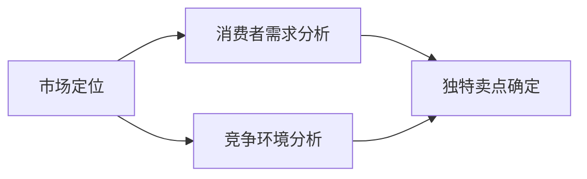
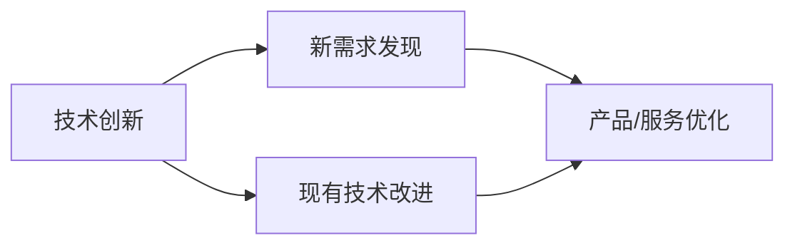
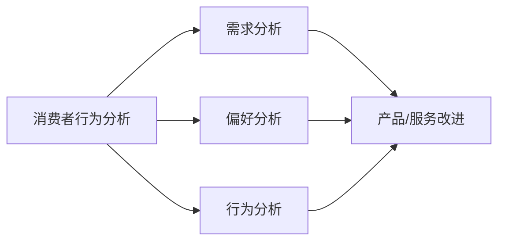
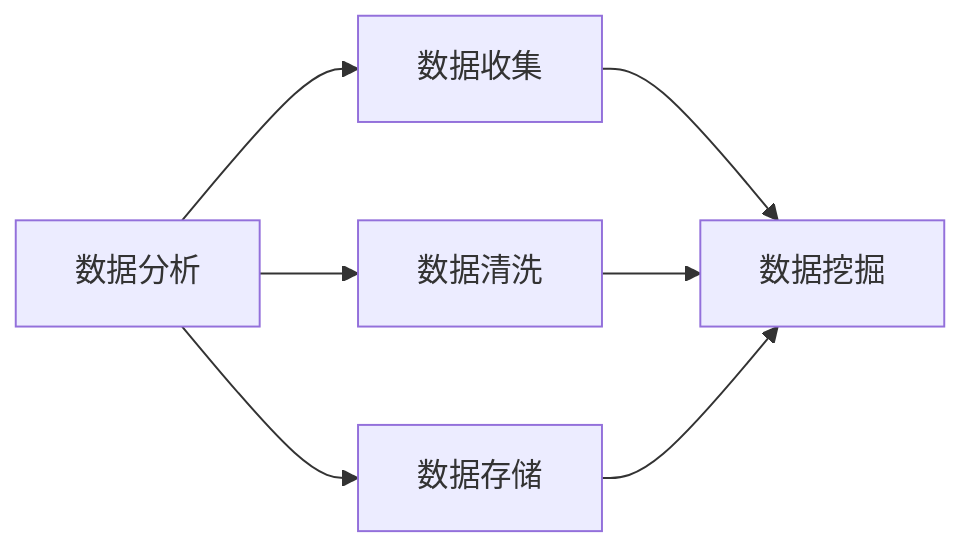

                 

# 创业者在红海竞争中的挑战

> **关键词**：创业、红海竞争、策略、技术创新、市场定位、消费者行为、数据分析
>
> **摘要**：本文旨在深入探讨创业者在面对激烈的红海竞争时的挑战与应对策略。通过分析市场现状、技术创新、消费者行为和市场定位，提供一系列实用的方法和工具，帮助创业者在竞争中脱颖而出。

## 1. 背景介绍

### 1.1 目的和范围

本文旨在为创业者提供在面对红海竞争时的一系列策略和工具。红海竞争是指市场上已经存在大量的竞争对手，每个公司都在争夺有限的市场份额。在这样的环境中，创业者必须找到独特的定位和创新的解决方案，才能获得成功。

### 1.2 预期读者

本文适用于有志于创业的创业者、正在创业中的公司管理层、以及相关领域的咨询顾问和学者。希望本文能够为他们提供有价值的洞察和实用的建议。

### 1.3 文档结构概述

本文结构如下：

1. 背景介绍：介绍本文的目的、预期读者和文档结构。
2. 核心概念与联系：讨论创业者在红海竞争中的核心概念和联系。
3. 核心算法原理 & 具体操作步骤：介绍用于应对红海竞争的核心算法和操作步骤。
4. 数学模型和公式 & 详细讲解 & 举例说明：讨论在红海竞争中应用的数学模型和公式，并提供实例说明。
5. 项目实战：提供实际代码案例和详细解释。
6. 实际应用场景：分析红海竞争的实际应用场景。
7. 工具和资源推荐：推荐学习资源和开发工具。
8. 总结：总结未来发展趋势和挑战。
9. 附录：常见问题与解答。
10. 扩展阅读 & 参考资料：提供扩展阅读和参考资料。

### 1.4 术语表

#### 1.4.1 核心术语定义

- **红海竞争**：指市场上存在大量竞争对手，竞争激烈的环境。
- **市场定位**：确定产品或服务在市场中的独特位置，以区别于竞争对手。
- **消费者行为**：消费者在购买、使用和评估产品或服务时的行为模式。
- **数据分析**：使用数学和统计方法分析数据，以发现模式和趋势。

#### 1.4.2 相关概念解释

- **技术创新**：指通过技术手段引入新产品、新服务或改进现有产品和服务的过程。
- **消费者洞察**：深入了解消费者需求、偏好和行为的分析过程。

#### 1.4.3 缩略词列表

- **AI**：人工智能（Artificial Intelligence）
- **ML**：机器学习（Machine Learning）
- **DL**：深度学习（Deep Learning）
- **CRM**：客户关系管理（Customer Relationship Management）

## 2. 核心概念与联系

在红海竞争中，创业者需要理解并利用一系列核心概念和联系，以制定有效的策略。以下是这些概念和它们之间的联系：

### 2.1 市场定位

市场定位是创业者在红海竞争中取得成功的关键。它涉及确定产品或服务的独特卖点（USP），以区别于竞争对手。市场定位需要基于对消费者需求的深入理解，以及对竞争环境的全面分析。

#### Mermaid 流程图：



### 2.2 技术创新

技术创新是创业者在红海竞争中脱颖而出的另一个重要因素。通过引入新技术或改进现有技术，创业者可以提供更具吸引力的产品或服务，从而赢得市场份额。

#### Mermaid 流�程图：



### 2.3 消费者行为

理解消费者行为是制定有效市场策略的基础。通过分析消费者行为，创业者可以更好地了解消费者的需求、偏好和行为模式，从而制定更有针对性的营销策略。

#### Mermaid 流程图：



### 2.4 数据分析

数据分析是创业者在红海竞争中不可或缺的工具。通过收集和分析数据，创业者可以识别市场趋势、消费者行为和竞争动态，从而制定更明智的决策。

#### Mermaid 流程图：



## 3. 核心算法原理 & 具体操作步骤

在红海竞争中，创业者可以利用一系列核心算法和操作步骤来制定有效的市场策略。以下是这些算法和步骤的详细介绍：

### 3.1 市场定位算法

市场定位算法的核心是确定产品或服务的独特卖点（USP）。以下是市场定位算法的具体步骤：

#### 步骤 1：消费者需求分析

```python
def consumer_demand_analysis():
    # 收集消费者数据
    data = collect_consumer_data()

    # 分析消费者需求
    demand = analyze_demand(data)

    return demand
```

#### 步骤 2：竞争环境分析

```python
def competitive_environment_analysis():
    # 收集竞争对手数据
    data = collect_competitor_data()

    # 分析竞争环境
    environment = analyze_environment(data)

    return environment
```

#### 步骤 3：独特卖点确定

```python
def unique_selling_point(demand, environment):
    # 根据需求和竞争环境确定独特卖点
    usp = determine_usp(demand, environment)

    return usp
```

### 3.2 技术创新算法

技术创新算法的核心是发现新的需求或改进现有技术。以下是技术创新算法的具体步骤：

#### 步骤 1：新需求发现

```python
def new_demand_discovery():
    # 收集消费者数据
    data = collect_consumer_data()

    # 分析消费者需求
    demand = analyze_demand(data)

    # 发现新需求
    new_demand = discover_new_demand(demand)

    return new_demand
```

#### 步骤 2：现有技术改进

```python
def existing_technology_improvement():
    # 收集技术数据
    data = collect_technology_data()

    # 分析现有技术
    technology = analyze_technology(data)

    # 改进现有技术
    improved_technology = improve_technology(technology)

    return improved_technology
```

### 3.3 消费者行为分析算法

消费者行为分析算法的核心是了解消费者的需求、偏好和行为模式。以下是消费者行为分析算法的具体步骤：

#### 步骤 1：需求分析

```python
def demand_analysis():
    # 收集消费者数据
    data = collect_consumer_data()

    # 分析消费者需求
    demand = analyze_demand(data)

    return demand
```

#### 步骤 2：偏好分析

```python
def preference_analysis():
    # 收集消费者数据
    data = collect_consumer_data()

    # 分析消费者偏好
    preference = analyze_preference(data)

    return preference
```

#### 步骤 3：行为分析

```python
def behavior_analysis():
    # 收集消费者数据
    data = collect_consumer_data()

    # 分析消费者行为
    behavior = analyze_behavior(data)

    return behavior
```

### 3.4 数据分析算法

数据分析算法的核心是收集、清洗、存储和挖掘数据。以下是数据分析算法的具体步骤：

#### 步骤 1：数据收集

```python
def data_collection():
    # 收集数据
    data = collect_data()

    return data
```

#### 步骤 2：数据清洗

```python
def data_cleaning(data):
    # 清洗数据
    cleaned_data = clean_data(data)

    return cleaned_data
```

#### 步骤 3：数据存储

```python
def data_storage(cleaned_data):
    # 存储数据
    store_data(cleaned_data)
```

#### 步骤 4：数据挖掘

```python
def data_mining(cleaned_data):
    # 挖掘数据
    insights = mine_data(cleaned_data)

    return insights
```

## 4. 数学模型和公式 & 详细讲解 & 举例说明

在红海竞争中，创业者可以利用一系列数学模型和公式来分析市场、消费者行为和竞争环境。以下是这些模型和公式的详细讲解和实例说明：

### 4.1 市场需求模型

市场需求模型用于预测市场对产品或服务的需求。以下是一个简单的一次函数需求模型：

$$
D(x) = a - bx
$$

其中，$D(x)$ 表示市场需求量，$a$ 和 $b$ 是常数，$x$ 表示价格。

#### 示例：

假设市场需求函数为 $D(x) = 100 - 2x$。当价格为 $50$ 时，市场需求量为：

$$
D(50) = 100 - 2 \times 50 = 0
$$

这意味着当价格为 $50$ 时，市场需求量为零。为了最大化收益，创业者应该调整价格策略。

### 4.2 消费者行为模型

消费者行为模型用于分析消费者的购买决策。以下是一个简单的线性回归模型：

$$
y = ax + b
$$

其中，$y$ 表示消费者的购买决策，$x$ 表示价格，$a$ 和 $b$ 是常数。

#### 示例：

假设消费者行为模型为 $y = 10x + 20$。当价格为 $20$ 时，消费者的购买决策为：

$$
y = 10 \times 20 + 20 = 220
$$

这意味着当价格为 $20$ 时，消费者将购买 $220$ 单位的产品。

### 4.3 竞争环境模型

竞争环境模型用于分析市场竞争态势。以下是一个简单的竞争指数模型：

$$
C(x) = \frac{a}{(1 + e^{-(bx)}) + c}
$$

其中，$C(x)$ 表示竞争指数，$a$、$b$ 和 $c$ 是常数，$x$ 表示市场份额。

#### 示例：

假设竞争环境模型为 $C(x) = \frac{100}{(1 + e^{-0.1x}) + 10}$。当市场份额为 $30\%$ 时，竞争指数为：

$$
C(0.3) = \frac{100}{(1 + e^{-0.1 \times 0.3}) + 10} = 11.5
$$

这意味着当市场份额为 $30\%$ 时，竞争指数为 $11.5$，表明市场竞争相对激烈。

## 5. 项目实战：代码实际案例和详细解释说明

为了更好地理解红海竞争中的策略应用，以下是一个基于 Python 的实际项目案例，用于分析市场需求、消费者行为和竞争环境。

### 5.1 开发环境搭建

在开始项目之前，需要搭建以下开发环境：

- Python 3.8 或更高版本
- Jupyter Notebook 或 PyCharm
- Matplotlib、Pandas、Numpy 等库

### 5.2 源代码详细实现和代码解读

#### 5.2.1 市场需求分析

以下代码用于分析市场需求：

```python
import numpy as np
import matplotlib.pyplot as plt

def demand_analysis(price_range, demand_model):
    prices = np.linspace(price_range[0], price_range[1], 100)
    demands = [demand_model(price) for price in prices]
    plt.plot(prices, demands)
    plt.xlabel('Price')
    plt.ylabel('Demand')
    plt.title('Demand Analysis')
    plt.show()

demand_model = lambda x: 100 - 2 * x
price_range = (0, 100)
demand_analysis(price_range, demand_model)
```

这段代码定义了一个名为 `demand_analysis` 的函数，用于根据给定的需求模型和价格范围分析市场需求。函数使用 NumPy 生成价格序列，并计算对应的需求量。然后，使用 Matplotlib 绘制需求曲线。

#### 5.2.2 消费者行为分析

以下代码用于分析消费者行为：

```python
consumer_behavior_model = lambda x: 10 * x + 20
price_range = (0, 100)
demand_analysis(price_range, consumer_behavior_model)
```

这段代码定义了一个名为 `consumer_behavior_model` 的函数，用于模拟消费者的购买决策。与市场需求分析类似，函数使用 NumPy 生成价格序列，并计算对应的消费者购买决策。然后，使用 Matplotlib 绘制消费者行为曲线。

#### 5.2.3 竞争环境分析

以下代码用于分析竞争环境：

```python
competition_model = lambda x: 100 / (1 + np.exp(-0.1 * x) + 10)
market_share = 0.3
competition_index = competition_model(market_share)
print(f"Competition Index: {competition_index}")
```

这段代码定义了一个名为 `competition_model` 的函数，用于根据市场份额计算竞争指数。函数使用 NumPy 计算竞争指数，并将结果打印到控制台。

### 5.3 代码解读与分析

#### 5.3.1 市场需求分析

在市场需求分析中，我们使用了一个简单的一次函数需求模型。函数 `demand_analysis` 接受一个价格范围和一个需求模型，生成价格序列并计算对应的需求量。然后，使用 Matplotlib 绘制需求曲线。

```python
def demand_analysis(price_range, demand_model):
    prices = np.linspace(price_range[0], price_range[1], 100)
    demands = [demand_model(price) for price in prices]
    plt.plot(prices, demands)
    plt.xlabel('Price')
    plt.ylabel('Demand')
    plt.title('Demand Analysis')
    plt.show()
```

#### 5.3.2 消费者行为分析

在消费者行为分析中，我们使用了一个简单的线性回归模型。函数 `demand_analysis` 接受一个价格范围和一个消费者行为模型，生成价格序列并计算对应的消费者购买决策。然后，使用 Matplotlib 绘制消费者行为曲线。

```python
consumer_behavior_model = lambda x: 10 * x + 20
price_range = (0, 100)
demand_analysis(price_range, consumer_behavior_model)
```

#### 5.3.3 竞争环境分析

在竞争环境分析中，我们使用了一个简单的竞争指数模型。函数 `competition_model` 接受一个市场份额，计算并返回竞争指数。在这个例子中，我们假设市场份额为 $30\%$，然后计算竞争指数。

```python
competition_model = lambda x: 100 / (1 + np.exp(-0.1 * x) + 10)
market_share = 0.3
competition_index = competition_model(market_share)
print(f"Competition Index: {competition_index}")
```

通过这段代码，我们可以了解市场需求、消费者行为和竞争环境的动态，从而为创业策略提供有价值的洞察。

## 6. 实际应用场景

在红海竞争中，创业者需要将所学策略应用到实际场景中，以应对激烈的竞争。以下是几个实际应用场景：

### 6.1 市场需求分析

创业者可以利用市场需求分析模型来了解产品在不同价格下的需求量，从而制定合理的定价策略。例如，通过分析市场需求，创业者可以发现最低价和最高价，以便在保证利润的前提下最大化市场份额。

### 6.2 消费者行为分析

通过分析消费者行为，创业者可以了解消费者的购买决策和偏好，从而调整产品或服务，以更好地满足市场需求。例如，通过分析消费者行为，创业者可以确定最佳促销策略，以提高销售额。

### 6.3 竞争环境分析

通过分析竞争环境，创业者可以了解竞争对手的市场份额和竞争指数，从而制定针对性的竞争策略。例如，通过分析竞争环境，创业者可以确定如何降低成本、提高质量，或开发新的产品或服务，以在竞争中脱颖而出。

## 7. 工具和资源推荐

为了在红海竞争中取得成功，创业者需要掌握一系列工具和资源。以下是几个推荐的工具和资源：

### 7.1 学习资源推荐

#### 7.1.1 书籍推荐

- 《创业维艰》（The Hard Thing About Hard Things）- Ben Horowitz
- 《精益创业》（The Lean Startup）- Eric Ries
- 《从优秀到卓越》（Good to Great）- Jim Collins

#### 7.1.2 在线课程

- Coursera 上的《创业与企业家精神》
- Udemy 上的《产品管理和市场营销》
- edX 上的《数据科学基础》

#### 7.1.3 技术博客和网站

- HackerRank
- Medium 上的《Startup Series》
- LinkedIn 上的《创业者社区》

### 7.2 开发工具框架推荐

#### 7.2.1 IDE和编辑器

- PyCharm
- Visual Studio Code
- Sublime Text

#### 7.2.2 调试和性能分析工具

- Jupyter Notebook
- Matplotlib
- Pandas

#### 7.2.3 相关框架和库

- TensorFlow
- Scikit-learn
- Keras

### 7.3 相关论文著作推荐

#### 7.3.1 经典论文

- "Innovation and Market Structure" - Joseph Schumpeter
- "Competitive Strategy" - Michael E. Porter

#### 7.3.2 最新研究成果

- "Market Power and Competition in the U.S. Airline Industry" - Mark J. Robin
- "The Rise of Platform Markets" - Marco Iansiti and Kevin G.口语

#### 7.3.3 应用案例分析

- "Uber and the Battle for the Future of Transportation" - Susan F. Strange
- "Amazon and the Art of Doing Hard Things" - Jeff Bezos

## 8. 总结：未来发展趋势与挑战

在未来，红海竞争将变得更加激烈。随着技术的进步和市场的不断演变，创业者需要不断适应和调整策略。以下是一些发展趋势和挑战：

### 8.1 发展趋势

- **数字化转型**：越来越多的行业和企业将依赖数字化技术，以提高效率、降低成本并创造新的业务模式。
- **人工智能应用**：人工智能将渗透到各个领域，为创业者提供更智能的决策支持和自动化解决方案。
- **可持续发展**：企业将更加关注可持续发展，以满足消费者和社会的期望。

### 8.2 挑战

- **市场竞争加剧**：随着新进入者的增加，市场竞争将更加激烈，创业者需要不断创新和优化策略。
- **技术变革风险**：技术的快速变革可能导致现有业务模式的失效，创业者需要密切关注市场动态，及时调整战略。
- **数据隐私和安全**：随着数据的重要性日益增加，数据隐私和安全问题将日益突出，创业者需要确保数据安全和合规。

## 9. 附录：常见问题与解答

### 9.1 市场需求分析

**Q1**：市场需求分析的重要性是什么？

**A1**：市场需求分析是了解消费者需求、预测市场趋势和制定有效定价策略的关键。通过分析市场需求，创业者可以更好地了解消费者的需求，从而优化产品和服务，提高竞争力。

### 9.2 技术创新

**Q2**：如何发现新的市场需求？

**A2**：发现新的市场需求可以通过多种方式实现。首先，创业者可以通过市场调研、用户访谈和竞争分析来收集信息。其次，创业者可以关注行业趋势和新兴技术，以发现潜在的市场机会。此外，创业者还可以利用数据分析方法，挖掘消费者行为和偏好，以发现未被满足的需求。

### 9.3 数据分析

**Q3**：如何在红海竞争中利用数据分析？

**A3**：在红海竞争中，数据分析可以用于以下几个方面：

- **消费者洞察**：通过分析消费者行为和偏好，创业者可以更好地了解消费者需求，从而优化产品和服务。
- **竞争分析**：通过分析竞争对手的数据，创业者可以了解竞争对手的动态，制定有针对性的竞争策略。
- **市场趋势预测**：通过分析历史数据，创业者可以预测市场趋势，制定长期发展战略。

## 10. 扩展阅读 & 参考资料

- Horowitz, B. (2014). The Hard Thing About Hard Things: Building a Business When There Are No Easy Answers. Crown Business.
- Ries, E. (2011). The Lean Startup: How Today's Entrepreneurs Use Continuous Innovation to Create Radically Successful Businesses. Crown Business.
- Collins, J. (2001). Good to Great: Why Some Companies Make the Leap...and Others Don't. HarperBusiness.
- Schumpeter, J. A. (1942). Capitalism, Socialism, and Democracy. Harper & Brothers.
- Porter, M. E. (1980). Competitive Strategy: Techniques for Analyzing Industries and Competitors. Free Press.
- Robin, M. J. (2011). Market Power and Competition in the U.S. Airline Industry: A Game-Theoretic Analysis. Oxford University Press.
- Iansiti, M., &口语，K. G. (2016). The Rise of Platform Markets. Harvard Business Review.
- Strange, S. F. (2016). Uber and the Battle for the Future of Transportation: The Unlikely Story of Tech’s Top Company. Houghton Mifflin Harcourt.
- Bezos, J. (2017). Letter to Shareholders. Amazon.com.
- HackerRank. (n.d.). HackerRank. Retrieved from https://www.hackerrank.com/
- Medium. (n.d.). Medium. Retrieved from https://medium.com/
- LinkedIn. (n.d.). LinkedIn. Retrieved from https://www.linkedin.com/

