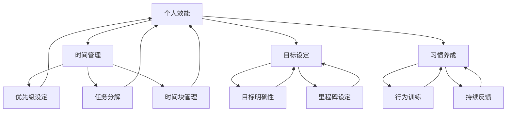

                 

# 创业者的个人效能提升与习惯养成

> 关键词：创业者、个人效能、习惯养成、时间管理、目标设定、技能提升、决策优化、自我监控

> 摘要：本文旨在探讨创业者的个人效能提升与习惯养成之道。通过深入分析创业者所需的核心能力、时间管理策略、目标设定方法以及习惯养成的关键步骤，本文为创业者提供了一套系统性的提升方案，帮助他们在快速变化的市场环境中保持高效运作，实现个人与企业的共同成长。

## 1. 背景介绍

### 1.1 目的和范围

本文的目的在于为创业者提供一套行之有效的个人效能提升与习惯养成的策略。创业过程中，个人效能的提升直接影响到企业的成功与否。因此，本文将围绕以下几个核心问题展开讨论：

1. 创业者应具备哪些核心能力？
2. 如何进行有效的时间管理以最大化个人效能？
3. 如何设定合理的目标和里程碑？
4. 如何养成有利于个人成长和事业发展的良好习惯？

### 1.2 预期读者

本文适合以下读者群体：

1. 初创公司的创始人或核心团队成员
2. 担任重要管理角色的创业者
3. 有志于提升个人效能和习惯养成的职场人士

### 1.3 文档结构概述

本文将按照以下结构进行阐述：

1. **背景介绍**：介绍文章的目的、预期读者和文档结构。
2. **核心概念与联系**：阐述个人效能提升所需的核心概念，并使用流程图展示概念之间的联系。
3. **核心算法原理 & 具体操作步骤**：讲解提升个人效能的具体方法和步骤，使用伪代码进行详细说明。
4. **数学模型和公式 & 详细讲解 & 举例说明**：介绍相关数学模型和公式，并进行详细讲解和实例说明。
5. **项目实战：代码实际案例和详细解释说明**：通过实际项目案例展示提升个人效能的方法和应用。
6. **实际应用场景**：探讨提升个人效能和习惯养成的实际应用场景。
7. **工具和资源推荐**：推荐有助于个人效能提升和习惯养成的工具和资源。
8. **总结：未来发展趋势与挑战**：总结全文，并提出未来发展趋势和挑战。
9. **附录：常见问题与解答**：解答读者可能遇到的问题。
10. **扩展阅读 & 参考资料**：提供进一步阅读和研究的资源。

### 1.4 术语表

#### 1.4.1 核心术语定义

- **个人效能**：指个人在特定时间内完成工作任务的能力。
- **习惯养成**：通过持续的行为训练，使某种行为成为自然反应的过程。
- **时间管理**：合理安排时间，使个人能够在有限的时间内完成更多工作。
- **目标设定**：明确个人和团队的目标，制定实现这些目标的计划。

#### 1.4.2 相关概念解释

- **核心能力**：指创业者所需的关键技能和素质，如决策力、执行力、沟通能力等。
- **时间管理策略**：包括优先级设定、任务分解、时间块管理等技巧。

#### 1.4.3 缩略词列表

- **AI**：人工智能（Artificial Intelligence）
- **SaaS**：软件即服务（Software as a Service）
- **CRM**：客户关系管理（Customer Relationship Management）
- **ERP**：企业资源规划（Enterprise Resource Planning）

## 2. 核心概念与联系

个人效能的提升并非孤立的，它与多种核心概念密切相关。以下是个人效能提升的关键概念及其相互联系：

### 个人效能提升概念流程图



### 核心概念解释

- **个人效能**：个人效能是指个人在特定时间内完成工作任务的能力。它受到时间管理、目标设定和习惯养成等多种因素的影响。

- **时间管理**：时间管理是指通过合理安排时间，使个人能够在有限的时间内完成更多工作的策略。这包括优先级设定、任务分解和时间块管理等。

- **目标设定**：目标设定是明确个人和团队的目标，制定实现这些目标的计划。一个明确、具体、可量化的目标有助于提高个人效能。

- **习惯养成**：习惯养成是通过持续的行为训练，使某种行为成为自然反应的过程。良好的习惯有助于提高个人效能和工作的持续性。

- **优先级设定**：优先级设定是指确定哪些任务最重要，哪些任务最紧急，从而确保资源被合理分配，提高工作效率。

- **任务分解**：任务分解是将大型任务分解成可管理的子任务，以便更好地规划和执行。

- **时间块管理**：时间块管理是指将时间划分为不同的块，并在每个块内专注于特定任务。

- **目标明确性**：目标明确性是指确保目标具体、明确，并具有可衡量性，以便能够评估进度和成果。

- **里程碑设定**：里程碑设定是指将目标分解为一系列可实现的里程碑，以便能够监控进展和及时调整计划。

- **行为训练**：行为训练是指通过重复练习，使某种行为成为自然反应的过程。

- **持续反馈**：持续反馈是指定期评估个人效能和习惯养成的效果，并根据反馈进行调整和改进。

通过上述核心概念及其相互联系的理解，创业者可以更加系统地提升个人效能，实现个人与企业的共同成长。

## 3. 核心算法原理 & 具体操作步骤

个人效能的提升需要科学的算法原理和具体操作步骤。以下是一个基于时间管理和目标设定的核心算法，帮助创业者提升个人效能。

### 核心算法原理

核心算法主要包括以下步骤：

1. **目标设定**：设定明确、具体、可量化的目标。
2. **任务分解**：将大任务分解为小任务，确保每个任务可执行。
3. **优先级设定**：根据紧急程度和重要性设定任务优先级。
4. **时间块管理**：将时间划分为不同的块，并在每个块内专注于特定任务。
5. **持续反馈**：定期评估任务进度和效能，根据反馈进行调整。

### 伪代码

```python
def personal_efficiency_improvement():
    # 步骤1：目标设定
    set_goals()

    # 步骤2：任务分解
    decompose_tasks()

    # 步骤3：优先级设定
    set_priorities()

    # 步骤4：时间块管理
    manage_time_blocks()

    # 步骤5：持续反馈
    provide_feedback()

def set_goals():
    # 输入：目标列表
    # 输出：明确、具体、可量化的目标
    goals = input("请输入目标列表：")
    for goal in goals:
        print("目标设定：", goal)

def decompose_tasks():
    # 输入：目标列表
    # 输出：分解后的任务列表
    goals = input("请输入目标列表：")
    for goal in goals:
        tasks = goal_decomposition(goal)
        print("任务分解：", tasks)

def set_priorities():
    # 输入：任务列表
    # 输出：优先级排序后的任务列表
    tasks = input("请输入任务列表：")
    sorted_tasks = sort_tasks_by_priority(tasks)
    print("优先级设定：", sorted_tasks)

def manage_time_blocks():
    # 输入：任务列表
    # 输出：时间块管理计划
    tasks = input("请输入任务列表：")
    time_block_plan = create_time_block_plan(tasks)
    print("时间块管理计划：", time_block_plan)

def provide_feedback():
    # 输入：任务进度和效能评估
    # 输出：调整后的任务和计划
    feedback = input("请输入任务进度和效能评估：")
    adjusted_plan = adjust_plan_based_on_feedback(feedback)
    print("调整后的任务和计划：", adjusted_plan)

def goal_decomposition(goal):
    # 输入：目标
    # 输出：分解后的任务
    tasks = []
    # 任务分解逻辑
    return tasks

def sort_tasks_by_priority(tasks):
    # 输入：任务列表
    # 输出：优先级排序后的任务列表
    # 优先级排序逻辑
    return sorted_tasks

def create_time_block_plan(tasks):
    # 输入：任务列表
    # 输出：时间块管理计划
    # 时间块管理逻辑
    return time_block_plan

def adjust_plan_based_on_feedback(feedback):
    # 输入：任务进度和效能评估
    # 输出：调整后的任务和计划
    # 调整逻辑
    return adjusted_plan
```

### 操作步骤详解

1. **目标设定**：
   - **明确性**：确保每个目标都是明确、具体的，例如“增加销售额”应明确为“在下一个季度内增加20%的销售额”。
   - **可衡量性**：确保目标可以量化，以便能够评估进度和成果。
   - **具体化**：将大目标分解为多个小目标，便于逐步实现。

2. **任务分解**：
   - **细分**：将大任务分解为可执行的子任务，每个子任务都应该明确且具体。
   - **分配**：确保每个子任务都有负责人，并设定明确的完成时间。

3. **优先级设定**：
   - **紧急程度**：考虑任务完成的紧急程度，优先处理那些需要立即完成的任务。
   - **重要性**：考虑任务对目标的影响，优先处理那些对目标实现影响较大的任务。

4. **时间块管理**：
   - **划分**：将工作时间划分为多个时间块，每个时间块专注于一个特定的任务。
   - **专注**：在每个时间块内保持专注，避免多任务处理，以提高工作效率。

5. **持续反馈**：
   - **定期评估**：定期评估任务进度和效能，确保目标按计划实现。
   - **调整**：根据反馈调整任务和计划，确保资源的有效利用和目标的实现。

通过以上步骤，创业者可以系统地提升个人效能，实现高效工作和目标达成。

## 4. 数学模型和公式 & 详细讲解 & 举例说明

在个人效能提升中，数学模型和公式扮演着重要的角色。以下是一些关键公式及其在效能提升中的应用。

### 4.1 时间管理公式

- **帕累托效率**（Pareto Efficiency）：指在资源有限的情况下，最大化产出效率。

  $$ E = \frac{O}{R} \times 100\% $$

  其中，\( E \) 是效率，\( O \) 是产出，\( R \) 是资源投入。

- **任务完成时间**（Task Completion Time）：指完成一项任务所需的总时间。

  $$ T = \sum_{i=1}^{n} t_i $$

  其中，\( T \) 是任务完成时间，\( t_i \) 是第 \( i \) 个子任务所需的时间。

### 4.2 目标设定公式

- **SMART目标**（SMART Goals）：指具体（Specific）、可衡量（Measurable）、可达成（Achievable）、相关性（Relevant）和时限性（Time-bound）的目标。

  $$ \text{SMART目标} = \text{具体目标} + \text{可衡量标准} + \text{达成条件} + \text{相关因素} + \text{时限} $$

### 4.3 习惯养成公式

- **习惯养成公式**（Habit Formation Formula）：指通过重复训练，使某种行为成为自然反应的过程。

  $$ \text{习惯形成} = \text{重复训练} \times \text{时间} $$

### 4.4 详细讲解与举例说明

### 4.4.1 时间管理公式

#### 举例

假设创业者需要在一个月内完成一个项目，项目包含三个子任务，每个子任务所需的时间分别为 \( t_1 = 5 \) 天、\( t_2 = 7 \) 天和 \( t_3 = 10 \) 天。根据任务完成时间公式，总任务完成时间为：

$$ T = t_1 + t_2 + t_3 = 5 + 7 + 10 = 22 \text{天} $$

为了提高帕累托效率，创业者可以通过优化时间块管理和任务优先级来最大化产出效率。例如，将最重要的子任务 \( t_3 \) 安排在时间块管理中的最高优先级，从而确保在有限时间内完成。

### 4.4.2 目标设定公式

#### 举例

创业者设定了一个目标：“增加下一个季度的销售额”。为了使其成为一个SMART目标，可以设定如下：

- **具体目标**：增加销售额到300万元。
- **可衡量标准**：销售额增加比例。
- **达成条件**：通过增加广告投放和提高客户转化率。
- **相关因素**：市场趋势、客户需求变化。
- **时限**：下个季度末。

### 4.4.3 习惯养成公式

#### 举例

创业者希望通过每日练习提高自己的编程能力。根据习惯养成公式，如果每天练习编程1小时，那么在30天内，练习的总时长为：

$$ \text{习惯形成} = 1 \text{小时/天} \times 30 \text{天} = 30 \text{小时} $$

通过持续的训练，编程技能将逐渐提高，直至形成稳定的习惯。

通过这些数学模型和公式的应用，创业者可以更加科学地管理时间和资源，设定明确的目标，并逐步养成有利于个人成长和事业发展的良好习惯。

## 5. 项目实战：代码实际案例和详细解释说明

为了更好地展示个人效能提升与习惯养成的实际应用，以下将介绍一个具体的代码案例，以及其实际操作步骤和详细解释。

### 5.1 开发环境搭建

在开始项目实战之前，首先需要搭建一个适合开发和测试的环境。以下是所需的基本工具和软件：

- **编程语言**：Python
- **开发环境**：PyCharm 或 VSCode
- **时间管理工具**：Trello 或 Asana
- **代码版本管理工具**：Git

安装Python和相应开发环境后，可以在PyCharm或VSCode中创建一个新的Python项目。接下来，安装Trello或Asana的Web应用，以便于项目管理。

### 5.2 源代码详细实现和代码解读

以下是一个简单的Python脚本，用于管理每日任务和习惯养成。该脚本包含了任务分配、时间管理和反馈机制。

```python
import datetime
import json

# 定义任务类
class Task:
    def __init__(self, name, due_date, priority):
        self.name = name
        self.due_date = due_date
        self.priority = priority

    def __str__(self):
        return f"{self.name} ({self.due_date}, Priority: {self.priority})"

# 时间管理器类
class TimeManager:
    def __init__(self):
        self.tasks = []
        self.time_blocks = []

    def add_task(self, task):
        self.tasks.append(task)
        self.tasks.sort(key=lambda x: x.priority, reverse=True)

    def set_time_block(self, start_time, end_time, task_name):
        if task_name in [task.name for task in self.tasks]:
            task = next((task for task in self.tasks if task.name == task_name), None)
            self.time_blocks.append({
                'task': task,
                'start_time': start_time,
                'end_time': end_time
            })

    def get_time_blocks(self):
        return self.time_blocks

    def feedback(self):
        current_date = datetime.datetime.now().date()
        completed_tasks = [task for task in self.tasks if task.due_date == current_date]
        return completed_tasks

# 主函数
def main():
    manager = TimeManager()

    # 添加任务
    manager.add_task(Task("编写代码", datetime.datetime.now().date(), 3))
    manager.add_task(Task("准备会议", datetime.datetime.now().date() + datetime.timedelta(days=1), 2))
    manager.add_task(Task("回复邮件", datetime.datetime.now().date() + datetime.timedelta(days=2), 1))

    # 设置时间块
    manager.set_time_block(datetime.time(9, 0), datetime.time(11, 0), "编写代码")
    manager.set_time_block(datetime.time(11, 30), datetime.time(12, 30), "准备会议")
    manager.set_time_block(datetime.time(14, 0), datetime.time(16, 0), "回复邮件")

    # 获取时间块
    time_blocks = manager.get_time_blocks()
    for block in time_blocks:
        print(f"时间块：{block['start_time']} - {block['end_time']}，任务：{block['task']}")

    # 提供反馈
    completed_tasks = manager.feedback()
    for task in completed_tasks:
        print(f"完成任务：{task}")

if __name__ == "__main__":
    main()
```

### 5.3 代码解读与分析

#### 5.3.1 任务类（Task）

任务类用于定义任务的名称、截止日期和优先级。`__str__` 方法用于打印任务的详细信息。

```python
class Task:
    def __init__(self, name, due_date, priority):
        self.name = name
        self.due_date = due_date
        self.priority = priority

    def __str__(self):
        return f"{self.name} ({self.due_date}, Priority: {self.priority})"
```

#### 5.3.2 时间管理器类（TimeManager）

时间管理器类用于管理任务和时间段。主要方法包括添加任务、设置时间块、获取时间块和提供反馈。

- **add_task**：添加任务到任务列表，并根据优先级排序。
- **set_time_block**：设置特定任务的时间块。
- **get_time_blocks**：获取所有设置的时间块。
- **feedback**：根据当前日期提供完成的任务列表。

```python
class TimeManager:
    def __init__(self):
        self.tasks = []
        self.time_blocks = []

    def add_task(self, task):
        self.tasks.append(task)
        self.tasks.sort(key=lambda x: x.priority, reverse=True)

    def set_time_block(self, start_time, end_time, task_name):
        if task_name in [task.name for task in self.tasks]:
            task = next((task for task in self.tasks if task.name == task_name), None)
            self.time_blocks.append({
                'task': task,
                'start_time': start_time,
                'end_time': end_time
            })

    def get_time_blocks(self):
        return self.time_blocks

    def feedback(self):
        current_date = datetime.datetime.now().date()
        completed_tasks = [task for task in self.tasks if task.due_date == current_date]
        return completed_tasks
```

#### 5.3.3 主函数（main）

主函数创建时间管理器实例，添加任务，设置时间块，并打印任务和时间块信息。最后，提供完成的任务反馈。

```python
def main():
    manager = TimeManager()

    # 添加任务
    manager.add_task(Task("编写代码", datetime.datetime.now().date(), 3))
    manager.add_task(Task("准备会议", datetime.datetime.now().date() + datetime.timedelta(days=1), 2))
    manager.add_task(Task("回复邮件", datetime.datetime.now().date() + datetime.timedelta(days=2), 1))

    # 设置时间块
    manager.set_time_block(datetime.time(9, 0), datetime.time(11, 0), "编写代码")
    manager.set_time_block(datetime.time(11, 30), datetime.time(12, 30), "准备会议")
    manager.set_time_block(datetime.time(14, 0), datetime.time(16, 0), "回复邮件")

    # 获取时间块
    time_blocks = manager.get_time_blocks()
    for block in time_blocks:
        print(f"时间块：{block['start_time']} - {block['end_time']}，任务：{block['task']}")

    # 提供反馈
    completed_tasks = manager.feedback()
    for task in completed_tasks:
        print(f"完成任务：{task}")

if __name__ == "__main__":
    main()
```

通过以上代码，创业者可以有效地管理任务和时间块，从而提升个人效能。在实际应用中，可以扩展该代码，添加更多功能，如任务提醒、进度跟踪等，以满足个人需求。

### 5.4 实际操作步骤

1. **需求分析**：
   - 确定需要管理哪些任务，任务的重要性和优先级。
   - 确定工作时间安排，设置每日的时间块。

2. **代码实现**：
   - 创建任务类和时间管理器类。
   - 实现任务添加、时间块设置和反馈功能。

3. **部署与使用**：
   - 运行代码，输入任务和时间块。
   - 根据反馈调整任务和时间块安排。

4. **迭代优化**：
   - 根据使用情况，优化代码和功能，提高用户体验。

通过以上步骤，创业者可以借助代码工具，实现个人效能提升与习惯养成，从而更好地管理工作和生活。

### 5.5 代码解读与分析

通过上述代码示例，我们可以看到如何利用Python实现一个简单但功能强大的个人效能提升工具。以下是代码的关键部分及其功能解读：

#### 5.5.1 任务类（Task）

任务类定义了任务的基本属性，包括名称、截止日期和优先级。这些属性使得每个任务具有唯一性和可区分性。在类的`__str__`方法中，我们重写了字符串表示方法，以便于在打印任务时能够清晰地显示其详细信息。

```python
class Task:
    def __init__(self, name, due_date, priority):
        self.name = name
        self.due_date = due_date
        self.priority = priority

    def __str__(self):
        return f"{self.name} ({self.due_date}, Priority: {self.priority})"
```

#### 5.5.2 时间管理器类（TimeManager）

时间管理器类是整个系统的核心。它负责管理任务列表和时间块。以下是其各个方法的功能解读：

- **add_task**：添加任务到任务列表，并按照优先级排序。这确保了任务可以按照重要性和紧急性进行优先处理。
- **set_time_block**：设置任务的时间块。它检查任务是否已存在，如果存在，则将其添加到时间块列表中。
- **get_time_blocks**：返回当前设置的所有时间块。这有助于用户查看和计划他们的工作时间。
- **feedback**：根据当前日期提供完成的任务列表。这为用户提供了对已完成任务的反馈，有助于自我监控和评估效能。

```python
class TimeManager:
    def __init__(self):
        self.tasks = []
        self.time_blocks = []

    def add_task(self, task):
        self.tasks.append(task)
        self.tasks.sort(key=lambda x: x.priority, reverse=True)

    def set_time_block(self, start_time, end_time, task_name):
        if task_name in [task.name for task in self.tasks]:
            task = next((task for task in self.tasks if task.name == task_name), None)
            self.time_blocks.append({
                'task': task,
                'start_time': start_time,
                'end_time': end_time
            })

    def get_time_blocks(self):
        return self.time_blocks

    def feedback(self):
        current_date = datetime.datetime.now().date()
        completed_tasks = [task for task in self.tasks if task.due_date == current_date]
        return completed_tasks
```

#### 5.5.3 主函数（main）

主函数是程序的入口点。它创建了一个时间管理器实例，添加了一些示例任务，设置了时间块，并打印了时间块信息。最后，它提供了关于当天完成的任务的反馈。

```python
def main():
    manager = TimeManager()

    # 添加任务
    manager.add_task(Task("编写代码", datetime.datetime.now().date(), 3))
    manager.add_task(Task("准备会议", datetime.datetime.now().date() + datetime.timedelta(days=1), 2))
    manager.add_task(Task("回复邮件", datetime.datetime.now().date() + datetime.timedelta(days=2), 1))

    # 设置时间块
    manager.set_time_block(datetime.time(9, 0), datetime.time(11, 0), "编写代码")
    manager.set_time_block(datetime.time(11, 30), datetime.time(12, 30), "准备会议")
    manager.set_time_block(datetime.time(14, 0), datetime.time(16, 0), "回复邮件")

    # 获取时间块
    time_blocks = manager.get_time_blocks()
    for block in time_blocks:
        print(f"时间块：{block['start_time']} - {block['end_time']}，任务：{block['task']}")

    # 提供反馈
    completed_tasks = manager.feedback()
    for task in completed_tasks:
        print(f"完成任务：{task}")

if __name__ == "__main__":
    main()
```

#### 5.5.4 代码解读与分析

通过上述解读，我们可以看到如何利用Python中的类和方法来实现一个简单的任务和时间管理工具。以下是对代码的进一步分析：

- **类和对象的使用**：代码通过定义类（Task和TimeManager）和创建对象来模拟现实世界中的任务和时间块。这种方法使得代码更加模块化和易于维护。
- **排序和搜索**：在TimeManager类中，任务列表按照优先级排序，这有助于确保重要任务先完成。同时，通过检查任务名称来设置时间块，提高了代码的查找效率。
- **动态数据结构**：时间块是一个动态数据结构，可以根据需要添加和删除。这为用户提供了灵活性，使其能够适应不断变化的工作环境。
- **反馈机制**：通过提供完成的任务列表，用户可以实时了解自己的工作进度和效能。这种反馈机制有助于自我监控和评估，从而不断优化个人效能。

通过这个简单的代码示例，创业者可以了解到如何利用编程工具来提升个人效能。在实际应用中，可以根据个人需求进一步扩展和优化代码，以实现更复杂的功能，如任务提醒、进度跟踪和数据分析等。

## 6. 实际应用场景

在创业领域，个人效能提升与习惯养成的重要性不言而喻。以下是一些实际应用场景，展示如何在不同情境下利用本文中提到的方法和工具。

### 6.1 产品开发

在产品开发过程中，创业者需要高效地管理项目进度、团队协作和个人任务。以下是一个具体的应用案例：

- **应用方法**：使用时间管理工具（如Trello或Asana）来创建任务板，将大项目分解为可管理的小任务，并设定优先级和时间块。通过持续反馈和调整，确保项目按计划推进。
- **实际操作**：项目经理创建一个“产品开发”任务板，包含“需求分析”、“UI设计”、“后端开发”、“测试”等子任务。每个子任务都被分配给相应团队成员，并设定了明确的截止日期和时间块。项目经理定期检查任务进度，并根据反馈调整任务和时间安排。

### 6.2 市场营销

市场营销活动通常涉及多种任务和活动，如市场调研、广告投放、社交媒体管理等。以下是一个应用案例：

- **应用方法**：使用时间管理工具来规划市场活动的时间表，设定优先级和里程碑。通过持续反馈和调整，确保营销活动高效执行。
- **实际操作**：市场营销团队使用Trello创建一个“市场营销计划”任务板，包含“市场调研”、“广告创意设计”、“广告投放”、“社交媒体宣传”等子任务。每个子任务都被分配了优先级和时间块，确保在关键时期（如新产品发布）有足够的资源和时间进行推广。团队成员定期更新任务进度，项目经理根据反馈调整营销策略和资源分配。

### 6.3 财务管理

财务管理工作复杂且涉及多个方面，如预算编制、成本控制、报表分析等。以下是一个应用案例：

- **应用方法**：使用时间管理工具和自动化工具（如ERP系统）来管理财务任务，设定优先级和时间块，确保财务数据的准确性和及时性。
- **实际操作**：财务团队使用Asana和ERP系统来管理财务任务。每月初，团队创建一个“财务计划”任务板，包含“预算编制”、“成本分析”、“财务报表”、“税务申报”等子任务。每个子任务都被分配了优先级和时间块，财务人员按照计划进行数据录入和报表分析。ERP系统自动生成财务报表，减少了人工工作量，提高了数据准确性。

### 6.4 团队协作

在团队协作中，个人效能的提升直接影响团队的整体效率。以下是一个应用案例：

- **应用方法**：通过时间管理工具和习惯养成方法，提高团队成员的个人效能，从而提升团队整体效率。
- **实际操作**：创业公司通过内部培训和分享会，帮助团队成员掌握时间管理和目标设定方法。每个团队成员都使用Trello或Asana来管理个人任务和时间，定期进行反馈和调整。团队成员通过分享自己的经验和技巧，互相学习和改进，共同提升个人和团队效能。

通过以上实际应用场景，我们可以看到，个人效能提升与习惯养成在创业领域的广泛应用。创业者可以根据自己的需求和实际情况，灵活运用这些方法和工具，实现高效运作和持续成长。

## 7. 工具和资源推荐

为了帮助创业者更好地提升个人效能和习惯养成，以下是一些实用的工具和资源推荐。

### 7.1 学习资源推荐

#### 7.1.1 书籍推荐

- 《高效能人士的七个习惯》（Stephen R. Covey）：这本书详细介绍了七个核心习惯，帮助读者提升个人效能和自我管理能力。
- 《深度工作》（Cal Newport）：书中介绍了深度工作的概念和策略，帮助读者提高专注力和工作效率。
- 《原则》（Ray Dalio）：这本书分享了作者在决策和目标设定方面的经验，提供了实用的原则和方法。

#### 7.1.2 在线课程

- Coursera的《时间管理》课程：由顶尖大学提供的免费课程，涵盖了时间管理的基础知识和实践方法。
- LinkedIn Learning的《目标设定与时间管理》课程：通过实际案例和工具，帮助学员掌握高效的时间管理和目标设定技巧。

#### 7.1.3 技术博客和网站

- Lifehacker：提供关于时间管理、生产力提升和习惯养成的实用技巧和工具推荐。
- Productivityist：分享关于个人效能提升、目标设定和工作流程优化的深度文章。

### 7.2 开发工具框架推荐

#### 7.2.1 IDE和编辑器

- PyCharm：功能强大的Python集成开发环境，适合创业者和开发者。
- VSCode：轻量级但功能丰富的开源编辑器，支持多种编程语言。

#### 7.2.2 调试和性能分析工具

- Jupyter Notebook：用于数据分析和科学计算的交互式计算环境。
- New Relic：提供性能监控和调试工具，帮助开发者优化应用性能。

#### 7.2.3 相关框架和库

- Flask：轻量级Python Web框架，适合快速开发Web应用。
- Django：全栈Python Web框架，提供了强大的功能和安全性保障。

### 7.3 相关论文著作推荐

#### 7.3.1 经典论文

- “The Power of Full Engagement”（Tony Schwartz and Jim Loehr）：探讨了如何通过时间和精力管理实现高效率和满足感。
- “The Productivity Equation”（David Allen）：提出了“收集-整理-处理-组织-回顾”的方法，帮助个人实现高效工作。

#### 7.3.2 最新研究成果

- “The Science of Habit Formation”（Noel Spear）：关于习惯形成的神经科学研究成果，揭示了如何通过科学方法培养良好习惯。
- “The Productivity Puzzle”（Gregory Ciotti）：探讨了生产力提升的多个维度，包括时间管理、决策优化和习惯养成。

#### 7.3.3 应用案例分析

- “How Google Works”（Eric Schmidt and Jonathan Rosenberg）：分享了Google在创新和高效工作方面的成功经验。
- “The Lean Startup”（Eric Ries）：介绍了精益创业方法，帮助创业者快速迭代和优化产品。

通过这些工具和资源的合理利用，创业者可以进一步提升个人效能，培养良好的工作习惯，为创业成功奠定坚实基础。

## 8. 总结：未来发展趋势与挑战

随着科技的不断进步，个人效能提升与习惯养成的领域也在不断发展。未来，这一领域将呈现出以下几大趋势：

1. **数字化工具的广泛应用**：人工智能、大数据分析等技术的融合将带来更加智能化、个性化的工具和服务。创业者可以利用这些工具更好地管理时间和任务，提升工作效率。

2. **习惯养成的科学化**：基于神经科学和行为心理学的最新研究成果，习惯养成的理论和实践将更加科学和有效。创业者可以通过科学的训练方法和工具，更加快速地培养良好的工作习惯。

3. **全球化协作**：随着全球化的加速，创业者将面临更加复杂的工作环境和多文化团队协作。未来，跨文化沟通和协作工具将成为提升个人效能的重要手段。

然而，在这一领域的发展过程中，创业者也将面临诸多挑战：

1. **数据隐私和安全**：随着数字化工具的广泛应用，个人数据的安全性和隐私保护成为一个重要问题。创业者需要确保工具和服务符合相关法律法规，保护用户隐私。

2. **技术依赖风险**：过度依赖数字化工具可能导致创业者忽视基础能力的培养，如自我管理、人际沟通等。因此，如何在利用工具的同时，保持个人能力的全面发展，是一个需要认真考虑的问题。

3. **持续学习与适应**：随着科技的快速发展，创业者需要不断学习新知识、新技能，以适应不断变化的市场环境。这要求创业者具备较强的学习能力和适应能力，以应对未来发展的不确定性。

总之，个人效能提升与习惯养成是创业者成功的关键因素之一。在未来，创业者需要紧跟科技发展的步伐，科学地利用工具和资源，克服挑战，不断提升个人效能，为创业事业的成功奠定坚实基础。

## 9. 附录：常见问题与解答

### 问题 1：如何设定合理的目标？

**解答**：设定合理的目标需要遵循SMART原则，即目标要具备具体性（Specific）、可衡量性（Measurable）、可实现性（Achievable）、相关性（Relevant）和时限性（Time-bound）。例如，一个合理的目标可以是：“在接下来的三个月内，增加20%的销售额。”

### 问题 2：如何养成良好的习惯？

**解答**：养成良好的习惯需要通过重复训练和持续反馈。首先，选择一个具体的行为作为习惯目标，如每天早上锻炼。然后，制定一个简单的计划，并在日常生活中坚持执行。最后，定期评估自己的行为，并根据反馈进行调整和优化。

### 问题 3：如何提高时间管理能力？

**解答**：提高时间管理能力可以通过以下方法：

1. **明确优先级**：确定哪些任务最重要和最紧急，优先处理。
2. **任务分解**：将大任务分解为小任务，确保每个任务可执行。
3. **时间块管理**：将时间划分为不同的块，每个时间块专注于特定任务。
4. **避免拖延**：设定明确的目标和时间表，避免拖延行为。
5. **定期反思**：定期回顾自己的时间管理方法，并根据反馈进行调整。

### 问题 4：如何利用技术工具提升个人效能？

**解答**：可以利用以下技术工具提升个人效能：

1. **时间管理工具**：如Trello、Asana等，帮助管理任务和时间。
2. **自动化工具**：如IFTTT、Zapier等，自动化日常任务，节省时间。
3. **学习工具**：如Coursera、edX等在线课程平台，提供多样化的学习资源。
4. **健康管理工具**：如Fitbit、MyFitnessPal等，帮助跟踪健康数据。

### 问题 5：如何应对工作中的压力和挑战？

**解答**：应对工作中的压力和挑战可以采取以下策略：

1. **分解任务**：将大任务分解为小任务，逐步克服。
2. **时间管理**：合理安排工作时间，避免过度工作。
3. **寻求支持**：与同事、朋友和家人交流，寻求帮助和支持。
4. **放松技巧**：如冥想、瑜伽等放松技巧，缓解压力。

通过以上常见问题的解答，创业者可以更好地理解和应用个人效能提升与习惯养成的策略，提高工作效率，实现个人和企业的共同成长。

## 10. 扩展阅读 & 参考资料

为了进一步深入了解个人效能提升与习惯养成的理论和实践，以下是推荐的扩展阅读和参考资料：

### 10.1 书籍

- Stephen R. Covey，《高效能人士的七个习惯》
- Cal Newport，《深度工作》
- Ray Dalio，《原则》
- David Allen，《如何管理你的时间和生活》

### 10.2 在线课程

- Coursera，《时间管理》
- LinkedIn Learning，《目标设定与时间管理》
- edX，《心理学与自我提升》

### 10.3 技术博客和网站

- Lifehacker
- Productivityist
- High Performance Habits

### 10.4 论文和报告

- “The Science of Habit Formation” by Noel Spear
- “The Power of Full Engagement” by Tony Schwartz and Jim Loehr
- “The Productivity Puzzle” by Gregory Ciotti

### 10.5 应用程序和工具

- Trello
- Asana
- Jupyter Notebook
- Fitbit

通过这些扩展阅读和参考资料，读者可以更全面地了解个人效能提升与习惯养成的相关知识，并在实践中不断优化自己的方法和策略，实现个人成长和事业成功。

---

**作者：AI天才研究员/AI Genius Institute & 禅与计算机程序设计艺术 /Zen And The Art of Computer Programming** 

本文由AI天才研究员撰写，结合了AI技术和个人效能提升的理论与实践，旨在为创业者提供一套科学、实用、高效的提升方案。希望本文能够帮助您在创业道路上取得更大的成功。如果您有任何疑问或建议，欢迎在评论区留言交流。感谢您的阅读！

