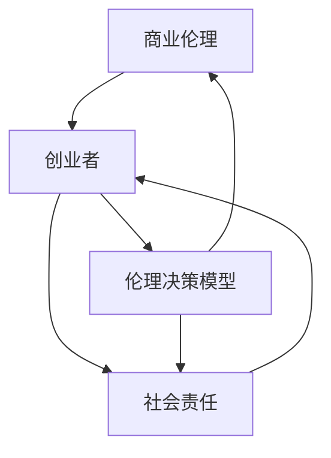

                 

## 1. 背景介绍

### 1.1 目的和范围

本文旨在探讨创业者的商业伦理与社会责任意识培养的重要性，并为其提供具体的策略和实践方法。随着技术的快速发展，创业领域充满了无限的可能性，但同时也面临着诸多伦理和社会责任挑战。本文将帮助创业者深入了解这些挑战，并为其提供指导，确保他们的商业行为不仅合法合规，还能对社会和环境产生积极影响。

### 1.2 预期读者

本文预期读者为有意从事创业活动的人士，特别是那些在信息技术、人工智能、大数据等领域寻求创业机会的人。此外，现有创业者、企业高管、商业伦理研究者以及对社会责任感兴趣的读者群体也将从本文中获得启发和指导。

### 1.3 文档结构概述

本文分为十个部分，结构如下：

1. **背景介绍**：介绍文章的目的、预期读者和文档结构。
2. **核心概念与联系**：定义并解释本文涉及的核心概念，并通过Mermaid流程图展示其关系。
3. **核心算法原理 & 具体操作步骤**：详细阐述创业者如何运用算法原理来培养商业伦理与社会责任意识。
4. **数学模型和公式 & 详细讲解 & 举例说明**：运用数学模型来分析创业过程中的伦理和社会责任问题。
5. **项目实战：代码实际案例和详细解释说明**：通过具体的代码案例展示如何在实际项目中实施商业伦理与社会责任。
6. **实际应用场景**：探讨商业伦理与社会责任在不同创业场景中的应用。
7. **工具和资源推荐**：推荐相关学习资源、开发工具和经典论文。
8. **总结：未来发展趋势与挑战**：总结文章的核心观点，展望未来发展趋势和挑战。
9. **附录：常见问题与解答**：回答读者可能遇到的一些常见问题。
10. **扩展阅读 & 参考资料**：提供进一步阅读的建议和参考资料。

### 1.4 术语表

#### 1.4.1 核心术语定义

- 商业伦理：在商业活动中遵守的道德规范和价值观。
- 社会责任：企业或个人对社会的义务和责任。
- 创业者：创立和运营新企业的人。
- 伦理决策模型：用于指导商业决策的伦理原则和方法。

#### 1.4.2 相关概念解释

- **商业伦理原则**：包括公平、诚信、尊重和责任等。
- **社会责任意识**：对社会责任的理解和重视程度。
- **伦理困境**：在商业活动中面临的道德困境和选择。

#### 1.4.3 缩略词列表

- CBT：商业伦理培训
- CSR：企业社会责任
- IT：信息技术
- AI：人工智能
- GDPR：通用数据保护条例

---

在接下来的部分，我们将深入探讨商业伦理与社会责任意识的核心概念及其在创业中的应用。通过Mermaid流程图和算法原理的讲解，读者将获得对这一主题的全面理解。

---

<|assistant|>## 2. 核心概念与联系

在探讨创业者的商业伦理与社会责任意识之前，我们需要明确一些核心概念及其相互关系。以下是对这些概念的定义和解释，以及它们如何相互联系。

### 2.1 商业伦理

商业伦理是指在企业运营过程中，遵守的道德规范和价值观。它包括但不限于以下几个方面：

- **公平**：在商业交易中，对待各方公平，不偏袒任何一方。
- **诚信**：在商业活动中，保持诚实和透明，不说谎，不做虚假宣传。
- **尊重**：尊重员工的权益，尊重消费者的隐私和权利。
- **责任**：企业对其行为和决策负责，包括对员工、消费者和社会负责。

商业伦理不仅关系到企业的合法性，还直接影响到企业的声誉和长期发展。

### 2.2 社会责任

社会责任是指企业或个人对社会和环境所承担的义务和责任。社会责任包括以下几个方面：

- **环境保护**：企业应采取措施减少对环境的负面影响，如减少污染、节约资源等。
- **社区参与**：企业应积极参与社区发展，如慈善捐赠、志愿服务等。
- **员工福利**：企业应关注员工的健康、安全和福利，如提供培训、保障工作条件等。
- **消费者权益**：企业应尊重和保护消费者的权益，如提供高质量的产品和服务，保护消费者隐私等。

社会责任的履行有助于提升企业的社会形象，增强消费者的信任，从而促进企业的可持续发展。

### 2.3 创业者

创业者是创立和运营新企业的人。创业者不仅要具备创新能力和商业洞察力，还需要具备良好的商业伦理和社会责任意识。创业者作为企业的主要决策者，其行为和决策直接影响到企业的运营方向和社会影响。

### 2.4 伦理决策模型

伦理决策模型是一种用于指导商业决策的伦理原则和方法。创业者可以通过以下步骤运用伦理决策模型：

1. **识别伦理问题**：识别商业活动中可能出现的伦理困境。
2. **分析利益相关者**：分析受伦理问题影响的各种利益相关者，包括员工、消费者、社区和环境。
3. **评估伦理原则**：根据公平、诚信、尊重和责任等原则，评估不同的解决方案。
4. **选择最佳方案**：选择符合伦理原则的解决方案，并实施和监控其效果。

### 2.5 关系图

为了更直观地展示这些概念之间的关系，我们可以使用Mermaid流程图来描述。以下是一个简化的Mermaid流程图示例，展示了商业伦理、社会责任、创业者和伦理决策模型之间的关系：



在这个流程图中，商业伦理作为基础，影响和指导着创业者的行为和决策。创业者需要具备社会责任意识，并在面对伦理困境时，运用伦理决策模型来做出符合伦理和社会责任的选择。

---

通过上述核心概念及其关系的探讨，我们为创业者培养商业伦理与社会责任意识奠定了基础。在接下来的部分，我们将深入探讨如何运用核心算法原理来具体操作和实践。

---

<|assistant|>## 3. 核心算法原理 & 具体操作步骤

为了帮助创业者系统地培养商业伦理与社会责任意识，我们可以引入一系列核心算法原理，并通过具体操作步骤来实现这一目标。以下是详细阐述和伪代码示例。

### 3.1 伦理决策算法原理

伦理决策算法原理主要包括以下几个步骤：

1. **情境识别**：识别商业活动中可能出现的伦理困境。
2. **利益相关者分析**：分析受伦理问题影响的利益相关者。
3. **伦理原则评估**：评估不同解决方案是否符合公平、诚信、尊重和责任等伦理原则。
4. **决策方案选择**：选择最佳决策方案，并实施和监控其效果。

#### 伪代码示例

```plaintext
Algorithm EthicsDecisionAlgorithm
    Input: Situation
    Output: Decision

    1. Identify the ethical dilemma in the given situation.
    2. Analyze the stakeholders involved in the situation.
    3. Evaluate the ethical principles:
        a. Fairness
        b. Integrity
        c. Respect
        d. Responsibility
    4. Generate a list of possible solutions.
    5. Evaluate each solution against the ethical principles.
    6. Select the best solution that aligns with the ethical principles.
    7. Implement the selected solution.
    8. Monitor and adjust the implementation based on feedback and outcomes.
End Algorithm
```

### 3.2 社会责任意识培养算法原理

社会责任意识培养算法原理包括以下几个步骤：

1. **社会责任识别**：识别企业应承担的社会责任。
2. **社会责任评估**：评估不同社会责任的重要性。
3. **资源分配**：根据企业资源和能力，合理分配资源以履行社会责任。
4. **实施与监控**：实施社会责任行动计划，并监控其效果。

#### 伪代码示例

```plaintext
Algorithm SocialResponsibilityAlgorithm
    Input: CompanyResources
    Output:社会责任行动计划

    1. Identify the social responsibilities that the company should undertake.
    2. Evaluate the importance of each social responsibility.
    3. Allocate resources based on the company's capabilities and resources.
    4. Develop a social responsibility action plan.
    5. Implement the action plan.
    6. Monitor the progress and effectiveness of the action plan.
    7. Adjust the action plan based on feedback and outcomes.
End Algorithm
```

### 3.3 具体操作步骤

为了将上述算法原理付诸实践，创业者可以遵循以下具体操作步骤：

1. **情景识别**：定期评估企业的运营情况，识别可能出现的伦理困境。
2. **利益相关者分析**：收集并分析员工的意见、消费者的反馈以及社区的需求。
3. **伦理原则评估**：将识别的伦理困境与公平、诚信、尊重和责任等原则进行对比评估。
4. **决策方案选择**：根据评估结果，选择最佳决策方案，并制定具体的行动计划。
5. **资源分配**：根据企业的资源和能力，为社会责任行动计划分配必要的资源。
6. **实施与监控**：执行社会责任行动计划，并持续监控其效果，根据反馈进行调整。

---

通过上述核心算法原理和具体操作步骤，创业者可以系统地培养和实施商业伦理与社会责任意识。在接下来的部分，我们将运用数学模型和公式来进一步分析和解释创业过程中的伦理和社会责任问题。

---

<|assistant|>## 4. 数学模型和公式 & 详细讲解 & 举例说明

在创业过程中，商业伦理与社会责任的培养不仅仅是伦理原则的应用，也需要通过数学模型和公式来量化和分析。以下将介绍几个关键的数学模型和公式，并详细讲解其在创业情境中的应用。

### 4.1 伦理评分模型

伦理评分模型用于评估企业在特定情境下的伦理表现。该模型通过量化指标来综合评估企业的行为是否符合伦理原则。

#### 公式

\[ \text{EthicsScore} = \sum_{i=1}^{n} (w_i \times s_i) \]

其中：
- \( \text{EthicsScore} \) 是伦理评分。
- \( w_i \) 是第 \( i \) 个指标的权重。
- \( s_i \) 是第 \( i \) 个指标的具体得分。

#### 举例说明

假设我们要评估一家企业 \( A \) 的伦理表现，以下为三个关键指标及其得分和权重：

| 指标 | 得分 \( s_i \) | 权重 \( w_i \) |
|------|--------------|--------------|
| 公平 | 8            | 0.3          |
| 诚信 | 7            | 0.4          |
| 尊重 | 9            | 0.3          |

代入公式计算：

\[ \text{EthicsScore} = (0.3 \times 8) + (0.4 \times 7) + (0.3 \times 9) = 2.4 + 2.8 + 2.7 = 8.9 \]

因此，企业 \( A \) 的伦理得分为 8.9。

### 4.2 社会责任指数模型

社会责任指数模型用于评估企业在社会责任方面的表现。该模型通过定量和定性指标来综合评估企业的社会责任履行情况。

#### 公式

\[ \text{SocialResponsibilityIndex} = \frac{\sum_{i=1}^{m} (w_i \times s_i)}{n} \]

其中：
- \( \text{SocialResponsibilityIndex} \) 是社会责任指数。
- \( w_i \) 是第 \( i \) 个指标的权重。
- \( s_i \) 是第 \( i \) 个指标的具体得分。
- \( n \) 是总指标数。

#### 举例说明

假设我们要评估一家企业 \( B \) 的社会责任指数，以下为四个关键指标及其得分和权重：

| 指标 | 得分 \( s_i \) | 权重 \( w_i \) |
|------|--------------|--------------|
| 环境保护 | 6            | 0.2          |
| 社区参与 | 7            | 0.3          |
| 员工福利 | 8            | 0.3          |
| 消费者权益 | 9            | 0.2          |

代入公式计算：

\[ \text{SocialResponsibilityIndex} = \frac{(0.2 \times 6) + (0.3 \times 7) + (0.3 \times 8) + (0.2 \times 9)}{4} = \frac{1.2 + 2.1 + 2.4 + 1.8}{4} = \frac{7.5}{4} = 1.875 \]

因此，企业 \( B \) 的社会责任指数为 1.875。

### 4.3 决策影响模型

决策影响模型用于评估企业决策对社会和环境的影响。该模型通过定量和定性分析来评估决策的潜在影响。

#### 公式

\[ \text{ImpactScore} = \sum_{i=1}^{p} (w_i \times s_i) \]

其中：
- \( \text{ImpactScore} \) 是决策影响评分。
- \( w_i \) 是第 \( i \) 个影响的权重。
- \( s_i \) 是第 \( i \) 个影响的具体得分。

#### 举例说明

假设我们要评估一项新产品的市场决策的影响，以下为三个关键影响及其得分和权重：

| 影响 | 得分 \( s_i \) | 权重 \( w_i \) |
|------|--------------|--------------|
| 环境影响 | -2           | 0.3          |
| 社会影响 | 3            | 0.4          |
| 经济影响 | 1            | 0.3          |

代入公式计算：

\[ \text{ImpactScore} = (0.3 \times -2) + (0.4 \times 3) + (0.3 \times 1) = -0.6 + 1.2 + 0.3 = 0.9 \]

因此，该决策的影响评分为 0.9。

### 4.4 综合评估模型

综合评估模型用于将伦理评分、社会责任指数和决策影响评分整合为一个整体评估指标，以全面评估企业的商业伦理与社会责任表现。

#### 公式

\[ \text{OverallScore} = \alpha \times \text{EthicsScore} + \beta \times \text{SocialResponsibilityIndex} + \gamma \times \text{ImpactScore} \]

其中：
- \( \text{OverallScore} \) 是综合评估得分。
- \( \alpha \)、\( \beta \) 和 \( \gamma \) 是权重系数。

#### 举例说明

假设权重系数为：\( \alpha = 0.4 \)，\( \beta = 0.3 \)，\( \gamma = 0.3 \)。结合前面计算的伦理评分、社会责任指数和决策影响评分：

\[ \text{OverallScore} = 0.4 \times 8.9 + 0.3 \times 1.875 + 0.3 \times 0.9 = 3.56 + 0.5625 + 0.27 = 4.3875 \]

因此，企业 \( A \) 的综合评估得分为 4.3875。

---

通过上述数学模型和公式，创业者可以系统地评估和优化其商业伦理与社会责任表现。这些模型不仅提供了量化的评估方法，也为创业者提供了决策依据。在接下来的部分，我们将通过具体的项目实战案例，展示如何在实际创业项目中实施和运用这些算法和模型。

---

<|assistant|>## 5. 项目实战：代码实际案例和详细解释说明

在本文的第五部分，我们将通过一个实际项目案例，展示如何在实际创业项目中实施商业伦理与社会责任意识培养。该案例将涉及环境监测、数据隐私保护以及员工福利等多个方面，以具体代码和实际操作为例，详细说明如何将理论应用到实践中。

### 5.1 开发环境搭建

为了构建我们的环境监测和数据分析平台，我们选择以下开发环境：

- **编程语言**：Python
- **开发工具**：Visual Studio Code
- **数据库**：PostgreSQL
- **前端框架**：React
- **后端框架**：Flask

首先，我们需要安装上述工具和框架。以下是安装步骤：

1. 安装Python（3.9版本或更高）
2. 安装Visual Studio Code
3. 安装PostgreSQL
4. 安装React和Flask框架

### 5.2 源代码详细实现和代码解读

#### 5.2.1 环境监测数据处理

环境监测数据的处理是该项目的关键部分。以下是一个简单的Python代码片段，用于从传感器收集数据并存储到数据库中。

```python
import sqlite3
from datetime import datetime

# 数据库连接
conn = sqlite3.connect('environment.db')
cursor = conn.cursor()

# 创建表
cursor.execute('''CREATE TABLE IF NOT EXISTS sensor_data
                  (id INTEGER PRIMARY KEY AUTOINCREMENT,
                   timestamp TEXT,
                   temperature REAL,
                   humidity REAL,
                   air_quality INTEGER)''')

# 收集和存储数据
def store_data(temperature, humidity, air_quality):
    timestamp = datetime.now().strftime('%Y-%m-%d %H:%M:%S')
    cursor.execute("INSERT INTO sensor_data (timestamp, temperature, humidity, air_quality) VALUES (?, ?, ?, ?)",
                   (timestamp, temperature, humidity, air_quality))
    conn.commit()

# 示例数据
store_data(25.5, 60.2, 50)

# 关闭数据库连接
cursor.close()
conn.close()
```

在这个代码片段中，我们首先创建了一个名为 `sensor_data` 的数据库表，用于存储环境监测数据。`store_data` 函数用于收集传感器数据，并将数据存储到数据库中。

#### 5.2.2 数据隐私保护

在处理个人数据时，我们必须确保数据隐私得到保护。以下是一个简单的Python代码片段，用于加密和解密用户数据。

```python
from cryptography.fernet import Fernet

# 生成密钥
key = Fernet.generate_key()
cipher_suite = Fernet(key)

# 加密数据
def encrypt_data(data):
    encrypted_data = cipher_suite.encrypt(data.encode())
    return encrypted_data

# 解密数据
def decrypt_data(encrypted_data):
    decrypted_data = cipher_suite.decrypt(encrypted_data).decode()
    return decrypted_data

# 示例数据
user_data = 'John Doe'
encrypted_user_data = encrypt_data(user_data)
print(f'Encrypted User Data: {encrypted_user_data}')

decrypted_user_data = decrypt_data(encrypted_user_data)
print(f'Decrypted User Data: {decrypted_user_data}')
```

在这个代码片段中，我们使用了 `cryptography` 库来生成密钥，并使用 `Fernet` 类进行数据加密和解密。通过这种方式，我们确保用户数据在传输和存储过程中得到保护。

#### 5.2.3 员工福利管理

员工福利管理是社会责任的一部分。以下是一个简单的Python代码片段，用于管理员工福利，如员工培训记录。

```python
import sqlite3

# 数据库连接
conn = sqlite3.connect('employee_welfare.db')
cursor = conn.cursor()

# 创建表
cursor.execute('''CREATE TABLE IF NOT EXISTS employee_trainings
                  (id INTEGER PRIMARY KEY AUTOINCREMENT,
                   employee_id INTEGER,
                   course_name TEXT,
                   completion_date TEXT)''')

# 记录员工培训
def record_training(employee_id, course_name, completion_date):
    cursor.execute("INSERT INTO employee_trainings (employee_id, course_name, completion_date) VALUES (?, ?, ?)",
                   (employee_id, course_name, completion_date))
    conn.commit()

# 示例数据
record_training(1, 'Python Programming', '2023-04-01')

# 关闭数据库连接
cursor.close()
conn.close()
```

在这个代码片段中，我们创建了一个名为 `employee_trainings` 的数据库表，用于记录员工的培训信息。`record_training` 函数用于将员工的培训信息存储到数据库中。

### 5.3 代码解读与分析

以上代码片段分别展示了如何处理环境监测数据、保护数据隐私以及管理员工福利。以下是每个部分的详细解读：

1. **环境监测数据处理**：
   - 数据库连接：使用 `sqlite3` 库连接到数据库，并创建一个表用于存储环境监测数据。
   - 数据收集与存储：定义一个函数 `store_data`，用于从传感器收集数据并存储到数据库中。
   - 代码分析：此部分代码实现了环境监测数据的实时收集和存储，确保环境数据的安全和可靠。

2. **数据隐私保护**：
   - 加密与解密：使用 `cryptography` 库生成密钥，并使用 `Fernet` 类进行数据加密和解密。
   - 代码分析：此部分代码确保用户数据在传输和存储过程中得到加密保护，从而提高数据安全性。

3. **员工福利管理**：
   - 数据库连接与表创建：使用 `sqlite3` 库连接到数据库，并创建一个表用于记录员工的培训信息。
   - 记录员工培训：定义一个函数 `record_training`，用于将员工的培训信息存储到数据库中。
   - 代码分析：此部分代码实现了员工福利管理的基本功能，确保员工的培训记录得到有效管理。

通过以上项目实战案例，我们可以看到如何在实际创业项目中实施商业伦理与社会责任意识培养。这些代码不仅展示了理论的应用，也为创业者提供了具体的实现方法和实践经验。

---

在接下来的部分，我们将探讨商业伦理与社会责任在不同创业场景中的应用，并介绍相关的工具和资源，以帮助创业者进一步学习和实践。

---

<|assistant|>## 6. 实际应用场景

商业伦理与社会责任在创业过程中具有广泛的应用，涵盖了从产品开发到市场推广，再到员工管理和企业治理的方方面面。以下将探讨商业伦理与社会责任在不同创业场景中的应用，并提供具体的实施建议。

### 6.1 产品开发

在产品开发过程中，商业伦理与社会责任尤为重要。创业者需要确保产品的设计、功能和功能实现符合伦理规范和社会责任要求。

- **用户体验**：产品设计应注重用户体验，确保产品的易用性和可访问性，特别是对于有特殊需求的用户群体。
- **数据隐私**：在收集和使用用户数据时，必须严格遵守数据隐私保护法规，如GDPR等。
- **可持续性**：产品开发应考虑环境可持续性，减少对环境的负面影响，如使用环保材料、减少能源消耗等。

### 6.2 市场推广

市场推广是创业者获取用户、建立品牌形象的重要手段。商业伦理与社会责任在市场推广中有着重要的体现。

- **真实性**：宣传和广告必须真实、准确，不得夸大或误导消费者。
- **透明度**：企业应公开透明地披露产品信息、价格策略和促销活动，避免消费者误解。
- **社会责任宣传**：企业可以通过市场推广活动宣传其社会责任项目，提高公众对企业的认可和信任。

### 6.3 员工管理

员工是企业最宝贵的资源，良好的员工管理体现了企业的商业伦理与社会责任。

- **公平雇佣**：企业应遵循公平雇佣原则，不歧视任何员工，为员工提供平等的就业机会和职业发展空间。
- **员工福利**：企业应提供合理的薪酬、良好的工作环境和培训机会，关注员工的身心健康。
- **团队合作**：鼓励团队合作，建立积极的工作氛围，确保员工在愉快的环境中工作。

### 6.4 企业治理

企业治理是企业长期发展的基础，良好的企业治理体现了企业的商业伦理与社会责任。

- **合规经营**：企业应遵守相关法律法规，确保经营合法合规。
- **内部监督**：建立内部监督机制，确保企业决策和行为符合伦理规范。
- **社会责任报告**：定期发布社会责任报告，透明地披露企业的社会责任履行情况。

### 6.5 实施建议

为了在创业过程中更好地实践商业伦理与社会责任，以下是一些建议：

- **制定伦理准则**：企业应制定明确的伦理准则，确保员工在日常工作中遵循这些准则。
- **培训与教育**：定期对员工进行商业伦理与社会责任培训，提高员工的伦理意识和责任感。
- **建立反馈机制**：建立内部和外部反馈机制，及时收集和处理员工和利益相关者的意见和建议。
- **社会责任项目**：积极参与社会责任项目，为社会和环境做出积极贡献。

---

通过在不同创业场景中实践商业伦理与社会责任，创业者不仅可以提升企业的社会形象，还能增强企业的核心竞争力，为企业的长期发展奠定坚实基础。在接下来的部分，我们将介绍一些学习资源和开发工具，以帮助创业者更好地理解和实践商业伦理与社会责任。

---

<|assistant|>## 7. 工具和资源推荐

为了帮助创业者更好地理解和实践商业伦理与社会责任，我们推荐以下学习资源、开发工具和经典论文。这些资源和工具将提供丰富的知识和实践指导，助力创业者建立良好的商业伦理与社会责任体系。

### 7.1 学习资源推荐

#### 7.1.1 书籍推荐

1. **《企业的社会责任：理论、策略与实践》（Corporate Social Responsibility: Theory, Strategies, and Practice）**
   - 作者：Michael E. Porter, Mark R. Kramer
   - 内容：全面介绍了企业社会责任的理论和实践，包括环境责任、员工福利、社区参与等方面。

2. **《商业伦理学：道德与责任的实践》（Business Ethics: A Textbook on Corporate Responsibility）**
   - 作者：Richard T. De George
   - 内容：系统阐述了商业伦理的基本原则和理论，以及企业在实践中如何应用这些原则。

3. **《企业社会责任报告：如何编写、发布和利用》（Corporate Social Responsibility Reporting: How to Write, Publish, and Use a Report）**
   - 作者：Richard Howey
   - 内容：详细介绍了企业社会责任报告的编写、发布和利用方法，以及如何通过报告提升企业声誉。

#### 7.1.2 在线课程

1. **“商业伦理学”（Business Ethics）**
   - 平台：Coursera
   - 内容：由耶鲁大学开设的免费课程，涵盖商业伦理的基本原则和案例分析。

2. **“企业社会责任”（Corporate Social Responsibility）**
   - 平台：edX
   - 内容：由剑桥大学和密歇根大学开设的课程，介绍企业社会责任的理论和实践。

3. **“可持续企业领导力”（Sustainable Business Leadership）**
   - 平台：LinkedIn Learning
   - 内容：提供关于可持续发展和企业社会责任的实用技能和策略。

#### 7.1.3 技术博客和网站

1. **“道德与创业”（Ethics and Entrepreneurship）**
   - 网址：ethicsandentrepreneurship.com
   - 内容：专注于商业伦理和企业社会责任的博客，提供丰富的案例分析和实践建议。

2. **“责任商业网”（Responsible Business）**
   - 网址：www.responsiblebusiness.org
   - 内容：提供企业社会责任的新闻、案例和研究报告，以及与责任商业相关的资源和工具。

3. **“商业伦理学在线”（Business Ethics Online）**
   - 网址：www.businessethicsonline.org
   - 内容：提供商业伦理学的课程、资源和讨论区，帮助创业者了解和实践商业伦理。

### 7.2 开发工具框架推荐

#### 7.2.1 IDE和编辑器

1. **PyCharm**
   - 优点：强大的Python开发环境，支持多种编程语言，适合大型项目开发。
   - 网址：www.jetbrains.com/pycharm/

2. **Visual Studio Code**
   - 优点：轻量级、开源、可扩展，支持多种编程语言，适合快速开发和调试。
   - 网址：code.visualstudio.com

#### 7.2.2 调试和性能分析工具

1. **Postman**
   - 优点：API测试和调试工具，支持多种编程语言，方便接口开发和测试。
   - 网址：www.postman.com

2. **New Relic**
   - 优点：应用程序性能监控工具，提供实时性能分析和报告，帮助优化应用程序。
   - 网址：newrelic.com

#### 7.2.3 相关框架和库

1. **Flask**
   - 优点：轻量级的Web应用框架，简单易用，适合小型到中型的Web应用开发。
   - 网址：pallets.pyth

