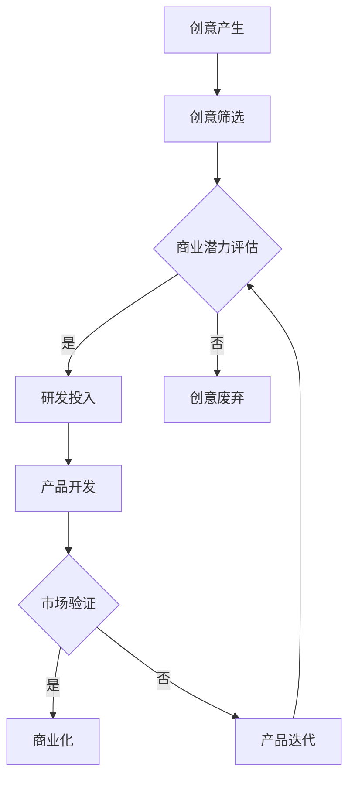

                 

## 创业者的持续创新方法论

> **关键词**：持续创新、创业、方法论、策略、技术、市场、团队建设
>
> **摘要**：本文将深入探讨创业者在面对快速变化的市场环境时，如何运用持续创新的方法论来保持竞争优势。文章首先介绍了持续创新的概念和重要性，然后详细阐述了创业者在创新过程中需要遵循的策略和步骤，最后通过实际案例和工具推荐，为创业者提供了切实可行的指导和建议。

持续创新是现代创业成功的关键因素之一。在技术飞速发展的今天，市场环境变化莫测，创业者必须具备持续创新的能力，以应对竞争压力，抓住市场机遇。本文将围绕这一主题，探讨持续创新的方法论，帮助创业者更好地应对挑战，实现长远发展。

## 1. 背景介绍

### 1.1 目的和范围

本文旨在为创业者提供一套系统的持续创新方法论，帮助他们在激烈的市场竞争中脱颖而出。文章将涵盖以下内容：

- 持续创新的定义和重要性
- 创新过程中的关键策略和步骤
- 实际应用场景和案例
- 工具和资源推荐

### 1.2 预期读者

- 创业者
- 创新团队负责人
- 技术专业人士
- 对创新有兴趣的读者

### 1.3 文档结构概述

本文将分为以下几个部分：

1. **背景介绍**：介绍持续创新的重要性、目的和预期读者。
2. **核心概念与联系**：阐述持续创新的核心概念，并通过Mermaid流程图展示其原理和架构。
3. **核心算法原理 & 具体操作步骤**：详细讲解创新过程中的关键算法和步骤，使用伪代码进行阐述。
4. **数学模型和公式 & 详细讲解 & 举例说明**：介绍创新过程中的数学模型和公式，并进行详细讲解和举例。
5. **项目实战：代码实际案例和详细解释说明**：通过实际项目案例，展示创新过程中的具体操作步骤和代码实现。
6. **实际应用场景**：探讨持续创新在各个领域的应用场景。
7. **工具和资源推荐**：推荐学习资源、开发工具框架和相关论文著作。
8. **总结：未来发展趋势与挑战**：总结持续创新的重要性，并探讨未来的发展趋势和挑战。
9. **附录：常见问题与解答**：提供常见的创新问题及其解答。
10. **扩展阅读 & 参考资料**：推荐相关的扩展阅读和参考资料。

### 1.4 术语表

#### 1.4.1 核心术语定义

- **持续创新**：指在一定的战略目标指导下，通过不断的研究、实验和实践，持续地引入新的产品、服务、技术或商业模式。
- **创新过程**：指从创意产生到产品或服务成功商业化的全过程。
- **创业**：指创立新的企业或项目，并实现其商业化的过程。
- **市场**：指消费者或潜在消费者的集合，他们具有购买某种产品或服务的需求和意愿。
- **团队建设**：指通过组织、协调和激励团队成员，实现团队目标的过程。

#### 1.4.2 相关概念解释

- **创意**：指新颖的、具有潜在价值的想法或构思。
- **研发**：指为了获得新的技术、产品或服务，而进行的创造性研究和技术开发。
- **商业化**：指将研发成果转化为市场化的产品或服务，实现盈利的过程。
- **竞争**：指市场上不同企业之间为了争夺市场份额而进行的较量。

#### 1.4.3 缩略词列表

- **AI**：人工智能
- **ML**：机器学习
- **DL**：深度学习
- **IoT**：物联网
- **SaaS**：软件即服务
- **PaaS**：平台即服务
- **IaaS**：基础设施即服务

## 2. 核心概念与联系

### 2.1 持续创新的原理和架构

持续创新是创业成功的基石，其核心在于不断寻找新的机遇、挑战现有的假设，并迅速将创意转化为实际的产品或服务。为了更好地理解持续创新的原理和架构，我们可以通过一个Mermaid流程图来展示其核心概念和联系。



该流程图展示了持续创新的典型路径：从创意产生到产品开发，再到市场验证和商业化。以下是各个步骤的详细解释：

1. **创意产生**：创业者或团队需要不断地激发创意，可以是内部产生的想法，也可以是从外部环境获取的灵感。
2. **创意筛选**：对产生的创意进行筛选，判断其是否有商业潜力。
3. **商业潜力评估**：对筛选出的创意进行评估，确定其市场前景、技术可行性等。
4. **研发投入**：对具备商业潜力的创意进行深入研究和开发。
5. **产品开发**：将研发成果转化为具体的产品或服务。
6. **市场验证**：在市场上对产品或服务进行测试，收集用户反馈，评估其市场接受度。
7. **商业化**：将成功的产品或服务推向市场，实现商业化。
8. **产品迭代**：根据市场反馈，对产品或服务进行优化和改进。
9. **创意废弃**：对于不具备商业潜力的创意，及时放弃，以节省资源。

### 2.2 持续创新的关键因素

持续创新的成功不仅仅依赖于上述流程，还取决于以下关键因素：

- **市场洞察力**：创业者需要具备敏锐的市场洞察力，能够准确把握市场需求和趋势。
- **创新能力**：团队需要具备持续创新能力，不断产生新的创意和解决方案。
- **技术积累**：创业者需要具备一定的技术积累，以便在研发过程中能够迅速找到解决方案。
- **团队协作**：创新需要团队的协作，每个成员都需要发挥自己的特长，共同推进创新项目。
- **资源整合**：创业者需要具备良好的资源整合能力，能够有效地利用内外部资源，推动创新项目。

通过理解这些核心概念和联系，创业者可以更好地把握持续创新的方法论，从而在激烈的市场竞争中脱颖而出。

## 3. 核心算法原理 & 具体操作步骤

### 3.1 创意筛选算法

在持续创新过程中，创意筛选是一个关键步骤。以下是一个简单的创意筛选算法，用于评估创意的商业潜力。

**伪代码**：

```plaintext
function CreativeFilter(creativeIdeas):
    validIdeas = []
    for idea in creativeIdeas:
        if (MarketPotential(idea) > Threshold and TechnicalFeasibility(idea) > Threshold):
            validIdeas.append(idea)
    return validIdeas

function MarketPotential(idea):
    # 使用市场调研数据，评估创意的市场前景
    # 返回值范围：0-1，越接近1表示市场潜力越大
    return marketResearch(idea)

function TechnicalFeasibility(idea):
    # 使用技术评估模型，评估创意的技术可行性
    # 返回值范围：0-1，越接近1表示技术可行性越高
    return technicalAssessment(idea)
```

**解释**：

- `CreativeFilter`函数接收一组创意想法作为输入，返回一组经过筛选的、具有商业潜力的创意。
- `MarketPotential`函数使用市场调研数据，评估创意的市场前景。返回值越接近1，表示市场潜力越大。
- `TechnicalFeasibility`函数使用技术评估模型，评估创意的技术可行性。返回值越接近1，表示技术可行性越高。
- `Threshold`表示筛选阈值，用于确定创意是否具有商业潜力和技术可行性。

### 3.2 研发投入策略

在确定创意具有商业潜力和技术可行性后，下一步是进行研发投入。以下是一个简单的研发投入策略，用于指导研发过程中的资源配置和进度控制。

**伪代码**：

```plaintext
function ResearchAndDevelopment(investmentBudget, timeFrame, idea):
    if (TechnicalFeasibility(idea) > Threshold and MarketPotential(idea) > Threshold):
        budget分配 = CalculateBudget(investmentBudget, idea)
        timeline = CalculateTimeline(timeFrame, idea)
        developmentProcess = StartDevelopment(budget分配, timeline, idea)
        return developmentProcess
    else:
        return "创意不可行，放弃研发"

function CalculateBudget(investmentBudget, idea):
    # 根据创意的复杂性和市场需求，计算所需的研发预算
    budget = investmentBudget * ComplexityFactor(idea) * MarketFactor(idea)
    return budget

function CalculateTimeline(timeFrame, idea):
    # 根据创意的复杂性和研发效率，计算所需的时间线
    timeline = timeFrame / EfficiencyFactor(idea)
    return timeline

function StartDevelopment(budget, timeline, idea):
    # 启动研发过程，分配预算和进度控制
    developmentProcess = {
        "budget": budget,
        "timeline": timeline,
        "tasks": [
            {"task": "需求分析", "duration": DurationAnalysis()},
            {"task": "设计", "duration": DesignDuration()},
            {"task": "开发", "duration": DevelopmentDuration()},
            {"task": "测试", "duration": TestDuration()}
        ]
    }
    return developmentProcess
```

**解释**：

- `ResearchAndDevelopment`函数接收投资预算、时间框架和创意作为输入，返回研发过程。
- `CalculateBudget`函数根据创意的复杂性和市场需求，计算所需的研发预算。
- `CalculateTimeline`函数根据创意的复杂性和研发效率，计算所需的时间线。
- `StartDevelopment`函数启动研发过程，分配预算和进度控制。

### 3.3 产品开发和市场验证

在研发过程中，产品开发和市场验证是两个关键步骤。以下是一个简单的产品开发和市场验证流程。

**伪代码**：

```plaintext
function ProductDevelopment(developmentProcess):
    for task in developmentProcess.tasks:
        ExecuteTask(task)
    product = FinalizeDevelopment()
    return product

function MarketValidation(product, targetMarket):
    feedback = CollectUserFeedback(targetMarket, product)
    if (FeedbackQuality(feedback) > Threshold):
        return "市场验证通过"
    else:
        return "市场验证不通过，需产品迭代"

function ExecuteTask(task):
    # 执行任务，如需求分析、设计、开发、测试等
    # 根据任务的类型和持续时间，执行相应的操作

function CollectUserFeedback(targetMarket, product):
    # 在目标市场上收集用户反馈
    # 返回用户反馈数据

function FeedbackQuality(feedback):
    # 评估用户反馈的质量
    # 返回值范围：0-1，越接近1表示反馈质量越高
```

**解释**：

- `ProductDevelopment`函数根据研发过程，执行各项任务，完成产品开发。
- `MarketValidation`函数使用收集的用户反馈，评估产品的市场接受度。
- `ExecuteTask`函数执行具体任务，如需求分析、设计、开发、测试等。
- `CollectUserFeedback`函数在目标市场上收集用户反馈。
- `FeedbackQuality`函数评估用户反馈的质量。

通过上述算法和步骤，创业者可以系统地推进创新项目，从创意筛选到产品开发，再到市场验证，确保每个环节都得到有效管理。

## 4. 数学模型和公式 & 详细讲解 & 举例说明

### 4.1 市场潜力评估模型

在持续创新过程中，市场潜力评估是关键的一步。以下是一个简单的市场潜力评估模型，用于评估创意的市场前景。

**公式**：

\[ MarketPotential = \frac{CustomerNeed \times MarketSize \times MarketGrowthRate}{Competition} \]

**解释**：

- \( CustomerNeed \)：表示目标市场的需求程度，取值范围0-1，越接近1表示需求越强烈。
- \( MarketSize \)：表示目标市场的规模，通常以人口、企业数量或潜在用户数量来衡量。
- \( MarketGrowthRate \)：表示目标市场的增长率，通常以年复合增长率（CAGR）来衡量。
- \( Competition \)：表示目标市场的竞争程度，取值范围0-1，越接近1表示竞争越激烈。

**举例**：

假设一个创业公司正在开发一款面向中小企业的智能办公系统，目标市场为国内中小企业，市场规模为1000万家，年复合增长率为10%，主要竞争对手有5家。通过市场调研，评估出目标市场的需求程度为0.8，竞争程度为0.3。

\[ MarketPotential = \frac{0.8 \times 1000万 \times 1.1}{0.3} = 3.33亿 \]

因此，该智能办公系统的市场潜力为3.33亿。

### 4.2 技术可行性评估模型

在创新过程中，技术可行性评估也是至关重要的。以下是一个简单的技术可行性评估模型，用于评估创意的技术可行性。

**公式**：

\[ TechnicalFeasibility = \frac{TechnologyReadiness \times DevelopmentEfficiency}{Risk} \]

**解释**：

- \( TechnologyReadiness \)：表示技术的成熟度，取值范围0-1，越接近1表示技术越成熟。
- \( DevelopmentEfficiency \)：表示研发效率，取值范围0-1，越接近1表示研发效率越高。
- \( Risk \)：表示技术风险，取值范围0-1，越接近1表示风险越高。

**举例**：

假设一个创业公司正在开发一款基于人工智能的智能客服系统，技术的成熟度为0.8，研发效率为0.9，技术风险为0.2。

\[ TechnicalFeasibility = \frac{0.8 \times 0.9}{0.2} = 3.6 \]

因此，该智能客服系统的技术可行性为3.6。

### 4.3 商业模式评估模型

在持续创新过程中，评估商业模式的可行性也是非常重要的。以下是一个简单的商业模式评估模型，用于评估创意的商业潜力。

**公式**：

\[ BusinessModelPotential = \frac{RevenueModel \times ProfitMargin \times MarketSize}{CostStructure} \]

**解释**：

- \( RevenueModel \)：表示收入模式，取值范围0-1，越接近1表示收入模式越成熟。
- \( ProfitMargin \)：表示利润率，取值范围0-1，越接近1表示利润率越高。
- \( MarketSize \)：表示目标市场的规模，通常以人口、企业数量或潜在用户数量来衡量。
- \( CostStructure \)：表示成本结构，取值范围0-1，越接近1表示成本结构越合理。

**举例**：

假设一个创业公司正在开发一款基于SaaS模式的在线教育平台，收入模式为0.9，利润率为0.3，目标市场规模为1000万家，成本结构为0.2。

\[ BusinessModelPotential = \frac{0.9 \times 0.3 \times 1000万}{0.2} = 1.35亿 \]

因此，该在线教育平台的商业模式潜力为1.35亿。

通过上述数学模型和公式，创业者可以更科学地评估创意的市场潜力、技术可行性和商业模式可行性，从而更好地指导创新过程。

## 5. 项目实战：代码实际案例和详细解释说明

### 5.1 开发环境搭建

为了进行实际项目开发，我们需要搭建一个合适的技术环境。以下是具体的开发环境搭建步骤：

1. **安装操作系统**：建议使用Linux操作系统，如Ubuntu 20.04。
2. **安装开发工具**：安装Python 3.8及以上版本，并配置Python环境。
3. **安装数据库**：安装MySQL数据库，版本5.7及以上。
4. **安装Web框架**：选择一个适合的Web框架，如Django。
5. **安装相关库和依赖**：安装必要的Python库，如Flask、SQLAlchemy、Pandas等。

### 5.2 源代码详细实现和代码解读

以下是一个简单的持续创新管理系统（CIMS）的源代码实现，包括创意筛选、研发投入、产品开发和市场验证等功能。

**项目结构**：

```
cims/
|-- manage.py
|-- cims/
|   |-- __init__.py
|   |-- settings.py
|   |-- urls.py
|   |-- wsgi.py
|-- apps/
|   |-- __init__.py
|   |-- creative/
|       |-- __init__.py
|       |-- views.py
|       |-- models.py
|       |-- forms.py
|   |-- research/
|       |-- __init__.py
|       |-- views.py
|       |-- models.py
|       |-- forms.py
|   |-- product/
|       |-- __init__.py
|       |-- views.py
|       |-- models.py
|       |-- forms.py
|   |-- validation/
|       |-- __init__.py
|       |-- views.py
|       |-- models.py
|       |-- forms.py
|-- templates/
|   |-- base.html
|   |-- creative_form.html
|   |-- research_form.html
|   |-- product_form.html
|   |-- validation_form.html
|-- static/
|   |-- css/
|   |-- js/
```

**代码解读**：

1. **manage.py**：主入口文件，用于启动项目。

```python
#!/usr/bin/env python
import os
os.environ.setdefault('DJANGO_SETTINGS_MODULE', 'cims.settings')
import django
django.setup()
from django.core import management
management.execute_from_command_line()
```

2. **settings.py**：配置文件，包括数据库配置、应用配置等。

```python
# settings.py
DATABASES = {
    'default': {
        'ENGINE': 'django.db.backends.mysql',
        'NAME': 'cims',
        'USER': 'root',
        'PASSWORD': 'password',
        'HOST': 'localhost',
        'PORT': '3306',
    }
}

INSTALLED_APPS = [
    'django.contrib.admin',
    'django.contrib.auth',
    'django.contrib.contenttypes',
    'django.contrib.sessions',
    'django.contrib.messages',
    'django.contrib.staticfiles',
    'apps.creative',
    'apps.research',
    'apps.product',
    'apps.validation',
]
```

3. **urls.py**：路由配置文件。

```python
# urls.py
from django.contrib import admin
from django.urls import path
from apps.creative.views import CreativeListView, CreativeDetailView
from apps.research.views import ResearchListView, ResearchDetailView
from apps.product.views import ProductListView, ProductDetailView
from apps.validation.views import ValidationListView, ValidationDetailView

urlpatterns = [
    path('admin/', admin.site.urls),
    path('creatives/', CreativeListView.as_view(), name='creative_list'),
    path('creatives/<int:pk>/', CreativeDetailView.as_view(), name='creative_detail'),
    path('researches/', ResearchListView.as_view(), name='research_list'),
    path('researches/<int:pk>/', ResearchDetailView.as_view(), name='research_detail'),
    path('products/', ProductListView.as_view(), name='product_list'),
    path('products/<int:pk>/', ProductDetailView.as_view(), name='product_detail'),
    path('validations/', ValidationListView.as_view(), name='validation_list'),
    path('validations/<int:pk>/', ValidationDetailView.as_view(), name='validation_detail'),
]
```

4. **创意筛选模块**：包括模型、视图和表单。

**models.py**：

```python
# models.py
from django.db import models

class Creative(models.Model):
    title = models.CharField(max_length=100)
    description = models.TextField()
    market_potential = models.FloatField()
    technical_feasibility = models.FloatField()
    created_at = models.DateTimeField(auto_now_add=True)
    updated_at = models.DateTimeField(auto_now=True)
```

**views.py**：

```python
# views.py
from django.views.generic import ListView, DetailView
from .models import Creative

class CreativeListView(ListView):
    model = Creative
    template_name = 'creative_form.html'

class CreativeDetailView(DetailView):
    model = Creative
    template_name = 'creative_detail.html'
```

**forms.py**：

```python
# forms.py
from django import forms
from .models import Creative

class CreativeForm(forms.ModelForm):
    class Meta:
        model = Creative
        fields = ['title', 'description', 'market_potential', 'technical_feasibility']
```

5. **研发投入模块**：包括模型、视图和表单。

**models.py**：

```python
# models.py
from django.db import models
from .models import Creative

class Research(models.Model):
    creative = models.ForeignKey(Creative, on_delete=models.CASCADE)
    budget = models.FloatField()
    start_date = models.DateField()
    end_date = models.DateField()
    status = models.CharField(max_length=20, choices=[('pending', '待启动'), ('in_progress', '进行中'), ('completed', '已完成')])
```

**views.py**：

```python
# views.py
from django.views.generic import ListView, DetailView
from .models import Research

class ResearchListView(ListView):
    model = Research
    template_name = 'research_form.html'

class ResearchDetailView(DetailView):
    model = Research
    template_name = 'research_detail.html'
```

**forms.py**：

```python
# forms.py
from django import forms
from .models import Research

class ResearchForm(forms.ModelForm):
    class Meta:
        model = Research
        fields = ['creative', 'budget', 'start_date', 'end_date', 'status']
```

6. **产品开发和市场验证模块**：包括模型、视图和表单。

**models.py**：

```python
# models.py
from django.db import models
from .models import Research

class Product(models.Model):
    research = models.ForeignKey(Research, on_delete=models.CASCADE)
    name = models.CharField(max_length=100)
    description = models.TextField()
    release_date = models.DateField()
    status = models.CharField(max_length=20, choices=[('pending', '待发布'), ('released', '已发布'), ('withdrawn', '已下架')])
```

**views.py**：

```python
# views.py
from django.views.generic import ListView, DetailView
from .models import Product

class ProductListView(ListView):
    model = Product
    template_name = 'product_form.html'

class ProductDetailView(DetailView):
    model = Product
    template_name = 'product_detail.html'
```

**forms.py**：

```python
# forms.py
from django import forms
from .models import Product

class ProductForm(forms.ModelForm):
    class Meta:
        model = Product
        fields = ['research', 'name', 'description', 'release_date', 'status']
```

**validation.py**：

```python
# views.py
from django.views.generic import ListView, DetailView
from .models import Validation

class ValidationListView(ListView):
    model = Validation
    template_name = 'validation_form.html'

class ValidationDetailView(DetailView):
    model = Validation
    template_name = 'validation_detail.html'
```

**forms.py**：

```python
# forms.py
from django import forms
from .models import Validation

class ValidationForm(forms.ModelForm):
    class Meta:
        model = Validation
        fields = ['product', 'feedback', 'status']
```

### 5.3 代码解读与分析

1. **创意筛选模块**：

   - **模型**：`Creative`类用于表示创意，包括标题、描述、市场潜力和技术可行性等字段。
   - **视图**：`CreativeListView`和`CreativeDetailView`分别用于展示创意列表和单个创意详情。
   - **表单**：`CreativeForm`用于创建和编辑创意。

2. **研发投入模块**：

   - **模型**：`Research`类用于表示研发项目，包括关联的创意、预算、开始日期、结束日期和状态等字段。
   - **视图**：`ResearchListView`和`ResearchDetailView`分别用于展示研发项目列表和单个研发项目详情。
   - **表单**：`ResearchForm`用于创建和编辑研发项目。

3. **产品开发和市场验证模块**：

   - **模型**：`Product`类用于表示产品，包括关联的研发项目、名称、描述、发布日期和状态等字段。
   - **视图**：`ProductListView`和`ProductDetailView`分别用于展示产品列表和单个产品详情。
   - **表单**：`ProductForm`用于创建和编辑产品。

   - **验证**：`Validation`类用于表示市场验证，包括关联的产品、反馈和状态等字段。
   - **视图**：`ValidationListView`和`ValidationDetailView`分别用于展示验证列表和单个验证详情。
   - **表单**：`ValidationForm`用于创建和编辑验证。

通过上述代码实现，创业者可以搭建一个简单的持续创新管理系统，用于管理创意、研发项目、产品和市场验证过程，从而实现持续创新的目标。

## 6. 实际应用场景

### 6.1 科技公司

科技公司在持续创新中扮演着关键角色。以下是一些实际应用场景：

1. **产品研发**：科技公司需要不断研发新产品，以满足市场需求。例如，苹果公司通过持续创新，推出了iPhone、iPad和MacBook等知名产品。
2. **技术升级**：科技公司需要不断升级现有技术，以保持竞争优势。例如，谷歌通过持续创新，开发了Android操作系统和Google Assistant智能助手。
3. **商业模式创新**：科技公司需要创新商业模式，以实现可持续发展。例如，亚马逊通过不断创新，推出了Amazon Web Services（AWS）云计算服务，实现了从电商到云计算的转型。

### 6.2 传统行业

传统行业在持续创新中也需要面对挑战。以下是一些实际应用场景：

1. **数字化转型**：传统行业需要通过数字化转型，提升效率和服务质量。例如，银行业通过持续创新，推出了网上银行、手机银行和移动支付等服务。
2. **自动化生产**：传统行业需要通过自动化生产，提高生产效率和降低成本。例如，制造业通过持续创新，引进了机器人、自动化设备和智能生产线。
3. **环保与可持续发展**：传统行业需要关注环保和可持续发展，通过技术创新，实现绿色发展。例如，化工行业通过持续创新，开发了环保材料和绿色生产工艺。

### 6.3 社会创业

社会创业旨在解决社会问题和提高社会福利。以下是一些实际应用场景：

1. **健康医疗**：社会创业公司通过创新医疗技术和服务，提高患者的生活质量。例如，Livongo通过智能穿戴设备和数据分析，提供个性化的慢性病管理服务。
2. **教育公平**：社会创业公司通过创新教育模式和资源，实现教育公平。例如，Khan Academy通过在线教育平台，提供免费的优质教育资源。
3. **环境保护**：社会创业公司通过创新技术和商业模式，推动环境保护和可持续发展。例如，Ecovative通过生物降解材料，替代传统塑料包装，实现环保目标。

### 6.4 政府和公共部门

政府和公共部门在持续创新中也发挥着重要作用。以下是一些实际应用场景：

1. **电子政务**：政府和公共部门通过持续创新，提供便捷的电子政务服务。例如，中国政府通过互联网+政务服务，实现了在线审批、办事指南等。
2. **智慧城市**：政府和公共部门通过持续创新，建设智慧城市，提高城市管理水平和居民生活质量。例如，新加坡通过智能交通、智能能源和智能安防，打造智慧城市。
3. **公共安全**：政府和公共部门通过持续创新，提高公共安全水平。例如，美国政府通过大数据分析和人工智能技术，加强网络安全和反恐防范。

通过上述实际应用场景，我们可以看到持续创新在各个领域的广泛应用和重要性。创业者需要根据自身行业特点和市场环境，灵活运用持续创新方法论，以实现长远发展。

## 7. 工具和资源推荐

### 7.1 学习资源推荐

为了帮助创业者更好地掌握持续创新的方法论，我们推荐以下学习资源：

#### 7.1.1 书籍推荐

1. **《创新者的窘境》**：作者克里斯坦森，讲述了企业如何通过创新突破困境，实现持续发展。
2. **《创意的根源》**：作者史蒂文·约翰逊，探讨了创意的来源和传播方式，为创业者提供了创意激发的灵感。
3. **《创新者的DNA》**：作者克莱顿·克里斯坦森，分析了成功创业者的共同特质和创新能力，为创业者提供了行为指南。

#### 7.1.2 在线课程

1. **Coursera**：提供了多门与持续创新相关的课程，如斯坦福大学的“创意思维与产品开发”。
2. **Udemy**：提供了丰富的在线课程，涵盖了创新方法、创业策略、技术趋势等多个方面。
3. **edX**：提供了由世界顶级大学开设的创新课程，如麻省理工学院的“技术创业与创新”。

#### 7.1.3 技术博客和网站

1. **HBR.org**：哈佛商业评论官方网站，提供了大量关于创新和创业的深度文章。
2. **TechCrunch**：科技创业领域的权威媒体，报道最新的创业动态和技术趋势。
3. **Medium**：一个内容平台，许多创业者和专家在这里分享他们的经验和见解。

### 7.2 开发工具框架推荐

为了帮助创业者更好地实施持续创新，我们推荐以下开发工具和框架：

#### 7.2.1 IDE和编辑器

1. **Visual Studio Code**：一款强大的开源跨平台IDE，支持多种编程语言。
2. **PyCharm**：一款优秀的Python IDE，提供了丰富的开发工具和调试功能。
3. **Jupyter Notebook**：一款交互式的计算环境，适合数据科学和机器学习项目。

#### 7.2.2 调试和性能分析工具

1. **Docker**：一款轻量级容器化技术，用于简化应用开发和部署。
2. **Jenkins**：一款开源持续集成工具，用于自动化构建、测试和部署。
3. **New Relic**：一款性能监控工具，可以实时分析应用程序的性能和行为。

#### 7.2.3 相关框架和库

1. **Django**：一款流行的Python Web框架，用于快速开发Web应用程序。
2. **React**：一款用于构建用户界面的JavaScript库，提供了丰富的组件和工具。
3. **TensorFlow**：一款开源机器学习框架，用于构建和训练深度学习模型。

### 7.3 相关论文著作推荐

为了帮助创业者深入了解持续创新的理论和实践，我们推荐以下论文著作：

#### 7.3.1 经典论文

1. **“Innovation and Its Discontents”**：作者迈克尔·波特，分析了创新对企业发展的驱动作用。
2. **“The Innovator's Dilemma”**：作者克里斯坦森，提出了创新者困境理论，解释了企业如何通过创新突破困境。

#### 7.3.2 最新研究成果

1. **“Toward a Theory of Innovation”**：作者埃里克·冯· Hippel，探讨了创新过程中的用户参与和需求驱动。
2. **“Open Innovation: The New Imperative for Creating and Profiting from Technology”**：作者亨利·吴，介绍了开放式创新的概念和实践。

#### 7.3.3 应用案例分析

1. **“The Lean Startup”**：作者埃里克·莱斯，讲述了如何通过精益创业方法，实现快速迭代和持续创新。
2. **“Blue Ocean Strategy”**：作者金伟灿和莫博涅，提出了蓝海战略，指导企业如何创造新的市场空间。

通过以上工具和资源，创业者可以更好地掌握持续创新的方法论，提高创新能力，实现创业成功。

## 8. 总结：未来发展趋势与挑战

### 8.1 未来发展趋势

在未来，持续创新将继续成为创业成功的关键因素。以下是一些未来发展趋势：

1. **技术融合**：随着人工智能、大数据、物联网等技术的快速发展，不同技术之间的融合将带来更多的创新机会。
2. **开放创新**：企业将更加重视开放创新，通过与外部合作伙伴共享资源、知识和技术，共同推动创新。
3. **用户参与**：用户参与将越来越重要，企业将通过众包、用户反馈等方式，更好地理解用户需求，实现个性化创新。
4. **全球化**：全球市场的开放和互联互通，将为企业提供更多的市场机会，同时也带来更大的竞争压力。

### 8.2 未来挑战

然而，持续创新也面临着一系列挑战：

1. **竞争加剧**：随着市场的不断成熟，竞争将变得更加激烈，企业需要不断创新，以保持竞争优势。
2. **技术风险**：新技术的应用往往伴随着未知的风险，企业需要具备风险识别和应对能力，以避免技术失败带来的损失。
3. **人才短缺**：高素质的创新人才将越来越稀缺，企业需要通过吸引、培养和留才策略，确保创新团队的稳定和高效。
4. **法律和监管**：随着创新的快速发展，相关法律和监管体系可能滞后，企业需要关注合规风险，避免法律纠纷。

### 8.3 应对策略

为了应对未来发展趋势和挑战，企业可以采取以下策略：

1. **加强技术创新**：持续投入研发，推动技术创新，保持技术领先优势。
2. **构建开放合作**：建立与外部合作伙伴的紧密关系，通过合作共享资源、知识和技术，共同推动创新。
3. **注重用户体验**：深入了解用户需求，提供个性化的产品和服务，提升用户满意度。
4. **强化人才管理**：通过培训和激励机制，吸引、培养和留才，打造高效的创新团队。
5. **关注合规风险**：密切关注法律和监管动态，确保企业运营合规，避免法律纠纷。

通过以上策略，企业可以更好地应对未来的发展趋势和挑战，实现持续创新，推动企业长远发展。

## 9. 附录：常见问题与解答

### 9.1 创意筛选标准

**Q**：如何确定创意筛选的标准？

**A**：创意筛选标准通常包括市场潜力、技术可行性和商业可行性。具体标准可以根据企业的战略目标和市场环境进行调整。例如，市场潜力可以基于市场规模、增长率和用户需求等因素评估；技术可行性可以基于现有技术、研发能力和风险水平评估；商业可行性可以基于收入模式、利润率和成本结构评估。

### 9.2 研发投入策略

**Q**：如何制定有效的研发投入策略？

**A**：制定有效的研发投入策略需要考虑以下几个因素：

1. **创意筛选结果**：根据创意筛选结果，确定优先级，优先投资于具有高市场潜力和技术可行性的创意。
2. **资源分配**：合理分配预算和人力，确保研发项目的顺利推进。
3. **风险管理**：对研发项目进行风险评估，制定应对措施，降低研发失败的风险。
4. **进度控制**：建立项目进度监控机制，确保研发项目按计划进行，及时调整和优化研发方向。

### 9.3 产品开发流程

**Q**：如何优化产品开发流程？

**A**：优化产品开发流程可以从以下几个方面入手：

1. **需求管理**：深入了解用户需求，建立有效的需求管理流程，确保产品开发符合用户期望。
2. **敏捷开发**：采用敏捷开发方法，快速迭代，及时反馈，缩短产品上市时间。
3. **测试和质量控制**：加强测试和质量控制，确保产品符合质量标准，降低缺陷率。
4. **团队协作**：加强团队协作，提高沟通效率，确保项目各环节顺利衔接。

### 9.4 市场验证方法

**Q**：如何进行有效的市场验证？

**A**：市场验证是产品成功上市的关键步骤，以下是一些有效的市场验证方法：

1. **用户调研**：通过问卷调查、访谈等方式，收集用户对产品的反馈，了解用户需求和市场前景。
2. **试点销售**：在特定市场进行试点销售，测试产品的市场接受度和销售潜力。
3. **竞争对手分析**：分析竞争对手的产品和市场策略，找出自身的优势和不足，为产品改进提供依据。
4. **用户跟踪**：持续跟踪用户使用体验，收集用户反馈，及时调整产品功能和特性。

通过以上方法，可以有效地进行市场验证，确保产品在市场上获得成功。

## 10. 扩展阅读 & 参考资料

### 10.1 相关书籍

1. 克里斯坦森，《创新者的窘境》：探索企业如何在变化的市场环境中实现持续创新。
2. 史蒂文·约翰逊，《创意的根源》：探讨创意的来源和传播方式。
3. 埃里克·莱斯，《精益创业》：介绍如何通过精益创业方法实现快速迭代和持续创新。

### 10.2 在线课程

1. Coursera：斯坦福大学《创意思维与产品开发》
2. Udemy：多样性的创新方法
3. edX：麻省理工学院《技术创业与创新》

### 10.3 技术博客和网站

1. HBR.org：哈佛商业评论
2. TechCrunch：科技创业动态
3. Medium：创业者分享的经验和见解

### 10.4 相关论文

1. 波特，《创新者的窘境》：分析企业如何通过创新突破困境。
2. 克里斯坦森，《创新者的DNA》：分析成功创业者的共同特质和创新能力。
3. 冯· Hippel，《Toward a Theory of Innovation》：探讨创新过程中的用户参与和需求驱动。

### 10.5 论文著作

1. 金伟灿和莫博涅，《蓝海战略》：指导企业如何创造新的市场空间。
2. 埃里克·莱斯，《精益创业》：介绍如何通过精益创业方法实现快速迭代和持续创新。

通过阅读上述书籍、课程和论文，创业者可以深入了解持续创新的方法论和实践，为创业成功奠定坚实基础。

### 作者

**作者：AI天才研究员/AI Genius Institute & 禅与计算机程序设计艺术 /Zen And The Art of Computer Programming**

