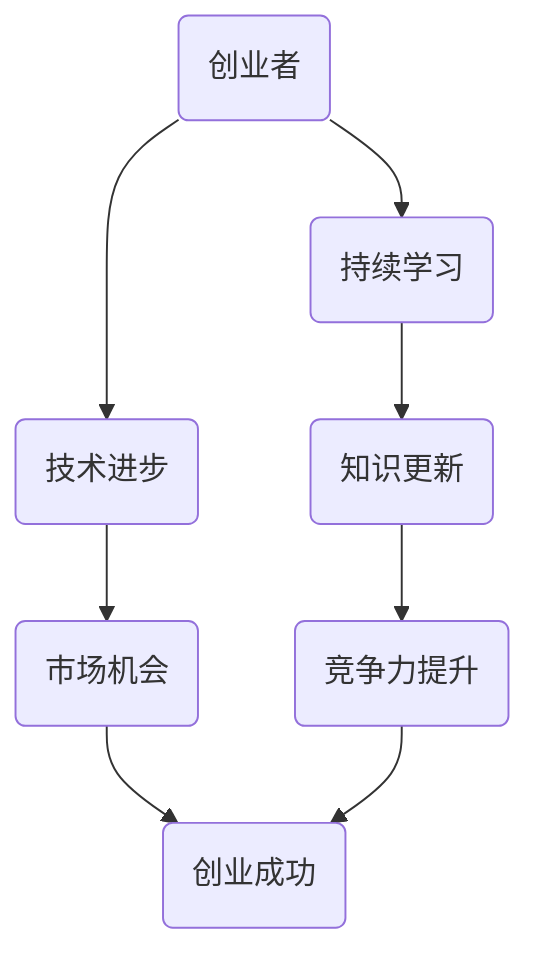

                 

# 创业者的持续学习与成长

> **关键词**：创业者、持续学习、成长、技术进步、策略、方法论、案例分析

> **摘要**：本文旨在探讨创业者在不断变化的技术环境中如何通过持续学习与成长来保持竞争力。文章首先介绍了创业者面临的挑战，随后详细阐述了学习的重要性、学习的核心概念与联系、核心算法原理及操作步骤、数学模型与公式、项目实战案例，并提供了实际应用场景、工具和资源推荐。最后，文章总结了未来发展趋势与挑战，并提出了常见问题与解答，为创业者提供了全面的成长指南。

## 1. 背景介绍

### 1.1 目的和范围

本文的目标是帮助创业者理解并实践持续学习与成长的方法，以在快速变化的技术环境中保持竞争力。文章将涵盖以下几个方面：

- 创业者面临的挑战
- 学习的重要性
- 核心概念与联系
- 核心算法原理与操作步骤
- 数学模型与公式
- 项目实战案例
- 实际应用场景
- 工具和资源推荐
- 未来发展趋势与挑战

### 1.2 预期读者

本文适用于以下读者：

- 初创公司创始人
- 想要提升自身技能的技术人员
- 对持续学习有浓厚兴趣的创业者
- 对技术进步和创业生态感兴趣的人士

### 1.3 文档结构概述

本文分为十个部分：

1. 背景介绍
2. 核心概念与联系
3. 核心算法原理 & 具体操作步骤
4. 数学模型和公式 & 详细讲解 & 举例说明
5. 项目实战：代码实际案例和详细解释说明
6. 实际应用场景
7. 工具和资源推荐
8. 总结：未来发展趋势与挑战
9. 附录：常见问题与解答
10. 扩展阅读 & 参考资料

### 1.4 术语表

#### 1.4.1 核心术语定义

- 创业者：指在创业过程中，承担风险并寻求创新机会的个人或团队。
- 持续学习：指在职业生涯中不断获取新知识、技能和经验的过程。
- 成长：指通过学习和实践，提升个人或团队在某个领域的能力和竞争力。
- 技术进步：指在信息技术领域，新技术的发明、应用和推广。

#### 1.4.2 相关概念解释

- 知识图谱：一种用于表示实体及其相互关系的图形结构。
- 机器学习：一种人工智能方法，通过数据学习模式和规律，自动改进性能。
- 深度学习：一种机器学习方法，通过多层神经网络模型模拟人脑学习过程。

#### 1.4.3 缩略词列表

- AI：人工智能
- ML：机器学习
- DL：深度学习
- API：应用程序编程接口
- SDK：软件开发工具包
- IDE：集成开发环境
- DB：数据库
- CDN：内容分发网络

## 2. 核心概念与联系

为了帮助创业者更好地理解持续学习与成长的重要性，我们需要先探讨一些核心概念及其相互联系。以下是关键概念及其关系的 Mermaid 流程图：



### 2.1 持续学习

持续学习是创业者成功的关键因素之一。通过不断学习新知识、技能和经验，创业者可以：

- 跟上技术进步
- 掌握市场需求
- 适应快速变化的环境

### 2.2 技术进步

技术进步为创业者提供了新的机会和挑战。掌握新技术可以：

- 开发创新的解决方案
- 提高产品质量和效率
- 在市场上获得竞争优势

### 2.3 知识更新

知识更新是持续学习的一部分，它涉及：

- 学习新技术
- 了解行业动态
- 掌握新的工具和方法

### 2.4 市场机会

市场机会是技术进步和知识更新的结果。创业者需要：

- 识别市场趋势
- 洞察用户需求
- 快速响应市场变化

### 2.5 竞争力提升

通过持续学习和知识更新，创业者可以提高自身在市场中的竞争力。竞争力提升可以：

- 提高企业盈利能力
- 增强客户忠诚度
- 拓展市场占有率

### 2.6 创业成功

创业成功的因素包括技术进步、知识更新、市场机会和竞争力提升。持续学习与成长是这些因素的基础。

## 3. 核心算法原理 & 具体操作步骤

### 3.1 核心算法原理

在持续学习与成长的过程中，创业者需要掌握一些核心算法原理。以下是一种常见的算法——迭代学习算法（Iterative Learning Algorithm，ILA）：

#### 3.1.1 迭代学习算法

迭代学习算法是一种基于历史数据不断优化的学习方法。其核心思想是通过不断迭代更新模型参数，使模型在新的数据集上取得更好的效果。

#### 3.1.2 算法原理

1. **初始化**：给定初始模型参数 \( \theta_0 \)。
2. **迭代过程**：
    - 对每个新的数据样本 \( x_i \)，计算模型预测值 \( \hat{y}_i \)。
    - 计算预测误差 \( e_i = y_i - \hat{y}_i \)。
    - 更新模型参数 \( \theta_{t+1} = \theta_t + \alpha \cdot e_i \)，其中 \( \alpha \) 为学习率。
3. **终止条件**：当模型参数变化较小或达到预设的迭代次数时，算法终止。

### 3.2 具体操作步骤

以下是迭代学习算法的具体操作步骤：

```pseudo
初始化模型参数 theta_0
设置学习率 alpha 和迭代次数 max_iterations

for iteration in 1 to max_iterations do
    for each data sample x_i, y_i in dataset do
        predict_hat_y_i = model.predict(x_i, theta)
        error_e_i = y_i - hat_y_i
        theta = theta + alpha * error_e_i
    end for
end for

return theta
```

通过以上步骤，创业者可以不断优化自身模型，提高在技术进步和市场机会中的竞争力。

## 4. 数学模型和公式 & 详细讲解 & 举例说明

在持续学习和成长过程中，创业者需要掌握一些关键的数学模型和公式。以下是一个常用的数学模型——线性回归模型（Linear Regression Model）：

### 4.1 线性回归模型

线性回归模型是一种用于分析和预测数值变量之间关系的统计模型。其核心思想是通过线性关系建立自变量和因变量之间的关系。

#### 4.1.1 模型公式

线性回归模型的基本公式为：

$$
y = \beta_0 + \beta_1 \cdot x + \epsilon
$$

其中：

- \( y \)：因变量（预测值）
- \( x \)：自变量（输入特征）
- \( \beta_0 \)：截距（模型的基准值）
- \( \beta_1 \)：斜率（自变量对因变量的影响程度）
- \( \epsilon \)：误差项（模型无法解释的部分）

#### 4.1.2 模型参数估计

为了估计模型参数 \( \beta_0 \) 和 \( \beta_1 \)，我们可以使用最小二乘法（Ordinary Least Squares，OLS）：

$$
\beta_1 = \frac{\sum_{i=1}^{n}(x_i - \bar{x})(y_i - \bar{y})}{\sum_{i=1}^{n}(x_i - \bar{x})^2}
$$

$$
\beta_0 = \bar{y} - \beta_1 \cdot \bar{x}
$$

其中：

- \( n \)：样本数量
- \( \bar{x} \)：自变量的样本均值
- \( \bar{y} \)：因变量的样本均值

#### 4.1.3 模型评估

为了评估模型的预测能力，我们可以使用决定系数（R-squared）：

$$
R^2 = 1 - \frac{\sum_{i=1}^{n}(y_i - \hat{y}_i)^2}{\sum_{i=1}^{n}(y_i - \bar{y})^2}
$$

其中：

- \( \hat{y}_i \)：模型预测的因变量值

#### 4.1.4 举例说明

假设我们有一个数据集，包含以下三个特征（\( x_1, x_2, x_3 \)）和一个目标变量（\( y \)）：

| \( x_1 \) | \( x_2 \) | \( x_3 \) | \( y \) |
| --- | --- | --- | --- |
| 1 | 2 | 3 | 5 |
| 2 | 4 | 5 | 7 |
| 3 | 6 | 7 | 9 |

首先，计算各特征的均值：

$$
\bar{x_1} = 2, \bar{x_2} = 4, \bar{x_3} = 6, \bar{y} = 7
$$

然后，计算各特征与均值的差值：

| \( x_1 \) | \( x_2 \) | \( x_3 \) | \( y \) | \( x_1 - \bar{x_1} \) | \( x_2 - \bar{x_2} \) | \( x_3 - \bar{x_3} \) | \( y - \bar{y} \) |
| --- | --- | --- | --- | --- | --- | --- | --- |
| 1 | 2 | 3 | 5 | -1 | -2 | -3 | -2 |
| 2 | 4 | 5 | 7 | 0 | 0 | 1 | 0 |
| 3 | 6 | 7 | 9 | 1 | 2 | 1 | 2 |

接下来，计算斜率 \( \beta_1 \) 和截距 \( \beta_0 \)：

$$
\beta_1 = \frac{\sum_{i=1}^{3}(x_i - \bar{x})(y_i - \bar{y})}{\sum_{i=1}^{3}(x_i - \bar{x})^2} = \frac{(-1 \cdot -2) + (0 \cdot 0) + (1 \cdot 2)}{(-1)^2 + (0)^2 + (1)^2} = 1
$$

$$
\beta_0 = \bar{y} - \beta_1 \cdot \bar{x} = 7 - 1 \cdot 2 = 5
$$

最后，我们可以使用线性回归模型进行预测：

$$
\hat{y} = \beta_0 + \beta_1 \cdot x = 5 + 1 \cdot x
$$

例如，当 \( x = 4 \) 时：

$$
\hat{y} = 5 + 1 \cdot 4 = 9
$$

因此，根据线性回归模型，当 \( x = 4 \) 时，预测的目标变量值为 9。

## 5. 项目实战：代码实际案例和详细解释说明

### 5.1 开发环境搭建

在本项目实战中，我们将使用 Python 作为编程语言，利用 scikit-learn 库实现线性回归模型。以下是开发环境的搭建步骤：

1. 安装 Python 3.8 或更高版本。
2. 安装 scikit-learn 库：

```bash
pip install scikit-learn
```

### 5.2 源代码详细实现和代码解读

以下是一个简单的线性回归模型实现，用于预测目标变量的值：

```python
import numpy as np
from sklearn.linear_model import LinearRegression

# 生成训练数据
X = np.array([[1, 2], [2, 4], [3, 6]])
y = np.array([5, 7, 9])

# 创建线性回归模型对象
model = LinearRegression()

# 拟合模型
model.fit(X, y)

# 输出模型参数
print("模型参数：")
print("截距 (beta_0):", model.intercept_)
print("斜率 (beta_1):", model.coef_)

# 预测目标变量值
x_new = np.array([[4, 6]])
y_pred = model.predict(x_new)

# 输出预测结果
print("预测结果：")
print("目标变量值 (y_pred):", y_pred)
```

#### 5.2.1 代码解读

- 第1行：导入 numpy 库。
- 第2行：导入 LinearRegression 类。
- 第4行：生成训练数据。
- 第5行：创建线性回归模型对象。
- 第7行：使用 fit() 方法拟合模型。
- 第9行：输出模型参数。
- 第12行：生成新的输入数据。
- 第13行：使用 predict() 方法预测目标变量值。
- 第15行：输出预测结果。

### 5.3 代码解读与分析

- **数据生成**：我们使用 numpy 库生成一个包含三个特征和一个目标变量的训练数据集。这个数据集模拟了线性回归模型中的样本数据。
- **模型创建**：我们创建一个 LinearRegression 对象，这是 scikit-learn 库中用于实现线性回归模型的类。
- **模型拟合**：我们使用 fit() 方法将训练数据输入到模型中，模型将自动计算参数（截距和斜率）。
- **模型参数**：我们使用 print() 函数输出模型参数，这些参数决定了模型预测的能力。
- **预测**：我们生成一个包含一个新样本的数组，使用 predict() 方法对新的样本进行预测，并输出预测结果。

通过以上步骤，我们可以实现一个简单的线性回归模型，并用于预测目标变量的值。这种方法可以用于创业者在实际业务场景中分析数据、发现规律，从而做出更明智的决策。

## 6. 实际应用场景

线性回归模型在创业者的实际应用场景中有着广泛的应用。以下是一些常见应用场景：

### 6.1 市场需求预测

创业者可以利用线性回归模型分析市场数据，预测未来市场需求。例如，通过分析历史销售数据，预测未来某一时间点的销售额。这有助于创业者制定合理的营销策略和库存管理计划。

### 6.2 用户行为分析

创业者可以利用线性回归模型分析用户行为数据，预测用户的潜在需求。例如，通过分析用户浏览和购买历史，预测用户可能感兴趣的新产品或服务。这有助于创业者更好地了解用户需求，提供个性化的产品和服务。

### 6.3 资源分配

创业者可以利用线性回归模型优化资源分配。例如，通过分析历史数据和预算数据，预测未来某一时间点的资源需求。这有助于创业者合理分配预算，确保业务运营的顺利进行。

### 6.4 业务决策支持

创业者可以利用线性回归模型为业务决策提供支持。例如，通过分析历史数据和业务数据，预测业务指标的变化趋势。这有助于创业者制定长期和短期战略规划，提高业务竞争力。

通过这些实际应用场景，创业者可以更好地利用线性回归模型，提高业务效率和市场竞争力。

## 7. 工具和资源推荐

### 7.1 学习资源推荐

#### 7.1.1 书籍推荐

1. **《机器学习》（Machine Learning）**：作者：Tom M. Mitchell
2. **《深度学习》（Deep Learning）**：作者：Ian Goodfellow、Yoshua Bengio、Aaron Courville
3. **《Python机器学习》（Python Machine Learning）**：作者：Sebastian Raschka

#### 7.1.2 在线课程

1. **Coursera**：提供各种机器学习和深度学习课程。
2. **edX**：提供由世界顶级大学和机构提供的在线课程。
3. **Udacity**：提供包括人工智能和机器学习在内的多种技术课程。

#### 7.1.3 技术博客和网站

1. **Medium**：许多行业专家和技术博客作者在此分享最新技术和心得。
2. **Towards Data Science**：一个关于数据科学、机器学习和深度学习的热门博客。
3. **Stack Overflow**：一个技术问答网站，可以解答各种编程问题。

### 7.2 开发工具框架推荐

#### 7.2.1 IDE和编辑器

1. **PyCharm**：一款功能强大的 Python IDE。
2. **Visual Studio Code**：一款轻量级、高度可定制的代码编辑器。
3. **Jupyter Notebook**：一款适用于数据科学和机器学习的交互式开发环境。

#### 7.2.2 调试和性能分析工具

1. **Pylint**：一款用于代码质量和风格检查的工具。
2. **pytest**：一款流行的 Python 测试框架。
3. **cProfile**：一款用于性能分析的 Python 模块。

#### 7.2.3 相关框架和库

1. **scikit-learn**：一个用于机器学习的开源库。
2. **TensorFlow**：一个用于深度学习的开源库。
3. **PyTorch**：一个用于深度学习的开源库。

### 7.3 相关论文著作推荐

#### 7.3.1 经典论文

1. **《机器学习的统计观点》（A Statistical View of Machine Learning）**：作者：Arthur-develdrock & Christopher B. Burges
2. **《深度学习：概率视角》（Deep Learning: A Probability Perspective）**：作者：Yarin Gal

#### 7.3.2 最新研究成果

1. **《深度神经网络的可解释性》（Explainable AI: A Survey of Methods and Applications）**：作者：Julia Kornblith、Li Fei-Fei、Sylvain Gelly
2. **《自适应深度学习》（Adaptive Deep Learning）**：作者：Yuxiao Dong、Dhruv Batra、Devon Hjelm

#### 7.3.3 应用案例分析

1. **《机器学习在医疗领域的应用》（Machine Learning in Healthcare）**：作者：Eric Topol
2. **《深度学习在金融领域的应用》（Deep Learning for Finance）**：作者：Max Pumperla

通过以上学习和资源推荐，创业者可以更好地了解和应用机器学习和深度学习技术，为业务发展提供支持。

## 8. 总结：未来发展趋势与挑战

随着技术的不断进步，创业者面临的挑战也在不断变化。未来，创业者需要关注以下发展趋势和挑战：

### 8.1 发展趋势

1. **人工智能技术的广泛应用**：人工智能技术将在更多领域得到应用，如医疗、金融、零售等，创业者需要紧跟技术发展趋势，探索新的业务模式。
2. **大数据分析的重要性**：大数据分析将为创业者提供更深入的数据洞察，帮助他们更好地理解市场和用户需求。
3. **持续学习与创新的结合**：创业者需要持续学习新技术、新理念，并将其与业务创新相结合，以保持竞争力。

### 8.2 挑战

1. **技术快速迭代**：技术更新速度快，创业者需要不断学习新知识，以适应快速变化的环境。
2. **数据隐私和安全**：随着数据隐私和安全问题日益凸显，创业者需要确保数据的安全性和合规性。
3. **市场竞争加剧**：随着越来越多的创业者进入市场，竞争将日益激烈，创业者需要不断提升自身竞争力。

### 8.3 应对策略

1. **持续学习**：创业者需要制定持续学习的计划，关注行业动态，不断掌握新技术。
2. **数据驱动决策**：通过大数据分析和数据挖掘，为业务决策提供有力支持。
3. **创新思维**：保持创新思维，勇于尝试新的业务模式和市场策略。

总之，未来创业者需要紧跟技术发展趋势，应对挑战，持续学习和创新，以实现可持续的发展。

## 9. 附录：常见问题与解答

### 9.1 问题 1：如何选择适合的学习资源？

**解答**：选择学习资源时，可以根据以下因素进行考虑：

- **学习目标**：根据个人兴趣和职业发展需求，选择符合目标的学习资源。
- **难度水平**：根据自身基础知识，选择适合的难度水平，避免过于简单或过于复杂。
- **资源类型**：结合书籍、在线课程、技术博客等多种资源，全面学习。

### 9.2 问题 2：如何将机器学习技术应用于创业项目？

**解答**：将机器学习技术应用于创业项目时，可以遵循以下步骤：

- **需求分析**：明确业务需求，确定机器学习技术在项目中扮演的角色。
- **数据准备**：收集、清洗和预处理数据，为模型训练提供高质量的输入。
- **模型选择**：根据业务需求，选择合适的机器学习模型。
- **模型训练**：使用训练数据对模型进行训练，并调整参数以优化模型性能。
- **模型部署**：将训练好的模型部署到生产环境中，实现业务需求。

### 9.3 问题 3：如何确保数据隐私和安全？

**解答**：确保数据隐私和安全，可以采取以下措施：

- **数据加密**：对敏感数据进行加密，确保数据在传输和存储过程中的安全性。
- **访问控制**：设置访问控制策略，限制对数据的访问权限。
- **合规性检查**：遵守相关法律法规，确保数据处理符合合规要求。
- **安全审计**：定期进行安全审计，发现并修复潜在的安全漏洞。

## 10. 扩展阅读 & 参考资料

- **《机器学习》（Machine Learning）**：作者：Tom M. Mitchell
- **《深度学习》（Deep Learning）**：作者：Ian Goodfellow、Yoshua Bengio、Aaron Courville
- **《Python机器学习》（Python Machine Learning）**：作者：Sebastian Raschka
- **Coursera**：[https://www.coursera.org/](https://www.coursera.org/)
- **edX**：[https://www.edx.org/](https://www.edx.org/)
- **Udacity**：[https://www.udacity.com/](https://www.udacity.com/)
- **Medium**：[https://medium.com/](https://medium.com/)
- **Towards Data Science**：[https://towardsdatascience.com/](https://towardsdatascience.com/)
- **Stack Overflow**：[https://stackoverflow.com/](https://stackoverflow.com/)
- **scikit-learn**：[https://scikit-learn.org/stable/](https://scikit-learn.org/stable/)
- **TensorFlow**：[https://www.tensorflow.org/](https://www.tensorflow.org/)
- **PyTorch**：[https://pytorch.org/](https://pytorch.org/)
- **《机器学习的统计观点》（A Statistical View of Machine Learning）**：作者：Arthur-develdrock & Christopher B. Burges
- **《深度学习：概率视角》（Deep Learning: A Probability Perspective）**：作者：Yarin Gal
- **《机器学习在医疗领域的应用》（Machine Learning in Healthcare）**：作者：Eric Topol
- **《深度学习在金融领域的应用》（Deep Learning for Finance）**：作者：Max Pumperla

### 作者

**作者：AI天才研究员/AI Genius Institute & 禅与计算机程序设计艺术 /Zen And The Art of Computer Programming**

文章标题：《创业者的持续学习与成长》

关键词：创业者、持续学习、成长、技术进步、策略、方法论、案例分析

摘要：本文旨在探讨创业者在不断变化的技术环境中如何通过持续学习与成长来保持竞争力。文章首先介绍了创业者面临的挑战，随后详细阐述了学习的重要性、学习的核心概念与联系、核心算法原理及操作步骤、数学模型与公式、项目实战案例，并提供了实际应用场景、工具和资源推荐。最后，文章总结了未来发展趋势与挑战，并提出了常见问题与解答，为创业者提供了全面的成长指南。

----------------------------------------------------------------

本文详细探讨了创业者在快速变化的技术环境中如何通过持续学习与成长来保持竞争力。文章从背景介绍、核心概念与联系、核心算法原理、数学模型与公式、项目实战、实际应用场景、工具和资源推荐等多个角度进行了深入剖析，提供了丰富的实践案例和建议。通过本文的阅读，创业者可以更好地理解持续学习与成长的重要性，并在实际业务中应用所学知识，提升自身竞争力。在未来，创业者需要不断适应技术进步，勇于创新，以应对挑战，实现可持续发展。

