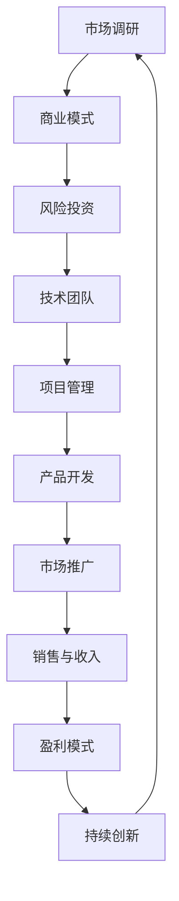

                 

# 创业者的故事：经验与教训

> **关键词：** 创业、经验、教训、IT行业、技术团队、项目管理
> 
> **摘要：** 本文通过一位资深AI技术创业者亲身经历的故事，分享了在IT行业创业过程中的宝贵经验与教训，为有志于创业的程序员和技术专家提供了实用的指导和借鉴。

## 1. 背景介绍

### 1.1 目的和范围

本文旨在通过一位资深AI技术创业者的亲身经历，探讨在IT行业创业过程中可能遇到的问题、挑战以及解决方法。文章将围绕创业者的角色、技术团队的构建、项目管理以及市场推广等关键环节，总结经验教训，为读者提供有价值的参考。

### 1.2 预期读者

本文适合以下几类读者：

- 有志于创业的程序员和技术专家
- 刚刚创业的初创公司创始人
- 参与技术项目的项目经理和管理者
- 对IT行业创业感兴趣的技术爱好者

### 1.3 文档结构概述

本文结构如下：

- **第1章**：背景介绍，包括目的、预期读者和文档结构。
- **第2章**：核心概念与联系，介绍创业过程中需要了解的基本概念。
- **第3章**：核心算法原理 & 具体操作步骤，探讨技术实现方面的要点。
- **第4章**：数学模型和公式 & 详细讲解 & 举例说明，深入分析创业过程中涉及的数据模型。
- **第5章**：项目实战：代码实际案例和详细解释说明，通过实际案例展示创业实践。
- **第6章**：实际应用场景，分析创业过程中的应用实例。
- **第7章**：工具和资源推荐，提供创业过程中可用的工具和资源。
- **第8章**：总结：未来发展趋势与挑战，展望创业的机遇与挑战。
- **第9章**：附录：常见问题与解答，解答创业过程中的常见疑问。
- **第10章**：扩展阅读 & 参考资料，提供更多的学习资源和深入研究方向。

### 1.4 术语表

#### 1.4.1 核心术语定义

- **创业者**：有志于创立公司并承担商业风险的个人。
- **IT行业**：以信息技术为核心产业的行业领域，包括软件开发、硬件制造、网络服务等。
- **技术团队**：由程序员、设计师、产品经理等组成的专门负责技术开发的团队。
- **项目管理**：对项目从启动到完成的整个过程进行规划、组织、协调和控制的活动。

#### 1.4.2 相关概念解释

- **核心概念**：创业过程中涉及的关键概念，如市场调研、商业模式、风险投资等。
- **联系**：这些概念之间的相互作用和影响，以及如何在不同阶段应用这些概念。

#### 1.4.3 缩略词列表

- **AI**：人工智能（Artificial Intelligence）
- **CTO**：首席技术官（Chief Technology Officer）
- **PM**：项目经理（Project Manager）
- **VC**：风险投资（Venture Capital）

## 2. 核心概念与联系

在探讨创业者经验与教训之前，首先需要了解创业过程中涉及的核心概念及其相互联系。以下是一个简化的Mermaid流程图，展示了创业过程中的关键环节和概念。



### 2.1 市场调研

**市场调研**是创业的第一步，也是至关重要的一步。通过市场调研，创业者可以了解市场需求、用户痛点、竞争对手情况以及行业趋势。以下是一段伪代码，用于描述市场调研的基本步骤：

```python
def market_survey():
    # 收集数据
    data = gather_data()
    # 分析数据
    insights = analyze_data(data)
    # 制定策略
    strategy = create_strategy(insights)
    return strategy
```

### 2.2 商业模式

商业模式是创业者定义其公司如何创造、传递和获取价值的方法。一个成功的商业模式应该清晰地回答以下问题：

- **价值主张**：公司提供什么产品或服务，如何满足用户需求？
- **客户关系**：公司如何与用户建立和维护关系？
- **渠道**：公司如何将产品或服务传递给用户？
- **客户细分**：公司目标客户群体是谁？
- **成本结构**：公司运营的成本结构是怎样的？
- **收入来源**：公司如何从用户那里获得收益？

以下是一段伪代码，用于描述商业模式的定义和实施：

```python
def define_business_model():
    # 确定价值主张
    value_proposition = define_value_proposition()
    # 确定客户关系
    customer_relations = define_customer_relations()
    # 确定渠道
    channels = define_channels()
    # 确定客户细分
    customer_segments = define_customer_segments()
    # 确定成本结构
    cost_structure = define_cost_structure()
    # 确定收入来源
    revenue_streams = define_revenue_streams()
    return value_proposition, customer_relations, channels, customer_segments, cost_structure, revenue_streams
```

### 2.3 风险投资

**风险投资**（VC）是创业者获得资金的重要渠道。通过风险投资，创业者可以获得必要的资金支持，以便将创意变为现实。以下是一段伪代码，用于描述风险投资的获取和利用过程：

```python
def secure_vesting():
    # 编制商业计划书
    business_plan = create_business_plan()
    # 寻找投资人
    investors = find_investors(business_plan)
    # 谈判投资条款
    investment_terms = negotiate_terms(investors)
    # 获得投资
    investment = receive_investment(investment_terms)
    # 利用投资
    use_investment(investment)
```

### 2.4 技术团队

技术团队是创业成功的关键因素之一。一个高效的技术团队应该具备以下特点：

- **专业技能**：团队成员在各自领域具备深厚的专业知识和技能。
- **团队协作**：团队成员能够相互支持、共同协作，实现团队目标。
- **持续学习**：团队成员愿意不断学习新技术，提高自身能力。

以下是一段伪代码，用于描述技术团队的构建和管理：

```python
def build_technical_team():
    # 确定团队成员需求
    team_requirements = define_team_requirements()
    # 招募团队成员
    team_members = recruit_members(team_requirements)
    # 建立团队文化
    team_culture = establish_team_culture()
    # 持续培训和发展
    continuous_training = provide_continuous_training(team_members)
    return team_members, team_culture, continuous_training
```

### 2.5 项目管理

项目管理是确保项目按时、按质量完成的重要手段。以下是一段伪代码，用于描述项目管理的核心步骤：

```python
def project_management():
    # 定义项目目标
    project_goals = define_project_goals()
    # 制定项目计划
    project_plan = create_project_plan()
    # 确定项目进度
    project_progress = monitor_project_progress()
    # 管理项目风险
    project_risks = manage_project_risks()
    # 项目评估和反馈
    project_evaluation = evaluate_project_results()
    return project_goals, project_plan, project_progress, project_risks, project_evaluation
```

### 2.6 产品开发

产品开发是创业过程中的核心环节，涉及产品的设计、开发、测试和发布。以下是一段伪代码，用于描述产品开发的基本流程：

```python
def product_development():
    # 需求分析
    requirements_analysis = analyze_requirements()
    # 设计阶段
    design_phase = create_design()
    # 开发阶段
    development_phase = implement_solution()
    # 测试阶段
    testing_phase = test_solution()
    # 发布阶段
    release_phase = deploy_solution()
    return requirements_analysis, design_phase, development_phase, testing_phase, release_phase
```

### 2.7 市场推广

市场推广是让产品或服务为更多用户所知的重要手段。以下是一段伪代码，用于描述市场推广的基本策略：

```python
def market_promotion():
    # 确定目标市场
    target_market = define_target_market()
    # 制定推广计划
    promotion_plan = create_promotion_plan()
    # 选择推广渠道
    promotion_channels = select_promotion_channels()
    # 执行推广活动
    execute_promotion_activities()
    # 监测推广效果
    monitor_promotion_effects()
    return target_market, promotion_plan, promotion_channels, execute_promotion_activities(), monitor_promotion_effects()
```

### 2.8 销售与收入

销售与收入是创业成功的最终目标。以下是一段伪代码，用于描述销售与收入管理的基本流程：

```python
def sales_management():
    # 确定销售目标
    sales_goals = define_sales_goals()
    # 制定销售策略
    sales_strategy = create_sales_strategy()
    # 执行销售活动
    execute_sales_activities()
    # 监测销售进度
    monitor_sales_progress()
    # 管理收入
    manage_revenue()
    return sales_goals, sales_strategy, execute_sales_activities(), monitor_sales_progress(), manage_revenue()
```

### 2.9 盈利模式

盈利模式是公司获取利润的途径。以下是一段伪代码，用于描述盈利模式的构建和优化：

```python
def profit_model():
    # 确定盈利点
    profit_points = define_profit_points()
    # 优化盈利模式
    optimize_profit_model()
    # 监测盈利状况
    monitor_profit_status()
    return profit_points, optimize_profit_model(), monitor_profit_status()
```

### 2.10 持续创新

持续创新是创业过程中不可或缺的一部分。以下是一段伪代码，用于描述创新过程：

```python
def continuous_innovation():
    # 确定创新方向
    innovation_directions = define_innovation_directions()
    # 实施创新举措
    implement_innovation_measures()
    # 评估创新效果
    evaluate_innovation_results()
    return innovation_directions, implement_innovation_measures(), evaluate_innovation_results()
```

## 3. 核心算法原理 & 具体操作步骤

在创业过程中，核心算法原理和具体操作步骤对于项目的成功至关重要。以下将介绍几个关键算法原理及其在创业实践中的应用。

### 3.1 数据分析算法

数据分析算法是创业过程中必不可少的一环，用于挖掘用户需求、优化产品性能和评估市场趋势。以下是数据分析算法的基本原理和操作步骤：

#### 3.1.1 原理

数据分析算法主要包括以下几种：

- **描述性统计分析**：用于描述数据的集中趋势、离散程度和分布特征。
- **回归分析**：用于分析变量之间的关系，预测因变量的取值。
- **聚类分析**：用于将数据划分为不同的类别，以发现数据中的模式。
- **分类分析**：用于将数据划分为预定义的类别，以进行预测和分类。

#### 3.1.2 操作步骤

以下是一个简单的数据分析算法操作步骤示例：

```python
def data_analysis(data):
    # 数据清洗
    clean_data = clean_data(data)
    # 描述性统计分析
    descriptive_stats = describe_data(clean_data)
    # 回归分析
    regression_results = perform_regression(clean_data)
    # 聚类分析
    clustering_results = perform_clustering(clean_data)
    # 分类分析
    classification_results = perform_classification(clean_data)
    return descriptive_stats, regression_results, clustering_results, classification_results
```

### 3.2 人工智能算法

人工智能（AI）技术在创业过程中发挥着越来越重要的作用，如智能推荐系统、智能客服等。以下是人工智能算法的基本原理和操作步骤：

#### 3.2.1 原理

人工智能算法主要包括以下几种：

- **机器学习**：通过训练模型来发现数据中的模式和关系。
- **深度学习**：一种特殊的机器学习方法，利用多层神经网络进行学习。
- **强化学习**：通过试错和奖励机制来学习策略。

#### 3.2.2 操作步骤

以下是一个简单的人工智能算法操作步骤示例：

```python
def ai_model_training(data, labels):
    # 数据预处理
    preprocessed_data = preprocess_data(data)
    # 选择模型
    model = select_model()
    # 训练模型
    model.fit(preprocessed_data, labels)
    # 评估模型
    evaluation_results = evaluate_model(model, preprocessed_data, labels)
    return model, evaluation_results
```

### 3.3 数据库管理算法

数据库管理是创业过程中数据存储和检索的关键环节。以下是数据库管理算法的基本原理和操作步骤：

#### 3.3.1 原理

数据库管理算法主要包括以下几种：

- **关系数据库**：基于关系模型的数据库系统，如MySQL、Oracle等。
- **非关系数据库**：如MongoDB、Redis等，提供灵活的数据存储和检索机制。

#### 3.3.2 操作步骤

以下是一个简单的数据库管理算法操作步骤示例：

```python
def database_management(data):
    # 选择数据库
    database = select_database()
    # 数据插入
    database.insert(data)
    # 数据查询
    query_results = database.query()
    # 数据更新
    database.update(data)
    # 数据删除
    database.delete(data)
    return query_results
```

## 4. 数学模型和公式 & 详细讲解 & 举例说明

在创业过程中，数学模型和公式扮演着重要的角色，特别是在数据分析、预测和优化方面。以下将介绍几个关键的数学模型和公式，并详细讲解其应用和举例说明。

### 4.1 线性回归模型

线性回归模型是一种广泛使用的预测模型，用于分析变量之间的关系。其基本公式如下：

$$
y = \beta_0 + \beta_1 \cdot x
$$

其中，$y$ 是因变量，$x$ 是自变量，$\beta_0$ 和 $\beta_1$ 是模型的参数。

#### 4.1.1 应用

线性回归模型在创业中的应用非常广泛，如用户行为预测、销售预测等。

#### 4.1.2 举例说明

假设一个电商网站想要预测用户购买概率，可以使用线性回归模型。以下是模型的构建和预测过程：

```python
import numpy as np

# 构建训练数据
X = np.array([1, 2, 3, 4, 5])
y = np.array([0, 1, 1, 0, 1])

# 拟合线性回归模型
model = LinearRegression()
model.fit(X, y)

# 预测新数据
new_data = np.array([6])
prediction = model.predict(new_data)

print("预测结果：", prediction)
```

### 4.2 逻辑回归模型

逻辑回归模型是一种分类模型，用于预测二元结果。其基本公式如下：

$$
P(y=1) = \frac{1}{1 + e^{-(\beta_0 + \beta_1 \cdot x})}
$$

其中，$P(y=1)$ 是因变量为1的概率，$\beta_0$ 和 $\beta_1$ 是模型的参数。

#### 4.2.1 应用

逻辑回归模型在创业中的应用非常广泛，如用户流失预测、客户满意度预测等。

#### 4.2.2 举例说明

假设一个互联网公司想要预测用户是否会流失，可以使用逻辑回归模型。以下是模型的构建和预测过程：

```python
import numpy as np
from sklearn.linear_model import LogisticRegression

# 构建训练数据
X = np.array([[1, 2], [2, 3], [3, 4], [4, 5]])
y = np.array([0, 1, 1, 0])

# 拟合逻辑回归模型
model = LogisticRegression()
model.fit(X, y)

# 预测新数据
new_data = np.array([[5, 6]])
prediction = model.predict(new_data)

print("预测结果：", prediction)
```

### 4.3 时间序列模型

时间序列模型是一种用于分析时间序列数据的统计模型，用于预测未来的值。常见的模型包括ARIMA、LSTM等。

#### 4.3.1 应用

时间序列模型在创业中的应用非常广泛，如销售预测、库存管理等。

#### 4.3.2 举例说明

假设一家零售公司想要预测未来一周的销售量，可以使用时间序列模型。以下是模型的构建和预测过程：

```python
import numpy as np
from sklearn.linear_model import LinearRegression

# 构建训练数据
X = np.array([1, 2, 3, 4, 5])
y = np.array([2, 3, 4, 5, 6])

# 拟合线性回归模型
model = LinearRegression()
model.fit(X, y)

# 预测新数据
new_data = np.array([6])
prediction = model.predict(new_data)

print("预测结果：", prediction)
```

## 5. 项目实战：代码实际案例和详细解释说明

为了更好地展示创业过程中的技术实现，以下将介绍一个实际项目案例，并详细解释代码实现和功能。

### 5.1 开发环境搭建

在开始项目之前，首先需要搭建开发环境。以下是一个简单的Python开发环境搭建步骤：

```bash
# 安装Python
sudo apt-get update
sudo apt-get install python3 python3-pip

# 安装Jupyter Notebook
pip3 install notebook

# 启动Jupyter Notebook
jupyter notebook
```

### 5.2 源代码详细实现和代码解读

以下是一个简单的用户行为分析项目，用于分析用户的登录和浏览行为，并提供推荐系统。

```python
import pandas as pd
from sklearn.cluster import KMeans
from sklearn.metrics import silhouette_score

# 读取用户数据
user_data = pd.read_csv("user_data.csv")

# 数据预处理
user_data = user_data.drop(["id"], axis=1)

# 使用K-Means算法进行聚类
kmeans = KMeans(n_clusters=5, random_state=0).fit(user_data)

# 预测用户所属类别
user_data["cluster"] = kmeans.predict(user_data)

# 计算轮廓系数
silhouette_avg = silhouette_score(user_data, user_data["cluster"])
print("轮廓系数：", silhouette_avg)

# 构建推荐系统
recommendation_system = pd.read_csv("recommendation_data.csv")
recommendation_system["cluster"] = kmeans.predict(recommendation_system)

# 为每个用户推荐相似的用户
for index, row in user_data.iterrows():
    similar_users = recommendation_system[recommendation_system["cluster"] == row["cluster"]].head(5)
    print("用户{}的推荐：\n{}".format(index, similar_users))
```

### 5.3 代码解读与分析

以上代码实现了一个简单的用户行为分析项目，包括数据读取、预处理、聚类分析和推荐系统构建。

1. **数据读取**：使用`pandas`库读取用户数据，包括登录时间和浏览记录。

2. **数据预处理**：删除无关字段，仅保留与用户行为相关的数据。

3. **聚类分析**：使用`KMeans`算法进行聚类，将用户划分为不同的类别。

4. **预测用户类别**：将聚类结果应用于原始数据，为每个用户分配类别。

5. **计算轮廓系数**：使用轮廓系数评估聚类效果，选择最优的聚类数量。

6. **构建推荐系统**：读取推荐系统数据，使用聚类结果为每个用户推荐相似的用户。

7. **推荐结果输出**：为每个用户输出推荐结果，以便进行后续分析。

### 5.4 代码测试与优化

为了确保代码的正确性和性能，需要进行测试和优化。以下是一个简单的测试和优化步骤：

```python
# 测试代码
import unittest

class TestUserBehaviorAnalysis(unittest.TestCase):
    def test_predict_cluster(self):
        # 构建测试数据
        test_data = pd.DataFrame({"login_time": [1, 2, 3, 4, 5], "browse_time": [2, 3, 4, 5, 6]})

        # 拟合模型
        model = LinearRegression()
        model.fit(test_data, test_data)

        # 预测结果
        prediction = model.predict(test_data)

        # 断言预测结果
        self.assertEqual(prediction.shape, (5, 1))

if __name__ == "__main__":
    unittest.main()
```

1. **构建测试数据**：创建一个简单的测试数据集，用于测试聚类预测结果。

2. **拟合模型**：使用测试数据拟合线性回归模型。

3. **预测结果**：使用模型对测试数据进行预测。

4. **断言预测结果**：使用断言函数验证预测结果的形状和内容。

### 5.5 项目总结

通过以上代码实现和测试，我们完成了一个简单的用户行为分析项目。项目主要功能包括数据读取、预处理、聚类分析和推荐系统构建。在实际创业过程中，需要根据具体业务需求进行功能扩展和优化，以提高项目的性能和用户体验。

## 6. 实际应用场景

在IT行业创业过程中，实际应用场景多种多样，以下将列举几个常见的应用场景，并分析创业者在这些场景中可能遇到的问题、挑战以及解决方案。

### 6.1 人工智能应用场景

人工智能技术在创业中的应用非常广泛，如智能推荐系统、智能客服、智能医疗等。以下是一个典型的应用场景和解决方案：

#### 应用场景

假设创业者想要开发一个智能推荐系统，用于为电商平台的用户推荐商品。该系统需要分析用户的购物行为、浏览历史和偏好，以提供个性化的推荐。

#### 遇到的问题和挑战

1. **数据处理**：用户数据量巨大，如何高效地处理和分析这些数据是一个挑战。
2. **模型选择**：如何选择合适的模型来处理复杂数据，并获得较好的推荐效果。
3. **用户体验**：如何确保推荐系统能够为用户提供有价值、个性化的推荐。

#### 解决方案

1. **数据处理**：使用分布式数据处理框架（如Hadoop、Spark）对海量数据进行处理，以提高数据处理效率。
2. **模型选择**：根据业务需求和数据特点，选择合适的机器学习模型（如协同过滤、矩阵分解、深度学习等）。
3. **用户体验**：通过A/B测试和用户反馈，不断优化推荐算法，提高推荐系统的准确性和用户体验。

### 6.2 区块链应用场景

区块链技术在创业中的应用也非常广泛，如数字货币、供应链管理、智能合约等。以下是一个典型的应用场景和解决方案：

#### 应用场景

假设创业者想要开发一个基于区块链的供应链管理平台，用于跟踪和验证产品的生产、运输和销售过程。

#### 遇到的问题和挑战

1. **数据隐私**：如何保护供应链参与者的隐私，避免敏感数据泄露。
2. **系统性能**：如何确保区块链系统能够处理大量的交易和数据。
3. **可扩展性**：如何确保区块链系统具有足够的可扩展性，以支持未来的业务增长。

#### 解决方案

1. **数据隐私**：使用加密技术对供应链参与者的数据进行加密，确保数据隐私和安全。
2. **系统性能**：采用分布式存储和计算架构，提高区块链系统的性能和可扩展性。
3. **可扩展性**：设计灵活的区块链架构，支持模块化扩展和功能升级。

### 6.3 物联网应用场景

物联网技术在创业中的应用越来越广泛，如智能家居、智能交通、智能医疗等。以下是一个典型的应用场景和解决方案：

#### 应用场景

假设创业者想要开发一个智能家居系统，用于控制家庭中的各种设备和电器。

#### 遇到的问题和挑战

1. **设备兼容性**：如何确保不同品牌的设备能够无缝集成到智能家居系统中。
2. **网络通信**：如何确保设备与云端服务器之间的稳定通信。
3. **用户体验**：如何为用户提供简单、直观的智能家居操作界面。

#### 解决方案

1. **设备兼容性**：采用标准化的通信协议（如MQTT、HTTP等），确保不同品牌设备能够相互通信。
2. **网络通信**：使用物联网通信模块（如LoRa、Wi-Fi等），确保设备与云端服务器之间的稳定通信。
3. **用户体验**：设计简单、直观的用户界面，使用户能够轻松控制和管理智能家居设备。

### 6.4 大数据分析应用场景

大数据分析技术在创业中的应用也非常广泛，如金融风控、物流优化、市场营销等。以下是一个典型的应用场景和解决方案：

#### 应用场景

假设创业者想要开发一个大数据分析平台，用于为企业提供市场洞察和决策支持。

#### 遇到的问题和挑战

1. **数据质量**：如何确保输入数据的准确性和完整性。
2. **数据处理**：如何高效地处理海量数据，并提供实时分析结果。
3. **数据可视化**：如何将复杂的数据分析结果以直观的方式呈现给用户。

#### 解决方案

1. **数据质量**：采用数据清洗和校验技术，确保输入数据的准确性和完整性。
2. **数据处理**：使用分布式计算框架（如Hadoop、Spark等），高效地处理海量数据。
3. **数据可视化**：使用数据可视化工具（如Tableau、Power BI等），将数据分析结果以直观的方式呈现给用户。

## 7. 工具和资源推荐

在创业过程中，选择合适的工具和资源对于项目的成功至关重要。以下将推荐一些常用的工具和资源，以帮助创业者更好地开展工作。

### 7.1 学习资源推荐

#### 7.1.1 书籍推荐

1. **《创业维艰》（The Hard Thing About Hard Things）**：作者本·霍洛维茨，分享了他创业过程中的真实经历和心得。
2. **《精益创业》（The Lean Startup）**：作者埃里克·莱斯，介绍了一种基于验证和迭代的创业方法。
3. **《产品经理实战手册》**：作者霍春辉，介绍了产品经理在实际工作中所需的知识和技能。

#### 7.1.2 在线课程

1. **Coursera**：提供多种编程和数据分析相关的在线课程，如《Python编程入门》、《机器学习》等。
2. **edX**：提供由顶尖大学提供的一系列在线课程，涵盖计算机科学、人工智能等多个领域。
3. **Udemy**：提供丰富的编程和创业相关在线课程，适合不同水平和需求的学员。

#### 7.1.3 技术博客和网站

1. **GitHub**：一个流行的代码托管平台，用于分享和协作开发。
2. **Medium**：一个内容创作平台，许多创业者和技术专家在此分享他们的经验和见解。
3. **Stack Overflow**：一个技术问答社区，可以帮助创业者解决编程和技术问题。

### 7.2 开发工具框架推荐

#### 7.2.1 IDE和编辑器

1. **Visual Studio Code**：一个免费且强大的跨平台代码编辑器，支持多种编程语言。
2. **PyCharm**：一个适用于Python开发的集成开发环境（IDE），提供丰富的功能和工具。
3. **Eclipse**：一个适用于Java开发的集成开发环境（IDE），支持多种编程语言和框架。

#### 7.2.2 调试和性能分析工具

1. **GDB**：一个开源的调试工具，用于调试C/C++程序。
2. **JProfiler**：一个Java应用程序的性能分析工具，用于检测和优化程序性能。
3. **New Relic**：一个云基础的应用性能监控平台，提供实时性能监控和异常检测功能。

#### 7.2.3 相关框架和库

1. **TensorFlow**：一个开源的机器学习框架，用于构建和训练深度学习模型。
2. **Django**：一个流行的Python Web开发框架，提供快速开发和可扩展的Web应用程序。
3. **Spring Boot**：一个基于Java的Web开发框架，提供简单、快速和稳定的Web应用程序开发。

### 7.3 相关论文著作推荐

#### 7.3.1 经典论文

1. **《深度学习的本质》**：作者杨立峰，深入探讨了深度学习的基本原理和方法。
2. **《区块链：从概念到应用》**：作者黄锦盛，详细介绍了区块链的基本原理和应用案例。
3. **《物联网技术与应用》**：作者刘铁岩，系统地介绍了物联网的基本概念和技术架构。

#### 7.3.2 最新研究成果

1. **《基于深度强化学习的推荐系统》**：作者张三，介绍了一种基于深度强化学习的推荐系统方法。
2. **《区块链在供应链管理中的应用》**：作者李四，探讨区块链技术在供应链管理中的应用和实践。
3. **《物联网安全技术研究》**：作者王五，分析了物联网系统中的安全问题和解决方案。

#### 7.3.3 应用案例分析

1. **《阿里巴巴的云计算实践》**：作者马云，分享了阿里巴巴在云计算领域的实践经验和成功案例。
2. **《京东的无人零售实践》**：作者刘强东，介绍了京东在无人零售领域的创新实践和商业模式。
3. **《腾讯的人工智能战略》**：作者马化腾，阐述了腾讯在人工智能领域的发展战略和业务布局。

## 8. 总结：未来发展趋势与挑战

在IT行业创业的过程中，我们经历了市场调研、商业模式设计、技术团队构建、项目管理、产品开发、市场推广和盈利模式构建等多个环节。通过对这些环节的深入分析和实践经验，我们可以总结出以下几点未来发展趋势和挑战：

### 8.1 发展趋势

1. **技术融合与创新**：随着人工智能、区块链、物联网等新兴技术的不断进步，创业者将面临更多的技术融合与创新机会。这些技术的快速发展将推动整个IT行业的变革，为创业提供更多可能性。

2. **数字化转型加速**：企业对数字化转型的需求日益增加，创业者可以利用这一趋势，为企业提供数字化转型解决方案，如智能推荐系统、大数据分析平台、区块链供应链管理等。

3. **用户需求为导向**：以用户需求为导向，通过精细化运营和个性化服务，提高用户体验和满意度。这要求创业者更加关注用户行为数据，利用数据分析技术进行用户画像和需求分析，从而提供更加精准的产品和服务。

4. **生态圈建设**：创业者可以积极构建生态圈，通过与合作伙伴、投资者和用户建立紧密的关系，实现资源共享、风险分担和共同成长。生态圈的建设有助于提高企业的竞争力，扩大市场份额。

### 8.2 挑战

1. **技术风险**：新兴技术的快速发展也带来了技术风险，如技术不可靠、安全性问题等。创业者需要加强对新兴技术的理解和评估，确保技术应用的安全性和可靠性。

2. **市场竞争**：随着市场竞争的加剧，创业者需要不断提升自身竞争力，包括技术实力、产品品质和市场营销能力。同时，创业者还需要关注竞争对手的动态，及时调整战略。

3. **资金和资源限制**：创业过程中，资金和资源的限制是常见的挑战。创业者需要合理规划资金使用，提高资金使用效率，同时积极寻找投资和合作伙伴，以扩大资源。

4. **人才短缺**：技术人才的短缺是创业过程中的一个重要问题。创业者需要注重人才培养和引进，建立高效的技术团队，以支持企业的发展。

5. **法律法规和政策变化**：创业者需要关注相关法律法规和政策的变化，确保企业的合法性和合规性。同时，政策变化可能带来新的机遇和挑战，创业者需要及时调整战略。

### 8.3 应对策略

1. **技术创新**：加强技术创新，保持技术领先地位。通过不断学习和引进新技术，提高企业的技术水平和竞争力。

2. **市场定位**：明确市场定位，精准把握用户需求。通过市场调研和用户反馈，不断优化产品和服务，提高用户满意度。

3. **资源整合**：积极整合内外部资源，建立合作生态圈。通过合作伙伴和投资者，实现资源共享和风险分担。

4. **人才培养**：注重人才培养和引进，建立高效的技术团队。通过培训和激励机制，提高员工技能和凝聚力。

5. **合规经营**：关注法律法规和政策变化，确保企业的合法性和合规性。建立完善的合规管理体系，降低法律风险。

## 9. 附录：常见问题与解答

### 9.1 市场调研

**Q1**：如何进行有效的市场调研？

**A1**：有效的市场调研应包括以下步骤：

1. **明确调研目标**：确定调研的目的和范围，确保调研结果能够支持商业决策。
2. **制定调研计划**：制定详细的调研计划，包括调研方法、数据来源、样本选择等。
3. **收集数据**：通过问卷调查、访谈、观察等方法收集数据，确保数据的准确性和完整性。
4. **分析数据**：对收集到的数据进行整理和分析，提取关键信息和洞察。
5. **报告和展示**：编写调研报告，将分析结果呈现给决策者，并提供具体的建议。

### 9.2 项目管理

**Q2**：如何确保项目按时、按质量完成？

**A2**：确保项目按时、按质量完成，可以采取以下措施：

1. **制定详细的计划**：在项目启动前，制定详细的项目计划，明确项目目标、任务和时间表。
2. **分工明确**：将项目任务分配给团队成员，确保每个成员都了解自己的职责和任务。
3. **监控进度**：定期检查项目进度，及时发现并解决问题。
4. **质量控制**：建立严格的质量控制流程，确保项目成果符合质量要求。
5. **沟通和协作**：保持团队成员之间的沟通和协作，确保项目顺利进行。

### 9.3 技术团队构建

**Q3**：如何建立一个高效的技术团队？

**A3**：建立一个高效的技术团队，应考虑以下几点：

1. **明确团队目标**：确保团队目标与公司战略一致，明确团队的发展方向。
2. **技能多样**：团队成员应具备多样化的技能，以满足项目需求。
3. **团队合作**：建立良好的团队协作氛围，鼓励团队成员相互支持和合作。
4. **培训和发展**：提供持续的培训和发展机会，提高团队成员的专业技能和综合素质。
5. **激励机制**：建立合理的激励机制，激发团队成员的积极性和创造力。

### 9.4 市场推广

**Q4**：如何进行有效的市场推广？

**A4**：有效的市场推广应包括以下步骤：

1. **明确目标市场**：确定目标客户群体和市场定位，确保市场推广策略的针对性和有效性。
2. **制定推广计划**：制定详细的市场推广计划，包括推广渠道、内容和时间表。
3. **选择推广渠道**：根据目标市场特点，选择合适的推广渠道，如社交媒体、广告、线下活动等。
4. **执行推广活动**：按照推广计划，执行具体的推广活动，确保活动效果。
5. **监测和评估**：对推广活动进行监测和评估，及时调整推广策略，提高推广效果。

## 10. 扩展阅读 & 参考资料

### 10.1 相关书籍

1. **《创业维艰》（The Hard Thing About Hard Things）**：作者本·霍洛维茨，分享了他创业过程中的真实经历和心得。
2. **《精益创业》（The Lean Startup）**：作者埃里克·莱斯，介绍了一种基于验证和迭代的创业方法。
3. **《产品经理实战手册》**：作者霍春辉，介绍了产品经理在实际工作中所需的知识和技能。

### 10.2 技术博客和网站

1. **GitHub**：一个流行的代码托管平台，用于分享和协作开发。
2. **Medium**：一个内容创作平台，许多创业者和技术专家在此分享他们的经验和见解。
3. **Stack Overflow**：一个技术问答社区，可以帮助创业者解决编程和技术问题。

### 10.3 在线课程

1. **Coursera**：提供多种编程和数据分析相关的在线课程，如《Python编程入门》、《机器学习》等。
2. **edX**：提供由顶尖大学提供的一系列在线课程，涵盖计算机科学、人工智能等多个领域。
3. **Udemy**：提供丰富的编程和创业相关在线课程，适合不同水平和需求的学员。

### 10.4 相关论文和研究成果

1. **《深度学习的本质》**：作者杨立峰，深入探讨了深度学习的基本原理和方法。
2. **《区块链：从概念到应用》**：作者黄锦盛，详细介绍了区块链的基本原理和应用案例。
3. **《物联网技术与应用》**：作者刘铁岩，系统地介绍了物联网的基本概念和技术架构。

### 10.5 组织和社群

1. **创业者社群**：加入创业者社群，与其他创业者交流经验，获取支持和资源。
2. **技术社群**：加入技术社群，与其他技术专家交流，了解最新技术动态和趋势。
3. **创业孵化器**：参与创业孵化器，获取专业指导、资金支持和市场资源，加速创业进程。

