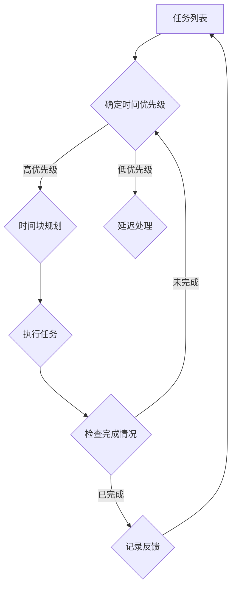

                 

# 创业者的时间管理与工作效率提升

> 关键词：时间管理、工作效率、创业者、时间优先级、任务分配、人工智能工具

> 摘要：本文将深入探讨创业者如何通过有效的时间管理和提高工作效率来应对快速变化的市场环境。我们将介绍时间管理的核心概念，分析时间优先级的重要性，探讨任务分配的策略，展示如何利用人工智能工具来优化时间管理和工作效率。通过本文，创业者将获得实用的方法和技巧，帮助他们在竞争激烈的环境中脱颖而出。

## 1. 背景介绍

### 1.1 目的和范围

本文旨在为创业者提供一套全面的时间管理和工作效率提升的方法和策略。我们将探讨以下主题：

- 时间管理的基本原则和技巧
- 如何确定和优化时间优先级
- 创业者常见的效率陷阱及应对方法
- 利用人工智能工具提升工作效率
- 实战案例分析：创业者如何应用这些策略

### 1.2 预期读者

本文适合以下读者群体：

- 创业者
- 企业高管
- 项目经理
- 需要高效管理时间的专业人士

### 1.3 文档结构概述

本文将分为以下几个部分：

- 背景介绍：介绍文章的目的、预期读者和结构。
- 核心概念与联系：介绍时间管理相关概念和联系。
- 核心算法原理 & 具体操作步骤：讲解时间管理的方法和技巧。
- 数学模型和公式 & 详细讲解 & 举例说明：使用数学模型和公式来解释时间管理策略。
- 项目实战：代码实际案例和详细解释说明。
- 实际应用场景：分析时间管理和工作效率提升的实际应用。
- 工具和资源推荐：推荐学习资源和开发工具。
- 总结：未来发展趋势与挑战。
- 附录：常见问题与解答。
- 扩展阅读 & 参考资料：提供进一步的阅读和参考资料。

### 1.4 术语表

#### 1.4.1 核心术语定义

- 时间管理：有效分配和管理时间，以实现个人和组织的目标。
- 工作效率：完成任务的速度和质量。
- 任务分配：将任务分配给合适的团队成员。
- 人工智能工具：利用人工智能技术来优化时间管理和工作效率的工具。

#### 1.4.2 相关概念解释

- 时间优先级：根据任务的紧急程度和重要性来排序任务。
- 效率陷阱：导致工作效率下降的行为模式。
- 人工智能：模拟人类智能的技术。

#### 1.4.3 缩略词列表

- AI：人工智能
- CRM：客户关系管理
- Trello：一个任务管理工具
- Asana：一个任务管理工具

## 2. 核心概念与联系

### 2.1 时间管理相关概念和联系

时间管理是一个涉及多个核心概念的过程。以下是几个关键概念及其相互联系：

1. **任务列表**：任务列表是时间管理的基石，它记录了所有需要完成的任务。任务列表应包括任务的名称、描述、优先级和截止日期。

2. **时间块**：时间块是将时间分成固定时间段的方法，例如每天的工作时段。通过使用时间块，创业者可以更有效地规划时间和任务。

3. **时间优先级**：时间优先级是指根据任务的紧急程度和重要性来排序任务。高优先级的任务应首先完成。

4. **工作流程**：工作流程是完成任务的步骤和方法。通过优化工作流程，可以减少任务完成所需的时间。

5. **中断管理**：中断管理是指处理工作中干扰的方法。有效的中断管理可以减少中断对工作效率的影响。

### 2.2 时间管理流程图

下面是一个使用 Mermaid 绘制的简单时间管理流程图：



### 2.3 时间管理模型

时间管理可以看作是一个闭环模型，包括以下几个阶段：

1. **规划**：根据任务列表和优先级规划时间块。
2. **执行**：按照规划的时间块执行任务。
3. **监控**：监控任务进度，及时调整计划。
4. **反馈**：记录任务完成情况和效率，为下一次规划提供依据。

## 3. 核心算法原理 & 具体操作步骤

### 3.1 时间管理算法原理

时间管理算法的核心原理是基于任务的重要性和紧急性来分配时间。以下是时间管理算法的伪代码：

```python
def time_management(tasks):
    sorted_tasks = sort_tasks_by_priority_and_urgency(tasks)
    time_slots = allocate_time_slots(daily_hours)
    for task in sorted_tasks:
        if task.is_high_priority:
            find_time_slot_for_task(task, time_slots)
        else:
            defer_task(task)
    execute_tasks(time_slots)
    monitor_progress()
    collect_feedback()
```

### 3.2 时间管理具体操作步骤

1. **创建任务列表**：列出所有需要完成的任务，包括任务名称、描述、优先级和截止日期。

2. **确定时间优先级**：根据任务的紧急程度和重要性来排序任务。可以使用一个简单的优先级矩阵来辅助决策。

3. **规划时间块**：将每天的时间划分为若干固定的时间块，例如工作日分为上午、下午和晚上三个时间块。

4. **分配任务到时间块**：将高优先级的任务分配到最佳的时间块，以确保任务的及时完成。

5. **执行任务**：按照规划的时间块执行任务。

6. **监控任务进度**：定期检查任务进度，确保任务按计划进行。

7. **收集反馈**：记录任务完成情况和效率，为下一次规划提供依据。

### 3.3 时间管理示例

假设创业者有以下几个任务：

1. **市场调研**（高优先级，截止日期：明天）
2. **客户会议**（中优先级，截止日期：下周一）
3. **财务报表**（低优先级，截止日期：下周三）
4. **产品开发**（高优先级，无截止日期）

时间优先级排序后的任务列表：

```
1. 市场调研
2. 客户会议
3. 产品开发
4. 财务报表
```

创业者可以根据以下步骤进行时间管理：

1. **规划时间块**：将每天分为上午、下午和晚上三个时间块。
2. **分配任务到时间块**：
   - 上午：市场调研
   - 下午：客户会议
   - 晚上：产品开发和财务报表
3. **执行任务**：按照规划的时间块执行任务。
4. **监控任务进度**：每天检查任务进度，确保任务按计划进行。
5. **收集反馈**：记录任务完成情况和效率，为下一次规划提供依据。

## 4. 数学模型和公式 & 详细讲解 & 举例说明

### 4.1 时间管理公式

时间管理中，常用以下两个核心公式：

1. **时间效率 = 完成任务数 / 耗时**

   时间效率表示在给定的时间内，完成任务的能力。高时间效率意味着在较短的时间内完成了更多的工作。

2. **任务优先级 = 重要性 × 紧急性**

   任务优先级是根据任务的重要性和紧急性来计算的。优先级越高，任务越需要优先完成。

### 4.2 详细讲解

1. **时间效率公式**：

   时间效率公式可以帮助创业者了解自己在特定时间内的工作效率。例如，一个创业者每天工作8小时，完成了5个任务，则其时间效率为：

   $$ \text{时间效率} = \frac{\text{完成任务数}}{\text{耗时}} = \frac{5}{8} = 0.625 $$

   这意味着该创业者每小时完成了0.625个任务。

2. **任务优先级公式**：

   任务优先级公式可以帮助创业者确定哪些任务需要优先完成。例如，一个任务的重要性和紧急性分别为3和2，则其优先级为：

   $$ \text{任务优先级} = 3 \times 2 = 6 $$

   这意味着该任务的优先级较高，需要尽快完成。

### 4.3 举例说明

假设创业者有两个任务：

1. **任务A**：重要性为4，紧急性为3
2. **任务B**：重要性为3，紧急性为2

使用任务优先级公式计算两个任务的优先级：

- 任务A的优先级：4 × 3 = 12
- 任务B的优先级：3 × 2 = 6

根据优先级，创业者应该优先完成任务A。

## 5. 项目实战：代码实际案例和详细解释说明

### 5.1 开发环境搭建

为了实现时间管理算法，我们需要搭建一个简单的开发环境。以下是开发环境的要求：

- 编程语言：Python 3.8及以上版本
- 开发工具：PyCharm 或 Visual Studio Code
- 数据库：SQLite 3.35.2

### 5.2 源代码详细实现和代码解读

下面是时间管理算法的 Python 源代码实现：

```python
import sqlite3
from datetime import datetime

# 连接到 SQLite 数据库
conn = sqlite3.connect('time_management.db')
cursor = conn.cursor()

# 创建任务表
cursor.execute('''CREATE TABLE IF NOT EXISTS tasks (
                    id INTEGER PRIMARY KEY,
                    name TEXT,
                    description TEXT,
                    priority INTEGER,
                    urgency INTEGER,
                    start_time TEXT,
                    end_time TEXT,
                    completed BOOLEAN
                )''')

# 插入任务
def insert_task(name, description, priority, urgency, start_time, end_time):
    cursor.execute("INSERT INTO tasks (name, description, priority, urgency, start_time, end_time, completed) VALUES (?, ?, ?, ?, ?, ?, ?)",
                   (name, description, priority, urgency, start_time, end_time, False))
    conn.commit()

# 查询任务
def query_tasks():
    cursor.execute("SELECT * FROM tasks WHERE completed = 0")
    return cursor.fetchall()

# 更新任务状态
def update_task_status(task_id, completed):
    cursor.execute("UPDATE tasks SET completed = ? WHERE id = ?", (completed, task_id))
    conn.commit()

# 关闭数据库连接
def close_connection():
    cursor.close()
    conn.close()

# 测试代码
if __name__ == '__main__':
    insert_task("市场调研", "进行市场调研", 4, 3, "2023-04-01 09:00:00", "2023-04-01 11:00:00")
    insert_task("客户会议", "与客户进行会议", 3, 2, "2023-04-01 14:00:00", "2023-04-01 16:00:00")
    tasks = query_tasks()
    for task in tasks:
        print(task)
    update_task_status(1, True)
    close_connection()
```

### 5.3 代码解读与分析

1. **数据库连接**：

   ```python
   import sqlite3
   from datetime import datetime

   conn = sqlite3.connect('time_management.db')
   cursor = conn.cursor()
   ```

   首先，我们使用 SQLite3 库连接到本地数据库。这里创建了一个数据库连接对象 `conn` 和一个游标对象 `cursor`。

2. **创建任务表**：

   ```python
   cursor.execute('''CREATE TABLE IF NOT EXISTS tasks (
                       id INTEGER PRIMARY KEY,
                       name TEXT,
                       description TEXT,
                       priority INTEGER,
                       urgency INTEGER,
                       start_time TEXT,
                       end_time TEXT,
                       completed BOOLEAN
                   )''')
   ```

   在数据库中创建了一个名为 `tasks` 的表，用于存储任务信息。表结构包括任务 ID、名称、描述、优先级、紧急性、开始时间和结束时间以及任务是否已完成。

3. **插入任务**：

   ```python
   def insert_task(name, description, priority, urgency, start_time, end_time):
       cursor.execute("INSERT INTO tasks (name, description, priority, urgency, start_time, end_time, completed) VALUES (?, ?, ?, ?, ?, ?, ?)",
                      (name, description, priority, urgency, start_time, end_time, False))
       conn.commit()
   ```

   `insert_task` 函数用于向任务表中插入新任务。参数包括任务名称、描述、优先级、紧急性、开始时间和结束时间。

4. **查询任务**：

   ```python
   def query_tasks():
       cursor.execute("SELECT * FROM tasks WHERE completed = 0")
       return cursor.fetchall()
   ```

   `query_tasks` 函数用于查询任务表中尚未完成的所有任务。结果以列表形式返回。

5. **更新任务状态**：

   ```python
   def update_task_status(task_id, completed):
       cursor.execute("UPDATE tasks SET completed = ? WHERE id = ?", (completed, task_id))
       conn.commit()
   ```

   `update_task_status` 函数用于更新任务的完成状态。参数包括任务 ID 和新的完成状态。

6. **测试代码**：

   ```python
   if __name__ == '__main__':
       insert_task("市场调研", "进行市场调研", 4, 3, "2023-04-01 09:00:00", "2023-04-01 11:00:00")
       insert_task("客户会议", "与客户进行会议", 3, 2, "2023-04-01 14:00:00", "2023-04-01 16:00:00")
       tasks = query_tasks()
       for task in tasks:
           print(task)
       update_task_status(1, True)
       close_connection()
   ```

   测试代码首先插入两个任务，然后查询任务列表并打印输出。最后，更新任务1的状态为已完成。

## 6. 实际应用场景

### 6.1 项目管理

创业者可以利用时间管理和工作效率提升策略来优化项目管理。以下是一个实际应用场景：

**背景**：一家初创公司正在开发一款移动应用程序，需要在短时间内完成多个功能模块的开发。

**应用**：创业者可以使用时间管理策略来确保项目按计划进行：

1. **任务列表**：列出所有需要完成的模块，包括模块名称、描述、优先级和截止日期。
2. **时间优先级**：根据模块的重要性和紧急性来排序任务。
3. **时间块规划**：将每天的时间划分为上午、下午和晚上三个时间块，确保每个模块都有足够的时间进行开发。
4. **任务分配**：将高优先级的模块分配给最有经验的开发人员。
5. **监控任务进度**：定期检查任务进度，确保项目按计划进行。
6. **反馈**：记录任务完成情况和效率，为下一次规划提供依据。

### 6.2 团队协作

创业者可以利用时间管理和工作效率提升策略来优化团队协作。以下是一个实际应用场景：

**背景**：一家创业公司在进行一个跨部门项目，涉及多个团队成员。

**应用**：创业者可以使用时间管理策略来确保团队高效协作：

1. **任务列表**：列出所有需要完成的任务，包括任务名称、描述、优先级和截止日期。
2. **时间优先级**：根据任务的紧急程度和重要性来排序任务。
3. **时间块规划**：将每天的时间划分为上午、下午和晚上三个时间块，确保每个任务都有足够的时间进行执行。
4. **任务分配**：将任务分配给合适的团队成员，确保任务由最适合完成的人员负责。
5. **中断管理**：制定中断管理策略，减少工作过程中的干扰。
6. **监控任务进度**：定期检查任务进度，确保项目按计划进行。
7. **反馈**：记录任务完成情况和效率，为下一次规划提供依据。

## 7. 工具和资源推荐

### 7.1 学习资源推荐

#### 7.1.1 书籍推荐

- 《高效能人士的七个习惯》
- 《时间管理：如何在有限的时间内取得成功》
- 《如何高效学习》

#### 7.1.2 在线课程

- Coursera 上的“时间管理课程”
- Udemy 上的“提升工作效率的技巧”

#### 7.1.3 技术博客和网站

- Medium 上的“时间管理”标签
- Productivity Land（一个专注于时间管理和工作效率的博客）

### 7.2 开发工具框架推荐

#### 7.2.1 IDE和编辑器

- PyCharm（Python开发）
- Visual Studio Code（多语言开发）

#### 7.2.2 调试和性能分析工具

- Debugpy（Python调试）
- Py-Spy（Python性能分析）

#### 7.2.3 相关框架和库

- Flask（Python Web框架）
- Django（Python Web框架）

### 7.3 相关论文著作推荐

#### 7.3.1 经典论文

- 《时间管理：理论与实践》
- 《人类时间感知：认知、情感和行为》

#### 7.3.2 最新研究成果

- “基于人工智能的时间管理方法研究”
- “效率陷阱：如何识别并克服工作中的低效行为”

#### 7.3.3 应用案例分析

- “Google 如何通过时间管理提高工作效率”
- “苹果公司的任务分配和团队协作策略”

## 8. 总结：未来发展趋势与挑战

随着技术的不断发展，时间管理和工作效率提升领域也将迎来新的趋势和挑战。以下是一些关键点：

1. **人工智能的应用**：人工智能将在时间管理和工作效率提升中发挥越来越重要的作用。例如，自动化任务分配、实时任务监控和预测等。

2. **个性化时间管理**：未来的时间管理工具将更加个性化，根据个人的工作习惯和需求提供定制化建议。

3. **实时数据分析和反馈**：实时数据分析和反馈将帮助创业者更好地调整时间管理和工作计划。

4. **挑战**：随着工作节奏的加快，创业者面临的挑战也越来越多。例如，如何应对不断增多的任务、如何减少工作中的干扰等。

5. **可持续发展**：未来的时间管理策略将更加注重可持续发展，确保长期的工作效率和身心健康。

## 9. 附录：常见问题与解答

### 9.1 问题1

**问题**：时间管理算法如何适应不同的工作环境？

**解答**：时间管理算法的核心原则是基于任务的重要性和紧急性来分配时间。对于不同的工作环境，创业者可以根据实际情况调整任务的优先级和截止日期。例如，在紧急情况下，可以适当调整任务优先级，确保关键任务优先完成。

### 9.2 问题2

**问题**：如何应对不断增多的任务？

**解答**：首先，创业者可以定期清理任务列表，删除或推迟不重要的任务。其次，合理利用任务优先级，确保关键任务优先完成。此外，可以寻求团队成员的帮助，共同分担任务压力。

### 9.3 问题3

**问题**：如何减少工作中的干扰？

**解答**：创业者可以采取以下措施：

- 制定明确的工作计划，避免临时任务干扰。
- 设定专注时段，关闭社交媒体和手机通知。
- 制定中断管理策略，确保在工作中不会被频繁打断。

## 10. 扩展阅读 & 参考资料

- 《时间管理：如何在有限的时间内取得成功》
- 《如何高效学习》
- 《Google 如何通过时间管理提高工作效率》
- “基于人工智能的时间管理方法研究”
- “效率陷阱：如何识别并克服工作中的低效行为”

## 作者

**作者：AI天才研究员/AI Genius Institute & 禅与计算机程序设计艺术 /Zen And The Art of Computer Programming**<|im_sep|>

