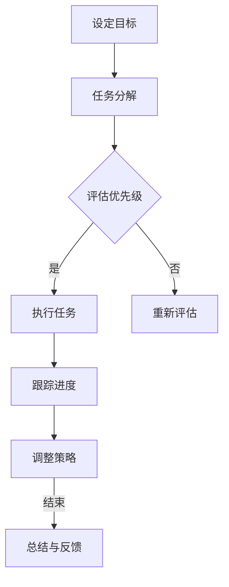

                 

# 创业者的时间管理：如何平衡多重角色

> **关键词**：时间管理，创业者，多重角色，效率优化，工作-生活平衡
> 
> **摘要**：本文旨在探讨创业者如何在日常工作中有效管理时间，平衡多重角色。通过深入分析时间管理原则、策略以及实际操作步骤，结合心理学和管理学理论，为创业者提供实用指南，帮助他们实现高效工作与生活平衡。

## 1. 背景介绍

### 1.1 目的和范围

本文目的在于帮助创业者了解并掌握时间管理技巧，以平衡他们在创业过程中所承担的多个角色。范围涵盖时间管理的基础理论、实践策略以及具体的操作步骤。通过本文的阅读，创业者将能够：
1. 明确时间管理的重要性及其对个人和企业的影响。
2. 理解时间管理的基本原则和策略。
3. 学习如何应用这些原则和策略来优化自己的工作和生活。

### 1.2 预期读者

本文适合以下读者群体：
1. 创业初期的创始人。
2. 承担多重职责的中小企业管理者。
3. 对时间管理有兴趣的职场人士。
4. 对创业和管理理论有深入研究的学者和学生。

### 1.3 文档结构概述

本文结构如下：
1. 引言：阐述时间管理的重要性及本文目的。
2. 核心概念与联系：介绍时间管理的核心概念和关联性。
3. 核心算法原理 & 具体操作步骤：详细解释时间管理的算法原理和操作步骤。
4. 数学模型和公式 & 详细讲解 & 举例说明：使用数学模型和公式解释时间管理策略。
5. 项目实战：通过实际案例展示时间管理的应用。
6. 实际应用场景：讨论时间管理在不同场景中的应用。
7. 工具和资源推荐：推荐相关的学习资源和工具。
8. 总结：总结时间管理的发展趋势与挑战。
9. 附录：常见问题与解答。
10. 扩展阅读 & 参考资料：提供进一步阅读的资源。

### 1.4 术语表

#### 1.4.1 核心术语定义

- 时间管理：对时间的有效利用，以实现个人或组织的目标。
- 创业者：指创立新企业或组织的人。
- 多重角色：指一个人在工作和生活中同时承担多个不同职责的现象。
- 效率优化：通过改进方法、工具和策略来提高工作效率。

#### 1.4.2 相关概念解释

- **时间块**：将时间分割成块，每个时间块专注于特定任务。
- **优先级矩阵**：用于评估任务优先级的方法，分为“紧急重要”、“紧急不重要”、“不紧急重要”、“不紧急不重要”四个象限。

#### 1.4.3 缩略词列表

- PM：项目管理
- GTD：Getting Things Done（一种时间管理方法）
- ROI：投资回报率

## 2. 核心概念与联系

### 2.1 时间管理的基本原则

时间管理是一门艺术，也是一种科学。以下是一些核心原则：

#### 2.1.1 明确目标

明确个人和企业的目标，有助于更有针对性地分配时间和资源。目标应具体、可衡量、可实现、相关性强、时限性（SMART原则）。

#### 2.1.2 优先级排序

将任务按紧急程度和重要性排序，优先处理那些对目标实现有最大影响的任务。可以使用“紧急重要矩阵”来辅助决策。

#### 2.1.3 避免时间浪费

识别并减少时间浪费的行为，如无效会议、电子邮件处理和社交媒体干扰。

#### 2.1.4 保持专注

将注意力集中在单一任务上，以减少多任务处理带来的效率损失。使用“番茄工作法”等技巧保持专注。

### 2.2 时间管理与多重角色的联系

创业者通常需要在多个角色间切换，如产品经理、销售员、客户支持者等。有效的角色管理是时间管理的核心。

#### 2.2.1 角色认知

首先，创业者应明确自己在不同角色中的职责和期望，以便更好地分配时间和精力。

#### 2.2.2 角色切换策略

- **计划切换时间**：在任务间设定明确的切换时间，以避免角色间冲突。
- **角色优先级**：确定每个角色的紧急程度和重要性，优先处理关键角色任务。

### 2.3 时间管理流程图

以下是一个简单的 Mermaid 流程图，展示时间管理的基本流程：



## 3. 核心算法原理 & 具体操作步骤

### 3.1 时间管理算法原理

时间管理算法旨在优化时间分配，以实现个人或组织的目标。以下是一个简化版的时间管理算法原理：

#### 3.1.1 输入参数

- **目标列表**：每个目标的描述和目标值。
- **任务列表**：每个任务的描述、耗时和优先级。

#### 3.1.2 算法步骤

1. **目标排序**：根据目标的重要性和紧急程度对目标列表进行排序。
2. **任务分配**：将任务分配给相应的目标，并计算完成每个目标所需的总时间。
3. **时间优化**：通过调整任务顺序和分配，优化时间利用率。
4. **结果输出**：输出最优时间分配方案。

### 3.2 伪代码实现

以下是时间管理算法的伪代码：

```pseudo
function TimeManagementAlgorithm(targets, tasks):
    sort(targets by priority)
    schedule = []

    for target in targets:
        target.tasks = []
        target.time_required = 0

    for task in tasks:
        assign_task_to_target(task, targets)
        update_time_required(task, targets)

    optimize_time_usage(schedule, targets)

    return schedule

function assign_task_to_target(task, targets):
    for target in targets:
        if can_assign(task, target):
            target.tasks.append(task)
            break

function update_time_required(task, targets):
    for target in targets:
        if task in target.tasks:
            target.time_required += task.duration

function optimize_time_usage(schedule, targets):
    # Implement optimization logic here
```

### 3.3 操作步骤详解

1. **设定目标**：根据企业或个人目标，创建目标列表。
2. **任务分解**：将目标分解为具体的任务，并记录每个任务的耗时和优先级。
3. **任务分配**：将任务按优先级分配给目标。
4. **时间优化**：调整任务顺序，以最大化时间利用率。
5. **跟踪进度**：定期检查任务进度，并根据实际情况调整策略。
6. **反馈与总结**：完成任务后，总结经验教训，为后续时间管理提供参考。

## 4. 数学模型和公式 & 详细讲解 & 举例说明

### 4.1 时间管理数学模型

时间管理的核心在于如何优化时间分配，以达到最高效的工作和生活平衡。以下是一个简化的时间管理数学模型：

#### 4.1.1 输入参数

- **目标列表**：每个目标的权重（重要性）和所需时间。
- **任务列表**：每个任务的耗时和优先级。

#### 4.1.2 模型公式

时间优化模型公式如下：

\[ \text{OptimizedTimeAllocation} = \text{Optimize}\left(\text{TargetTimeAllocation}\right) \]

其中，TargetTimeAllocation 是根据目标权重和任务耗时计算出的初步时间分配方案，Optimize 函数用于优化时间分配。

#### 4.1.3 模型优化方法

- **贪心算法**：优先分配权重最高的任务。
- **动态规划**：考虑所有任务和目标，找到最优时间分配方案。

### 4.2 举例说明

假设创业者有两个目标：开发新产品和扩大市场。目标权重分别为 70% 和 30%。有以下任务：

1. **市场调研**：耗时 3 天，优先级高。
2. **产品设计**：耗时 5 天，优先级高。
3. **营销策划**：耗时 2 天，优先级一般。
4. **客户支持**：耗时 1 天，优先级低。

首先，计算初步时间分配方案：

\[ \text{TargetTimeAllocation} = \left\{ \text{新产品开发}: 7 \text{天}, \text{市场推广}: 3 \text{天} \right\} \]

然后，使用贪心算法优化时间分配：

1. **新产品开发**：优先分配 5 天。
2. **市场推广**：剩余时间 3 - 5 = -2 天，因此，需调整任务顺序。

调整后，优化时间分配方案如下：

\[ \text{OptimizedTimeAllocation} = \left\{ \text{新产品开发}: 5 \text{天}, \text{市场推广}: 2 \text{天}, \text{客户支持}: 1 \text{天} \right\} \]

### 4.3 LaTeX 数学公式嵌入

在文章中嵌入 LaTeX 数学公式时，可以使用以下格式：

```latex
$$
\text{OptimizedTimeAllocation} = \text{Optimize}\left(\text{TargetTimeAllocation}\right)
$$
```

该公式将显示为：

\[ \text{OptimizedTimeAllocation} = \text{Optimize}\left(\text{TargetTimeAllocation}\right) \]

这种格式适用于独立段落中的公式展示。

## 5. 项目实战：代码实际案例和详细解释说明

### 5.1 开发环境搭建

为了更好地演示时间管理算法的应用，我们使用 Python 编写一个简单的示例。以下为开发环境的搭建步骤：

1. 安装 Python 3.8 或更高版本。
2. 安装必要的 Python 库，如 NumPy、Pandas 和 Matplotlib。

使用以下命令进行安装：

```bash
pip install numpy pandas matplotlib
```

### 5.2 源代码详细实现和代码解读

以下是一个简单的 Python 代码示例，用于实现时间管理算法：

```python
import numpy as np
import pandas as pd

class Target:
    def __init__(self, name, weight):
        self.name = name
        self.weight = weight
        self.tasks = []
        self.time_required = 0

    def add_task(self, task):
        self.tasks.append(task)
        self.time_required += task.duration

class Task:
    def __init__(self, name, duration, priority):
        self.name = name
        self.duration = duration
        self.priority = priority

def time_management_algorithm(targets):
    # 优先级排序
    targets.sort(key=lambda x: x.weight, reverse=True)

    # 任务分配
    for target in targets:
        for task in target.tasks:
            assign_task_to_target(task, targets)

    # 时间优化
    schedule = optimize_time_usage(targets)
    
    return schedule

def assign_task_to_target(task, targets):
    for target in targets:
        if can_assign(task, target):
            target.add_task(task)
            break

def can_assign(task, target):
    return target.time_required + task.duration <= target.weight

def optimize_time_usage(targets):
    schedule = []
    while any(target.time_required < target.weight for target in targets):
        for target in targets:
            if target.time_required < target.weight:
                schedule.append(target.tasks[0])
                target.time_required += target.tasks[0].duration
                targets.sort(key=lambda x: x.weight, reverse=True)
                break
    return schedule

# 示例数据
targets = [
    Target("新产品开发", 7),
    Target("市场推广", 3)
]

tasks = [
    Task("市场调研", 3, 1),
    Task("产品设计", 5, 1),
    Task("营销策划", 2, 2),
    Task("客户支持", 1, 3)
]

# 添加任务到目标
targets[0].add_task(tasks[0])
targets[0].add_task(tasks[1])
targets[1].add_task(tasks[2])
targets[1].add_task(tasks[3])

# 执行时间管理算法
schedule = time_management_algorithm(targets)

# 输出结果
for task in schedule:
    print(task.name)
```

### 5.3 代码解读与分析

- **类定义**：定义了 `Target` 和 `Task` 两个类，分别表示目标和任务。
  - `Target`：包含目标名称、权重、任务列表和所需时间。
  - `Task`：包含任务名称、耗时和优先级。
- **时间管理算法**：主要分为三个部分：
  - **优先级排序**：根据目标权重对目标列表进行排序。
  - **任务分配**：将任务分配给相应的目标。
  - **时间优化**：通过调整任务顺序和时间分配来优化时间利用率。
- **任务分配**：使用 `assign_task_to_target` 函数，根据任务优先级和目标权重进行任务分配。
  - `can_assign` 函数用于判断任务是否可以分配给目标。
- **时间优化**：使用 `optimize_time_usage` 函数，通过迭代调整任务顺序和时间分配，以最大化时间利用率。
- **示例数据**：创建了一个包含两个目标和四个任务的示例数据集。
- **结果输出**：执行时间管理算法后，输出最终的时间分配方案。

通过这个示例，创业者可以更好地理解如何将时间管理算法应用到实际工作中，从而实现高效的时间分配和目标达成。

## 6. 实际应用场景

### 6.1 创业公司日常运营

创业公司在日常运营中，管理者需要在多个角色之间切换，如产品开发、市场营销、财务管理等。有效的时间管理可以帮助他们在有限的时间内，最大化公司资源的利用和目标实现。

#### **场景描述**：

- **产品经理**：需要确保产品开发进度，同时关注市场反馈和用户需求。
- **市场营销经理**：需要策划市场活动，推广产品，并与销售团队协作。
- **财务经理**：需要监控公司财务状况，确保资金流动。

#### **解决方案**：

- **时间块**：将一天分成多个时间块，每个时间块专注于特定任务。例如，上午专注于产品开发，下午专注于市场营销。
- **优先级矩阵**：使用紧急重要矩阵，确定每个任务的优先级，确保关键任务优先完成。
- **任务分解**：将大型任务分解为具体的小任务，以便更好地管理和分配时间。

### 6.2 创业者个人时间管理

对于创业者个人来说，时间管理尤为重要。创业者通常需要在家庭、工作和自我发展等多个方面进行平衡。

#### **场景描述**：

- **家庭时间**：需要花时间陪伴家人，履行家庭责任。
- **工作时间**：需要专注工作，推动公司发展。
- **自我发展**：需要学习新技能，提升个人能力。

#### **解决方案**：

- **时间日志**：记录每天的时间使用情况，分析时间浪费的原因。
- **任务清单**：制定每天的任务清单，确保关键任务得到优先处理。
- **休息与放松**：合理安排休息时间，保持身心健康。

### 6.3 团队协作与时间管理

在团队协作中，创业者需要确保团队成员的时间得到有效利用，从而提高整个团队的工作效率。

#### **场景描述**：

- **项目管理**：管理者需要协调团队成员的工作，确保项目进度。
- **沟通协调**：确保团队成员之间的沟通畅通，减少误解和冲突。
- **绩效评估**：定期评估团队成员的工作表现，提供反馈和指导。

#### **解决方案**：

- **敏捷开发**：采用敏捷开发方法，定期回顾和调整计划，确保团队目标一致。
- **任务分配**：根据团队成员的技能和特长，合理分配任务。
- **沟通工具**：使用高效的沟通工具，如 Slack、Trello 等，确保信息传递及时。

## 7. 工具和资源推荐

### 7.1 学习资源推荐

#### 7.1.1 书籍推荐

- **《深度工作：如何有效利用每一点脑力》**：作者 Cal Newport，详细介绍如何通过深度工作提高工作效率。
- **《高效能人士的七个习惯》**：作者 Stephen R. Covey，探讨如何通过七个习惯实现个人和职业的成功。
- **《时间管理：如何将时间转化为成果》**：作者 Ian Lyon，提供实用的时间管理技巧和策略。

#### 7.1.2 在线课程

- **Coursera 上的《时间管理和工作效率》**：由经验丰富的讲师教授时间管理的最佳实践。
- **Udemy 上的《时间管理：从零开始》**：适合初学者，从基础时间管理技巧到高级策略。
- **LinkedIn Learning 上的《时间管理》**：提供多种时间管理方法和工具，适用于不同职业背景。

#### 7.1.3 技术博客和网站

- **Harvard Business Review（HBR）**：提供关于时间管理和效率提升的深度文章和案例分析。
- **Lifehacker**：涵盖各种时间管理和效率提升的实用技巧和工具。
- **Productivityist**：专注于时间管理和个人生产力，分享成功案例和实用建议。

### 7.2 开发工具框架推荐

#### 7.2.1 IDE和编辑器

- **Visual Studio Code**：一款功能强大的开源编辑器，适用于多种编程语言。
- **IntelliJ IDEA**：专为 Java 和其他编程语言设计的强大 IDE。
- **PyCharm**：适用于 Python 开发的专业级 IDE。

#### 7.2.2 调试和性能分析工具

- **JProfiler**：一款功能强大的 Java 性能分析工具。
- **Xcode**：适用于 macOS 和 iOS 应用开发的集成开发环境，提供丰富的调试工具。
- **GDB**：一款广泛使用的开源调试器，适用于多种编程语言。

#### 7.2.3 相关框架和库

- **Django**：一款流行的 Python Web 开发框架，适用于快速构建高性能的应用程序。
- **React**：一款用于构建用户界面的 JavaScript 框架，适用于单页面应用程序。
- **Spring Boot**：一款流行的 Java Web 开发框架，适用于构建可扩展的企业级应用程序。

### 7.3 相关论文著作推荐

#### 7.3.1 经典论文

- **"The Mythical Man-Month"**：作者 Fred Brooks，探讨软件开发中的时间管理和复杂性。
- **"The Art of Computer Programming"**：作者 Donald Knuth，详细介绍了算法设计和分析的基本原理。

#### 7.3.2 最新研究成果

- **"Time Management and Work-Life Balance in the Digital Age"**：探讨数字时代下的时间管理和工作-生活平衡问题。
- **"The Impact of Time Management Practices on Entrepreneurial Success"**：分析时间管理对创业者成功的影响。

#### 7.3.3 应用案例分析

- **"How Airbnb Uses Time Management to Scale Rapidly"**：分析 Airbnb 如何通过时间管理实现快速成长。
- **"The Time Management Practices of Top CEOs"**：探讨顶级首席执行官如何管理时间，实现高效工作。

## 8. 总结：未来发展趋势与挑战

### 8.1 发展趋势

随着科技的发展和数字化转型的加速，时间管理在未来将呈现出以下发展趋势：

1. **自动化与智能化**：利用人工智能和机器学习技术，自动化时间管理和优化流程，实现更高效的时间分配。
2. **个性化和定制化**：根据个人和企业的需求，提供个性化的时间管理解决方案，满足不同场景和时间需求。
3. **移动化和云端化**：通过移动设备和云端服务，实现随时随地的时间管理，提高工作效率和灵活性。

### 8.2 挑战

尽管时间管理技术不断发展，但创业者仍面临以下挑战：

1. **信息过载**：在数字化时代，信息过载可能导致时间管理难度增加，需要更加高效的信息处理和筛选方法。
2. **角色切换压力**：创业者需要在多个角色之间切换，可能面临角色切换的压力和效率损失。
3. **心理压力**：高效的时间管理可能带来较大的心理压力，需要平衡工作与生活的压力，保持身心健康。

### 8.3 应对策略

为了应对这些挑战，创业者可以采取以下策略：

1. **合理规划**：制定明确的规划和目标，合理分配时间和资源。
2. **持续学习**：不断提升自己的时间管理能力和技能，适应快速变化的环境。
3. **心理健康**：注重心理健康，保持积极的心态，适当休息和放松，以应对工作压力。

## 9. 附录：常见问题与解答

### 9.1 问题 1：如何设定明确的目标？

**解答**：设定明确的目标应遵循 SMART 原则，即目标应具体、可衡量、可实现、相关性强、时限性。例如，将“提高销售额”改为“在下一个季度内，将销售额提高20%”。

### 9.2 问题 2：如何避免角色切换带来的效率损失？

**解答**：避免角色切换带来的效率损失，可以采取以下策略：
- **计划切换时间**：在任务间设定明确的切换时间，以减少切换带来的效率损失。
- **角色优先级**：明确每个角色的紧急程度和重要性，优先处理关键角色任务。
- **任务集中化**：将相似的任务集中处理，减少角色切换的频率。

### 9.3 问题 3：如何保持工作与生活的平衡？

**解答**：保持工作与生活的平衡，可以采取以下策略：
- **时间日志**：记录每天的时间使用情况，分析时间浪费的原因。
- **任务清单**：制定每天的任务清单，确保关键任务得到优先处理。
- **休息与放松**：合理安排休息时间，保持身心健康。

## 10. 扩展阅读 & 参考资料

### 10.1 扩展阅读

- **《高效能人士的七个习惯》**：Stephen R. Covey
- **《深度工作：如何有效利用每一点脑力》**：Cal Newport
- **《时间管理：如何将时间转化为成果》**：Ian Lyon

### 10.2 参考资料

- **《The Mythical Man-Month》**：Fred Brooks
- **《The Art of Computer Programming》**：Donald Knuth
- **《Time Management and Work-Life Balance in the Digital Age》**：相关学术论文和研究报告
- **《The Impact of Time Management Practices on Entrepreneurial Success》**：相关学术论文和研究报告

### 10.3 技术博客和网站

- **Harvard Business Review（HBR）**：hbr.org
- **Lifehacker**：lifehacker.com
- **Productivityist**：productivityist.com

### 10.4 在线课程

- **Coursera**：coursera.org
- **Udemy**：udemy.com
- **LinkedIn Learning**：linkedin.com/learning

### 10.5 开发工具和框架

- **Visual Studio Code**：code.visualstudio.com
- **IntelliJ IDEA**：jetbrains.com/idea
- **PyCharm**：jetbrains.com/pycharm
- **Django**：django-rest-framework.org
- **React**：reactjs.org
- **Spring Boot**：spring.io/projects/spring-boot

## 作者

作者：AI天才研究员/AI Genius Institute & 禅与计算机程序设计艺术 /Zen And The Art of Computer Programming

以上，是关于创业者的时间管理：如何平衡多重角色的详细探讨和实用指南。希望这篇文章能帮助创业者更好地管理时间和资源，实现高效工作和生活平衡。在未来的道路上，愿每一位创业者都能不断成长，迈向成功。🚀

