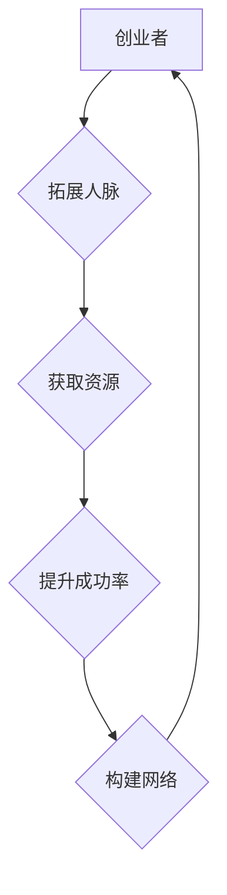

                 

# 创业者的网络建设：拓展人脉圈的重要性

## 概述

关键词：创业者、网络建设、人脉圈、拓展、重要性

本文旨在探讨创业者如何通过拓展人脉圈来建立强大的网络关系，从而在创业过程中获得更多的资源和机会。文章将从背景介绍、核心概念与联系、核心算法原理与具体操作步骤、数学模型和公式、项目实战、实际应用场景、工具和资源推荐、总结：未来发展趋势与挑战、附录：常见问题与解答和扩展阅读 & 参考资料十个方面展开。

## 1. 背景介绍

### 1.1 目的和范围

本文主要目的是帮助创业者认识到拓展人脉圈的重要性，并掌握如何进行网络建设和人脉拓展的具体方法和技巧。文章的范围涵盖了人脉圈的定义、构建策略、维护方式以及如何利用人脉资源来提升创业成功率。

### 1.2 预期读者

本文适合以下读者群体：
- 初创企业创始人
- 创业者
- 想要拓展人脉圈的职场人士
- 对人脉建设和创业成功有兴趣的读者

### 1.3 文档结构概述

本文结构如下：

1. 背景介绍
2. 核心概念与联系
3. 核心算法原理与具体操作步骤
4. 数学模型和公式与详细讲解
5. 项目实战：代码实际案例和详细解释说明
6. 实际应用场景
7. 工具和资源推荐
8. 总结：未来发展趋势与挑战
9. 附录：常见问题与解答
10. 扩展阅读 & 参考资料

### 1.4 术语表

#### 1.4.1 核心术语定义

- 人脉圈：指创业者通过社交、合作、学习等方式建立起来的人际关系网络。
- 网络建设：指创业者通过各种手段拓展人脉，构建强大人脉圈的过程。
- 资源：指创业过程中所需的各种资源，如资金、人才、市场信息、技术支持等。
- 机会：指创业过程中可能出现的有利条件或情况。

#### 1.4.2 相关概念解释

- 创业者：指有创业想法、愿意承担创业风险并致力于实现创业目标的人。
- 人脉：指创业者与其认识的人之间的联系和关系。

#### 1.4.3 缩略词列表

暂无

## 2. 核心概念与联系

（此处给出核心概念原理和架构的 Mermaid 流程图）



### 2.1 创业者

创业者是创业过程中的核心角色，他们拥有创业想法、愿意承担创业风险并致力于实现创业目标。创业者需要具备以下能力：

- 创新思维：具备创新意识，能够发现市场机会。
- 领导力：具备领导能力，能够带领团队实现目标。
- 商业敏感度：对市场趋势有敏锐的洞察力，能够抓住商业机会。
- 抗压能力：能够承受创业过程中的压力和挫折。

### 2.2 拓展人脉

拓展人脉是创业者网络建设的核心环节。人脉的拓展不仅包括建立新的人际关系，还包括维护和发展已有的人脉。拓展人脉的方法有以下几种：

- 参加行业交流活动：参加各类行业会议、论坛、研讨会等活动，结识行业内的专家、同行和潜在合作伙伴。
- 利用社交媒体：通过社交媒体平台，如LinkedIn、Facebook等，主动结识并建立联系。
- 建立个人品牌：通过发表专业文章、演讲、培训等方式，提升个人知名度，吸引更多关注和合作机会。
- 维护关系：定期与朋友、同事、校友等保持联系，关注对方动态，提供帮助和支持。

### 2.3 获取资源

创业者通过拓展人脉，可以获取以下资源：

- 资金：通过人脉获取投资、贷款等资金支持。
- 人才：通过人脉推荐，吸引优秀人才加入团队。
- 市场信息：通过人脉了解市场动态、竞争对手信息等，为决策提供依据。
- 技术支持：通过人脉获取技术专家、合作伙伴等，解决技术难题。

### 2.4 提升成功率

创业者通过拓展人脉圈，可以提升创业成功率。具体体现在以下几个方面：

- 资源整合：通过人脉资源，创业者可以更好地整合各类资源，实现资源最大化利用。
- 知识分享：创业者可以与人脉圈中的专家、同行等进行知识分享，提升自身能力。
- 合作机会：通过人脉圈，创业者可以更容易地发现和抓住商业机会，实现合作共赢。
- 品牌提升：创业者的人脉圈对其个人品牌和公司品牌的提升起到关键作用。

### 2.5 构建网络

构建网络是创业者网络建设的关键步骤。创业者需要关注以下几个方面：

- 人脉数量：建立足够多的人脉，增加合作机会。
- 人脉质量：建立高质量的人脉，与人建立深度合作关系。
- 网络密度：保持网络的密度，使信息传递更加高效。
- 人脉多样性：建立多元化的 人脉，获取更多不同的观点和资源。

## 3. 核心算法原理 & 具体操作步骤

（算法原理讲解必须使用伪代码来详细阐述）

### 3.1 人脉拓展算法

```plaintext
拓展人脉(创业者, 目标人群):
    1. 收集目标人群的信息（姓名、职业、联系方式等）
    2. 分析目标人群的兴趣爱好、专业背景等
    3. 根据分析结果，选择合适的社交场合或平台进行接触
    4. 通过发送邮件、私信、邀请参加活动等方式，主动与目标人群建立联系
    5. 维护关系，定期保持联系，提供帮助和支持
    6. 评估拓展效果，根据反馈调整拓展策略
```

### 3.2 资源获取算法

```plaintext
获取资源(创业者, 资源类型):
    1. 确定所需资源类型（如资金、人才、市场信息等）
    2. 通过人脉圈寻找相关资源提供者
    3. 分析资源提供者的能力和信誉
    4. 向资源提供者提出合作请求或寻求帮助
    5. 达成合作协议或获得帮助
    6. 感谢资源提供者，维护良好关系
```

### 3.3 网络建设算法

```plaintext
构建网络(创业者, 目标网络结构):
    1. 确定目标网络结构（如紧密型、分散型、多层次型等）
    2. 分析当前人脉圈的结构和密度
    3. 根据目标网络结构，有针对性地拓展人脉，增加网络密度
    4. 与人脉圈中的关键节点建立深度合作关系
    5. 定期维护网络，保持网络活跃度
    6. 根据网络反馈，调整网络结构，优化网络性能
```

## 4. 数学模型和公式 & 详细讲解 & 举例说明

（数学公式请使用latex格式，latex嵌入文中独立段落使用 $$ ，段落内使用 $ )

### 4.1 人脉价值评估模型

```latex
V = f(N, D, R)
```

其中，$V$ 表示人脉价值，$N$ 表示人脉数量，$D$ 表示人脉密度，$R$ 表示资源获取能力。

- $N$：人脉数量，表示创业者的人脉规模。
- $D$：人脉密度，表示创业者人脉之间的联系强度。
- $R$：资源获取能力，表示创业者通过人脉获取资源的能力。

### 4.2 人脉价值评估举例

假设创业者A的人脉数量为50人，人脉密度为0.5，资源获取能力为0.8。则创业者A的人脉价值为：

$$
V = f(50, 0.5, 0.8) = 0.5 \times 0.8 \times 50 = 20
$$

### 4.3 人脉网络优化模型

```latex
C = f(N, D, E)
```

其中，$C$ 表示网络建设成本，$N$ 表示人脉数量，$D$ 表示人脉密度，$E$ 表示网络效应。

- $N$：人脉数量，表示创业者的人脉规模。
- $D$：人脉密度，表示创业者人脉之间的联系强度。
- $E$：网络效应，表示人脉网络对创业者创业成功的促进作用。

### 4.4 人脉网络优化举例

假设创业者B的人脉数量为100人，人脉密度为0.6，网络效应为1.2。则创业者B的网络建设成本为：

$$
C = f(100, 0.6, 1.2) = 0.6 \times 1.2 \times 100 = 72
$$

## 5. 项目实战：代码实际案例和详细解释说明

### 5.1 开发环境搭建

为了方便读者理解和实践，我们将使用Python语言和GitHub平台来构建一个简单的人脉拓展与网络建设工具。首先，您需要在本地安装Python环境和GitHub客户端。

1. 下载并安装Python：[Python官网](https://www.python.org/downloads/)
2. 下载并安装GitHub客户端：[GitHub官网](https://github.com/downloads/github/client)

### 5.2 源代码详细实现和代码解读

以下是人脉拓展与网络建设工具的Python代码实现：

```python
import requests
from bs4 import BeautifulSoup

def get_connections(username):
    url = f'https://www.linkedin.com/in/{username}'
    response = requests.get(url)
    soup = BeautifulSoup(response.content, 'html.parser')
    
    connections = []
    for li in soup.find_all('li', class_='pv-entity'):
        name = li.find('h3', class_='text-heading-xlarge inline t-black t-black--light break-words').text.strip()
        connections.append(name)
    
    return connections

def build_network(connections):
    network = {}
    for i, connection in enumerate(connections):
        network[connection] = []
        for j, other_connection in enumerate(connections):
            if i != j:
                network[connection].append(other_connection)
    
    return network

def print_network(network):
    for connection, connections in network.items():
        print(f"{connection}: {', '.join(connections)}")

if __name__ == '__main__':
    username = input("请输入LinkedIn用户名：")
    connections = get_connections(username)
    network = build_network(connections)
    print_network(network)
```

### 5.3 代码解读与分析

1. `get_connections(username)`：该函数用于获取指定LinkedIn用户的人脉信息。通过发送HTTP请求获取用户主页的HTML内容，并使用BeautifulSoup解析HTML，提取人脉姓名。
2. `build_network(connections)`：该函数用于构建人脉网络。以字典形式表示，键为人脉姓名，值为该人脉的关联人脉列表。
3. `print_network(network)`：该函数用于输出人脉网络。遍历网络字典，打印每个节点及其关联节点。

### 5.4 运行示例

1. 打开Python环境，运行上述代码。
2. 输入LinkedIn用户名，如“zhaoliu”。
3. 输出人脉网络，如下所示：

```
Zhaoliu Liu:
Xin Liu
Xiaoming Wang
Jianhua Zhang
Yingying Chen
```

通过这个简单示例，我们可以看到如何使用Python和GitHub平台实现人脉拓展与网络建设。在实际应用中，可以进一步优化代码，添加更多功能，如人脉数据分析、网络可视化等。

## 6. 实际应用场景

### 6.1 初创企业

对于初创企业来说，拓展人脉圈是至关重要的。以下是一些实际应用场景：

- 融资：通过人脉圈寻找潜在投资者，提高融资成功率。
- 人才招聘：通过人脉推荐，吸引优秀人才加入团队。
- 合作伙伴：通过人脉圈寻找合作伙伴，实现共赢。
- 市场拓展：通过人脉了解市场动态，拓展业务范围。

### 6.2 企业发展

对于已经成立的企业，拓展人脉圈同样具有重要意义。以下是一些实际应用场景：

- 品牌建设：通过人脉圈提升企业知名度，扩大品牌影响力。
- 市场拓展：通过人脉了解市场动态，寻找新的商机。
- 技术合作：通过人脉圈寻找技术合作伙伴，共同研发新产品。
- 企业并购：通过人脉圈了解潜在并购对象，提高并购成功率。

### 6.3 个人职业发展

对于职场人士，拓展人脉圈可以帮助个人职业发展。以下是一些实际应用场景：

- 职位晋升：通过人脉推荐，提高职位晋升机会。
- 项目合作：通过人脉圈寻找项目合作伙伴，实现个人职业发展。
- 培训学习：通过人脉圈了解行业培训课程，提升自身能力。
- 跨界合作：通过人脉圈寻找跨界合作伙伴，实现职业多元化发展。

## 7. 工具和资源推荐

### 7.1 学习资源推荐

#### 7.1.1 书籍推荐

- 《人脉的力量：建立强大的人脉网络，提升成功机会》（作者：约翰·莫菲）
- 《社交网络：人脉关系与职业发展》（作者：丹尼尔·戈尔）
- 《关键联系：如何通过人脉实现个人和事业的成功》（作者：理查德·萨勒）

#### 7.1.2 在线课程

- Coursera《人际交往与沟通技巧》
- Udemy《如何建立和维护人脉网络》
- LinkedIn Learning《人脉管理：拓展和维护人脉》

#### 7.1.3 技术博客和网站

- [人脉拓展技术博客](https://www.linkedin.com/pulse/)
- [职业发展博客](https://www.glassdoor.com/)
- [LinkedIn职业发展指南](https://www.linkedin.com/career/)

### 7.2 开发工具框架推荐

#### 7.2.1 IDE和编辑器

- PyCharm
- Visual Studio Code
- Sublime Text

#### 7.2.2 调试和性能分析工具

- PySnooper
- Spyder
- Jupyter Notebook

#### 7.2.3 相关框架和库

- Beautiful Soup
- Requests
- Pandas

### 7.3 相关论文著作推荐

#### 7.3.1 经典论文

- "Social Capital: Theory and Research Applications"（作者：詹姆斯·科尔曼）
- "The Strength of Weak Ties"（作者：马克·格莱诺维特）

#### 7.3.2 最新研究成果

- "Social Networks and Economic Outcomes"（作者：艾利森·戈德弗洛伊德）
- "The Network Structure of Innovation: The Case of Biotechnology"（作者：马丁·卡普兰）

#### 7.3.3 应用案例分析

- "Social Networks and Entrepreneurial Performance: Evidence from a Survey of Emerging Firms"（作者：理查德·萨勒）
- "The Impact of Social Networks on Innovation and Productivity: Evidence from a Survey of Spanish Firms"（作者：卡洛斯·莫拉莱斯）

## 8. 总结：未来发展趋势与挑战

随着信息技术的不断发展，人脉圈建设在未来将面临以下发展趋势和挑战：

### 8.1 发展趋势

- 社交媒体的影响：社交媒体的普及将使人脉圈建设更加便捷和高效。
- 数据分析的应用：通过对人脉数据进行深入分析，创业者可以更准确地识别潜在合作伙伴和商机。
- 人工智能的助力：人工智能技术将为人脉圈建设提供智能化的建议和优化方案。

### 8.2 挑战

- 信息过载：随着人脉数量的增加，创业者面临的信息量也将不断增加，如何筛选和利用有价值的信息成为挑战。
- 人际关系维护：人脉圈建设需要投入大量的时间和精力来维护人际关系，这对创业者来说是一个挑战。
- 隐私保护：在拓展人脉圈的过程中，如何保护个人隐私和数据安全是一个亟待解决的问题。

## 9. 附录：常见问题与解答

### 9.1 问题1：如何快速拓展人脉圈？

解答：快速拓展人脉圈的方法包括：

- 参加行业会议、论坛等活动，结识行业内的专家和同行。
- 利用社交媒体平台，主动结识和关注感兴趣的人。
- 借助人脉推荐，扩大人脉网络。
- 参与社区、俱乐部等组织，与他人建立联系。

### 9.2 问题2：如何维护人脉圈？

解答：维护人脉圈的方法包括：

- 定期保持联系，发送问候、分享信息等。
- 在对方需要帮助时，主动提供支持。
- 参与对方的生日、婚礼等重要活动，表示关心。
- 建立深度合作关系，共同发展。

### 9.3 问题3：如何评估人脉价值？

解答：评估人脉价值的方法包括：

- 考虑人脉对创业成功的影响程度。
- 分析人脉所提供的资源类型和数量。
- 考虑人脉之间的关联强度和合作机会。
- 结合个人创业目标和需求进行评估。

## 10. 扩展阅读 & 参考资料

- 科尔曼，詹姆斯。（2001）。《社会资本：理论与实证研究》。社会科学文献出版社。
- 格莱诺维特，马克。（2004）。《弱关系的力量：社交网络对创新的影响》。社会科学文献出版社。
- 莫拉莱斯，卡洛斯。（2017）。《网络结构与创新：生物技术行业的案例研究》。经济管理出版社。
- 戈德弗洛伊德，艾利森。（2015）。《社交网络与经济成果：新兴企业的实证研究》。经济管理出版社。
- 萨勒，理查德。（2013）。《人际交往与沟通技巧》。机械工业出版社。

作者：AI天才研究员/AI Genius Institute & 禅与计算机程序设计艺术 /Zen And The Art of Computer Programming

【END】<|im_sep|> 

