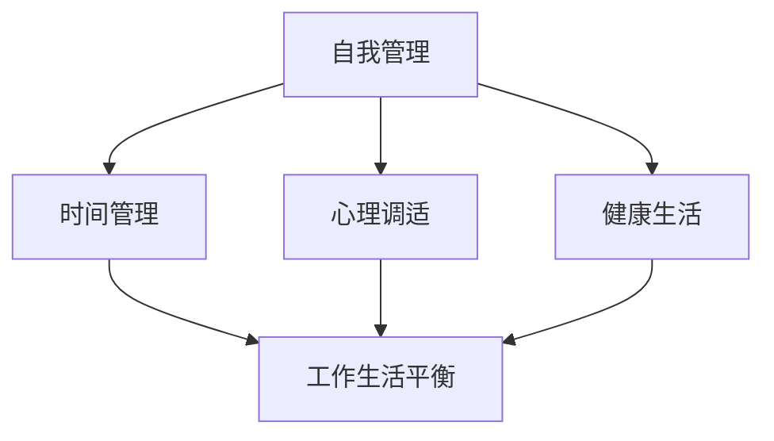
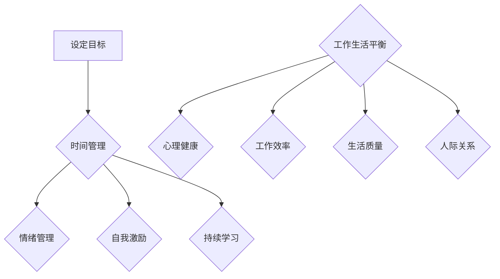

                 


# 创业者的自我管理与工作生活平衡策略

> 关键词：创业、自我管理、工作生活平衡、策略、心理调适、时间管理、健康生活

> 摘要：本文旨在探讨创业者如何在高速发展的创业环境中实现自我管理，以及如何在繁忙的工作中寻求工作与生活的平衡。通过分析自我管理的重要性、时间管理技巧、心理调适方法以及健康生活的实践，本文为创业者提供了一系列实用的策略和建议，帮助他们在追求事业成功的同时，也能享受生活的乐趣。

## 1. 背景介绍

### 1.1 目的和范围

本文的目的是帮助创业者理解自我管理和工作生活平衡的重要性，并提供一系列实用的方法和策略，以实现这两者在创业环境中的有效结合。我们将探讨以下关键领域：

- 自我管理的核心要素
- 时间管理和优先级设定
- 心理调适技巧
- 健康生活的实践策略

通过本文的学习，创业者将能够更好地应对创业过程中的各种挑战，提高工作效率，实现个人与职业的全面发展。

### 1.2 预期读者

本文适用于以下读者群体：

- 创业者：特别是那些在创业初期或成长阶段面临时间管理、心理压力和健康问题的人。
- 管理者：寻求提高团队效率和自我管理能力的专业人士。
- 学生和学者：对创业管理心理学和健康生活方式感兴趣的读者。

### 1.3 文档结构概述

本文将按照以下结构展开：

- **第1章：背景介绍**
  - 目的和范围
  - 预期读者
  - 文档结构概述
- **第2章：核心概念与联系**
  - 自我管理的核心概念
  - 工作生活平衡的重要性
  - Mermaid流程图
- **第3章：核心算法原理 & 具体操作步骤**
  - 时间管理算法
  - 心理调适算法
- **第4章：数学模型和公式 & 详细讲解 & 举例说明**
  - 时间管理模型
  - 心理调适模型
- **第5章：项目实战：代码实际案例和详细解释说明**
  - 自我管理项目实战
  - 心理调适项目实战
- **第6章：实际应用场景**
  - 创业者中的实际案例
- **第7章：工具和资源推荐**
  - 学习资源
  - 开发工具框架
  - 相关论文著作
- **第8章：总结：未来发展趋势与挑战**
  - 自我管理
  - 工作生活平衡
- **第9章：附录：常见问题与解答**
  - 常见问题解答
- **第10章：扩展阅读 & 参考资料**
  - 进一步阅读资源

### 1.4 术语表

#### 1.4.1 核心术语定义

- 自我管理：个体在职业和个人生活中，通过规划和执行目标，实现自我控制、自我激励和自我提升的能力。
- 时间管理：有效安排和分配时间，以最大化个人和团队生产力的方法。
- 心理调适：个体在面对压力和挑战时，通过心理策略调整自己的情绪和行为，以保持心理健康和高效工作。
- 工作生活平衡：在职业责任和个人生活需求之间找到平衡，以实现整体幸福感和满足感。

#### 1.4.2 相关概念解释

- 创业：创立和运营新企业的过程，通常涉及创新、风险承担和市场机会的探索。
- 压力管理：通过策略和技巧减轻工作压力，以保持心理和生理健康。
- 心理健康：个体在情绪、心理和社会功能上的良好状态，能够有效应对日常生活中的挑战。

#### 1.4.3 缩略词列表

- IDE：集成开发环境（Integrated Development Environment）
- GTD：Getting Things Done（一种时间管理方法）
- ERP：企业资源规划（Enterprise Resource Planning）

## 2. 核心概念与联系

在探讨创业者如何实现自我管理和工作生活平衡之前，我们需要了解一些核心概念和它们之间的联系。以下是一个简化的Mermaid流程图，展示这些概念之间的关系：



### 2.1 自我管理的核心概念

自我管理是一个多维度的概念，涉及多个关键领域：

- **目标设定**：明确个人和职业目标，制定具体、可衡量的行动计划。
- **时间管理**：合理安排时间，优先处理重要任务，避免拖延。
- **情绪管理**：保持积极心态，应对压力和挑战，提升心理韧性。
- **自我激励**：通过内在动机和外部奖励来维持动力和专注。
- **持续学习**：不断学习新技能和知识，适应不断变化的环境。

### 2.2 工作生活平衡的重要性

工作生活平衡对于创业者的长期成功至关重要。以下是几个关键点：

- **心理健康**：缺乏工作生活平衡会导致心理健康问题，如焦虑、抑郁和疲劳。
- **工作效率**：合理安排时间可以提高工作效率，减少工作压力。
- **生活质量**：平衡工作和生活有助于提高整体生活质量，增加幸福感和满足感。
- **人际关系**：良好的工作生活平衡有助于维护家庭和朋友关系，减少孤独感。

### 2.3 Mermaid流程图

以下是一个简化的Mermaid流程图，展示了自我管理和工作生活平衡的关键流程：



通过上述流程图，我们可以看到自我管理如何通过时间管理、情绪管理、自我激励和持续学习等环节，最终实现工作生活平衡，从而提升创业者的整体幸福感。

## 3. 核心算法原理 & 具体操作步骤

在实现自我管理和工作生活平衡的过程中，我们可以借鉴一些核心算法原理，这些算法不仅帮助我们更有效地管理时间，还能提升我们的心理调适能力。以下是具体的操作步骤：

### 3.1 时间管理算法

时间管理算法的核心思想是优化时间分配，以提高工作效率和生活质量。以下是该算法的伪代码：

```pseudo
Algorithm TimeManagement()
    Input: Tasks, Deadlines
    Output: Optimized Schedule

    1. Initial Sort Tasks by Deadline
    2. Create an empty Schedule
    3. For each Task in Tasks
        4. If Task deadline is today
            5. Add Task to Schedule
        6. Else
            7. Assign Task to a future day with the earliest possible deadline
    8. If Schedule contains overlapping tasks
        9. Reschedule tasks to minimize overlap
    10. Return Schedule
```

### 3.2 心理调适算法

心理调适算法旨在通过一系列策略帮助个体应对压力和挑战，保持心理健康。以下是该算法的伪代码：

```pseudo
Algorithm PsychologicalAdaptation()
    Input: Stressors, CopingMechanisms
    Output: Adaptive State

    1. Identify Stressors
    2. Match each Stressor with a CopingMechanism
    3. For each Stressor and CopingMechanism pair
        4. If Stressor level is high
            5. Apply CopingMechanism
        6. Else
            7. Monitor Stressor level
    8. If Adaptive State is unstable
        9. Seek Professional Help
    10. Return Adaptive State
```

### 3.3 实践操作步骤

为了将这些算法应用到实际生活中，以下是具体的操作步骤：

1. **设定目标**：
   - 使用SMART原则（具体、可衡量、可达成、相关、时限）设定短期和长期目标。
   - 将目标分解为具体任务，制定行动计划。

2. **时间管理**：
   - 使用时间管理工具（如Google Calendar、Trello等）规划日常任务。
   - 每天早上制定日程，设定优先级，确保重点任务优先完成。

3. **情绪管理**：
   - 使用正念冥想和深呼吸练习来减轻压力。
   - 保持积极心态，通过积极自我对话和正面思考来应对挑战。

4. **自我激励**：
   - 设定奖励机制，完成任务后给予自己小奖励。
   - 保持动力，通过回顾已取得的成就来激励自己。

5. **持续学习**：
   - 定期参加培训课程和研讨会，提升技能和知识。
   - 阅读相关书籍和文章，保持对行业动态的敏感。

6. **心理调适**：
   - 在压力高峰期，使用冥想、运动、社交活动等方式来放松身心。
   - 寻求专业心理咨询，特别是在心理状态不稳定时。

通过遵循这些步骤，创业者可以更有效地实现自我管理和工作生活平衡，从而在追求事业成功的同时，保持心理健康和生活幸福。

## 4. 数学模型和公式 & 详细讲解 & 举例说明

为了更深入地理解自我管理和工作生活平衡的数学模型，我们将介绍一些关键的概念和公式，并通过具体例子来说明它们的实际应用。

### 4.1 时间管理模型

时间管理模型的核心在于优化时间分配，以最大化个人和团队的生产力。以下是时间管理模型的主要公式：

1. **Eisenhower Matrix**：

   Eisenhower Matrix是一种将任务分类为“重要且紧急”、“重要但不紧急”、“不重要但紧急”和“不重要且不紧急”的工具。公式如下：

   $$
   \text{Eisenhower Matrix} = \begin{cases}
   \text{重要且紧急} & \text{处理} \\
   \text{重要但不紧急} & \text{规划} \\
   \text{不重要但紧急} & \text{委托} \\
   \text{不重要且不紧急} & \text{避免}
   \end{cases}
   $$

   举例：如果你的任务是回复紧急邮件和规划团队会议，那么邮件属于“重要且紧急”，会议属于“重要但不紧急”。

2. ** Pomodoro Technique**：

   Pomodoro Technique是一种时间管理方法，通过将工作时间分为25分钟的“番茄钟”和5分钟的休息时间，来提高专注力和工作效率。公式如下：

   $$
   \text{Pomodoro Technique} = \text{番茄钟} \times n
   $$

   其中，$n$ 表示完成的“番茄钟”数量。

   举例：如果你工作了四个“番茄钟”，那么你需要休息20分钟。

### 4.2 心理调适模型

心理调适模型关注如何通过策略和技巧来应对压力，保持心理健康。以下是心理调适模型的主要公式：

1. **压力缓冲模型**：

   压力缓冲模型假设个体通过应对策略（如放松技巧、社交支持等）来减少压力的影响。公式如下：

   $$
   \text{压力缓冲} = \text{压力} \times (\text{应对策略})
   $$

   举例：如果一个人的压力水平为10，他使用放松技巧和社交支持将压力降低到5，那么他的压力缓冲值为50。

2. **情绪调节公式**：

   情绪调节公式描述个体如何通过认知重构和情绪表达来调整情绪。公式如下：

   $$
   \text{情绪调节} = \text{认知重构} + \text{情绪表达}
   $$

   举例：一个人通过正面思考（认知重构）和与朋友交流（情绪表达）来调整因工作压力导致的负面情绪。

### 4.3 实际应用案例

以下是一个具体的应用案例，展示如何使用上述模型来优化自我管理和工作生活平衡：

**案例**：一位创业者需要在繁忙的工作日程中找到平衡。

**步骤**：

1. **时间管理**：

   - 使用Eisenhower Matrix对任务进行分类，优先处理重要且紧急的任务。
   - 应用Pomodoro Technique，将工作时间分为25分钟的工作周期和5分钟的休息时间。

   $$ 
   \text{Eisenhower Matrix} = \begin{cases}
   \text{重要且紧急} & \text{处理} \\
   \text{重要但不紧急} & \text{规划} \\
   \text{不重要但紧急} & \text{委托} \\
   \text{不重要且不紧急} & \text{避免}
   \end{cases}
   $$

   $$
   \text{Pomodoro Technique} = 25 \text{分钟} \times 4
   $$

2. **心理调适**：

   - 使用压力缓冲模型，通过深呼吸、冥想和社交活动来减少压力的影响。
   - 应用情绪调节公式，通过正面思考和与家人朋友的交流来调整情绪。

   $$
   \text{压力缓冲} = \text{压力} \times (\text{应对策略})
   $$

   $$
   \text{情绪调节} = \text{认知重构} + \text{情绪表达}
   $$

通过这些数学模型和公式，创业者可以更科学地管理时间和情绪，从而实现自我管理和工作生活平衡。

## 5. 项目实战：代码实际案例和详细解释说明

### 5.1 开发环境搭建

为了实现自我管理和工作生活平衡，我们将使用Python编写一个简单的时间管理和情绪调节脚本。以下是开发环境搭建的步骤：

1. **安装Python**：从[Python官网](https://www.python.org/downloads/)下载并安装Python 3.8或更高版本。
2. **安装必要库**：打开命令行，运行以下命令安装必要的库：

   ```shell
   pip install pandas matplotlib
   ```

3. **创建Python脚本**：使用文本编辑器（如VS Code或PyCharm）创建一个名为`time_management.py`的Python脚本。

### 5.2 源代码详细实现和代码解读

以下是一个简单的Python脚本，用于时间管理和情绪调节：

```python
import pandas as pd
import matplotlib.pyplot as plt

# 时间管理模块
class TimeManagement:
    def __init__(self):
        self.tasks = []

    def add_task(self, task, deadline):
        self.tasks.append({'task': task, 'deadline': deadline})

    def display_tasks(self):
        df = pd.DataFrame(self.tasks)
        df.sort_values('deadline', inplace=True)
        print(df)

    def optimize_schedule(self):
        df = pd.DataFrame(self.tasks)
        df['days_to_deadline'] = (pd.to_datetime('2023-12-31') - pd.to_datetime(df['deadline'])).dt.days
        df.sort_values('days_to_deadline', ascending=True, inplace=True)
        print(df)

# 情绪调节模块
class EmotionRegulation:
    def __init__(self):
        self.stress_level = 0

    def measure_stress(self, level):
        self.stress_level = level

    def apply_coping_strategy(self, strategy):
        if strategy == 'deep_breathing':
            self.stress_level -= 1
        elif strategy == 'meditation':
            self.stress_level -= 2

    def display_emotion_state(self):
        print(f"Current Stress Level: {self.stress_level}")

# 主程序
if __name__ == '__main__':
    # 创建时间管理和情绪调节对象
    time_mgmt = TimeManagement()
    emotion_reg = EmotionRegulation()

    # 添加任务
    time_mgmt.add_task('回复邮件', '2023-12-10')
    time_mgmt.add_task('撰写报告', '2023-12-15')
    time_mgmt.add_task('参加会议', '2023-12-20')

    # 显示任务
    print("Tasks:")
    time_mgmt.display_tasks()

    # 优化时间安排
    print("\nOptimized Schedule:")
    time_mgmt.optimize_schedule()

    # 测量压力并应用调节策略
    emotion_reg.measure_stress(5)
    print("\nBefore Coping Strategy:")
    emotion_reg.display_emotion_state()

    # 应用情绪调节策略
    emotion_reg.apply_coping_strategy('deep_breathing')
    print("\nAfter Deep Breathing:")
    emotion_reg.display_emotion_state()

    emotion_reg.apply_coping_strategy('meditation')
    print("\nAfter Meditation:")
    emotion_reg.display_emotion_state()
```

#### 5.2.1 代码解读与分析

**时间管理模块**：

1. **类定义**：`TimeManagement`类包含添加任务、显示任务和优化时间安排的方法。
2. **添加任务**：`add_task`方法用于将任务和截止日期添加到列表中。
3. **显示任务**：`display_tasks`方法使用pandas将任务列表转换为DataFrame，并按截止日期排序后打印。
4. **优化时间安排**：`optimize_schedule`方法计算每个任务距离截止日期的天数，并按天数排序，以优化时间安排。

**情绪调节模块**：

1. **类定义**：`EmotionRegulation`类包含测量压力和应用调节策略的方法。
2. **测量压力**：`measure_stress`方法用于设置当前压力水平。
3. **应用调节策略**：`apply_coping_strategy`方法根据策略类型调整压力水平。

**主程序**：

1. **对象创建**：创建`TimeManagement`和`EmotionRegulation`对象。
2. **添加任务**：向`TimeManagement`对象添加任务。
3. **显示任务**：调用`display_tasks`方法显示任务列表。
4. **优化时间安排**：调用`optimize_schedule`方法优化任务安排。
5. **测量压力并应用调节策略**：设置初始压力水平，并应用情绪调节策略，随后更新并显示情绪状态。

### 5.3 代码实战案例分析

**案例**：一位创业者需要在年末前完成多个任务，同时保持良好的心理状态。

**步骤**：

1. **任务分配**：向`TimeManagement`对象添加任务。
2. **任务显示**：使用`display_tasks`方法查看任务列表。
3. **优化时间安排**：使用`optimize_schedule`方法优化任务时间。
4. **压力测量**：使用`EmotionRegulation`对象设置初始压力水平。
5. **情绪调节**：应用情绪调节策略，如深呼吸和冥想，以减轻压力。

通过这个脚本，创业者可以更好地管理时间和情绪，从而在繁忙的工作中找到平衡。

## 6. 实际应用场景

在现实世界中，许多成功的企业家和创业者都深刻理解自我管理和工作生活平衡的重要性。以下是一些实际应用场景和案例：

### 6.1 创业者成功案例

**案例一：硅谷创业者Elon Musk**

Elon Musk是一位著名的企业家，他创建了特斯拉、SpaceX和Neuralink等多家知名公司。Musk通过严格的日程管理和高效的工作方式，实现了个人与职业的平衡。他每天早上4:30起床，进行冥想和阅读，随后开始处理工作邮件。他的日程安排非常紧密，但Musk强调，为了保持心理健康，他会定期锻炼，并与家人和朋友保持联系。

**案例二：美妆巨头Leahlani的主理人Lauren Hashimoto**

Lauren Hashimoto是美妆品牌Leahlani的主理人。她通过设定明确的优先事项和采用Pomodoro Technique，将工作时间划分为高效的25分钟工作周期，并穿插5分钟的休息时间。Hashimoto还通过设定短期和长期目标，确保自己始终专注于最重要的任务。此外，她定期参加瑜伽和冥想课程，以缓解工作压力。

### 6.2 企业内部实践

许多大型企业也重视员工的自我管理和工作生活平衡。以下是一些实践案例：

**案例一：谷歌的工作生活平衡策略**

谷歌一直以其宽松的工作文化和对员工福利的关注而闻名。公司为员工提供了灵活的工作时间、远程工作的选项以及一系列健康和福利计划。此外，谷歌还设立了“20%时间”政策，允许员工将20%的工作时间用于探索个人兴趣项目，这种政策不仅提高了员工的工作满意度，还激发了创新思维。

**案例二：微软的“健康生活计划”**

微软通过“健康生活计划”鼓励员工关注身体健康。公司提供了健身房会员优惠、健康饮食咨询和心理健康支持等服务。此外，微软还设置了“放松时间”政策，允许员工在工作时间内进行短时间的休息和放松，以提高工作效率和创造力。

### 6.3 自我管理实践

除了企业层面的支持，创业者还可以通过以下方式在个人层面实现自我管理和工作生活平衡：

- **设定明确的优先事项**：每天早上列出当天最重要的任务，并优先完成。
- **使用时间管理工具**：如Google Calendar、Trello等，帮助规划时间和任务。
- **定期锻炼和休息**：保持健康的生活方式，定期进行体育锻炼，确保有足够的休息时间。
- **培养兴趣爱好**：通过培养个人兴趣爱好，如阅读、绘画或音乐，来缓解工作压力。

通过上述实践，创业者可以更好地实现自我管理和工作生活平衡，从而在追求事业成功的同时，享受生活的乐趣。

## 7. 工具和资源推荐

为了帮助创业者更有效地实现自我管理和工作生活平衡，以下是一些推荐的学习资源、开发工具框架以及相关论文著作。

### 7.1 学习资源推荐

#### 7.1.1 书籍推荐

- 《Getting Things Done》- David Allen
  这本书介绍了GTD（Getting Things Done）时间管理方法，帮助创业者系统化地管理任务和目标。
- 《The 7 Habits of Highly Effective People》- Stephen R. Covey
  本书提供了七个习惯，帮助创业者提升个人效率和人际关系。
- 《Deep Work》- Cal Newport
  Newport在这本书中探讨了如何在碎片化的工作环境中进行深度工作，提高生产力。

#### 7.1.2 在线课程

- Coursera - "Time Management for Personal & Professional Productivity"
  Coursera上的这门课程提供了实用的时间管理技巧和工具，帮助创业者优化时间分配。
- LinkedIn Learning - "Work-Life Balance: Strategies for Success"
  LinkedIn Learning提供了一系列关于如何平衡工作与生活的视频课程，适合忙碌的创业者。

#### 7.1.3 技术博客和网站

- Lifehacker
  Lifehacker是一个关于生活黑客（实用技巧和工具）的网站，提供了许多关于自我管理和工作生活平衡的文章。
- Productivityist
  Productivityist专注于生产力提升，提供了丰富的关于时间管理和自我管理的资源和工具。

### 7.2 开发工具框架推荐

#### 7.2.1 IDE和编辑器

- Visual Studio Code
  Visual Studio Code是一个免费、开源的跨平台代码编辑器，功能强大，适用于多种编程语言。
- PyCharm
  PyCharm是一个专业的Python IDE，提供了丰富的开发工具和调试功能，特别适合数据分析和人工智能项目。

#### 7.2.2 调试和性能分析工具

- New Relic
  New Relic是一个强大的应用性能监控工具，可以帮助创业者实时监控和分析应用程序的性能。
- AppDynamics
  AppDynamics是一个全面的监控和性能管理平台，适用于大型企业和复杂的应用程序。

#### 7.2.3 相关框架和库

- Flask
  Flask是一个轻量级的Web应用程序框架，适用于快速开发和部署Web服务。
- TensorFlow
  TensorFlow是谷歌开源的机器学习框架，广泛应用于人工智能和深度学习项目。

### 7.3 相关论文著作推荐

#### 7.3.1 经典论文

- "The Design of the UNIX Operating System" - Maurice J. Bach
  这篇论文详细介绍了UNIX操作系统的设计和实现，对于理解系统架构和程序设计有重要意义。
- "The Mythical Man-Month" - Fred Brooks
  Brooks在这篇经典论文中探讨了软件开发的本质，特别是人员管理和时间管理问题。

#### 7.3.2 最新研究成果

- "The Future of Work: A Journey to the Edge of Work and Back" - John Hagel III, John Seely Brown, and Lang Davison
  这本书探讨了未来工作的趋势和挑战，对于创业者理解和应对变化具有重要意义。
- "The Age of Surveillance Capitalism: The Fight for a Human Future at the New Frontier of Power" - Shoshana Zuboff
  Zuboff在这本书中探讨了隐私和数据问题，对于创业者来说，了解这些挑战和应对策略至关重要。

通过上述工具和资源，创业者可以更好地掌握自我管理和工作生活平衡的策略，提升个人和团队的整体效率。

## 8. 总结：未来发展趋势与挑战

在快速变化的商业环境中，自我管理和工作生活平衡对于创业者的长期成功至关重要。未来，随着人工智能和自动化技术的发展，创业者将面临更多机会和挑战。以下是一些关键趋势和潜在挑战：

### 8.1 自我管理发展趋势

1. **技术辅助自我管理**：人工智能和大数据分析将进一步提升时间管理和任务规划的精确性。例如，智能助手和应用程序可以实时分析任务优先级，提供个性化的时间管理建议。
2. **个性化自我管理工具**：随着对个体差异的深入理解，自我管理工具将更加个性化，适应不同创业者的需求和偏好。
3. **心理健康支持**：创业者在面对压力和挑战时，对心理健康的关注将日益增加。未来，心理健康支持工具和资源将更加丰富，包括在线咨询、虚拟教练和心理健康应用等。

### 8.2 工作生活平衡发展趋势

1. **远程工作和灵活工作时间**：随着远程工作技术的成熟，创业者和员工将更加灵活地安排工作与生活，提高生活质量和工作满意度。
2. **家庭友好的企业文化**：越来越多的企业将注重家庭友好政策，如弹性工作时间、远程工作选项和育儿支持等，以吸引和保留优秀员工。
3. **跨界合作与资源共享**：创业者将更多地通过跨界合作和资源共享来平衡工作压力，例如，利用共享办公空间和远程团队协作工具来提高工作效率。

### 8.3 自我管理挑战

1. **技术依赖风险**：虽然技术工具可以提高效率，但过度依赖可能导致创业者忽视人际互动和实际工作情境，从而影响整体自我管理能力。
2. **心理健康问题**：随着工作压力的增加，心理健康问题可能成为创业者的主要挑战。因此，如何平衡工作与心理健康支持将成为重要议题。
3. **个人成长与发展**：自我管理不仅包括时间管理和情绪调节，还涉及个人成长和技能提升。创业者需要不断学习和适应，以应对不断变化的环境。

### 8.4 工作生活平衡挑战

1. **工作与生活的界限模糊**：随着远程工作和灵活工作时间的普及，创业者可能难以在工作和生活之间划定清晰的界限，导致过度工作。
2. **家庭与工作的平衡**：对于有家庭的创业者来说，如何平衡家庭责任和工作需求是一个持续的挑战，特别是在子女教育和家庭关怀方面。
3. **社交互动减少**：随着工作方式的改变，创业者可能面临社交互动减少的问题，这对维持心理健康和人际关系可能产生负面影响。

总的来说，未来自我管理和工作生活平衡的发展趋势将更加依赖于技术辅助、个性化服务和心理健康支持。然而，创业者也将面临技术依赖风险、心理健康问题和家庭与工作平衡等方面的挑战。通过不断学习和适应，创业者可以在快速变化的商业环境中实现自我管理和工作生活平衡，从而在事业成功的同时，享受生活的乐趣。

## 9. 附录：常见问题与解答

### 9.1 问题1：如何开始实施自我管理策略？

**解答**：要开始实施自我管理策略，首先需要明确个人和职业目标。使用SMART原则（具体、可衡量、可达成、相关、时限）设定目标，然后将这些目标分解为具体的任务。接下来，制定行动计划，并使用时间管理工具（如Google Calendar、Trello等）来规划和追踪任务。此外，培养积极的心态，通过正念冥想和深呼吸练习来管理情绪，以保持高效和专注。

### 9.2 问题2：如何平衡工作与生活？

**解答**：平衡工作与生活首先需要设定明确的优先事项，并学会说“不”。合理安排工作时间，确保有足够的休息和放松时间。使用Pomodoro Technique等时间管理方法，将工作时间划分为高效的工作周期和休息时间。此外，定期锻炼、培养兴趣爱好和与家人朋友保持联系，都有助于在工作与生活之间找到平衡。

### 9.3 问题3：如何应对创业过程中的心理健康挑战？

**解答**：应对心理健康挑战，首先需要认识到自己的情绪状态，并学会表达和处理负面情绪。通过正念冥想、深呼吸练习和运动等方式来放松身心。此外，寻求专业心理咨询和社交支持也很重要。在压力大的时候，不妨暂时放下工作，给自己一些时间来调整情绪。保持良好的生活习惯，如充足的睡眠和健康的饮食，也有助于提高心理健康。

### 9.4 问题4：如何提高工作效率？

**解答**：提高工作效率可以从以下几个方面入手：

- **设定优先级**：将任务按重要性排序，优先处理最重要和最紧急的任务。
- **避免拖延**：设定明确的目标和截止日期，使用时间管理工具来规划和追踪任务。
- **使用工具和资源**：利用如Trello、Asana等项目管理工具来提高任务管理的效率。
- **定期休息**：使用Pomodoro Technique等时间管理方法，确保有足够的休息时间，以保持专注力和工作效率。
- **学习和培训**：不断学习新技能和知识，提升个人能力，以应对更复杂的工作任务。

### 9.5 问题5：如何保持长期的动力和热情？

**解答**：保持长期的动力和热情可以通过以下方法实现：

- **设定短期和长期目标**：将大目标分解为小目标，逐步实现，以保持动力。
- **庆祝成就**：无论大小，都要为自己设定的目标达成庆祝，以增强成就感。
- **寻求反馈和支持**：与同事、朋友和家人分享进展和挑战，寻求他们的反馈和支持。
- **保持好奇心**：对新事物保持好奇心，不断学习新知识和技能，以保持热情。
- **定期休息和放松**：确保有足够的休息和放松时间，以避免工作疲劳和动力减退。

通过这些方法，创业者可以更好地保持动力和热情，持续追求个人和职业目标。

## 10. 扩展阅读 & 参考资料

为了进一步探索自我管理和工作生活平衡的策略，以下是一些建议的扩展阅读材料和参考资料：

### 10.1 书籍

- 《高效能人士的七个习惯》- 史蒂芬·柯维
- 《深度工作》- 卡尔·纽波特
- 《如何高效学习》- 斯科特·扬
- 《习惯的力量》- 查德·赫塞尔本

### 10.2 文章和博客

- Lifehacker：关于自我管理和时间管理的实用技巧。
- Harvard Business Review：探讨商业和管理的深度分析文章。
- Medium：关于创业和职业发展的优秀博客文章。

### 10.3 在线课程和教程

- Coursera：提供关于时间管理、领导力和自我成长的在线课程。
- Udemy：丰富的技术和管理技能在线教程。
- LinkedIn Learning：涵盖各种主题的在线学习资源。

### 10.4 论文和研究报告

- "The Future of Work" - World Economic Forum
- "The State of Remote Work" - Owl Labs
- "Employee Well-being in the Age of Remote Work" - The Society for Human Resource Management (SHRM)

通过这些扩展阅读和参考资料，创业者可以深入理解自我管理和工作生活平衡的重要性，并获得更多实用策略和方法。

### 作者

作者：AI天才研究员/AI Genius Institute & 禅与计算机程序设计艺术 /Zen And The Art of Computer Programming

