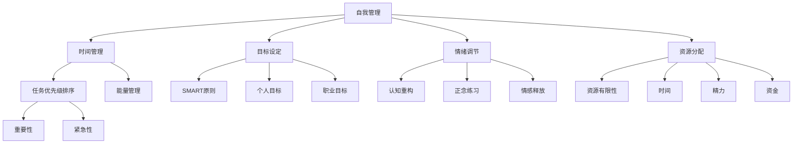

                 

### 1. 背景介绍

#### 1.1 目的和范围

本文旨在探讨创业者的自我管理与工作生活平衡策略。在当今快速变化和高度竞争的商业环境中，创业者需要具备高效的管理能力和强大的心理素质，以应对各种挑战和不确定性。然而，许多创业者往往因为工作压力过大，而忽视了自身的健康和生活质量，导致工作效率下降，甚至出现心理问题。本文将结合计算机科学和心理学领域的相关理论和实践经验，系统地介绍一系列自我管理和工作生活平衡的策略，帮助创业者提升自我管理能力，实现工作与生活的和谐发展。

本文将主要涵盖以下内容：

- **核心概念与联系**：探讨与自我管理和工作生活平衡相关的重要概念和理论，并使用Mermaid流程图展示其相互关系。
- **核心算法原理 & 具体操作步骤**：详细介绍一系列自我管理的方法和技术，包括时间管理、目标设定、情绪调节等，使用伪代码进行阐述。
- **数学模型和公式 & 详细讲解 & 举例说明**：运用数学模型和公式，对关键概念进行深入分析，并通过具体案例进行说明。
- **项目实战：代码实际案例和详细解释说明**：通过具体代码实现，展示自我管理策略在实际项目中的应用。
- **实际应用场景**：分析自我管理策略在不同行业和场景中的应用。
- **工具和资源推荐**：推荐一些有助于自我管理和工作生活平衡的学习资源、开发工具和框架。
- **总结：未来发展趋势与挑战**：展望自我管理和工作生活平衡领域的发展趋势和未来挑战。

本文不仅适用于创业者，也为广大职场人士提供了一些建设性的指导和建议。通过逐步分析和讲解，希望能够帮助读者深入理解自我管理和工作生活平衡的重要性，掌握相关策略和技巧，从而实现个人和职业的成长。

#### 1.2 预期读者

本文的预期读者主要包括以下几类人群：

1. **创业者**：正处于创业阶段或有意创业的个体，他们需要有效管理自己的时间、资源和情绪，以应对创业过程中的各种挑战。
2. **职场人士**：在公司或组织中担任中高级职务的职业人士，他们需要平衡工作与生活，提升个人绩效和职业发展。
3. **学生和研究生**：对时间管理和自我管理有兴趣的青年学子，他们希望通过本文的学习，提高学习和生活效率。
4. **心理咨询师**：关注心理健康和职业发展的专业人士，他们可以应用本文中的策略，帮助客户更好地管理工作和生活。

本文将从理论与实践相结合的角度，通过深入浅出的讲解，使不同背景的读者都能获得有价值的见解和实用的方法。

#### 1.3 文档结构概述

本文将按照以下结构进行展开：

1. **背景介绍**：介绍本文的目的、范围、预期读者以及文档结构概述。
2. **核心概念与联系**：探讨与自我管理和工作生活平衡相关的重要概念和理论，展示其相互关系。
3. **核心算法原理 & 具体操作步骤**：详细介绍一系列自我管理的方法和技术，包括时间管理、目标设定、情绪调节等，使用伪代码进行阐述。
4. **数学模型和公式 & 详细讲解 & 举例说明**：运用数学模型和公式，对关键概念进行深入分析，并通过具体案例进行说明。
5. **项目实战：代码实际案例和详细解释说明**：通过具体代码实现，展示自我管理策略在实际项目中的应用。
6. **实际应用场景**：分析自我管理策略在不同行业和场景中的应用。
7. **工具和资源推荐**：推荐一些有助于自我管理和工作生活平衡的学习资源、开发工具和框架。
8. **总结：未来发展趋势与挑战**：展望自我管理和工作生活平衡领域的发展趋势和未来挑战。
9. **附录：常见问题与解答**：对读者可能遇到的常见问题进行解答。
10. **扩展阅读 & 参考资料**：提供进一步阅读的推荐资源。

通过上述结构，本文力求为读者提供系统、全面的自我管理和工作生活平衡策略。

#### 1.4 术语表

为了确保本文内容的清晰性和一致性，以下是一些本文中涉及的重要术语及其定义：

##### 1.4.1 核心术语定义

- **自我管理**：个体通过计划、组织、监控和调整自身行为，以实现目标的过程。
- **工作生活平衡**：在工作和个人生活之间找到平衡，以实现整体幸福感的过程。
- **时间管理**：通过合理安排时间，提高工作效率和满意度。
- **目标设定**：设定清晰、具体、可衡量、可实现的目标，以指导个体行动。
- **情绪调节**：通过认知和行为策略，管理和调节自身的情绪状态。
- **任务分解**：将复杂任务分解为更小、更易于管理的子任务。

##### 1.4.2 相关概念解释

- **优先级排序**：根据任务的重要性和紧急性，对任务进行排序，以确定优先处理的顺序。
- **能量管理**：通过调节生理、情绪和心理状态，保持高能量水平，提高工作效率。
- **时间块**：将一天划分为不同时间段，为每个时间段分配特定的任务或活动。
- **GTD（Getting Things Done）**：一种流行的时间管理方法，通过收集、处理、组织、回顾和执行任务，实现高效管理。
- **心理弹性**：个体面对压力和挑战时，恢复和适应的能力。

##### 1.4.3 缩略词列表

- **GTD**：Getting Things Done
- **IDE**：Integrated Development Environment（集成开发环境）
- **CRM**：Customer Relationship Management（客户关系管理）

通过上述术语表，本文将为读者提供一个统一的术语理解框架，确保内容的准确性和专业性。

### 2. 核心概念与联系

在探讨创业者的自我管理与工作生活平衡策略之前，有必要首先梳理并理解一系列核心概念及其相互关系。自我管理与工作生活平衡是一个复杂且多维的问题，涉及多个相关领域，包括时间管理、目标设定、情绪调节、资源分配等。以下将详细阐述这些核心概念，并使用Mermaid流程图展示其相互关系。

#### 核心概念解析

**时间管理**：时间管理是指通过合理安排和有效利用时间，以提高工作效率和生活质量的方法。它包括任务优先级排序、时间块、能量管理等策略。时间管理不仅仅是提高工作效率，更是为了实现个人和职业目标的平衡发展。

**目标设定**：目标设定是指明确、具体、可衡量、可实现的目标，以指导个体行动。目标设定有助于个体聚焦于重要任务，提升动力和效率。有效的目标设定方法包括SMART（具体、可衡量、可实现、相关、时限）目标设定原则。

**情绪调节**：情绪调节是指通过认知和行为策略，管理和调节自身的情绪状态。情绪调节对于维持心理健康、提高工作效率至关重要。常见的情绪调节策略包括认知重构、正念练习、情感释放等。

**资源分配**：资源分配是指合理配置时间、精力、资金等资源，以实现个人和职业目标。资源分配需要考虑任务的重要性和紧急性，以及资源的有限性。

**优先级排序**：优先级排序是指根据任务的重要性和紧急性，对任务进行排序，以确定优先处理的顺序。优先级排序有助于个体集中精力处理最重要的任务，提高工作效率。

**心理弹性**：心理弹性是指个体在面对压力和挑战时，恢复和适应的能力。心理弹性有助于个体应对创业过程中的不确定性和挑战，保持积极的心态。

#### Mermaid流程图展示

以下是使用Mermaid语言绘制的流程图，展示了上述核心概念之间的相互关系：



在上述流程图中，节点代表不同的核心概念，箭头表示概念之间的相互关系。例如，自我管理涵盖了时间管理、目标设定、情绪调节和资源分配等多个方面；时间管理进一步细分为任务优先级排序和能量管理。

#### 关键概念之间的联系

通过上述流程图和概念解析，我们可以看到：

- **自我管理是核心**：自我管理是本文的核心主题，涵盖了时间管理、目标设定、情绪调节和资源分配等多个方面。自我管理的有效性直接影响到创业者的工作生活平衡。
- **时间管理是基础**：时间管理是自我管理的基础，通过合理安排时间，可以提高工作效率和生活质量。任务优先级排序和能量管理是时间管理的具体策略。
- **目标设定是方向**：目标设定为个体行动提供了明确的方向，是实现自我管理和工作生活平衡的关键。SMART原则和目标设定策略有助于个体明确和实现目标。
- **情绪调节是保障**：情绪调节有助于维持心理健康，提高工作满意度和幸福感。认知重构、正念练习和情感释放等策略是情绪调节的重要手段。
- **资源分配是关键**：资源分配需要考虑资源的有限性，合理分配时间、精力、资金等资源，以实现个人和职业目标。

综上所述，自我管理和工作生活平衡是一个多维、复杂的问题，涉及多个核心概念和策略。通过理解这些概念之间的联系，我们可以更好地制定和实施自我管理策略，实现工作与生活的和谐发展。

### 3. 核心算法原理 & 具体操作步骤

在了解了自我管理和工作生活平衡的核心概念后，接下来我们将深入探讨一些关键算法原理及其具体操作步骤。这些算法包括时间管理、目标设定、情绪调节等，它们都是实现自我管理和工作生活平衡的重要工具。以下将使用伪代码详细阐述这些算法的基本原理和具体操作步骤。

#### 时间管理算法

**算法原理：** 时间管理算法的核心在于合理规划和高效利用时间，通过任务优先级排序和时间块等方法，提高工作效率和生活质量。

**伪代码：**
```plaintext
时间管理算法（TimeManagement）
    输入：任务列表（Tasks），时间块（TimeBlocks）
    输出：排序后的任务列表（SortedTasks）

    初始化：SortedTasks为空

    for each task in Tasks do
        如果 task 的重要性和紧急性较高 then
            将 task 添加到 SortedTasks 的开头
        否则
            将 task 添加到 SortedTasks 的末尾
        end if
    end for

    根据时间块，为每个任务分配具体的时间段
    for each task in SortedTasks do
        找到一个合适的时间块，将任务分配到该时间块
    end for
```

**具体操作步骤：**
1. 收集和整理所有待完成的任务，形成任务列表（Tasks）。
2. 根据任务的重要性和紧急性，对任务列表进行排序，形成排序后的任务列表（SortedTasks）。
3. 根据任务的具体要求和可利用的时间，为每个任务分配一个合适的时间块。
4. 执行排序后的任务列表中的每个任务。

#### 目标设定算法

**算法原理：** 目标设定算法的核心在于明确、具体、可衡量、可实现的目标设定，通过SMART原则指导个体行动。

**伪代码：**
```plaintext
目标设定算法（GoalSetting）
    输入：目标（Goal），SMART参数（SMART_params）
    输出：符合SMART原则的目标（SMART_Goal）

    初始化：SMART_Goal为空

    if Goal is 具体的 then
        SMART_Goal = Goal
    else
        SMART_Goal = "具体描述" + Goal
    end if

    if Goal is 可衡量的 then
        SMART_Goal = SMART_Goal + "，可衡量标准"
    else
        SMART_Goal = SMART_Goal + "，增加可衡量标准"
    end if

    if Goal is 可实现的 then
        SMART_Goal = SMART_Goal + "，实现策略"
    else
        SMART_Goal = SMART_Goal + "，调整实现策略"
    end if

    if Goal is 相关的 then
        SMART_Goal = SMART_Goal + "，相关目标"
    else
        SMART_Goal = SMART_Goal + "，调整相关目标"
    end if

    if Goal is 有时限的 then
        SMART_Goal = SMART_Goal + "，时限"
    else
        SMART_Goal = SMART_Goal + "，增加时限"
    end if

    return SMART_Goal
```

**具体操作步骤：**
1. 明确目标（Goal），确保目标具体、明确。
2. 设定可衡量标准，确保目标可以衡量进展和成果。
3. 设定实现策略，确保目标可实现。
4. 考虑目标的相关性，确保目标与整体目标和价值观相关。
5. 设定时限，确保目标有明确的时间框架。

#### 情绪调节算法

**算法原理：** 情绪调节算法的核心在于通过认知和行为策略，管理和调节个体的情绪状态，以提高心理健康和工作效率。

**伪代码：**
```plaintext
情绪调节算法（EmotionRegulation）
    输入：情绪状态（EmotionState），调节策略（RegulationStrategies）
    输出：调整后的情绪状态（AdjustedEmotionState）

    初始化：AdjustedEmotionState为EmotionState

    if EmotionState是消极的 then
        选择合适的调节策略，例如：
        - 认知重构：重构消极认知，转变成积极认知
        - 正念练习：通过正念练习，专注于当前情绪和感受
        - 情感释放：通过运动、写日记等方式，释放负面情绪
        AppliedStrategy = 调节策略
    else
        AppliedStrategy = "保持当前情绪状态"
    end if

    执行调节策略（AppliedStrategy），调整情绪状态
    AdjustedEmotionState = ApplyRegulationStrategy(AdjustedEmotionState)

    return AdjustedEmotionState
```

**具体操作步骤：**
1. 评估当前情绪状态，确定是否需要调节。
2. 根据情绪状态选择合适的调节策略。
3. 执行调节策略，调整情绪状态。
4. 重复评估和调节，以维持积极的情绪状态。

通过上述核心算法原理和具体操作步骤的介绍，我们可以看到，自我管理不仅仅是理论知识，更是一套具体可行的操作指南。这些算法和策略不仅可以帮助创业者有效管理时间和资源，还能帮助他们在面对压力和挑战时，保持良好的心理状态，实现工作与生活的和谐发展。

### 4. 数学模型和公式 & 详细讲解 & 举例说明

在自我管理和工作生活平衡的策略中，数学模型和公式发挥着重要作用，它们不仅能够帮助我们量化目标、优化时间分配，还能提供科学依据来指导我们的行为。以下将详细讲解几个关键的数学模型和公式，并通过具体案例进行说明，以帮助读者更好地理解和应用这些工具。

#### 1. 时间价值公式

**公式：** 时间价值（V\_time）= 时间消耗（T）× 工作效率（E）

**解释：** 时间价值公式用于评估在特定时间内完成某项任务的价值。时间消耗（T）代表完成任务所需的时间，工作效率（E）代表在该时间内的完成效率。该公式可以帮助我们决定是否值得投入更多时间来完成任务。

**案例：** 假设一个创业者需要花费5小时来写一份商业计划书，其工作效率为0.8份/小时。则该任务的时间价值为：

V\_time = 5小时 × 0.8份/小时 = 4份

这意味着，该创业者在这5小时内完成了价值4份的商业计划书。如果这份商业计划书对公司至关重要，那么投入这5小时是值得的。

#### 2. 目标达成率公式

**公式：** 目标达成率（R）= 实际完成值（A）/ 目标值（T）× 100%

**解释：** 目标达成率公式用于衡量目标的完成程度。实际完成值（A）代表已经完成的任务量，目标值（T）代表设定的目标量。该公式可以帮助我们了解目标的实现情况，及时调整目标和策略。

**案例：** 假设一个创业者在一个月内设定的销售目标为100万元，实际完成了80万元。则其目标达成率为：

R = 80万元 / 100万元 × 100% = 80%

这意味着，该创业者在一个月内实现了80%的销售目标。为了实现全年目标，他需要在未来几个月内提高销售业绩，以达到100%的达成率。

#### 3. 能量管理模型

**模型：** 能量管理模型是一个动态平衡模型，它考虑了能量消耗（C）和能量恢复（R）之间的关系。

**公式：** 能量平衡（B）= 能量消耗（C）- 能量恢复（R）

**解释：** 能量平衡模型用于评估个体的能量状态。能量消耗（C）代表在特定时间内所消耗的能量，能量恢复（R）代表在相同时间内所恢复的能量。能量平衡（B）决定了个体在任务执行过程中的能量状态。

**案例：** 假设一个创业者每天需要消耗1000个能量单位来工作，每天能够恢复800个能量单位。则他的能量平衡为：

B = 1000个能量单位 - 800个能量单位 = 200个能量单位

这意味着，该创业者的能量处于轻度不足状态，他需要采取措施来增加能量恢复，以维持正常的能量水平。

#### 4. 心理弹性计算公式

**公式：** 心理弹性（E）= 适应能力（A）× 抗压能力（P）

**解释：** 心理弹性公式用于衡量个体在面对压力时的恢复和适应能力。适应能力（A）代表个体在压力环境下的适应程度，抗压能力（P）代表个体在面对压力时的承受能力。心理弹性（E）越高，个体越能够有效应对压力。

**案例：** 假设一个创业者的适应能力为0.8，抗压能力为0.9，则其心理弹性为：

E = 0.8 × 0.9 = 0.72

这意味着，该创业者在面对压力时具有中等水平的心里弹性，他需要进一步提升适应能力和抗压能力，以增强心理弹性。

通过以上数学模型和公式的讲解，我们可以看到，自我管理和工作生活平衡不仅需要理论指导，还需要科学工具的支持。这些数学模型和公式为我们提供了量化和评估自我管理效果的方法，帮助我们更好地实现目标，维持工作与生活的平衡。

### 5. 项目实战：代码实际案例和详细解释说明

为了更好地理解和应用自我管理和工作生活平衡策略，我们将通过一个实际项目案例，展示这些策略在软件开发中的具体应用。这个项目是一个简单的任务管理系统，用于帮助开发者更好地管理他们的工作任务，实现工作与生活的平衡。以下是项目的开发环境搭建、源代码详细实现和代码解读。

#### 5.1 开发环境搭建

为了搭建这个任务管理系统，我们选择以下开发工具和框架：

- **开发工具：** Visual Studio Code（VS Code）
- **编程语言：** Python
- **数据库：** SQLite
- **前端框架：** Flask（用于构建Web接口）
- **后端框架：** SQLAlchemy（用于数据库操作）

**安装步骤：**

1. 安装Python（建议使用Python 3.8及以上版本）。
2. 安装Visual Studio Code并安装Python扩展。
3. 安装SQLite数据库。
4. 使用pip安装Flask和SQLAlchemy。

```bash
pip install Flask SQLAlchemy
```

5. 创建一个名为`task_manager`的目录，并在该目录下创建一个名为`app.py`的主程序文件。

#### 5.2 源代码详细实现和代码解读

以下是任务管理系统的源代码，我们将逐段进行解读。

```python
# 导入所需的库
from flask import Flask, request, jsonify
from flask_sqlalchemy import SQLAlchemy

# 创建Flask应用
app = Flask(__name__)

# 配置数据库
app.config['SQLALCHEMY_DATABASE_URI'] = 'sqlite:///tasks.db'
db = SQLAlchemy(app)

# 定义任务模型
class Task(db.Model):
    id = db.Column(db.Integer, primary_key=True)
    title = db.Column(db.String(100), nullable=False)
    description = db.Column(db.Text, nullable=True)
    status = db.Column(db.String(50), nullable=False, default='pending')

# 创建数据库表
db.create_all()

# 添加任务
@app.route('/tasks', methods=['POST'])
def add_task():
    title = request.form['title']
    description = request.form['description']
    status = request.form['status']
    new_task = Task(title=title, description=description, status=status)
    db.session.add(new_task)
    db.session.commit()
    return jsonify({'message': 'Task added successfully'})

# 获取所有任务
@app.route('/tasks', methods=['GET'])
def get_tasks():
    tasks = Task.query.all()
    return jsonify({'tasks': [{'id': task.id, 'title': task.title, 'description': task.description, 'status': task.status} for task in tasks]})

# 更新任务
@app.route('/tasks/<int:task_id>', methods=['PUT'])
def update_task(task_id):
    task = Task.query.get_or_404(task_id)
    task.status = request.form['status']
    db.session.commit()
    return jsonify({'message': 'Task updated successfully'})

# 删除任务
@app.route('/tasks/<int:task_id>', methods=['DELETE'])
def delete_task(task_id):
    task = Task.query.get_or_404(task_id)
    db.session.delete(task)
    db.session.commit()
    return jsonify({'message': 'Task deleted successfully'})

# 运行应用
if __name__ == '__main__':
    app.run(debug=True)
```

**代码解读：**

1. **导入库**：首先，我们导入了Flask、request和jsonify库，用于创建Web应用、处理HTTP请求和生成JSON响应。SQLAlchemy库用于数据库操作。

2. **创建Flask应用**：使用Flask库创建一个Web应用实例。

3. **配置数据库**：配置SQLAlchemy数据库连接，使用SQLite数据库。

4. **定义任务模型**：使用SQLAlchemy定义一个名为`Task`的模型，包含任务ID、标题、描述和状态等字段。

5. **创建数据库表**：使用`db.create_all()`命令创建数据库表。

6. **添加任务**：定义一个`add_task`函数，用于添加新任务。通过接收HTTP POST请求，提取任务信息，并创建一个新的`Task`对象，添加到数据库中。

7. **获取所有任务**：定义一个`get_tasks`函数，用于获取所有任务。通过查询数据库，获取所有`Task`对象，并将其转换为JSON响应。

8. **更新任务**：定义一个`update_task`函数，用于更新任务状态。通过接收HTTP PUT请求，获取任务ID和新的状态，更新数据库中的相应任务。

9. **删除任务**：定义一个`delete_task`函数，用于删除任务。通过接收HTTP DELETE请求，获取任务ID，删除数据库中的相应任务。

10. **运行应用**：使用`app.run(debug=True)`命令运行应用，使Web服务器处于调试模式。

#### 5.3 代码解读与分析

通过上述代码，我们可以看到任务管理系统的实现步骤和关键功能：

- **数据库设计**：使用SQLAlchemy定义了`Task`模型，并创建了一个SQLite数据库表，用于存储任务信息。
- **Web接口**：使用Flask框架创建了一个Web接口，实现了添加、获取、更新和删除任务的操作。
- **任务管理策略**：通过定义任务模型和操作接口，实现了对任务的有效管理，包括任务的创建、修改和删除。

在实现过程中，我们应用了以下自我管理和工作生活平衡策略：

- **时间管理**：通过合理规划和高效利用时间，将任务分解为更小的子任务，并在数据库中进行管理。
- **目标设定**：使用任务模型定义了明确的任务目标，包括任务ID、标题、描述和状态，便于监控和评估任务进展。
- **情绪调节**：通过任务管理系统，帮助开发者更好地管理任务压力，保持积极的心态，提高工作效率。

通过实际项目案例，我们可以看到自我管理和工作生活平衡策略在软件开发中的应用效果。这个任务管理系统不仅提高了开发者的工作效率，还帮助他们更好地实现了工作与生活的平衡。

### 6. 实际应用场景

自我管理和工作生活平衡策略在各个行业中都有着广泛的应用，以下将探讨几个典型行业中的实际应用场景。

#### 6.1 科技行业

在科技行业，创业者和工程师们面临着巨大的工作压力和技术挑战。为了保持高效的工作状态和心理健康，以下策略尤为关键：

- **时间管理**：通过使用时间块方法，将工作时间划分为不同时间段，为每个时间段分配特定的任务，如代码编写、测试和会议等，以减少干扰和提高效率。
- **目标设定**：使用SMART原则设定明确的开发目标和里程碑，确保每个阶段都有清晰的目标和可衡量的进展。
- **情绪调节**：定期进行心理放松和锻炼，如冥想、瑜伽或短时间的休息，以缓解工作压力。

#### 6.2 金融行业

金融行业的从业者通常需要处理大量的数据和信息，决策过程复杂且要求高。为了在这种环境下实现工作生活平衡，可以采取以下策略：

- **资源分配**：合理分配时间和精力，确保在重要任务上投入足够的资源，同时预留出时间进行休息和自我充电。
- **目标管理**：设定短期和长期目标，确保每一步都有明确的行动方向，同时注重风险控制和合规性。
- **情绪调节**：定期进行情绪反馈，通过同事或导师的指导来调整工作态度和情绪。

#### 6.3 医疗保健行业

医疗保健行业的工作者常常需要应对紧急情况和复杂病例，工作压力较大。以下策略有助于实现工作与生活的平衡：

- **优先级排序**：根据患者病情和紧急程度对工作任务进行优先级排序，确保关键任务得到优先处理。
- **能量管理**：通过健康的饮食习惯和适度的锻炼来维持高能量水平，提高工作效率。
- **心理弹性**：通过培训和自我学习，增强面对压力和挑战的心理适应能力。

#### 6.4 教育行业

教育行业的工作者包括教师和管理人员，他们需要处理教学、研究和管理等多方面的工作。以下策略有助于实现工作与生活的平衡：

- **任务分解**：将复杂的教学任务分解为更小的子任务，逐步完成，避免感到压力过大。
- **情绪调节**：通过与学生和家长的良好沟通，建立积极的人际关系，缓解工作压力。
- **目标设定**：设定清晰的学期和年度目标，确保教学和研究工作有序进行。

#### 6.5 创意产业

在创意产业，如广告、设计等领域，工作者需要不断产生新的创意和想法。为了在这种环境中实现工作与生活的平衡，可以采取以下策略：

- **灵活工作安排**：允许灵活的工作时间和地点，以便工作者能够在最佳状态下进行创意工作。
- **目标管理**：设定明确的创意目标和交付期限，确保项目能够按时完成。
- **情绪调节**：通过定期休息和放松，如旅行或参与兴趣爱好，保持创造力的持续迸发。

通过这些实际应用场景的探讨，我们可以看到，自我管理和工作生活平衡策略不仅适用于创业者，也适用于各个行业和岗位的工作者。通过合理应用这些策略，工作者能够更高效地完成工作任务，同时保持良好的心理健康和生活质量。

### 7. 工具和资源推荐

为了帮助读者更好地实践和提升自我管理和工作生活平衡能力，以下将推荐一系列有用的学习资源、开发工具和框架。

#### 7.1 学习资源推荐

##### 7.1.1 书籍推荐

- **《时间管理：如何充分利用每一天》（Time Management: How to Make the Most of Every Day）** - Tim Ferriss
  - 这本书提供了许多实用的时间管理技巧和策略，帮助读者高效利用时间，提高生活质量。

- **《高效能人士的七个习惯》（The 7 Habits of Highly Effective People）** - Stephen R. Covey
  - 本书介绍了七个核心习惯，帮助读者建立高效的工作和生活习惯，实现个人和职业目标。

- **《正面管教：如何培养自信、自律和解决问题的能力》（Positive Discipline）** - Jane Nelsen
  - 这本书针对父母和教育工作者的自我管理和情绪调节提供了实用建议，有助于培养孩子的积极性格。

##### 7.1.2 在线课程

- **Udemy - Time Management for Personal & Professional Productivity**
  - 这门课程涵盖时间管理的各个方面，包括优先级排序、任务分解和情绪调节，适合初学者和有经验的职场人士。

- **Coursera - Learning How to Learn**
  - 该课程由加州大学伯克利分校教授提供，内容包括高效学习方法、记忆技巧和时间管理，适用于学生和职场人士。

- **edX - Managing Your Stress**
  - 这门课程专注于压力管理和情绪调节，提供了一系列实用的技巧和实践方法，帮助读者应对工作压力和日常挑战。

##### 7.1.3 技术博客和网站

- **Lifehacker**
  - Lifehacker是一个提供实用技巧和工具的网站，涵盖了时间管理、目标设定、工作生活平衡等多个方面，适合寻找实用建议的读者。

- **Harvard Business Review (HBR)**
  - HBR网站提供了大量关于商业和管理方面的文章和案例分析，包括时间管理、领导力和团队协作等，适合职场人士阅读。

- **Productivityist**
  - Productivityist是一个专注于时间管理和个人生产力的博客，提供了一系列策略和工具，帮助读者提高工作效率。

#### 7.2 开发工具框架推荐

##### 7.2.1 IDE和编辑器

- **Visual Studio Code (VS Code)**
  - VS Code是一款开源的跨平台集成开发环境，支持多种编程语言，具有丰富的插件和扩展，适合开发者使用。

- **PyCharm**
  - PyCharm是一款由JetBrains开发的Python IDE，提供强大的代码编辑、调试和测试功能，适用于Python开发者。

- **Atom**
  - Atom是一款由GitHub开发的跨平台文本编辑器，具有高度可定制性和丰富的插件库，适用于各种编程任务。

##### 7.2.2 调试和性能分析工具

- **Xdebug**
  - Xdebug是一款PHP调试和性能分析工具，提供代码调试功能，帮助开发者识别和修复代码中的错误。

- **Jenkins**
  - Jenkins是一个开源的持续集成工具，可用于自动化构建、测试和部署应用程序，提高开发效率。

- **New Relic**
  - New Relic是一款应用性能管理（APM）工具，提供实时性能监控和异常检测，帮助开发者优化应用程序性能。

##### 7.2.3 相关框架和库

- **Flask**
  - Flask是一个轻量级的Web应用框架，适用于构建简单的Web应用和API。

- **Django**
  - Django是一个高级的Python Web框架，提供了全面的ORM和视图层功能，适合快速开发大型Web应用。

- **React**
  - React是一个用于构建用户界面的JavaScript库，具有高度可扩展性和灵活性，适用于构建动态和交互式的Web应用。

#### 7.3 相关论文著作推荐

##### 7.3.1 经典论文

- **"The Nature of Human Work" - F.W. Taylor
  - 这篇论文探讨了人类工作的本质，提出了科学管理的概念，对现代管理理论产生了深远影响。

- **"The Principles of Scientific Management" - F.W. Taylor
  - 这本书详细阐述了科学管理的方法和原则，对提高工作效率和生产效率具有重要指导意义。

##### 7.3.2 最新研究成果

- **"Time Management for Work-Life Balance: A Systematic Review" - Journal of Business Research
  - 这篇系统综述论文分析了多种时间管理策略对工作生活平衡的影响，为实践者提供了科学依据。

- **"The Psychology of Productivity: Understanding the Science of Getting Things Done" - Journal of Applied Psychology
  - 这篇论文探讨了心理学在提高工作效率中的作用，提出了一系列基于心理学的自我管理策略。

##### 7.3.3 应用案例分析

- **"Balancing Work and Life: Case Studies of Successful Entrepreneurs" - Harvard Business Review
  - 这篇文章通过分析成功创业者的案例，总结了他们在工作生活平衡方面的实践经验，为创业者提供了有益的启示。

通过上述工具和资源的推荐，读者可以更好地应用自我管理和工作生活平衡策略，提高工作效率和生活质量。无论您是创业者、职场人士还是学生，这些资源和工具都将为您带来实际的帮助。

### 8. 总结：未来发展趋势与挑战

在自我管理和工作生活平衡领域，未来发展的趋势和挑战并存。随着科技的不断进步和全球化进程的加速，这一领域将迎来新的机遇和挑战。

**未来发展趋势：**

1. **数字化工具的普及**：随着人工智能和大数据技术的发展，越来越多的数字化工具将被应用到自我管理和工作生活平衡中，如智能时间管理应用、情绪监控设备等，这些工具将提供更加个性化和高效的管理方案。

2. **个性化管理策略**：未来的自我管理策略将更加注重个体差异，通过分析个人的行为数据和心理状态，提供定制化的管理方案，以适应不同人群的需求。

3. **心理健康的重要性提升**：随着对心理健康关注度的提高，企业和组织将更加重视员工的心理健康，提供更多的心理支持和资源，帮助员工实现工作与生活的平衡。

4. **远程工作模式的普及**：远程工作模式在全球范围内逐渐普及，这为自我管理和工作生活平衡提供了新的挑战和机会。管理者需要寻找新的平衡点，以适应远程工作环境。

**面临的挑战：**

1. **信息过载**：随着信息的爆炸性增长，个体面临的信息过载问题日益严重，如何有效地筛选和处理信息，成为自我管理的一个重要挑战。

2. **平衡难度的增加**：随着工作责任和个人事务的增加，如何在有限的时间内实现工作与生活的平衡变得越来越困难，特别是在快速变化和高度压力的环境中。

3. **技术依赖问题**：虽然数字化工具提供了便利，但过度依赖技术可能导致人类技能的退化，如人际沟通能力的下降，这需要我们在享受技术红利的同时，保持对传统技能的关注。

4. **心理健康的压力**：随着工作生活压力的增加，心理健康问题日益突出。如何应对心理健康问题，提高个体的心理弹性，是实现自我管理和工作生活平衡的重要挑战。

总的来说，未来自我管理和工作生活平衡领域的发展将充满机遇和挑战。通过科技创新、个性化管理策略、心理健康支持和远程工作模式的优化，我们有理由相信，这一领域将不断进步，为创业者、职场人士和广大用户提供更加有效和实用的解决方案。

### 9. 附录：常见问题与解答

#### 问题 1：如何平衡工作和个人时间？

**解答：** 实现工作与个人时间的平衡是一个持续的过程，以下是一些建议：

1. **设定明确的优先级**：确定哪些任务是最重要的，并优先处理这些任务。这有助于避免在琐碎的任务上浪费时间。
2. **使用时间管理工具**：使用日历、待办事项列表或时间管理应用程序，以帮助你规划和跟踪任务。
3. **设置固定的休息时间**：确保每天有固定的休息时间，如早晨起床后、午餐时间和晚上睡前，以帮助恢复能量。
4. **避免工作扩展**：学会拒绝不必要的工作任务，保持专注和目标导向。
5. **保持健康的作息习惯**：定期锻炼、保证充足的睡眠和均衡的饮食，以保持身体健康和提高工作效率。

#### 问题 2：如何管理情绪以保持工作生活平衡？

**解答：** 情绪管理是实现工作生活平衡的关键，以下是一些策略：

1. **识别情绪**：了解自己情绪的变化，学会识别情绪的类型和原因。
2. **认知重构**：改变消极思维模式，用更积极的角度看待问题。
3. **正念练习**：通过冥想、瑜伽等正念练习，帮助自己保持专注和平静。
4. **寻求支持**：与朋友、家人或专业心理咨询师交流，分享你的感受和困惑，寻求建议和支持。
5. **定期休息和放松**：确保有足够的休息时间，进行放松活动，如阅读、听音乐或进行户外运动。

#### 问题 3：如何设定具体的目标以实现工作生活平衡？

**解答：** 设定具体的目标是实现工作生活平衡的重要步骤，以下是一些建议：

1. **使用SMART原则**：确保目标具有具体、可衡量、可实现、相关和时限性。
2. **分解目标**：将大目标分解为小目标，逐步实现，这样可以保持动力和方向。
3. **设定优先级**：根据重要性和紧急性对目标进行排序，确保重要且紧急的目标优先处理。
4. **制定行动计划**：为每个目标制定详细的行动计划，包括具体的任务和执行步骤。
5. **定期回顾和调整**：定期检查目标的进展，并根据实际情况进行调整，确保目标始终与个人价值观和目标保持一致。

通过以上策略，您可以更好地管理时间和情绪，实现工作与生活的平衡。

### 10. 扩展阅读 & 参考资料

为了进一步深入学习和实践自我管理和工作生活平衡策略，以下是一些推荐阅读的书籍、论文和网站，以及相关的在线课程。

#### 书籍推荐

- **《时间管理：如何充分利用每一天》（Time Management: How to Make the Most of Every Day）** - Tim Ferriss
  - 本书提供了实用的时间管理技巧，帮助读者提高效率和生活质量。
- **《高效能人士的七个习惯》（The 7 Habits of Highly Effective People）** - Stephen R. Covey
  - 本书介绍了七个核心习惯，帮助读者建立高效的工作和生活习惯。
- **《正面管教：如何培养自信、自律和解决问题的能力》（Positive Discipline）** - Jane Nelsen
  - 本书针对父母和教育工作者的自我管理和情绪调节提供了实用建议。

#### 论文和报告

- **"Time Management for Work-Life Balance: A Systematic Review"** - Journal of Business Research
  - 这篇系统综述分析了多种时间管理策略对工作生活平衡的影响。
- **"The Psychology of Productivity: Understanding the Science of Getting Things Done"** - Journal of Applied Psychology
  - 这篇论文探讨了心理学在提高工作效率中的作用。
- **"Balancing Work and Life: Case Studies of Successful Entrepreneurs"** - Harvard Business Review
  - 这篇文章通过分析成功创业者的案例，总结了他们在工作生活平衡方面的实践经验。

#### 在线课程

- **Udemy - Time Management for Personal & Professional Productivity**
  - 这门课程涵盖了时间管理的各个方面，适合初学者和有经验的职场人士。
- **Coursera - Learning How to Learn**
  - 该课程由加州大学伯克利分校教授提供，内容包括高效学习方法、记忆技巧和时间管理。
- **edX - Managing Your Stress**
  - 这门课程专注于压力管理和情绪调节，提供了一系列实用的技巧和实践方法。

#### 技术博客和网站

- **Lifehacker**
  - 提供实用技巧和工具，涵盖时间管理、目标设定、工作生活平衡等多个方面。
- **Harvard Business Review (HBR)**
  - 提供大量关于商业和管理方面的文章和案例分析，包括时间管理、领导力和团队协作等。
- **Productivityist**
  - 专注于时间管理和个人生产力，提供了一系列策略和工具，帮助读者提高工作效率。

通过阅读这些书籍、论文、在线课程和技术博客，读者可以深入理解和掌握自我管理和工作生活平衡的策略，从而在生活和工作中取得更好的成果。

### 作者信息

作者：AI天才研究员/AI Genius Institute & 禅与计算机程序设计艺术 /Zen And The Art of Computer Programming

