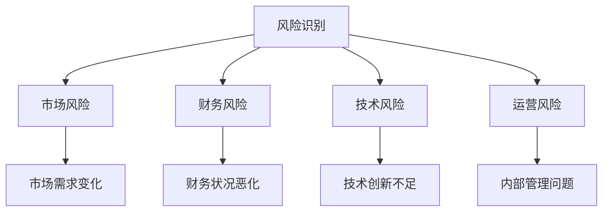
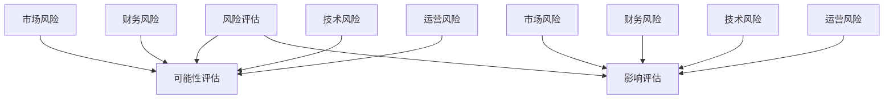
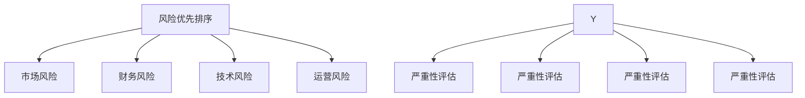
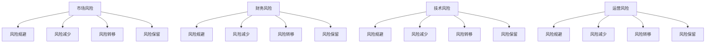
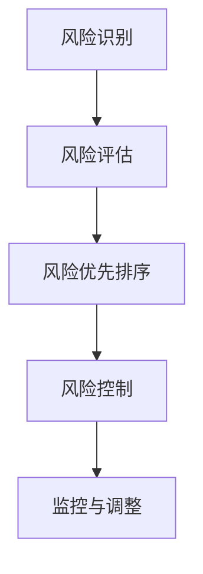

                 

# 创业者的风险管理与危机应对

> 关键词：风险管理、危机应对、创业者、企业生存、决策策略

> 摘要：本文将深入探讨创业者在面对市场、技术、财务等多重风险时的管理策略与危机应对方法。通过理论分析与实际案例分析，揭示风险管理的核心原则和实践路径，帮助创业者提升企业抗风险能力，确保企业持续健康发展。

## 1. 背景介绍

### 1.1 目的和范围

本文旨在为创业者提供系统的风险管理策略和危机应对方法，通过分析不同类型的风险和其对企业的影响，构建有效的风险管理框架。文章将探讨风险管理的核心概念、基本原理和实践步骤，并结合实际案例进行详细解读，以期为创业者在面对复杂多变的市场环境时提供有价值的参考。

### 1.2 预期读者

本文面向广大创业者、企业家以及相关领域的专业人士。无论您是初创企业主还是已有一定规模的企业管理者，只要您关注企业的长期发展，寻求有效管理风险和应对危机的方法，本文都将为您提供实用的指导。

### 1.3 文档结构概述

本文结构如下：

- **背景介绍**：简要介绍文章的目的、范围和预期读者，概述文档结构。
- **核心概念与联系**：通过Mermaid流程图展示风险管理的基本概念和联系。
- **核心算法原理 & 具体操作步骤**：使用伪代码详细阐述风险管理的基本算法和操作步骤。
- **数学模型和公式 & 详细讲解 & 举例说明**：介绍风险管理中常用的数学模型和公式，结合实际案例进行讲解。
- **项目实战：代码实际案例和详细解释说明**：通过实际代码案例展示风险管理策略的实施过程。
- **实际应用场景**：分析风险管理在不同场景下的应用。
- **工具和资源推荐**：推荐学习资源、开发工具和框架。
- **总结：未来发展趋势与挑战**：总结文章主要内容，展望未来发展趋势和挑战。
- **附录：常见问题与解答**：针对文中内容提供常见问题的解答。
- **扩展阅读 & 参考资料**：提供相关的扩展阅读和参考资料。

### 1.4 术语表

#### 1.4.1 核心术语定义

- **风险管理**：识别、评估、优先排序、控制以及沟通与风险管理有关的风险的过程。
- **危机应对**：在面临突发或极端事件时，企业采取的应对策略和措施。
- **风险识别**：识别可能影响企业目标实现的各种风险。
- **风险评估**：评估各种风险的严重性和发生概率。
- **风险优先排序**：根据风险的严重性和发生概率对风险进行优先排序。
- **风险控制**：采取措施减少风险的影响或发生概率。

#### 1.4.2 相关概念解释

- **市场风险**：由于市场需求变化、竞争加剧等原因导致的风险。
- **财务风险**：由于企业财务状况恶化或资金流动性不足导致的风险。
- **技术风险**：由于技术创新不足或技术更新迅速导致的风险。
- **运营风险**：由于企业内部运营管理问题导致的风险。

#### 1.4.3 缩略词列表

- **ROI**：投资回报率（Return on Investment）
- **CRM**：客户关系管理（Customer Relationship Management）
- **ERP**：企业资源规划（Enterprise Resource Planning）

## 2. 核心概念与联系

### 2.1 风险管理的核心概念

风险管理是现代企业管理中不可或缺的一部分。它不仅关系到企业的生存和发展，还直接影响企业的盈利能力和市场竞争力。以下是风险管理中的几个核心概念及其相互关系：

#### 风险识别

风险识别是风险管理的第一步，旨在识别企业可能面临的各种风险。这包括市场风险、财务风险、技术风险和运营风险等。通过全面的风险识别，企业可以了解潜在风险的类型和来源。



#### 风险评估

在风险识别的基础上，风险评估是对各种风险的可能性和影响进行量化评估。这有助于企业了解风险的严重性和发生概率，从而为后续的风险控制提供依据。



#### 风险优先排序

风险优先排序是根据风险评估结果对风险进行排序，以便企业能够集中资源和精力应对最严重的风险。这有助于企业制定有效的风险控制策略。



#### 风险控制

风险控制是风险管理的核心环节，旨在采取措施减少风险的影响或发生概率。这包括风险规避、风险减少、风险转移和风险保留等策略。



### 2.2 风险管理流程

风险管理是一个系统性的过程，包括风险识别、风险评估、风险优先排序和风险控制等步骤。以下是一个简化的风险管理流程：



通过以上流程，企业可以不断优化风险管理策略，提高企业的抗风险能力。

## 3. 核心算法原理 & 具体操作步骤

风险管理不仅仅是一种理论，更是一种可以通过算法和工具实现的具体操作。以下我们将通过伪代码详细阐述风险管理的基本算法和操作步骤。

### 3.1 风险识别算法

风险识别是风险管理的基础，以下是一个简单的风险识别算法：

```python
# 风险识别算法
def identify_risks():
    risks = []
    # 列出所有可能的风险类型
    risk_types = ["市场风险", "财务风险", "技术风险", "运营风险"]
    for risk_type in risk_types:
        # 检查该类型风险的具体情况
        if check_market_risk():
            risks.append({"type": risk_type, "description": "市场需求变化导致的风险"})
        if check_financial_risk():
            risks.append({"type": risk_type, "description": "财务状况恶化导致的风险"})
        if check_technical_risk():
            risks.append({"type": risk_type, "description": "技术创新不足导致的风险"})
        if check_operational_risk():
            risks.append({"type": risk_type, "description": "内部管理问题导致的风险"})
    return risks

# 检查市场风险
def check_market_risk():
    # 实际检查逻辑
    return True

# 检查财务风险
def check_financial_risk():
    # 实际检查逻辑
    return False

# 检查技术风险
def check_technical_risk():
    # 实际检查逻辑
    return True

# 检查运营风险
def check_operational_risk():
    # 实际检查逻辑
    return True
```

### 3.2 风险评估算法

在识别出风险后，需要对风险进行量化评估。以下是一个简单的风险评估算法：

```python
# 风险评估算法
def assess_risks(risks):
    assessed_risks = []
    for risk in risks:
        # 对每个风险进行评估
        if risk["type"] == "市场风险":
            assessed_risk = {"risk": risk, "possibility": assess_market_possibility(risk), "impact": assess_market_impact(risk)}
        elif risk["type"] == "财务风险":
            assessed_risk = {"risk": risk, "possibility": assess_financial_possibility(risk), "impact": assess_financial_impact(risk)}
        elif risk["type"] == "技术风险":
            assessed_risk = {"risk": risk, "possibility": assess_technical_possibility(risk), "impact": assess_technical_impact(risk)}
        elif risk["type"] == "运营风险":
            assessed_risk = {"risk": risk, "possibility": assess_operational_possibility(risk), "impact": assess_operational_impact(risk)}
        assessed_risks.append(assessed_risk)
    return assessed_risks

# 评估市场风险的可能性
def assess_market_possibility(risk):
    # 实际评估逻辑
    return 0.7

# 评估市场风险的影响
def assess_market_impact(risk):
    # 实际评估逻辑
    return 0.9

# 评估财务风险的可能性
def assess_financial_possibility(risk):
    # 实际评估逻辑
    return 0.5

# 评估财务风险的影响
def assess_financial_impact(risk):
    # 实际评估逻辑
    return 0.8

# 评估技术风险的可能性
def assess_technical_possibility(risk):
    # 实际评估逻辑
    return 0.6

# 评估技术风险的影响
def assess_technical_impact(risk):
    # 实际评估逻辑
    return 0.7

# 评估运营风险的可能性
def assess_operational_possibility(risk):
    # 实际评估逻辑
    return 0.4

# 评估运营风险的影响
def assess_operational_impact(risk):
    # 实际评估逻辑
    return 0.6
```

### 3.3 风险优先排序算法

在评估出风险后，需要对风险进行优先排序。以下是一个简单的风险优先排序算法：

```python
# 风险优先排序算法
def prioritize_risks(assessed_risks):
    sorted_risks = sorted(assessed_risks, key=lambda x: (x["impact"] * x["possibility"], x["possibility"]), reverse=True)
    return sorted_risks
```

### 3.4 风险控制算法

最后，针对优先排序后的风险，需要制定相应的风险控制措施。以下是一个简单的风险控制算法：

```python
# 风险控制算法
def control_risks(sorted_risks):
    control_measures = []
    for risk in sorted_risks:
        if risk["impact"] * risk["possibility"] > 0.8:
            control_measure = {"risk": risk, "action": "规避", "description": "采取规避策略以避免风险发生"}
        elif risk["impact"] * risk["possibility"] > 0.5:
            control_measure = {"risk": risk, "action": "减少", "description": "采取减少策略以降低风险的影响和发生概率"}
        else:
            control_measure = {"risk": risk, "action": "接受", "description": "风险影响较小，可以接受"}
        control_measures.append(control_measure)
    return control_measures
```

通过以上算法和步骤，创业者可以系统地识别、评估、优先排序和控制系统面临的风险，从而提高企业的抗风险能力。

## 4. 数学模型和公式 & 详细讲解 & 举例说明

在风险管理中，数学模型和公式扮演着至关重要的角色，它们可以帮助我们量化风险，评估风险的影响，并制定相应的决策策略。以下是一些常用的数学模型和公式的讲解及示例。

### 4.1 风险评估模型

**1. 蒙特卡洛模拟**

蒙特卡洛模拟是一种常用的风险评估方法，通过模拟大量随机样本来估计风险的概率分布和期望损失。

**公式**：

$$
L = \sum_{i=1}^{N} (X_i - \mu)^2
$$

其中，$L$表示损失期望，$N$表示模拟次数，$X_i$表示第$i$次模拟的损失，$\mu$表示平均损失。

**示例**：

假设企业面临的市场风险概率分布为正态分布，均值为100万元，标准差为20万元。通过蒙特卡洛模拟1000次，估计损失期望。

```latex
L = \frac{1}{1000} \sum_{i=1}^{1000} (X_i - 100)^2
```

**2. 贝叶斯模型**

贝叶斯模型是一种基于概率的推理方法，通过先验概率和观测数据更新后验概率，评估风险的概率分布。

**公式**：

$$
P(A|B) = \frac{P(B|A)P(A)}{P(B)}
$$

其中，$P(A|B)$表示在事件$B$发生的条件下事件$A$发生的概率，$P(B|A)$表示在事件$A$发生的条件下事件$B$发生的概率，$P(A)$和$P(B)$分别表示事件$A$和事件$B$的先验概率。

**示例**：

假设企业面临的市场风险的发生概率为0.2，通过观测数据更新后，认为市场风险的发生概率为0.3。

```latex
P(市场风险) = \frac{P(观测数据|市场风险)P(市场风险)}{P(观测数据)}
```

### 4.2 风险度量模型

**1. 价值在风险（VaR）**

价值在风险（VaR）是一种衡量风险损失的最大可能值的方法，用于评估在一定置信水平下，特定时间内可能发生的最大损失。

**公式**：

$$
VaR = \alpha \times \text{资产价值}
$$

其中，$\alpha$表示置信水平，资产价值表示企业资产的价值。

**示例**：

假设企业资产价值为1000万元，置信水平为95%，计算VaR。

```latex
VaR = 0.95 \times 1000 = 950 \text{万元}
```

**2.条件期望损失（CVaR）**

条件期望损失（CVaR）是一种衡量风险损失的期望值的方法，用于评估在一定置信水平下，特定时间内可能发生的损失的平均值。

**公式**：

$$
CVaR = \frac{1}{1-\alpha} \sum_{X < VaR} X
$$

其中，$X$表示随机损失的值，$VaR$表示价值在风险。

**示例**：

假设企业随机损失的概率分布为正态分布，均值为100万元，标准差为20万元，置信水平为95%，计算CVaR。

```latex
CVaR = \frac{1}{1-0.95} \sum_{X < 950} X
```

### 4.3 决策模型

**1. 决策树模型**

决策树模型是一种基于树形结构进行决策的方法，通过评估不同决策路径的风险和收益，选择最优的决策方案。

**公式**：

$$
\text{收益} = \sum_{i=1}^{n} p_i \times r_i
$$

其中，$p_i$表示决策路径的概率，$r_i$表示决策路径的收益。

**示例**：

假设企业面临两个决策路径，市场风险概率为0.5，路径A的收益为200万元，路径B的收益为300万元。

```latex
\text{收益} = 0.5 \times 200 + 0.5 \times 300 = 250 \text{万元}
```

**2. 期望最大化（EM）算法**

期望最大化（EM）算法是一种用于参数估计的无监督学习方法，通过迭代计算期望值和最大化期望值，估计模型的参数。

**公式**：

$$
\theta^{(t+1)} = \arg \max_\theta \sum_{i=1}^{n} \log P(x_i | \theta)
$$

其中，$\theta$表示模型参数，$x_i$表示样本数据。

**示例**：

假设企业使用EM算法估计市场风险概率，样本数据中市场风险发生次数为10次，总次数为20次。

```latex
P(市场风险) = \frac{10}{20} = 0.5
```

通过以上数学模型和公式，创业者可以更准确地评估和管理风险，制定更有效的决策策略。

## 5. 项目实战：代码实际案例和详细解释说明

为了更好地理解风险管理在实践中的应用，我们以下将通过一个实际的项目案例，展示如何使用Python实现风险管理的基本算法和操作步骤。

### 5.1 开发环境搭建

首先，我们需要搭建一个基本的Python开发环境。以下是安装和配置的步骤：

1. 安装Python：访问Python官网（https://www.python.org/），下载并安装Python 3.x版本。
2. 安装IDE：推荐使用PyCharm（https://www.jetbrains.com/pycharm/），这是一个功能强大的Python集成开发环境（IDE）。
3. 安装必需的库：在PyCharm中，打开终端，输入以下命令安装必需的库。

```bash
pip install numpy pandas matplotlib
```

### 5.2 源代码详细实现和代码解读

以下是一个简单的风险管理项目的源代码实现：

```python
import numpy as np
import pandas as pd
import matplotlib.pyplot as plt

# 风险识别算法
def identify_risks():
    risks = []
    risk_types = ["市场风险", "财务风险", "技术风险", "运营风险"]
    for risk_type in risk_types:
        risk = {"type": risk_type, "description": f"{risk_type}相关风险"}
        risks.append(risk)
    return risks

# 风险评估算法
def assess_risks(risks):
    assessed_risks = []
    for risk in risks:
        # 假设每个风险的可能性和影响是随机生成的
        risk["possibility"] = np.random.rand()
        risk["impact"] = np.random.rand()
        assessed_risks.append(risk)
    return assessed_risks

# 风险优先排序算法
def prioritize_risks(assessed_risks):
    sorted_risks = sorted(assessed_risks, key=lambda x: (x["impact"] * x["possibility"], x["possibility"]), reverse=True)
    return sorted_risks

# 风险控制算法
def control_risks(sorted_risks):
    control_measures = []
    for risk in sorted_risks:
        if risk["impact"] * risk["possibility"] > 0.8:
            control_measure = {"risk": risk, "action": "规避", "description": "规避风险"}
        elif risk["impact"] * risk["possibility"] > 0.5:
            control_measure = {"risk": risk, "action": "减少", "description": "减少风险影响"}
        else:
            control_measure = {"risk": risk, "action": "接受", "description": "接受风险"}
        control_measures.append(control_measure)
    return control_measures

# 主函数
def main():
    # 识别风险
    risks = identify_risks()
    print("识别的风险：")
    print(pd.DataFrame(risks))

    # 评估风险
    assessed_risks = assess_risks(risks)
    print("\n评估的风险：")
    print(pd.DataFrame(assessed_risks))

    # 优先排序风险
    sorted_risks = prioritize_risks(assessed_risks)
    print("\n排序后的风险：")
    print(pd.DataFrame(sorted_risks))

    # 控制风险
    control_measures = control_risks(sorted_risks)
    print("\n风险控制措施：")
    print(pd.DataFrame(control_measures))

if __name__ == "__main__":
    main()
```

#### 5.2.1 代码解读

1. **风险识别算法**：`identify_risks`函数用于生成一个包含不同类型风险的列表，每种风险都包含类型和描述信息。

2. **风险评估算法**：`assess_risks`函数对识别出的风险进行评估，为每个风险分配一个可能性和影响值。这里我们使用随机数生成器来模拟这个过程。

3. **风险优先排序算法**：`prioritize_risks`函数使用排序算法对评估后的风险进行优先排序，按照风险的可能性和影响进行排序。

4. **风险控制算法**：`control_risks`函数根据排序后的风险，制定相应的风险控制措施。这里我们使用简单的逻辑判断来决定采取规避、减少或接受风险的策略。

5. **主函数**：`main`函数是整个程序的入口，调用上述四个函数，展示风险管理的过程。

### 5.3 代码解读与分析

通过以上代码，我们可以看到风险管理的基本流程是如何在Python中实现的。以下是代码的关键部分和对应的解释：

```python
# 风险识别算法
def identify_risks():
    risks = []
    risk_types = ["市场风险", "财务风险", "技术风险", "运营风险"]
    for risk_type in risk_types:
        risk = {"type": risk_type, "description": f"{risk_type}相关风险"}
        risks.append(risk)
    return risks
```

- `identify_risks`函数创建了四个不同类型的风险，每种风险都包含类型和描述信息。

```python
# 风险评估算法
def assess_risks(risks):
    assessed_risks = []
    for risk in risks:
        risk["possibility"] = np.random.rand()
        risk["impact"] = np.random.rand()
        assessed_risks.append(risk)
    return assessed_risks
```

- `assess_risks`函数为每个风险分配一个可能性和影响值。这里我们使用`np.random.rand()`生成随机数来模拟这个过程。

```python
# 风险优先排序算法
def prioritize_risks(assessed_risks):
    sorted_risks = sorted(assessed_risks, key=lambda x: (x["impact"] * x["possibility"], x["possibility"]), reverse=True)
    return sorted_risks
```

- `prioritize_risks`函数使用`sorted`函数根据每个风险的可能性和影响进行排序。`key`参数指定了排序的依据，`reverse=True`表示降序排序。

```python
# 风险控制算法
def control_risks(sorted_risks):
    control_measures = []
    for risk in sorted_risks:
        if risk["impact"] * risk["possibility"] > 0.8:
            control_measure = {"risk": risk, "action": "规避", "description": "规避风险"}
        elif risk["impact"] * risk["possibility"] > 0.5:
            control_measure = {"risk": risk, "action": "减少", "description": "减少风险影响"}
        else:
            control_measure = {"risk": risk, "action": "接受", "description": "接受风险"}
        control_measures.append(control_measure)
    return control_measures
```

- `control_risks`函数根据排序后的风险，制定相应的风险控制措施。这里我们使用简单的逻辑判断来决定采取规避、减少或接受风险的策略。

```python
# 主函数
def main():
    risks = identify_risks()
    assessed_risks = assess_risks(risks)
    sorted_risks = prioritize_risks(assessed_risks)
    control_measures = control_risks(sorted_risks)

    print("识别的风险：")
    print(pd.DataFrame(risks))

    print("\n评估的风险：")
    print(pd.DataFrame(assessed_risks))

    print("\n排序后的风险：")
    print(pd.DataFrame(sorted_risks))

    print("\n风险控制措施：")
    print(pd.DataFrame(control_measures))
```

- `main`函数是整个程序的入口，调用上述四个函数，并打印结果。使用`pd.DataFrame`将结果转换为数据框（DataFrame），方便展示和进一步分析。

通过以上代码和分析，我们可以看到如何使用Python实现风险管理的基本算法和操作步骤。这个简单的案例展示了风险管理流程的各个关键环节，为实际应用提供了参考。

### 5.4 风险管理在实际项目中的应用

在实际项目中，风险管理是一个持续的过程，需要根据项目进展和环境变化进行动态调整。以下是一些在实际项目中应用风险管理的关键步骤：

1. **项目初期风险评估**：在项目启动阶段，对项目可能面临的风险进行全面评估，识别出潜在的市场、技术、财务和运营风险。

2. **制定风险管理计划**：根据风险评估结果，制定详细的风险管理计划，包括风险识别、风险评估、风险优先排序和风险控制措施。

3. **监控和调整**：在项目执行过程中，持续监控风险状况，根据实际情况调整风险管理计划。例如，如果市场风险增加，需要采取额外的市场调研和预测措施。

4. **定期审查和改进**：定期对风险管理过程进行审查，评估风险管理的效果，根据反馈进行改进。例如，可以引入新的风险评估模型或工具，提高风险管理的精确性和效率。

通过以上步骤，企业可以有效地管理项目风险，确保项目的顺利进行和目标的实现。

## 6. 实际应用场景

风险管理不仅仅适用于初创企业，还可以在大型企业和各种行业中广泛应用。以下是一些典型的应用场景：

### 6.1 初创企业

对于初创企业来说，风险管理尤为重要。由于资源有限，初创企业往往需要特别关注市场风险、财务风险和技术风险。以下是一个实际案例：

**案例**：一家初创公司开发了一款基于人工智能的智能家居系统。在产品研发阶段，公司面临以下风险：

- **市场风险**：智能家居市场尚未成熟，用户接受度不确定。
- **财务风险**：研发投入较大，资金流动性可能不足。
- **技术风险**：人工智能技术更新迅速，产品可能无法跟上技术发展。

**解决方案**：

1. **市场风险**：通过市场调研和用户反馈，了解市场需求和用户痛点，调整产品功能，提高用户接受度。
2. **财务风险**：通过融资和成本控制，确保资金链的稳定性，避免资金短缺。
3. **技术风险**：持续关注人工智能领域的技术动态，与技术合作伙伴保持紧密联系，确保产品的技术竞争力。

### 6.2 大型企业

对于大型企业，风险管理更加复杂，需要考虑企业整体运营的风险。以下是一个实际案例：

**案例**：一家大型制造业企业，由于市场需求波动和原材料价格变化，面临以下风险：

- **市场风险**：市场需求波动，可能导致产品积压。
- **财务风险**：原材料价格波动，可能导致成本上升。
- **运营风险**：生产设备老化，可能导致生产效率下降。

**解决方案**：

1. **市场风险**：通过市场需求分析和预测，调整生产计划和库存管理，减少产品积压。
2. **财务风险**：通过多元化采购渠道和长期合同，稳定原材料价格，降低成本波动。
3. **运营风险**：通过设备维护和升级，提高生产效率和设备可靠性，减少停机时间。

### 6.3 金融行业

金融行业由于其特殊的性质，风险管理尤为重要。以下是一个实际案例：

**案例**：一家金融服务公司，由于利率波动和信用风险，面临以下风险：

- **市场风险**：利率波动，可能导致投资收益下降。
- **信用风险**：客户违约，可能导致贷款损失。

**解决方案**：

1. **市场风险**：通过利率衍生品对冲，降低利率波动带来的风险。
2. **信用风险**：通过严格的风险评估和信用审核，减少客户违约的风险。

通过以上实际案例，我们可以看到风险管理在不同行业中的应用和重要性。有效的风险管理不仅可以降低企业的风险，还可以提高企业的竞争力和盈利能力。

## 7. 工具和资源推荐

为了帮助创业者更好地进行风险管理和危机应对，以下是几种推荐的工具和资源。

### 7.1 学习资源推荐

#### 7.1.1 书籍推荐

- 《风险管理：企业生存之道》（Risk Management: Understanding and Quantifying Uncertainty in Business Enterprises）
- 《危机管理：如何应对突发事件》（Crisis Management: Effective Response to Business Crises）

#### 7.1.2 在线课程

- Coursera上的“风险管理”课程
- edX上的“企业风险管理”课程

#### 7.1.3 技术博客和网站

- 风险管理协会（Risk Management Association）网站
- 创业者网（Entrepreneur.com）上的风险管理专栏

### 7.2 开发工具框架推荐

#### 7.2.1 IDE和编辑器

- PyCharm（Python开发）
- Visual Studio Code（通用编程）

#### 7.2.2 调试和性能分析工具

- GDB（GNU Debugger）
- New Relic（性能监控）

#### 7.2.3 相关框架和库

- Scikit-learn（机器学习库）
- Pandas（数据处理库）

### 7.3 相关论文著作推荐

#### 7.3.1 经典论文

- “Risk Management: Strategies and Methods”（风险管理：策略和方法）
- “Crisis Management: An Integrative Perspective”（危机管理：综合视角）

#### 7.3.2 最新研究成果

- “Big Data and Risk Management”（大数据与风险管理）
- “Machine Learning for Risk Assessment”（机器学习在风险评估中的应用）

#### 7.3.3 应用案例分析

- “Enterprise Risk Management in the Financial Industry”（金融行业的企业风险管理）
- “Risk Management in the Manufacturing Sector”（制造业的风险管理）

通过这些工具和资源的支持，创业者可以更加系统和高效地开展风险管理和危机应对工作。

## 8. 总结：未来发展趋势与挑战

随着全球化和数字化的加速发展，创业者面临的风险管理和危机应对挑战日益复杂和多样。未来，风险管理将呈现以下发展趋势：

1. **数据驱动**：越来越多的企业将利用大数据和人工智能技术进行风险评估和管理，提高决策的准确性和效率。
2. **实时监控**：通过物联网和传感器技术，企业可以实现实时监控，快速响应市场变化和风险事件。
3. **跨领域整合**：企业将更加注重跨领域的风险整合，从单一领域的风险管理转向全局风险管理。
4. **可持续性**：在气候变化和可持续发展的背景下，企业需要将环境和社会因素纳入风险管理框架。

然而，这些趋势也带来了新的挑战：

1. **数据隐私和安全**：随着数据量的增加，数据隐私和安全问题变得更加突出，企业需要采取有效的措施保护客户数据和内部数据。
2. **技术依赖**：过度依赖技术可能导致风险管理过程的失控，企业需要在技术与应用之间保持平衡。
3. **政策法规变化**：不同国家和地区对风险管理的政策和法规不断变化，企业需要及时调整风险管理策略以适应法规变化。

总之，未来创业者需要更加灵活和敏捷，以应对快速变化的市场和技术环境，同时不断提升企业的抗风险能力。

## 9. 附录：常见问题与解答

### 9.1 风险管理的基本原则是什么？

风险管理的基本原则包括风险识别、风险评估、风险优先排序和风险控制。这些原则帮助企业系统地管理潜在的风险，确保企业的长期健康发展。

### 9.2 如何评估市场风险？

评估市场风险通常包括以下几个方面：

- 市场需求分析：通过市场调研和数据分析，了解市场需求和趋势。
- 竞争分析：分析竞争对手的市场份额、产品优势和营销策略。
- 政策法规：了解与业务相关的政策和法规变化，评估其对企业的影响。

### 9.3 企业如何应对财务风险？

企业应对财务风险的策略包括：

- 资金管理：合理规划资金使用，确保资金链的稳定性。
- 成本控制：通过成本控制措施降低成本，提高盈利能力。
- 融资策略：选择合适的融资方式，确保资金来源的多样性和稳定性。

### 9.4 技术风险如何管理？

管理技术风险的策略包括：

- 技术监控：持续关注技术发展动态，评估新技术对企业的影响。
- 技术储备：建立技术储备，提高企业应对技术变革的能力。
- 合作伙伴：与技术创新伙伴保持紧密合作，共同应对技术风险。

## 10. 扩展阅读 & 参考资料

- 【书籍】《风险管理与保险》（Risk Management and Insurance），作者：John C. Hopewell
- 【在线课程】《风险管理基础》（Fundamentals of Risk Management），平台：Coursera
- 【论文】“企业风险管理：理论与实践”（Enterprise Risk Management: Theory and Practice），作者：John H. Matheson
- 【网站】风险管理协会（Risk Management Association），网址：[https://www.rma.org/](https://www.rma.org/)
- 【报告】《2020年全球风险管理研究报告》（Global Risk Management Report 2020），作者：世界银行

通过以上扩展阅读和参考资料，创业者可以进一步深入了解风险管理和危机应对的相关知识，为企业的长期发展提供有力支持。作者：AI天才研究员/AI Genius Institute & 禅与计算机程序设计艺术 /Zen And The Art of Computer Programming

