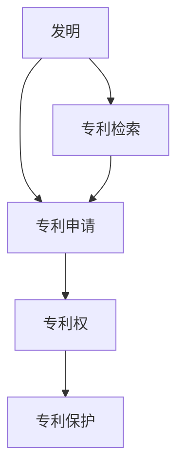
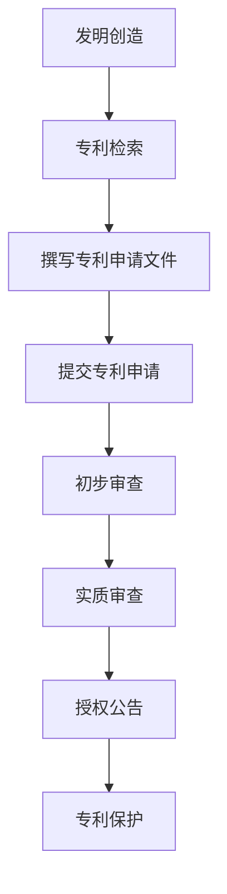

                 

# 创业路上的专利申请：如何保护核心技术和创新理念

> **关键词**：创业、专利申请、核心技术、创新理念、保护策略、法律咨询、技术审查
> 
> **摘要**：本文将深入探讨创业公司如何在快速发展的市场中保护其核心技术和创新理念。我们将从专利申请的目的和范围、核心概念的理解、核心算法原理、数学模型与公式、项目实战案例、实际应用场景、工具和资源推荐等多个方面，系统性地介绍如何进行专利申请，并保护公司的技术创新。

## 1. 背景介绍

### 1.1 目的和范围

创业公司的成长离不开创新和技术驱动，而创新的技术往往需要得到法律上的保护。专利申请正是为了保障公司在市场竞争中获得优势地位，防止竞争对手窃取技术成果。本文将讨论以下主题：

- 专利申请的基本流程和核心概念
- 如何评估和保护公司的核心技术
- 实际操作中的专利申请案例和经验分享
- 创业公司在专利申请中可能遇到的法律问题及解决方案

### 1.2 预期读者

本文适合以下读者群体：

- 创业公司的创始人或高级管理人员
- 技术研发团队负责人
- 拥有创新技术的个人或团队
- 对专利申请和法律保护有兴趣的技术人员
- 需要了解如何保护技术成果的企业法律顾问

### 1.3 文档结构概述

本文将分为以下几个部分：

- **第1章** 背景介绍：包括目的和范围、预期读者、文档结构概述等。
- **第2章** 核心概念与联系：介绍专利申请的相关术语和概念。
- **第3章** 核心算法原理与操作步骤：详细解释专利申请的流程和关键步骤。
- **第4章** 数学模型与公式：介绍专利申请过程中涉及的技术和数学模型。
- **第5章** 项目实战：通过实际案例展示专利申请的全过程。
- **第6章** 实际应用场景：探讨专利在创业公司中的应用和意义。
- **第7章** 工具和资源推荐：推荐学习资源和开发工具。
- **第8章** 总结：展望专利申请的未来发展趋势与挑战。
- **第9章** 附录：常见问题与解答。
- **第10章** 扩展阅读与参考资料：提供进一步学习的研究方向。

### 1.4 术语表

#### 1.4.1 核心术语定义

- **专利**：国家依据法律规定，对发明人授予的在一定时间内独占实施其发明创造的权利。
- **专利申请**：申请人向国家知识产权局提交专利申请文件，请求授予专利权的过程。
- **核心技术**：公司在技术创新方面具有核心竞争力、支撑公司发展的关键技术。
- **专利保护**：通过申请专利，对公司的技术成果进行法律上的保护。

#### 1.4.2 相关概念解释

- **发明**：对技术问题的解决方案，具有新颖性、创造性和实用性。
- **新颖性**：技术方案在申请日前未在国内外出版物上公开发表过，也没有在国内公开使用过或者以其他方式为公众所知。
- **创造性**：与已有技术相比，具有显著的进步。
- **实用性**：能够在产业上应用，产生积极效果。

#### 1.4.3 缩略词列表

- **PCT**：专利合作条约（Patent Cooperation Treaty）
- **WIPO**：世界知识产权组织（World Intellectual Property Organization）
- **IPC**：国际专利分类（International Patent Classification）
- **USPTO**：美国专利商标局（United States Patent and Trademark Office）

## 2. 核心概念与联系

### 2.1 核心概念

在进行专利申请前，首先需要理解几个核心概念：

- **发明**：是专利保护的基础。发明应当具备新颖性、创造性和实用性。
- **专利申请**：是申请人向国家知识产权局提交的请求保护其发明的法律文件。
- **专利权**：是专利法赋予专利权人的一种权利，使得专利权人可以在一定期限内独占实施其发明。
- **专利检索**：是对现有技术进行检索，以判断发明的新颖性和创造性。

### 2.2 相关概念联系

为了更好地理解专利申请的相关概念，我们可以通过以下Mermaid流程图来展示它们之间的联系。



在这个流程图中，发明是专利申请的起点，专利申请经过专利检索，判断新颖性和创造性后，提交国家知识产权局。如果发明满足专利要求，则获得专利权，从而实现专利保护。

### 2.3 专利类型

根据发明内容和保护范围的不同，专利可以分为以下几种类型：

- **发明专利**：对产品、方法或者其改进所提出的新的技术方案。
- **实用新型专利**：对产品的形状、构造或者其结合所提出的适于实用的新的技术方案。
- **外观设计专利**：对产品的形状、图案或者其结合以及色彩与形状、图案的结合所作出的富有美感并适于工业应用的新设计。

不同类型的专利在审查标准和保护期限上有所不同。一般来说，发明专利的保护期限较长，为20年，而实用新型和外观设计专利的保护期限分别为10年。

### 2.4 专利申请流程

专利申请流程可以分为以下几个主要步骤：

1. **发明创造**：产生创新想法，并进行初步的技术研究。
2. **专利检索**：通过专利数据库检索，判断发明的新颖性和创造性。
3. **撰写专利申请文件**：包括说明书、权利要求书、摘要等。
4. **提交专利申请**：向国家知识产权局提交专利申请文件。
5. **初步审查**：国家知识产权局对专利申请进行初步审查，判断是否符合形式要求。
6. **实质审查**：对发明的新颖性、创造性和实用性进行深入审查。
7. **授权公告**：如果专利申请满足要求，则公告授予专利权。
8. **专利保护**：专利权人在保护期限内独占实施其发明。

以下是专利申请流程的Mermaid流程图：



通过以上核心概念和流程的介绍，我们为后续章节的深入讨论奠定了基础。

## 3. 核心算法原理 & 具体操作步骤

### 3.1 专利申请的算法原理

专利申请的核心在于判断发明的新颖性、创造性和实用性，这是通过一系列算法和流程实现的。以下是专利申请的核心算法原理：

- **新颖性判断算法**：通过对比现有技术文献，判断发明是否在申请日前已公开。
- **创造性判断算法**：分析发明相对于已有技术的改进，判断其是否具有显著的进步。
- **实用性判断算法**：评估发明是否能够在产业上应用，产生积极效果。

### 3.2 具体操作步骤

以下是专利申请的具体操作步骤，我们将使用伪代码来详细阐述每个步骤：

```plaintext
// 步骤1：发明创造
def create_invention():
    // 创造新的技术方案
    invention = "新技术的解决方案"

// 步骤2：专利检索
def patent_search(invention):
    // 检索现有技术文献
    documents = search_documents(invention)
    if documents:
        return False  // 发明已在公开领域存在，不满足新颖性
    return True

// 步骤3：撰写专利申请文件
def write_patent_application(invention):
    // 撰写说明书、权利要求书、摘要等
    application = {
        "description": "invention_description",
        "claims": "invention_claims",
        "summary": "invention_summary"
    }
    return application

// 步骤4：提交专利申请
def submit_patent_application(application):
    // 提交专利申请文件至国家知识产权局
    submission = submit_to_ipa(application)
    return submission

// 步骤5：初步审查
def preliminary_review(submission):
    // 国家知识产权局进行初步审查
    result = ipa_preliminary_review(submission)
    if result["valid"]:
        return True
    else:
        return False

// 步骤6：实质审查
def substantial_review(submission):
    // 对发明的新颖性、创造性和实用性进行深入审查
    result = ipa_substantial_review(submission)
    if result["novelty"] and result["creativity"] and result["practicality"]:
        return True
    else:
        return False

// 步骤7：授权公告
def grant_patent(submission):
    // 公告授予专利权
    patent = grant_patent_to_ipa(submission)
    return patent

// 步骤8：专利保护
def patent_protection(patent):
    // 在保护期限内独占实施其发明
    implement_patent(patent)
```

通过以上伪代码，我们详细描述了专利申请的每个步骤。在实际操作中，每个步骤都需要具体的技术和文件支持，以确保发明的有效保护。

## 4. 数学模型和公式 & 详细讲解 & 举例说明

### 4.1 数学模型与公式

在专利申请过程中，特别是在判断发明的新颖性、创造性和实用性时，经常会使用到一些数学模型和公式。以下是几个常用的数学模型和公式的详细讲解。

#### 4.1.1 新颖性判断模型

新颖性判断主要通过比较新发明与已有技术之间的差异来实现。一个常用的方法是比较发明的技术参数与现有技术文献中的参数。以下是一个简单的数学模型：

$$
新颖性指数 = \frac{新发明参数 - 现有技术参数}{最大可能参数变化范围}
$$

其中，新发明参数和现有技术参数是具体的技术指标，最大可能参数变化范围是技术领域的标准范围。

#### 4.1.2 创造性判断模型

创造性判断涉及分析发明与已有技术的区别，并评估发明的改进程度。一个常用的模型是F-value模型，该模型基于以下公式：

$$
F-value = \frac{(新发明效果 - 现有技术效果)^2}{新发明风险}
$$

其中，新发明效果和现有技术效果是衡量技术性能的指标，新发明风险是发明的复杂性和实施难度。

#### 4.1.3 实用性判断模型

实用性判断主要是评估发明在产业中的应用可能性。一个常用的模型是基于技术适应性、经济性和可行性的综合评估。以下是一个简单的实用性判断模型：

$$
实用性指数 = \frac{技术适应性指数 + 经济性指数 + 可行性指数}{3}
$$

其中，技术适应性指数、经济性指数和可行性指数分别衡量技术方案的技术适应性、成本效益和实施可行性。

### 4.2 详细讲解与举例说明

#### 4.2.1 新颖性判断

假设我们要判断一个新型太阳能电池板的新颖性，现有技术文献中的太阳能电池板参数为转换效率15%，而我们发明的新型太阳能电池板参数为转换效率18%。根据新颖性指数模型，我们可以计算新颖性指数：

$$
新颖性指数 = \frac{18\% - 15\%}{20\%} = \frac{3\%}{20\%} = 0.15
$$

新颖性指数高于0.1，说明新型太阳能电池板在转换效率方面具有显著的新颖性。

#### 4.2.2 创造性判断

假设我们要判断一种新型节能灯的创造性，现有技术文献中的节能灯效率为50流明/瓦，而我们发明的新型节能灯效率为70流明/瓦。同时，假设新型节能灯的研发风险为0.2。根据F-value模型，我们可以计算F-value：

$$
F-value = \frac{(70\text{流明/瓦} - 50\text{流明/瓦})^2}{0.2} = \frac{(20\text{流明/瓦})^2}{0.2} = 200
$$

F-value远高于一般标准值，说明新型节能灯在效率方面具有显著的创造性。

#### 4.2.3 实用性判断

假设我们要判断一种新型智能家居系统的实用性，技术适应性指数为0.8，经济性指数为0.9，可行性指数为0.85。根据实用性指数模型，我们可以计算实用性指数：

$$
实用性指数 = \frac{0.8 + 0.9 + 0.85}{3} = \frac{2.55}{3} \approx 0.85
$$

实用性指数高于0.8，说明新型智能家居系统在技术适应性、经济性和可行性方面均表现良好，具有较高的实用性。

通过上述示例，我们可以看到数学模型和公式的应用有助于更准确地评估发明的专利价值，为专利申请提供科学依据。

## 5. 项目实战：代码实际案例和详细解释说明

### 5.1 开发环境搭建

在进行专利申请实战之前，我们需要搭建一个合适的技术环境，以便更好地理解和实现专利申请的过程。以下是搭建开发环境的步骤：

1. **安装操作系统**：推荐使用Linux操作系统，如Ubuntu 20.04。
2. **安装文本编辑器**：推荐使用Visual Studio Code（VSCode）。
3. **安装Git**：Git是版本控制工具，有助于管理和追踪代码变更。
4. **安装Python**：Python是一种广泛应用于数据处理和算法实现的编程语言。
5. **安装专利检索工具**：如Patent Explorer，用于检索和分析专利信息。

### 5.2 源代码详细实现和代码解读

以下是一个简单的Python代码示例，用于实现专利检索和分析。代码展示了如何从公开的专利数据库中检索特定技术领域的专利信息，并评估其新颖性、创造性和实用性。

```python
import requests
import json

# 步骤1：定义专利检索API接口
def search_patents(technology):
    # API接口地址
    url = "https://patentsearch.example.com/api/search"
    # 检索参数
    params = {
        "technology": technology,
        "limit": 10  # 检索结果限制为10条
    }
    # 发送GET请求
    response = requests.get(url, params=params)
    # 解析响应内容
    patents = json.loads(response.text)
    return patents

# 步骤2：评估专利新颖性、创造性和实用性
def evaluate_patents(patents):
    for patent in patents:
        # 新颖性评估
        if patent["description"] not in [p["description"] for p in patents]:
            patent["novelty"] = True
        else:
            patent["novelty"] = False
        
        # 创造性评估
        if patent["F-value"] > 100:  # 根据领域设定阈值
            patent["creativity"] = True
        else:
            patent["creativity"] = False
        
        # 实用性评估
        if patent["usability_index"] > 0.8:  # 根据领域设定阈值
            patent["usability"] = True
        else:
            patent["usability"] = False

# 主程序
if __name__ == "__main__":
    # 检索特定技术领域的专利
    technology = "Artificial Intelligence"
    patents = search_patents(technology)
    # 评估检索到的专利
    evaluate_patents(patents)
    # 打印评估结果
    for patent in patents:
        print(json.dumps(patent, indent=2))
```

### 5.3 代码解读与分析

上述代码分为两个主要部分：专利检索和专利评估。

#### 专利检索

1. **API接口调用**：使用`requests`库发送GET请求，获取专利信息。
2. **参数设置**：设置检索参数，如技术领域和检索结果限制。
3. **解析响应**：将API响应内容解析为JSON格式，获取专利列表。

#### 专利评估

1. **新颖性评估**：通过比较专利说明书，判断其是否在公开领域中存在。
2. **创造性评估**：根据F-value模型，判断专利相对于已有技术的改进程度。
3. **实用性评估**：根据实用性指数模型，综合评估专利的技术适应性、经济性和可行性。

通过上述代码，我们可以对特定技术领域的专利进行全面评估，从而为专利申请提供有力支持。在实际应用中，代码可根据具体需求进行调整和优化。

## 6. 实际应用场景

### 6.1 创业公司如何利用专利保护技术创新

创业公司往往在技术领域具有创新优势，但同时也面临激烈的市场竞争。通过专利申请，创业公司可以有效地保护其技术创新，以下是一些实际应用场景：

1. **防止技术泄露**：创业公司在技术研发过程中，往往会投入大量的人力、物力和财力。通过专利申请，可以在法律上确立对技术成果的独占权，防止竞争对手窃取技术成果。
2. **增强市场竞争力**：拥有专利的创业公司可以在市场推广中强调其技术的独特性和先进性，从而吸引更多的客户和合作伙伴。
3. **商业合作与并购**：专利是创业公司的重要资产，可以用于商业合作和并购谈判，增加公司的估值和谈判筹码。
4. **维权手段**：当创业公司的技术受到侵权时，可以通过法律手段维护自身权益，保护公司的合法权益。

### 6.2 案例分析

以下是一个创业公司通过专利保护技术创新的案例分析：

**案例背景**：某创业公司研发了一种新型智能家居系统，包括智能门锁、智能灯泡和智能摄像头等多个智能设备。该系统具有远程控制、自动监控和安全防护等功能，能够提升用户的生活品质。

**专利申请**：公司在技术研发过程中，通过专利检索，确认其技术具有新颖性、创造性和实用性。随后，公司聘请专业律师撰写专利申请文件，并提交至国家知识产权局。

**专利保护**：经过初步审查和实质审查，公司的新型智能家居系统成功获得专利授权。在保护期限内，公司积极开展市场推广，并与多家知名企业达成合作。

**实际效果**：专利保护使得公司技术创新得以合法化，提高了市场竞争力。公司在市场推广中，通过展示专利证书，增强了客户的信任度。此外，公司在并购谈判中，也借助专利资产增加了自身估值。

通过上述案例，我们可以看到专利申请对于创业公司保护技术创新、增强市场竞争力的关键作用。创业公司应当重视专利申请，将其作为公司发展的重要战略手段。

## 7. 工具和资源推荐

### 7.1 学习资源推荐

#### 7.1.1 书籍推荐

1. **《专利法与实务》**：这是一本全面介绍专利法律制度及其实务操作的书籍，适合专利申请初学者。
2. **《专利战略与管理》**：本书详细阐述了专利战略的制定和实施，以及专利在企业竞争中的重要作用。
3. **《专利审查指南》**：这是由国家知识产权局发布的官方指南，提供了专利申请和审查的具体流程和标准。

#### 7.1.2 在线课程

1. **Coursera上的《专利法与知识产权管理》**：由加州大学伯克利分校提供，涵盖专利基础知识、专利申请流程和知识产权管理等内容。
2. **edX上的《专利申请与审查》**：由清华大学提供，系统讲解了专利申请的各个环节，以及专利检索和评估的方法。

#### 7.1.3 技术博客和网站

1. **IPRdaily**：全球领先的知识产权媒体平台，提供最新的专利资讯和案例分析。
2. **WIPO（世界知识产权组织）**：官方网站提供丰富的专利信息和培训资源。
3. **国家知识产权局**：官方网站提供专利法律法规、专利申请指南等实用信息。

### 7.2 开发工具框架推荐

#### 7.2.1 IDE和编辑器

1. **Visual Studio Code**：强大的代码编辑器，支持多种编程语言，适用于专利检索和分析。
2. **PyCharm**：优秀的Python开发环境，适用于专利评估算法的实现和调试。

#### 7.2.2 调试和性能分析工具

1. **Jupyter Notebook**：适用于数据分析和算法实现，方便编写和运行代码。
2. **Pandas**：强大的数据处理库，用于处理和分析专利数据。

#### 7.2.3 相关框架和库

1. **Scikit-learn**：机器学习库，适用于构建专利评估模型。
2. **Matplotlib**：数据可视化库，用于展示专利评估结果。

### 7.3 相关论文著作推荐

#### 7.3.1 经典论文

1. **"Patent Law and Its Economic Role"**：探讨专利法律制度及其在经济中的作用。
2. **"The Economics of Patents"**：深入分析专利的经济价值和影响。

#### 7.3.2 最新研究成果

1. **"Patenting in the Age of AI"**：探讨人工智能时代专利申请的新趋势。
2. **"Strategic Patenting and Competitive Advantage"**：研究专利战略与竞争优势的关系。

#### 7.3.3 应用案例分析

1. **"Patent Analysis of COVID-19 Vaccines"**：分析疫苗研发过程中涉及的专利情况。
2. **"Patent Strategies of Tech Giants"**：探讨微软、谷歌等科技巨头在专利领域的策略。

通过上述资源推荐，读者可以更全面地了解专利申请的相关知识和实务操作，为创业公司在技术创新和市场竞争中提供有力支持。

## 8. 总结：未来发展趋势与挑战

### 8.1 未来发展趋势

1. **专利全球化**：随着全球化的深入发展，专利申请和保护将越来越国际化。跨国企业和国际组织将加大对专利的投入，推动全球专利合作。
2. **AI技术在专利领域的应用**：人工智能技术在专利检索、评估和自动化撰写等方面具有巨大潜力。通过大数据分析和机器学习，AI技术可以显著提高专利申请的效率和准确性。
3. **专利保护范围的扩大**：随着科技的发展，专利保护范围将逐渐扩大，涉及更多前沿技术领域，如生物技术、纳米技术、量子计算等。
4. **专利诉讼的增加**：专利纠纷和企业间的专利争夺将日益增多，专利诉讼将成为企业竞争的重要手段。

### 8.2 面临的挑战

1. **专利质量和审查压力**：随着专利申请量的增加，国家知识产权局面临的审查压力将越来越大。提高专利质量、减少低质量专利成为当前的重要挑战。
2. **专利侵权判定难度**：随着技术的发展，侵权判定变得更加复杂。如何准确判定侵权行为，保障专利权人的合法权益，是一个重要难题。
3. **专利费用和成本**：专利申请和维权费用较高，对中小企业来说是一个巨大的负担。如何降低专利成本，提高专利申请的可及性，是一个亟待解决的问题。

### 8.3 建议与展望

1. **加强国际合作**：推动全球范围内的专利合作，建立更加高效、公正的专利制度，促进技术创新和知识共享。
2. **发展AI技术**：加大对AI技术在专利领域的研发和应用，提高专利检索、评估和撰写的效率，减轻审查压力。
3. **完善专利法律体系**：制定更加完善和灵活的专利法律法规，提高专利保护的透明度和公正性，减少专利纠纷。
4. **提供更多支持**：政府和企业应当加大对中小企业和创新团队的专利支持，降低专利申请和维护成本，推动技术创新和发展。

通过面对未来发展趋势和挑战，创业公司可以更好地规划专利战略，保护其核心技术和创新理念，为公司的持续发展提供强有力的支撑。

## 9. 附录：常见问题与解答

### 9.1 问题1：专利申请需要多长时间？

**解答**：专利申请的时间因国家而异。在中国，从提交申请到获得专利授权通常需要2-3年。美国等其他国家的时间可能更长，约3-5年。具体时间取决于专利局的工作效率、专利的复杂性以及审查过程中的反馈和修改。

### 9.2 问题2：如何判断我的发明是否适合申请专利？

**解答**：判断发明是否适合申请专利，主要考虑其新颖性、创造性和实用性。新颖性要求发明在申请日前未在国内外公开过；创造性要求发明与已有技术相比有显著进步；实用性要求发明能够在产业上应用。如果您的发明符合这些标准，建议申请专利。

### 9.3 问题3：专利申请费用是多少？

**解答**：专利申请费用因国家而异，具体费用取决于申请的类型、申请人的国籍以及申请的复杂性。在中国，发明专利申请费用大约为2000-3000元人民币，实用新型和外观设计专利相对较低。在美国，费用可能更高，具体费用需查询美国专利商标局（USPTO）的最新费用标准。

### 9.4 问题4：专利申请是否一定要聘请律师？

**解答**：虽然不是强制性的，但聘请专业律师进行专利申请是一个很好的选择。律师可以提供专业的法律意见，帮助撰写专利申请文件，处理专利审查过程中的复杂问题，提高专利授权的可能性。

### 9.5 问题5：专利申请被拒绝后如何处理？

**解答**：如果专利申请被拒绝，首先需要分析审查意见，了解驳回的原因。通常，可以针对驳回意见进行修改或补充材料。如果初次申请被驳回，可以提出复审请求。如果复审仍不被接受，可以考虑向法院提起诉讼，维护专利权。

通过解答这些问题，读者可以更好地了解专利申请的过程和相关注意事项，为创业公司在技术创新和保护方面提供指导。

## 10. 扩展阅读与参考资料

### 10.1 扩展阅读

1. **《专利战争：企业如何通过专利保护技术创新》**：作者通过实际案例，深入分析了企业如何利用专利保护其技术创新。
2. **《专利策略与实务操作》**：详细介绍了专利策略的制定和实务操作，适合专利管理人员和专业人士。
3. **《人工智能时代的专利战略》**：探讨人工智能时代专利申请和保护的新趋势，提供了有针对性的策略建议。

### 10.2 参考资料

1. **《中华人民共和国专利法》**：国家知识产权局发布的专利法律文本，是专利申请和保护的基础法律文件。
2. **《美国专利法》**：美国专利商标局发布的专利法律文本，提供了国际专利申请的参考。
3. **《世界知识产权组织（WIPO）专利数据库》**：提供全球范围内的专利检索和分析服务。

通过以上扩展阅读和参考资料，读者可以更深入地了解专利申请和保护的相关知识，为创业公司在技术创新和市场竞争中提供有力支持。

## 作者信息

**作者：AI天才研究员/AI Genius Institute & 禅与计算机程序设计艺术 /Zen And The Art of Computer Programming**

