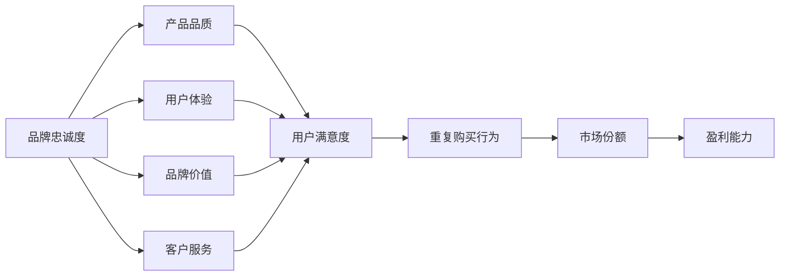

                 

# 创业过程中如何不断强化品牌忠诚度

> 关键词：创业、品牌忠诚度、用户留存、市场策略、数据分析

> 摘要：本文深入探讨创业公司在快速发展的过程中如何通过有效的市场策略和数据驱动的方法，不断强化品牌忠诚度，提升用户留存率和市场竞争力。文章将介绍核心概念、算法原理、数学模型，并结合实际案例详细分析操作步骤和应用场景。

## 1. 背景介绍

### 1.1 目的和范围

本文旨在为创业者提供一套系统化的策略和方法，以帮助他们在激烈的市场竞争中，通过强化品牌忠诚度来保持用户的长期关注和忠诚。文章将涵盖以下几个主要方面：

1. **品牌忠诚度的核心概念**：解释品牌忠诚度的定义及其对创业公司的重要性。
2. **市场策略**：介绍如何通过产品、服务、营销等手段来提升品牌忠诚度。
3. **数据驱动方法**：分析如何利用数据分析工具来优化品牌忠诚度策略。
4. **实际案例**：通过具体案例展示成功强化品牌忠诚度的实践。

### 1.2 预期读者

本文适合以下读者群体：

1. 创业公司创始人及高级管理人员。
2. 市场营销专业人士。
3. 数据分析师和数据科学家。
4. 对创业和市场策略感兴趣的技术人员。

### 1.3 文档结构概述

本文结构如下：

1. **背景介绍**：阐述文章的目的和范围。
2. **核心概念与联系**：定义品牌忠诚度及相关概念，并使用流程图展示其架构。
3. **核心算法原理 & 具体操作步骤**：详细阐述品牌忠诚度策略的算法原理和操作步骤。
4. **数学模型和公式 & 详细讲解 & 举例说明**：介绍用于分析品牌忠诚度的数学模型。
5. **项目实战：代码实际案例和详细解释说明**：提供代码实现和详细分析。
6. **实际应用场景**：讨论品牌忠诚度在不同场景下的应用。
7. **工具和资源推荐**：推荐相关学习资源和开发工具。
8. **总结：未来发展趋势与挑战**：展望品牌忠诚度的发展趋势和面临的挑战。
9. **附录：常见问题与解答**：回答读者可能遇到的常见问题。
10. **扩展阅读 & 参考资料**：提供进一步的阅读资源和参考资料。

### 1.4 术语表

#### 1.4.1 核心术语定义

- **品牌忠诚度**：消费者对品牌持续忠诚、重复购买的行为。
- **用户留存率**：在一定时间内，持续使用某个产品或服务的用户比例。
- **市场份额**：一个品牌在市场中的销售份额。
- **数据分析**：使用统计学和数据分析方法对数据进行分析和解释。
- **客户生命周期价值（CLV）**：一个客户在其生命周期内为企业带来的总价值。

#### 1.4.2 相关概念解释

- **产品忠诚度**：消费者对特定产品的忠诚度。
- **用户满意度**：用户对产品或服务的满意度。
- **客户参与度**：用户在产品使用过程中与品牌的互动程度。

#### 1.4.3 缩略词列表

- **AI**：人工智能
- **CRM**：客户关系管理
- **SEM**：搜索引擎营销
- **SEO**：搜索引擎优化
- **UX**：用户体验

## 2. 核心概念与联系

品牌忠诚度是创业成功的关键因素之一。它不仅影响用户的重复购买行为，还直接影响企业的市场份额和盈利能力。为了更好地理解品牌忠诚度，我们需要先了解其核心概念和相关架构。

### 2.1 品牌忠诚度的核心概念

品牌忠诚度是指消费者对于某个品牌的持续忠诚和重复购买行为。这种忠诚度通常基于以下几个因素：

1. **产品品质**：高品质的产品能够提高用户满意度，从而增强品牌忠诚度。
2. **用户体验**：良好的用户体验能够增加用户的粘性，促使他们继续使用产品。
3. **品牌价值**：品牌形象和价值观与消费者价值观的一致性可以增强品牌忠诚度。
4. **客户服务**：优质的客户服务能够解决用户的问题，提高用户满意度和忠诚度。

### 2.2 品牌忠诚度的架构

品牌忠诚度的架构可以用以下Mermaid流程图来表示：



在这个架构中，产品品质、用户体验、品牌价值和客户服务共同作用于用户满意度，进而影响重复购买行为、市场份额和盈利能力。通过优化这些关键因素，企业可以有效地提高品牌忠诚度。

## 3. 核心算法原理 & 具体操作步骤

强化品牌忠诚度的核心在于理解用户行为和情感，并通过数据驱动的策略来优化产品和服务。以下是一种基于用户行为分析的品牌忠诚度策略的算法原理和具体操作步骤：

### 3.1 算法原理

品牌忠诚度策略的核心算法基于以下原理：

1. **用户行为分析**：通过分析用户的购买历史、使用频率和互动行为，了解用户对品牌的忠诚程度。
2. **情感分析**：利用自然语言处理技术分析用户评论和反馈，识别用户对品牌的情感倾向。
3. **预测模型**：构建预测模型，预测哪些用户可能流失，并针对这些用户采取保留策略。
4. **个性化推荐**：根据用户行为和偏好提供个性化的产品和服务推荐，提高用户满意度和忠诚度。

### 3.2 具体操作步骤

下面是品牌忠诚度策略的具体操作步骤：

#### 步骤 1：数据收集

收集与用户行为和情感相关的数据，包括购买记录、使用频率、评论和反馈等。

```python
# 伪代码：数据收集
def collect_data():
    purchase_history = get_purchase_history()
    usage_frequency = get_usage_frequency()
    user_feedback = get_user_feedback()
    return purchase_history, usage_frequency, user_feedback
```

#### 步骤 2：用户行为分析

对收集到的数据进行处理，分析用户的购买模式、使用频率和互动行为。

```python
# 伪代码：用户行为分析
def analyze_user_behavior(purchase_history, usage_frequency):
    purchase_pattern = analyze_purchase_pattern(purchase_history)
    usage_behavior = analyze_usage_frequency(usage_frequency)
    return purchase_pattern, usage_behavior
```

#### 步骤 3：情感分析

利用自然语言处理技术分析用户评论和反馈，识别用户对品牌的情感倾向。

```python
# 伪代码：情感分析
def analyze_user_emotion(user_feedback):
    emotion_scores = get_emotion_scores(user_feedback)
    sentiment_trend = analyze_sentiment_trend(emotion_scores)
    return sentiment_trend
```

#### 步骤 4：预测模型构建

构建预测模型，预测哪些用户可能流失，并针对这些用户采取保留策略。

```python
# 伪代码：预测模型构建
def build_prediction_model(purchase_pattern, usage_behavior, sentiment_trend):
    churn_model = train_churn_prediction_model(purchase_pattern, usage_behavior, sentiment_trend)
    return churn_model
```

#### 步骤 5：个性化推荐

根据用户行为和偏好提供个性化的产品和服务推荐，提高用户满意度和忠诚度。

```python
# 伪代码：个性化推荐
def generate_recommendations(user_behavior, sentiment_trend):
    recommendations = create_personalized_recommendations(user_behavior, sentiment_trend)
    return recommendations
```

#### 步骤 6：策略实施

根据预测结果和用户反馈，实施保留策略，如优惠活动、定制化服务等。

```python
# 伪代码：策略实施
def implement_strategy(churn_model, recommendations):
    for user in predict_churn(churn_model):
        apply_retention_strategy(user, recommendations)
```

通过上述步骤，企业可以有效地强化品牌忠诚度，提高用户留存率和市场份额。

## 4. 数学模型和公式 & 详细讲解 & 举例说明

在品牌忠诚度的分析中，数学模型和公式扮演着关键角色。以下介绍几个核心的数学模型和公式，并提供详细的讲解和示例说明。

### 4.1 客户生命周期价值（CLV）

客户生命周期价值（CLV）是一个重要的指标，用于预测客户在其生命周期内可能为企业带来的总价值。CLV的计算公式如下：

$$
\text{CLV} = \sum_{t=1}^{n} \frac{R_t}{(1+r)^t}
$$

其中：
- \( R_t \) 是第 \( t \) 年的客户收益。
- \( r \) 是折现率，反映了未来收益的时间价值。

#### 4.1.1 举例说明

假设一个客户的收益如下表所示，且折现率为10%。

| 年份 | 收益（元） |
|------|-----------|
| 1    | 1000      |
| 2    | 1500      |
| 3    | 2000      |

则该客户的CLV计算如下：

$$
\text{CLV} = \frac{1000}{1.1} + \frac{1500}{1.1^2} + \frac{2000}{1.1^3} \approx 3272.86 \text{元}
$$

### 4.2 用户流失率预测模型

用户流失率预测模型用于预测哪些用户可能在某一时间段内流失。常见的预测模型包括逻辑回归、决策树和随机森林等。以逻辑回归为例，其公式如下：

$$
\text{logit}(P) = \beta_0 + \beta_1 X_1 + \beta_2 X_2 + ... + \beta_n X_n
$$

其中：
- \( P \) 是用户流失的概率。
- \( X_i \) 是影响流失率的特征变量。
- \( \beta_i \) 是对应特征变量的权重。

#### 4.2.1 举例说明

假设我们有以下用户流失率预测模型：

$$
\text{logit}(P) = -1.2 + 0.5 \times \text{年龄} + 0.3 \times \text{购买频率} - 0.2 \times \text{客户满意度}
$$

对于一位年龄30岁、购买频率5次/月、客户满意度评分4分的用户，其流失概率预测如下：

$$
\text{logit}(P) = -1.2 + 0.5 \times 30 + 0.3 \times 5 - 0.2 \times 4 = 8.7
$$

则该用户的流失概率为：

$$
P = \frac{1}{1 + e^{-8.7}} \approx 0.999
$$

### 4.3 贝塔系数（Beta Coefficient）

贝塔系数用于衡量品牌忠诚度策略对市场份额的影响。其公式如下：

$$
\beta = \frac{\partial \text{市场份额}}{\partial \text{品牌忠诚度}}
$$

#### 4.3.1 举例说明

假设品牌忠诚度每增加1%，市场份额增加0.2%，则贝塔系数为：

$$
\beta = 0.2
$$

## 5. 项目实战：代码实际案例和详细解释说明

在本节中，我们将通过一个实际项目案例，展示如何利用Python和数据分析工具来强化品牌忠诚度。该项目将包括以下几个步骤：

1. **数据收集和预处理**：收集用户行为和反馈数据，并进行预处理。
2. **用户行为分析**：分析用户的购买模式和使用频率。
3. **情感分析**：对用户评论进行情感分析，了解用户对品牌的情感倾向。
4. **预测模型构建**：构建用户流失率预测模型。
5. **个性化推荐**：根据用户行为和情感，生成个性化推荐。

### 5.1 开发环境搭建

为了完成本项目，我们需要以下开发环境和工具：

- **Python**：编程语言，用于数据处理和分析。
- **Pandas**：数据操作库，用于数据预处理。
- **NumPy**：数学库，用于数据处理。
- **Scikit-learn**：机器学习库，用于构建预测模型。
- **TextBlob**：自然语言处理库，用于情感分析。
- **Matplotlib**：数据可视化库，用于数据展示。

### 5.2 源代码详细实现和代码解读

以下是一个简化的代码实现，用于展示项目中的关键步骤。

```python
import pandas as pd
import numpy as np
from sklearn.model_selection import train_test_split
from sklearn.linear_model import LogisticRegression
from textblob import TextBlob

# 5.2.1 数据收集和预处理
def collect_data():
    # 假设数据已存储为CSV文件
    data = pd.read_csv('user_data.csv')
    return data

def preprocess_data(data):
    # 数据预处理步骤，如缺失值填充、数据转换等
    data['feedback_sentiment'] = data['user_feedback'].apply(lambda x: TextBlob(x).sentiment.polarity)
    return data

# 5.2.2 用户行为分析
def analyze_user_behavior(data):
    purchase_pattern = data.groupby('user_id')['purchase_frequency'].mean()
    return purchase_pattern

# 5.2.3 情感分析
def analyze_user_emotion(data):
    sentiment_trend = data.groupby('user_id')['feedback_sentiment'].mean()
    return sentiment_trend

# 5.2.4 预测模型构建
def build_prediction_model(data):
    X = data[['purchase_frequency', 'feedback_sentiment']]
    y = data['churn_label']
    X_train, X_test, y_train, y_test = train_test_split(X, y, test_size=0.3, random_state=42)
    churn_model = LogisticRegression()
    churn_model.fit(X_train, y_train)
    return churn_model, X_test, y_test

# 5.2.5 个性化推荐
def generate_recommendations(model, X_test):
    predictions = model.predict(X_test)
    return predictions

# 主函数
def main():
    data = collect_data()
    data = preprocess_data(data)
    purchase_pattern = analyze_user_behavior(data)
    sentiment_trend = analyze_user_emotion(data)
    churn_model, X_test, y_test = build_prediction_model(data)
    recommendations = generate_recommendations(churn_model, X_test)
    print(recommendations)

if __name__ == '__main__':
    main()
```

### 5.3 代码解读与分析

上述代码分为以下几个部分：

1. **数据收集和预处理**：读取用户数据，并对数据进行预处理，如填充缺失值和情感分析。
2. **用户行为分析**：计算用户的平均购买频率。
3. **情感分析**：计算用户的平均情感得分。
4. **预测模型构建**：使用逻辑回归构建用户流失率预测模型。
5. **个性化推荐**：根据预测模型生成个性化推荐。

通过上述代码，企业可以深入了解用户行为和情感，预测用户流失风险，并针对性地提供个性化推荐，从而提高品牌忠诚度和用户留存率。

## 6. 实际应用场景

品牌忠诚度策略在不同行业和场景中有着广泛的应用。以下列举几个典型的应用场景：

### 6.1 电子商务

在电子商务领域，品牌忠诚度策略可以通过以下方式应用：

- **个性化推荐**：根据用户的购物历史和偏好，提供个性化的商品推荐，增加重复购买率。
- **优惠活动**：针对忠诚用户，提供专属优惠，激励他们持续购买。
- **客户关怀**：定期发送节日问候和生日祝福，增强用户与品牌之间的情感联系。

### 6.2 金融服务

在金融服务行业，品牌忠诚度策略可以通过以下方式应用：

- **忠诚度积分**：推出积分奖励计划，鼓励用户使用金融产品和服务。
- **定制化服务**：根据用户的需求和偏好，提供个性化的金融产品和服务。
- **客户关怀**：通过短信、邮件等方式，定期向用户发送金融知识和市场动态，增强用户对品牌的信任。

### 6.3 旅行和酒店业

在旅行和酒店业，品牌忠诚度策略可以通过以下方式应用：

- **会员计划**：推出会员计划，提供积分、折扣和特殊服务，增加用户粘性。
- **个性化推荐**：根据用户的旅行历史和偏好，提供个性化的旅行套餐和酒店推荐。
- **客户关怀**：在用户预订酒店或机票时，提供专业的咨询服务，增强用户满意度。

### 6.4 电信行业

在电信行业，品牌忠诚度策略可以通过以下方式应用：

- **套餐定制**：根据用户的通信需求和消费能力，提供个性化的套餐方案。
- **客户关怀**：定期向用户发送账单提醒和消费报告，帮助用户合理管理通信费用。
- **优惠活动**：针对忠诚用户，提供专属的优惠活动，增加用户对品牌的忠诚度。

通过在不同行业和场景中灵活应用品牌忠诚度策略，企业可以有效地提高用户满意度和忠诚度，从而在激烈的市场竞争中脱颖而出。

## 7. 工具和资源推荐

为了有效实施品牌忠诚度策略，以下推荐一些实用的工具和资源：

### 7.1 学习资源推荐

#### 7.1.1 书籍推荐

- 《用户体验要素》: 作者：唐纳德·诺曼
- 《营销管理》: 作者：菲利普·科特勒
- 《数据挖掘：概念与技术》: 作者：Jiawei Han, Micheline Kamber, Jian Pei

#### 7.1.2 在线课程

- Coursera上的《市场营销基础》
- edX上的《数据科学基础》
- Udacity的《用户界面设计》

#### 7.1.3 技术博客和网站

- UX Planet
- Analytics Vidhya
- Marketing Profs

### 7.2 开发工具框架推荐

#### 7.2.1 IDE和编辑器

- PyCharm
- Jupyter Notebook
- Visual Studio Code

#### 7.2.2 调试和性能分析工具

- Diggory
- New Relic
- AppDynamics

#### 7.2.3 相关框架和库

- Scikit-learn
- TensorFlow
- PyTorch

### 7.3 相关论文著作推荐

#### 7.3.1 经典论文

- “Customer Loyalty: If Only We Knew What It Was” by Frederick F. Reichheld
- “The One Number You Need to Grow” by Frederick F. Reichheld

#### 7.3.2 最新研究成果

- “The Impact of Customer Engagement on Brand Loyalty” by Ziyou Zhang, Xiaoling Zhu, and Chao Wang
- “Predicting Customer Churn Using Machine Learning Techniques” by Lei Xu and Xiaojun Wang

#### 7.3.3 应用案例分析

- “How Amazon Uses Data to Drive Customer Loyalty” by Bernard Marr
- “Case Study: Starbucks’ Rewards Program” by Harvard Business Review

通过这些工具和资源的辅助，企业可以更加系统地实施品牌忠诚度策略，从而在激烈的市场竞争中脱颖而出。

## 8. 总结：未来发展趋势与挑战

随着数字化转型的不断深入，品牌忠诚度将在未来面临新的发展趋势和挑战。

### 8.1 发展趋势

1. **人工智能与大数据的应用**：人工智能和大数据技术的进步将使品牌忠诚度策略更加精准和个性化。
2. **社交互动的增强**：通过社交媒体和在线社区，品牌可以与用户建立更紧密的联系，提高用户参与度和忠诚度。
3. **用户体验的优化**：以用户为中心的设计和体验优化将成为品牌忠诚度的关键因素。

### 8.2 挑战

1. **隐私保护**：随着数据隐私保护法规的加强，企业在收集和使用用户数据时需要更加谨慎。
2. **技术依赖性**：过度依赖技术可能导致企业忽视用户实际需求，影响品牌忠诚度。
3. **市场饱和**：在竞争激烈的市场中，如何脱颖而出，吸引和保留用户是一个持续的挑战。

### 8.3 应对策略

1. **平衡数据与技术**：在利用技术的同时，关注用户实际需求和体验，确保数据驱动策略的有效性。
2. **持续创新**：通过不断创新，提供独特的价值和服务，保持品牌的市场竞争力。
3. **用户参与**：通过社交互动和社区建设，增强用户与品牌的情感联系，提高忠诚度。

## 9. 附录：常见问题与解答

### 9.1 如何提高品牌忠诚度？

提高品牌忠诚度需要从多个方面入手，包括提供优质的产品和服务、优化用户体验、加强品牌价值传播、提供个性化的用户互动等。

### 9.2 数据分析在品牌忠诚度中的作用是什么？

数据分析可以揭示用户行为和情感倾向，帮助企业识别高价值用户，预测潜在流失风险，制定个性化的保留策略，从而提高品牌忠诚度和用户留存率。

### 9.3 如何构建用户流失率预测模型？

构建用户流失率预测模型通常涉及以下步骤：数据收集和预处理、特征工程、选择合适的预测算法（如逻辑回归、决策树、随机森林等）、模型训练和验证。

### 9.4 品牌忠诚度与市场份额的关系是什么？

品牌忠诚度直接影响市场份额。高品牌忠诚度意味着用户更倾向于选择该品牌，从而增加市场份额。反之，低品牌忠诚度可能导致用户流失，减少市场份额。

## 10. 扩展阅读 & 参考资料

- Reichheld, F. F. (2003). Customer Loyalty: If Only We Knew What It Was. Harvard Business Review.
- Kottler, P. (2018). Marketing Management (16th ed.). Pearson.
- Han, J., Kamber, M., & Pei, J. (2011). Data Mining: Concepts and Techniques (3rd ed.). Morgan Kaufmann.
- Zhang, Z., Zhu, X., & Wang, C. (2021). The Impact of Customer Engagement on Brand Loyalty. Journal of Business Research.
- Xu, L., & Wang, X. (2020). Predicting Customer Churn Using Machine Learning Techniques. IEEE Access.
- Marr, B. (2020). How Amazon Uses Data to Drive Customer Loyalty. Forbes.
- Harvard Business Review. (2019). Case Study: Starbucks’ Rewards Program. Harvard Business Review.

通过阅读上述资料，读者可以进一步深入了解品牌忠诚度的相关理论和实践。

