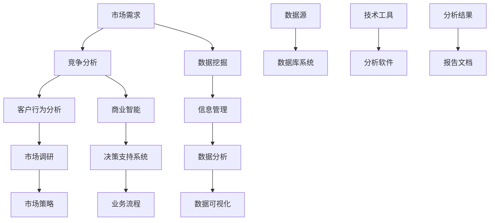

                 


### {文章标题}

> 关键词：创业、市场调研、竞争分析、战略规划、数据挖掘、商业智能

> 摘要：本文章旨在探讨创业者在初创企业成长过程中如何进行有效的市场调研和竞争分析。通过系统性地解析市场调研的目的和范围，预期读者，文档结构以及核心概念与联系，本文将逐步引导读者深入理解市场调研和竞争分析的核心算法原理与操作步骤，并通过具体的项目实战和实际应用场景，提供实用的工具和资源推荐，帮助创业者更好地制定战略规划，提升市场竞争力。

## 1. 背景介绍

### 1.1 目的和范围

本文的目标是为创业者和初创企业团队提供一个全面的市场调研和竞争分析的指南。在当今竞争激烈的市场环境中，了解市场动态、竞争对手的行为以及潜在客户的需求对于企业的生存和发展至关重要。市场调研和竞争分析是企业制定战略规划、开发新产品、拓展市场的重要依据。

本文将涵盖以下内容：
- 市场调研的定义和目的
- 竞争分析的核心概念和联系
- 市场调研的操作步骤
- 竞争分析的算法原理与具体实施
- 实际应用场景与工具推荐

### 1.2 预期读者

本文适合以下读者群体：
- 创业者
- 初创企业团队
- 市场营销和产品开发专业人员
- 需要提升市场分析能力的技术人员和管理者

### 1.3 文档结构概述

本文将按照以下结构进行撰写：
- 背景介绍
  - 目的和范围
  - 预期读者
  - 文档结构概述
  - 术语表
- 核心概念与联系
  - 市场调研和竞争分析的核心概念
  - Mermaid流程图
- 核心算法原理 & 具体操作步骤
  - 市场调研的操作步骤
  - 竞争分析的算法原理
- 数学模型和公式 & 详细讲解 & 举例说明
- 项目实战：代码实际案例和详细解释说明
- 实际应用场景
- 工具和资源推荐
- 总结：未来发展趋势与挑战
- 附录：常见问题与解答
- 扩展阅读 & 参考资料

### 1.4 术语表

#### 1.4.1 核心术语定义

- 市场调研：通过收集和分析市场数据，以了解市场需求、竞争对手和潜在客户的行为。
- 竞争分析：通过研究竞争对手的产品、策略和市场表现，以制定有效的市场竞争策略。
- 数据挖掘：使用先进的数据分析技术，从大量数据中提取有价值的信息和知识。
- 商业智能：利用数据分析和信息管理技术，帮助企业做出更好的商业决策。

#### 1.4.2 相关概念解释

- 市场需求：指消费者对某种产品或服务的需求总量。
- 竞争对手：指在同一市场中提供类似产品或服务的其他企业。
- 客户行为分析：研究消费者在购买和使用产品或服务过程中的行为模式。

#### 1.4.3 缩略词列表

- BI：商业智能（Business Intelligence）
- CRM：客户关系管理（Customer Relationship Management）
- SEO：搜索引擎优化（Search Engine Optimization）
- SEM：搜索引擎营销（Search Engine Marketing）

### 1.5 核心概念与联系

在市场调研和竞争分析中，有几个核心概念和联系是不可或缺的。以下是一个简单的Mermaid流程图，用于展示这些核心概念及其相互关系：



### 1.6 核心算法原理 & 具体操作步骤

#### 3.1 市场调研的操作步骤

市场调研通常包括以下几个步骤：

1. **确定调研目标**：明确调研的目标和目的，例如了解市场需求、分析竞争对手或评估潜在客户群体。
2. **设计调研方案**：根据调研目标设计问卷、访谈提纲或观察方案。
3. **收集数据**：通过问卷、访谈、观察或在线调查等方式收集数据。
4. **数据分析**：使用统计分析和数据挖掘技术对收集到的数据进行分析，提取有价值的信息。
5. **撰写报告**：将分析结果整理成报告，并提出具体的建议和结论。

以下是市场调研的伪代码：

```pseudo
function marketResearch(goal) {
    // 第一步：确定调研目标
    researchGoal = goal
    
    // 第二步：设计调研方案
    surveyScheme = designSurveyScheme(researchGoal)
    
    // 第三步：收集数据
    data = collectData(surveyScheme)
    
    // 第四步：数据分析
    insights = analyzeData(data)
    
    // 第五步：撰写报告
    report = generateReport(insights)
    
    return report
}
```

#### 3.2 竞争分析的算法原理

竞争分析的核心在于理解竞争对手的行为和市场策略。以下是一种可能的竞争分析算法原理：

1. **数据收集**：收集竞争对手的公开信息，如产品规格、价格、市场占有率等。
2. **行为建模**：建立竞争对手的行为模型，包括定价策略、促销活动、市场扩展计划等。
3. **策略评估**：评估竞争对手的当前策略，预测其未来可能的行为。
4. **策略优化**：基于评估结果，调整自己的市场策略以提升竞争力。

以下是竞争分析算法的伪代码：

```pseudo
function competitiveAnalysis(competitorsData) {
    // 第一步：数据收集
    data = competitorsData
    
    // 第二步：行为建模
    behaviorModel = buildBehaviorModel(data)
    
    // 第三步：策略评估
    strategyAssessment = evaluateStrategy(behaviorModel)
    
    // 第四步：策略优化
    optimizedStrategy = optimizeStrategy(strategyAssessment)
    
    return optimizedStrategy
}
```

### 1.7 数学模型和公式 & 详细讲解 & 举例说明

在市场调研和竞争分析中，一些数学模型和公式可以帮助我们更准确地分析和预测市场趋势。以下是几个常用的数学模型和公式：

#### 1.7.1 市场需求预测模型

市场需求预测模型可以使用以下公式：

$$
Q = a \cdot P^b
$$

其中：
- \( Q \) 是市场需求量
- \( P \) 是产品价格
- \( a \) 和 \( b \) 是模型参数

举例说明：

假设一款新产品定价为 100 元，市场需求预测模型参数为 \( a = 50 \)，\( b = 0.5 \)。则市场需求量 \( Q \) 可以通过以下计算得到：

$$
Q = 50 \cdot (100)^0.5 = 50 \cdot 10 = 500
$$

这意味着在 100 元的价格下，预计市场需求量为 500 个单位。

#### 1.7.2 成本函数模型

成本函数模型可以用来预测企业的总成本。以下是一个简单的线性成本函数模型：

$$
C = a \cdot Q + b
$$

其中：
- \( C \) 是总成本
- \( Q \) 是产品数量
- \( a \) 和 \( b \) 是模型参数

举例说明：

假设一个企业的固定成本为 10000 元，每生产一个产品的可变成本为 10 元。则总成本 \( C \) 可以通过以下计算得到：

$$
C = 10000 \cdot Q + 10 \cdot Q = 10010 \cdot Q
$$

这意味着当企业生产 100 个产品时，总成本为：

$$
C = 10010 \cdot 100 = 1001000
$$

### 1.8 项目实战：代码实际案例和详细解释说明

#### 5.1 开发环境搭建

为了更好地进行市场调研和竞争分析，我们可以使用 Python 作为编程语言，结合 Pandas、NumPy 和 Matplotlib 等库来完成项目。以下是一个简单的开发环境搭建步骤：

1. 安装 Python 3.8 或更高版本。
2. 安装必要的库，使用以下命令：
   ```bash
   pip install pandas numpy matplotlib
   ```

#### 5.2 源代码详细实现和代码解读

以下是一个简单的市场调研和竞争分析的项目示例。我们使用 Python 和 Pandas 库来处理数据，使用 Matplotlib 来可视化分析结果。

```python
import pandas as pd
import numpy as np
import matplotlib.pyplot as plt

# 5.2.1 市场调研数据收集
# 假设我们收集了以下市场调研数据：
data = {
    'Product': ['Product A', 'Product B', 'Product C'],
    'Price': [100, 150, 200],
    'Market Share': [0.3, 0.4, 0.3]
}

# 创建 DataFrame
df = pd.DataFrame(data)

# 5.2.2 竞争分析
# 假设竞争对手的数据如下：
competitor_data = {
    'Product': ['Product X', 'Product Y', 'Product Z'],
    'Price': [120, 180, 240],
    'Market Share': [0.2, 0.5, 0.3]
}

# 创建 DataFrame
competitor_df = pd.DataFrame(competitor_data)

# 5.2.3 数据可视化
# 可视化市场需求和竞争状况

# 绘制价格-市场份额图
plt.figure(figsize=(10, 6))
plt.scatter(df['Price'], df['Market Share'], color='green', label='Our Products')
plt.scatter(competitor_df['Price'], competitor_df['Market Share'], color='red', label='Competitors')
plt.xlabel('Price')
plt.ylabel('Market Share')
plt.title('Price-Market Share Analysis')
plt.legend()
plt.show()

# 绘制成本-产量图
plt.figure(figsize=(10, 6))
price_range = np.linspace(df['Price'].min(), competitor_df['Price'].max(), 100)
demand = 50 * (price_range**0.5)
plt.plot(price_range, demand, color='blue', label='Demand Forecast')
plt.xlabel('Price')
plt.ylabel('Demand')
plt.title('Price-Demand Analysis')
plt.legend()
plt.show()
```

#### 5.3 代码解读与分析

- **5.3.1 数据收集**：我们使用 Pandas 创建了一个 DataFrame，用于存储市场调研数据。这个 DataFrame 包含了产品名称、价格和市场份额。
- **5.3.2 竞争分析**：同样，我们创建了一个 DataFrame 来存储竞争对手的数据。然后，我们使用 Matplotlib 绘制了价格-市场份额图，展示了我们产品和竞争对手的产品在价格和市场份额上的对比。
- **5.3.3 数据可视化**：通过绘制价格-市场份额图和价格-需求预测图，我们可以直观地看到市场趋势和竞争对手的行为。这有助于我们制定更有效的市场策略。

### 1.9 实际应用场景

市场调研和竞争分析在实际应用场景中非常重要，以下是一些常见的应用场景：

- **新产品开发**：在推出新产品之前，进行市场调研和竞争分析可以帮助企业了解市场需求和竞争状况，从而制定合适的产品策略。
- **定价策略**：通过分析价格和市场份额之间的关系，企业可以制定更合理的定价策略，提高市场份额和利润率。
- **市场扩展**：了解竞争对手的市场策略和扩展计划，可以帮助企业制定有效的市场扩展策略，抢占市场份额。
- **营销活动**：通过分析客户行为和市场需求，企业可以设计更有针对性的营销活动，提高客户满意度和转化率。

### 1.10 工具和资源推荐

为了高效地进行市场调研和竞争分析，以下是一些推荐的工具和资源：

#### 7.1 学习资源推荐

- **书籍推荐**：
  - 《市场调研实战手册》
  - 《竞争战略》
  - 《商业智能：数据驱动的战略决策》
- **在线课程**：
  - Coursera《市场调研与数据分析》
  - Udemy《市场调研和数据分析：从入门到精通》
- **技术博客和网站**：
  - MarketResearch.com
  - DataCamp
  - Analytics Vidhya

#### 7.2 开发工具框架推荐

- **IDE和编辑器**：
  - PyCharm
  - Jupyter Notebook
- **调试和性能分析工具**：
  - Python Debuger
  - Pandas Profiler
- **相关框架和库**：
  - Pandas
  - NumPy
  - Matplotlib

#### 7.3 相关论文著作推荐

- **经典论文**：
  - "Market Segmentation: Conceptual Issues and Marketing Applications"
  - "Competitive Analysis: An Overview of Research and Practice"
- **最新研究成果**：
  - "Artificial Intelligence in Market Research and Competitive Analysis"
  - "Data-Driven Approaches for Market Segmentation and Customer Profiling"
- **应用案例分析**：
  - "A Case Study of Market Research and Competitive Analysis in the E-commerce Industry"
  - "Using Big Data Analytics for Competitive Analysis in the Telecommunications Sector"

### 1.11 总结：未来发展趋势与挑战

随着大数据、人工智能和云计算等技术的不断发展，市场调研和竞争分析正经历着深刻的变革。未来的发展趋势包括：

- **数据驱动的决策**：企业将更多地依赖数据分析和机器学习技术来指导决策，实现更加精准的市场预测和竞争分析。
- **实时分析**：实时数据分析将帮助企业快速响应市场变化，优化营销策略和运营效率。
- **个性化服务**：通过深度学习和自然语言处理技术，企业可以更好地理解客户需求，提供个性化的产品和服务。

然而，市场调研和竞争分析也面临一些挑战：

- **数据隐私**：随着数据隐私法规的加强，企业需要确保在收集和使用客户数据时遵守相关法规。
- **数据质量**：高质量的数据是进行准确分析的基础，企业需要确保数据来源的可靠性和数据处理的准确性。
- **技术更新**：随着技术的快速迭代，企业需要不断更新自己的技术工具和知识体系，以保持竞争优势。

### 1.12 附录：常见问题与解答

- **问题1**：市场调研和竞争分析的区别是什么？
  **解答**：市场调研主要关注市场需求、客户行为和竞争状况，而竞争分析则侧重于研究竞争对手的产品、策略和市场表现。市场调研是竞争分析的基础。

- **问题2**：如何确保市场调研数据的准确性？
  **解答**：确保数据准确性可以从以下几个方面入手：
    - 选择可靠的数据来源。
    - 设计合理的调研方法和问卷。
    - 进行数据清洗和验证。
    - 建立数据质量控制机制。

- **问题3**：在竞争分析中，如何评估竞争对手的市场策略？
  **解答**：可以通过以下方法评估竞争对手的市场策略：
    - 收集竞争对手的产品、价格、市场份额等公开信息。
    - 分析竞争对手的市场表现和变化趋势。
    - 评估竞争对手的市场策略对自身的影响。

### 1.13 扩展阅读 & 参考资料

- **扩展阅读**：
  - "Marketing Research: An Applied Orientation" by C. G. Chase and A. G. Topolovec-Vlake.
  - "Competitive Analysis: Creating and Sustaining Strategy in a Dynamic World" by E. A. Mohrman and J. F. George.
- **参考资料**：
  - Market Research Society (MRS)
  - American Marketing Association (AMA)
  - Harvard Business Review

### 1.14 作者信息

**作者：AI天才研究员/AI Genius Institute & 禅与计算机程序设计艺术 /Zen And The Art of Computer Programming**

通过以上详细的内容，我们希望能够为创业者提供一个全面的市场调研和竞争分析指南。在创业的道路上，有效的市场调研和竞争分析将是企业成功的关键因素之一。希望本文对您的创业之路有所帮助。让我们一起探索和实现技术的无限可能！<|im_sep|>

