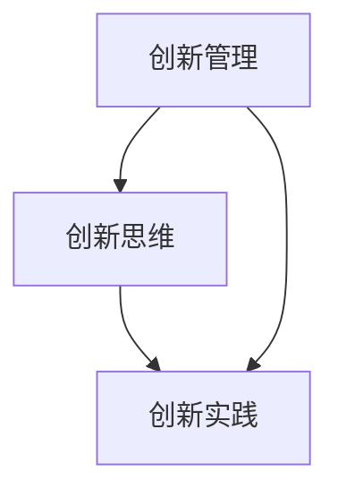
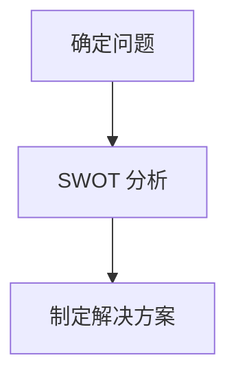

                 

# 创新：fostering创新思维和实践

> 关键词：创新管理，创新思维，创新实践，项目管理，敏捷开发，设计思维

> 摘要：本文旨在探讨创新管理的方法和策略，深入分析创新思维与实践的核心概念，并探讨其在项目管理、敏捷开发和设计思维中的应用。通过理论阐述、实例分析和实践指导，帮助读者理解创新管理的本质，掌握创新思维与实践的方法，提升个人和团队的创新能力和竞争力。

## 1. 背景介绍

### 1.1 目的和范围

本文的主要目的是为读者提供关于创新管理的全面指导，帮助读者理解创新思维与实践的重要性，并学会在实际工作中应用这些理念和方法。文章将涵盖以下内容：

1. 创新管理的核心概念和原则。
2. 创新思维的方法和工具。
3. 创新实践的过程和策略。
4. 在项目管理、敏捷开发和设计思维中的应用。
5. 实际案例分析和实践指导。

### 1.2 预期读者

本文适合以下读者群体：

1. 创新管理人员和项目经理。
2. 产品经理和设计师。
3. 程序员和技术团队领导。
4. 对创新管理和实践感兴趣的科研人员和学生。
5. 任何希望提升创新能力和竞争力的专业人士。

### 1.3 文档结构概述

本文结构如下：

1. 背景介绍：本文的目的、范围和预期读者。
2. 核心概念与联系：创新管理、创新思维和创新实践的核心概念和关系。
3. 核心算法原理 & 具体操作步骤：创新思维的方法和工具。
4. 数学模型和公式 & 详细讲解 & 举例说明：创新实践的过程和策略。
5. 项目实战：代码实际案例和详细解释说明。
6. 实际应用场景：创新管理在项目管理、敏捷开发和设计思维中的应用。
7. 工具和资源推荐：学习资源、开发工具和框架推荐。
8. 总结：未来发展趋势与挑战。
9. 附录：常见问题与解答。
10. 扩展阅读 & 参考资料：进一步学习的资源。

### 1.4 术语表

#### 1.4.1 核心术语定义

- 创新管理：对创新过程进行系统管理和指导，以实现组织目标。
- 创新思维：通过创造性的思考方式，发现新的问题解决方案。
- 创新实践：将创新思维转化为实际产品或服务的过程。
- 项目管理：对项目进行策划、组织、执行和控制的过程。
- 敏捷开发：一种以迭代和增量为特点的软件开发方法。
- 设计思维：一种以用户需求为中心的设计方法。

#### 1.4.2 相关概念解释

- 创新管理：创新管理是指组织通过系统化的方法，管理和推动创新过程，实现创新目标。它包括创新计划、创新资源管理、创新风险评估和创新成果转化等方面。
- 创新思维：创新思维是指通过创造性的思考方式，发现新的问题解决方案。它包括发散思维、收敛思维、跨学科思维、用户思维等方面。
- 创新实践：创新实践是指将创新思维转化为实际产品或服务的过程。它包括产品开发、市场推广、用户反馈等方面。

#### 1.4.3 缩略词列表

- PM：项目管理
- Agile：敏捷开发
- DT：设计思维

## 2. 核心概念与联系

在探讨创新管理之前，有必要了解创新管理、创新思维和创新实践这三个核心概念及其之间的联系。

### 2.1 创新管理

创新管理是指组织通过系统化的方法，管理和推动创新过程，实现创新目标。它包括创新计划、创新资源管理、创新风险评估和创新成果转化等方面。

创新管理的主要目标是通过优化创新过程，提高创新效率和质量，从而实现组织的长期发展。创新管理的关键在于：

- 确定创新目标：明确组织需要解决的关键问题和要实现的目标。
- 创新资源管理：合理配置人力资源、技术资源、资金资源等。
- 创新风险评估：评估创新项目的可行性、风险和收益。
- 创新成果转化：将创新成果转化为实际产品或服务。

### 2.2 创新思维

创新思维是指通过创造性的思考方式，发现新的问题解决方案。它包括发散思维、收敛思维、跨学科思维、用户思维等方面。

创新思维的核心在于突破传统的思维定式，寻找新的解决方案。创新思维的关键在于：

- 发散思维：从不同的角度和维度思考问题，寻找各种可能的解决方案。
- 收敛思维：对发散思维得到的方案进行筛选和评估，选择最优的解决方案。
- 跨学科思维：结合不同领域的知识和方法，寻找创新的解决方案。
- 用户思维：以用户需求为中心，从用户的角度思考问题，提供更好的解决方案。

### 2.3 创新实践

创新实践是指将创新思维转化为实际产品或服务的过程。它包括产品开发、市场推广、用户反馈等方面。

创新实践的关键在于：

- 产品开发：将创新思维转化为具体的产品或服务，满足用户需求。
- 市场推广：通过各种渠道推广产品或服务，提高市场知名度。
- 用户反馈：收集用户反馈，优化产品或服务。

### 2.4 核心概念联系

创新管理、创新思维和创新实践是相互关联的。创新管理为创新过程提供了系统化的指导和保障，创新思维为创新实践提供了新的思路和方法，创新实践则将创新管理与创新思维相结合，实现创新目标。

创新管理、创新思维和创新实践的关系可以用以下 Mermaid 流程图表示：



## 3. 核心算法原理 & 具体操作步骤

在创新管理中，核心算法原理包括创新思维的方法和工具。以下将介绍几种常用的创新思维方法和工具，并给出具体操作步骤。

### 3.1 发散思维

发散思维是指从不同的角度和维度思考问题，寻找各种可能的解决方案。发散思维的方法包括头脑风暴、思维导图等。

**具体操作步骤：**

1. 确定问题：明确需要解决的问题或要达成的目标。
2. 头脑风暴：邀请相关人员，围绕问题进行讨论，提出各种可能的解决方案。
3. 思维导图：将头脑风暴得到的方案整理成思维导图，便于分析和管理。

### 3.2 收敛思维

收敛思维是指对发散思维得到的方案进行筛选和评估，选择最优的解决方案。收敛思维的方法包括决策树、风险评估等。

**具体操作步骤：**

1. 列出方案：将发散思维得到的方案整理成清单。
2. 评估方案：对每个方案进行评估，考虑可行性、成本、风险等因素。
3. 选择最优方案：根据评估结果，选择最优的解决方案。

### 3.3 跨学科思维

跨学科思维是指结合不同领域的知识和方法，寻找创新的解决方案。跨学科思维的方法包括跨界合作、跨学科研究等。

**具体操作步骤：**

1. 确定问题：明确需要解决的问题或要达成的目标。
2. 跨界合作：邀请不同领域的专家，共同探讨问题解决方案。
3. 跨学科研究：结合不同领域的知识和方法，寻找创新的解决方案。

### 3.4 用户思维

用户思维是指以用户需求为中心，从用户的角度思考问题，提供更好的解决方案。用户思维的方法包括用户调研、用户画像等。

**具体操作步骤：**

1. 用户调研：收集用户需求和反馈，了解用户痛点。
2. 用户画像：分析用户特征和需求，构建用户画像。
3. 设计解决方案：根据用户画像和需求，设计满足用户需求的解决方案。

### 3.5 创新思维工具

以下是一种常用的创新思维工具——SWOT 分析。

**具体操作步骤：**

1. 确定问题：明确需要解决的问题或要达成的目标。
2. SWOT 分析：分析问题的优势（Strengths）、劣势（Weaknesses）、机会（Opportunities）和威胁（Threats）。
3. 制定解决方案：根据 SWOT 分析结果，制定相应的解决方案。



## 4. 数学模型和公式 & 详细讲解 & 举例说明

在创新实践中，数学模型和公式有助于分析和评估创新方案。以下介绍几种常用的数学模型和公式，并给出详细讲解和举例说明。

### 4.1 投入产出模型

投入产出模型用于评估创新项目的成本和收益。其公式为：

$$
\text{ROI} = \frac{\text{净收益}}{\text{总投入}}
$$

**详细讲解：**

- ROI：投入产出率，用于衡量创新项目的经济效益。
- 净收益：创新项目产生的收益减去成本。
- 总投入：创新项目的全部投入，包括人力、物力、财力等。

**举例说明：**

假设一个创新项目，总投入为 100 万元，净收益为 150 万元。则其 ROI 为：

$$
\text{ROI} = \frac{150}{100} = 1.5
$$

### 4.2 创新效率模型

创新效率模型用于评估创新过程中的效率。其公式为：

$$
\text{效率} = \frac{\text{创新成果}}{\text{创新投入}}
$$

**详细讲解：**

- 效率：衡量创新过程中投入与成果的比例。
- 创新成果：创新项目产生的实际效果，如产品性能、用户体验等。
- 创新投入：创新过程中的全部投入，如人力、物力、财力等。

**举例说明：**

假设一个创新项目，创新成果为提高产品性能 20%，创新投入为 100 人天。则其创新效率为：

$$
\text{效率} = \frac{20\%}{100 \text{ 人天}} = 0.2
$$

### 4.3 用户满意度模型

用户满意度模型用于评估创新方案的用户满意度。其公式为：

$$
\text{满意度} = \frac{\text{满意用户数}}{\text{总用户数}}
$$

**详细讲解：**

- 满意度：衡量创新方案在用户中的受欢迎程度。
- 满意用户数：对创新方案表示满意的用户数量。
- 总用户数：创新方案的目标用户数量。

**举例说明：**

假设一个创新方案的目标用户数为 1000 人，其中 800 人表示满意。则其满意度为：

$$
\text{满意度} = \frac{800}{1000} = 0.8
$$

### 4.4 成本效益模型

成本效益模型用于评估创新方案的经济效益。其公式为：

$$
\text{成本效益比} = \frac{\text{净收益}}{\text{总成本}}
$$

**详细讲解：**

- 成本效益比：衡量创新项目的经济效益。
- 净收益：创新项目产生的收益减去成本。
- 总成本：创新项目的全部成本，包括人力、物力、财力等。

**举例说明：**

假设一个创新项目，总成本为 200 万元，净收益为 300 万元。则其成本效益比为：

$$
\text{成本效益比} = \frac{300}{200} = 1.5
$$

## 5. 项目实战：代码实际案例和详细解释说明

在本节中，我们将通过一个实际案例，展示创新思维在软件开发中的应用。该案例为一个简单的任务管理应用，旨在帮助团队高效地完成任务分配、跟踪和进度管理。

### 5.1 开发环境搭建

在开始编写代码之前，需要搭建以下开发环境：

- 操作系统：Windows 10 或 macOS
- 编程语言：Python 3.8
- 开发工具：Visual Studio Code
- 版本控制：Git

### 5.2 源代码详细实现和代码解读

以下是该任务管理应用的 Python 代码实现：

```python
import os
import json

# 文件路径
DATA_FILE = 'tasks.json'

# 载入任务数据
def load_tasks():
    if os.path.exists(DATA_FILE):
        with open(DATA_FILE, 'r') as f:
            tasks = json.load(f)
    else:
        tasks = {}
    return tasks

# 保存任务数据
def save_tasks(tasks):
    with open(DATA_FILE, 'w') as f:
        json.dump(tasks, f, indent=4)

# 添加任务
def add_task(task_name, task_description):
    tasks = load_tasks()
    tasks[task_name] = {'description': task_description, 'status': '未开始'}
    save_tasks(tasks)
    print(f"任务 '{task_name}' 已添加。")

# 删除任务
def delete_task(task_name):
    tasks = load_tasks()
    if task_name in tasks:
        del tasks[task_name]
        save_tasks(tasks)
        print(f"任务 '{task_name}' 已删除。")
    else:
        print(f"任务 '{task_name}' 不存在。")

# 更新任务状态
def update_task_status(task_name, status):
    tasks = load_tasks()
    if task_name in tasks:
        tasks[task_name]['status'] = status
        save_tasks(tasks)
        print(f"任务 '{task_name}' 状态更新为 '{status}'。")
    else:
        print(f"任务 '{task_name}' 不存在。")

# 查看任务列表
def list_tasks():
    tasks = load_tasks()
    for task_name, task_info in tasks.items():
        print(f"{task_name}: {task_info['description']} ({task_info['status']})")

# 主函数
def main():
    while True:
        print("\n任务管理应用")
        print("1. 添加任务")
        print("2. 删除任务")
        print("3. 更新任务状态")
        print("4. 查看任务列表")
        print("5. 退出")
        choice = input("请选择操作：")
        
        if choice == '1':
            task_name = input("请输入任务名称：")
            task_description = input("请输入任务描述：")
            add_task(task_name, task_description)
        elif choice == '2':
            task_name = input("请输入任务名称：")
            delete_task(task_name)
        elif choice == '3':
            task_name = input("请输入任务名称：")
            status = input("请输入任务状态（未开始/进行中/已完成）：")
            update_task_status(task_name, status)
        elif choice == '4':
            list_tasks()
        elif choice == '5':
            break
        else:
            print("无效选择，请重新输入。")

if __name__ == '__main__':
    main()
```

**代码解读与分析：**

1. **任务数据存储：** 代码使用 JSON 文件存储任务数据，便于持久化和共享。任务数据包括任务名称、描述和状态。
2. **功能模块：** 代码分为四个功能模块：添加任务、删除任务、更新任务状态和查看任务列表。每个模块实现一个具体的功能。
3. **用户交互：** 代码通过命令行与用户进行交互，提供直观的操作界面。用户可以根据提示选择操作，实现任务管理。
4. **错误处理：** 代码对输入进行校验，确保输入的有效性。例如，删除任务时，会检查任务是否存在。
5. **代码结构：** 代码结构清晰，模块化设计，便于维护和扩展。

### 5.3 代码解读与分析

1. **导入模块：** 代码首先导入必要的 Python 模块，包括 os、json。
2. **任务数据存储：** 代码使用 JSON 文件存储任务数据，便于持久化和共享。任务数据包括任务名称、描述和状态。
3. **功能模块：** 代码分为四个功能模块：添加任务、删除任务、更新任务状态和查看任务列表。每个模块实现一个具体的功能。
4. **用户交互：** 代码通过命令行与用户进行交互，提供直观的操作界面。用户可以根据提示选择操作，实现任务管理。
5. **错误处理：** 代码对输入进行校验，确保输入的有效性。例如，删除任务时，会检查任务是否存在。
6. **代码结构：** 代码结构清晰，模块化设计，便于维护和扩展。

## 6. 实际应用场景

创新管理在项目管理、敏捷开发和设计思维中具有重要的应用价值。以下分别探讨创新管理在这三个领域的实际应用场景。

### 6.1 项目管理

在项目管理中，创新管理有助于提高项目效率和质量。具体应用场景如下：

1. **需求分析：** 通过创新思维，发现潜在需求，为项目提供更准确的需求分析。
2. **风险控制：** 通过创新思维，提前识别和评估项目风险，制定相应的应对策略。
3. **进度管理：** 通过创新思维，优化项目进度，提高项目按时交付的概率。
4. **团队协作：** 通过创新思维，促进团队协作，提高项目整体效率。

### 6.2 敏捷开发

在敏捷开发中，创新管理有助于提高开发质量和用户满意度。具体应用场景如下：

1. **用户故事：** 通过创新思维，设计更具创意和价值的用户故事。
2. **迭代规划：** 通过创新思维，优化迭代规划和任务分配，提高迭代效率。
3. **用户反馈：** 通过创新思维，收集和分析用户反馈，及时调整开发方向。
4. **团队协作：** 通过创新思维，促进团队协作，提高敏捷开发效果。

### 6.3 设计思维

在设计思维中，创新管理有助于提高产品设计质量和用户体验。具体应用场景如下：

1. **用户研究：** 通过创新思维，深入了解用户需求，为产品设计提供有力支持。
2. **原型设计：** 通过创新思维，设计更具创意和用户体验的原型。
3. **测试与反馈：** 通过创新思维，优化测试流程，收集用户反馈，持续改进产品设计。

## 7. 工具和资源推荐

### 7.1 学习资源推荐

#### 7.1.1 书籍推荐

1. 《创新者之路》（The Innovator's Dilemma）—— 克里斯·杜尔顿
2. 《创新者的思维空间》（The Innovator's Mindset）—— 汤姆·凯利
3. 《精益创业》（The Lean Startup）—— 埃里克·莱斯

#### 7.1.2 在线课程

1. 创新管理：[Coursera](https://www.coursera.org/courses?query=instructional+design)
2. 敏捷开发：[Pluralsight](https://www.pluralsight.com/courses/agile-software-development)
3. 设计思维：[Udacity](https://www.udacity.com/course/ux-design--ud259)

#### 7.1.3 技术博客和网站

1. [Medium](https://medium.com/topic/innovation)
2. [IEEE Xplore](https://ieeexplore.ieee.org/document/search?q=innovation)
3. [InnovationManagement.org](https://www.innovationmanagement.org/)

### 7.2 开发工具框架推荐

#### 7.2.1 IDE和编辑器

1. Visual Studio Code
2. PyCharm
3. IntelliJ IDEA

#### 7.2.2 调试和性能分析工具

1. VSCode Debugger
2. PyCharm Debugger
3. Profiler：[Python Memory Profiler](https://pympler.readthedocs.io/en/latest/)

#### 7.2.3 相关框架和库

1. Flask：[Flask 官网](https://flask.palletsprojects.com/)
2. Django：[Django 官网](https://www.djangoproject.com/)
3. Pandas：[Pandas 官网](https://pandas.pydata.org/)

### 7.3 相关论文著作推荐

#### 7.3.1 经典论文

1. Christensen, C. M. (1997). The innovator's dilemma. Harvard Business Review, 75(6), 94-102.
2. Tidd, J., Bessant, J., & Jenkins, D. (2009). Managing innovation: Integrating innovation, technology, and marketing. John Wiley & Sons.

#### 7.3.2 最新研究成果

1. [INSEAD](https://www.insead.edu/faculty-research/publications)
2. [MIT Sloan School of Management](https://mitsloan.mit.edu/faculty-research/publications)

#### 7.3.3 应用案例分析

1. [案例研究：谷歌如何创新？](https://hbr.org/product/google-how-they-do-it/801609-PDF-ENG)
2. [案例研究：苹果公司的创新之路](https://www.berggruen.org/the-berggruen-innovation-challenge/case-studies/the-innovation-of-apple)

## 8. 总结：未来发展趋势与挑战

创新管理在未来的发展趋势和挑战包括：

### 发展趋势：

1. **数字化转型：** 随着数字化技术的快速发展，创新管理将更多地关注数字化转型和创新。
2. **用户中心化：** 用户需求将成为创新管理的核心，以用户为中心的创新将更加普遍。
3. **跨界合作：** 跨界合作将促进创新，推动不同领域之间的融合。

### 挑战：

1. **资源管理：** 创新项目需要大量资源，如何合理配置和管理资源是一个挑战。
2. **风险管理：** 创新过程中面临各种风险，如何有效评估和管理风险是一个挑战。
3. **持续创新：** 如何在快速变化的市场环境中保持持续创新是一个挑战。

## 9. 附录：常见问题与解答

### 问题 1：创新管理是否适用于所有行业？

创新管理适用于几乎所有行业，但不同行业的创新需求和特点不同，需要根据行业特点制定相应的创新策略。

### 问题 2：如何提高创新效率？

提高创新效率的方法包括：优化创新流程、加强团队协作、提高创新能力、合理配置资源等。

### 问题 3：创新思维有哪些常用的方法？

创新思维常用的方法包括：发散思维、收敛思维、跨学科思维、用户思维等。

### 问题 4：如何评估创新项目的风险？

评估创新项目风险的方法包括：SWOT 分析、风险评估矩阵、蒙特卡洛模拟等。

## 10. 扩展阅读 & 参考资料

### 参考资料：

1. Christensen, C. M. (1997). The innovator's dilemma. Harvard Business Review, 75(6), 94-102.
2. Tidd, J., Bessant, J., & Jenkins, D. (2009). Managing innovation: Integrating innovation, technology, and marketing. John Wiley & Sons.
3. LESSER, E. (2014). The innovative organization: A guide to the human side of technology implementation. Springer.
4. Lescs, E. (2017). The Lean Startup. Crown Publishing Group.
5. Design Thinking for the Digital Age: Principles and Practices from the D. School. Stanford University Press.

### 扩展阅读：

1. 《创新者的思考方式》（The Innovative Mindset）—— 汤姆·凯利
2. 《设计思维实践指南》（Design Thinking for the Digital Age）—— 约瑟夫·博恩
3. 《创新方法论：从创意到商业成功》—— 莱斯·M. 哈里斯

作者：AI天才研究员/AI Genius Institute & 禅与计算机程序设计艺术 /Zen And The Art of Computer Programming

