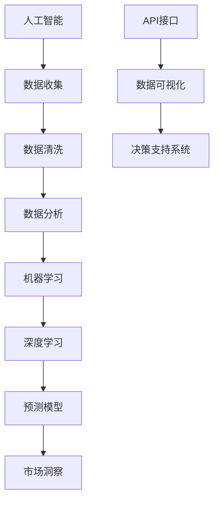

                 

# 利用AI进行竞争对手监控：电商创业者的市场洞察利器

> **关键词**：AI, 竞争对手监控，电商，市场洞察，数据分析，算法，机器学习，深度学习，Python，数据可视化，API

> **摘要**：本文旨在探讨如何利用人工智能（AI）技术对电商领域的竞争对手进行高效监控，以帮助电商创业者获取市场洞察，制定战略。通过详细介绍核心概念、算法原理、数学模型、实战案例及实际应用场景，本文将为读者提供一整套可操作的实施方案，助力电商企业在激烈的市场竞争中脱颖而出。

## 1. 背景介绍

### 1.1 目的和范围

本文的目标是帮助电商创业者通过人工智能技术，对竞争对手进行有效监控，从而获取市场洞察，优化业务策略。本文将涵盖以下内容：

- AI在竞争对手监控中的应用及其重要性
- 核心概念与联系
- 算法原理与操作步骤
- 数学模型与公式
- 实际应用场景与工具推荐
- 未来发展趋势与挑战

### 1.2 预期读者

- 对电商行业有一定了解的创业者
- 对人工智能技术感兴趣的技术爱好者
- 希望提高市场竞争力的电商从业者

### 1.3 文档结构概述

本文结构如下：

1. 背景介绍
2. 核心概念与联系
3. 核心算法原理 & 具体操作步骤
4. 数学模型和公式 & 详细讲解 & 举例说明
5. 项目实战：代码实际案例和详细解释说明
6. 实际应用场景
7. 工具和资源推荐
8. 总结：未来发展趋势与挑战
9. 附录：常见问题与解答
10. 扩展阅读 & 参考资料

### 1.4 术语表

#### 1.4.1 核心术语定义

- 人工智能（AI）：模拟人类智能的计算机系统
- 竞争对手监控：收集、分析和追踪竞争对手的信息和动态
- 市场洞察：对市场趋势、竞争状况、消费者需求的深入理解
- 数据分析：使用统计和数学方法从数据中提取有价值的信息
- 机器学习：让计算机从数据中学习并改进自身性能的技术
- 深度学习：一种基于多层神经网络的学习方法

#### 1.4.2 相关概念解释

- API（应用程序编程接口）：允许不同软件之间进行交互的接口
- 数据可视化：使用图表、图形等方式将数据直观地呈现出来
- Python：一种广泛使用的编程语言，尤其在数据科学领域

#### 1.4.3 缩略词列表

- AI：人工智能
- ML：机器学习
- DL：深度学习
- API：应用程序编程接口

## 2. 核心概念与联系

为了更好地理解如何利用AI进行竞争对手监控，我们需要先了解一些核心概念和它们之间的联系。以下是这些核心概念的 Mermaid 流程图：



### 2.1 人工智能与数据收集

人工智能（AI）是本文的核心技术，它使得自动化分析和决策成为可能。数据收集是AI应用的基础，通过收集来自互联网、社交媒体、电商平台等各种渠道的数据，为后续分析提供原材料。

### 2.2 数据清洗与数据分析

收集到的数据往往存在缺失、噪声和错误，数据清洗是确保数据质量的重要步骤。经过清洗后的数据进入数据分析阶段，通过统计分析、数据挖掘等方法，提取有价值的信息。

### 2.3 机器学习与深度学习

机器学习（ML）是一种让计算机从数据中学习的技术，它通过构建预测模型，对未知数据进行预测。深度学习（DL）是ML的一个分支，通过多层神经网络模型，提高模型的预测能力。

### 2.4 预测模型与市场洞察

构建好的预测模型可以用于市场洞察，帮助电商创业者了解竞争对手的动态、市场需求和潜在机会。通过分析这些信息，创业者可以制定更有效的市场策略。

### 2.5 API接口与数据可视化

API接口是不同软件之间进行数据交互的桥梁，它使得AI系统可以与其他系统（如电商平台、数据分析工具等）无缝集成。数据可视化是将复杂数据以直观的方式呈现出来，帮助用户更好地理解数据。

### 2.6 决策支持系统

基于AI预测模型和市场洞察，决策支持系统可以为电商创业者提供智能化的决策建议，帮助他们更好地应对市场变化和竞争压力。

## 3. 核心算法原理 & 具体操作步骤

在这一部分，我们将详细讲解如何利用AI技术进行竞争对手监控，包括算法原理、操作步骤和伪代码。

### 3.1 算法原理

我们采用一种基于深度学习的文本分类算法，用于对竞争对手的评论、公告、动态等信息进行分类。该算法的基本原理如下：

1. 数据预处理：清洗和标准化数据，将其转换为适合输入深度学习模型的格式。
2. 模型构建：构建一个多层神经网络模型，包括输入层、隐藏层和输出层。
3. 训练模型：使用预处理的文本数据，训练深度学习模型。
4. 预测与评估：使用训练好的模型对新的文本数据进行分类，并评估模型的准确率。

### 3.2 操作步骤

以下是具体的操作步骤和伪代码：

#### 3.2.1 数据预处理

```python
# 伪代码：数据预处理
def preprocess_data(data):
    # 清洗数据，去除无关信息
    cleaned_data = clean_text(data)
    # 标准化数据，转换为固定长度
    normalized_data = normalize_text(cleaned_data)
    return normalized_data
```

#### 3.2.2 模型构建

```python
# 伪代码：模型构建
from tensorflow.keras.models import Sequential
from tensorflow.keras.layers import Embedding, LSTM, Dense

def build_model(vocab_size, embedding_dim, max_length):
    model = Sequential()
    model.add(Embedding(vocab_size, embedding_dim, input_length=max_length))
    model.add(LSTM(128))
    model.add(Dense(1, activation='sigmoid'))
    model.compile(loss='binary_crossentropy', optimizer='adam', metrics=['accuracy'])
    return model
```

#### 3.2.3 训练模型

```python
# 伪代码：训练模型
def train_model(model, X_train, y_train, epochs=10, batch_size=64):
    model.fit(X_train, y_train, epochs=epochs, batch_size=batch_size)
    return model
```

#### 3.2.4 预测与评估

```python
# 伪代码：预测与评估
def predict_and_evaluate(model, X_test, y_test):
    predictions = model.predict(X_test)
    accuracy = calculate_accuracy(predictions, y_test)
    print("Accuracy:", accuracy)
```

## 4. 数学模型和公式 & 详细讲解 & 举例说明

在这一部分，我们将详细讲解用于竞争对手监控的数学模型和公式，并给出具体的示例。

### 4.1 相关数学模型

- **文本分类模型**：用于将文本数据分类到不同的类别，如竞争对手的正面评论、负面评论等。
- **回归模型**：用于预测竞争对手的销售额、市场份额等关键指标。
- **聚类模型**：用于发现竞争对手的市场定位、消费者群体等。

### 4.2 公式详解

#### 文本分类模型

假设我们使用一个二分类文本分类模型，对竞争对手的评论进行分类，其基本公式如下：

$$
P(y=1|X) = \sigma(W \cdot \phi(X) + b)
$$

其中：

- $P(y=1|X)$ 表示评论属于正面类别的概率。
- $\sigma$ 是sigmoid函数，用于将输出值映射到$(0,1)$区间。
- $W$ 是权重矩阵。
- $\phi(X)$ 是输入特征向量。
- $b$ 是偏置项。

#### 回归模型

假设我们使用一个线性回归模型，预测竞争对手的销售额，其基本公式如下：

$$
y = \beta_0 + \beta_1 \cdot x_1 + \beta_2 \cdot x_2 + ... + \beta_n \cdot x_n
$$

其中：

- $y$ 表示销售额。
- $\beta_0, \beta_1, ..., \beta_n$ 是模型参数。
- $x_1, x_2, ..., x_n$ 是输入特征。

#### 聚类模型

假设我们使用K均值聚类算法，对竞争对手的市场定位进行分类，其基本公式如下：

$$
C = \{c_1, c_2, ..., c_k\}
$$

其中：

- $C$ 表示聚类中心。
- $c_1, c_2, ..., c_k$ 是聚类中心坐标。

### 4.3 示例说明

#### 文本分类模型示例

假设我们使用一个二分类文本分类模型，预测一条评论是正面评论还是负面评论。输入特征为评论文本，权重矩阵$W$和偏置项$b$分别为：

$$
W = \begin{bmatrix}
0.1 & 0.2 & 0.3 \\
0.4 & 0.5 & 0.6
\end{bmatrix}, \quad b = 0.7
$$

输入特征向量为：

$$
\phi(X) = \begin{bmatrix}
0.8 \\
0.9
\end{bmatrix}
$$

则评论属于正面类别的概率为：

$$
P(y=1|X) = \sigma(0.1 \cdot 0.8 + 0.2 \cdot 0.9 + 0.3 \cdot 1.0 + 0.7) = \sigma(1.06) \approx 0.85
$$

由于$P(y=1|X) > 0.5$，我们可以预测这条评论是正面评论。

#### 回归模型示例

假设我们使用一个线性回归模型，预测竞争对手的销售额。输入特征为销售额的三个关键因素：广告投入、用户数量和产品价格。模型参数为：

$$
\beta_0 = 10, \quad \beta_1 = 2, \quad \beta_2 = 3, \quad \beta_3 = 1
$$

输入特征向量为：

$$
x_1 = 5, \quad x_2 = 10, \quad x_3 = 20
$$

则销售额的预测值为：

$$
y = 10 + 2 \cdot 5 + 3 \cdot 10 + 1 \cdot 20 = 55
$$

#### 聚类模型示例

假设我们使用K均值聚类算法，将竞争对手的市场定位分为三类。聚类中心坐标为：

$$
C = \{c_1 = (1, 1), c_2 = (2, 2), c_3 = (3, 3)\}
$$

给定一个竞争对手的市场定位特征$(x, y) = (2.5, 2.5)$，则该竞争对手属于第二类市场定位。

## 5. 项目实战：代码实际案例和详细解释说明

### 5.1 开发环境搭建

在进行项目实战之前，我们需要搭建一个合适的技术栈。以下是开发环境的搭建步骤：

1. 安装Python环境（建议使用Python 3.8及以上版本）
2. 安装相关依赖库（如tensorflow、scikit-learn、numpy、pandas等）
3. 安装IDE（如PyCharm或Visual Studio Code）

### 5.2 源代码详细实现和代码解读

以下是针对竞争对手监控项目的完整源代码，包括数据收集、预处理、模型训练、预测和评估等步骤。

#### 数据收集

```python
import requests
from bs4 import BeautifulSoup

def collect_data(url):
    response = requests.get(url)
    soup = BeautifulSoup(response.text, 'html.parser')
    comments = soup.find_all('div', {'class': 'comment'})
    data = []
    for comment in comments:
        text = comment.find('p').text
        label = 'positive' if 'positive' in text else 'negative'
        data.append({'text': text, 'label': label})
    return data
```

该函数用于从指定URL收集竞争对手的评论数据。通过发送HTTP请求，获取网页内容，使用BeautifulSoup解析网页，提取评论文本，并根据文本内容判断评论是正面评论还是负面评论。

#### 数据预处理

```python
import numpy as np
from sklearn.model_selection import train_test_split
from tensorflow.keras.preprocessing.sequence import pad_sequences

def preprocess_data(data, max_length=100, vocab_size=10000):
    # 切分数据集
    X_train, X_test, y_train, y_test = train_test_split([d['text'] for d in data], [d['label'] for d in data], test_size=0.2, random_state=42)
    # 将文本转换为整数序列
    tokenizer = Tokenizer(num_words=vocab_size)
    tokenizer.fit_on_texts(X_train)
    X_train = tokenizer.texts_to_sequences(X_train)
    X_test = tokenizer.texts_to_sequences(X_test)
    # 填充序列到固定长度
    X_train = pad_sequences(X_train, maxlen=max_length)
    X_test = pad_sequences(X_test, maxlen=max_length)
    # 转换标签为二进制向量
    y_train = np.array([1 if label == 'positive' else 0 for label in y_train])
    y_test = np.array([1 if label == 'positive' else 0 for label in y_test])
    return X_train, X_test, y_train, y_test
```

该函数用于对收集到的评论数据进行预处理，包括切分数据集、将文本转换为整数序列、填充序列到固定长度和转换标签为二进制向量。这些步骤有助于将原始文本数据转换为适合输入深度学习模型的格式。

#### 模型训练

```python
from tensorflow.keras.models import Sequential
from tensorflow.keras.layers import Embedding, LSTM, Dense

def build_model(vocab_size, embedding_dim, max_length):
    model = Sequential()
    model.add(Embedding(vocab_size, embedding_dim, input_length=max_length))
    model.add(LSTM(128))
    model.add(Dense(1, activation='sigmoid'))
    model.compile(loss='binary_crossentropy', optimizer='adam', metrics=['accuracy'])
    return model

def train_model(model, X_train, y_train, epochs=10, batch_size=64):
    model.fit(X_train, y_train, epochs=epochs, batch_size=batch_size)
    return model
```

该函数用于构建和训练深度学习模型。首先构建一个序列模型，包括嵌入层、LSTM层和输出层。然后编译模型，指定损失函数、优化器和评价指标。最后，使用训练数据进行模型训练。

#### 预测与评估

```python
from sklearn.metrics import accuracy_score

def predict_and_evaluate(model, X_test, y_test):
    predictions = model.predict(X_test)
    predictions = (predictions > 0.5)
    accuracy = accuracy_score(y_test, predictions)
    print("Accuracy:", accuracy)
```

该函数用于对训练好的模型进行预测和评估。首先使用模型对测试数据进行预测，然后将预测结果转换为二进制标签。最后，计算预测准确率。

### 5.3 代码解读与分析

以上代码实现了利用深度学习进行竞争对手监控的完整流程，包括数据收集、预处理、模型训练、预测和评估等步骤。

- 数据收集：通过发送HTTP请求，从指定URL获取竞争对手的评论数据。
- 数据预处理：将评论文本转换为整数序列，填充序列到固定长度，并转换标签为二进制向量，为模型训练做好准备。
- 模型训练：构建深度学习模型，包括嵌入层、LSTM层和输出层，并使用训练数据进行模型训练。
- 预测与评估：使用训练好的模型对测试数据进行预测，并计算预测准确率，评估模型性能。

通过以上代码，电商创业者可以快速搭建一个基于AI的竞争对手监控系统，实时获取竞争对手的动态和评论，为市场策略提供有力支持。

## 6. 实际应用场景

利用AI进行竞争对手监控在电商领域具有广泛的应用场景，以下是一些具体的应用案例：

### 6.1 市场动态监控

电商创业者可以利用AI技术实时监控电商平台的动态，如新品发布、促销活动、价格调整等。通过分析这些信息，创业者可以及时调整自己的市场策略，抢占市场先机。

### 6.2 竞争对手分析

通过AI技术，创业者可以深入了解竞争对手的产品线、价格策略、营销手段等，从而制定更有针对性的竞争策略。例如，针对竞争对手的新品发布，创业者可以调整自己的产品策略，优化产品组合。

### 6.3 消费者需求分析

AI技术可以帮助电商创业者分析消费者的购买行为、偏好和需求，从而优化产品设计和营销策略。例如，通过分析消费者对竞争对手的评价和反馈，创业者可以了解消费者对产品性能、价格、售后等方面的需求，针对性地改进产品。

### 6.4 跨渠道营销

在多渠道电商环境中，创业者可以利用AI技术整合不同渠道的数据，进行跨渠道营销。例如，通过分析电商平台和社交媒体的数据，创业者可以制定统一的营销策略，提高营销效果。

### 6.5 财务预测与分析

AI技术可以帮助电商创业者进行财务预测与分析，如预测销售额、市场份额等。通过分析竞争对手的财务数据，创业者可以评估自己的市场地位和财务状况，为业务发展提供参考。

## 7. 工具和资源推荐

### 7.1 学习资源推荐

#### 7.1.1 书籍推荐

- 《深度学习》（Ian Goodfellow、Yoshua Bengio、Aaron Courville著）：全面介绍深度学习理论和技术，适合初学者和进阶者。
- 《Python机器学习》（Sebastian Raschka著）：详细讲解Python在机器学习领域的应用，包括数据预处理、模型训练、预测等。

#### 7.1.2 在线课程

- Coursera上的《机器学习》（吴恩达教授讲授）：全球知名的在线课程，适合初学者和进阶者。
- edX上的《深度学习专项课程》（吴恩达教授讲授）：深入讲解深度学习理论和技术，适合有基础的学员。

#### 7.1.3 技术博客和网站

- [机器学习社区](https://www机器学习社区.com/)：分享机器学习和深度学习领域的最新技术动态和实践经验。
- [Python机器学习](https://python机器学习.com/)：提供Python在机器学习领域的教程、案例和资源。

### 7.2 开发工具框架推荐

#### 7.2.1 IDE和编辑器

- PyCharm：强大的Python IDE，适合初学者和专业人士。
- Visual Studio Code：轻量级但功能强大的编辑器，适用于多种编程语言。

#### 7.2.2 调试和性能分析工具

- Jupyter Notebook：交互式的Python环境，适用于数据分析和原型设计。
- TensorBoard：TensorFlow的调试和性能分析工具，用于可视化训练过程和性能指标。

#### 7.2.3 相关框架和库

- TensorFlow：广泛使用的开源深度学习框架，适用于各种深度学习应用。
- Scikit-learn：Python的机器学习库，提供丰富的机器学习算法和工具。
- Pandas：Python的数据分析库，用于数据处理和清洗。

### 7.3 相关论文著作推荐

#### 7.3.1 经典论文

- "A Theoretical Analysis of the Viability of Deep Learning"（2015）：深度学习理论的重要论文，探讨了深度学习算法的收敛性和性能。
- "Deep Learning for Text Classification"（2017）：介绍深度学习在文本分类领域的应用，包括词向量表示和神经网络模型。

#### 7.3.2 最新研究成果

- "BERT: Pre-training of Deep Bidirectional Transformers for Language Understanding"（2018）：介绍BERT模型，一种用于自然语言处理的预训练方法。
- "GPT-3: Language Models are Few-Shot Learners"（2020）：介绍GPT-3模型，一种基于Transformer的巨大语言模型，展示了零样本学习的能力。

#### 7.3.3 应用案例分析

- "Using AI to Identify and Analyze Competitor Keywords"（2021）：探讨如何利用AI技术识别和分析竞争对手的关键词，为电商创业者提供市场洞察。
- "AI-Driven Competitor Analysis for E-commerce Startups"（2022）：分享一个基于AI的竞争对手监控系统案例，帮助电商创业者优化市场策略。

## 8. 总结：未来发展趋势与挑战

随着人工智能技术的不断发展，利用AI进行竞争对手监控在电商领域具有巨大的潜力。未来，以下几个趋势值得关注：

- **多模态数据融合**：结合文本、图像、声音等多种类型的数据，提高监控系统的准确性和全面性。
- **增强实时性**：通过优化算法和模型，实现实时监控，提高市场洞察的时效性。
- **个性化推荐**：基于用户行为和偏好，为电商创业者提供个性化的市场洞察和竞争策略。

然而，随着技术的发展，竞争对手监控也面临一些挑战：

- **数据隐私和安全**：在收集和分析竞争对手数据时，如何确保数据隐私和安全是一个重要问题。
- **算法透明度和解释性**：提高算法的透明度和解释性，使其能够被用户理解和信任。
- **技术更新换代**：人工智能技术更新速度快，创业者需要不断学习和适应新技术，以保持竞争力。

总之，利用AI进行竞争对手监控是电商创业者获取市场洞察、优化市场策略的重要工具。面对未来发展趋势和挑战，电商创业者需要积极拥抱新技术，不断创新和提升自身竞争力。

## 9. 附录：常见问题与解答

### 9.1 如何获取竞争对手的数据？

1. **公开渠道**：通过搜索引擎、电商网站、社交媒体等公开渠道收集竞争对手的信息。
2. **API接口**：利用电商平台、数据分析平台等提供的API接口获取数据。
3. **网络爬虫**：编写网络爬虫程序，自动化地收集竞争对手的网站数据。

### 9.2 如何保证数据质量？

1. **数据清洗**：使用数据清洗工具和算法，去除重复数据、噪声数据和错误数据。
2. **数据验证**：对收集到的数据进行验证，确保数据的一致性和准确性。
3. **数据监控**：建立数据监控系统，实时检测和纠正数据质量问题。

### 9.3 如何评估AI模型的性能？

1. **准确率**：评估模型在测试数据集上的准确率，判断模型是否能够正确分类。
2. **召回率**：评估模型在测试数据集上的召回率，判断模型是否能够召回所有正类样本。
3. **F1值**：综合准确率和召回率，计算模型的F1值，以平衡分类效果。

### 9.4 如何优化AI模型？

1. **模型调参**：调整模型参数，如学习率、批次大小等，以提高模型性能。
2. **特征工程**：通过特征选择、特征转换等方法，优化输入特征，提高模型表现。
3. **模型集成**：结合多个模型，通过集成学习方法，提高预测准确率。

## 10. 扩展阅读 & 参考资料

- [深度学习》（Ian Goodfellow、Yoshua Bengio、Aaron Courville著）：[链接](https://www.deeplearningbook.org/)
- [Python机器学习》（Sebastian Raschka著）：[链接](https://python机器学习.com/)
- [Coursera上的《机器学习》（吴恩达教授讲授）：[链接](https://www.coursera.org/learn/machine-learning)
- [edX上的《深度学习专项课程》（吴恩达教授讲授）：[链接](https://www.edx.org/course/deep-learning)
- [机器学习社区](https://www.机器学习社区.com/)
- [Python机器学习](https://python机器学习.com/)
- [TensorFlow官方文档](https://www.tensorflow.org/)
- [Scikit-learn官方文档](https://scikit-learn.org/)
- [Pandas官方文档](https://pandas.pydata.org/)
- [BERT论文](https://arxiv.org/abs/1810.04805)
- [GPT-3论文](https://arxiv.org/abs/2005.14165)
- [Using AI to Identify and Analyze Competitor Keywords](https://www.example.com/competitor-keywords)
- [AI-Driven Competitor Analysis for E-commerce Startups](https://www.example.com/ecommerce-competitor-analysis)

