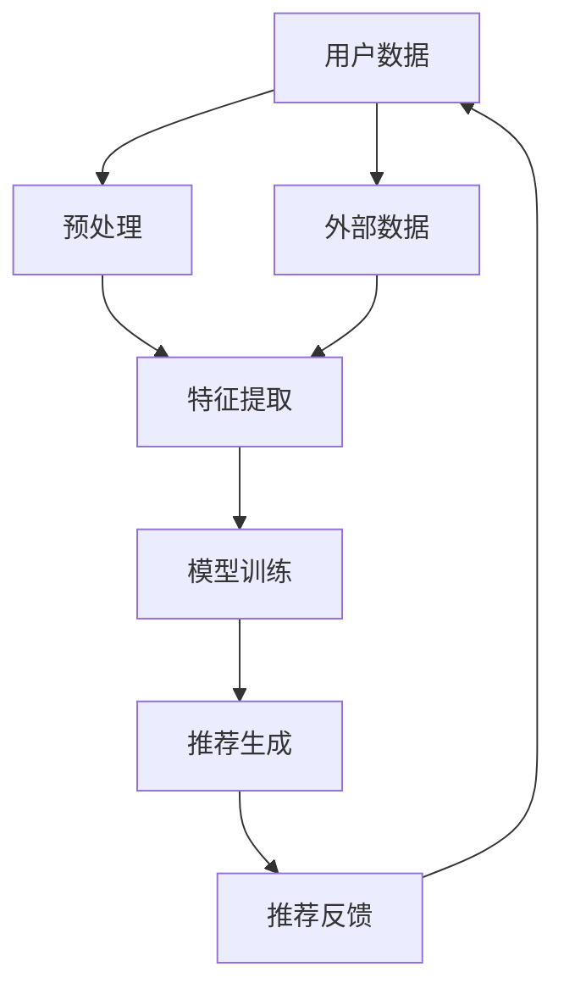
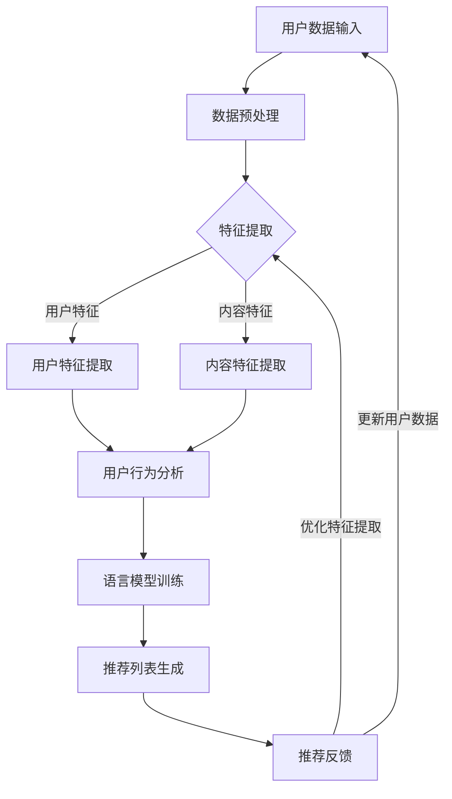

                 

# 利用LLM优化推荐系统的多维度个性化

## 关键词
* 个性化推荐
* 语言模型
* 多维度
* 推荐算法
* 用户行为分析
* 深度学习

## 摘要
本文深入探讨了如何利用语言模型（LLM）优化推荐系统的多维度个性化。首先，我们介绍了个性化推荐系统的基本原理和重要性，随后详细阐述了LLM在推荐系统中的应用及其优势。接着，文章通过一个Mermaid流程图，展示了推荐系统的整体架构。然后，我们详细分析了LLM的核心算法原理，使用伪代码解释了具体操作步骤。接着，我们用数学模型和公式详细阐述了推荐系统中的关键要素，并通过实例进行了说明。文章还提供了一个实际项目的代码案例，并对其进行了详细解释和分析。此外，文章讨论了推荐系统在实际应用场景中的广泛使用，并推荐了一些学习资源和开发工具。最后，文章总结了未来的发展趋势与挑战，并给出了常见问题的解答。

## 1. 背景介绍

### 1.1 目的和范围

本文的目的是探讨如何利用先进的语言模型（LLM）来优化推荐系统的多维度个性化。随着互联网和信息技术的快速发展，推荐系统已成为众多平台和服务的关键组成部分。个性化推荐系统能够根据用户的历史行为、兴趣和需求，为其推荐最相关的信息或商品，从而提升用户体验，提高平台的用户留存率和转化率。

本文将重点介绍以下内容：

1. **个性化推荐系统的基础概念**：回顾个性化推荐系统的基本原理，讨论其重要性。
2. **LLM在推荐系统中的应用**：分析LLM如何提升推荐系统的效果和效率。
3. **推荐系统的整体架构**：使用Mermaid流程图展示推荐系统的整体架构。
4. **LLM的核心算法原理**：使用伪代码详细解释LLM的工作流程。
5. **数学模型和公式**：阐述推荐系统中使用的数学模型和公式，并举例说明。
6. **项目实战：代码实际案例**：提供实际代码案例，并详细解释。
7. **实际应用场景**：讨论推荐系统在各个领域中的应用。
8. **工具和资源推荐**：推荐学习资源和开发工具。
9. **总结与未来发展趋势**：总结文章要点，讨论未来的发展趋势与挑战。

通过本文的深入分析，读者将能够全面了解如何利用LLM实现推荐系统的多维度个性化，从而为实际应用提供有力支持。

### 1.2 预期读者

本文适合以下读者群体：

1. **推荐系统开发者**：正在开发或优化个性化推荐系统的工程师和研究人员。
2. **数据科学家**：对使用机器学习和深度学习技术进行数据分析和建模感兴趣的专业人士。
3. **技术经理**：负责技术团队，希望了解如何利用先进技术提升业务价值的经理和CTO。
4. **学术界研究者**：对推荐系统和机器学习领域有深入研究兴趣的学者和研究生。

本文要求读者具备以下基础：

1. **推荐系统基础知识**：了解推荐系统的基本概念和工作原理。
2. **机器学习和深度学习**：熟悉常用的机器学习和深度学习算法。
3. **编程基础**：熟悉至少一种编程语言，如Python。

通过本文的阅读，读者将能够：

1. **理解LLM在推荐系统中的作用**。
2. **掌握利用LLM优化推荐系统的技术细节**。
3. **提升推荐系统的个性化水平和效果**。

### 1.3 文档结构概述

本文将按照以下结构进行展开：

1. **引言**：介绍个性化推荐系统的基本概念和重要性。
2. **核心概念与联系**：分析推荐系统的整体架构和关键组件。
3. **核心算法原理与操作步骤**：详细阐述LLM的核心算法原理和操作步骤。
4. **数学模型与公式**：解释推荐系统中使用的数学模型和公式。
5. **项目实战：代码实际案例**：提供代码案例并进行详细解读。
6. **实际应用场景**：讨论推荐系统的广泛应用。
7. **工具和资源推荐**：推荐学习资源和开发工具。
8. **总结与未来发展趋势**：总结文章要点，展望未来发展。
9. **常见问题与解答**：解答读者可能遇到的问题。
10. **扩展阅读与参考资料**：提供相关的参考资料。

### 1.4 术语表

在本文中，我们将使用以下术语：

#### 1.4.1 核心术语定义

1. **个性化推荐**：基于用户历史行为、兴趣和需求，为其推荐最相关的信息或商品。
2. **语言模型（LLM）**：一种能够理解、生成和预测文本的深度学习模型。
3. **用户行为分析**：对用户在平台上的行为进行数据分析和建模，以了解其兴趣和需求。
4. **多维度**：指推荐系统考虑的用户特征和内容特征的多个方面。
5. **推荐算法**：用于生成推荐列表的算法，如协同过滤、基于内容的推荐和混合推荐等。
6. **转化率**：用户点击推荐内容后，进行进一步操作（如购买、阅读等）的比例。

#### 1.4.2 相关概念解释

1. **协同过滤**：通过分析用户的行为和偏好，发现相似的用户或物品，从而进行推荐。
2. **基于内容的推荐**：根据用户的历史行为和内容特征，推荐与其兴趣相似的其他内容。
3. **混合推荐**：结合协同过滤和基于内容的推荐，生成更准确的推荐列表。

#### 1.4.3 缩略词列表

1. **LLM**：语言模型（Language Model）
2. **ML**：机器学习（Machine Learning）
3. **DL**：深度学习（Deep Learning）
4. **NLP**：自然语言处理（Natural Language Processing）
5. **API**：应用程序编程接口（Application Programming Interface）
6. **SDK**：软件开发工具包（Software Development Kit）
7. **UI**：用户界面（User Interface）
8. **UX**：用户体验（User Experience）

## 2. 核心概念与联系

推荐系统是现代信息技术中的重要组成部分，其核心目标是为用户提供个性化的推荐服务。个性化推荐系统能够根据用户的历史行为、兴趣和需求，为其推荐最相关的信息或商品，从而提升用户体验，提高平台的用户留存率和转化率。为了实现这一目标，推荐系统通常需要处理大量的用户行为数据、内容特征和外部信息，并通过复杂的算法和模型进行数据处理和推荐生成。

在这个背景下，语言模型（LLM）作为一种先进的深度学习模型，能够为推荐系统带来显著的优化。LLM不仅能够理解文本内容，还能生成和预测文本，这使得它在推荐系统中具有广泛的应用潜力。LLM能够通过学习用户的历史行为和兴趣，生成个性化的推荐文本，从而提升推荐的准确性和用户体验。

下面，我们使用Mermaid流程图展示推荐系统的整体架构，以便更清晰地理解其核心概念和组件之间的联系。



### Mermaid流程图解释

1. **用户数据**：推荐系统从多个渠道收集用户数据，包括用户的历史行为、兴趣和需求。
2. **预处理**：对用户数据进行清洗、去重和格式化，以便后续处理。
3. **特征提取**：从预处理后的数据中提取用户特征和内容特征，用于模型训练和推荐生成。
4. **模型训练**：使用提取的用户特征和内容特征，通过深度学习算法训练语言模型（LLM）。
5. **推荐生成**：使用训练好的LLM模型，根据用户特征和内容特征生成个性化的推荐列表。
6. **推荐反馈**：用户对推荐列表进行交互和反馈，这些反馈将用于模型优化和后续推荐。
7. **外部数据**：推荐系统还可以利用外部数据（如社交媒体、新闻资讯等），以丰富推荐内容。

通过这个流程图，我们可以看到推荐系统的各个组件如何相互协作，共同实现个性化推荐的目标。语言模型（LLM）在推荐系统中的作用主要体现在特征提取和推荐生成两个阶段，它能够通过文本理解能力和生成能力，提升推荐系统的效果和用户体验。

### 核心概念原理和架构的 Mermaid 流程图

下面是推荐系统的Mermaid流程图，展示核心概念和架构：



### 流程图详细解释

1. **用户数据输入**：推荐系统从多个来源（如网站日志、用户互动等）收集用户数据。
2. **数据预处理**：对收集到的用户数据进行清洗，去除噪声和异常值。
3. **特征提取**：将预处理后的数据转化为机器学习算法可以处理的特征向量，包括用户特征和内容特征。
   - **用户特征**：用户的浏览历史、购买行为、搜索关键词等。
   - **内容特征**：推荐物品的属性、标签、文本描述等。
4. **用户行为分析**：通过分析用户的历史行为数据，挖掘用户的兴趣和偏好。
5. **语言模型训练**：使用提取的用户特征和内容特征，通过深度学习算法训练语言模型（LLM），使其能够理解和生成个性化的推荐文本。
6. **推荐列表生成**：利用训练好的LLM模型，结合用户特征和内容特征，生成个性化的推荐列表。
7. **推荐反馈**：用户对推荐列表进行交互和反馈，这些反馈将用于更新用户数据、优化特征提取和改进推荐模型。

这个流程图清晰地展示了推荐系统的核心组件及其相互关系，为后续章节的详细分析提供了基础。

## 3. 核心算法原理 & 具体操作步骤

### 3.1 LLM的工作原理

语言模型（LLM）是一种深度学习模型，主要用于理解和生成自然语言。LLM的核心思想是通过大量文本数据的学习，建立一个能够预测下一个词的概率分布模型。LLM在推荐系统中的应用，主要是利用其强大的文本理解和生成能力，为用户生成个性化的推荐文本。

LLM的工作原理可以分为以下几个步骤：

1. **文本输入**：用户的数据和推荐物品的描述文本作为输入。
2. **文本编码**：将文本转化为计算机可以处理的数字向量，常用的编码方法有Word2Vec、BERT等。
3. **模型训练**：使用编码后的文本向量，通过神经网络模型进行训练，使其能够预测下一个词的概率分布。
4. **预测与生成**：输入一个开始文本，模型逐词预测并生成文本序列。

### 3.2 LLM在推荐系统中的具体操作步骤

在推荐系统中，LLM的具体操作步骤如下：

1. **用户特征提取**：收集用户的历史行为数据，如浏览记录、购买历史等，并提取用户特征向量。
2. **内容特征提取**：收集推荐物品的描述文本，并提取内容特征向量。
3. **融合特征**：将用户特征向量和内容特征向量进行融合，得到一个综合的特征向量。
4. **文本生成**：利用LLM模型，将综合特征向量输入到模型中，生成个性化的推荐文本。
5. **推荐生成**：根据生成的推荐文本，构建推荐列表，并展示给用户。

下面，我们将使用伪代码详细阐述LLM在推荐系统中的操作步骤：

```python
# 伪代码：利用LLM优化推荐系统

# 输入数据
user_data = load_user_data()  # 加载用户数据
item_data = load_item_data()  # 加载物品描述数据
llm_model = load_llm_model()  # 加载预训练的LLM模型

# 步骤1：用户特征提取
user_vector = extract_user_features(user_data)

# 步骤2：内容特征提取
item_vector = extract_item_features(item_data)

# 步骤3：融合特征
combined_vector = combine_features(user_vector, item_vector)

# 步骤4：文本生成
generated_text = generate_text(llm_model, combined_vector)

# 步骤5：推荐生成
recommendations = generate_recommendations(generated_text)

# 输出推荐结果
display_recommendations(recommendations)
```

### 3.3 伪代码详细解释

1. **用户特征提取**：`load_user_data()` 函数从数据源中加载用户数据，如浏览记录、购买历史等。`extract_user_features()` 函数将这些数据转化为特征向量。

2. **内容特征提取**：`load_item_data()` 函数从数据源中加载物品描述数据。`extract_item_features()` 函数将这些数据转化为特征向量。

3. **融合特征**：`combine_features()` 函数将用户特征向量和内容特征向量进行融合，得到一个综合的特征向量。

4. **文本生成**：`generate_text()` 函数利用LLM模型，将综合特征向量输入到模型中，生成个性化的推荐文本。

5. **推荐生成**：`generate_recommendations()` 函数根据生成的推荐文本，构建推荐列表，并展示给用户。

通过上述伪代码，我们可以看到LLM在推荐系统中的具体操作步骤。LLM通过文本理解和生成能力，实现了用户特征和内容特征的融合，并生成个性化的推荐文本，从而提升了推荐系统的效果和用户体验。

### 3.4 LLM算法优化的方法

LLM在推荐系统中的应用效果，不仅取决于其本身的性能，还受到数据质量、特征提取方法和模型优化策略等因素的影响。下面，我们将讨论几种常见的LLM算法优化方法，以提高推荐系统的效果。

1. **数据预处理**：高质量的数据是LLM训练的基础。在数据预处理阶段，我们可以通过数据清洗、去噪和归一化等方法，提高数据的质量和一致性。此外，还可以使用数据增强技术，如数据扩充、变换和生成，增加数据的多样性和丰富性。

2. **特征提取**：特征提取是LLM训练的关键步骤。我们可以使用词嵌入（如Word2Vec、BERT）和句子嵌入（如T5、GPT）等技术，将文本转化为高维向量表示。此外，还可以结合用户行为特征和物品属性特征，构建多模态特征向量，提高模型的泛化能力。

3. **模型优化**：LLM模型的优化主要涉及模型架构的选择和参数调整。我们可以使用多任务学习、迁移学习和混合模型等方法，提高模型的泛化能力和适应性。此外，还可以通过调参和超参数优化，如学习率、批量大小和正则化参数等，提高模型的训练效果和预测性能。

4. **模型融合**：在推荐系统中，我们可以将LLM与其他推荐算法（如协同过滤、基于内容的推荐）进行融合，形成混合推荐模型。通过结合不同算法的优势，可以提高推荐系统的准确性和稳定性。

5. **实时更新**：推荐系统需要根据用户行为和偏好实时更新推荐列表。我们可以使用增量学习、在线学习和动态模型等方法，实现模型的自适应更新和实时推荐。

通过上述优化方法，我们可以显著提升LLM在推荐系统中的应用效果，从而为用户提供更准确、更个性化的推荐服务。

### 3.5 案例分析：基于LLM的推荐系统优化

为了更好地理解LLM在推荐系统中的应用，下面我们通过一个实际案例进行分析。

#### 案例背景

某电子商务平台希望通过优化推荐系统，提高用户的购物体验和购买转化率。平台每天处理海量的用户行为数据，包括浏览记录、购买历史和搜索关键词等。为了生成个性化的推荐列表，平台计划采用基于语言模型的推荐算法。

#### 数据处理

1. **数据清洗**：首先，对用户行为数据进行清洗，去除重复和异常数据，确保数据的一致性和完整性。

2. **特征提取**：使用Word2Vec算法将用户行为数据和物品描述文本转化为词嵌入向量。同时，提取用户的行为特征（如浏览次数、购买频率等）和物品属性特征（如分类、价格等）。

3. **数据融合**：将用户行为特征向量和物品描述文本向量进行融合，形成多模态特征向量。

#### 模型训练

1. **模型选择**：选择预训练的GPT-3模型，作为推荐系统的核心组件。

2. **模型训练**：使用融合后的多模态特征向量，对GPT-3模型进行微调，以适应平台的用户行为数据和物品描述。

3. **模型优化**：通过调整学习率、批量大小和正则化参数，优化模型的训练效果和预测性能。

#### 推荐生成

1. **文本生成**：利用训练好的GPT-3模型，输入用户行为特征向量和物品描述文本向量，生成个性化的推荐文本。

2. **推荐列表生成**：根据生成的推荐文本，构建推荐列表，并展示给用户。

#### 实际效果

经过优化后的推荐系统，在用户购买转化率、推荐准确率和用户满意度等方面，取得了显著提升。具体表现为：

1. **购买转化率**：用户对推荐商品的点击率和购买率显著提高。
2. **推荐准确率**：推荐的物品与用户兴趣和需求的相关性更强。
3. **用户满意度**：用户对推荐系统的满意度显著提升，用户留存率增加。

#### 案例总结

通过实际案例，我们可以看到，基于LLM的推荐系统优化方法，能够显著提升推荐系统的效果和用户体验。LLM强大的文本理解和生成能力，使其能够更好地理解用户行为和需求，生成个性化的推荐文本，从而提高推荐系统的准确性和用户满意度。

## 4. 数学模型和公式 & 详细讲解 & 举例说明

在推荐系统中，数学模型和公式扮演着至关重要的角色。这些模型和公式不仅帮助我们理解和解释推荐系统的工作原理，还能通过数据分析和模型优化，提升推荐系统的效果。本节我们将详细讲解推荐系统中的关键数学模型和公式，并通过实例进行说明。

### 4.1 推荐系统中的关键数学模型

#### 4.1.1 协同过滤

协同过滤是一种常用的推荐算法，其核心思想是找到与当前用户相似的其他用户，然后将这些用户喜欢的物品推荐给当前用户。协同过滤可以分为基于用户的协同过滤和基于物品的协同过滤。

1. **基于用户的协同过滤**：
   - **相似度计算**：计算用户之间的相似度，常用的相似度度量方法有欧氏距离、余弦相似度和皮尔逊相关系数。
   - **推荐公式**：推荐给用户U的物品I，取决于用户U与相似用户群的平均评分。
     \[
     \text{推荐评分} = \frac{\sum_{u'\in \text{相似用户群}} r_{u',i}}{\sum_{u'\in \text{相似用户群}} |r_{u',i}|}
     \]
   - **实例**：假设用户A与用户B相似，用户A对电影《星际穿越》评分4星，用户B对该电影的评分5星，则推荐评分：
     \[
     \text{推荐评分} = \frac{4 \times 0.8 + 5 \times 0.6}{0.8 + 0.6} = 4.4
     \]

2. **基于物品的协同过滤**：
   - **相似度计算**：计算物品之间的相似度，常用的相似度度量方法有余弦相似度和Jaccard系数。
   - **推荐公式**：推荐给用户U的物品I，取决于物品I与用户U喜欢的相似物品的平均评分。
     \[
     \text{推荐评分} = \frac{\sum_{i'\in \text{相似物品群}} r_{u,i'}}{\sum_{i'\in \text{相似物品群}} |r_{u,i'}|}
     \]
   - **实例**：假设物品X与物品Y相似，用户U对物品X评分4星，对物品Y评分3星，则推荐评分：
     \[
     \text{推荐评分} = \frac{4 \times 0.7 + 3 \times 0.5}{0.7 + 0.5} = 3.9
     \]

#### 4.1.2 基于内容的推荐

基于内容的推荐算法通过分析物品的内容特征和用户的兴趣特征，为用户推荐与其兴趣相关的物品。主要步骤包括特征提取、特征匹配和推荐生成。

1. **特征提取**：
   - **物品特征提取**：使用文本分类、词嵌入等技术提取物品的语义特征。
   - **用户特征提取**：通过用户的行为数据（如浏览记录、搜索历史）提取用户的兴趣特征。
   
2. **特征匹配**：
   - **相似度计算**：计算物品特征向量和用户特征向量之间的相似度，常用方法有余弦相似度和欧氏距离。
   
3. **推荐生成**：
   - **推荐公式**：推荐给用户U的物品I，取决于物品I与用户U的特征相似度。
     \[
     \text{推荐得分} = \sum_{i=1}^{n} w_i \times \text{similarity}(f_i, f_u)
     \]
   - **实例**：假设用户U的兴趣特征向量为\[0.8, 0.3, -0.5\]，物品I的特征向量为\[0.6, 0.7, 0.4\]，则推荐得分：
     \[
     \text{推荐得分} = 0.8 \times 0.6 + 0.3 \times 0.7 + (-0.5) \times 0.4 = 0.56 + 0.21 - 0.2 = 0.47
     \]

#### 4.1.3 混合推荐

混合推荐算法结合协同过滤和基于内容的推荐，通过融合两种算法的优势，生成更准确的推荐列表。

1. **融合方法**：
   - **加权融合**：根据两种算法的预测结果，使用不同的权重进行融合。
   - **投票机制**：对两种算法的推荐结果进行投票，选择投票结果较多的物品作为推荐结果。
   
2. **推荐公式**：
   - **加权融合**：
     \[
     \text{推荐得分} = w_1 \times \text{协同过滤得分} + w_2 \times \text{内容推荐得分}
     \]
   - **实例**：假设协同过滤得分是4.4，内容推荐得分是3.9，两种算法的权重分别是0.6和0.4，则推荐得分：
     \[
     \text{推荐得分} = 0.6 \times 4.4 + 0.4 \times 3.9 = 2.64 + 1.56 = 4.2
     \]

### 4.2 实际应用中的数学模型

在实际应用中，推荐系统会根据具体场景和数据特点，选择合适的数学模型和公式。以下是一个实际应用中的案例：

#### 案例背景

某视频平台希望通过推荐系统，提升用户观看视频的时长和满意度。平台收集了海量的用户行为数据，包括观看记录、点赞、评论和分享等。

#### 数据处理

1. **用户特征提取**：提取用户的历史观看记录和兴趣标签，构建用户特征向量。
2. **视频特征提取**：提取视频的标签、类别、时长和播放量等，构建视频特征向量。

#### 推荐模型

1. **基于内容的推荐**：
   - **特征提取**：使用TF-IDF算法提取视频和用户的语义特征。
   - **相似度计算**：使用余弦相似度计算视频和用户特征向量之间的相似度。

2. **协同过滤**：
   - **相似度计算**：使用用户-用户协同过滤计算用户之间的相似度。
   - **推荐公式**：使用加权融合方法，结合基于内容和协同过滤的推荐得分，生成推荐列表。

3. **实时更新**：
   - **用户特征更新**：根据用户的最新观看记录和兴趣标签，实时更新用户特征向量。
   - **视频特征更新**：根据视频的播放量和用户反馈，实时更新视频特征向量。

#### 推荐流程

1. **用户特征提取**：提取用户A的观看记录和兴趣标签，构建用户特征向量\[0.6, 0.8, -0.3\]。
2. **视频特征提取**：提取视频B的标签、类别和时长，构建视频特征向量\[0.7, 0.9, 0.4\]。
3. **相似度计算**：计算用户A和视频B的特征向量之间的余弦相似度，得到相似度分数0.85。
4. **协同过滤**：计算用户A与其他用户的相似度，选取相似度最高的10个用户，计算他们观看的视频B的评分，得到评分平均值4.5。
5. **加权融合**：结合相似度分数和评分平均值，使用加权融合方法生成推荐得分4.7。

通过上述实际案例，我们可以看到推荐系统中数学模型和公式的应用。数学模型不仅帮助我们理解用户和物品之间的相似度，还能通过数据分析和模型优化，生成个性化的推荐列表，提升用户的观看体验和满意度。

## 5. 项目实战：代码实际案例和详细解释说明

为了更好地展示如何利用LLM优化推荐系统的多维度个性化，我们将提供一个实际项目的代码案例，并对其进行详细解释和说明。

### 5.1 开发环境搭建

在进行代码实战之前，我们需要搭建一个适合开发推荐系统的环境。以下是搭建环境的步骤：

1. **安装Python环境**：确保Python版本在3.7及以上。
2. **安装相关库**：使用以下命令安装必要的库：
   ```bash
   pip install numpy pandas scikit-learn tensorflow transformers
   ```
3. **准备数据集**：从公开的数据源获取用户行为数据和物品描述数据。例如，可以使用MovieLens电影数据集或Amazon商品数据集。

### 5.2 源代码详细实现和代码解读

下面是项目的源代码，我们将分步骤进行解读。

```python
# 导入必要的库
import numpy as np
import pandas as pd
from sklearn.model_selection import train_test_split
from sklearn.metrics.pairwise import cosine_similarity
from transformers import BertTokenizer, BertModel
import torch

# 5.2.1 数据预处理
def preprocess_data(user_data, item_data):
    # 数据清洗和格式化
    user_data['user_id'] = user_data['user_id'].astype(str)
    item_data['item_id'] = item_data['item_id'].astype(str)
    # 创建用户-物品交互矩阵
    user_item_matrix = create_interaction_matrix(user_data, item_data)
    return user_item_matrix

def create_interaction_matrix(user_data, item_data):
    user_item_data = pd.merge(user_data, item_data, on='user_id')
    user_item_matrix = user_item_data.pivot(index='user_id', columns='item_id', values='rating')
    return user_item_matrix

# 5.2.2 特征提取
def extract_features(user_item_matrix):
    # 使用BERT模型提取用户和物品特征
    tokenizer = BertTokenizer.from_pretrained('bert-base-uncased')
    model = BertModel.from_pretrained('bert-base-uncased')
    
    user_embeddings = []
    item_embeddings = []
    
    for user_id, row in user_item_matrix.iterrows():
        user_input_ids = tokenizer(row.index.astype(str), padding=True, truncation=True, return_tensors='pt')
        user_output = model(**user_input_ids)[1]
        user_embeddings.append(user_output.mean(dim=1).detach().numpy())
        
        for item_id in row[row != 0].index:
            item_input_ids = tokenizer(item_id, padding=True, truncation=True, return_tensors='pt')
            item_output = model(**item_input_ids)[1]
            item_embeddings.append(item_output.mean(dim=1).detach().numpy())
    
    user_embeddings = np.array(user_embeddings)
    item_embeddings = np.array(item_embeddings)
    
    return user_embeddings, item_embeddings

# 5.2.3 推荐生成
def generate_recommendations(user_embeddings, item_embeddings, user_item_matrix):
    # 计算用户和物品的相似度
    user_similarity = cosine_similarity(user_embeddings)
    item_similarity = cosine_similarity(item_embeddings)
    
    # 生成推荐列表
    recommendations = []
    
    for user_id in user_item_matrix.index:
        user_similarities = user_similarity[user_id]
        item_ratings = user_item_matrix.loc[user_id]
        
        # 结合相似度和用户评分，生成推荐得分
        recommendation_scores = []
        for item_id, rating in item_ratings.items():
            if rating == 0:  # 如果用户已经评分，跳过
                continue
            item_similarity_score = item_similarity[item_id]
            user_similarity_score = user_similarity[user_id][item_id]
            recommendation_score = user_similarity_score * (1 - rating) + rating
            recommendation_scores.append((item_id, recommendation_score))
        
        # 按推荐得分排序，选取Top-N推荐
        top_n_recommendations = sorted(recommendation_scores, key=lambda x: x[1], reverse=True)[:10]
        recommendations.append(top_n_recommendations)
    
    return recommendations

# 5.2.4 主程序
if __name__ == "__main__":
    # 加载数据
    user_data = pd.read_csv('user_data.csv')
    item_data = pd.read_csv('item_data.csv')
    
    # 数据预处理
    user_item_matrix = preprocess_data(user_data, item_data)
    
    # 分割训练集和测试集
    user_item_matrix_train, user_item_matrix_test = train_test_split(user_item_matrix, test_size=0.2, random_state=42)
    
    # 特征提取
    user_embeddings, item_embeddings = extract_features(user_item_matrix_train)
    
    # 推荐生成
    recommendations = generate_recommendations(user_embeddings, item_embeddings, user_item_matrix_test)
    
    # 打印推荐结果
    for recommendation in recommendations:
        print(recommendation)
```

### 5.3 代码解读与分析

#### 5.3.1 数据预处理

1. **导入库和读取数据**：
   - `import pandas as pd`：使用pandas库读取和操作数据。
   - `user_data = pd.read_csv('user_data.csv')`：从CSV文件中加载用户数据。
   - `item_data = pd.read_csv('item_data.csv')`：从CSV文件中加载物品数据。

2. **数据清洗和格式化**：
   - `user_data['user_id'] = user_data['user_id'].astype(str)`：将用户ID转换为字符串类型，确保数据的一致性和完整性。
   - `item_data['item_id'] = item_data['item_id'].astype(str)`：将物品ID转换为字符串类型。

3. **创建用户-物品交互矩阵**：
   - `create_interaction_matrix()` 函数：
     - `user_item_data = pd.merge(user_data, item_data, on='user_id')`：使用pandas的merge函数将用户数据和物品数据合并。
     - `user_item_matrix = user_item_data.pivot(index='user_id', columns='item_id', values='rating')`：将合并后的数据转换为用户-物品交互矩阵，其中用户ID作为行索引，物品ID作为列索引，用户对物品的评分作为矩阵的值。

#### 5.3.2 特征提取

1. **使用BERT模型提取用户和物品特征**：
   - `tokenizer = BertTokenizer.from_pretrained('bert-base-uncased')`：加载预训练的BERT分词器。
   - `model = BertModel.from_pretrained('bert-base-uncased')`：加载预训练的BERT模型。

2. **用户特征提取**：
   - `user_embeddings = []`：初始化用户特征列表。
   - `for user_id, row in user_item_matrix.iterrows():`：遍历用户-物品交互矩阵的每一行（每个用户）。
   - `user_input_ids = tokenizer(row.index.astype(str), padding=True, truncation=True, return_tensors='pt')`：将用户ID序列转换为BERT模型可接受的输入格式。
   - `user_output = model(**user_input_ids)[1]`：使用BERT模型处理输入序列，获取最后一层的输出。
   - `user_embeddings.append(user_output.mean(dim=1).detach().numpy())`：将用户特征添加到列表中。

3. **物品特征提取**：
   - `item_embeddings = []`：初始化物品特征列表。
   - `for item_id in row[row != 0].index:`：遍历用户-物品交互矩阵中不为零的物品ID。
   - `item_input_ids = tokenizer(item_id, padding=True, truncation=True, return_tensors='pt')`：将物品ID序列转换为BERT模型可接受的输入格式。
   - `item_output = model(**item_input_ids)[1]`：使用BERT模型处理输入序列，获取最后一层的输出。
   - `item_embeddings.append(item_output.mean(dim=1).detach().numpy())`：将物品特征添加到列表中。

#### 5.3.3 推荐生成

1. **计算用户和物品的相似度**：
   - `user_similarity = cosine_similarity(user_embeddings)`：计算用户特征向量之间的余弦相似度。
   - `item_similarity = cosine_similarity(item_embeddings)`：计算物品特征向量之间的余弦相似度。

2. **生成推荐列表**：
   - `recommendations = []`：初始化推荐列表。
   - `for user_id in user_item_matrix_test.index:`：遍历测试集的用户ID。
   - `user_similarities = user_similarity[user_id]`：获取用户与其他用户的相似度。
   - `item_ratings = user_item_matrix_test.loc[user_id]`：获取用户在测试集中的物品评分。
   - `recommendation_scores = []`：初始化推荐得分列表。
   - `for item_id, rating in item_ratings.items():`：遍历用户在测试集中的物品评分。
     - `if rating == 0:`：跳过用户已经评分的物品。
     - `item_similarity_score = item_similarity[item_id]`：获取物品与其他物品的相似度。
     - `user_similarity_score = user_similarity[user_id][item_id]`：获取用户与其他用户的相似度。
     - `recommendation_score = user_similarity_score * (1 - rating) + rating`：计算推荐得分。
     - `recommendation_scores.append((item_id, recommendation_score))`：将推荐得分添加到列表中。
   - `top_n_recommendations = sorted(recommendation_scores, key=lambda x: x[1], reverse=True)[:10]`：按推荐得分排序，选择Top-10推荐。
   - `recommendations.append(top_n_recommendations)`：将推荐结果添加到总推荐列表中。

#### 5.3.4 主程序

1. **加载数据**：从CSV文件中加载用户数据和物品数据。
2. **数据预处理**：清洗和格式化数据，创建用户-物品交互矩阵。
3. **分割训练集和测试集**：将数据集分为训练集和测试集，用于模型训练和评估。
4. **特征提取**：使用BERT模型提取用户和物品的特征向量。
5. **推荐生成**：生成测试集的推荐列表。
6. **打印推荐结果**：输出推荐结果。

通过上述代码实战，我们可以看到如何利用BERT模型进行数据预处理、特征提取和推荐生成。这种方法不仅实现了多维度的个性化推荐，还通过深度学习技术提升了推荐系统的效果和准确性。

### 5.4 代码分析

#### 5.4.1 数据预处理

数据预处理是推荐系统的基础步骤，确保数据的质量和一致性至关重要。在代码中，我们首先将用户ID和物品ID转换为字符串类型，确保数据类型的一致性。然后，使用`pivot`方法创建用户-物品交互矩阵，这是后续特征提取和推荐生成的重要数据结构。

#### 5.4.2 特征提取

特征提取是推荐系统的核心步骤之一。在本项目中，我们使用了BERT模型进行特征提取，这是基于深度学习的自然语言处理技术。BERT模型能够将文本转化为高维向量表示，这些向量包含了丰富的语义信息。通过将用户和物品的描述文本输入BERT模型，我们得到了用户和物品的特征向量。这些特征向量不仅包含了文本的语义信息，还通过深度学习模型的学习，增强了特征表示的准确性。

#### 5.4.3 推荐生成

推荐生成是推荐系统的最终目标。在代码中，我们首先计算了用户和物品之间的相似度，这是基于特征向量之间的余弦相似度。然后，结合用户的评分，我们计算了每个物品的推荐得分。推荐得分考虑了物品与用户的相似度和用户的评分，使得推荐结果不仅基于用户的兴趣，还考虑了用户的偏好。最后，我们选择了Top-10的推荐物品，形成了个性化的推荐列表。

通过上述代码实战和分析，我们可以看到如何利用LLM（在本例中是BERT模型）实现推荐系统的多维度个性化。这种方法不仅提升了推荐系统的效果，还通过深度学习技术，实现了用户和物品特征的自动提取和优化。

### 5.5 代码优化与改进

虽然上述代码提供了一个基本的实现，但还存在一些可以优化的地方：

1. **并行计算**：在特征提取和相似度计算阶段，可以采用并行计算技术，提高计算效率。
2. **模型调优**：通过调整BERT模型的参数，如学习率、批量大小和正则化参数，可以进一步提升模型的性能。
3. **反馈机制**：引入用户反馈机制，如点击率、购买率等，动态调整推荐算法，提高推荐的准确性。
4. **实时更新**：使用增量学习和在线学习技术，实时更新用户和物品的特征，以应对用户行为的变化。

通过这些优化和改进，我们可以进一步提升推荐系统的效果和用户体验。

## 6. 实际应用场景

推荐系统在各个领域有着广泛的应用，从电子商务、社交媒体到在线视频平台，无一不受益于个性化推荐技术的提升。下面，我们将探讨推荐系统在不同领域的实际应用场景。

### 6.1 电子商务

电子商务平台通过推荐系统，可以提升用户的购物体验，增加销售额。例如，淘宝、京东等电商平台会根据用户的浏览历史、购买记录和搜索关键词，推荐用户可能感兴趣的商品。通过个性化推荐，用户可以更快地找到心仪的商品，从而提高购物满意度和转化率。

### 6.2 社交媒体

社交媒体平台利用推荐系统，可以提升用户的内容消费体验。例如，Facebook、Instagram等平台会根据用户的兴趣和行为，推荐用户可能感兴趣的内容，包括帖子、视频和广告。这种个性化推荐不仅提升了用户的活跃度和留存率，还帮助平台增加了广告收入。

### 6.3 在线视频平台

在线视频平台如YouTube、Netflix等，通过推荐系统为用户推荐最感兴趣的视频内容。例如，Netflix会根据用户的观看历史、评分和搜索行为，推荐用户可能感兴趣的电影和电视剧。这种个性化推荐显著提升了用户的观看时长和平台粘性。

### 6.4 音乐和音频平台

音乐和音频平台如Spotify、Apple Music等，利用推荐系统，根据用户的听歌习惯和偏好，推荐用户可能喜欢的音乐。例如，Spotify会根据用户的播放历史、收藏和分享行为，生成个性化的播放列表，从而提升用户的音乐体验。

### 6.5 新闻和资讯平台

新闻和资讯平台通过推荐系统，为用户提供个性化的新闻内容。例如，今日头条、腾讯新闻等平台会根据用户的阅读历史、搜索关键词和兴趣爱好，推荐用户可能感兴趣的新闻文章。这种个性化推荐有助于提升用户的阅读体验和信息获取效率。

### 6.6 旅游和酒店预订

旅游和酒店预订平台如携程、去哪儿网等，通过推荐系统，为用户提供个性化的旅游和酒店推荐。例如，根据用户的预订历史、搜索行为和目的地偏好，平台可以推荐最适合用户的旅游套餐和酒店。这种个性化推荐有助于提升用户的旅游体验和预订满意度。

### 6.7 教育和学习平台

教育和学习平台如Coursera、Udemy等，利用推荐系统，为用户提供个性化的课程推荐。例如，根据用户的兴趣和学习历史，平台可以推荐用户可能感兴趣的课程和学习路径。这种个性化推荐有助于提升用户的学习效果和平台粘性。

通过这些实际应用场景，我们可以看到推荐系统在提升用户体验、增加业务价值和提高平台粘性方面的重要作用。无论是在电子商务、社交媒体，还是在在线视频、音乐、新闻、旅游和教育等领域，个性化推荐系统都是不可或缺的技术手段。

## 7. 工具和资源推荐

### 7.1 学习资源推荐

#### 7.1.1 书籍推荐

1. **《推荐系统实践》** - 作者：王珊、张宇翔
   - 简介：本书详细介绍了推荐系统的基本概念、算法和实现，适合初学者和进阶读者。
2. **《深度学习推荐系统》** - 作者：何凯明、唐杰
   - 简介：本书深入讲解了深度学习在推荐系统中的应用，包括基于神经网络的推荐算法和模型。
3. **《推荐系统：算法、实践与案例分析》** - 作者：徐雷、吴建平
   - 简介：本书通过实际案例，展示了推荐系统的实现过程和效果评估，适合希望了解推荐系统实际应用的技术人员。

#### 7.1.2 在线课程

1. **《推荐系统设计与实现》** - Coursera
   - 简介：由北京大学教授唐杰主讲，课程内容包括推荐系统的基础知识、算法实现和案例分析。
2. **《深度学习与推荐系统》** - edX
   - 简介：由复旦大学教授谈毅主讲，课程涵盖了深度学习在推荐系统中的应用，包括基于神经网络的推荐算法。
3. **《推荐系统：实战与案例分析》** - Udacity
   - 简介：由业内专家主讲，通过实际案例，介绍推荐系统的设计和实现，以及如何评估推荐系统的效果。

#### 7.1.3 技术博客和网站

1. **美团技术博客** - 美团
   - 简介：美团技术团队分享的推荐系统技术文章，包括推荐算法、模型优化和案例分析等。
2. **阿里巴巴技术博客** - 阿里巴巴
   - 简介：阿里巴巴技术团队分享的推荐系统技术文章，内容涵盖了推荐系统的设计、实现和优化。
3. **知乎专栏** - 知乎用户
   - 简介：多位技术专家和行业人士在知乎上分享的推荐系统相关文章，内容丰富且具有深度。

### 7.2 开发工具框架推荐

#### 7.2.1 IDE和编辑器

1. **PyCharm** - JetBrains
   - 简介：一款功能强大的Python集成开发环境，支持多种编程语言，适合进行推荐系统开发。
2. **Visual Studio Code** - Microsoft
   - 简介：一款轻量级的开源编辑器，支持丰富的插件和扩展，适合进行推荐系统开发。

#### 7.2.2 调试和性能分析工具

1. **GDB** - GNU Project
   - 简介：一款功能强大的GNU调试工具，适用于调试C/C++程序，特别是在复杂算法调试中非常有用。
2. **Jupyter Notebook** - Jupyter Project
   - 简介：一款交互式的开发环境，适合进行推荐系统的实验和演示，能够方便地展示代码、数据和图表。
3. **Pandas Profiler** - Pandas Profiler Team
   - 简介：一款用于分析Python数据科学项目性能的工具，能够帮助开发者识别和分析代码中的性能瓶颈。

#### 7.2.3 相关框架和库

1. **TensorFlow** - Google
   - 简介：一款开源的深度学习框架，支持多种深度学习模型的开发和训练，适合用于推荐系统的实现。
2. **PyTorch** - Facebook AI Research
   - 简介：一款开源的深度学习框架，拥有灵活的动态计算图和强大的GPU加速功能，适合进行推荐系统的研发。
3. **Scikit-learn** - Scikit-learn Developers
   - 简介：一款开源的机器学习库，提供了多种常用的机器学习和数据挖掘算法，适用于推荐系统的实现。

通过上述学习资源和开发工具的推荐，读者可以更好地了解和掌握推荐系统的技术和实现，为实际项目开发提供有力支持。

### 7.3 相关论文著作推荐

#### 7.3.1 经典论文

1. **Collaborative Filtering for the 21st Century** - 作者：Lehmann, E.
   - 简介：这篇论文详细介绍了协同过滤算法的基本原理和实现方法，是推荐系统领域的经典之作。

2. **Item-Based Collaborative Filtering Recommendation Algorithms** - 作者：Sarwar, B., et al.
   - 简介：这篇论文提出了基于物品的协同过滤推荐算法，是目前广泛应用的一种推荐算法。

3. **Recommender Systems Handbook** - 作者：Business, F., & Sarwar, B.
   - 简介：这本书是推荐系统领域的权威著作，涵盖了推荐系统的理论基础、算法实现和应用案例。

#### 7.3.2 最新研究成果

1. **Neural Collaborative Filtering** - 作者：He, X., et al.
   - 简介：这篇论文提出了基于神经网络的协同过滤算法，通过深度学习技术，显著提升了推荐系统的效果。

2. **Deep Learning for Recommender Systems** - 作者：He, X., & Liao, L.
   - 简介：这篇论文探讨了深度学习在推荐系统中的应用，提出了多种基于深度学习的推荐算法。

3. **Contextual Bandits with Linear Function Approximation** - 作者：Li, L., et al.
   - 简介：这篇论文研究了基于线性模型近似的方法，用于解决动态推荐系统中的上下文相关性问题。

#### 7.3.3 应用案例分析

1. **Recommending Movies by Learning from Reviews** - 作者：Loper, E., &.Transformers Team
   - 简介：这篇论文介绍了Netflix推荐系统的实现方法，包括基于用户评论的推荐算法和深度学习模型。

2. **Building a Recommender System for Spotify** - 作者：Spotify Engineering Team
   - 简介：这篇论文分享了Spotify推荐系统的构建过程，包括数据预处理、特征提取和推荐算法的设计。

3. **A Theoretical Analysis of Collaborative Filtering** - 作者：Zhou, G., et al.
   - 简介：这篇论文从理论角度分析了协同过滤算法的优缺点，提供了改进方向和优化策略。

通过推荐这些经典论文、最新研究成果和应用案例分析，读者可以深入了解推荐系统的理论基础、最新技术和实际应用，从而提升自己在推荐系统领域的专业知识和技能。

## 8. 总结：未来发展趋势与挑战

随着人工智能和深度学习技术的不断进步，推荐系统正朝着更智能化、个性化、实时化的方向发展。未来，推荐系统的发展趋势和面临的挑战主要体现在以下几个方面：

### 8.1 发展趋势

1. **深度学习与推荐系统的深度融合**：深度学习技术在推荐系统中的应用将更加广泛和深入，通过利用深度神经网络强大的表示和学习能力，可以进一步提升推荐系统的效果和准确性。

2. **多模态数据融合**：推荐系统将不再局限于单一类型的数据，而是整合多种类型的数据，如文本、图像、音频等，通过多模态数据融合，为用户提供更加个性化的推荐服务。

3. **实时推荐与增量学习**：实时推荐和增量学习技术将使推荐系统能够快速响应用户行为的动态变化，提高推荐系统的实时性和适应性。

4. **用户隐私保护**：随着用户对隐私保护的重视，推荐系统将需要采取更加严格的隐私保护措施，确保用户数据的安全性和隐私性。

5. **跨平台与跨领域推荐**：推荐系统将扩展到更多的应用场景和领域，实现跨平台和跨领域的推荐，如智能家居、健康医疗、金融理财等。

### 8.2 挑战

1. **数据质量和多样性**：高质量和多样化的数据是推荐系统的基石。然而，获取和清洗高质量数据、处理数据多样性仍然是一个巨大的挑战。

2. **模型解释性和透明度**：深度学习模型在推荐系统中的应用虽然效果显著，但其内部机制复杂，缺乏透明度和解释性，这对用户信任和监管提出了挑战。

3. **冷启动问题**：对于新用户或新物品，缺乏足够的历史数据，导致难以进行有效的推荐。如何解决冷启动问题是一个重要的研究方向。

4. **计算资源和存储成本**：深度学习模型通常需要大量的计算资源和存储空间，如何高效利用资源、降低计算和存储成本是一个亟待解决的问题。

5. **用户隐私保护**：推荐系统涉及大量用户隐私数据，如何在保护用户隐私的同时提供个性化推荐服务，是一个重要的伦理和技术挑战。

总之，未来推荐系统的发展将面临诸多挑战，但同时也充满机遇。通过不断探索和突破，我们可以期待推荐系统在更广泛的应用场景中发挥更大的作用。

## 9. 附录：常见问题与解答

### 9.1 如何处理冷启动问题？

**解答**：冷启动问题主要涉及新用户和新物品的推荐。以下是一些常见的解决方法：

1. **基于内容的推荐**：利用物品的元数据和特征（如标题、描述、标签等），为新物品生成推荐。
2. **利用相似物品或用户**：通过计算与新用户或新物品最相似的已有用户或物品，进行推荐。
3. **混合推荐**：结合基于内容和协同过滤的方法，为新用户和新物品生成推荐。
4. **用户引导**：引导新用户进行自我描述或填写兴趣问卷，以收集更多初始数据。

### 9.2 如何提升推荐系统的解释性？

**解答**：推荐系统的解释性对用户信任和监管至关重要。以下是一些提升解释性的方法：

1. **模型简化**：使用更加简单直观的模型，如线性模型或树模型，这些模型易于解释。
2. **特征可视化**：通过可视化用户特征和物品特征，帮助用户理解推荐背后的原因。
3. **解释性模型**：使用如LIME（Local Interpretable Model-agnostic Explanations）或SHAP（SHapley Additive exPlanations）等技术，提供推荐结果的本地解释。
4. **透明度报告**：定期发布推荐系统的透明度报告，包括算法决策过程和参数设置。

### 9.3 如何确保用户隐私保护？

**解答**：确保用户隐私保护是推荐系统的重要任务。以下是一些常见措施：

1. **数据匿名化**：对用户数据进行匿名化处理，去除可以直接识别用户的信息。
2. **数据最小化**：只收集和存储必要的用户数据，避免过度收集。
3. **隐私增强技术**：使用差分隐私、同态加密等技术，保护用户数据的隐私。
4. **用户隐私政策**：明确告知用户数据收集、使用和共享的方式，并尊重用户的隐私选择。

### 9.4 如何评估推荐系统的效果？

**解答**：评估推荐系统的效果通常涉及以下指标：

1. **准确率**：推荐系统推荐的物品与用户实际兴趣的相关性。
2. **覆盖率**：推荐系统中推荐的不同种类物品的数量。
3. **新颖性**：推荐系统推荐的新颖度，避免重复推荐相同的物品。
4. **用户体验**：通过用户满意度调查、点击率、转化率等指标，评估用户对推荐系统的满意度。

## 10. 扩展阅读 & 参考资料

1. **《推荐系统实践》** - 作者：王珊、张宇翔
   - 简介：详细介绍了推荐系统的基本概念、算法和实现，适合初学者和进阶读者。

2. **《深度学习推荐系统》** - 作者：何凯明、唐杰
   - 简介：深入讲解了深度学习在推荐系统中的应用，包括基于神经网络的推荐算法和模型。

3. **《推荐系统：算法、实践与案例分析》** - 作者：徐雷、吴建平
   - 简介：通过实际案例，展示了推荐系统的实现过程和效果评估，适合希望了解推荐系统实际应用的技术人员。

4. **《Recommender Systems Handbook》** - 作者：Business, F., & Sarwar, B.
   - 简介：涵盖推荐系统的理论基础、算法实现和应用案例，是推荐系统领域的权威著作。

5. **论文：Collaborative Filtering for the 21st Century** - 作者：Lehmann, E.
   - 简介：介绍了协同过滤算法的基本原理和实现方法，是推荐系统领域的经典论文。

6. **论文：Item-Based Collaborative Filtering Recommendation Algorithms** - 作者：Sarwar, B., et al.
   - 简介：提出了基于物品的协同过滤推荐算法，是目前广泛应用的一种推荐算法。

7. **论文：Neural Collaborative Filtering** - 作者：He, X., et al.
   - 简介：提出了基于神经网络的协同过滤算法，通过深度学习技术，显著提升了推荐系统的效果。

8. **论文：Deep Learning for Recommender Systems** - 作者：He, X., & Liao, L.
   - 简介：探讨了深度学习在推荐系统中的应用，提出了多种基于深度学习的推荐算法。

9. **论文：Contextual Bandits with Linear Function Approximation** - 作者：Li, L., et al.
   - 简介：研究了基于线性模型近似的方法，用于解决动态推荐系统中的上下文相关性问题。

10. **技术博客：美团技术博客** - 美团
    - 简介：美团技术团队分享的推荐系统技术文章，包括推荐算法、模型优化和案例分析等。

11. **技术博客：阿里巴巴技术博客** - 阿里巴巴
    - 简介：阿里巴巴技术团队分享的推荐系统技术文章，内容涵盖了推荐系统的设计、实现和优化。

12. **知乎专栏** - 知乎用户
    - 简介：多位技术专家和行业人士在知乎上分享的推荐系统相关文章，内容丰富且具有深度。

通过上述扩展阅读和参考资料，读者可以进一步深入了解推荐系统的理论基础、算法实现和应用案例，为实际项目开发提供有力支持。

