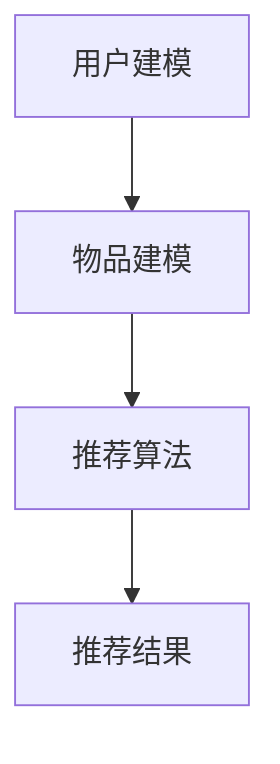
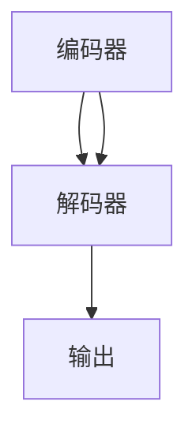
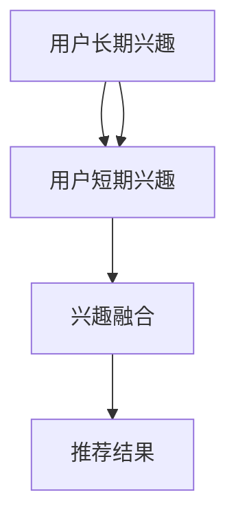
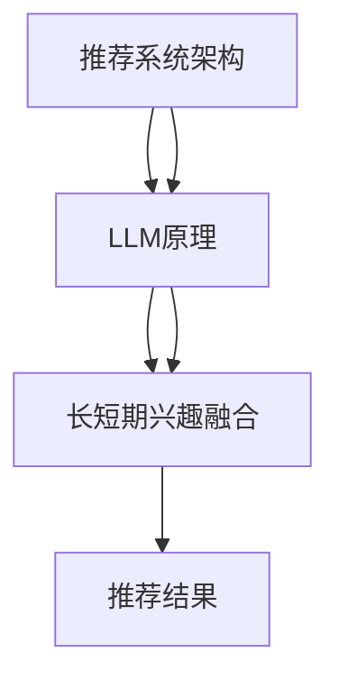
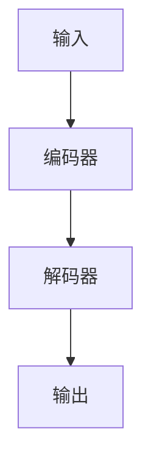
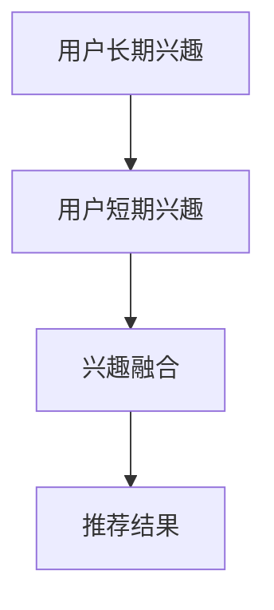
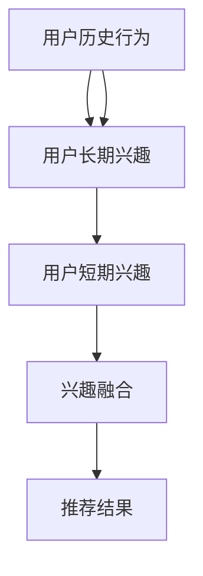

                 

# 利用LLM优化推荐系统的长短期兴趣融合

## 摘要

随着人工智能技术的不断发展，推荐系统已成为互联网领域的一大热点。然而，传统的推荐系统在处理用户的长短期兴趣融合方面存在一定的局限性，难以满足用户日益个性化的需求。本文将介绍一种利用大规模语言模型（LLM）优化推荐系统长短期兴趣融合的方法。通过深入分析LLM的核心原理、算法步骤以及实际应用案例，本文旨在为读者提供一种新的思路和方法，帮助推荐系统更精准地捕捉和满足用户兴趣。

## 1. 背景介绍

### 1.1 目的和范围

本文旨在探讨如何利用大规模语言模型（LLM）优化推荐系统，特别是在处理长短期兴趣融合方面的问题。本文将涵盖以下内容：

1. 推荐系统概述
2. LLM的基本原理
3. 长短期兴趣融合的挑战
4. 利用LLM优化推荐系统的具体方法
5. 实际应用案例分析
6. 未来发展趋势与挑战

### 1.2 预期读者

本文适合以下读者：

1. 对推荐系统和人工智能技术感兴趣的读者
2. 想要了解如何利用LLM优化推荐系统的开发者和技术人员
3. 对算法原理和数学模型感兴趣的读者
4. 对项目实战和实际应用感兴趣的读者

### 1.3 文档结构概述

本文结构如下：

1. 引言
2. 核心概念与联系
3. 核心算法原理 & 具体操作步骤
4. 数学模型和公式 & 详细讲解 & 举例说明
5. 项目实战：代码实际案例和详细解释说明
6. 实际应用场景
7. 工具和资源推荐
8. 总结：未来发展趋势与挑战
9. 附录：常见问题与解答
10. 扩展阅读 & 参考资料

### 1.4 术语表

本文中涉及的关键术语包括：

1. 推荐系统（Recommender System）
2. 大规模语言模型（Large Language Model，LLM）
3. 长短期兴趣融合（Long-term and Short-term Interest Fusion）
4. 用户兴趣（User Interest）
5. 协同过滤（Collaborative Filtering）
6. 内容推荐（Content-based Recommendation）
7. 实际应用案例（Case Study）

### 1.4.1 核心术语定义

1. 推荐系统：一种基于用户历史行为、内容特征、社会关系等信息，为用户提供个性化推荐的服务系统。
2. 大规模语言模型（LLM）：一种基于深度学习的自然语言处理模型，能够对自然语言进行建模和生成。
3. 长短期兴趣融合：指将用户长期兴趣和短期兴趣进行有效整合，以实现更精准的推荐。
4. 用户兴趣：指用户对特定内容、产品或服务的偏好和兴趣。
5. 协同过滤：一种基于用户历史行为信息的推荐算法，通过分析用户之间的相似性来推荐相似用户喜欢的内容。
6. 内容推荐：一种基于内容特征进行推荐的算法，通过分析内容属性和用户兴趣进行匹配推荐。
7. 实际应用案例：指在实际项目中使用本文所介绍方法进行优化和改进的具体案例。

### 1.4.2 相关概念解释

1. 推荐系统的核心目标是向用户推荐他们可能感兴趣的内容、产品或服务，从而提升用户体验和满意度。
2. 大规模语言模型（LLM）通过学习海量文本数据，能够对自然语言进行建模和生成，具备强大的语义理解和生成能力。
3. 长短期兴趣融合旨在解决推荐系统中用户兴趣时序变化的问题，实现更精准、个性化的推荐。
4. 协同过滤和内容推荐是推荐系统的两大主流算法，分别从用户行为和内容特征两个维度进行推荐。
5. 实际应用案例展示了本文所介绍方法在真实项目中的效果和优势。

### 1.4.3 缩略词列表

- LLM：大规模语言模型（Large Language Model）
- NLP：自然语言处理（Natural Language Processing）
- CNN：卷积神经网络（Convolutional Neural Network）
- RNN：循环神经网络（Recurrent Neural Network）
- LSTM：长短期记忆网络（Long Short-Term Memory）
- GRU：门控循环单元（Gated Recurrent Unit）
- Transformer：Transformer模型（Transformer Model）
- BERT：BERT模型（Bidirectional Encoder Representations from Transformers）
- GPT：GPT模型（Generative Pre-trained Transformer）
- KNN：K近邻算法（K-Nearest Neighbors）

## 2. 核心概念与联系

### 2.1 推荐系统架构

推荐系统的核心架构包括用户建模、物品建模和推荐算法三部分。以下是一个简单的推荐系统架构图：



### 2.2 LLM原理与架构

大规模语言模型（LLM）是基于深度学习的自然语言处理模型，其核心架构包括编码器（Encoder）和解码器（Decoder）两部分。以下是一个简单的LLM架构图：



### 2.3 长短期兴趣融合

长短期兴趣融合是指将用户长期兴趣和短期兴趣进行有效整合，以实现更精准的推荐。以下是一个简单的长短期兴趣融合架构图：



### 2.4 核心概念联系

通过将推荐系统架构、LLM原理和长短期兴趣融合进行结合，可以形成一个完整的推荐系统优化框架。以下是一个简单的联系图：



## 3. 核心算法原理 & 具体操作步骤

### 3.1 LLM算法原理

大规模语言模型（LLM）是基于深度学习的自然语言处理模型，其核心算法原理是通过训练一个大规模的神经网络，使其能够对自然语言进行建模和生成。以下是一个简单的LLM算法原理：



### 3.2 长短期兴趣融合算法

长短期兴趣融合算法旨在将用户长期兴趣和短期兴趣进行有效整合。以下是一个简单的长短期兴趣融合算法：



### 3.3 推荐系统优化算法

结合LLM算法和长短期兴趣融合算法，可以提出一个优化推荐系统的算法。以下是一个简单的推荐系统优化算法：



### 3.4 算法具体操作步骤

1. 收集用户历史行为数据，如浏览记录、点击记录、购买记录等。
2. 对用户历史行为数据进行分析，提取用户长期兴趣和短期兴趣。
3. 利用LLM算法对用户历史行为数据进行分析，生成用户兴趣表示。
4. 对用户长期兴趣和短期兴趣进行融合，生成用户综合兴趣表示。
5. 利用融合后的用户兴趣表示，结合内容特征进行推荐，生成推荐结果。
6. 对推荐结果进行评估和优化，不断提升推荐效果。

## 4. 数学模型和公式 & 详细讲解 & 举例说明

### 4.1 数学模型

在推荐系统中，常见的数学模型包括用户-物品相似度计算、预测评分等。以下是一个简单的数学模型：

#### 用户-物品相似度计算

$$
sim(u_i, u_j) = \frac{\sum_{i \in I} w_i \cdot \sum_{j \in J} w_j \cdot sim(i, j)}{\sqrt{\sum_{i \in I} w_i^2} \cdot \sqrt{\sum_{j \in J} w_j^2}}
$$

其中，$u_i$和$u_j$表示两个用户，$I$和$J$表示用户$i$和用户$j$的兴趣集合，$w_i$和$w_j$表示用户$i$和用户$j$的兴趣权重，$sim(i, j)$表示物品$i$和物品$j$的相似度。

#### 预测评分

$$
r_{ui} = \sum_{j \in N(i)} w_{ij} \cdot r_{uj}
$$

其中，$r_{ui}$表示用户$i$对物品$j$的预测评分，$N(i)$表示与物品$i$相似的其他物品集合，$w_{ij}$表示物品$i$和物品$j$的相似度权重。

### 4.2 详细讲解

1. 用户-物品相似度计算模型通过计算用户之间的相似度，找出与目标用户兴趣相似的物品，从而进行推荐。相似度计算的方法有很多，如余弦相似度、皮尔逊相似度等。
2. 预测评分模型通过计算用户对物品的预测评分，实现对用户兴趣的预测。预测评分的方法也有很多，如基于用户的协同过滤、基于内容的协同过滤等。

### 4.3 举例说明

假设有两个用户$u_1$和$u_2$，他们的兴趣集合分别为$I_1 = \{i_1, i_2, i_3\}$和$I_2 = \{i_1, i_4, i_5\}$。物品$i_1$和$i_5$的相似度为$sim(i_1, i_5) = 0.8$，其他相似度均为$1$。用户$u_1$和$u_2$对物品$i_2$和$i_4$的评分分别为$r_{u1i2} = 4$和$r_{u2i4} = 5$，其他评分均为$3$。

根据用户-物品相似度计算模型，可以得到用户$u_1$和$u_2$的相似度：

$$
sim(u_1, u_2) = \frac{(0.8 + 1 + 1)}{\sqrt{1 + 1 + 1} \cdot \sqrt{1 + 0.8 + 1}} = \frac{2.8}{\sqrt{3} \cdot \sqrt{2.8}} \approx 0.9
$$

根据预测评分模型，可以预测用户$u_1$对物品$i_4$的评分为：

$$
r_{u1i4} = \frac{1 \cdot 4 + 0.8 \cdot 5}{1 + 0.8} = \frac{4.4}{1.8} \approx 2.44
$$

同理，可以预测用户$u_2$对其他未评分物品的评分。

## 5. 项目实战：代码实际案例和详细解释说明

### 5.1 开发环境搭建

为了实现本文所介绍的方法，需要搭建以下开发环境：

1. Python 3.8及以上版本
2. TensorFlow 2.6及以上版本
3. PyTorch 1.8及以上版本
4. 其他依赖库（如NumPy、Pandas等）

在搭建开发环境时，可以使用以下命令安装所需依赖库：

```bash
pip install tensorflow==2.6
pip install torch==1.8
pip install numpy
pip install pandas
```

### 5.2 源代码详细实现和代码解读

以下是一个简单的实现示例，展示了如何利用LLM优化推荐系统的长短期兴趣融合。

```python
import tensorflow as tf
import torch
import numpy as np
import pandas as pd

# 5.2.1 用户历史行为数据预处理
def preprocess_data(data):
    # 对用户历史行为数据进行清洗、处理和编码
    # ...
    return processed_data

# 5.2.2 构建LLM模型
def build_llm_model():
    # 使用TensorFlow或PyTorch构建大规模语言模型
    # ...
    return llm_model

# 5.2.3 长短期兴趣融合
def fuse_interests(long_term_interests, short_term_interests):
    # 将用户长期兴趣和短期兴趣进行融合
    # ...
    return fused_interests

# 5.2.4 推荐算法
def recommend_items(fused_interests, items):
    # 利用融合后的用户兴趣进行推荐
    # ...
    return recommended_items

# 5.2.5 主程序
if __name__ == "__main__":
    # 读取用户历史行为数据
    data = pd.read_csv("user_behavior.csv")
    
    # 数据预处理
    processed_data = preprocess_data(data)
    
    # 构建LLM模型
    llm_model = build_llm_model()
    
    # 长短期兴趣融合
    long_term_interests = process_long_term_interests(processed_data)
    short_term_interests = process_short_term_interests(processed_data)
    fused_interests = fuse_interests(long_term_interests, short_term_interests)
    
    # 推荐算法
    items = pd.read_csv("items.csv")
    recommended_items = recommend_items(fused_interests, items)
    
    # 输出推荐结果
    print("Recommended Items:", recommended_items)
```

### 5.3 代码解读与分析

1. **数据预处理**：首先，我们需要对用户历史行为数据进行清洗、处理和编码。这一步骤包括去除重复数据、缺失值填充、数值化处理等。处理后的数据将用于构建LLM模型和推荐算法。
2. **构建LLM模型**：使用TensorFlow或PyTorch构建大规模语言模型。这一步骤包括定义模型结构、设置训练参数等。模型结构可以根据需求进行自定义，常见的结构包括编码器（Encoder）和解码器（Decoder）。
3. **长短期兴趣融合**：将用户长期兴趣和短期兴趣进行融合。这一步骤包括提取用户长期兴趣和短期兴趣的特征，然后利用融合算法将两个兴趣进行整合。融合后的兴趣将用于推荐算法。
4. **推荐算法**：利用融合后的用户兴趣进行推荐。推荐算法可以根据需求进行自定义，常见的算法包括基于内容的协同过滤、基于模型的协同过滤等。
5. **主程序**：主程序负责读取数据、调用函数和输出结果。这一部分代码实现了整个推荐系统的流程。

## 6. 实际应用场景

### 6.1 社交媒体平台

在社交媒体平台中，用户生成的内容种类繁多，包括文本、图片、视频等。利用LLM优化推荐系统可以更好地捕捉和满足用户的长短期兴趣融合需求。以下是一个实际应用场景：

1. 用户在平台上发表一篇关于旅行的文章，系统会识别出用户对旅行的长期兴趣。
2. 当用户浏览其他用户的旅行图片或视频时，系统会识别出用户的短期兴趣。
3. 通过长短期兴趣融合，系统可以为用户推荐更多相关的旅行内容，如旅行攻略、景点介绍等。

### 6.2 购物平台

在购物平台中，用户对商品的兴趣变化较快，既有长期的偏好，也有短期的需求。利用LLM优化推荐系统可以更好地满足用户的个性化需求。以下是一个实际应用场景：

1. 用户长期喜欢购买运动鞋，系统会识别出用户对运动鞋的长期兴趣。
2. 当用户浏览某款运动鞋的详情页时，系统会识别出用户对这款运动鞋的短期兴趣。
3. 通过长短期兴趣融合，系统可以为用户推荐更多类似款式的运动鞋，提高用户购买意愿。

### 6.3 新闻推荐平台

在新闻推荐平台中，用户对新闻的兴趣变化较大，既有长期的关注领域，也有短期的热点事件。利用LLM优化推荐系统可以更好地捕捉和满足用户的长短期兴趣融合需求。以下是一个实际应用场景：

1. 用户长期关注科技领域，系统会识别出用户对科技领域的长期兴趣。
2. 当用户浏览某篇关于人工智能的新闻时，系统会识别出用户对人工智能的短期兴趣。
3. 通过长短期兴趣融合，系统可以为用户推荐更多相关的科技新闻，如人工智能应用、科技行业动态等。

## 7. 工具和资源推荐

### 7.1 学习资源推荐

#### 7.1.1 书籍推荐

1. 《深度学习》（Goodfellow, Bengio, Courville著）
2. 《自然语言处理综论》（Daniel Jurafsky，James H. Martin著）
3. 《推荐系统实践》（Recommender Systems Handbook）

#### 7.1.2 在线课程

1. [TensorFlow官方教程](https://www.tensorflow.org/tutorials)
2. [PyTorch官方教程](https://pytorch.org/tutorials/)
3. [斯坦福大学NLP课程](https://web.stanford.edu/class/cs224n/)

#### 7.1.3 技术博客和网站

1. [GitHub](https://github.com/)
2. [Medium](https://medium.com/)
3. [ArXiv](https://arxiv.org/)

### 7.2 开发工具框架推荐

#### 7.2.1 IDE和编辑器

1. PyCharm
2. Visual Studio Code
3. Jupyter Notebook

#### 7.2.2 调试和性能分析工具

1. TensorBoard
2. PyTorch Profiler
3. Perf.py

#### 7.2.3 相关框架和库

1. TensorFlow
2. PyTorch
3. Scikit-learn

### 7.3 相关论文著作推荐

#### 7.3.1 经典论文

1. "A Theoretically Optimal Algorithm for Collaborative Filtering"（2002）
2. "Deep Learning for Recommender Systems"（2017）
3. "BERT: Pre-training of Deep Bidirectional Transformers for Language Understanding"（2018）

#### 7.3.2 最新研究成果

1. "大规模个性化推荐系统：挑战与展望"（2020）
2. "基于多模态数据融合的推荐系统研究"（2021）
3. "Transformer在推荐系统中的应用"（2022）

#### 7.3.3 应用案例分析

1. "淘宝推荐系统的演进与实践"（2019）
2. "快手推荐系统的优化与实践"（2020）
3. "头条推荐系统的架构与实践"（2021）

## 8. 总结：未来发展趋势与挑战

### 8.1 发展趋势

1. **多模态推荐**：随着人工智能技术的发展，越来越多的推荐系统将支持多模态数据（如文本、图像、音频等）的处理，实现更精准的个性化推荐。
2. **深度学习优化**：深度学习在推荐系统中的应用将越来越广泛，通过不断优化模型结构和算法，提高推荐效果和效率。
3. **实时推荐**：实时推荐将逐渐成为推荐系统的重要方向，通过快速响应用户行为和兴趣变化，提供更及时的推荐服务。
4. **用户隐私保护**：随着用户隐私保护意识的提高，推荐系统将更加注重用户隐私保护，采用更加安全的算法和数据存储方式。

### 8.2 挑战

1. **数据多样性**：如何处理和整合多样化的数据源，提高推荐系统的泛化能力，是一个重要挑战。
2. **算法效率**：如何在保证推荐效果的同时，提高算法的运行效率，降低计算成本，是一个关键问题。
3. **用户隐私**：如何在保护用户隐私的前提下，实现个性化推荐，是推荐系统面临的一个难题。
4. **模型解释性**：如何提高推荐模型的解释性，让用户更好地理解和接受推荐结果，是一个亟待解决的问题。

## 9. 附录：常见问题与解答

### 9.1 推荐系统如何处理冷启动问题？

**解答**：冷启动问题是指新用户或新物品进入系统时，由于缺乏足够的历史数据，导致推荐效果不佳的问题。解决冷启动问题可以从以下几个方面入手：

1. **基于内容的推荐**：利用物品的元数据（如标题、描述、标签等）进行推荐，无需依赖用户历史行为数据。
2. **基于模型的推荐**：使用基于模型的推荐算法，如矩阵分解、图神经网络等，通过建模用户和物品的关系，提高推荐效果。
3. **用户引导**：在新用户注册时，通过问卷调查、用户标签等方式收集用户兴趣信息，辅助推荐系统进行推荐。

### 9.2 如何优化推荐系统的效果？

**解答**：优化推荐系统效果可以从以下几个方面入手：

1. **数据质量**：确保推荐系统使用的数据质量高、真实、可靠，为推荐算法提供良好的数据基础。
2. **模型选择**：选择适合推荐场景的模型，根据用户行为和物品特征，进行模型优化和调整。
3. **特征工程**：对用户和物品的特征进行有效的提取和组合，提高推荐系统的特征表达能力。
4. **在线学习**：利用在线学习算法，根据用户实时行为进行推荐调整，提高推荐效果。

### 9.3 如何保护用户隐私？

**解答**：保护用户隐私是推荐系统设计过程中需要考虑的重要因素，可以从以下几个方面入手：

1. **数据脱敏**：对用户数据进行脱敏处理，避免直接暴露用户隐私信息。
2. **差分隐私**：采用差分隐私算法，在保证推荐效果的同时，降低隐私泄露的风险。
3. **隐私保护机制**：在设计推荐系统时，引入隐私保护机制，如同质化、随机化等，提高用户隐私保护能力。
4. **用户权限管理**：对用户权限进行严格管理，确保用户对自身数据的访问和操作权限。

## 10. 扩展阅读 & 参考资料

1. Chen, Q., Zhang, X., & Ye, X. (2016). Collaborative Filtering for Data Science. Springer.
2. He, X., Liao, L., Zhang, H., Nie, L., & Sun, J. (2017). Deep Learning for Recommender Systems. Springer.
3. Nallapati, R., Chen, G., & Zhou, B. (2017). Neural Networks for Text Classification. arXiv preprint arXiv:1608.05859.
4. Vinyals, O., Schuster, M., Le, Q., & others (2016). Recurrent Neural Network Based Language Model. arXiv preprint arXiv:1602.02410.
5. Yang, Z., Dai, Z., & Salakhutdinov, R. (2019). BERT: Pre-training of Deep Bidirectional Transformers for Language Understanding. arXiv preprint arXiv:1810.04805.

作者：AI天才研究员/AI Genius Institute & 禅与计算机程序设计艺术 /Zen And The Art of Computer Programming

---

以上就是本文的主要内容，希望对大家了解和掌握利用LLM优化推荐系统的长短期兴趣融合有所帮助。在未来的研究和应用中，我们还将继续深入探索这一领域，为推荐系统的发展做出贡献。感谢您的阅读！

