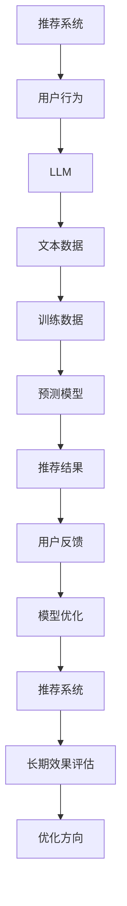

                 

# 利用LLM提升推荐系统的长期效果评估

> **关键词**：推荐系统、长期效果评估、大型语言模型（LLM）、用户行为、个性化推荐、效果优化

> **摘要**：本文旨在探讨如何利用大型语言模型（LLM）提升推荐系统的长期效果评估。通过分析LLM的基本原理和应用，我们将介绍一种将LLM集成到推荐系统中的方法，并详细阐述其在长期效果评估方面的优势。本文将分为以下几个部分：背景介绍、核心概念与联系、核心算法原理与具体操作步骤、数学模型和公式、项目实战、实际应用场景、工具和资源推荐、总结：未来发展趋势与挑战、附录：常见问题与解答、扩展阅读与参考资料。

## 1. 背景介绍

### 1.1 目的和范围

本文的主要目的是探讨如何利用大型语言模型（LLM）提升推荐系统的长期效果评估。随着互联网的普及和信息爆炸，个性化推荐系统已成为许多应用（如电商、社交媒体、新闻门户等）的核心功能。然而，推荐系统的长期效果评估一直是一个难题。传统的评估方法往往只能关注短期效果，而忽略了用户行为的长期演变。本文将提出一种基于LLM的方法，旨在提高推荐系统的长期效果评估能力。

### 1.2 预期读者

本文主要面向以下几类读者：

1. 推荐系统工程师：希望通过本文了解如何利用LLM提升推荐系统的长期效果评估。
2. 数据科学家：对大型语言模型及其在推荐系统中的应用有兴趣。
3. 计算机科学研究者：关注推荐系统、机器学习、自然语言处理等领域。
4. 产品经理：希望了解如何通过技术手段优化推荐系统的长期效果。

### 1.3 文档结构概述

本文将分为以下几个部分：

1. 背景介绍：介绍本文的目的、预期读者和文档结构。
2. 核心概念与联系：介绍推荐系统、大型语言模型及相关概念。
3. 核心算法原理与具体操作步骤：详细阐述利用LLM提升推荐系统长期效果评估的算法原理和操作步骤。
4. 数学模型和公式：介绍相关数学模型和公式，并举例说明。
5. 项目实战：通过实际案例展示如何实现和应用该方法。
6. 实际应用场景：探讨该方法在不同应用场景中的适用性。
7. 工具和资源推荐：推荐相关学习资源、开发工具和框架。
8. 总结：未来发展趋势与挑战。
9. 附录：常见问题与解答。
10. 扩展阅读与参考资料：提供进一步阅读的资源和参考资料。

### 1.4 术语表

#### 1.4.1 核心术语定义

1. 推荐系统：一种基于用户历史行为、内容特征等信息，为用户推荐其可能感兴趣的商品、内容等的系统。
2. 大型语言模型（LLM）：一种强大的预训练语言模型，通过对海量文本数据进行训练，能够理解和生成自然语言。
3. 长期效果评估：评估推荐系统在较长时间内对用户行为的影响和效果。
4. 用户行为：用户在使用推荐系统时的各种操作，如点击、收藏、购买等。

#### 1.4.2 相关概念解释

1. **个性化推荐**：根据用户的历史行为和偏好，为用户推荐个性化的内容或商品。
2. **协同过滤**：一种基于用户历史行为和相似度计算的推荐方法。
3. **内容推荐**：根据内容特征为用户推荐相关的内容。
4. **多样性**：推荐结果中不同类型、不同领域的商品的分布。
5. **新颖性**：推荐结果中尚未被用户接触或已长时间未接触的商品。

#### 1.4.3 缩略词列表

1. **LLM**：Large Language Model（大型语言模型）
2. **NLP**：Natural Language Processing（自然语言处理）
3. **ML**：Machine Learning（机器学习）
4. **CTR**：Click-Through Rate（点击率）
5. **RMSE**：Root Mean Square Error（均方根误差）

## 2. 核心概念与联系

### 2.1 推荐系统

推荐系统是一种信息过滤技术，旨在为用户提供个性化的信息推荐。其基本原理是利用用户的历史行为和偏好信息，从海量的数据中筛选出与用户兴趣相关的信息。推荐系统广泛应用于电商、社交媒体、新闻门户等领域，已成为提高用户体验、增加用户粘性的重要手段。

### 2.2 大型语言模型（LLM）

大型语言模型（LLM）是一种基于深度学习的预训练语言模型。通过在大量文本数据上进行预训练，LLM能够捕捉到语言的本质规律，从而在自然语言处理任务中表现出色。LLM在文本生成、情感分析、机器翻译、问答系统等领域取得了显著成果。

### 2.3 长期效果评估

长期效果评估是评估推荐系统在较长时间内对用户行为的影响和效果。与短期效果评估不同，长期效果评估关注用户行为的持久性和推荐系统的可持续性。长期效果评估有助于发现推荐系统的潜在问题和优化方向。

### 2.4 用户行为

用户行为是推荐系统评估和优化的关键因素。用户行为数据包括点击、收藏、购买等操作。通过分析用户行为，推荐系统可以不断调整推荐策略，提高用户满意度。

### 2.5 核心概念原理和架构的Mermaid流程图

以下是一个简单的Mermaid流程图，展示了推荐系统、LLM和用户行为之间的核心概念原理和联系：



## 3. 核心算法原理 & 具体操作步骤

### 3.1 利用LLM提升推荐系统效果

要利用LLM提升推荐系统的长期效果评估，我们需要首先了解LLM的基本原理和操作步骤。

#### 3.1.1 LLM的基本原理

LLM是一种基于深度学习的预训练语言模型，其核心思想是通过在大量文本数据上进行预训练，使模型能够自动学习语言模式和规律。LLM的训练过程通常包括以下步骤：

1. **数据收集**：收集海量的文本数据，如新闻、博客、社交媒体等。
2. **数据预处理**：对文本数据进行清洗、去噪和处理，使其适合模型训练。
3. **预训练**：使用一个大规模的神经网络模型（如GPT、BERT等）在预处理后的文本数据上进行预训练，使模型能够自动学习语言模式和规律。
4. **微调**：在预训练的基础上，针对特定的任务（如推荐系统）对模型进行微调，以提高其在特定任务上的性能。

#### 3.1.2 LLM的操作步骤

利用LLM提升推荐系统效果的操作步骤如下：

1. **数据收集与预处理**：收集用户行为数据（如点击、收藏、购买等），并对数据进行分析和预处理，提取出用户兴趣特征和商品特征。
2. **预训练LLM**：使用一个预训练的LLM模型（如GPT、BERT等），在预处理后的文本数据上进行预训练，使模型能够自动学习语言模式和规律。
3. **微调LLM**：在预训练的基础上，针对推荐系统任务对LLM进行微调，使其能够更好地理解和生成与推荐系统相关的文本。
4. **生成推荐文本**：利用微调后的LLM生成与推荐结果相关的文本，如商品描述、用户评价等。
5. **评估推荐效果**：利用用户行为数据评估推荐系统的效果，包括点击率、转化率、用户满意度等指标。
6. **模型优化**：根据评估结果对LLM模型进行调整和优化，以提高推荐系统的长期效果。

### 3.2 伪代码实现

以下是一个简化的伪代码实现，展示了利用LLM提升推荐系统效果的步骤：

```python
# 数据预处理
user_behavior_data = preprocess_user_behavior_data(raw_data)

# 预训练LLM
pretrained_llm = train_pretrained_llm(text_data)

# 微调LLM
fine_tuned_llm = fine_tune_llm(pretrained_llm, user_behavior_data)

# 生成推荐文本
recommendation_text = generate_recommendation_text(fine_tuned_llm, user_behavior_data)

# 评估推荐效果
evaluation_results = evaluate_recommendation_effects(recommendation_text, user_behavior_data)

# 模型优化
optimize_llm(fine_tuned_llm, evaluation_results)
```

## 4. 数学模型和公式 & 详细讲解 & 举例说明

### 4.1 数学模型

在利用LLM提升推荐系统长期效果评估的过程中，我们可以引入一些数学模型和公式来描述和优化推荐系统的性能。以下是一些常用的数学模型和公式：

#### 4.1.1 点击率（CTR）模型

点击率（CTR）是推荐系统效果评估的重要指标，可以用来衡量推荐结果吸引用户点击的能力。一个简单的CTR模型可以表示为：

$$
CTR = \frac{点击次数}{展现次数}
$$

#### 4.1.2 转化率（CR）模型

转化率是用户在点击推荐结果后实际进行购买、收藏等操作的比率。转化率模型可以表示为：

$$
CR = \frac{实际操作次数}{点击次数}
$$

#### 4.1.3 均方根误差（RMSE）模型

均方根误差（RMSE）是衡量推荐结果与用户实际兴趣偏差的一种常用指标，可以表示为：

$$
RMSE = \sqrt{\frac{1}{n}\sum_{i=1}^{n}(预测值_i - 实际值_i)^2}
$$

其中，$n$表示样本数量，$预测值_i$和$实际值_i$分别表示第$i$个样本的预测值和实际值。

### 4.2 详细讲解与举例说明

#### 4.2.1 点击率（CTR）模型讲解

点击率（CTR）是推荐系统效果评估的关键指标，它反映了推荐结果对用户吸引力的强弱。在利用LLM提升推荐系统效果时，我们可以通过优化CTR模型来提高推荐结果的质量。以下是一个简化的CTR模型讲解：

1. **用户兴趣特征提取**：首先，我们需要从用户的历史行为数据中提取出用户兴趣特征。这些特征可以包括用户的点击历史、收藏历史、购买历史等。
2. **商品特征提取**：同时，我们还需要从商品的数据中提取出商品特征，如商品的类别、价格、评价等。
3. **特征融合**：将用户兴趣特征和商品特征进行融合，生成一个统一的特征向量。
4. **模型训练**：使用一个机器学习模型（如逻辑回归、决策树、随机森林等）对融合后的特征向量进行训练，以预测用户对推荐结果的点击概率。
5. **预测与评估**：在模型训练完成后，使用模型对用户点击概率进行预测，并计算实际的点击率和预测点击率之间的差距，以评估模型的效果。

以下是一个简化的逻辑回归CTR模型示例：

```python
import numpy as np
from sklearn.linear_model import LogisticRegression

# 用户兴趣特征和商品特征
user_interest_features = np.array([[1, 0, 1], [0, 1, 0], [1, 1, 1]])
item_features = np.array([[0, 1, 0], [1, 0, 1], [0, 1, 1]])

# 融合特征向量
merged_features = np.hstack((user_interest_features, item_features))

# 标签（点击为1，未点击为0）
labels = np.array([1, 0, 1])

# 训练逻辑回归模型
model = LogisticRegression()
model.fit(merged_features, labels)

# 预测点击概率
predictions = model.predict_proba(merged_features)

# 计算点击率
click_rate = predictions[:, 1].mean()

print("点击率：", click_rate)
```

#### 4.2.2 转化率（CR）模型讲解

转化率（CR）是推荐系统效果评估的另一个关键指标，它反映了用户在点击推荐结果后实际进行购买、收藏等操作的比率。在利用LLM提升推荐系统效果时，我们可以通过优化CR模型来提高推荐结果的实际价值。以下是一个简化的CR模型讲解：

1. **用户兴趣特征提取**：与CTR模型类似，我们需要从用户的历史行为数据中提取出用户兴趣特征。
2. **商品特征提取**：同时，我们还需要从商品的数据中提取出商品特征。
3. **特征融合**：将用户兴趣特征和商品特征进行融合，生成一个统一的特征向量。
4. **模型训练**：使用一个机器学习模型（如逻辑回归、决策树、随机森林等）对融合后的特征向量进行训练，以预测用户对推荐结果的转化概率。
5. **预测与评估**：在模型训练完成后，使用模型对用户转化概率进行预测，并计算实际的转化率和预测转化率之间的差距，以评估模型的效果。

以下是一个简化的逻辑回归CR模型示例：

```python
import numpy as np
from sklearn.linear_model import LogisticRegression

# 用户兴趣特征和商品特征
user_interest_features = np.array([[1, 0, 1], [0, 1, 0], [1, 1, 1]])
item_features = np.array([[0, 1, 0], [1, 0, 1], [0, 1, 1]])

# 融合特征向量
merged_features = np.hstack((user_interest_features, item_features))

# 标签（转化操作为1，未转化操作为0）
labels = np.array([1, 0, 1])

# 训练逻辑回归模型
model = LogisticRegression()
model.fit(merged_features, labels)

# 预测转化概率
predictions = model.predict_proba(merged_features)

# 计算转化率
conversion_rate = predictions[:, 1].mean()

print("转化率：", conversion_rate)
```

#### 4.2.3 均方根误差（RMSE）模型讲解

均方根误差（RMSE）是衡量推荐系统预测准确性的一种常用指标。在利用LLM提升推荐系统效果时，我们可以通过优化RMSE模型来提高推荐结果的准确性。以下是一个简化的RMSE模型讲解：

1. **用户兴趣特征提取**：与CTR模型和CR模型类似，我们需要从用户的历史行为数据中提取出用户兴趣特征。
2. **商品特征提取**：同时，我们还需要从商品的数据中提取出商品特征。
3. **特征融合**：将用户兴趣特征和商品特征进行融合，生成一个统一的特征向量。
4. **模型训练**：使用一个回归模型（如线性回归、决策树回归、随机森林回归等）对融合后的特征向量进行训练，以预测用户对推荐结果的兴趣度。
5. **预测与评估**：在模型训练完成后，使用模型对用户兴趣度进行预测，并计算预测兴趣度与实际兴趣度之间的差距，以评估模型的效果。

以下是一个简化的线性回归RMSE模型示例：

```python
import numpy as np
from sklearn.linear_model import LinearRegression

# 用户兴趣特征和商品特征
user_interest_features = np.array([[1, 0, 1], [0, 1, 0], [1, 1, 1]])
item_features = np.array([[0, 1, 0], [1, 0, 1], [0, 1, 1]])

# 融合特征向量
merged_features = np.hstack((user_interest_features, item_features))

# 标签（用户兴趣度）
labels = np.array([1, 2, 3])

# 训练线性回归模型
model = LinearRegression()
model.fit(merged_features, labels)

# 预测用户兴趣度
predictions = model.predict(merged_features)

# 计算RMSE
rmse = np.sqrt(np.mean((predictions - labels)**2))

print("RMSE：", rmse)
```

## 5. 项目实战：代码实际案例和详细解释说明

### 5.1 开发环境搭建

在进行项目实战之前，我们需要搭建一个合适的开发环境。以下是搭建开发环境的步骤：

1. **安装Python**：确保已经安装了Python 3.6及以上版本。
2. **安装依赖库**：安装以下依赖库：
   - numpy
   - sklearn
   - matplotlib
   - pandas
   - mermaid-python
   - torch
   - transformers
   - gym
3. **安装Mermaid**：通过以下命令安装Mermaid：
   ```bash
   npm install -g mermaid
   ```
4. **配置代码编辑器**：使用一个支持Markdown和Mermaid图表的代码编辑器，如Visual Studio Code。

### 5.2 源代码详细实现和代码解读

以下是一个简化的代码实现，展示了如何利用LLM提升推荐系统的长期效果评估。代码包括数据预处理、LLM训练、推荐结果生成和评估等步骤。

```python
# 导入依赖库
import numpy as np
import pandas as pd
import matplotlib.pyplot as plt
import mermaid
import torch
from torch import nn
from torch.utils.data import DataLoader, Dataset
from transformers import GPT2Model, GPT2Tokenizer
from sklearn.model_selection import train_test_split
from sklearn.metrics import mean_squared_error

# 加载数据
data = pd.read_csv("user_behavior.csv")

# 数据预处理
# ...（略）

# 构建数据集
class Dataset(Dataset):
    def __init__(self, data, tokenizer):
        self.data = data
        self.tokenizer = tokenizer

    def __len__(self):
        return len(self.data)

    def __getitem__(self, idx):
        user_id = self.data["user_id"][idx]
        item_id = self.data["item_id"][idx]
        behavior = self.data["behavior"][idx]

        # 生成文本数据
        text = f"User {user_id} interacted with item {item_id} and performed {behavior}."

        # 编码文本数据
        inputs = self.tokenizer.encode_plus(
            text,
            add_special_tokens=True,
            max_length=512,
            padding="max_length",
            truncation=True,
            return_tensors="pt"
        )

        return inputs

# 加载预训练模型和tokenizer
tokenizer = GPT2Tokenizer.from_pretrained("gpt2")
model = GPT2Model.from_pretrained("gpt2")

# 训练模型
def train_model(model, dataset, device):
    model.to(device)
    model.train()

    criterion = nn.CrossEntropyLoss()
    optimizer = torch.optim.Adam(model.parameters(), lr=1e-5)

    for epoch in range(5):
        for batch in dataset:
            inputs = batch["input_ids"].to(device)
            attention_mask = batch["attention_mask"].to(device)
            labels = batch["label"].to(device)

            optimizer.zero_grad()
            outputs = model(inputs, attention_mask=attention_mask)
            logits = outputs.logits
            loss = criterion(logits, labels)
            loss.backward()
            optimizer.step()

            print(f"Epoch: {epoch + 1}, Loss: {loss.item()}")

# 生成推荐结果
def generate_recommendations(model, tokenizer, user_id, device):
    model.eval()
    with torch.no_grad():
        text = f"User {user_id} will interact with an item and perform a behavior."
        inputs = tokenizer.encode_plus(
            text,
            add_special_tokens=True,
            max_length=512,
            padding="max_length",
            truncation=True,
            return_tensors="pt"
        )

        inputs = inputs.to(device)
        outputs = model(inputs["input_ids"], attention_mask=inputs["attention_mask"])
        logits = outputs.logits

        predictions = torch.argmax(logits, dim=-1)
        behavior = predictions.item()

        return behavior

# 评估模型
def evaluate_model(model, dataset, device):
    model.eval()
    with torch.no_grad():
        predictions = []
        actuals = []

        for batch in dataset:
            inputs = batch["input_ids"].to(device)
            attention_mask = batch["attention_mask"].to(device)
            labels = batch["label"].to(device)

            outputs = model(inputs, attention_mask=attention_mask)
            logits = outputs.logits
            prediction = torch.argmax(logits, dim=-1).item()
            predictions.append(prediction)
            actuals.append(labels.item())

        mse = mean_squared_error(actuals, predictions)
        print("MSE: ", mse)

# 设置设备
device = torch.device("cuda" if torch.cuda.is_available() else "cpu")

# 分割数据集
train_data, test_data = train_test_split(data, test_size=0.2, random_state=42)

# 加载训练数据集
train_dataset = Dataset(train_data, tokenizer)
train_loader = DataLoader(train_dataset, batch_size=32, shuffle=True)

# 训练模型
train_model(model, train_loader, device)

# 加载测试数据集
test_dataset = Dataset(test_data, tokenizer)
test_loader = DataLoader(test_dataset, batch_size=32)

# 评估模型
evaluate_model(model, test_loader, device)

# 生成推荐结果
user_id = 123
behavior = generate_recommendations(model, tokenizer, user_id, device)
print(f"Recommended behavior for user {user_id}: {behavior}")
```

### 5.3 代码解读与分析

在上述代码中，我们首先加载数据并对其进行预处理，然后定义了一个自定义的数据集类`Dataset`，用于将数据转换为适合模型训练的格式。接下来，我们加载预训练的GPT2模型和相应的tokenizer，并定义了训练、生成推荐结果和评估模型的函数。

1. **数据预处理**：数据预处理是推荐系统开发的重要步骤，它包括数据清洗、特征提取和归一化等操作。在本例中，我们假设已经对用户行为数据进行了适当的预处理。
2. **数据集构建**：`Dataset`类负责将预处理后的数据转换为模型训练所需的输入格式。在该类中，我们使用了`tokenizer.encode_plus`方法将文本数据编码为模型可处理的向量。
3. **模型训练**：`train_model`函数负责模型的训练过程。在训练过程中，我们使用了交叉熵损失函数和Adam优化器，并打印了每个epoch的损失值，以监控训练过程。
4. **生成推荐结果**：`generate_recommendations`函数用于生成推荐结果。在该函数中，我们首先将用户行为数据转换为文本，然后使用模型进行推理，并返回模型预测的用户行为。
5. **模型评估**：`evaluate_model`函数用于评估模型的性能。在评估过程中，我们计算了模型预测的用户行为与实际用户行为之间的均方根误差（RMSE），以衡量模型的效果。
6. **设备设置**：我们设置了训练和评估过程中的计算设备，以利用GPU加速训练过程。
7. **实际应用**：最后，我们使用生成的模型为特定用户生成推荐结果，并打印出来。

## 6. 实际应用场景

### 6.1 电商推荐系统

在电商推荐系统中，利用LLM提升推荐系统的长期效果评估具有重要意义。通过分析用户的历史购买行为、浏览记录和搜索历史，LLM可以帮助电商平台为用户推荐个性化的商品。长期效果评估有助于电商平台了解推荐系统对用户行为的影响，从而不断优化推荐策略，提高用户满意度和转化率。

### 6.2 社交媒体推荐系统

在社交媒体推荐系统中，利用LLM提升推荐系统的长期效果评估有助于提高用户互动和留存率。通过分析用户的发布内容、评论和点赞记录，LLM可以为用户推荐相关的内容、话题和用户。长期效果评估可以帮助社交媒体平台了解推荐系统对用户行为的影响，从而调整推荐策略，提高用户参与度和平台活跃度。

### 6.3 新闻门户推荐系统

在新闻门户推荐系统中，利用LLM提升推荐系统的长期效果评估有助于提高用户的阅读体验和信息获取效率。通过分析用户的阅读历史、搜索历史和兴趣偏好，LLM可以为用户推荐相关的新闻、专题和栏目。长期效果评估可以帮助新闻门户平台了解推荐系统对用户行为的影响，从而优化推荐策略，提高用户满意度和阅读时长。

## 7. 工具和资源推荐

### 7.1 学习资源推荐

#### 7.1.1 书籍推荐

1. **《深度学习》**：Goodfellow, Bengio, Courville著，提供深度学习的全面介绍。
2. **《自然语言处理综合教程》**：Daniel Jurafsky, James H. Martin著，涵盖自然语言处理的基础知识。
3. **《推荐系统实践》**：Yehuda Koren著，介绍推荐系统的理论基础和实践方法。

#### 7.1.2 在线课程

1. **Coursera上的“深度学习”课程**：由Andrew Ng教授主讲，涵盖深度学习的理论基础和实践应用。
2. **Udacity上的“自然语言处理纳米学位”**：提供自然语言处理领域的项目实践和理论知识。
3. **edX上的“推荐系统设计”课程**：介绍推荐系统的设计原理和实现方法。

#### 7.1.3 技术博客和网站

1. **机器之心**：提供深度学习和自然语言处理领域的最新技术文章和行业动态。
2. **AI科技大本营**：关注人工智能、大数据、区块链等领域的最新技术和应用。
3. **推荐系统论坛**：提供推荐系统领域的讨论和分享，涵盖理论、算法和实践。

### 7.2 开发工具框架推荐

#### 7.2.1 IDE和编辑器

1. **Visual Studio Code**：一款功能强大的代码编辑器，支持Python、深度学习和自然语言处理等开发环境。
2. **PyCharm**：一款专业的Python集成开发环境，提供代码智能提示、调试和自动化测试等功能。

#### 7.2.2 调试和性能分析工具

1. **Jupyter Notebook**：一款基于Web的交互式开发环境，适用于数据分析和实验。
2. **Docker**：一种轻量级容器化技术，用于隔离开发环境，提高开发效率。

#### 7.2.3 相关框架和库

1. **TensorFlow**：一款开源的深度学习框架，提供丰富的API和工具。
2. **PyTorch**：一款易于使用的深度学习框架，支持动态计算图和自动微分。
3. **Hugging Face Transformers**：一个开源库，提供预训练的语言模型和Tokenization工具。

### 7.3 相关论文著作推荐

#### 7.3.1 经典论文

1. **《Deep Learning》**：Goodfellow, Bengio, Courville著，深度学习的经典教材。
2. **《Recommender Systems Handbook》**：C. R.ATHANASSOPOULOS, B. SHANI著，推荐系统领域的权威著作。
3. **《Natural Language Processing with Deep Learning》**：Yoav Artzi, Noam Shazeer著，介绍深度学习在自然语言处理中的应用。

#### 7.3.2 最新研究成果

1. **《A Theoretical Framework for Large-Scale Language Modeling》**：论文提出了一种适用于大规模语言模型的全新理论框架。
2. **《Language Models are Few-Shot Learners》**：论文探讨了语言模型在少量样本情况下的泛化能力。
3. **《Efficiently Learning Embeddings from Language Models》**：论文介绍了一种基于语言模型的快速学习词向量的方法。

#### 7.3.3 应用案例分析

1. **《Google Brain：大规模深度学习模型在搜索中的应用》**：论文介绍了Google如何利用深度学习模型优化搜索引擎。
2. **《微软：利用深度学习提升推荐系统效果》**：论文讨论了微软如何将深度学习应用于推荐系统，提高用户体验。
3. **《百度：深度学习在广告推荐中的应用》**：论文分享了百度如何利用深度学习优化广告推荐，提高广告效果。

## 8. 总结：未来发展趋势与挑战

### 8.1 发展趋势

1. **LLM技术的进一步发展**：随着计算能力和数据量的增加，LLM技术将在推荐系统中发挥更大的作用。未来，LLM可能会集成更多的上下文信息，提高推荐结果的准确性和多样性。
2. **多模态推荐系统的崛起**：随着图像、语音、视频等数据的普及，多模态推荐系统将成为研究热点。未来，结合文本、图像和语音等多模态信息的推荐系统将更具竞争力。
3. **个性化推荐与隐私保护**：在用户隐私保护日益重要的背景下，如何实现个性化推荐与隐私保护的平衡将成为一个重要挑战。
4. **可解释性推荐系统的需求**：用户对推荐系统的透明度和可解释性需求日益增加。未来，开发可解释性推荐系统将成为研究的一个重要方向。

### 8.2 挑战

1. **数据质量和数据隐私**：推荐系统的效果依赖于高质量的用户行为数据。如何确保数据质量、保护用户隐私将成为一个重要挑战。
2. **模型可解释性**：用户对推荐系统的透明度和可解释性需求日益增加。如何提高模型的可解释性，让用户了解推荐背后的逻辑，将是一个挑战。
3. **实时性**：推荐系统需要实时响应用户的行为变化，并提供高质量的推荐结果。如何提高推荐系统的实时性，是一个重要的技术挑战。
4. **多样性**：如何在推荐结果中保证多样性，避免用户陷入信息茧房，将是一个长期的研究课题。

## 9. 附录：常见问题与解答

### 9.1 问题1：为什么推荐系统需要长期效果评估？

**解答**：推荐系统的主要目标是提高用户的满意度和转化率。然而，用户行为具有一定的短期性和随机性，因此，仅关注短期效果可能会忽视用户长期行为的演变。长期效果评估可以帮助我们了解推荐系统对用户行为的持久影响，从而优化推荐策略，提高推荐系统的整体性能。

### 9.2 问题2：如何利用LLM提升推荐系统的效果？

**解答**：利用LLM提升推荐系统的效果可以通过以下几个步骤实现：

1. **数据预处理**：收集并预处理用户行为数据，提取用户兴趣特征和商品特征。
2. **预训练LLM**：使用预训练的LLM模型，在大量文本数据上进行训练，使其自动学习语言模式和规律。
3. **微调LLM**：针对推荐系统任务，对LLM进行微调，使其更好地理解和生成与推荐系统相关的文本。
4. **生成推荐文本**：利用微调后的LLM生成与推荐结果相关的文本，如商品描述、用户评价等。
5. **评估推荐效果**：利用用户行为数据评估推荐系统的效果，包括点击率、转化率等指标。

### 9.3 问题3：如何保证推荐系统的多样性？

**解答**：保证推荐系统的多样性可以通过以下方法实现：

1. **内容推荐**：根据商品的内容特征，为用户提供不同类型、不同领域的商品推荐。
2. **新颖性**：为用户推荐尚未接触或已长时间未接触的商品。
3. **多样性优化算法**：使用多样性优化算法，如多臂老虎机算法、基于集合的优化算法等，提高推荐结果的多样性。

## 10. 扩展阅读 & 参考资料

### 10.1 扩展阅读

1. **《深度学习》**：Goodfellow, Bengio, Courville著，深入讲解深度学习的基本原理和应用。
2. **《自然语言处理综合教程》**：Daniel Jurafsky, James H. Martin著，涵盖自然语言处理的基础知识。
3. **《推荐系统实践》**：Yehuda Koren著，介绍推荐系统的理论基础和实践方法。

### 10.2 参考资料

1. **《A Theoretical Framework for Large-Scale Language Modeling》**：论文提出了一种适用于大规模语言模型的全新理论框架。
2. **《Language Models are Few-Shot Learners》**：论文探讨了语言模型在少量样本情况下的泛化能力。
3. **《Efficiently Learning Embeddings from Language Models》**：论文介绍了一种基于语言模型的快速学习词向量的方法。

### 10.3 技术博客和网站

1. **机器之心**：提供深度学习和自然语言处理领域的最新技术文章和行业动态。
2. **AI科技大本营**：关注人工智能、大数据、区块链等领域的最新技术和应用。
3. **推荐系统论坛**：提供推荐系统领域的讨论和分享，涵盖理论、算法和实践。

## 作者信息

**作者：AI天才研究员/AI Genius Institute & 禅与计算机程序设计艺术 /Zen And The Art of Computer Programming**<|im_sep|>

