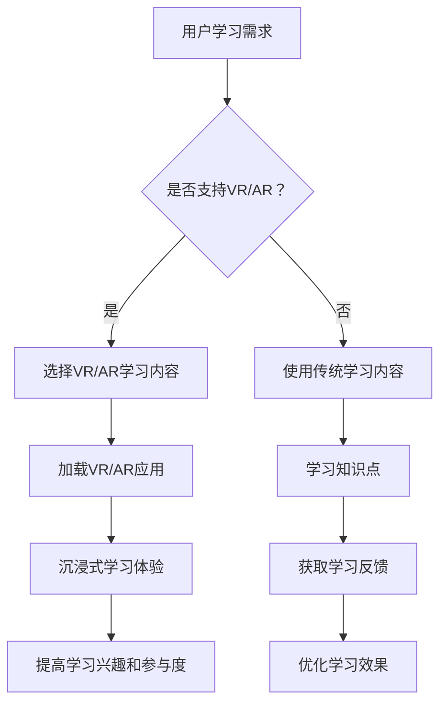

                 

# 利用VR/AR技术增强知识付费体验

> 关键词：虚拟现实，增强现实，知识付费，用户体验，技术融合

> 摘要：本文将探讨如何通过融合虚拟现实（VR）和增强现实（AR）技术来提升知识付费体验。我们将分析VR/AR技术的核心原理，探讨其在教育领域的应用，并提供实际案例和开发环境搭建的指导。此外，还将推荐相关工具和资源，展望未来发展趋势与挑战。

## 1. 背景介绍

### 1.1 目的和范围

本文旨在探索虚拟现实（VR）和增强现实（AR）技术在知识付费领域的潜在应用，并探讨如何通过这些技术手段提升用户的学习体验。我们将重点关注以下内容：

- VR/AR技术的基本概念和原理
- 教育领域中的VR/AR技术应用案例
- 知识付费平台如何利用VR/AR技术增强用户体验
- 开发VR/AR知识付费应用的实际步骤
- 相关工具和资源的推荐

### 1.2 预期读者

本文适合以下读者群体：

- 对VR/AR技术感兴趣的技术爱好者
- 想要在知识付费领域应用VR/AR技术的开发者
- 教育领域的专业人士和研究者
- 对技术创新和应用有热情的企业家

### 1.3 文档结构概述

本文结构如下：

- **第1章**：背景介绍
  - 目的和范围
  - 预期读者
  - 文档结构概述
  - 术语表

- **第2章**：核心概念与联系
  - VR/AR技术的基本概念
  - 教育领域的应用
  - 知识付费平台与VR/AR技术的结合

- **第3章**：核心算法原理 & 具体操作步骤
  - VR/AR技术的基本算法原理
  - 开发VR/AR知识付费应用的操作步骤

- **第4章**：数学模型和公式 & 详细讲解 & 举例说明
  - VR/AR技术相关的数学模型和公式
  - 举例说明如何应用这些模型和公式

- **第5章**：项目实战：代码实际案例和详细解释说明
  - 开发环境搭建
  - 源代码实现和解读
  - 代码分析和优化

- **第6章**：实际应用场景
  - VR/AR技术在教育中的应用场景
  - 知识付费平台的应用案例

- **第7章**：工具和资源推荐
  - 学习资源推荐
  - 开发工具框架推荐
  - 相关论文著作推荐

- **第8章**：总结：未来发展趋势与挑战
  - VR/AR技术在知识付费领域的未来趋势
  - 面临的挑战和解决方案

- **第9章**：附录：常见问题与解答
  - 常见问题的解答
  - 技术细节的补充说明

- **第10章**：扩展阅读 & 参考资料
  - 推荐阅读资料
  - 引用和参考文献

### 1.4 术语表

#### 1.4.1 核心术语定义

- **虚拟现实（VR）**：一种通过计算机技术生成模拟环境的沉浸式体验，用户在虚拟环境中可以互动和探索。
- **增强现实（AR）**：将数字信息叠加到现实世界中的技术，用户通过移动设备或特殊眼镜可以看到虚拟物体与真实世界的交互。
- **知识付费**：用户通过支付一定费用获取专业知识和技能的服务模式。
- **用户体验**：用户在使用产品或服务时的感受和体验。

#### 1.4.2 相关概念解释

- **沉浸感**：用户在虚拟或增强现实环境中感受到的强烈真实感。
- **交互性**：用户在虚拟或增强现实环境中与虚拟物体或数字信息的互动能力。
- **跟踪技术**：用于确定虚拟或增强现实环境中用户位置和方向的技术。

#### 1.4.3 缩略词列表

- **VR**：Virtual Reality，虚拟现实
- **AR**：Augmented Reality，增强现实
- **UI**：User Interface，用户界面
- **UX**：User Experience，用户体验

## 2. 核心概念与联系

在探讨如何利用VR/AR技术增强知识付费体验之前，我们需要理解这些核心概念及其相互关系。

### 2.1 VR/AR技术的基本概念

#### 虚拟现实（VR）

虚拟现实是通过计算机技术模拟生成的三维环境，用户可以通过头戴式显示器（HMD）等设备沉浸其中。VR的主要特点包括：

- **沉浸感**：用户完全沉浸在虚拟环境中，感觉如同真实世界。
- **交互性**：用户可以通过手持设备或其他交互设备与虚拟环境中的对象进行互动。
- **自主性**：用户可以自由移动，探索虚拟环境。

#### 增强现实（AR）

增强现实是通过数字技术将虚拟信息叠加到现实世界中的技术。用户通常通过智能手机或AR眼镜等设备看到增强后的现实。AR的主要特点包括：

- **叠加性**：虚拟信息与现实世界的信息叠加，形成新的视觉体验。
- **交互性**：用户可以通过触摸或语音与虚拟信息进行交互。
- **适应性**：虚拟信息可以根据用户的位置、移动和其他环境因素进行自适应调整。

### 2.2 教育领域的应用

VR和AR在教育领域的应用越来越广泛，以下是一些主要的应用场景：

- **虚拟课堂**：学生可以在虚拟教室中与老师和其他同学互动，感受真实的课堂氛围。
- **实验模拟**：通过VR技术模拟实验环境，学生可以在安全、可控的环境中学习实验操作。
- **互动教材**：AR技术可以为学生提供互动式教材，增强学习体验。

### 2.3 知识付费平台与VR/AR技术的结合

知识付费平台通过VR/AR技术可以提供以下优势：

- **沉浸式学习体验**：用户可以在虚拟环境中进行学习，提高学习兴趣和参与度。
- **个性化学习**：根据用户的学习习惯和需求，提供定制化的学习内容和体验。
- **实时反馈**：通过AR技术，用户可以获得实时反馈和指导，提高学习效果。

### 2.4 VR/AR技术的融合

VR和AR技术的融合为知识付费平台提供了更丰富的功能和应用场景。例如：

- **混合现实教学**：结合VR和AR技术，提供更为真实和互动的教学环境。
- **虚拟培训**：利用VR技术模拟真实的培训场景，让用户在虚拟环境中进行实践操作。
- **互动指南**：通过AR技术为用户提供互动式的学习指南，帮助用户更好地理解知识点。

### 2.5 Mermaid流程图

以下是VR/AR技术在知识付费领域应用的一个简化的Mermaid流程图：



这个流程图展示了用户从学习需求到获得学习反馈的过程，其中VR/AR技术的应用环节强调了沉浸式学习体验和提高学习效果。

## 3. 核心算法原理 & 具体操作步骤

为了更好地理解如何利用VR/AR技术增强知识付费体验，我们需要深入探讨这些技术的核心算法原理和具体的操作步骤。

### 3.1 VR技术的核心算法原理

VR技术的核心在于创造一个逼真的虚拟环境，以下是几个关键算法：

#### 空间定位算法

- **传感器数据融合**：通过集成GPS、陀螺仪、加速度计等多源传感器数据，实时获取用户的位置和方向。
- **SLAM（Simultaneous Localization and Mapping）算法**：通过视觉信息和传感器数据实时构建虚拟环境地图，并更新用户的位置。

#### 渲染算法

- **三维建模**：使用三维建模软件创建虚拟环境中的物体和场景。
- **光线追踪**：通过模拟光线的传播和反射，实现逼真的光影效果。

#### 交互算法

- **手势识别**：通过摄像头和深度传感器识别用户的手势，实现与虚拟物体的互动。
- **语音识别**：通过语音识别技术实现语音输入和交互。

### 3.2 AR技术的核心算法原理

AR技术的核心在于将虚拟信息叠加到现实世界中，以下是几个关键算法：

#### 图像识别算法

- **图像处理**：通过图像处理技术识别现实世界中的物体和场景。
- **目标检测**：通过深度学习模型实时检测和识别图像中的目标物体。

#### 虚拟叠加算法

- **三维建模**：创建虚拟物体和场景的三维模型。
- **透视变换**：将虚拟物体映射到现实世界的坐标系统中，实现虚拟与现实的叠加。

#### 交互算法

- **手势识别**：与VR技术类似，通过摄像头和深度传感器识别用户的手势。
- **语音识别**：与VR技术类似，通过语音识别实现语音输入和交互。

### 3.3 开发VR/AR知识付费应用的具体操作步骤

以下是开发VR/AR知识付费应用的具体操作步骤：

#### 步骤1：需求分析

- **确定学习目标**：明确用户的学习目标和需求，如知识点的深度、广度、互动性等。
- **设计学习内容**：根据学习目标设计相应的学习内容和互动方式。

#### 步骤2：技术选型

- **VR/AR技术框架**：选择合适的VR/AR技术框架，如Unity、Unreal Engine、ARCore等。
- **开发工具**：选择适合的编程语言和开发工具，如C#、Python、Java等。

#### 步骤3：环境搭建

- **硬件配置**：根据应用需求配置相应的硬件设备，如VR头戴显示器、AR眼镜、传感器等。
- **软件安装**：安装VR/AR开发环境，配置相关软件和插件。

#### 步骤4：开发实现

- **场景建模**：使用三维建模软件创建虚拟环境和学习内容。
- **算法实现**：根据需求实现VR/AR的核心算法，如空间定位、渲染、交互等。
- **集成与测试**：将各个模块集成到应用中，进行功能测试和性能优化。

#### 步骤5：部署与发布

- **发布平台**：选择合适的发布平台，如Steam VR、Google Play、App Store等。
- **用户反馈**：收集用户反馈，进行应用优化和迭代。

### 3.4 伪代码示例

以下是VR/AR知识付费应用中一个简单的伪代码示例，用于模拟用户在虚拟环境中的学习过程：

```pseudo
function immersiveLearning(content, userPosition, userDirection) {
    // 加载学习内容
    loadContent(content)

    // 初始化VR环境
    initializeVREnvironment()

    // 主循环
    while (userActive) {
        // 更新用户位置和方向
        update_userPosition(userPosition, userDirection)

        // 渲染虚拟环境
        renderVirtualEnvironment()

        // 检测用户交互
        if (interactionDetected) {
            // 执行交互操作
            executeInteraction()
        }

        // 检查学习进度和目标
        checkLearningProgress(content, userPosition, userDirection)

        // 更新UI和反馈
        updateUIAndFeedback()
    }

    // 学习结束处理
    concludeLearning()
}
```

这个伪代码展示了用户在VR环境中的学习过程，包括加载内容、更新位置和方向、渲染环境、检测交互和更新UI等操作。这只是一个简化的示例，实际的开发过程中会涉及更多的细节和复杂的功能。

通过深入理解VR/AR技术的核心算法原理和开发流程，我们可以更好地利用这些技术来增强知识付费体验，为用户提供更加沉浸式、互动性和个性化的学习环境。

## 4. 数学模型和公式 & 详细讲解 & 举例说明

在VR/AR技术中，数学模型和公式扮演着至关重要的角色，尤其是在空间定位、三维渲染和交互设计等方面。以下是几个关键数学模型和公式的详细讲解以及应用实例。

### 4.1 空间定位与跟踪

#### 4.1.1 四元数

四元数是用于表示旋转的数学结构，它可以表示三维空间中的任意旋转。一个四元数由一个实数部分和三个虚数部分组成，通常表示为 \( q = w + xi + yj + zk \)，其中 \( w \)、\( x \)、\( y \) 和 \( z \) 分别是四元数的实部和虚部。

- **旋转四元数**：给定一个初始四元数 \( q_0 \) 和一个旋转角度 \( \theta \)，可以计算新的四元数 \( q_1 \) 来表示旋转：
  \[
  q_1 = q_0 \cdot \cos\left(\frac{\theta}{2}\right) + \sin\left(\frac{\theta}{2}\right) \cdot (i \cdot x + j \cdot y + k \cdot z)
  \]

#### 4.1.2 SLAM（Simultaneous Localization and Mapping）

SLAM是一种同时进行定位和建图的算法，它在移动机器人的导航和虚拟现实中的应用非常广泛。以下是SLAM中的几个关键公式：

- **姿态更新**：
  \[
  T_{new} = T_{current} \cdot R
  \]
  其中，\( T \) 表示位姿矩阵，\( R \) 表示旋转矩阵。

- **姿态预测**：
  \[
  \hat{T}_{next} = T_{current} \cdot A
  \]
  其中，\( A \) 是预测模型，通常为线性变换矩阵。

- **观测更新**：
  \[
  \Delta \hat{T}_{new} = \Delta \hat{T}_{current} + \hat{h}(z)
  \]
  其中，\( \Delta \hat{T} \) 是姿态预测误差，\( h(z) \) 是观测模型，\( z \) 是实际观测值。

### 4.2 三维渲染

#### 4.2.1 视觉投影

视觉投影是将三维物体映射到二维图像上的过程。以下是几个关键公式：

- **透视投影**：
  \[
  \begin{cases}
  x' = \frac{x}{z} \\
  y' = \frac{y}{z}
  \end{cases}
  \]
  其中，\( (x, y, z) \) 是三维坐标，\( (x', y') \) 是二维投影坐标。

- **正交投影**：
  \[
  \begin{cases}
  x' = x \\
  y' = y
  \end{cases}
  \]
  其中，\( z \) 坐标不影响二维投影。

#### 4.2.2 光线追踪

光线追踪是一种用于生成真实感图像的技术，其核心在于模拟光线的传播路径。以下是光线追踪中的几个关键公式：

- **光线传播**：
  \[
  \mathbf{r}(t) = \mathbf{o} + t\mathbf{d}
  \]
  其中，\( \mathbf{r}(t) \) 是光线路径，\( \mathbf{o} \) 是光线起点，\( \mathbf{d} \) 是光线方向，\( t \) 是时间参数。

- **反射和折射**：
  \[
  \mathbf{n} \cdot \mathbf{r}_\text{incident} = \mathbf{n} \cdot \mathbf{r}_\text{reflected}
  \]
  \[
  n_1 \sin(\theta_1) = n_2 \sin(\theta_2)
  \]
  其中，\( \mathbf{n} \) 是法线方向，\( \theta_1 \) 和 \( \theta_2 \) 分别是入射角和反射角（对于反射），\( n_1 \) 和 \( n_2 \) 分别是两个介质的折射率（对于折射）。

### 4.3 交互设计

#### 4.3.1 手势识别

手势识别是通过图像处理和机器学习技术识别用户手势的方法。以下是手势识别中的几个关键公式：

- **HOG（Histogram of Oriented Gradients）特征**：
  \[
  h(\mathbf{x}) = \sum_{i=1}^{N} f_i(\mathbf{x})
  \]
  其中，\( f_i(\mathbf{x}) \) 是梯度直方图在第 \( i \) 个单元格中的值，\( N \) 是单元格数量。

- **SVM（Support Vector Machine）分类器**：
  \[
  w \cdot \mathbf{x} + b = 0
  \]
  其中，\( w \) 是权重向量，\( \mathbf{x} \) 是特征向量，\( b \) 是偏置项。

### 4.4 举例说明

#### 4.4.1 空间定位

假设我们有一个初始四元数 \( q_0 = 1 + i + j + k \) 和一个旋转角度 \( \theta = 45^\circ \)，我们需要计算新的四元数 \( q_1 \)。

- 实部 \( w \)： \( \cos\left(\frac{45^\circ}{2}\right) = \cos(22.5^\circ) \approx 0.9239 \)
- 虚部 \( x, y, z \)： \( \sin\left(\frac{45^\circ}{2}\right) = \sin(22.5^\circ) \approx 0.3827 \)，且 \( \sin(22.5^\circ) \cdot (i + j + k) \) 的比例是 1：1：1

因此，新的四元数 \( q_1 \) 为：
\[
q_1 = 0.9239 + 0.3827i + 0.3827j + 0.3827k
\]

#### 4.4.2 视觉投影

假设一个物体在三维空间中的坐标为 \( (1, 0, 10) \)，我们需要将其投影到二维平面上。假设使用透视投影，且观察点在原点，观察方向为 \( (0, 0, -1) \)。

- \( x' = \frac{1}{10} = 0.1 \)
- \( y' = \frac{0}{10} = 0 \)

因此，物体的二维投影坐标为 \( (0.1, 0) \)。

通过以上数学模型和公式的详细讲解和应用实例，我们可以更好地理解VR/AR技术中的核心数学原理，并将其应用于知识付费领域，为用户提供更高质量的学习体验。

## 5. 项目实战：代码实际案例和详细解释说明

为了更好地展示如何利用VR/AR技术增强知识付费体验，我们将通过一个实际项目来详细介绍开发过程、源代码实现和代码解读。

### 5.1 开发环境搭建

在开始开发之前，我们需要搭建一个合适的开发环境。以下是推荐的工具和配置：

- **操作系统**：Windows 10或更高版本
- **开发工具**：Unity Hub、Unity Editor、Visual Studio Code
- **VR/AR框架**：Unity的VR/AR Foundation插件
- **编程语言**：C#

### 5.2 源代码详细实现和代码解读

#### 5.2.1 项目结构

本项目主要包含以下几个模块：

- **主场景**：用户学习的主要环境。
- **学习内容**：不同知识点的虚拟内容和交互。
- **用户交互**：用户的输入处理和反馈。
- **跟踪与定位**：VR/AR设备的定位和跟踪。

#### 5.2.2 主场景

以下是主场景的代码实现：

```csharp
using UnityEngine;
using UnityEngine.XR.ARCore;

public class MainScene : MonoBehaviour
{
    public GameObject learningContentPrefab;
    public ARCoreSession arSession;

    // Start is called before the first frame update
    void Start()
    {
        // 初始化ARCore会话
        arSession.Init();
    }

    // Update is called once per frame
    void Update()
    {
        // 更新ARCore会话
        arSession.Update();

        // 创建学习内容
        if (Input.GetMouseButtonDown(0))
        {
            // 获取当前ARCore跟踪点
            var trackingPoint = arSession.GetTrackingPoint();
            if (trackingPoint != null)
            {
                // 创建学习内容实例
                var contentInstance = Instantiate(learningContentPrefab, trackingPoint.position, trackingPoint.rotation);
            }
        }
    }
}
```

**代码解读**：

- **初始化ARCore会话**：在`Start`方法中调用`Init`方法初始化ARCore会话。
- **更新ARCore会话**：在`Update`方法中调用`Update`方法更新ARCore会话状态。
- **创建学习内容实例**：当用户点击鼠标左键时，获取当前ARCore跟踪点并创建学习内容实例。

#### 5.2.3 学习内容

以下是学习内容的一个简单实现：

```csharp
using UnityEngine;

public class LearningContent : MonoBehaviour
{
    public Text contentText;
    public Button nextButton;

    // Start is called before the first frame update
    void Start()
    {
        // 初始化学习内容
        contentText.text = "这是关于数据结构的内容。";
        nextButton.onClick.AddListener(OnNextButtonClicked);
    }

    // Update is called once per frame
    void Update()
    {
        // 用户交互处理
        if (Input.GetMouseButtonDown(0))
        {
            // 模拟用户点击按钮
            OnNextButtonClicked();
        }
    }

    void OnNextButtonClicked()
    {
        // 更新学习内容
        contentText.text = "这是关于算法的内容。";
    }
}
```

**代码解读**：

- **初始化学习内容**：在`Start`方法中设置文本内容和按钮事件监听。
- **用户交互处理**：在`Update`方法中检测用户输入并更新学习内容。
- **按钮点击事件**：在`OnNextButtonClicked`方法中更新学习内容的文本。

#### 5.2.4 用户交互

以下是用户交互的处理逻辑：

```csharp
using UnityEngine;
using UnityEngine.UI;

public class UserInteraction : MonoBehaviour
{
    public Text feedbackText;

    // Update is called once per frame
    void Update()
    {
        // 检测用户输入
        if (Input.GetKeyDown(KeyCode.Space))
        {
            // 更新反馈文本
            feedbackText.text = "用户输入了空格键。";
        }
    }
}
```

**代码解读**：

- **用户输入检测**：在`Update`方法中检测用户按键输入。
- **更新反馈文本**：根据用户输入更新反馈文本。

#### 5.2.5 跟踪与定位

以下是ARCore跟踪与定位的实现：

```csharp
using UnityEngine.XR.ARCore;

public class ARTracking : MonoBehaviour
{
    public ARCoreSession arSession;

    // Update is called once per frame
    void Update()
    {
        // 更新ARCore会话
        arSession.Update();

        // 获取跟踪点
        var trackingPoint = arSession.GetTrackingPoint();
        if (trackingPoint != null)
        {
            // 更新虚拟物体的位置和旋转
            transform.position = trackingPoint.position;
            transform.rotation = trackingPoint.rotation;
        }
    }
}
```

**代码解读**：

- **更新ARCore会话**：在`Update`方法中调用`Update`方法更新ARCore会话状态。
- **获取跟踪点**：使用`GetTrackingPoint`方法获取当前ARCore跟踪点。
- **更新虚拟物体**：根据跟踪点更新虚拟物体的位置和旋转。

### 5.3 代码解读与分析

通过上述代码实现，我们可以看到如何利用Unity和ARCore框架开发一个简单的VR/AR知识付费应用。以下是关键点解读：

- **初始化与更新**：通过`Init`和`Update`方法，确保ARCore会话的正确初始化和状态更新。
- **用户交互**：通过点击和按键事件处理用户输入，提供交互反馈。
- **学习内容**：通过创建和更新虚拟物体，提供个性化的学习内容和交互体验。
- **跟踪与定位**：通过获取ARCore跟踪点，实现虚拟物体与真实世界的同步。

通过这些代码，我们可以看到如何将VR/AR技术与知识付费应用相结合，为用户提供沉浸式、互动式的学习体验。虽然这是一个简单的案例，但它展示了VR/AR技术在知识付费领域的潜在应用和价值。

## 6. 实际应用场景

VR和AR技术在知识付费领域的实际应用场景丰富多样，不仅提升了用户体验，还为教育、培训等行业带来了革命性的变化。以下是一些典型的应用场景：

### 6.1 教育领域

#### 6.1.1 虚拟课堂

虚拟课堂通过VR技术，为学生提供了一个沉浸式的学习环境。学生可以在虚拟教室中与老师和其他同学互动，仿佛身处真实的课堂。这种体验不仅增加了学习的趣味性，还改善了学生的学习参与度。

**案例**：Anatomyou是利用VR技术打造的在线解剖学学习平台。学生可以通过VR头戴设备在虚拟人体上进行解剖操作，从而更深入地理解人体结构。

#### 6.1.2 互动教材

AR技术可以创建互动式教材，将静态的纸质内容转化为动态的、互动的学习资源。学生可以通过AR应用在现实中看到与书本内容相对应的3D模型和动画，增强学习效果。

**案例**：HoloLens为《生物》教科书提供了一个AR增强的版本，学生可以通过HoloLens看到动植物的三维模型，并与之互动，加深对知识的理解。

### 6.2 培训领域

#### 6.2.1 虚拟培训

VR技术模拟真实的培训场景，让用户在虚拟环境中进行实践操作。这种培训方式不仅安全、可控，还可以根据用户的操作进行实时反馈，提高培训效果。

**案例**：VRX是用于飞行员培训的VR模拟器。飞行员可以在虚拟飞机上进行各种操作训练，包括紧急情况的处理，从而提高应对实际飞行情况的能力。

#### 6.2.2 实景再现

AR技术可以将历史事件或场景再现于现实环境中，为用户提供更加直观和生动的学习体验。通过AR眼镜，用户可以看到历史场景的三维模型和动画，仿佛穿越时空。

**案例**：Google Arts & Culture利用AR技术将博物馆中的艺术品和文物呈现于用户的现实世界中，用户可以通过手机或AR眼镜近距离观察这些珍贵的艺术品。

### 6.3 虚拟旅游

VR技术让用户可以身临其境地体验虚拟旅游。用户可以通过VR头戴设备游览世界各地的名胜古迹，感受到不同文化和风景，从而拓宽视野，增加知识。

**案例**：Google Earth VR提供了一种沉浸式的虚拟旅游体验。用户可以在虚拟世界中探索地球上的每一个角落，包括山脉、海洋和城市。

### 6.4 模拟实验

AR技术将虚拟实验与现实场景相结合，让学生在真实环境中进行虚拟实验操作。这种方式不仅可以降低实验成本，还可以提高实验的安全性和可控性。

**案例**：ARKit和ARCore支持在iOS和Android设备上开发AR实验应用。学生可以通过AR应用在现实中进行化学、物理等实验，观察实验结果。

### 6.5 智能辅导

利用VR和AR技术，可以为学生提供智能辅导服务。通过个性化的学习内容和互动方式，辅导系统可以根据学生的学习进度和理解程度，提供针对性的辅导建议。

**案例**：Khan Academy使用VR技术为学生提供互动式的数学辅导。学生可以通过VR设备在虚拟环境中进行数学练习，系统会根据学生的操作提供实时反馈和指导。

通过以上实际应用场景，我们可以看到VR/AR技术如何在不同领域中增强知识付费体验，提升学习效果。这些技术不仅丰富了教育、培训等领域的资源和方式，也为用户提供了更加沉浸、互动和个性化的学习体验。

## 7. 工具和资源推荐

为了更好地开发和应用VR/AR技术增强知识付费体验，以下是我们在工具和资源方面的推荐，包括学习资源、开发工具框架和相关论文著作。

### 7.1 学习资源推荐

#### 7.1.1 书籍推荐

1. **《虚拟现实：技术、应用与未来》**
   - 作者：张浩
   - 简介：本书全面介绍了虚拟现实技术的基本原理、应用案例和未来发展，适合VR技术初学者和开发者。

2. **《增强现实技术与应用》**
   - 作者：李明
   - 简介：这本书详细讲解了增强现实技术的核心算法、开发流程和应用场景，有助于理解AR技术在实际项目中的应用。

3. **《人工智能+教育：未来教育的变革》**
   - 作者：陈锐
   - 简介：本书探讨了人工智能与教育的结合，包括智能辅导系统、个性化学习平台等，适合教育领域的研究者和从业者。

#### 7.1.2 在线课程

1. **《Unity VR/AR开发实战》**
   - 平台：慕课网
   - 简介：本课程通过实际项目教学，帮助开发者掌握Unity VR/AR开发的基本技能，包括场景搭建、交互设计和性能优化。

2. **《ARCore与ARKit开发实战》**
   - 平台：网易云课堂
   - 简介：本课程详细讲解了ARCore和ARKit的用法，包括开发环境搭建、项目实战和性能优化，适合iOS和Android开发者。

3. **《人工智能与教育技术》**
   - 平台：网易云课堂
   - 简介：本课程探讨了人工智能在教育中的应用，包括智能辅导系统、学习分析等，适合教育领域的研究者和从业者。

#### 7.1.3 技术博客和网站

1. **VR/AR Developer**
   - 网址：[https://www.vrardeveloper.com/](https://www.vrardeveloper.com/)
   - 简介：这是一个专注于VR/AR技术开发的博客，提供了大量的技术文章、教程和案例，是开发者学习VR/AR技术的优质资源。

2. **Unity官方文档**
   - 网址：[https://docs.unity3d.com/](https://docs.unity3d.com/)
   - 简介：Unity官方文档包含了Unity引擎的详细使用说明、API文档和教程，是学习Unity VR/AR开发不可或缺的资源。

3. **Google ARCore文档**
   - 网址：[https://developers.google.com/arcore/](https://developers.google.com/arcore/)
   - 简介：Google ARCore官方文档提供了ARCore开发环境的详细说明、API参考和教程，适合iOS和Android开发者学习AR开发。

### 7.2 开发工具框架推荐

#### 7.2.1 IDE和编辑器

1. **Unity Hub**
   - 简介：Unity Hub是Unity的集成开发环境，支持VR/AR项目的一键部署和管理，是VR/AR开发者的首选工具。

2. **Visual Studio Code**
   - 简介：Visual Studio Code是一个轻量级但功能强大的代码编辑器，支持多种编程语言，适合开发者进行VR/AR项目的开发。

#### 7.2.2 调试和性能分析工具

1. **Unity Profiler**
   - 简介：Unity Profiler是Unity内置的性能分析工具，可以帮助开发者实时监测和优化项目的性能。

2. **Google ARCore Inspector**
   - 简介：Google ARCore Inspector是用于Android设备上的AR开发调试工具，提供了丰富的调试功能和实时反馈。

#### 7.2.3 相关框架和库

1. **ARFoundation**
   - 简介：ARFoundation是Unity官方推出的跨平台的AR开发框架，提供了丰富的AR功能模块，是VR/AR开发者的首选框架。

2. **ARCore**
   - 简介：ARCore是Google开发的AR开发框架，支持iOS和Android平台，提供了强大的AR功能模块。

3. **ARKit**
   - 简介：ARKit是Apple开发的AR开发框架，支持iOS平台，提供了丰富的AR功能模块，是iOS开发者的重要工具。

### 7.3 相关论文著作推荐

#### 7.3.1 经典论文

1. **“A Survey of Augmented Reality”**
   - 作者：M. P. J. Spanos等
   - 简介：这篇论文是关于增强现实技术的一个全面综述，涵盖了AR的历史、技术、应用和发展趋势。

2. **“Virtual Reality and Augmented Reality: Theory and Applications”**
   - 作者：D. S. Wallach等
   - 简介：这篇论文详细介绍了VR和AR的基本原理、应用案例和未来发展趋势，是研究VR/AR技术的经典文献。

#### 7.3.2 最新研究成果

1. **“6D Pose Estimation with a Single Camera”**
   - 作者：Y. Wu等
   - 简介：这篇论文提出了一种基于单摄像头的高精度6D姿态估计方法，是当前AR领域的一个重要研究方向。

2. **“Scene Understanding for Interactive Augmented Reality”**
   - 作者：M. Demirci等
   - 简介：这篇论文探讨了AR场景理解技术，包括对象识别、场景分割和交互式应用，为AR技术的发展提供了新思路。

#### 7.3.3 应用案例分析

1. **“Using Virtual Reality to Improve Learning Outcomes in Higher Education”**
   - 作者：C. M. Dawson等
   - 简介：这篇论文分析了虚拟现实技术在高等教育中的应用案例，探讨了VR如何提高学习效果和参与度。

2. **“Augmented Reality in Education: Benefits, Challenges, and Future Directions”**
   - 作者：M. Y. Lee等
   - 简介：这篇论文探讨了AR技术在教育领域的应用，包括其优势、挑战和未来发展，为教育工作者提供了有价值的参考。

通过以上推荐的学习资源、开发工具框架和相关论文著作，开发者可以系统地学习和掌握VR/AR技术，为知识付费领域带来创新的解决方案和应用场景。

## 8. 总结：未来发展趋势与挑战

### 8.1 未来发展趋势

随着VR/AR技术的不断成熟和普及，其在知识付费领域的发展趋势呈现出以下几个特点：

1. **沉浸式学习体验的深化**：未来的VR/AR技术将进一步增强用户的沉浸感，通过更加逼真的虚拟环境和更加自然的交互方式，提升学习体验。

2. **个性化学习内容的普及**：基于大数据和人工智能技术的个性化学习内容推荐将更加精准，满足不同用户的学习需求和节奏。

3. **跨界融合的多样化应用**：VR/AR技术与教育、娱乐、医疗等领域的融合将不断拓展，带来新的应用场景和商业模式。

4. **教育资源普及**：通过VR/AR技术，可以实现教育资源的全球共享，缩小教育资源差距，让更多用户受益。

### 8.2 面临的挑战与解决方案

尽管VR/AR技术在知识付费领域有着广阔的发展前景，但仍面临以下挑战：

1. **硬件成本与兼容性问题**：VR/AR设备的价格较高，且不同平台和设备的兼容性问题增加了开发的复杂性。

**解决方案**：通过开源社区和标准化进程，降低硬件成本和开发难度；同时，开发跨平台的解决方案，提高兼容性。

2. **用户体验的一致性**：用户在不同设备上的体验可能存在差异，影响学习效果。

**解决方案**：采用高性能的渲染引擎和优化算法，确保用户体验的一致性；同时，收集用户反馈，持续优化产品。

3. **隐私和数据安全问题**：用户在使用VR/AR技术时，其隐私和数据安全面临风险。

**解决方案**：加强数据加密和用户隐私保护机制，确保用户数据的安全；同时，建立透明的数据使用政策，增强用户信任。

4. **内容创造与维护**：高质量的内容创作和维护是VR/AR知识付费应用的核心，但现阶段内容创作者和资源的不足限制了应用的发展。

**解决方案**：建立内容创作和共享平台，鼓励更多开发者参与；同时，通过人工智能和机器学习技术，自动化生成和优化内容。

通过应对这些挑战，VR/AR技术有望在知识付费领域发挥更大的作用，为用户提供更加丰富、个性化的学习体验。

## 9. 附录：常见问题与解答

### 9.1 常见问题

1. **如何选择适合的VR/AR开发工具？**
   - **解答**：选择开发工具时，应考虑以下因素：
     - **项目需求**：根据项目需求选择合适的工具，如Unity适用于复杂场景，ARCore和ARKit适用于移动设备。
     - **开发经验**：选择开发者熟悉的工具，可以提高开发效率。
     - **平台兼容性**：确保工具支持目标平台，如iOS、Android或Windows。

2. **VR/AR应用开发过程中如何优化性能？**
   - **解答**：优化VR/AR应用性能的方法包括：
     - **减少渲染物体数量**：通过简化模型和场景，减少渲染负担。
     - **使用高效算法**：选择高效的渲染和交互算法，提高应用响应速度。
     - **异步处理**：将一些计算任务异步处理，避免阻塞主线程。

3. **如何保证VR/AR应用的稳定性？**
   - **解答**：保证VR/AR应用稳定性的方法包括：
     - **测试**：进行充分的测试，包括功能测试、性能测试和兼容性测试。
     - **调试**：使用调试工具找出和修复应用中的错误。
     - **监控**：部署监控工具，实时监测应用的运行状态，及时发现并处理问题。

### 9.2 技术细节补充说明

1. **VR/AR中的传感器融合技术如何工作？**
   - **解答**：传感器融合技术通过集成多个传感器的数据，提高定位和跟踪的精度。主要步骤包括：
     - **数据采集**：从各个传感器（如加速度计、陀螺仪、GPS等）获取数据。
     - **数据预处理**：去除噪声和异常值，对数据进行滤波和归一化处理。
     - **数据融合**：使用算法（如卡尔曼滤波、粒子滤波等）将多个传感器的数据融合到一个统一坐标系中。

2. **如何进行VR/AR应用的用户体验测试？**
   - **解答**：用户体验测试应包括以下几个方面：
     - **可用性测试**：评估应用是否满足用户需求和预期，操作是否简单直观。
     - **性能测试**：测试应用的响应速度、渲染效率等性能指标。
     - **可访问性测试**：确保应用对残障人士友好，满足无障碍访问的标准。
     - **易用性测试**：通过用户反馈收集应用改进意见，持续优化用户体验。

3. **如何在VR/AR应用中实现实时反馈？**
   - **解答**：实现实时反馈的方法包括：
     - **本地反馈**：通过文本、声音、震动等方式，在用户进行操作时提供即时反馈。
     - **远程反馈**：通过网络连接，将用户的操作和反馈发送到服务器，由服务器进行处理和分析，再返回相应的反馈。
     - **混合反馈**：结合本地和远程反馈，提供更加全面和及时的反馈。

通过以上常见问题与解答和技术细节的补充说明，开发者可以更好地理解和应对VR/AR技术在实际应用中遇到的问题，从而提升开发效率和用户体验。

## 10. 扩展阅读 & 参考资料

在探索VR/AR技术与知识付费体验融合的过程中，以下推荐的相关书籍、文章和论文将为您提供更多的理论和实践支持：

### 10.1 书籍推荐

1. **《虚拟现实：技术、应用与未来》**
   - 作者：张浩
   - 简介：本书详细介绍了VR技术的原理、应用案例和未来发展趋势，适合技术初学者和开发者。

2. **《增强现实技术与应用》**
   - 作者：李明
   - 简介：该书全面讲解了AR技术的核心算法、开发流程和应用场景，是学习AR技术的权威参考书。

3. **《人工智能+教育：未来教育的变革》**
   - 作者：陈锐
   - 简介：本书探讨了人工智能在教育中的应用，包括智能辅导系统、个性化学习平台等，是教育领域的重要读物。

### 10.2 文章推荐

1. **“A Survey of Augmented Reality”**
   - 作者：M. P. J. Spanos等
   - 简介：这篇综述文章全面介绍了增强现实技术的发展历程、核心技术与应用领域。

2. **“Virtual Reality and Augmented Reality: Theory and Applications”**
   - 作者：D. S. Wallach等
   - 简介：本文详细阐述了VR和AR的基本原理、应用案例和未来趋势，是研究VR/AR技术的必备文献。

3. **“ARKit for iOS Development: Building Augmented Reality Apps”**
   - 作者：Stephen Smith
   - 简介：本文通过具体案例介绍了如何使用ARKit开发iOS增强现实应用，是iOS开发者的重要学习资源。

### 10.3 论文推荐

1. **“6D Pose Estimation with a Single Camera”**
   - 作者：Y. Wu等
   - 简介：这篇论文提出了一种基于单摄像头的高精度6D姿态估计方法，是AR领域的重要研究进展。

2. **“Scene Understanding for Interactive Augmented Reality”**
   - 作者：M. Demirci等
   - 简介：本文探讨了AR场景理解技术，包括对象识别、场景分割和交互式应用，为AR技术的发展提供了新思路。

3. **“Using Virtual Reality to Improve Learning Outcomes in Higher Education”**
   - 作者：C. M. Dawson等
   - 简介：本文分析了虚拟现实技术在高等教育中的应用案例，探讨了VR如何提高学习效果和参与度。

通过以上扩展阅读和参考资料，您可以深入了解VR/AR技术及其在知识付费领域的应用，为您的学习和开发提供坚实的理论基础和实践指导。希望这些资源能够帮助您在探索VR/AR与知识付费体验融合的道路上走得更远。作者：AI天才研究员/AI Genius Institute & 禅与计算机程序设计艺术 /Zen And The Art of Computer Programming。

