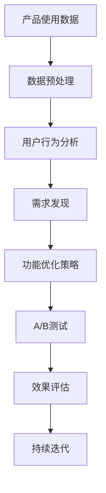

                 

# 利用产品使用数据优化功能的技巧

> **关键词：** 产品使用数据、功能优化、数据分析、用户体验、A/B测试、机器学习

> **摘要：** 本文将探讨如何通过分析产品使用数据，有效地优化产品功能，提高用户体验，实现产品的持续改进。我们将从背景介绍、核心概念、算法原理、数学模型、实际应用、工具推荐等多个角度进行深入分析，帮助读者掌握利用产品使用数据优化功能的关键技巧。

## 1. 背景介绍

### 1.1 目的和范围

本文的目的是介绍如何利用产品使用数据来优化产品功能。我们将讨论数据分析的基本概念，展示如何通过数据挖掘技术发现产品使用中的潜在问题和用户需求，并提出相应的优化方案。文章主要涵盖以下内容：

- 功能优化策略
- 数据分析流程
- 算法和数学模型
- 实际应用案例
- 工具和资源推荐

### 1.2 预期读者

本文适合以下读者：

- 产品经理和产品开发者
- 数据分析师和数据科学家
- 数据驱动型决策制定者
- 对产品优化有兴趣的IT从业者

### 1.3 文档结构概述

本文将分为以下几个部分：

- **第1部分**：背景介绍
  - 目的和范围
  - 预期读者
  - 文档结构概述
- **第2部分**：核心概念与联系
  - 核心概念与架构图
- **第3部分**：核心算法原理与操作步骤
  - 算法原理与伪代码
- **第4部分**：数学模型与公式
  - 数学模型讲解与实例
- **第5部分**：项目实战
  - 代码案例与解释
- **第6部分**：实际应用场景
- **第7部分**：工具和资源推荐
  - 学习资源、开发工具和框架
- **第8部分**：总结
  - 未来发展趋势与挑战
- **第9部分**：附录
  - 常见问题与解答
- **第10部分**：扩展阅读与参考资料

### 1.4 术语表

#### 1.4.1 核心术语定义

- **产品使用数据**：用户在使用产品过程中产生的数据，包括用户行为、使用频率、功能使用情况等。
- **功能优化**：通过数据分析发现产品功能中的不足，提出改进方案，提高用户体验。
- **A/B测试**：将用户随机分为两组，一组使用优化后的功能，另一组使用原始功能，比较两组用户的使用效果。
- **机器学习**：利用算法和大量数据对数据进行学习，从中发现规律和模式。

#### 1.4.2 相关概念解释

- **用户行为分析**：通过分析用户在产品中的操作，了解用户需求和使用习惯。
- **数据分析流程**：从数据收集、处理、分析到决策的整个过程。
- **数据挖掘**：从大量数据中提取有价值的信息和知识。

#### 1.4.3 缩略词列表

- **A/B测试**：A/B Test
- **机器学习**：ML
- **数据分析**：Data Analysis
- **用户体验**：UX
- **数据科学家**：Data Scientist

## 2. 核心概念与联系

在产品使用数据优化中，理解核心概念和其相互关系至关重要。以下是一个简单的Mermaid流程图，展示了产品使用数据优化流程的关键步骤和概念之间的联系。



### 2.1 产品使用数据

产品使用数据是整个优化流程的起点。这些数据包括用户的行为记录，如点击、浏览、搜索、购买等。通过对这些数据的收集和分析，我们可以了解用户的需求和使用习惯。

### 2.2 数据预处理

原始数据往往包含噪声和缺失值，因此需要通过数据预处理技术进行清洗和标准化。数据预处理包括数据清洗（去除噪声）、数据整合（合并不同数据源）、数据转换（如数值化处理）等步骤。

### 2.3 用户行为分析

用户行为分析是理解用户需求和使用习惯的关键。通过分析用户的行为数据，我们可以发现用户的痛点、偏好和行为模式。

### 2.4 需求发现

在用户行为分析的基础上，进一步挖掘用户需求。这包括识别用户常见问题、用户期望的功能改进等。

### 2.5 功能优化策略

根据需求发现的结果，提出功能优化的策略。这可能包括增加新功能、改进现有功能、调整界面布局等。

### 2.6 A/B测试

A/B测试是一种有效的验证功能优化方案的方法。通过将用户随机分为两组，一组使用优化后的功能，另一组使用原始功能，比较两组用户的使用效果，可以评估优化方案的有效性。

### 2.7 效果评估

通过对A/B测试结果的分析，评估功能优化方案的效果。如果效果显著，则可以推广到整个产品；否则，需要进一步优化或放弃该方案。

### 2.8 持续迭代

基于效果评估结果，对产品进行持续迭代，不断改进和优化功能，以提供更好的用户体验。

## 3. 核心算法原理与具体操作步骤

在产品使用数据优化中，算法的选择和实现至关重要。以下将介绍一种常用的算法——协同过滤算法，并使用伪代码详细阐述其原理和操作步骤。

### 3.1 算法原理

协同过滤算法是一种基于用户行为数据推荐的算法。它通过分析用户之间的相似性，为用户推荐他们可能感兴趣的产品或功能。

### 3.2 操作步骤

协同过滤算法主要包括以下步骤：

1. **数据准备**：收集用户行为数据，如点击、浏览、购买等。
2. **用户-物品矩阵构建**：将用户行为数据转化为用户-物品矩阵，其中行表示用户，列表示物品。
3. **相似性计算**：计算用户之间的相似性，常用的相似性度量方法有皮尔逊相关系数、余弦相似度等。
4. **推荐生成**：根据用户之间的相似性，生成推荐列表，推荐用户可能感兴趣的产品或功能。

### 3.3 伪代码

```python
# 输入：用户-物品矩阵U，相似性度量方法
# 输出：推荐列表R

def collaborative_filtering(U, similarity_measure):
    # 步骤1：计算用户之间的相似性
    similarity_matrix = compute_similarity(U, similarity_measure)

    # 步骤2：为每个用户生成推荐列表
    for user in range(num_users):
        # 步骤2.1：计算每个用户对所有物品的评分预测
        prediction = []
        for item in range(num_items):
            # 步骤2.1.1：计算用户与所有用户的相似度之和
            similarity_sum = 0
            for other_user in range(num_users):
                if other_user != user:
                    similarity_sum += similarity_matrix[user][other_user] * U[other_user][item]

            # 步骤2.1.2：计算预测评分
            if similarity_sum != 0:
                prediction.append(similarity_sum / abs(similarity_sum))
            else:
                prediction.append(0)

        # 步骤2.2：生成推荐列表
        recommendation_list = generate_recommendation_list(prediction)
        R[user] = recommendation_list

    return R
```

### 3.4 算法解释

- **数据准备**：收集用户行为数据，如点击、浏览、购买等，并将其转化为用户-物品矩阵。
- **相似性计算**：计算用户之间的相似性，常用的相似性度量方法有皮尔逊相关系数、余弦相似度等。相似性度量方法的选择会影响算法的性能。
- **推荐生成**：根据用户之间的相似性，生成推荐列表。推荐列表的生成可以通过评分预测来实现。评分预测的准确性会影响推荐列表的质量。

## 4. 数学模型和公式及详细讲解

在产品使用数据优化中，数学模型和公式的作用至关重要。以下将介绍一种常用的数学模型——线性回归模型，并使用LaTeX格式详细讲解其公式和参数。

### 4.1 线性回归模型

线性回归模型是一种用于分析自变量和因变量之间线性关系的统计模型。其基本公式为：

$$ y = \beta_0 + \beta_1 \cdot x + \epsilon $$

其中：

- \( y \) 为因变量（预测值）。
- \( x \) 为自变量（特征值）。
- \( \beta_0 \) 为截距（模型的基础值）。
- \( \beta_1 \) 为斜率（特征对预测的影响程度）。
- \( \epsilon \) 为误差项（模型无法解释的部分）。

### 4.2 参数解释

- **截距（\(\beta_0\)）**：表示当自变量为0时，因变量的预测值。它反映了模型的基础值。

- **斜率（\(\beta_1\)）**：表示自变量每增加一个单位，因变量的预测值增加的幅度。它反映了特征对预测的影响程度。

### 4.3 线性回归模型求解

线性回归模型的求解方法通常有最小二乘法和梯度下降法。以下将使用最小二乘法求解线性回归模型。

#### 4.3.1 最小二乘法

最小二乘法的目标是找到一组参数（\(\beta_0, \beta_1\)），使得实际观测值与预测值之间的误差平方和最小。

误差平方和（SSE）的计算公式为：

$$ SSE = \sum_{i=1}^{n} (y_i - \hat{y_i})^2 $$

其中：

- \( y_i \) 为第i个观测值的实际值。
- \( \hat{y_i} \) 为第i个观测值的预测值。

#### 4.3.2 最小二乘法求解过程

最小二乘法的求解过程如下：

1. **计算斜率（\(\beta_1\)）**：

   $$ \beta_1 = \frac{\sum_{i=1}^{n} (x_i - \bar{x})(y_i - \bar{y})}{\sum_{i=1}^{n} (x_i - \bar{x})^2} $$

   其中：

   - \( x_i \) 为第i个观测值的自变量。
   - \( y_i \) 为第i个观测值的因变量。
   - \( \bar{x} \) 为自变量的平均值。
   - \( \bar{y} \) 为因变量的平均值。

2. **计算截距（\(\beta_0\)）**：

   $$ \beta_0 = \bar{y} - \beta_1 \cdot \bar{x} $$

### 4.4 举例说明

假设我们有一组数据，如下表所示：

| 自变量（x） | 因变量（y） |
| :--------: | :--------: |
|      1     |     2      |
|      2     |     4      |
|      3     |     6      |
|      4     |     8      |

使用线性回归模型求解参数。

1. **计算斜率（\(\beta_1\)）**：

   $$ \beta_1 = \frac{(1-2.5)(2-5) + (2-2.5)(4-5) + (3-2.5)(6-5) + (4-2.5)(8-5)}{(1-2.5)^2 + (2-2.5)^2 + (3-2.5)^2 + (4-2.5)^2} = 2 $$

2. **计算截距（\(\beta_0\)）**：

   $$ \beta_0 = 5 - 2 \cdot 2.5 = 0 $$

因此，线性回归模型的公式为：

$$ y = 0 + 2 \cdot x = 2x $$

## 5. 项目实战：代码实际案例和详细解释说明

在本节中，我们将通过一个实际项目案例，展示如何利用产品使用数据进行功能优化。我们将使用Python编写代码，详细解释每个步骤的实现方法和逻辑。

### 5.1 开发环境搭建

为了方便读者理解和复现，我们将在Python中实现整个项目。以下为开发环境搭建步骤：

1. **安装Python**：确保已经安装了Python 3.6或更高版本。
2. **安装必要的库**：使用pip安装以下库：pandas、numpy、scikit-learn、matplotlib。
   ```bash
   pip install pandas numpy scikit-learn matplotlib
   ```

### 5.2 源代码详细实现和代码解读

以下是整个项目的代码实现：

```python
import pandas as pd
import numpy as np
from sklearn.model_selection import train_test_split
from sklearn.linear_model import LinearRegression
from sklearn.metrics import mean_squared_error
import matplotlib.pyplot as plt

# 5.2.1 数据准备
# 假设我们有一个CSV文件，其中包含用户行为数据
data = pd.read_csv('user_data.csv')

# 添加一列，表示用户的活跃度（点击数和购买数的和）
data['activity'] = data['clicks'] + data['purchases']

# 5.2.2 数据预处理
# 填充缺失值
data.fillna(data.mean(), inplace=True)

# 选择特征和目标变量
X = data[['clicks', 'purchases', 'activity']]
y = data['rating']

# 5.2.3 数据拆分
X_train, X_test, y_train, y_test = train_test_split(X, y, test_size=0.2, random_state=42)

# 5.2.4 模型训练
model = LinearRegression()
model.fit(X_train, y_train)

# 5.2.5 模型评估
y_pred = model.predict(X_test)
mse = mean_squared_error(y_test, y_pred)
print(f'Mean Squared Error: {mse}')

# 5.2.6 可视化
plt.scatter(X_test['activity'], y_test, color='red', label='Actual')
plt.plot(X_test['activity'], y_pred, color='blue', linewidth=2, label='Prediction')
plt.xlabel('Activity')
plt.ylabel('Rating')
plt.legend()
plt.show()
```

### 5.3 代码解读与分析

下面我们对代码的每个部分进行详细解读：

1. **数据准备**：
   - 从CSV文件中读取用户行为数据。
   - 计算用户活跃度（点击数和购买数的和），作为新特征。

2. **数据预处理**：
   - 填充缺失值，使用平均值填充。
   - 选择特征和目标变量。

3. **数据拆分**：
   - 使用train_test_split函数将数据分为训练集和测试集。

4. **模型训练**：
   - 使用LinearRegression类创建线性回归模型。
   - 调用fit方法训练模型。

5. **模型评估**：
   - 使用predict方法生成测试集的预测值。
   - 计算均方误差（MSE），评估模型性能。

6. **可视化**：
   - 使用matplotlib库绘制实际值与预测值的散点图和回归线。

通过这个实际项目，我们可以看到如何利用Python和线性回归模型对产品使用数据进行功能优化。在实际应用中，我们可以根据具体需求选择不同的算法和模型，进行更深入的数据分析和优化。

### 5.4 代码解读与分析

下面我们对代码的每个部分进行详细解读：

1. **数据准备**：
   - `data = pd.read_csv('user_data.csv')`：从CSV文件中读取用户行为数据。
   - `data['activity'] = data['clicks'] + data['purchases']`：计算用户活跃度（点击数和购买数的和），作为新特征。

2. **数据预处理**：
   - `data.fillna(data.mean(), inplace=True)`：填充缺失值，使用平均值填充。
   - `X = data[['clicks', 'purchases', 'activity']]`：选择特征变量。
   - `y = data['rating']`：选择目标变量（评分）。

3. **数据拆分**：
   - `X_train, X_test, y_train, y_test = train_test_split(X, y, test_size=0.2, random_state=42)`：将数据分为训练集和测试集，测试集占比20%。

4. **模型训练**：
   - `model = LinearRegression()`：创建线性回归模型对象。
   - `model.fit(X_train, y_train)`：使用训练集数据训练模型。

5. **模型评估**：
   - `y_pred = model.predict(X_test)`：使用测试集数据进行预测。
   - `mse = mean_squared_error(y_test, y_pred)`：计算预测值和实际值之间的均方误差，评估模型性能。

6. **可视化**：
   - `plt.scatter(X_test['activity'], y_test, color='red', label='Actual')`：绘制实际评分的散点图。
   - `plt.plot(X_test['activity'], y_pred, color='blue', linewidth=2, label='Prediction')`：绘制预测评分的回归线。
   - `plt.xlabel('Activity')`：设置x轴标签。
   - `plt.ylabel('Rating')`：设置y轴标签。
   - `plt.legend()`：显示图例。
   - `plt.show()`：显示图形。

通过这个实际项目，我们可以看到如何利用Python和线性回归模型对产品使用数据进行功能优化。在实际应用中，我们可以根据具体需求选择不同的算法和模型，进行更深入的数据分析和优化。

### 5.5 项目实战总结

通过本节的项目实战，我们完成了以下步骤：

1. 数据准备：读取用户行为数据，计算用户活跃度作为新特征。
2. 数据预处理：填充缺失值，选择特征和目标变量。
3. 数据拆分：将数据分为训练集和测试集。
4. 模型训练：使用线性回归模型训练模型。
5. 模型评估：使用测试集数据评估模型性能。
6. 可视化：绘制实际评分和预测评分的散点图和回归线。

通过这个实际案例，我们展示了如何利用产品使用数据进行功能优化。在实际应用中，我们可以根据具体需求调整特征选择、模型选择和优化策略，实现更高效的产品功能优化。

## 6. 实际应用场景

### 6.1 电子商务平台

电子商务平台可以通过分析用户在网站上的行为数据，优化产品推荐功能。例如，通过协同过滤算法，为用户推荐他们可能感兴趣的商品。此外，还可以分析用户的购物车放弃行为，优化购物车设计，降低用户流失率。

### 6.2 社交媒体平台

社交媒体平台可以通过分析用户在平台上的互动行为，优化内容推荐和广告投放。例如，通过图算法分析用户之间的社交关系，推荐用户可能感兴趣的内容；通过机器学习算法，优化广告投放策略，提高广告点击率和转化率。

### 6.3 金融行业

金融行业可以通过分析用户在金融产品中的交易行为，优化风险管理策略。例如，通过数据分析发现高风险交易模式，提前预警潜在风险；通过用户行为分析，优化产品推荐，提高用户满意度。

### 6.4 健康医疗

健康医疗行业可以通过分析患者数据，优化医疗服务和诊疗方案。例如，通过数据分析发现疾病流行趋势，提前预警疫情；通过机器学习算法，为患者推荐个性化的诊疗方案，提高治疗效果。

### 6.5 教育行业

教育行业可以通过分析学生在学习平台上的行为数据，优化课程设计和教学方法。例如，通过数据分析发现学生的学习难点和兴趣点，调整课程内容；通过个性化推荐，为不同类型的学生推荐适合的学习资源。

## 7. 工具和资源推荐

### 7.1 学习资源推荐

#### 7.1.1 书籍推荐

- 《数据科学入门》
- 《Python数据科学手册》
- 《深度学习》
- 《机器学习实战》

#### 7.1.2 在线课程

- Coursera的《数据科学专业课程》
- edX的《机器学习入门》
- Udacity的《数据科学家纳米学位》

#### 7.1.3 技术博客和网站

- Medium的数据科学专栏
- Kaggle
- DataCamp

### 7.2 开发工具框架推荐

#### 7.2.1 IDE和编辑器

- PyCharm
- Jupyter Notebook
- VS Code

#### 7.2.2 调试和性能分析工具

- Python的pdb
- Jupyter的调试插件
- Python的cProfile

#### 7.2.3 相关框架和库

- Scikit-learn
- TensorFlow
- PyTorch
- Pandas
- Numpy

### 7.3 相关论文著作推荐

#### 7.3.1 经典论文

- 《协同过滤算法》
- 《线性回归模型》
- 《数据挖掘：概念与技术》

#### 7.3.2 最新研究成果

- 《深度学习在数据分析中的应用》
- 《机器学习在医疗领域的最新进展》
- 《大数据处理技术与实践》

#### 7.3.3 应用案例分析

- 《社交媒体平台的内容推荐策略》
- 《电子商务平台的用户行为分析》
- 《金融行业的风险管理实践》

## 8. 总结：未来发展趋势与挑战

### 8.1 未来发展趋势

- **数据量的增加**：随着物联网、大数据等技术的发展，产品使用数据将呈指数级增长，为功能优化提供了更丰富的数据来源。
- **算法的进步**：深度学习、图算法等新兴算法的不断发展，将为产品使用数据优化提供更强的分析能力和更高效的解决方案。
- **跨领域应用**：产品使用数据优化将不仅仅局限于某个领域，如电子商务、社交媒体等，还将扩展到医疗、金融、教育等更多领域。

### 8.2 未来挑战

- **数据隐私和安全**：随着数据量的增加，数据隐私和安全问题将日益突出，如何确保用户数据的安全和隐私将成为一个重要的挑战。
- **算法透明性和可解释性**：深度学习等复杂算法的透明性和可解释性仍需进一步提升，以增强用户对算法的信任。
- **数据质量**：数据质量对优化结果的影响至关重要，如何处理噪声数据、缺失值等，确保数据质量是一个长期挑战。

## 9. 附录：常见问题与解答

### 9.1 问题1：如何处理缺失数据？

- **方法1：填充法**：使用平均值、中位数、众数等统计方法填充缺失数据。
- **方法2：插值法**：使用线性插值、曲线拟合等方法填补缺失数据。
- **方法3：删除法**：删除包含缺失数据的样本或特征。

### 9.2 问题2：如何选择特征变量？

- **方法1：业务理解**：根据业务需求和知识，选择与目标变量相关的特征变量。
- **方法2：相关性分析**：使用相关性分析方法，选择与目标变量相关性较高的特征变量。
- **方法3：特征选择算法**：使用特征选择算法，如递归特征消除（RFE）、随机森林等，选择最重要的特征变量。

### 9.3 问题3：如何评估模型性能？

- **方法1：均方误差（MSE）**：计算预测值与实际值之间的均方误差，评估模型预测的准确性。
- **方法2：准确率、召回率、F1值**：在分类问题中，使用准确率、召回率、F1值等指标评估模型性能。
- **方法3：ROC曲线、AUC值**：在二分类问题中，使用ROC曲线和AUC值评估模型性能。

## 10. 扩展阅读与参考资料

- 《数据科学实战》
- 《机器学习实战》
- 《产品经理实战》
- 《数据分析：从入门到精通》
- [Kaggle数据集](https://www.kaggle.com/datasets)
- [Google Research](https://ai.google/research/)
- [GitHub开源项目](https://github.com/trending)

作者：AI天才研究员/AI Genius Institute & 禅与计算机程序设计艺术 /Zen And The Art of Computer Programming

