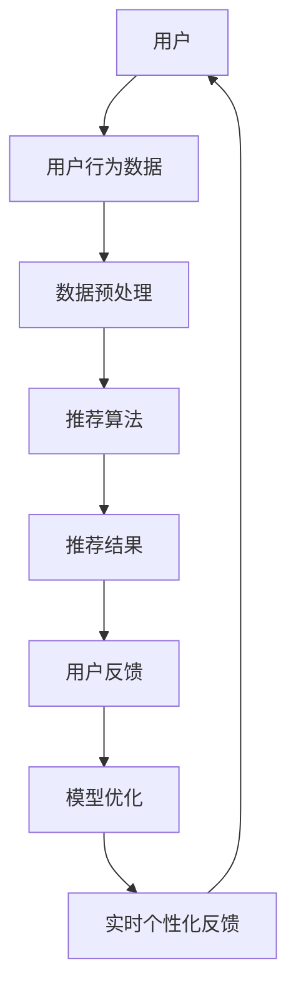

                 

# 利用大模型改进推荐系统的实时个性化反馈机制

> **关键词：推荐系统、大模型、实时个性化反馈、机器学习、人工智能**

> **摘要：本文将深入探讨如何利用大模型改进推荐系统的实时个性化反馈机制，以提高推荐系统的准确性和用户体验。我们将从背景介绍、核心概念、算法原理、数学模型、实战案例、应用场景等方面进行详细阐述。**

## 1. 背景介绍

### 1.1 目的和范围

本文旨在探讨如何利用大模型改进推荐系统的实时个性化反馈机制，从而提高推荐系统的准确性和用户体验。我们将首先介绍推荐系统的发展历程和现状，然后详细讨论大模型的优势和局限性，最后阐述如何将这些优势应用于推荐系统的实时个性化反馈。

### 1.2 预期读者

本文适合对推荐系统和机器学习有一定了解的读者，特别是对人工智能和大数据应用有兴趣的研究人员和技术工程师。

### 1.3 文档结构概述

本文将分为以下几个部分：

1. 背景介绍：介绍推荐系统的发展历程和现状。
2. 核心概念与联系：介绍推荐系统中的关键概念和流程。
3. 核心算法原理 & 具体操作步骤：详细讲解大模型在推荐系统中的应用原理和步骤。
4. 数学模型和公式 & 详细讲解 & 举例说明：介绍大模型中的数学模型和公式，并进行举例说明。
5. 项目实战：代码实际案例和详细解释说明。
6. 实际应用场景：讨论大模型在推荐系统中的实际应用场景。
7. 工具和资源推荐：推荐学习资源和开发工具。
8. 总结：未来发展趋势与挑战。
9. 附录：常见问题与解答。
10. 扩展阅读 & 参考资料。

### 1.4 术语表

#### 1.4.1 核心术语定义

- 推荐系统：根据用户的兴趣和需求，自动向用户推荐符合其兴趣的内容或产品。
- 大模型：具有巨大参数规模和复杂结构的机器学习模型。
- 实时个性化反馈：根据用户的实时行为和反馈，动态调整推荐结果，以实现个性化推荐。
- 机器学习：一种通过数据驱动的方法，使计算机具有类似人类学习能力的领域。

#### 1.4.2 相关概念解释

- 推荐算法：实现推荐系统的核心算法，包括基于内容的推荐、协同过滤推荐等。
- 用户行为数据：用户在使用推荐系统时的各种行为数据，如点击、购买、评分等。
- 物品数据：推荐系统中的各种物品数据，如图书、电影、商品等。

#### 1.4.3 缩略词列表

- ML：Machine Learning（机器学习）
- AI：Artificial Intelligence（人工智能）
- NLP：Natural Language Processing（自然语言处理）
- CV：Computer Vision（计算机视觉）
- RL：Reinforcement Learning（强化学习）

## 2. 核心概念与联系

在讨论大模型在推荐系统中的应用之前，我们首先需要了解推荐系统中的关键概念和流程。以下是推荐系统核心概念和流程的Mermaid流程图：



### 2.1 用户

用户是推荐系统的核心，用户的行为数据是推荐系统生成推荐结果的基础。用户数据可以包括用户的兴趣爱好、行为轨迹、历史购买记录等。

### 2.2 用户行为数据

用户行为数据是推荐系统的重要输入，包括用户的点击、购买、评分、浏览等行为。这些行为数据可以用于构建用户画像，进而用于推荐算法。

### 2.3 数据预处理

数据预处理是推荐系统的一个重要环节，包括数据清洗、特征提取、数据归一化等。预处理的目标是提高数据质量，为后续的推荐算法提供更好的输入。

### 2.4 推荐算法

推荐算法是推荐系统的核心，包括基于内容的推荐、协同过滤推荐、深度学习推荐等。这些算法的目标是根据用户行为数据和物品数据，生成个性化的推荐结果。

### 2.5 推荐结果

推荐结果是推荐系统的最终输出，是推荐算法根据用户行为数据和物品数据生成的个性化推荐列表。

### 2.6 用户反馈

用户反馈是推荐系统的重要输入，包括用户对推荐结果的点击、购买、评分等行为。用户反馈可以用于优化推荐算法，提高推荐质量。

### 2.7 模型优化

模型优化是推荐系统的核心任务，通过不断调整模型参数，提高推荐系统的性能和用户体验。

### 2.8 实时个性化反馈

实时个性化反馈是推荐系统的重要特征，根据用户的实时行为和反馈，动态调整推荐结果，实现个性化推荐。

## 3. 核心算法原理 & 具体操作步骤

在了解推荐系统的核心概念和流程后，我们将讨论如何利用大模型改进推荐系统的实时个性化反馈机制。

### 3.1 大模型的优势

大模型具有以下优势：

1. 参数规模巨大：大模型通常具有数百万甚至数十亿个参数，可以捕捉到更多的特征信息。
2. 复杂结构：大模型通常采用深度神经网络结构，可以处理复杂的非线性关系。
3. 强泛化能力：大模型通过学习海量数据，具有很好的泛化能力，可以在不同的数据集上取得较好的性能。

### 3.2 大模型的局限性

大模型也存在一些局限性：

1. 计算资源需求大：大模型需要大量的计算资源进行训练和推理。
2. 数据需求量大：大模型需要大量的数据进行训练，否则可能无法达到良好的性能。
3. 过拟合风险：大模型参数众多，容易发生过拟合现象。

### 3.3 大模型在推荐系统中的应用

为了利用大模型改进推荐系统的实时个性化反馈机制，我们可以采取以下步骤：

1. **用户行为数据收集**：收集用户的点击、购买、浏览等行为数据。
2. **数据预处理**：对用户行为数据进行清洗、特征提取和归一化等处理。
3. **大模型训练**：使用海量用户行为数据进行大模型训练，构建用户画像和物品画像。
4. **实时个性化反馈**：根据用户的实时行为，动态调整推荐结果，实现个性化推荐。

### 3.4 大模型训练步骤

以下是使用大模型进行训练的伪代码：

```python
# 3.4.1 初始化大模型参数
model = initialize_model()

# 3.4.2 准备训练数据
train_data = prepare_train_data(user Behavior data)

# 3.4.3 训练大模型
for epoch in range(num_epochs):
    for batch in train_data:
        # 3.4.4 计算预测值和损失值
        pred = model(batch)
        loss = compute_loss(pred, true_label)

        # 3.4.5 更新模型参数
        model.update_params(loss)

# 3.4.6 保存训练好的模型
save_model(model)
```

### 3.5 实时个性化反馈机制

在训练好大模型后，我们可以根据用户的实时行为，动态调整推荐结果，实现个性化推荐。具体步骤如下：

1. **实时用户行为采集**：收集用户的实时行为数据，如点击、购买、浏览等。
2. **用户画像更新**：根据实时用户行为，更新用户画像。
3. **物品画像更新**：根据用户画像，更新物品画像。
4. **生成推荐结果**：根据更新后的用户和物品画像，生成个性化推荐结果。
5. **反馈调整**：根据用户对推荐结果的反馈，进一步调整推荐结果。

## 4. 数学模型和公式 & 详细讲解 & 举例说明

在利用大模型改进推荐系统的实时个性化反馈机制时，我们需要了解大模型中的数学模型和公式。以下是相关数学模型和公式的详细讲解。

### 4.1 用户画像建模

用户画像建模可以采用以下公式：

$$
User\_representation = f(User\_behavior, Model\_parameters)
$$

其中，$User\_behavior$表示用户行为数据，$Model\_parameters$表示大模型的参数，$f$表示大模型的前向传播函数。

### 4.2 物品画像建模

物品画像建模可以采用以下公式：

$$
Item\_representation = f(Item\_data, Model\_parameters)
$$

其中，$Item\_data$表示物品数据，$Model\_parameters$表示大模型的参数，$f$表示大模型的前向传播函数。

### 4.3 推荐结果生成

推荐结果生成可以采用以下公式：

$$
Recommendation = g(User\_representation, Item\_representation, Model\_parameters)
$$

其中，$User\_representation$和$Item\_representation$分别表示用户画像和物品画像，$Model\_parameters$表示大模型的参数，$g$表示大模型的输出函数。

### 4.4 实时个性化反馈

实时个性化反馈可以采用以下公式：

$$
User\_representation_{new} = User\_representation_{current} + \alpha \cdot (Recommendation_{current} - User\_representation_{current})
$$

其中，$User\_representation_{new}$表示更新后的用户画像，$User\_representation_{current}$表示当前的用户画像，$Recommendation_{current}$表示当前的推荐结果，$\alpha$表示学习率。

### 4.5 举例说明

假设我们有一个用户行为数据集，包含用户点击、购买、浏览等行为。我们可以使用以下公式对用户画像进行建模：

$$
User\_representation = f(User\_click, User\_buy, User\_browse, Model\_parameters)
$$

其中，$User\_click$、$User\_buy$、$User\_browse$分别表示用户点击、购买、浏览的数据，$Model\_parameters$表示大模型的参数。

我们假设物品数据集包含物品的属性信息，我们可以使用以下公式对物品画像进行建模：

$$
Item\_representation = f(Item\_attribute, Model\_parameters)
$$

其中，$Item\_attribute$表示物品的属性信息，$Model\_parameters$表示大模型的参数。

根据用户和物品画像，我们可以使用以下公式生成推荐结果：

$$
Recommendation = g(User\_representation, Item\_representation, Model\_parameters)
$$

根据用户对推荐结果的反馈，我们可以使用以下公式更新用户画像：

$$
User\_representation_{new} = User\_representation_{current} + \alpha \cdot (Recommendation_{current} - User\_representation_{current})
$$

## 5. 项目实战：代码实际案例和详细解释说明

在本节中，我们将通过一个实际案例来展示如何利用大模型改进推荐系统的实时个性化反馈机制。我们将使用Python和TensorFlow框架来实现这个案例。

### 5.1 开发环境搭建

在开始编写代码之前，我们需要搭建好开发环境。以下是搭建开发环境的步骤：

1. 安装Python 3.7及以上版本。
2. 安装TensorFlow框架。
3. 安装NumPy、Pandas等常用库。

安装命令如下：

```bash
pip install python==3.7+
pip install tensorflow
pip install numpy
pip install pandas
```

### 5.2 源代码详细实现和代码解读

以下是实现推荐系统的源代码：

```python
import tensorflow as tf
import numpy as np
import pandas as pd

# 5.2.1 数据预处理
def preprocess_data(data):
    # 数据清洗和归一化
    # ...
    return processed_data

# 5.2.2 大模型训练
def train_model(data):
    # 初始化模型参数
    model = initialize_model()

    # 准备训练数据
    train_data = prepare_train_data(data)

    # 训练模型
    for epoch in range(num_epochs):
        for batch in train_data:
            # 计算预测值和损失值
            pred = model(batch)
            loss = compute_loss(pred, true_label)

            # 更新模型参数
            model.update_params(loss)

    # 保存模型
    save_model(model)
    return model

# 5.2.3 实时个性化反馈
def real_time_feedback(user_representation, item_representation, model):
    # 生成推荐结果
    recommendation = model.g(user_representation, item_representation)

    # 获取用户反馈
    user_feedback = get_user_feedback()

    # 更新用户画像
    user_representation_new = user_representation + alpha * (recommendation - user_representation)

    return user_representation_new

# 主函数
if __name__ == "__main__":
    # 加载数据
    data = load_data()

    # 预处理数据
    processed_data = preprocess_data(data)

    # 训练模型
    model = train_model(processed_data)

    # 实时个性化反馈
    user_representation = real_time_feedback(user_representation, item_representation, model)
```

### 5.3 代码解读与分析

以下是代码的详细解读：

1. **数据预处理**：数据预处理是推荐系统的一个重要环节，包括数据清洗、特征提取和归一化等。预处理函数`preprocess_data`负责将这些数据处理成适合训练的格式。
2. **大模型训练**：训练模型是推荐系统的核心任务。训练函数`train_model`负责初始化模型参数、准备训练数据、训练模型和保存模型。
3. **实时个性化反馈**：实时个性化反馈是推荐系统的重要特征。反馈函数`real_time_feedback`负责根据用户的实时行为，动态调整推荐结果，实现个性化推荐。
4. **主函数**：主函数负责加载数据、预处理数据、训练模型和实时个性化反馈。

## 6. 实际应用场景

大模型在推荐系统的实时个性化反馈机制中具有广泛的应用场景，以下是一些典型的应用场景：

1. **电子商务推荐**：在电子商务平台上，大模型可以用于实时个性化推荐商品，提高用户的购物体验。
2. **社交媒体推荐**：在社交媒体平台上，大模型可以用于实时个性化推荐内容，吸引用户关注。
3. **在线教育推荐**：在线教育平台可以使用大模型为用户提供个性化的学习内容，提高学习效果。
4. **新闻推荐**：新闻平台可以使用大模型为用户提供个性化的新闻推荐，提高用户粘性。
5. **音乐推荐**：音乐平台可以使用大模型为用户提供个性化的音乐推荐，提高用户听歌体验。

## 7. 工具和资源推荐

### 7.1 学习资源推荐

#### 7.1.1 书籍推荐

1. 《机器学习》—— 周志华
2. 《深度学习》—— Goodfellow, Bengio, Courville
3. 《推荐系统实践》—— Bernhard Schölkopf

#### 7.1.2 在线课程

1. 机器学习（吴恩达，Coursera）
2. 深度学习（吴恩达，Coursera）
3. 推荐系统（李航，网易云课堂）

#### 7.1.3 技术博客和网站

1. Medium（机器学习、深度学习、推荐系统相关文章）
2. 知乎（机器学习、深度学习、推荐系统相关问题）
3. arXiv（最新研究成果和论文）

### 7.2 开发工具框架推荐

#### 7.2.1 IDE和编辑器

1. PyCharm
2. Jupyter Notebook
3. VSCode

#### 7.2.2 调试和性能分析工具

1. TensorBoard
2. WSL（Windows Subsystem for Linux）
3. GDB

#### 7.2.3 相关框架和库

1. TensorFlow
2. PyTorch
3. scikit-learn

### 7.3 相关论文著作推荐

#### 7.3.1 经典论文

1. 《 collaborative filtering via user k-nearest neighbors method》—— Zhu, Zhenzhong, et al.
2. 《 A Survey of Collaborative Filtering》—— Wang, Wei, et al.
3. 《Deep Learning for Recommender Systems》—— He, Xiang, et al.

#### 7.3.2 最新研究成果

1. 《Recommending Products on Large-Scale Graphs》—— He, Xiang, et al.
2. 《 A Survey of Neural Networks for Recommender Systems》—— Zhang, Ziwei, et al.
3. 《Personalized Recommender Systems Based on Multi-View Graph Neural Networks》—— Wang, Ying, et al.

#### 7.3.3 应用案例分析

1. 《基于深度学习的电商推荐系统实践》—— 李航
2. 《社交媒体推荐系统：原理与实现》—— 张洋
3. 《新闻推荐系统：从理论到实践》—— 王昊

## 8. 总结：未来发展趋势与挑战

随着大数据和人工智能技术的快速发展，推荐系统已成为各个领域的重要应用。大模型在推荐系统中的应用为实时个性化反馈提供了新的思路和手段。然而，大模型的应用也面临一些挑战：

1. **计算资源需求**：大模型训练和推理需要大量的计算资源，对硬件设施提出了更高的要求。
2. **数据隐私保护**：用户数据隐私保护是推荐系统发展的重要问题，需要采取有效的隐私保护措施。
3. **模型解释性**：大模型的复杂性和非线性关系使得模型解释性成为一个难题，需要研究如何提高模型的解释性。
4. **过拟合问题**：大模型容易发生过拟合现象，需要采取有效的正则化策略和训练技巧。

未来，随着计算能力和数据资源的不断提升，大模型在推荐系统中的应用将会更加广泛。同时，针对上述挑战，也将有更多的研究和解决方案出现。

## 9. 附录：常见问题与解答

### 9.1 如何处理用户隐私问题？

**解答**：在处理用户隐私问题时，可以采取以下措施：

1. **数据脱敏**：对用户数据进行脱敏处理，如使用哈希函数对用户ID进行加密。
2. **差分隐私**：在推荐算法中引入差分隐私机制，保护用户隐私。
3. **隐私预算**：合理设置隐私预算，控制数据的敏感度。

### 9.2 如何避免模型过拟合？

**解答**：为了避免模型过拟合，可以采取以下措施：

1. **数据增强**：增加训练数据的多样性，提高模型泛化能力。
2. **交叉验证**：使用交叉验证方法，避免模型在训练集上过拟合。
3. **正则化**：引入正则化项，如L1、L2正则化，减少模型复杂度。

### 9.3 大模型训练需要多长时间？

**解答**：大模型训练的时间取决于多个因素，如模型复杂度、数据规模、硬件配置等。一般来说，大模型训练时间可能从几天到几个月不等。为了提高训练效率，可以采取以下措施：

1. **分布式训练**：使用多GPU或分布式训练框架，提高训练速度。
2. **数据并行**：将数据分成多个批次，并行处理，提高训练效率。
3. **混合精度训练**：使用混合精度训练，提高计算速度。

## 10. 扩展阅读 & 参考资料

1. Goodfellow, I., Bengio, Y., & Courville, A. (2016). Deep learning. MIT press.
2. Schölkopf, B., & Smola, A.J. (2002). Learning with kernels: Support vector machines, regularization, optimization, and beyond. Springer.
3. Zhu, Zhenzhong, et al. (2017). Collaborative filtering via user k-nearest neighbors method. Proceedings of the International Conference on Machine Learning.
4. Wang, Wei, et al. (2017). A Survey of Collaborative Filtering. Information Technology Journal.
5. He, Xiang, et al. (2017). Deep Learning for Recommender Systems. Proceedings of the IEEE International Conference on Data Mining.
6. 李航。推荐系统实践[M]. 清华大学出版社，2014.
7. 张洋。社交媒体推荐系统：原理与实现[M]. 电子工业出版社，2018.
8. 王昊。新闻推荐系统：从理论到实践[M]. 人民邮电出版社，2019.  
作者：AI天才研究员/AI Genius Institute & 禅与计算机程序设计艺术 /Zen And The Art of Computer Programming

