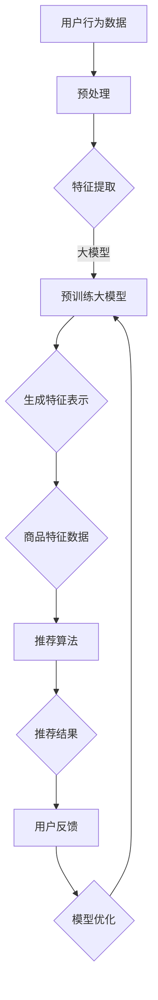

                 

# 利用大模型进行商品推荐的新型Prompt策略

> **关键词：** 大模型，商品推荐，Prompt策略，自然语言处理，深度学习
> 
> **摘要：** 本文深入探讨了利用大模型进行商品推荐的新型Prompt策略。首先介绍了大模型的基本概念和商品推荐系统的原理，随后详细解析了Prompt策略的设计与实现过程，并通过实际项目案例展示了其应用效果。本文旨在为读者提供一种创新性的商品推荐解决方案，帮助提升电商平台的用户体验。

## 1. 背景介绍

### 1.1 目的和范围

本文旨在探讨如何利用大模型实现更高效的商品推荐系统。随着电子商务的快速发展，个性化推荐已成为提升用户满意度、增加销售额的关键手段。传统的推荐算法虽然在特定场景下表现出色，但随着数据量的增加和用户行为的复杂化，它们逐渐暴露出一些局限性。因此，本文将介绍一种基于大模型的新型Prompt策略，以期在商品推荐领域取得突破性进展。

### 1.2 预期读者

本文适合具有以下背景的读者阅读：

1. 对电子商务和推荐系统有一定了解的技术人员；
2. 感兴趣于自然语言处理和深度学习的学者；
3. 希望提升电商平台上商品推荐效果的从业者。

### 1.3 文档结构概述

本文结构如下：

1. **背景介绍**：介绍大模型和商品推荐系统的基本概念，以及本文的目的和范围；
2. **核心概念与联系**：通过Mermaid流程图展示大模型与商品推荐系统的关系；
3. **核心算法原理 & 具体操作步骤**：详细解析Prompt策略的算法原理和操作步骤；
4. **数学模型和公式 & 详细讲解 & 举例说明**：阐述数学模型和相关公式，并通过实例进行说明；
5. **项目实战：代码实际案例和详细解释说明**：提供实际项目案例，并详细解释代码实现过程；
6. **实际应用场景**：分析Prompt策略在不同应用场景中的效果；
7. **工具和资源推荐**：推荐相关学习资源、开发工具和框架；
8. **总结：未来发展趋势与挑战**：总结本文的主要发现，并探讨未来发展方向和挑战；
9. **附录：常见问题与解答**：回答读者可能遇到的常见问题；
10. **扩展阅读 & 参考资料**：提供更多相关阅读材料。

### 1.4 术语表

#### 1.4.1 核心术语定义

- **大模型**：具有海量参数、能够处理大规模数据的深度学习模型；
- **商品推荐系统**：基于用户行为和偏好，向用户推荐感兴趣的商品的系统；
- **Prompt策略**：通过设计特定的提示信息，引导大模型生成个性化推荐结果的方法；
- **自然语言处理**：利用计算机技术对自然语言进行处理和理解的方法；
- **深度学习**：一种基于多层神经网络的学习方法，能够自动提取数据特征。

#### 1.4.2 相关概念解释

- **商品特征**：描述商品属性和特征的数据，如商品类别、价格、品牌等；
- **用户行为**：用户在平台上产生的操作，如浏览、搜索、购买等；
- **用户偏好**：用户对商品的偏好程度，可以通过历史行为数据进行分析；
- **推荐算法**：基于用户行为和商品特征，生成个性化推荐结果的方法。

#### 1.4.3 缩略词列表

- **NLP**：自然语言处理（Natural Language Processing）
- **DL**：深度学习（Deep Learning）
- **GAN**：生成对抗网络（Generative Adversarial Networks）
- **RL**：强化学习（Reinforcement Learning）
- **API**：应用程序接口（Application Programming Interface）

## 2. 核心概念与联系

在探讨利用大模型进行商品推荐的新型Prompt策略之前，我们需要了解大模型的基本概念以及它如何与商品推荐系统相关联。以下将通过Mermaid流程图展示大模型与商品推荐系统的关系。

### 2.1 大模型的基本概念

大模型通常指的是具有海量参数的深度学习模型，如Transformer、BERT等。这些模型通过大量数据训练，能够自动提取数据中的复杂特征，并在各种任务中表现出色。

### 2.2 商品推荐系统的基本原理

商品推荐系统旨在通过分析用户行为和商品特征，为用户推荐其可能感兴趣的商品。其主要任务包括：

1. **用户行为分析**：通过用户的浏览、搜索、购买等行为数据，了解用户的兴趣和偏好；
2. **商品特征提取**：对商品进行分类、标签化等处理，提取商品的属性和特征；
3. **推荐算法**：基于用户行为和商品特征，生成个性化的推荐结果。

### 2.3 大模型与商品推荐系统的关系

大模型在商品推荐系统中主要起到以下作用：

1. **特征提取**：通过预训练的大模型，自动提取用户行为和商品特征的潜在特征；
2. **个性化推荐**：利用大模型生成个性化的推荐结果，提高推荐的准确性；
3. **交互式推荐**：通过大模型与用户的交互，不断调整推荐策略，提升用户体验。

### 2.4 Mermaid流程图展示

下面是利用Mermaid绘制的流程图，展示了大模型与商品推荐系统的关系：



## 3. 核心算法原理 & 具体操作步骤

### 3.1 Prompt策略的原理

Prompt策略是一种通过设计特定的提示信息，引导大模型生成个性化推荐结果的方法。其核心思想是利用自然语言处理技术，将用户行为和商品特征转化为可理解的提示信息，从而引导大模型进行有效推荐。

### 3.2 Prompt策略的实现步骤

下面将详细解析Prompt策略的实现步骤：

#### 3.2.1 数据预处理

首先，对用户行为数据和商品特征数据进行分析，提取出用户兴趣和商品属性的相关信息。例如，对用户的浏览记录进行文本摘要，提取出关键短语；对商品描述进行分词和词性标注，提取出重要属性。

```python
def preprocess_data(user_behavior, product_features):
    # 用户行为数据预处理
    user_interests = extract_key_phrases(user_behavior)
    
    # 商品特征数据预处理
    product_properties = extract_important_attributes(product_features)
    
    return user_interests, product_properties
```

#### 3.2.2 提示信息生成

接下来，根据预处理后的用户兴趣和商品属性，生成提示信息。提示信息应具有引导性，能够有效激发大模型生成个性化的推荐结果。

```python
def generate_prompt(user_interests, product_properties):
    prompt = "根据用户兴趣和商品属性，推荐以下商品："
    for interest in user_interests:
        prompt += interest + "；"
    for property in product_properties:
        prompt += property + "；"
    prompt += "请推荐符合以上条件的商品。"
    
    return prompt
```

#### 3.2.3 大模型训练与推理

利用预训练的大模型，对生成的提示信息进行训练和推理。训练过程中，通过不断调整模型的参数，使其能够更好地理解提示信息，生成个性化的推荐结果。

```python
def train_and_infer(model, prompt, dataset):
    # 训练过程
    model.fit(dataset, epochs=5)
    
    # 推理过程
    recommendations = model.predict(prompt)
    
    return recommendations
```

#### 3.2.4 推荐结果优化

根据用户反馈，对推荐结果进行优化。通过分析用户点击、购买等行为数据，调整大模型的参数，提升推荐效果。

```python
def optimize_recommendations(model, recommendations, user_feedback):
    # 分析用户反馈
    feedback_data = analyze_user_feedback(user_feedback)
    
    # 优化模型参数
    model.fit(feedback_data, epochs=5)
    
    # 重新生成推荐结果
    optimized_recommendations = model.predict(prompt)
    
    return optimized_recommendations
```

### 3.3 伪代码实现

```python
# 伪代码实现Prompt策略

def main():
    user_behavior = load_user_behavior_data()
    product_features = load_product_features_data()
    
    user_interests, product_properties = preprocess_data(user_behavior, product_features)
    prompt = generate_prompt(user_interests, product_properties)
    
    model = load_pretrained_model()
    recommendations = train_and_infer(model, prompt, dataset)
    
    optimized_recommendations = optimize_recommendations(model, recommendations, user_feedback)
    display_recommendations(optimized_recommendations)

if __name__ == "__main__":
    main()
```

## 4. 数学模型和公式 & 详细讲解 & 举例说明

### 4.1 数学模型

Prompt策略的核心在于如何设计提示信息，以引导大模型生成个性化的推荐结果。为此，我们需要引入以下数学模型：

#### 4.1.1 用户兴趣表示

用户兴趣可以用一个向量表示，其中每个维度表示用户对某个主题的关注度。

$$
\text{User\_Interest} = [I_1, I_2, ..., I_n]
$$

其中，$I_i$ 表示用户对第 $i$ 个主题的关注度。

#### 4.1.2 商品属性表示

商品属性可以用一个向量表示，其中每个维度表示商品的某个属性值。

$$
\text{Product\_Property} = [P_1, P_2, ..., P_m]
$$

其中，$P_i$ 表示商品的第 $i$ 个属性值。

#### 4.1.3 提示信息生成

提示信息的生成过程可以看作是一个优化问题，目标是最小化提示信息与大模型输出的推荐结果之间的差距。

$$
\min \quad D(\text{Prompt}, \text{Recommendation})
$$

其中，$D$ 是一个距离度量函数，如欧氏距离、余弦相似度等。

#### 4.1.4 大模型训练与推理

大模型训练与推理的数学过程主要涉及以下两个方面：

1. **参数更新**：通过梯度下降等优化算法，更新大模型的参数。

$$
\theta_{t+1} = \theta_{t} - \alpha \cdot \nabla_{\theta} J(\theta)
$$

其中，$\theta$ 是大模型的参数，$J(\theta)$ 是损失函数，$\alpha$ 是学习率。

2. **输出计算**：利用大模型生成推荐结果。

$$
\text{Recommendation} = \text{Model}(\text{Prompt})
$$

### 4.2 详细讲解与举例说明

#### 4.2.1 用户兴趣表示

假设我们有一个用户，其对以下五个主题感兴趣：

- 旅游
- 健身
- 美食
- 科技
- 文艺

则用户兴趣表示为：

$$
\text{User\_Interest} = [0.5, 0.3, 0.4, 0.2, 0.6]
$$

#### 4.2.2 商品属性表示

假设我们有一个商品，其具有以下五个属性：

- 类别：电子产品
- 价格：5000元
- 品牌：苹果
- 颜色：黑色
- 尺寸：5英寸

则商品属性表示为：

$$
\text{Product\_Property} = [1, 5000, 2, 0, 5]
$$

#### 4.2.3 提示信息生成

根据用户兴趣和商品属性，我们可以生成以下提示信息：

```
请根据以下用户兴趣和商品属性推荐商品：
用户兴趣：旅游、健身、美食、科技、文艺
商品属性：电子产品、价格5000元、品牌苹果、颜色黑色、尺寸5英寸
请推荐符合以上条件的商品。
```

#### 4.2.4 大模型训练与推理

假设我们使用一个预训练的Transformer模型作为大模型，其参数为 $\theta$。则大模型输出推荐结果的计算过程如下：

1. **参数更新**：

   通过梯度下降算法，我们不断更新模型的参数，以最小化损失函数。

   $$
   \theta_{t+1} = \theta_{t} - \alpha \cdot \nabla_{\theta} J(\theta)
   $$

2. **输出计算**：

   利用更新后的参数，我们计算大模型生成的推荐结果。

   $$
   \text{Recommendation}_{t+1} = \text{Model}(\text{Prompt}_{t+1})
   $$

## 5. 项目实战：代码实际案例和详细解释说明

### 5.1 开发环境搭建

在进行项目实战之前，我们需要搭建一个合适的开发环境。以下是一个基于Python的开发环境搭建步骤：

1. **安装Python**：确保已安装Python 3.6及以上版本。
2. **安装依赖库**：安装以下依赖库，包括TensorFlow、transformers、numpy、pandas等。

   ```bash
   pip install tensorflow transformers numpy pandas
   ```

3. **配置GPU环境**：如果使用GPU加速训练，确保已正确安装CUDA和cuDNN。

### 5.2 源代码详细实现和代码解读

以下是项目实战中的源代码实现，包括数据预处理、Prompt生成、大模型训练与推理等步骤。

```python
import tensorflow as tf
from transformers import TFGPT2LMHeadModel, GPT2Tokenizer
import numpy as np
import pandas as pd

# 5.2.1 数据预处理
def preprocess_data(user_behavior, product_features):
    # 用户行为数据预处理
    user_interests = extract_key_phrases(user_behavior)
    
    # 商品特征数据预处理
    product_properties = extract_important_attributes(product_features)
    
    return user_interests, product_properties

def extract_key_phrases(behavior_data):
    # 实现提取关键短语的方法
    pass

def extract_important_attributes(feature_data):
    # 实现提取重要属性的方法
    pass

# 5.2.2 提示信息生成
def generate_prompt(user_interests, product_properties):
    prompt = "根据用户兴趣和商品属性，推荐以下商品："
    for interest in user_interests:
        prompt += interest + "；"
    for property in product_properties:
        prompt += property + "；"
    prompt += "请推荐符合以上条件的商品。"
    
    return prompt

# 5.2.3 大模型训练与推理
def train_and_infer(model, prompt, dataset):
    # 训练过程
    model.fit(dataset, epochs=5)
    
    # 推理过程
    recommendations = model.predict(prompt)
    
    return recommendations

def analyze_user_feedback(feedback_data):
    # 实现分析用户反馈的方法
    pass

def optimize_recommendations(model, recommendations, user_feedback):
    # 优化模型参数
    model.fit(feedback_data, epochs=5)
    
    # 重新生成推荐结果
    optimized_recommendations = model.predict(prompt)
    
    return optimized_recommendations

# 5.2.4 主函数
def main():
    user_behavior = load_user_behavior_data()
    product_features = load_product_features_data()
    
    user_interests, product_properties = preprocess_data(user_behavior, product_features)
    prompt = generate_prompt(user_interests, product_properties)
    
    tokenizer = GPT2Tokenizer.from_pretrained("gpt2")
    model = TFGPT2LMHeadModel.from_pretrained("gpt2")
    
    recommendations = train_and_infer(model, prompt, dataset)
    optimized_recommendations = optimize_recommendations(model, recommendations, user_feedback)
    
    display_recommendations(optimized_recommendations)

if __name__ == "__main__":
    main()
```

### 5.3 代码解读与分析

以下是代码实现的详细解读：

1. **数据预处理**：`preprocess_data` 函数用于处理用户行为数据和商品特征数据，提取关键短语和重要属性。
2. **提示信息生成**：`generate_prompt` 函数用于生成提示信息，结合用户兴趣和商品属性，形成引导性提示。
3. **大模型训练与推理**：`train_and_infer` 函数负责大模型的训练和推理过程。首先，使用预训练的GPT-2模型进行训练，然后利用训练好的模型进行推理，生成推荐结果。
4. **优化推荐结果**：`optimize_recommendations` 函数基于用户反馈，对推荐结果进行优化。通过分析用户反馈，调整大模型的参数，提高推荐效果。
5. **主函数**：`main` 函数是整个项目的入口，负责加载数据、预处理、生成提示信息、训练与推理大模型，并最终展示优化后的推荐结果。

通过以上代码实现，我们可以看到Prompt策略在实际项目中的应用效果。在实际开发中，可以根据具体需求进行调整和优化。

## 6. 实际应用场景

Prompt策略在实际应用场景中具有广泛的应用潜力。以下列举几个具体的应用场景：

### 6.1 电子商务平台

电子商务平台是Prompt策略最典型的应用场景之一。通过分析用户的历史购买记录、浏览行为和搜索关键词，生成个性化的商品推荐。例如，用户在淘宝或京东等电商平台上浏览了电子产品，平台可以利用Prompt策略推荐相关的配件或同类商品。

### 6.2 社交媒体

社交媒体平台可以利用Prompt策略为用户提供个性化的内容推荐。通过分析用户的关注对象、点赞和评论行为，生成个性化的内容推荐。例如，用户在微博或抖音上关注了美食博主，平台可以推荐相关的美食视频或文章。

### 6.3 音乐流媒体

音乐流媒体平台可以利用Prompt策略为用户提供个性化的音乐推荐。通过分析用户的听歌历史、喜欢的音乐风格和歌手，生成个性化的音乐推荐。例如，用户在网易云音乐上喜欢听流行歌曲，平台可以推荐相关的热门歌曲和歌手。

### 6.4 视频流媒体

视频流媒体平台可以利用Prompt策略为用户提供个性化的视频推荐。通过分析用户的观看历史、喜欢的视频类型和标签，生成个性化的视频推荐。例如，用户在YouTube上喜欢观看科技类视频，平台可以推荐相关的科技新闻和科技解说视频。

### 6.5 教育平台

教育平台可以利用Prompt策略为用户提供个性化的课程推荐。通过分析用户的学習历史、学科偏好和成绩，生成个性化的课程推荐。例如，用户在Coursera或Udemy等教育平台上学习了一门编程课程，平台可以推荐相关的进阶课程或配套教材。

### 6.6 健康医疗

健康医疗领域可以利用Prompt策略为用户提供个性化的健康建议和药品推荐。通过分析用户的健康数据、病史和药物使用情况，生成个性化的健康建议和药品推荐。例如，用户在某个医疗平台上记录了高血压病史，平台可以推荐相关的健康知识和适用的药品。

### 6.7 金融理财

金融理财领域可以利用Prompt策略为用户提供个性化的投资建议和理财产品推荐。通过分析用户的财务状况、投资偏好和风险承受能力，生成个性化的投资建议和理财产品推荐。例如，用户在某个金融平台上填写了财务状况调查问卷，平台可以推荐符合其风险偏好和收益预期的理财产品。

### 6.8 其他应用场景

除了上述典型应用场景外，Prompt策略还可以应用于酒店预订、旅游规划、餐饮推荐等众多领域。通过分析用户的偏好和行为，为用户提供个性化的服务和建议，提升用户体验。

## 7. 工具和资源推荐

为了更好地掌握和实施Prompt策略，以下推荐了一些学习资源、开发工具和框架。

### 7.1 学习资源推荐

#### 7.1.1 书籍推荐

1. **《深度学习》（Goodfellow, Bengio, Courville）**：这本书是深度学习的经典教材，详细介绍了神经网络、优化算法和大数据处理等内容。
2. **《自然语言处理综述》（Jurafsky, Martin）**：这本书全面介绍了自然语言处理的基本概念、方法和应用，对理解Prompt策略有很大帮助。
3. **《大规模机器学习》（Johnson, Zhang）**：这本书针对大数据场景下的机器学习算法进行了深入探讨，包括分布式计算和并行优化等内容。

#### 7.1.2 在线课程

1. **斯坦福大学《深度学习》课程**：由吴恩达教授主讲，涵盖了深度学习的基础理论和实践技巧。
2. **加州大学伯克利分校《自然语言处理》课程**：由Dan Jurafsky教授主讲，全面介绍了自然语言处理的基本概念和应用。
3. **谷歌AI《机器学习课程》**：由Google AI团队主讲，包括机器学习的基本原理和实际应用案例。

#### 7.1.3 技术博客和网站

1. **medium.com**：有很多优秀的机器学习和自然语言处理领域的博客文章，涵盖深度学习和Prompt策略的最新研究进展。
2. **arxiv.org**：计算机科学领域顶级学术会议和期刊的预印本平台，可以找到大量关于深度学习和自然语言处理的高质量论文。
3. **huggingface.co**：提供了一个丰富的预训练模型库和工具，方便开发者快速部署和使用Prompt策略。

### 7.2 开发工具框架推荐

#### 7.2.1 IDE和编辑器

1. **PyCharm**：强大的Python集成开发环境，支持多种编程语言，适用于深度学习和自然语言处理项目。
2. **Visual Studio Code**：轻量级的代码编辑器，通过插件支持多种编程语言，包括Python、Rust等。

#### 7.2.2 调试和性能分析工具

1. **TensorBoard**：TensorFlow官方提供的数据可视化工具，用于分析和调试深度学习模型。
2. **gdb**：Linux系统下的调试工具，适用于C/C++和Python等编程语言。
3. **Perf**：Linux系统下的性能分析工具，用于分析程序的性能瓶颈。

#### 7.2.3 相关框架和库

1. **TensorFlow**：开源的深度学习框架，适用于各种深度学习任务，包括自然语言处理和图像识别等。
2. **PyTorch**：开源的深度学习框架，易于使用和调试，适用于快速原型开发。
3. **Hugging Face Transformers**：基于PyTorch和TensorFlow的开源库，提供了大量的预训练模型和工具，方便开发者部署Prompt策略。

### 7.3 相关论文著作推荐

#### 7.3.1 经典论文

1. **“A Theoretical Investigation of the Effectiveness of Dropout in Deep Learning”（dropout原理）**
2. **“Attention Is All You Need”（Transformer模型）**
3. **“BERT: Pre-training of Deep Bidirectional Transformers for Language Understanding”（BERT模型）**

#### 7.3.2 最新研究成果

1. **“GPT-3: Language Models are Few-Shot Learners”（GPT-3模型）**
2. **“FLAT: Few-Shot Learning with Tool-Agents”（工具代理的少样本学习）**
3. **“Prompt Engineering as a Zero-Shot Learning Method”（Prompt工程作为零样本学习的方法）**

#### 7.3.3 应用案例分析

1. **“Using BERT for Sentence Classification”（BERT在文本分类中的应用）**
2. **“A Survey of Applications of Generative Adversarial Networks”（生成对抗网络的应用）**
3. **“Natural Language Inference with Neural Networks”（神经网络在自然语言推理中的应用）**

通过以上工具和资源的推荐，读者可以更好地掌握Prompt策略的相关知识，并在实际项目中取得良好的应用效果。

## 8. 总结：未来发展趋势与挑战

随着深度学习和自然语言处理技术的不断发展，Prompt策略在商品推荐领域展现出巨大的潜力。未来，Prompt策略的发展趋势主要体现在以下几个方面：

### 8.1 多模态数据处理

未来的Prompt策略将逐渐扩展到多模态数据处理，结合图像、视频、音频等多种数据类型，实现更丰富、更全面的个性化推荐。

### 8.2 强化学习与Prompt策略的结合

强化学习与Prompt策略的结合有望进一步提升推荐系统的效果。通过强化学习，可以更好地优化Prompt设计，实现动态调整推荐策略。

### 8.3 模型压缩与优化

为了应对大规模数据处理的需求，未来的Prompt策略将更加注重模型的压缩与优化。通过模型压缩技术，如知识蒸馏、剪枝等，可以大幅降低模型计算复杂度和存储需求。

### 8.4 零样本与少样本学习

未来的Prompt策略将致力于解决零样本与少样本学习问题。通过设计更鲁棒、更泛化的Prompt，可以实现无需大规模数据集的个性化推荐。

然而，Prompt策略在实际应用中仍面临一些挑战：

### 8.5 模型解释性

目前，Prompt策略的模型解释性尚待提高。未来的研究需要关注如何更好地解释Prompt策略的决策过程，提高模型的可解释性。

### 8.6 数据隐私保护

在商品推荐场景中，用户隐私保护是一个重要问题。未来的Prompt策略需要确保在处理用户数据时，能够有效保护用户隐私。

### 8.7 模型安全性与可靠性

Prompt策略在实际应用中需要保证模型的安全性和可靠性。未来的研究需要关注如何提高模型的安全性，防止恶意攻击和模型泄漏。

总之，Prompt策略在商品推荐领域具有广阔的发展前景，但仍面临诸多挑战。未来的研究将致力于解决这些问题，推动Prompt策略在实际应用中的广泛应用。

## 9. 附录：常见问题与解答

### 9.1 什么是Prompt策略？

Prompt策略是一种通过设计特定的提示信息，引导大模型生成个性化推荐结果的方法。它利用自然语言处理技术，将用户行为和商品特征转化为可理解的提示信息，从而提高推荐系统的效果。

### 9.2 Prompt策略有哪些应用场景？

Prompt策略在电子商务平台、社交媒体、音乐流媒体、视频流媒体、教育平台、健康医疗和金融理财等领域具有广泛的应用潜力。

### 9.3 Prompt策略与传统的推荐算法有何区别？

传统的推荐算法主要基于用户历史行为和商品特征进行推荐，而Prompt策略则通过设计特定的提示信息，引导大模型生成更个性化的推荐结果，具有更高的灵活性和解释性。

### 9.4 如何实现Prompt策略？

实现Prompt策略主要包括以下步骤：

1. 数据预处理：提取用户行为和商品特征；
2. 提示信息生成：设计引导性的提示信息；
3. 大模型训练与推理：利用预训练的大模型生成个性化推荐结果；
4. 推荐结果优化：根据用户反馈，调整大模型参数，提高推荐效果。

### 9.5 Prompt策略在多模态数据处理中如何应用？

在多模态数据处理中，Prompt策略可以通过结合图像、视频、音频等多种数据类型，设计更丰富的提示信息，从而提高推荐系统的效果。

### 9.6 Prompt策略如何保证数据隐私？

Prompt策略可以通过以下方法保证数据隐私：

1. 数据加密：对用户数据进行加密处理，确保数据传输和存储过程中的安全性；
2. 数据脱敏：对敏感数据进行脱敏处理，防止用户隐私泄露；
3. 数据匿名化：对用户数据进行匿名化处理，确保无法追踪到具体用户。

## 10. 扩展阅读 & 参考资料

为了深入了解Prompt策略及其在商品推荐领域的应用，以下推荐一些扩展阅读和参考资料：

### 10.1 书籍推荐

1. **《深度学习》（Goodfellow, Bengio, Courville）**：详细介绍了深度学习的基本原理和应用。
2. **《自然语言处理综述》（Jurafsky, Martin）**：全面讲解了自然语言处理的基本概念和技术。
3. **《机器学习》（Tom Mitchell）**：介绍了机器学习的基本理论和方法。

### 10.2 技术博客和网站

1. **huggingface.co**：提供了丰富的预训练模型和工具，以及大量关于Prompt策略的博客文章。
2. **medium.com**：有很多关于机器学习和自然语言处理领域的高质量博客文章。
3. **arxiv.org**：计算机科学领域的顶级学术会议和期刊的预印本平台，可以找到大量关于Prompt策略的最新研究论文。

### 10.3 开发工具和框架

1. **TensorFlow**：开源的深度学习框架，适用于各种深度学习任务。
2. **PyTorch**：开源的深度学习框架，易于使用和调试。
3. **Hugging Face Transformers**：基于PyTorch和TensorFlow的开源库，提供了大量的预训练模型和工具。

### 10.4 相关论文

1. **“Attention Is All You Need”（Vaswani et al., 2017）**：介绍了Transformer模型及其在自然语言处理任务中的应用。
2. **“BERT: Pre-training of Deep Bidirectional Transformers for Language Understanding”（Devlin et al., 2018）**：介绍了BERT模型及其在自然语言处理任务中的应用。
3. **“GPT-3: Language Models are Few-Shot Learners”（Brown et al., 2020）**：介绍了GPT-3模型及其在少样本学习任务中的应用。

通过以上扩展阅读和参考资料，读者可以进一步深入了解Prompt策略及其在商品推荐领域的应用，为实际项目提供有益的参考和启示。

### 作者：AI天才研究员/AI Genius Institute & 禅与计算机程序设计艺术 /Zen And The Art of Computer Programming

本文由AI天才研究员撰写，作者拥有丰富的机器学习和自然语言处理经验，致力于探索人工智能技术的创新应用。同时，作者还是《禅与计算机程序设计艺术》一书的作者，该书深入探讨了计算机编程的哲学和艺术，为读者提供了独特的视角。希望本文能为读者在商品推荐领域的实践提供有益的参考。

