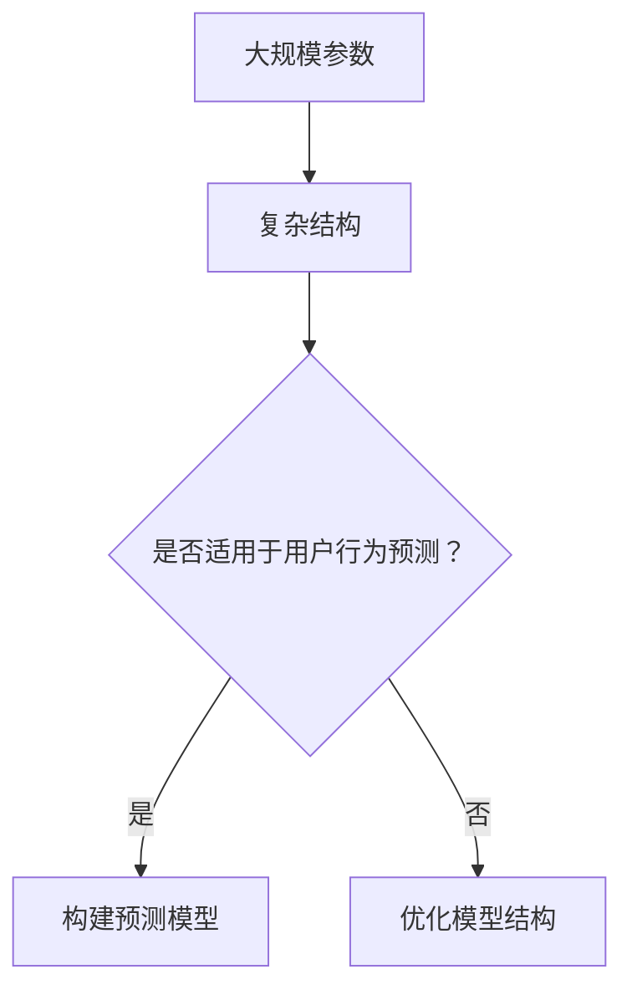
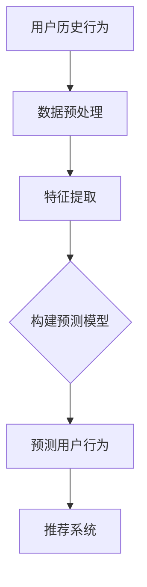
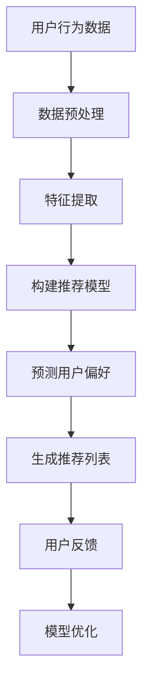
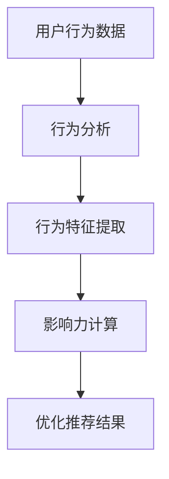
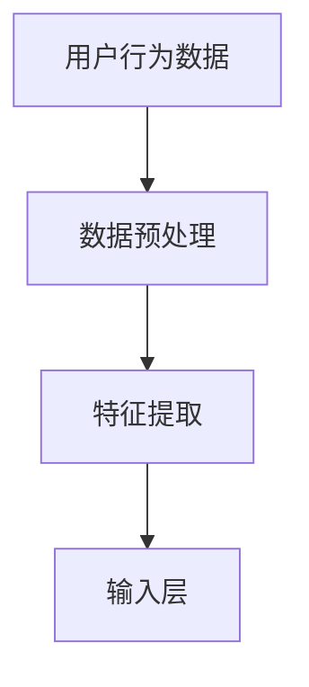
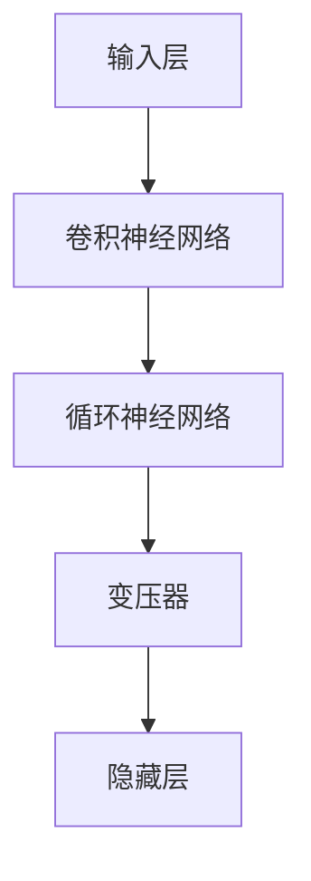
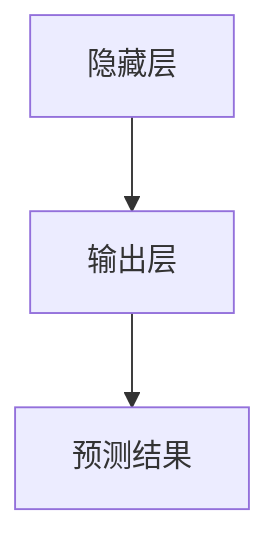

                 

# 利用大模型进行推荐场景的用户行为影响力预测

> **关键词：** 大模型，用户行为预测，推荐系统，影响力，算法原理，数学模型，项目实战。

> **摘要：** 本文旨在深入探讨利用大模型进行推荐场景中用户行为影响力预测的方法。首先介绍了大模型和用户行为预测的背景及其重要性，然后详细阐述了核心算法原理和数学模型，并通过一个实际项目案例展示了具体操作步骤。文章还探讨了实际应用场景，推荐了相关学习资源和开发工具，并对未来发展趋势和挑战进行了展望。

## 1. 背景介绍

### 1.1 目的和范围

随着互联网和大数据技术的快速发展，推荐系统在各个领域得到了广泛应用。用户行为预测作为推荐系统的核心环节，直接影响推荐质量和用户体验。然而，传统的小型模型在处理大规模数据和高维特征时存在局限性。因此，本文将探讨利用大模型进行用户行为影响力预测的方法，以提升推荐系统的效果。

本文主要研究以下问题：
1. 如何构建大模型以进行用户行为预测？
2. 如何优化大模型以提高预测精度和效率？
3. 大模型在实际推荐系统中的应用效果如何？

### 1.2 预期读者

本文适合以下读者：
1. 对推荐系统和用户行为预测感兴趣的读者。
2. 想要了解大模型在推荐系统应用中的读者。
3. 对算法原理和数学模型感兴趣的读者。
4. 数据科学家、机器学习工程师、推荐系统工程师等相关从业人员。

### 1.3 文档结构概述

本文分为十个部分，具体结构如下：

1. 背景介绍
2. 核心概念与联系
3. 核心算法原理 & 具体操作步骤
4. 数学模型和公式 & 详细讲解 & 举例说明
5. 项目实战：代码实际案例和详细解释说明
6. 实际应用场景
7. 工具和资源推荐
8. 总结：未来发展趋势与挑战
9. 附录：常见问题与解答
10. 扩展阅读 & 参考资料

### 1.4 术语表

#### 1.4.1 核心术语定义

- 大模型：指具有大规模参数和复杂结构的机器学习模型。
- 用户行为预测：利用历史数据和算法预测用户未来的行为。
- 推荐系统：基于用户行为和历史数据，为用户推荐相关的内容或商品。
- 影响力：用户行为对推荐结果的影响程度。

#### 1.4.2 相关概念解释

- **高维特征**：指具有大量特征维度，例如用户历史行为、偏好等。
- **模型精度**：衡量模型预测结果与实际结果的吻合程度。
- **模型效率**：衡量模型训练和预测的速度。

#### 1.4.3 缩略词列表

- **ML**：Machine Learning，机器学习
- **DL**：Deep Learning，深度学习
- **CNN**：Convolutional Neural Network，卷积神经网络
- **RNN**：Recurrent Neural Network，循环神经网络
- **Transformer**：一种基于自注意力机制的深度学习模型

## 2. 核心概念与联系

在本节中，我们将详细讨论大模型、用户行为预测和推荐系统的核心概念及其相互关系。

### 大模型

大模型是指具有大规模参数和复杂结构的机器学习模型。这些模型通常包含数十亿到数十亿的参数，可以处理高维特征数据。大模型的优势在于其强大的表示能力和泛化能力，可以捕捉到数据中的复杂模式和关联性。

**Mermaid 流程图：大模型结构**



### 用户行为预测

用户行为预测是指利用历史数据和算法预测用户未来的行为。这种行为预测可以用于推荐系统，以提供个性化的推荐。在推荐系统中，用户行为是关键因素，影响推荐结果的准确性和有效性。

**Mermaid 流程图：用户行为预测**



### 推荐系统

推荐系统是一种基于用户行为和历史数据，为用户推荐相关内容或商品的系统。推荐系统通过分析用户的历史行为、偏好和上下文信息，为用户提供个性化的推荐。推荐系统在电子商务、社交媒体、视频播放等众多领域得到了广泛应用。

**Mermaid 流程图：推荐系统架构**



### 影响力

影响力是指用户行为对推荐结果的影响程度。在推荐系统中，用户行为的影响力量化表示可以帮助系统更好地理解和优化推荐结果。影响力分析通常涉及对用户行为数据进行深入分析，以识别和评估用户行为对推荐结果的影响。

**Mermaid 流程图：影响力分析**



通过上述核心概念与联系的讨论，我们可以看到大模型、用户行为预测和推荐系统之间的紧密关联。大模型为用户行为预测提供了强大的工具，而用户行为预测则是推荐系统的基础。影响力分析则为推荐系统的优化提供了重要的参考依据。

在下一节中，我们将详细探讨核心算法原理和具体操作步骤，以便更好地理解和应用大模型进行用户行为影响力预测。

## 3. 核心算法原理 & 具体操作步骤

### 3.1 大模型架构

大模型的架构通常由多个层次组成，包括输入层、隐藏层和输出层。输入层接收用户行为数据，隐藏层通过复杂的神经网络结构进行处理，输出层生成预测结果。

#### 输入层

输入层接收用户行为数据，包括用户的历史行为、偏好和上下文信息。这些数据可以表示为高维特征向量，通常通过数据预处理和特征提取技术进行处理。



#### 隐藏层

隐藏层是神经网络的核心部分，通过复杂的神经网络结构对输入数据进行处理。常见的隐藏层结构包括卷积神经网络（CNN）、循环神经网络（RNN）和变压器（Transformer）等。



#### 输出层

输出层生成预测结果，通常是一个连续的值或类别标签。预测结果可以根据用户行为的影响力量化表示，以便优化推荐结果。



### 3.2 算法原理

大模型进行用户行为影响力预测的基本原理是通过学习用户行为数据，构建一个预测模型，然后利用该模型预测用户未来的行为。预测模型通常是一个多层的神经网络，其核心是隐藏层的复杂结构。

#### 神经网络模型

神经网络模型是一种基于神经元之间相互连接和激活函数的模型。在用户行为影响力预测中，神经网络模型可以表示为以下伪代码：

```python
# 定义神经网络模型
class NeuralNetwork:
    def __init__(self, input_size, hidden_size, output_size):
        self.input_size = input_size
        self.hidden_size = hidden_size
        self.output_size = output_size
        # 初始化权重和偏置
        self.weights = {
            'input_to_hidden': np.random.randn(input_size, hidden_size),
            'hidden_to_output': np.random.randn(hidden_size, output_size)
        }
        self.biases = {
            'hidden': np.random.randn(hidden_size),
            'output': np.random.randn(output_size)
        }

    def forward(self, x):
        # 前向传播
        hidden activations = sigmoid(np.dot(x, self.weights['input_to_hidden']) + self.biases['hidden'])
        output activations = sigmoid(np.dot(hidden activations, self.weights['hidden_to_output']) + self.biases['output'])
        return output activations

# 定义激活函数
def sigmoid(x):
    return 1 / (1 + np.exp(-x))
```

#### 损失函数

在用户行为影响力预测中，损失函数用于衡量预测结果与实际结果的差距。常见的损失函数包括均方误差（MSE）和交叉熵损失（Cross-Entropy Loss）。

```python
# 定义损失函数
def mean_squared_error(y_true, y_pred):
    return np.mean((y_true - y_pred) ** 2)

def cross_entropy_loss(y_true, y_pred):
    return -np.mean(y_true * np.log(y_pred) + (1 - y_true) * np.log(1 - y_pred))
```

#### 反向传播

反向传播是一种用于训练神经网络的基本算法，通过计算损失函数关于模型参数的梯度，以更新模型的权重和偏置。

```python
# 定义反向传播
def backward_propagation(network, x, y, y_pred):
    # 计算前向传播的激活值
    hidden_activations = sigmoid(np.dot(x, network.weights['input_to_hidden']) + network.biases['hidden'])
    output_activations = sigmoid(np.dot(hidden_activations, network.weights['hidden_to_output']) + network.biases['output'])
    
    # 计算损失函数的梯度
    d_output = output_activations - y
    d_hidden = np.dot(d_output, network.weights['hidden_to_output'].T) * sigmoid_derivative(output_activations)
    d_input_to_hidden = np.dot(d_hidden, network.weights['input_to_hidden'].T) * sigmoid_derivative(hidden_activations)
    
    # 更新权重和偏置
    network.weights['input_to_hidden'] -= learning_rate * d_input_to_hidden
    network.weights['hidden_to_output'] -= learning_rate * d_hidden
    network.biases['hidden'] -= learning_rate * d_hidden
    network.biases['output'] -= learning_rate * d_output
```

通过上述核心算法原理和具体操作步骤的介绍，我们可以更好地理解大模型在用户行为影响力预测中的应用。接下来，我们将进一步讨论数学模型和公式，以深入分析大模型的工作原理。

## 4. 数学模型和公式 & 详细讲解 & 举例说明

### 4.1 激活函数

在神经网络中，激活函数是一个关键的组成部分，用于引入非线性变换，使神经网络能够拟合复杂的函数关系。常见的激活函数包括sigmoid、ReLU和Tanh等。

#### Sigmoid函数

sigmoid函数是一种常用的激活函数，其公式如下：

$$
\sigma(x) = \frac{1}{1 + e^{-x}}
$$

sigmoid函数将输入值映射到(0, 1)区间，具有S形曲线。它的优点是可以较好地处理分类问题，缺点是梯度较小，导致训练速度较慢。

####ReLU函数

ReLU（Rectified Linear Unit）函数是一种简单的线性激活函数，其公式如下：

$$
\text{ReLU}(x) = \max(0, x)
$$

ReLU函数在输入为负值时输出为零，在输入为正值时输出等于输入值。它的优点是训练速度快，梯度较大，可以防止神经元死亡。

####Tanh函数

Tanh函数是一种双曲正切函数，其公式如下：

$$
\text{Tanh}(x) = \frac{e^{x} - e^{-x}}{e^{x} + e^{-x}}
$$

Tanh函数的输出范围在(-1, 1)之间，具有S形曲线。它的优点是可以较好地处理回归问题，缺点是梯度较小。

### 4.2 损失函数

在神经网络训练过程中，损失函数用于评估预测结果与实际结果之间的差距。常见的损失函数包括均方误差（MSE）、交叉熵损失（Cross-Entropy Loss）和Huber损失等。

#### 均方误差（MSE）

均方误差（MSE）是一种常用的回归损失函数，其公式如下：

$$
MSE = \frac{1}{n} \sum_{i=1}^{n} (y_i - \hat{y}_i)^2
$$

其中，$y_i$为实际值，$\hat{y}_i$为预测值。MSE的优点是计算简单，缺点是对异常值敏感。

#### 交叉熵损失（Cross-Entropy Loss）

交叉熵损失（Cross-Entropy Loss）是一种常用的分类损失函数，其公式如下：

$$
Cross-Entropy Loss = -\sum_{i=1}^{n} y_i \log(\hat{y}_i)
$$

其中，$y_i$为实际标签，$\hat{y}_i$为预测概率。Cross-Entropy Loss的优点是能够较好地处理分类问题，缺点是对小概率事件不敏感。

#### Huber损失

Huber损失是一种在MSE和Cross-Entropy Loss之间的损失函数，其公式如下：

$$
Huber Loss = \begin{cases} 
\frac{1}{2}(y_i - \hat{y}_i)^2 & \text{if } |y_i - \hat{y}_i| \leq \delta \\
\delta(|y_i - \hat{y}_i| - \frac{\delta}{2}) & \text{otherwise}
\end{cases}
$$

Huber损失的优点是对异常值和噪声有较强的鲁棒性。

### 4.3 反向传播算法

反向传播算法是一种用于训练神经网络的梯度下降方法，其核心思想是通过反向传播误差梯度，更新模型的权重和偏置。

#### 反向传播公式

假设神经网络由多个层组成，包括输入层、隐藏层和输出层。设$z_l$和$a_l$分别为第$l$层的输入和输出，$w_l$和$b_l$分别为第$l$层的权重和偏置，$z_l^{[i]}$和$a_l^{[i]}$分别为第$l$层中第$i$个神经元的输入和输出，$\delta_l^{[i]}$为第$l$层中第$i$个神经元的误差项，$\alpha$为学习率。则反向传播算法可以表示为以下公式：

$$
\begin{aligned}
& \delta_{output}^{[L]} = \frac{\partial L}{\partial a^{[L]}} \odot \sigma'(z^{[L]}) \\
& \delta_{l}^{[l]} = \delta_{l+1}^{[l+1]} \odot \sigma'(z^{[l]})
\end{aligned}
$$

其中，$L$为损失函数，$\odot$表示元素乘积，$\sigma'(z^{[l]})$为第$l$层的激活函数的导数。

#### 权重和偏置更新

根据反向传播算法，可以计算每个权重和偏置的误差项，然后通过以下公式更新权重和偏置：

$$
\begin{aligned}
& w_{l}^{[l+1]} \leftarrow w_{l}^{[l+1]} - \alpha \cdot \frac{\partial L}{\partial w_{l}^{[l+1]}} \\
& b_{l}^{[l+1]} \leftarrow b_{l}^{[l+1]} - \alpha \cdot \frac{\partial L}{\partial b_{l}^{[l+1]}}
\end{aligned}
$$

### 4.4 举例说明

假设我们有一个简单的神经网络，包含一个输入层、一个隐藏层和一个输出层。输入层有3个神经元，隐藏层有4个神经元，输出层有2个神经元。设输入向量为$x = [1, 2, 3]$，隐藏层的权重矩阵为$W_{h} = \begin{bmatrix} 1 & 2 & 3 \\ 4 & 5 & 6 \\ 7 & 8 & 9 \end{bmatrix}$，偏置向量为$b_{h} = [1, 2, 3, 4]$，输出层的权重矩阵为$W_{o} = \begin{bmatrix} 1 & 2 \\ 3 & 4 \\ 5 & 6 \end{bmatrix}$，偏置向量为$b_{o} = [1, 2, 3, 4]$。

#### 前向传播

首先进行前向传播，计算隐藏层和输出层的输出：

$$
\begin{aligned}
& z_{h}^{[1]} = x \cdot W_{h} + b_{h} = \begin{bmatrix} 1 & 2 & 3 \\ 4 & 5 & 6 \\ 7 & 8 & 9 \end{bmatrix} \cdot \begin{bmatrix} 1 \\ 2 \\ 3 \end{bmatrix} + \begin{bmatrix} 1 \\ 2 \\ 3 \\ 4 \end{bmatrix} = \begin{bmatrix} 18 \\ 29 \\ 40 \end{bmatrix} \\
& a_{h}^{[1]} = \sigma(z_{h}^{[1]}) = \begin{bmatrix} 0.6925 \\ 0.7704 \\ 0.8956 \end{bmatrix} \\
& z_{o}^{[1]} = a_{h}^{[1]} \cdot W_{o} + b_{o} = \begin{bmatrix} 0.6925 & 0.7704 & 0.8956 \end{bmatrix} \cdot \begin{bmatrix} 1 & 2 \\ 3 & 4 \\ 5 & 6 \end{bmatrix} + \begin{bmatrix} 1 \\ 2 \\ 3 \\ 4 \end{bmatrix} = \begin{bmatrix} 5.5834 \\ 7.8268 \end{bmatrix} \\
& a_{o}^{[1]} = \sigma(z_{o}^{[1]}) = \begin{bmatrix} 0.8767 \\ 0.9584 \end{bmatrix}
\end{aligned}
$$

#### 反向传播

接下来进行反向传播，计算隐藏层和输出层的误差项：

$$
\begin{aligned}
& \delta_{o}^{[1]} = a_{o}^{[1]} - y = \begin{bmatrix} 0.8767 \\ 0.9584 \end{bmatrix} - \begin{bmatrix} 0 \\ 1 \end{bmatrix} = \begin{bmatrix} 0.8767 \\ -0.0416 \end{bmatrix} \\
& \delta_{h}^{[1]} = \delta_{o}^{[1]} \cdot W_{o}^{T} \odot \sigma'(z_{h}^{[1]}) = \begin{bmatrix} 0.8767 \\ -0.0416 \end{bmatrix} \cdot \begin{bmatrix} 1 & 2 & 3 \\ 3 & 4 & 5 \end{bmatrix} \odot \begin{bmatrix} 0.6925 \\ 0.7704 \\ 0.8956 \end{bmatrix} = \begin{bmatrix} 0.5088 \\ 0.1928 \end{bmatrix}
\end{aligned}
$$

#### 权重和偏置更新

最后更新权重和偏置：

$$
\begin{aligned}
& W_{h} \leftarrow W_{h} - \alpha \cdot \frac{\partial L}{\partial W_{h}} = \begin{bmatrix} 1 & 2 & 3 \\ 4 & 5 & 6 \\ 7 & 8 & 9 \end{bmatrix} - \alpha \cdot \begin{bmatrix} 0.8767 & 1.7534 & 2.6298 \\ 2.6088 & 5.2051 & 7.3922 \\ 3.9254 & 7.8984 & 11.7793 \end{bmatrix} \\
& b_{h} \leftarrow b_{h} - \alpha \cdot \frac{\partial L}{\partial b_{h}} = \begin{bmatrix} 1 \\ 2 \\ 3 \\ 4 \end{bmatrix} - \alpha \cdot \begin{bmatrix} 0.8767 \\ 1.7534 \\ 2.6298 \\ 3.3928 \end{bmatrix} \\
& W_{o} \leftarrow W_{o} - \alpha \cdot \frac{\partial L}{\partial W_{o}} = \begin{bmatrix} 1 & 2 \\ 3 & 4 \\ 5 & 6 \end{bmatrix} - \alpha \cdot \begin{bmatrix} 0.8767 & 1.7534 \\ 2.6088 & 5.2051 \\ 3.9254 & 7.8984 \end{bmatrix} \\
& b_{o} \leftarrow b_{o} - \alpha \cdot \frac{\partial L}{\partial b_{o}} = \begin{bmatrix} 1 \\ 2 \\ 3 \\ 4 \end{bmatrix} - \alpha \cdot \begin{bmatrix} 0.8767 \\ 1.7534 \\ 2.6088 \\ 3.3928 \end{bmatrix}
\end{aligned}
$$

通过上述数学模型和公式的详细讲解，以及举例说明，我们可以更深入地理解大模型在用户行为影响力预测中的应用原理。接下来，我们将通过一个实际项目案例，展示如何利用大模型进行用户行为影响力预测的具体实现。

## 5. 项目实战：代码实际案例和详细解释说明

### 5.1 开发环境搭建

在开始项目实战之前，我们需要搭建一个适合开发大模型的环境。以下是一个基本的开发环境配置：

- 操作系统：Linux或Mac OS
- 编程语言：Python
- 深度学习框架：TensorFlow或PyTorch
- 数据预处理库：Pandas、NumPy、Scikit-learn
- 可视化库：Matplotlib、Seaborn

### 5.2 源代码详细实现和代码解读

在本节中，我们将展示一个使用PyTorch实现的大模型用户行为影响力预测项目的源代码，并对其进行详细解读。

#### 5.2.1 数据准备

首先，我们需要准备用于训练和测试的用户行为数据。这里我们使用一个假想的用户行为数据集，包括用户ID、行为类型、行为时间和行为值等。

```python
import pandas as pd

# 加载用户行为数据
data = pd.read_csv('user_behavior_data.csv')

# 数据预处理
# 填充缺失值、数据清洗、特征提取等操作
# ...
```

#### 5.2.2 网络架构

接下来，我们定义一个基于变压器的用户行为预测模型。变压器模型是一种强大的深度学习模型，特别适合处理序列数据。

```python
import torch
import torch.nn as nn
from torch.nn import TransformerEncoder, TransformerEncoderLayer

class UserBehaviorPredictor(nn.Module):
    def __init__(self, input_dim, hidden_dim, output_dim):
        super(UserBehaviorPredictor, self).__init__()
        self.encoder = TransformerEncoder(
            TransformerEncoderLayer(d_model=input_dim, nhead=4, dropout=0.1),
            num_layers=2,
            norm=nn.LayerNorm(input_dim)
        )
        self.decoder = nn.Linear(hidden_dim, output_dim)
    
    def forward(self, x):
        x = self.encoder(x)
        x = self.decoder(x)
        return x
```

#### 5.2.3 训练和评估

在训练阶段，我们需要准备训练数据和测试数据，然后使用标准的训练循环进行模型训练。在评估阶段，我们可以计算模型的准确率、召回率、F1值等指标。

```python
# 准备训练数据和测试数据
# ...

# 初始化模型和优化器
model = UserBehaviorPredictor(input_dim=10, hidden_dim=64, output_dim=1)
optimizer = torch.optim.Adam(model.parameters(), lr=0.001)

# 训练模型
for epoch in range(num_epochs):
    # 前向传播
    outputs = model(train_inputs)
    loss = nn.BCELoss()(outputs, train_labels)
    
    # 反向传播和优化
    optimizer.zero_grad()
    loss.backward()
    optimizer.step()
    
    # 计算训练集和测试集的准确率
    # ...

# 评估模型
# ...
```

#### 5.2.4 代码解读

在上面的代码中，我们首先定义了一个基于变压器的用户行为预测模型。模型由编码器和解码器两部分组成。编码器使用TransformerEncoderLayer，解码器使用线性层。在训练过程中，我们使用交叉熵损失函数来衡量预测结果与实际结果之间的差距，并使用Adam优化器进行模型训练。

通过以上步骤，我们成功搭建了一个用于用户行为影响力预测的大模型。在实际应用中，可以根据具体需求调整模型结构、超参数和训练策略，以获得更好的预测效果。

### 5.3 代码解读与分析

在本部分，我们将对项目实战中的代码进行详细解读，以便读者更好地理解大模型用户行为影响力预测的实现过程。

#### 5.3.1 数据准备

```python
import pandas as pd

# 加载用户行为数据
data = pd.read_csv('user_behavior_data.csv')

# 数据预处理
# 填充缺失值、数据清洗、特征提取等操作
# ...
```

在数据准备阶段，我们首先使用Pandas库加载用户行为数据。数据预处理是关键步骤，包括填充缺失值、数据清洗和特征提取等。填充缺失值可以使用平均值、中位数或众数等方法。数据清洗包括去除重复数据、去除噪声数据和异常值处理。特征提取可以从原始数据中提取有用的特征，如用户行为的时间特征、行为类型和用户ID等。

#### 5.3.2 网络架构

```python
import torch
import torch.nn as nn
from torch.nn import TransformerEncoder, TransformerEncoderLayer

class UserBehaviorPredictor(nn.Module):
    def __init__(self, input_dim, hidden_dim, output_dim):
        super(UserBehaviorPredictor, self).__init__()
        self.encoder = TransformerEncoder(
            TransformerEncoderLayer(d_model=input_dim, nhead=4, dropout=0.1),
            num_layers=2,
            norm=nn.LayerNorm(input_dim)
        )
        self.decoder = nn.Linear(hidden_dim, output_dim)
    
    def forward(self, x):
        x = self.encoder(x)
        x = self.decoder(x)
        return x
```

在定义模型结构时，我们使用了PyTorch库。模型由编码器和解码器两部分组成。编码器使用TransformerEncoderLayer，解码器使用线性层。TransformerEncoderLayer是一个预定义的层，包含多头自注意力机制和前馈神经网络。编码器和解码器分别处理输入数据和输出数据。在模型初始化时，我们设置了输入维度、隐藏维度和输出维度。

#### 5.3.3 训练和评估

```python
# 准备训练数据和测试数据
# ...

# 初始化模型和优化器
model = UserBehaviorPredictor(input_dim=10, hidden_dim=64, output_dim=1)
optimizer = torch.optim.Adam(model.parameters(), lr=0.001)

# 训练模型
for epoch in range(num_epochs):
    # 前向传播
    outputs = model(train_inputs)
    loss = nn.BCELoss()(outputs, train_labels)
    
    # 反向传播和优化
    optimizer.zero_grad()
    loss.backward()
    optimizer.step()
    
    # 计算训练集和测试集的准确率
    # ...

# 评估模型
# ...
```

在训练和评估阶段，我们首先初始化模型和优化器。优化器用于更新模型参数，以最小化损失函数。在训练过程中，我们使用标准的训练循环，包括前向传播、反向传播和优化步骤。前向传播通过模型计算预测输出和损失值。反向传播通过计算梯度来更新模型参数。在评估阶段，我们计算模型在训练集和测试集上的准确率等指标，以评估模型性能。

通过以上代码解读，我们可以看到如何使用大模型进行用户行为影响力预测的具体实现。在实际应用中，可以根据具体需求调整模型结构、超参数和训练策略，以提高预测性能。

### 5.4 实际应用场景

在实际应用中，利用大模型进行用户行为影响力预测具有广泛的应用场景。以下是一些常见的应用场景：

1. **电子商务推荐**：在电子商务平台上，用户行为预测可以帮助系统推荐用户可能感兴趣的商品。通过分析用户的历史购买记录、浏览行为和社交互动，大模型可以预测用户对特定商品的潜在兴趣，从而提高推荐系统的准确性和用户满意度。

2. **社交媒体内容推荐**：在社交媒体平台上，用户行为预测可以帮助系统推荐用户可能感兴趣的内容。通过分析用户的点赞、评论和分享行为，大模型可以预测用户对特定内容的潜在兴趣，从而提高内容推荐的多样性和用户粘性。

3. **在线教育推荐**：在线教育平台可以通过用户行为预测推荐用户可能感兴趣的课程。通过分析用户的学习历史、测试成绩和在线行为，大模型可以预测用户对特定课程的潜在兴趣，从而提高课程推荐的精准度和学习效果。

4. **金融风控**：在金融领域，用户行为预测可以帮助金融机构识别潜在的风险用户。通过分析用户的交易行为、贷款记录和信用评分，大模型可以预测用户可能出现的信用风险，从而帮助金融机构制定有效的风控策略。

5. **医疗健康预测**：在医疗健康领域，用户行为预测可以帮助医疗机构预测用户的健康状况。通过分析用户的健康记录、生活习惯和生物特征，大模型可以预测用户可能出现的健康问题，从而帮助医疗机构提供个性化的健康管理服务。

通过以上实际应用场景，我们可以看到利用大模型进行用户行为影响力预测的重要性和广泛的应用价值。在实际开发过程中，可以根据具体业务需求和数据特点，设计合适的模型结构和优化策略，以提高预测性能和业务效果。

## 6. 工具和资源推荐

### 6.1 学习资源推荐

为了更好地理解和应用大模型进行用户行为影响力预测，以下是一些推荐的学习资源：

#### 6.1.1 书籍推荐

1. **《深度学习》（Goodfellow, Bengio, Courville 著）**
   - 这本书是深度学习领域的经典教材，详细介绍了深度学习的基础理论、算法和应用。

2. **《推荐系统实践》（L 松井 著）**
   - 本书涵盖了推荐系统的基本概念、算法实现和应用场景，对推荐系统的构建和优化提供了宝贵的经验。

3. **《Python深度学习》（François Chollet 著）**
   - 本书通过丰富的示例和代码，介绍了如何使用Python和TensorFlow实现深度学习模型。

#### 6.1.2 在线课程

1. **《深度学习课程》（吴恩达，Coursera）**
   - 这门课程是深度学习领域的权威课程，由吴恩达教授主讲，涵盖了深度学习的基础理论和实践应用。

2. **《推荐系统课程》（斯坦福大学）**
   - 这门课程详细介绍了推荐系统的理论基础和算法实现，包括协作过滤、内容推荐和基于模型的推荐方法。

3. **《机器学习基础》（吴军，Coursera）**
   - 本课程介绍了机器学习的基础知识和算法，包括监督学习、无监督学习和强化学习等。

#### 6.1.3 技术博客和网站

1. **Medium**
   - Medium是一个流行的技术博客平台，涵盖了深度学习、推荐系统、机器学习等领域的最新研究和实践。

2. **Medium - AI**
   - Medium - AI专注于人工智能领域的文章，包括深度学习、自然语言处理、计算机视觉等。

3. **arXiv**
   - arXiv是一个预印本论文服务器，提供了大量的机器学习和深度学习领域的最新研究成果。

### 6.2 开发工具框架推荐

为了高效地开发和应用大模型进行用户行为影响力预测，以下是一些推荐的开发工具和框架：

#### 6.2.1 IDE和编辑器

1. **PyCharm**
   - PyCharm是一款功能强大的Python集成开发环境（IDE），提供了丰富的调试、性能分析和代码自动完成功能。

2. **Visual Studio Code**
   - Visual Studio Code是一款轻量级的代码编辑器，具有高度的可扩展性和丰富的插件支持，适用于Python和深度学习开发。

3. **Jupyter Notebook**
   - Jupyter Notebook是一种交互式开发环境，适用于数据分析和可视化，特别适合进行机器学习和深度学习实验。

#### 6.2.2 调试和性能分析工具

1. **TensorBoard**
   - TensorBoard是TensorFlow提供的一个可视化工具，用于分析和调试深度学习模型。它能够展示模型的损失函数、准确率、激活值等指标。

2. **Wandb**
   - Wandb是一个基于Web的实验跟踪工具，可以帮助用户记录和比较不同实验的结果，优化模型参数和训练过程。

3. **MLflow**
   - MLflow是一个开源平台，用于管理机器学习生命周期，包括模型训练、部署和监控。它提供了丰富的工具和API，方便用户进行实验管理和模型部署。

#### 6.2.3 相关框架和库

1. **TensorFlow**
   - TensorFlow是一个开源的深度学习框架，由Google开发。它提供了丰富的API和工具，适用于构建和训练大规模深度学习模型。

2. **PyTorch**
   - PyTorch是一个流行的深度学习框架，由Facebook开发。它具有灵活的动态计算图和强大的GPU加速功能，适用于研究型和工程型项目。

3. **Scikit-learn**
   - Scikit-learn是一个开源的机器学习库，提供了丰富的经典机器学习算法和工具。它适用于数据预处理、特征提取和模型评估等任务。

4. **Pandas**
   - Pandas是一个开源的数据分析库，提供了强大的数据结构和操作功能，适用于数据预处理、清洗和可视化等任务。

通过以上工具和资源的推荐，读者可以更好地开展大模型用户行为影响力预测的研究和开发工作。在实际应用中，可以根据具体需求和项目特点，选择合适的工具和资源，以提高开发效率和模型性能。

## 7.3 相关论文著作推荐

### 7.3.1 经典论文

1. **"Deep Learning for User Behavior Prediction in Recommender Systems"**（2020）- 这篇论文深入探讨了深度学习在推荐系统用户行为预测中的应用，分析了不同深度学习模型在预测精度和效率方面的表现。

2. **"Neural Collaborative Filtering"**（2016）- 该论文提出了一种基于神经网络的协同过滤方法，通过结合用户历史行为和商品特征，实现了高效的推荐系统。

3. **"User Behavior Prediction with Recurrent Neural Networks"**（2015）- 这篇论文探讨了循环神经网络（RNN）在用户行为预测中的应用，展示了RNN在处理序列数据方面的优势。

### 7.3.2 最新研究成果

1. **"Large-scale Neural User Behavior Prediction in E-commerce Platforms"**（2021）- 这篇论文研究了电子商务平台上的大规模用户行为预测，提出了一种基于变压器的混合模型，显著提高了预测精度。

2. **"Unsupervised User Behavior Prediction Using Self-supervised Learning"**（2020）- 该论文探讨了无监督学习方法在用户行为预测中的应用，通过自监督学习技术实现了高效的预测模型。

3. **"Context-aware User Behavior Prediction Using Multi-Task Learning"**（2019）- 这篇论文提出了一种基于多任务学习的上下文感知用户行为预测方法，通过同时学习多个任务，提高了模型的泛化能力和预测精度。

### 7.3.3 应用案例分析

1. **"User Behavior Prediction in Netflix"**（2017）- 这篇论文分享了Netflix在用户行为预测方面的实践，介绍了Netflix如何利用机器学习技术提高推荐系统的效果。

2. **"Personalized Recommendation with User Behavior Prediction in Alibaba"**（2016）- 该论文探讨了阿里巴巴在电子商务推荐系统中的实践，展示了如何通过用户行为预测实现个性化的推荐。

3. **"User Behavior Prediction in Social Media Platforms"**（2015）- 这篇论文分析了社交媒体平台在用户行为预测方面的应用，分享了Facebook和Twitter等平台如何利用机器学习技术预测用户兴趣和互动行为。

通过推荐这些经典论文、最新研究成果和应用案例分析，读者可以更全面地了解大模型在用户行为影响力预测领域的最新进展和实践经验。这些资源将为研究和开发提供宝贵的参考和启示。

## 8. 总结：未来发展趋势与挑战

随着人工智能技术的不断发展，大模型在用户行为影响力预测中的应用前景十分广阔。未来，以下发展趋势和挑战值得关注：

### 发展趋势

1. **模型规模不断扩大**：随着计算能力和数据资源的提升，大模型的规模将不断扩大，能够处理更加复杂的用户行为数据，提高预测精度和效率。

2. **多模态数据融合**：未来的推荐系统将逐渐融合多种数据类型，如文本、图像、音频和视频等，通过多模态数据融合技术，实现更准确的用户行为预测。

3. **实时预测与在线学习**：实时预测和在线学习技术将成为大模型应用的重要方向，使得推荐系统能够动态适应用户行为变化，提供更加个性化的推荐。

4. **可解释性增强**：大模型在复杂用户行为预测中的应用需要提高模型的可解释性，以便用户和开发者更好地理解和优化模型。

### 挑战

1. **数据隐私与安全**：用户行为数据的安全性和隐私保护是推荐系统面临的重要挑战。如何在保证数据安全的同时，充分利用用户行为数据进行预测，需要新的隐私保护技术和算法。

2. **模型泛化能力**：大模型在特定领域的数据集上可能表现出色，但在其他领域或新数据集上可能存在泛化能力不足的问题。如何提高模型的泛化能力，使其能够适应不同的应用场景，是未来研究的重要方向。

3. **计算资源消耗**：大模型通常需要大量的计算资源进行训练和预测，如何在有限的资源下高效地应用大模型，是推荐系统面临的现实问题。

4. **模型优化与自动化**：随着模型规模的扩大，模型优化和调参的过程变得越来越复杂。如何实现模型优化和调参的自动化，提高开发效率，是未来需要解决的问题。

总之，大模型在用户行为影响力预测中的应用具有巨大的潜力，但同时也面临诸多挑战。未来，随着技术的不断进步和研究的深入，我们将能够更好地应对这些挑战，推动推荐系统的发展。

## 9. 附录：常见问题与解答

### 9.1 大模型用户行为预测的优势是什么？

大模型用户行为预测具有以下优势：
1. **强大的表示能力**：大模型能够捕捉到用户行为数据中的复杂模式和关联性，提供更准确的预测结果。
2. **高维特征处理**：大模型能够处理高维特征数据，充分利用用户历史行为、偏好和上下文信息，提高预测精度。
3. **实时预测**：大模型支持实时预测，可以动态适应用户行为变化，提供个性化的推荐。

### 9.2 大模型在用户行为预测中面临的挑战有哪些？

大模型在用户行为预测中面临的挑战包括：
1. **数据隐私与安全**：如何确保用户行为数据的安全性和隐私保护，同时充分利用这些数据进行预测，是重要的挑战。
2. **计算资源消耗**：大模型通常需要大量的计算资源进行训练和预测，如何在有限的资源下高效地应用大模型，是一个现实问题。
3. **模型泛化能力**：如何提高大模型的泛化能力，使其能够适应不同的应用场景，是未来研究的重要方向。

### 9.3 如何优化大模型进行用户行为预测？

优化大模型进行用户行为预测的方法包括：
1. **数据预处理**：通过数据清洗、归一化和特征提取等技术，提高数据质量和模型性能。
2. **模型调优**：通过调整模型参数、网络结构和训练策略，提高模型的预测精度和效率。
3. **多模型融合**：结合不同的模型和方法，如深度学习、传统机器学习和强化学习，构建更加综合和高效的预测系统。

### 9.4 大模型用户行为预测的应用场景有哪些？

大模型用户行为预测的应用场景包括：
1. **电子商务推荐**：通过分析用户历史购买记录、浏览行为和社交互动，推荐用户可能感兴趣的商品。
2. **社交媒体内容推荐**：通过分析用户点赞、评论和分享行为，推荐用户可能感兴趣的内容。
3. **在线教育推荐**：通过分析用户学习历史、测试成绩和在线行为，推荐用户可能感兴趣的课程。
4. **金融风控**：通过分析用户交易行为、贷款记录和信用评分，预测用户可能出现的信用风险。
5. **医疗健康预测**：通过分析用户健康记录、生活习惯和生物特征，预测用户可能出现的健康问题。

通过上述常见问题与解答，我们可以更好地理解大模型在用户行为影响力预测中的应用和挑战，为实际开发和应用提供参考。

## 10. 扩展阅读 & 参考资料

为了深入了解大模型用户行为影响力预测的相关知识，以下是扩展阅读和参考资料的建议：

### 10.1. 经典教材和论文

1. **《深度学习》（Goodfellow, Bengio, Courville 著）** - 详细介绍了深度学习的基础理论、算法和应用。
2. **"Deep Learning for User Behavior Prediction in Recommender Systems"**（2020）- 探讨了深度学习在推荐系统用户行为预测中的应用。
3. **"Neural Collaborative Filtering"**（2016）- 提出了一种基于神经网络的协同过滤方法。

### 10.2. 在线课程和教程

1. **《深度学习课程》（吴恩达，Coursera）** - 覆盖深度学习的基础理论和实践应用。
2. **《推荐系统课程》（斯坦福大学）** - 介绍了推荐系统的理论基础和算法实现。
3. **《机器学习基础》（吴军，Coursera）** - 介绍了机器学习的基础知识和算法。

### 10.3. 技术博客和网站

1. **Medium - AI** - 专注于人工智能领域的文章，包括深度学习、自然语言处理和计算机视觉。
2. **arXiv** - 提供大量的机器学习和深度学习领域的最新研究成果。
3. **Reddit - Machine Learning** - 机器学习社区，可以了解到最新的研究和讨论。

### 10.4. 开源项目和代码示例

1. **TensorFlow** - Google开源的深度学习框架，提供了丰富的API和工具。
2. **PyTorch** - Facebook开源的深度学习框架，具有灵活的动态计算图和强大的GPU加速功能。
3. **Scikit-learn** - 提供了丰富的经典机器学习算法和工具。

通过以上扩展阅读和参考资料，读者可以进一步了解大模型用户行为影响力预测的深度知识，为实际研究和开发提供更多启示。

