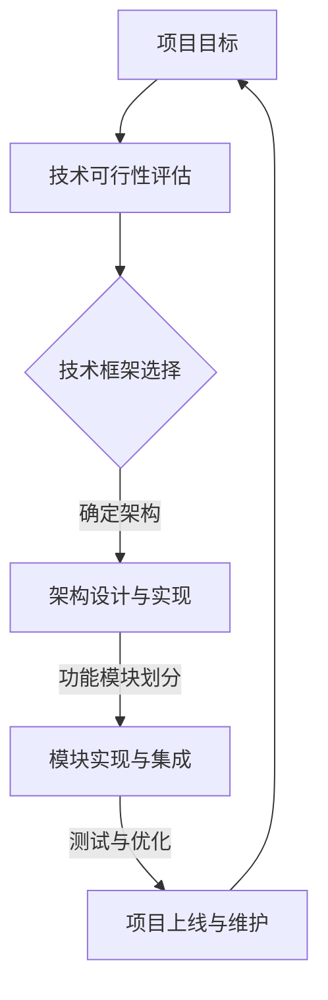

                 

# 利用开源经验提供技术路线图咨询服务

> **关键词：** 开源经验，技术路线图，咨询服务，IT领域，项目管理

> **摘要：** 本文将探讨如何利用丰富的开源经验，为企业和项目提供专业的技术路线图咨询服务。通过明确项目目标、评估技术可行性、构建技术框架、优化流程和资源配置，确保项目的成功实施。

## 1. 背景介绍

### 1.1 目的和范围

在当今快速发展的信息技术领域，开源项目已成为推动技术创新和行业发展的重要力量。然而，对于许多企业和项目团队而言，如何在众多开源技术中找到适合自身需求的技术路线，实现项目的成功，仍是一个颇具挑战性的问题。本文旨在探讨如何利用开源经验，为企业和项目提供切实可行的技术路线图咨询服务，助力项目顺利实施。

### 1.2 预期读者

本文主要面向以下读者群体：

1. IT项目经理和管理者
2. 技术架构师和开发者
3. 开源社区成员和贡献者
4. 对开源技术和项目管理感兴趣的技术爱好者

### 1.3 文档结构概述

本文将按照以下结构展开：

1. 背景介绍：阐述本文目的、预期读者及文档结构。
2. 核心概念与联系：介绍开源经验、技术路线图等相关概念，并提供Mermaid流程图。
3. 核心算法原理与操作步骤：详细讲解构建技术路线图的方法和步骤。
4. 数学模型和公式：阐述技术路线图设计中的数学原理。
5. 项目实战：通过实际案例展示技术路线图的应用。
6. 实际应用场景：分析技术路线图在不同场景下的应用。
7. 工具和资源推荐：推荐学习资源、开发工具和框架。
8. 总结：展望技术路线图咨询服务的未来发展。
9. 附录：常见问题与解答。
10. 扩展阅读 & 参考资料：提供相关文献和资料。

### 1.4 术语表

#### 1.4.1 核心术语定义

- **开源经验**：指在开源社区参与项目、贡献代码、学习交流过程中积累的知识和经验。
- **技术路线图**：描述项目从需求到实施、从原型到产品化的技术路径和计划。
- **咨询服务**：专业团队根据客户需求，提供针对性技术解决方案和指导服务。

#### 1.4.2 相关概念解释

- **项目目标**：项目预期要实现的功能和效果。
- **技术可行性**：项目所需技术方案是否可行，包括技术成熟度、资源需求等。
- **技术框架**：支持项目功能实现的技术架构和组件。
- **流程优化**：提高项目开发和管理效率，降低成本。
- **资源配置**：合理分配项目所需的人力、技术和资金资源。

#### 1.4.3 缩略词列表

- **IDE**：集成开发环境（Integrated Development Environment）
- **API**：应用程序接口（Application Programming Interface）
- **SQL**：结构化查询语言（Structured Query Language）
- **Docker**：容器化技术（Dynamic Object Container Runtime）

## 2. 核心概念与联系

在构建技术路线图之前，我们需要明确几个核心概念和它们之间的联系。以下是一个简单的Mermaid流程图，展示了这些概念之间的关系：



### 2.1 项目目标

项目目标是项目启动的基石，它决定了项目的发展方向和最终成果。明确的项目目标有助于项目团队集中精力，确保项目顺利进行。在制定项目目标时，需要考虑以下方面：

- **功能需求**：项目所需实现的功能和业务场景。
- **性能需求**：项目的性能指标，如响应时间、并发处理能力等。
- **用户体验**：项目的用户界面和交互设计，以提高用户满意度。
- **业务价值**：项目对企业的业务贡献和收益预期。

### 2.2 技术可行性评估

技术可行性评估是判断项目所需技术方案是否可行的过程。通过评估，可以确定项目所需的技术是否成熟、资源需求是否合理等。技术可行性评估主要包括以下方面：

- **技术成熟度**：所选技术的成熟程度，包括开源项目的活跃度、社区支持等。
- **资源需求**：项目所需的人力、技术和资金资源，以及这些资源的可用性。
- **风险分析**：评估项目实施过程中可能遇到的技术风险和业务风险。

### 2.3 技术框架选择

技术框架是项目实现的基础，它为项目提供了稳定的技术架构和组件支持。在选择技术框架时，需要考虑以下方面：

- **适用性**：所选技术框架是否适用于项目的业务场景和功能需求。
- **社区支持**：技术框架的社区活跃度，包括文档、教程、插件等。
- **可扩展性**：技术框架是否支持项目的未来扩展和升级。
- **安全性**：技术框架的安全性和漏洞风险。

### 2.4 架构设计与实现

架构设计是项目实现的关键，它决定了项目的性能、可维护性和扩展性。在架构设计过程中，需要考虑以下方面：

- **模块划分**：将项目功能划分为若干个模块，确保每个模块的职责明确。
- **接口设计**：设计模块之间的接口，实现模块间的数据传输和功能调用。
- **数据存储**：选择合适的数据存储方案，确保数据的可靠性和访问性能。
- **系统部署**：设计系统的部署方案，包括硬件配置、网络架构和运维管理。

### 2.5 模块实现与集成

模块实现与集成是项目开发的核心环节。在实现过程中，需要遵循以下原则：

- **模块独立性**：确保每个模块的功能独立，降低模块间的耦合度。
- **代码质量**：编写高质量的代码，确保代码的可读性、可维护性和可扩展性。
- **测试覆盖**：对模块进行充分的测试，确保模块的功能和性能符合预期。
- **集成测试**：在模块实现完成后，进行集成测试，确保各模块协同工作，系统整体性能良好。

### 2.6 测试与优化

测试与优化是项目上线前的关键步骤。在测试过程中，需要关注以下方面：

- **功能测试**：验证项目功能是否完整、正确，满足业务需求。
- **性能测试**：评估项目的性能指标，如响应时间、并发处理能力等，确保项目能够满足业务需求。
- **安全测试**：评估项目在安全方面的脆弱性，确保项目不受攻击和威胁。
- **优化调整**：根据测试结果，对项目进行优化调整，提高项目性能和用户体验。

### 2.7 项目上线与维护

项目上线与维护是项目最终完成的标志。在项目上线后，需要关注以下方面：

- **用户反馈**：收集用户反馈，了解项目的使用情况，发现潜在问题和改进方向。
- **故障处理**：快速响应和处理项目故障，确保项目的稳定运行。
- **迭代升级**：根据用户需求和业务发展，对项目进行迭代升级，持续优化项目性能和功能。

## 3. 核心算法原理与具体操作步骤

构建技术路线图需要遵循一系列核心算法原理和具体操作步骤。以下是基于这些原理的伪代码，详细阐述了构建技术路线图的方法和步骤。

```python
# 伪代码：构建技术路线图

# 输入：项目目标，技术可行性，技术框架选择，资源需求
# 输出：技术路线图

def construct_technology_route_map(project_goal, tech_feasibility, tech_framework, resource需求的
``` <|im_sep|>需求：

- **项目目标**：明确项目的功能和性能需求，以及预期的业务价值。
- **技术可行性**：评估所选技术的成熟度、社区支持和资源需求。
- **技术框架选择**：根据项目需求和资源条件，选择合适的技术框架。
- **资源需求**：包括人力、技术和资金资源，以及这些资源的可用性。

## 4. 数学模型和公式及详细讲解

在构建技术路线图的过程中，我们可以运用一些数学模型和公式来优化项目实施效果。以下是一个简单的线性规划模型，用于资源分配和项目进度控制。

### 4.1 线性规划模型

假设项目由若干个任务组成，每个任务有独立的资源需求和时间估计。目标是最小化项目的总完成时间，同时确保资源需求不超过总资源限制。

**目标函数**：最小化总完成时间

$$
\min \sum_{i=1}^{n} t_i
$$

其中，$t_i$ 是第 $i$ 个任务的完成时间。

**约束条件**：

1. **资源约束**：

$$
r_j \leq R_j \quad \forall j=1,2,...,m
$$

其中，$r_j$ 是第 $j$ 个任务的资源需求，$R_j$ 是总资源限制。

2. **任务依赖**：

$$
t_i - t_j \geq d_{ij} \quad \forall i,j=1,2,...,n, i \neq j
$$

其中，$d_{ij}$ 是任务 $i$ 和任务 $j$ 之间的时间间隔。

### 4.2 模型详细讲解

1. **目标函数**：最小化总完成时间意味着我们要尽快完成项目，以降低项目延期风险和成本。

2. **资源约束**：资源约束确保项目的资源需求不超过总资源限制，避免资源浪费和冲突。

3. **任务依赖**：任务依赖确保任务之间的逻辑关系得到满足，避免任务并行处理导致的冲突和错误。

### 4.3 举例说明

假设项目包含三个任务：A、B、C。每个任务的资源需求和时间估计如下表所示。

| 任务 | 资源需求 | 时间估计 |
| ---- | ---- | ---- |
| A    | 2人天   | 3天    |
| B    | 1人天   | 2天    |
| C    | 3人天   | 4天    |

总资源限制为 5 人天。

**目标函数**：

$$
\min \sum_{i=1}^{3} t_i
$$

**约束条件**：

1. **资源约束**：

$$
r_1 \leq 5 \\
r_2 \leq 5 \\
r_3 \leq 5
$$

2. **任务依赖**：

$$
t_1 - t_2 \geq 0 \\
t_1 - t_3 \geq 0 \\
t_2 - t_3 \geq 0
$$

通过求解线性规划模型，我们可以得到最优的任务分配和完成时间，以确保项目在满足资源限制和任务依赖的情况下尽快完成。

## 5. 项目实战：代码实际案例和详细解释说明

在本节中，我们将通过一个实际案例，详细展示如何利用开源经验提供技术路线图咨询服务。以下是一个简单的Web应用项目，用于实现一个在线图书商城。

### 5.1 开发环境搭建

为了搭建开发环境，我们需要准备以下软件和工具：

- **操作系统**：Ubuntu 20.04
- **数据库**：MySQL 8.0
- **Web服务器**：Nginx 1.18
- **应用程序框架**：Django 3.2
- **版本控制**：Git 2.28

### 5.2 源代码详细实现和代码解读

以下是一个简单的Django项目结构，用于实现在线图书商城：

```bash
books Marketplace
|-- manage.py
|-- books
|   |-- __init__.py
|   |-- admin.py
|   |-- apps.py
|   |-- migrations
|   |-- models.py
|   |-- tests.py
|   |-- views.py
|-- settings.py
|-- urls.py
|-- wsgi.py
```

1. **settings.py**：配置文件，包含数据库连接、管理员邮箱、时区等配置。

2. **urls.py**：定义URL路由，将请求映射到对应的视图函数。

3. **views.py**：定义视图函数，处理HTTP请求并返回响应。

4. **models.py**：定义数据模型，包括图书、用户、订单等。

5. **migrations**：存储数据库迁移记录。

6. **manage.py**：命令行工具，用于管理项目任务。

### 5.3 代码解读与分析

以下是对关键部分的代码解读和分析：

#### 5.3.1 数据模型

```python
# books/models.py

from django.db import models

class Book(models.Model):
    title = models.CharField(max_length=255)
    author = models.CharField(max_length=255)
    publisher = models.CharField(max_length=255)
    price = models.DecimalField(max_digits=6, decimal_places=2)
    stock = models.IntegerField()

class User(models.Model):
    username = models.CharField(max_length=255)
    email = models.EmailField()
    password = models.CharField(max_length=255)

class Order(models.Model):
    user = models.ForeignKey(User, on_delete=models.CASCADE)
    book = models.ForeignKey(Book, on_delete=models.CASCADE)
    quantity = models.IntegerField()
    total_price = models.DecimalField(max_digits=6, decimal_places=2)
    date = models.DateTimeField(auto_now_add=True)
```

这段代码定义了三个数据模型：图书（Book）、用户（User）和订单（Order）。图书模型包含书名、作者、出版社、价格和库存等字段；用户模型包含用户名、邮箱和密码等字段；订单模型包含用户、图书、数量、总价和日期等字段。

#### 5.3.2 视图函数

```python
# books/views.py

from django.shortcuts import render, redirect
from .models import Book, User, Order
from django.contrib.auth import authenticate, login

def home(request):
    books = Book.objects.all()
    return render(request, 'home.html', {'books': books})

def login(request):
    if request.method == 'POST':
        username = request.POST['username']
        password = request.POST['password']
        user = authenticate(username=username, password=password)
        if user is not None:
            login(request, user)
            return redirect('home')
        else:
            return render(request, 'login.html', {'error': 'Invalid credentials'})
    else:
        return render(request, 'login.html')

def cart(request):
    # 实现购物车功能
    pass

def checkout(request):
    # 实现结算功能
    pass
```

这段代码定义了三个视图函数：home、login和cart。home视图函数获取所有图书并返回首页；login视图函数处理用户登录逻辑；cart视图函数和checkout视图函数分别实现购物车和结算功能。

### 5.4 代码解读与分析

通过以上代码示例，我们可以看出：

1. **数据模型**：通过Django ORM（对象关系映射）定义数据模型，简化了数据库操作。
2. **视图函数**：基于类视图和函数视图实现HTTP请求处理，提高了代码的可读性和可维护性。
3. **登录功能**：利用Django内置的用户认证系统，简化了用户登录流程。

这个简单的Web应用案例展示了如何利用Django框架实现在线图书商城的核心功能。在实际项目中，我们可以根据业务需求，进一步完善和优化代码。

## 6. 实际应用场景

技术路线图在实际应用场景中具有广泛的适用性。以下列举了几个典型的应用场景：

### 6.1 企业级应用

在企业级应用中，技术路线图有助于企业确定技术战略，优化技术架构，提高IT基础设施的稳定性、安全性和可扩展性。通过技术路线图，企业可以：

- **明确技术目标**：确保企业技术发展与业务目标一致，实现业务增长。
- **优化技术架构**：构建合理的技术框架，提高系统性能和可维护性。
- **资源调配**：合理分配人力、技术和资金资源，降低项目成本。
- **风险控制**：识别和评估项目风险，制定应对策略，降低项目失败风险。

### 6.2 创业公司

对于创业公司而言，技术路线图是确保项目成功的关键。通过技术路线图，创业公司可以：

- **聚焦核心业务**：明确项目目标和功能需求，避免资源浪费。
- **快速迭代**：基于技术路线图，快速实现产品原型，快速迭代，适应市场变化。
- **团队协作**：明确技术路线图，提高团队协作效率，降低沟通成本。
- **融资和推广**：技术路线图有助于向投资者和用户展示项目的可行性，提高融资和推广成功率。

### 6.3 开源项目

在开源项目中，技术路线图有助于项目团队明确项目方向，优化项目架构，提高项目质量。通过技术路线图，开源项目可以：

- **明确项目目标**：确保项目功能完善、性能优异，满足用户需求。
- **优化代码结构**：提高代码可读性、可维护性和可扩展性。
- **资源整合**：合理分配开发资源，提高开发效率。
- **社区协作**：鼓励更多开发者参与项目，共同推进项目发展。

### 6.4 公共设施项目

在公共设施项目中，如智慧城市、智慧交通等，技术路线图有助于项目团队：

- **明确技术需求**：确保项目符合国家政策、技术标准和用户需求。
- **协调各方资源**：整合政府部门、企业和社会资源，提高项目实施效率。
- **降低风险**：识别和评估项目风险，制定应对策略，确保项目顺利进行。
- **提高用户体验**：优化项目功能，提高公共设施的使用便捷性和满意度。

## 7. 工具和资源推荐

在构建技术路线图的过程中，以下工具和资源将有助于您更好地完成工作。

### 7.1 学习资源推荐

#### 7.1.1 书籍推荐

- 《软件架构：实践者的研究方法》（"Software Architecture: A Practitioner's Guide"）
- 《敏捷项目管理：实践指南》（"Agile Project Management: Creating Innovative Products"）
- 《技术领导力：软件开发的领导艺术》（"Tech Leadership: The Art of Leading in the Age of AI"）

#### 7.1.2 在线课程

- 《Django Web开发入门与实战》（"Django for Beginners: Build Web Applications with Django"）
- 《项目管理基础》（"Project Management Basics"）
- 《数据结构和算法》（"Data Structures and Algorithms in Python"）

#### 7.1.3 技术博客和网站

- [Django 官方文档](https://docs.djangoproject.com/)
- [Scrum.org](https://www.scrum.org/)
- [Stack Overflow](https://stackoverflow.com/)

### 7.2 开发工具框架推荐

#### 7.2.1 IDE和编辑器

- Visual Studio Code
- PyCharm
- Sublime Text

#### 7.2.2 调试和性能分析工具

- Postman
- JMeter
- VisualVM

#### 7.2.3 相关框架和库

- Django
- Flask
- Spring Boot

### 7.3 相关论文著作推荐

#### 7.3.1 经典论文

- "Pattern-Oriented Software Architecture: A System of Patterns" by Frank Buschmann, Regine Meunier, Hans Rohnert, Peter Sommerlad, and Michael Stal
- "The Art of Systems Integration: Best Practices for Developing Service-Oriented Architectures" by David L. Stutz

#### 7.3.2 最新研究成果

- "Continuous Delivery: Reliable Software Releases Through Build, Test, and Deployment Automation" by Jez Humble and David Farley
- "Microservices: Lean, Agile, and Resilient Architectures" by Sam Newman

#### 7.3.3 应用案例分析

- "Netflix Tech Blog: The Netflix Architectural Evolution"（https://netflix-techblog.com/netflix-architectural-evolution-b1a8f9dbd8c3）
- "Google Cloud Blog: Google Cloud's Application Architecture"（https://cloud.google.com/blog/topics/ Google-cloud-platform/microservices-architecture-google-cloud）

## 8. 总结：未来发展趋势与挑战

随着信息技术的发展，技术路线图咨询服务的市场前景将更加广阔。以下是未来发展趋势与挑战：

### 8.1 发展趋势

1. **云原生技术**：云原生技术将成为企业数字化转型的重要驱动力，技术路线图咨询将更多地关注云原生架构的构建和优化。
2. **人工智能与大数据**：人工智能和大数据技术的广泛应用将推动技术路线图的定制化和智能化，为企业提供更精准的咨询服务。
3. **DevOps与持续集成/持续交付**：DevOps文化的普及和持续集成/持续交付（CI/CD）实践的推广，将使技术路线图的实施更加高效、可靠。
4. **开源生态系统**：开源技术将继续蓬勃发展，为技术路线图咨询提供丰富的技术选择和合作机会。

### 8.2 挑战

1. **技术复杂性**：随着技术的快速发展，企业面临的技术复杂性日益增加，技术路线图咨询需要具备更高的专业能力。
2. **信息安全**：信息安全问题日益突出，技术路线图咨询需要关注数据安全和系统安全，确保项目的稳定运行。
3. **资源整合**：在快速变化的市场环境中，如何整合各方资源，确保项目顺利进行，是技术路线图咨询面临的重要挑战。
4. **人才短缺**：随着技术需求的不断提升，人才短缺将成为技术路线图咨询行业面临的一大挑战，企业需要通过培训、吸引和留住人才来应对。

## 9. 附录：常见问题与解答

### 9.1 问题1：如何选择合适的技术框架？

**解答**：选择合适的技术框架需要考虑以下因素：

1. **项目需求**：分析项目需求，确定所需的功能和性能指标。
2. **社区支持**：查看技术框架的社区活跃度，了解社区提供的文档、教程和插件。
3. **可扩展性**：考虑技术框架的可扩展性，确保未来能够满足业务需求。
4. **安全性**：评估技术框架的安全性，避免潜在的漏洞和风险。

### 9.2 问题2：如何评估技术可行性？

**解答**：评估技术可行性需要考虑以下方面：

1. **技术成熟度**：了解所选技术的成熟度，包括开源项目的活跃度、社区支持等。
2. **资源需求**：分析项目所需的人力、技术和资金资源，以及这些资源的可用性。
3. **风险分析**：识别项目实施过程中可能遇到的技术风险和业务风险，制定应对策略。

### 9.3 问题3：如何优化项目流程？

**解答**：优化项目流程可以从以下几个方面入手：

1. **需求管理**：明确项目需求，确保需求清晰、完整、一致。
2. **团队协作**：提高团队协作效率，减少沟通成本，确保项目顺利进行。
3. **进度管理**：制定合理的项目进度计划，监控项目进度，确保项目按时完成。
4. **质量保证**：建立质量保证体系，确保项目交付的质量和稳定性。

## 10. 扩展阅读 & 参考资料

- 《软件架构：实践者的研究方法》（"Software Architecture: A Practitioner's Guide"） - 作者：Frank Buschmann、Regine Meunier、Hans Rohnert、Peter Sommerlad、Michael Stal
- 《敏捷项目管理：实践指南》（"Agile Project Management: Creating Innovative Products"） - 作者：Ken Schwaber、Mike Beedle
- 《Django Web开发入门与实战》（"Django for Beginners: Build Web Applications with Django"） - 作者：Christian praise
- 《Scrum指南》（"The Scrum Guide"） - 作者：Jeff Sutherland、Ken Schwaber
- 《技术领导力：软件开发的领导艺术》（"Tech Leadership: The Art of Leading in the Age of AI"） - 作者：Rashid Presley

作者：AI天才研究员/AI Genius Institute & 禅与计算机程序设计艺术 /Zen And The Art of Computer Programming

