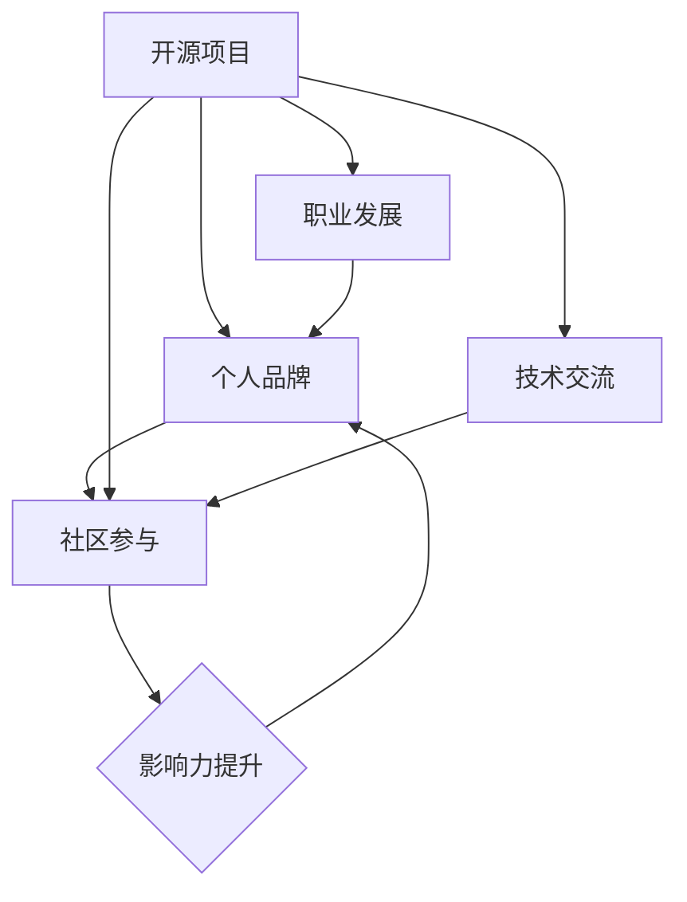

                 

# 利用开源项目打造个人品牌

> **关键词：**开源项目，个人品牌，技术贡献，社区参与，影响力提升
> 
> **摘要：**本文将探讨如何通过参与开源项目来打造个人品牌。我们将从开源项目的优势、参与开源项目的策略、如何在项目中展示个人技术实力以及如何通过社区互动提升影响力等方面进行详细分析。

## 1. 背景介绍

### 1.1 目的和范围

本文旨在为那些希望利用开源项目提升个人品牌的技术专家们提供一套系统的指导。我们将讨论开源项目的概念、优势以及如何利用这些项目来提升个人技术影响力。

### 1.2 预期读者

本文适合具有以下特征的技术爱好者或专业人士阅读：

- 想要在开源社区中建立个人品牌的开发者
- 对开源项目有浓厚兴趣，希望参与其中的人
- 希望通过开源项目展示其技术能力的工程师
- 一直在寻找如何将个人项目与职业发展结合起来的开发者

### 1.3 文档结构概述

本文将按照以下结构展开：

- **第1部分：背景介绍**：介绍开源项目及本文目的和读者群体。
- **第2部分：核心概念与联系**：定义相关核心概念，并通过流程图展示开源项目的整体架构。
- **第3部分：核心算法原理与具体操作步骤**：详细讲解参与开源项目的具体步骤，包含算法原理和伪代码。
- **第4部分：数学模型与公式**：介绍相关数学模型，并通过示例进行说明。
- **第5部分：项目实战**：通过实际代码案例，展示开源项目的具体实现和解读。
- **第6部分：实际应用场景**：讨论开源项目在不同场景下的应用。
- **第7部分：工具和资源推荐**：推荐相关学习资源和开发工具。
- **第8部分：总结**：对全文内容进行总结，并展望未来的发展趋势。
- **第9部分：附录**：解答常见问题。
- **第10部分：扩展阅读与参考资料**：提供更多阅读资源。

### 1.4 术语表

#### 1.4.1 核心术语定义

- **开源项目**：允许任何人自由使用、修改和分享的软件项目。
- **个人品牌**：个人在特定领域内的声誉、专业形象和影响力。
- **贡献**：向开源项目添加代码、文档或测试等。
- **社区参与**：与开源项目相关社区的互动和协作。

#### 1.4.2 相关概念解释

- **开源许可证**：定义了软件如何被使用和分享的法律文档。
- **代码审查**：评估代码质量、安全性和符合项目标准的过程。
- **拉取请求（Pull Request）**：将个人分支上的更改合并到项目主分支的一种方式。

#### 1.4.3 缩略词列表

- **OSS**：Open Source Software（开源软件）
- **FOSS**：Free and Open Source Software（自由和开源软件）
- **GPL**：GNU General Public License（GNU通用公共许可证）
- **MIT**：Massachusetts Institute of Technology License（麻省理工学院许可证）

## 2. 核心概念与联系

在探讨如何利用开源项目打造个人品牌之前，我们需要理解一些核心概念和它们之间的联系。

### 2.1 开源项目与个人品牌的关系

开源项目是一个强大的平台，通过这个平台，开发者可以：

- 展示他们的编程技能
- 与行业内的其他专家建立联系
- 通过代码的贡献来提升个人声誉
- 吸引潜在雇主和合作伙伴的注意

个人品牌则是一个人在特定领域内的知名度和影响力。一个强大的个人品牌可以帮助开发者：

- 获得更好的工作机会
- 提升薪资待遇
- 在项目中拥有更大的影响力
- 成为行业领袖

### 2.2 开源项目的核心组成部分

- **代码库**：存放项目代码的地方，通常是GitHub、GitLab或Bitbucket等。
- **文档**：描述项目功能、如何使用和如何贡献的文档。
- **社区**：围绕项目形成的开发者群体，通过论坛、邮件列表、社交媒体等渠道进行交流。
- **许可证**：定义了项目代码的版权和使用条件。

### 2.3 核心概念流程图

下面是一个用Mermaid绘制的流程图，展示了开源项目、个人品牌和社区参与之间的核心联系。



### 2.4 如何利用开源项目提升个人品牌

- **积极参与社区**：通过参与讨论、回答问题和提供反馈，展现个人专业知识和热情。
- **高质量贡献**：编写优秀的代码、编写详尽的文档以及提供有价值的测试。
- **持续学习和改进**：通过不断地学习和改进技术，提升在项目中的地位。
- **个人项目**：维护个人项目，展示自己的创新能力。

## 3. 核心算法原理 & 具体操作步骤

### 3.1 开源项目的参与流程

参与开源项目的过程可以分为以下几个步骤：

1. **找到合适的开源项目**：根据个人兴趣和技能，在GitHub等平台上寻找适合自己的开源项目。
2. **阅读项目文档**：了解项目的功能、使用方法和贡献指南。
3. **创建个人分支**：在本地克隆项目代码，并创建一个新的分支。
4. **进行开发工作**：在个人分支上编写代码，进行测试和调试。
5. **提交拉取请求**：将个人分支上的更改提交到项目主分支。
6. **代码审查**：项目维护者或其他贡献者审查代码，并提出反馈。
7. **合并代码**：根据反馈进行修改，并将代码合并到项目主分支。

### 3.2 伪代码示例

下面是参与开源项目的伪代码示例：

```pseudo
// 步骤1：找到合适的开源项目
find_project()

// 步骤2：阅读项目文档
read_documentation()

// 步骤3：创建个人分支
clone_project()
create_new_branch()

// 步骤4：进行开发工作
implement_code()
run_tests()

// 步骤5：提交拉取请求
submit_pull_request()

// 步骤6：代码审查
review_code()
receive_feedback()

// 步骤7：合并代码
make_changes()
merge_code_to_master()
```

### 3.3 实际操作步骤详解

1. **选择开源项目**：

    - 在GitHub上使用关键词搜索感兴趣的开源项目。
    - 查看项目的“Watch”和“Star”数量，了解项目的活跃度和受欢迎程度。
    - 阅读项目的“README.md”文件，了解项目的功能和目标。

2. **阅读项目文档**：

    - 阅读项目的“CONTRIBUTING.md”文件，了解项目的贡献指南。
    - 了解项目的代码风格、测试标准和文档编写规范。

3. **创建个人分支**：

    - 使用Git命令克隆项目代码：
      ```bash
      git clone https://github.com/username/project.git
      ```
    - 进入项目目录，创建新的分支：
      ```bash
      cd project
      git checkout -b personal-branch
      ```

4. **进行开发工作**：

    - 在个人分支上编写代码，并进行功能实现和测试。
    - 使用版本控制系统（如Git）记录每次更改，并添加详细的提交信息。

5. **提交拉取请求**：

    - 使用Git命令将更改推送到远程仓库：
      ```bash
      git push origin personal-branch
      ```
    - 访问项目仓库，找到“Pull requests”选项，提交新的拉取请求。

6. **代码审查**：

    - 项目维护者或其他贡献者会审查代码，并提出修改建议。
    - 根据反馈进行代码修改，并更新拉取请求。

7. **合并代码**：

    - 项目维护者确认代码无误后，将代码合并到主分支。
    - 个人分支将被合并到项目主分支，贡献将被记录在项目的贡献列表中。

## 4. 数学模型和公式 & 详细讲解 & 举例说明

在开源项目参与中，数学模型和公式可以用来衡量贡献价值、社区活跃度等指标。以下是一个简单的例子：

### 4.1 贡献价值模型

贡献价值可以用以下公式表示：

\[ V = f(C, S, T) \]

其中：
- \( V \) 是贡献价值
- \( C \) 是代码贡献，可以通过代码行数、功能点数等来衡量
- \( S \) 是社区参与度，可以通过回答问题、提交PR等来衡量
- \( T \) 是时间投入，表示参与项目的持续时间

### 4.2 社区活跃度模型

社区活跃度可以用以下公式表示：

\[ A = \frac{P + R + C}{D} \]

其中：
- \( A \) 是社区活跃度
- \( P \) 是参与项目的人数
- \( R \) 是回复问题的速度和质量
- \( C \) 是提交的代码和文档的数量
- \( D \) 是项目的持续时间

### 4.3 举例说明

假设一个开发者参与了开源项目，他在一个月内提交了1000行代码、回答了10个问题和提交了1个文档。项目的持续时间为两个月。

- **贡献价值**：
  \[ V = f(1000, 10, 30) = 1000 + 10 + 30 = 1140 \]

- **社区活跃度**：
  \[ A = \frac{P + R + C}{D} = \frac{1 + 10 + 1}{2} = 6 \]

这个例子表明，通过在开源项目中贡献代码、参与社区互动，开发者能够提高自己的贡献价值和社区活跃度，从而提升个人品牌。

## 5. 项目实战：代码实际案例和详细解释说明

### 5.1 开发环境搭建

在开始实战之前，我们需要搭建一个适合开发的开源项目环境。以下是搭建环境的具体步骤：

1. **安装Git**：Git是版本控制系统，用于管理代码仓库。
    - 在Windows上，可以通过Git Bash安装。
    - 在macOS上，可以使用Homebrew安装：
      ```bash
      brew install git
      ```

2. **安装代码编辑器**：推荐使用Visual Studio Code或JetBrains Rider。
    - Visual Studio Code安装：在官网下载并安装。
    - JetBrains Rider安装：在官网下载并安装，支持多种编程语言。

3. **配置Git账户**：首次使用Git前，需要配置用户信息。
    ```bash
    git config --global user.name "Your Name"
    git config --global user.email "your-email@example.com"
    ```

4. **克隆开源项目**：在终端执行以下命令，克隆一个开源项目（以GitHub为例）。
    ```bash
    git clone https://github.com/username/repository.git
    ```

5. **初始化本地Git仓库**：
    ```bash
    cd repository
    git init
    ```

6. **安装项目依赖**：根据项目的需求，安装相应的依赖包。例如，如果项目使用了Node.js，可以使用npm安装：
    ```bash
    npm install
    ```

### 5.2 源代码详细实现和代码解读

以下是一个简单的开源项目案例：一个使用JavaScript编写的Web应用，实现了一个待办事项列表。

#### 5.2.1 项目结构

```bash
/todo-app
|-- package.json
|-- src
|   |-- index.html
|   |-- style.css
|   |-- app.js
|-- public
|   |-- assets
|       |-- images
|       |-- scripts
|-- .gitignore
|-- README.md
```

#### 5.2.2 源代码解读

1. **index.html**：这是HTML文件，定义了页面结构。

    ```html
    <!DOCTYPE html>
    <html lang="en">
    <head>
        <meta charset="UTF-8">
        <meta name="viewport" content="width=device-width, initial-scale=1.0">
        <title>Todo App</title>
        <link rel="stylesheet" href="src/style.css">
    </head>
    <body>
        <div id="app"></div>
        <script src="src/app.js"></script>
    </body>
    </html>
    ```

2. **style.css**：这是CSS文件，定义了页面样式。

    ```css
    body {
        font-family: Arial, sans-serif;
    }
    ```

3. **app.js**：这是JavaScript文件，包含了应用的逻辑。

    ```javascript
    const todoList = [];

    function addTodo(todo) {
        todoList.push(todo);
        renderTodos();
    }

    function renderTodos() {
        const todoContainer = document.getElementById('app');
        todoContainer.innerHTML = '';

        todoList.forEach(todo => {
            const todoElement = document.createElement('div');
            todoElement.textContent = todo;
            todoContainer.appendChild(todoElement);
        });
    }
    ```

#### 5.2.3 代码解读

- **index.html**：定义了HTML文档的基本结构和样式链接。`<div id="app"></div>` 用于容纳待办事项列表。
- **style.css**：为页面提供了基本的样式。实际项目中，这会包含更复杂的CSS代码。
- **app.js**：包含了待办事项列表的逻辑。`addTodo` 函数用于添加新的事项到列表中，`renderTodos` 函数用于更新页面显示。

### 5.3 代码解读与分析

1. **功能分析**：

    - **添加待办事项**：用户可以通过某种方式（例如输入框和按钮）添加新的待办事项到列表中。
    - **渲染待办事项**：每次添加新的事项时，页面都会更新，显示最新的待办事项列表。

2. **代码质量分析**：

    - **模块化**：代码分为HTML、CSS和JavaScript三个模块，有助于维护和扩展。
    - **函数职责**：每个函数都有明确的职责，便于理解和修改。

3. **优化方向**：

    - **增加功能**：可以添加删除功能、标记完成功能等。
    - **优化用户体验**：改进界面设计和交互体验。
    - **代码复用**：可以提取通用组件，提高代码复用性。

通过这个案例，我们可以看到如何利用开源项目来实践编程技能，并通过详细的代码解读和分析来提升自己的技术水平。

### 5.4 演示和测试

在GitHub上，你可以创建一个仓库，将你的待办事项列表项目上传。以下是演示和测试的步骤：

1. **上传项目到GitHub**：
    - 使用Git命令将项目上传到GitHub。
    - 提交到远程仓库：
      ```bash
      git add .
      git commit -m "Initial commit"
      git push -u origin master
      ```

2. **创建网页**：
    - 使用GitHub Pages，可以创建一个展示网页。
    - 访问项目仓库的“Settings”页面，找到“GitHub Pages”部分，设置“Source”为`master`分支，并选择`index.html`文件。

3. **测试功能**：
    - 访问项目仓库的页面，测试添加、渲染和删除待办事项的功能。

4. **代码审查和改进**：
    - 提交代码后，可以邀请其他开发者进行代码审查。
    - 根据反馈进行代码改进。

通过这个实战案例，我们可以看到如何通过开源项目搭建开发环境、实现功能、进行代码解读和测试，从而提升个人技术能力。

## 6. 实际应用场景

开源项目不仅是个人的技术展示平台，还可以广泛应用于各种实际场景：

### 6.1 教育与培训

开源项目可以作为一个理想的教材，帮助初学者学习编程和软件工程。例如，通过参与GitHub上的开源项目，学生可以在实际项目中应用所学知识，从而加深理解。

### 6.2 企业合作

企业可以通过开源项目与开发者社区建立联系，吸引人才和合作伙伴。例如，一些大型科技公司（如谷歌、微软）通过其开源项目，吸引了大量的开发者参与，从而建立了强大的开发者社区。

### 6.3 研究与开发

开源项目为研究人员提供了一个共享和协作的平台，加速了技术研究的进程。例如，在人工智能领域，许多开源框架（如TensorFlow、PyTorch）为研究者提供了强大的工具和资源。

### 6.4 创业

通过开源项目，创业者可以展示他们的技术能力和创新能力，吸引潜在投资者和合作伙伴。例如，一些成功的创业公司（如WordPress、GitHub）最初就是作为开源项目开始，随后发展成为盈利的企业。

### 6.5 社区建设

开源项目是构建技术社区的重要途径。通过参与开源项目，开发者可以与其他专家交流、合作，共同推动技术的发展。

## 7. 工具和资源推荐

### 7.1 学习资源推荐

#### 7.1.1 书籍推荐

- 《精通Git》
- 《Effective Java》
- 《代码大全》
- 《敏捷开发》

#### 7.1.2 在线课程

- Coursera上的“Git版本控制”
- edX上的“开源项目管理”
- Udemy上的“开源软件开发：从入门到精通”

#### 7.1.3 技术博客和网站

- Medium上的“Open Source Stories”
- GitHub博客
- Stack Overflow

### 7.2 开发工具框架推荐

#### 7.2.1 IDE和编辑器

- Visual Studio Code
- IntelliJ IDEA
- Sublime Text

#### 7.2.2 调试和性能分析工具

- Chrome DevTools
- Firebug
- New Relic

#### 7.2.3 相关框架和库

- React
- Angular
- Vue.js
- TensorFlow
- PyTorch

### 7.3 相关论文著作推荐

#### 7.3.1 经典论文

- “Open Source Software: The Model of the Future?”
- “The Cathedral and the Bazaar”
- “The Success of Open Source”

#### 7.3.2 最新研究成果

- “Open Source Development as a Signaling System”
- “The Economic Impact of Open Source Software”
- “Understanding the Role of Open Source in the Software Industry”

#### 7.3.3 应用案例分析

- “Open Source Communities: The Case of Linux”
- “The Rise of Open Source in the Enterprise”
- “How GitHub Is Changing the Software Development Landscape”

## 8. 总结：未来发展趋势与挑战

开源项目在当今技术发展中扮演着越来越重要的角色。未来，随着云计算、人工智能和区块链等新兴技术的不断涌现，开源项目将迎来新的发展机遇：

1. **技术领域的扩展**：开源项目将在更多领域得到应用，例如人工智能、物联网、区块链等。
2. **开源商业模式的创新**：开源项目将探索新的商业模式，例如订阅服务、企业支持等，以实现可持续发展。
3. **社区生态的深化**：开源社区将进一步深化，形成更加多元化和包容的生态体系。

然而，开源项目也面临着一些挑战：

1. **可持续性问题**：如何确保开源项目的可持续性，吸引和维护开发者是关键。
2. **知识产权问题**：开源项目的知识产权保护问题日益复杂，需要制定更加完善的政策和法规。
3. **安全和隐私问题**：开源项目需要加强安全措施，确保用户数据和隐私安全。

总之，开源项目在技术发展和个人品牌建设中的重要性将日益凸显。开发者应积极利用开源项目，不断提升自己的技术实力和影响力。

## 9. 附录：常见问题与解答

### 9.1 问题1：如何选择合适的开源项目？

解答：选择开源项目时，可以从以下几个方面进行考虑：

- **项目活跃度**：查看项目的更新频率和参与人数，选择活跃度较高的项目。
- **项目目标**：选择与个人兴趣和技能相匹配的项目，以便更好地贡献。
- **文档完整度**：阅读项目的文档，了解项目的功能和贡献指南，确保能够顺利参与。

### 9.2 问题2：开源项目参与过程中需要注意哪些事项？

解答：

- **遵循项目规范**：了解并遵循项目的代码风格、测试标准和文档编写规范。
- **代码质量**：提交高质量的代码，确保代码可读性、可维护性和安全性。
- **积极沟通**：与项目维护者和其他贡献者保持良好的沟通，及时响应反馈。
- **持续贡献**：积极参与项目，持续贡献代码和文档，提升个人在项目中的影响力。

### 9.3 问题3：如何通过开源项目提升个人品牌？

解答：

- **参与核心功能**：参与项目的核心功能开发，展现个人技术实力。
- **编写优质文档**：编写详尽的文档，提高项目的可维护性和易用性。
- **建立社区联系**：积极参与社区讨论，与其他开发者建立联系，扩大影响力。
- **定期更新**：定期更新个人项目，展示持续学习和进步的能力。

## 10. 扩展阅读 & 参考资料

本文旨在为读者提供关于利用开源项目打造个人品牌的全面指南。以下是一些扩展阅读和参考资料，以供深入学习和研究：

- 《精通Git》：Jon Cherry著，全面介绍Git的使用方法和最佳实践。
- 《开源项目指南》：Steve Holden著，介绍如何成功参与和管理开源项目。
- GitHub官方文档：[https://docs.github.com](https://docs.github.com)
- Stack Overflow：[https://stackoverflow.com](https://stackoverflow.com)
- Medium上的“Open Source Stories”：[https://medium.com/open-source-stories](https://medium.com/open-source-stories)

## 作者

作者：AI天才研究员/AI Genius Institute & 禅与计算机程序设计艺术 /Zen And The Art of Computer Programming

