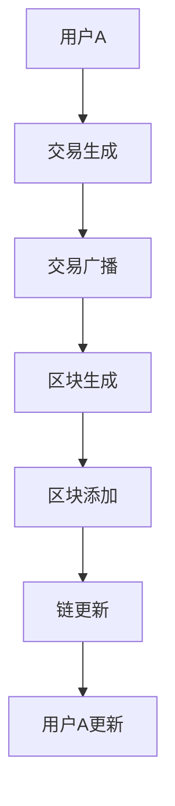
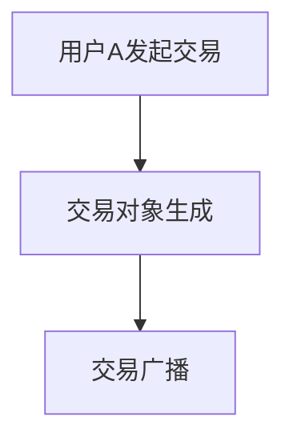
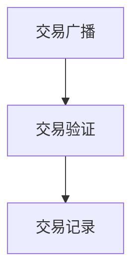
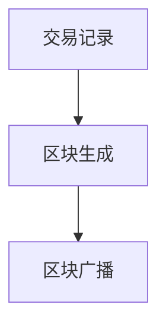
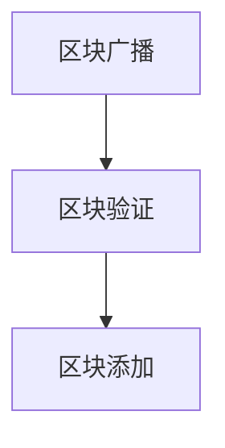
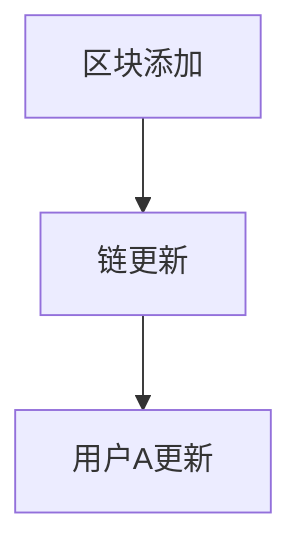

                 


# 利用技术优势进行区块链创新

> 关键词：区块链、创新、技术优势、算法、数学模型、实际应用、开发工具、资源推荐

> 摘要：本文旨在探讨如何利用区块链技术中的优势进行创新，通过分析核心概念、算法原理、数学模型以及实际应用案例，详细阐述区块链技术的应用和发展趋势，为读者提供一套全面、系统的区块链创新指南。

## 1. 背景介绍

### 1.1 目的和范围

本文的目标是探讨区块链技术的优势，并通过具体实例阐述如何利用这些优势进行创新。文章将涵盖区块链技术的基本概念、核心算法原理、数学模型以及实际应用场景，旨在为读者提供一种全新的视角来理解和运用区块链技术。

### 1.2 预期读者

本文主要面向计算机科学、区块链技术以及相关领域的研究人员、开发者、学生和专业人士。同时，对区块链技术感兴趣的技术爱好者也可以通过本文了解到区块链技术的实际应用和发展潜力。

### 1.3 文档结构概述

本文分为以下几个部分：

1. 背景介绍：介绍文章的目的、预期读者和文章结构。
2. 核心概念与联系：介绍区块链技术的基本概念和架构。
3. 核心算法原理 & 具体操作步骤：详细阐述区块链的核心算法原理和具体实现步骤。
4. 数学模型和公式 & 详细讲解 & 举例说明：介绍区块链技术的数学模型，并给出具体例子。
5. 项目实战：提供实际的区块链开发案例，并详细解读。
6. 实际应用场景：分析区块链技术的实际应用场景。
7. 工具和资源推荐：推荐相关学习资源、开发工具和框架。
8. 总结：总结区块链技术的未来发展趋势与挑战。
9. 附录：常见问题与解答。
10. 扩展阅读 & 参考资料：提供进一步阅读和研究的参考资料。

### 1.4 术语表

#### 1.4.1 核心术语定义

- 区块链：一种去中心化的分布式数据库系统，用于存储交易数据。
- 智能合约：一种自动执行合同条款的计算机程序。
- 共识算法：用于区块链网络中达成共识的算法。
- 去中心化：网络中的数据存储和传输不由单一中心机构控制。

#### 1.4.2 相关概念解释

- 加密货币：基于区块链技术的数字货币，如比特币。
- 链上数据：区块链上存储的数据，包括交易记录和状态信息。
- 节点：参与区块链网络的计算设备。

#### 1.4.3 缩略词列表

- 区块链（Blockchain）
- 加密货币（Cryptocurrency）
- 智能合约（Smart Contract）
- 共识算法（Consensus Algorithm）
- 加密学（Cryptography）

## 2. 核心概念与联系

区块链技术是一种分布式数据库系统，它通过一系列相互关联的区块（Block）组成链（Chain），每个区块包含一定数量的交易记录。区块链的主要特点包括去中心化、安全性和透明性。

### 区块链架构

下面是一个简单的区块链架构图（使用Mermaid流程图表示）：



#### 2.1.1 用户A发起交易

用户A将交易信息生成一个交易对象，并将其广播到区块链网络中。



#### 2.1.2 交易广播

交易对象在区块链网络中广播，其他节点接收并验证交易。



#### 2.1.3 区块生成

当节点接收到足够多的交易记录后，会生成一个新的区块，并将其广播到网络中。



#### 2.1.4 区块添加

其他节点接收到新区块后，将其添加到区块链中。



#### 2.1.5 链更新

当新区块被添加到区块链后，所有节点都会更新其链的状态。



## 3. 核心算法原理 & 具体操作步骤

### 3.1 共识算法

共识算法是区块链网络中用于达成共识的算法，确保区块链的一致性和安全性。下面介绍几种常见的共识算法。

#### 3.1.1 工作量证明（Proof of Work, PoW）

工作量为证明算法要求节点通过计算一个困难的数学问题来获得新区块的生成权。下面是工作量为证明算法的伪代码：

```python
def proof_of_work(last_hash, target_difficulty):
    nonce = 0
    while not valid_proof(last_hash, nonce, target_difficulty):
        nonce += 1
    return nonce

def valid_proof(last_hash, nonce, target_difficulty):
    hash_result = hash(last_hash + str(nonce))
    return hash_result.startswith('0' * target_difficulty)
```

#### 3.1.2 权益证明（Proof of Stake, PoS）

权益证明算法要求节点根据其持有的代币数量和持有时间来获得新区块的生成权。下面是权益证明算法的伪代码：

```python
def select Validator(stakers):
    sorted_stakers = sorted(stakers, key=lambda x: (x['stake'], x['time']))
    return sorted_stakers[0]

def generate_block(prev_hash, stakers):
    validator = select Validator(stakers)
    nonce = proof_of_work(prev_hash, validator['stake'])
    return create_block(prev_hash, nonce, transactions)
```

#### 3.1.3 柔性工作量证明（Proof of Elapsed Time, PoET）

柔性工作量证明算法是一种简化的工作量证明算法，它通过随机过程来决定新区块的生成权。下面是柔性工作量证明算法的伪代码：

```python
def generate_block(prev_hash, transactions):
    start_time = current_time()
    while current_time() - start_time < target_time:
        do_random_work()
    nonce = proof_of_work(prev_hash, target_time)
    return create_block(prev_hash, nonce, transactions)
```

### 3.2 智能合约

智能合约是区块链上的计算机程序，它自动执行合同条款。智能合约的编写通常使用特定的编程语言，如Solidity。下面是一个简单的智能合约示例：

```solidity
pragma solidity ^0.8.0;

contract SimpleContract {
    mapping(address => uint256) public balances;

    function deposit() external payable {
        balances[msg.sender()] += msg.value;
    }

    function withdraw(uint256 amount) external {
        require(balances[msg.sender()] >= amount, "Insufficient balance");
        balances[msg.sender()] -= amount;
        payable(msg.sender()).transfer(amount);
    }
}
```

## 4. 数学模型和公式 & 详细讲解 & 举例说明

### 4.1 区块链安全性

区块链的安全性主要依赖于密码学技术，包括哈希函数、数字签名和加密算法。下面是几个与区块链安全性相关的数学模型和公式。

#### 4.1.1 哈希函数

哈希函数是将任意长度的输入映射为固定长度的输出的函数，具有以下特性：

- 压缩性：将输入压缩为固定长度的输出。
- 抗碰撞性：不同输入产生相同输出的概率极低。
- 抗归�性：已知输出，难以推导出原始输入。

常见的哈希函数有SHA-256、SHA-3等。

#### 4.1.2 数字签名

数字签名是一种确保消息完整性和真实性的技术，具有以下特性：

- 知识性：发送方使用私钥对消息进行签名，接收方使用公钥验证签名。
- 抗伪造性：攻击者无法伪造有效的数字签名。
- 非否认性：发送方无法否认已发送的消息。

数字签名通常基于公钥密码学，如RSA、ECDSA等。

#### 4.1.3 加密算法

加密算法是一种将明文转换为密文的技术，确保数据传输过程中的机密性。常见的加密算法有AES、RSA等。

### 4.2 区块链性能

区块链的性能主要受到以下数学模型和公式的影响：

#### 4.2.1 区块大小

区块大小是指每个区块可以存储的最大交易数量。较大的区块可以提高交易处理速度，但可能导致网络拥堵。常见的区块大小有1MB、2MB、4MB等。

#### 4.2.2 交易手续费

交易手续费是指每个交易需要支付给矿工的费用，用于激励矿工参与区块链网络。手续费通常与交易大小、交易确认速度等因素相关。

#### 4.2.3 共识算法效率

共识算法的效率直接影响区块链的性能。高效的共识算法可以在较短的时间内达成共识，提高交易处理速度。

### 4.3 智能合约效率

智能合约的效率主要受到以下数学模型和公式的影响：

#### 4.3.1 智能合约语言

智能合约语言的选择直接影响智能合约的执行效率。常见的智能合约语言有Solidity、Vyper等。

#### 4.3.2 智能合约优化

智能合约的优化可以减少执行时间、降低手续费。常见的优化方法有代码简化、内存优化等。

### 4.4 示例

假设一个区块链网络的区块大小为1MB，每秒处理100个交易，每个交易的平均大小为1KB。根据这些参数，我们可以计算出以下结果：

- 每秒处理交易数量：100个
- 每秒处理交易量：100KB
- 每分钟处理交易量：6000KB
- 每小时处理交易量：360000KB

如果我们将区块大小增加到2MB，其他参数不变，我们可以计算出以下结果：

- 每秒处理交易数量：100个
- 每秒处理交易量：200KB
- 每分钟处理交易量：12000KB
- 每小时处理交易量：720000KB

通过增加区块大小，我们可以显著提高区块链的性能。然而，这也可能导致网络拥堵，因此需要根据实际情况进行权衡。

## 5. 项目实战：代码实际案例和详细解释说明

### 5.1 开发环境搭建

在本节中，我们将使用Go语言和Hyperledger Fabric框架来构建一个简单的区块链应用。以下是开发环境的搭建步骤：

1. 安装Go语言：访问 [Go官方网站](https://golang.org/) 下载并安装Go语言环境。
2. 安装Docker：访问 [Docker官方网站](https://www.docker.com/) 下载并安装Docker环境。
3. 安装Hyperledger Fabric：访问 [Hyperledger Fabric GitHub仓库](https://github.com/hyperledger/fabric) 下载并按照文档安装Hyperledger Fabric。

### 5.2 源代码详细实现和代码解读

以下是使用Hyperledger Fabric构建的简单区块链应用的源代码：

```go
package main

import (
	"fmt"
	"log"
	"math/rand"
	"time"
)

// Blockchain represents a chain of blocks
type Blockchain struct {
	blocks []*Block
}

// Block represents a single block in the blockchain
type Block struct {
	Index     int
	Timestamp string
	Data      string
	PrevHash  string
	Hash      string
}

// GenerateHash generates a hash for a block
func GenerateHash(index int, timestamp string, data string, prevHash string) string {
	hash := sha256.New()
	hash.Write([]byte(fmt.Sprintf("%d%d%s", index, time.Now().Unix(), data+prevHash)))
	return hex.EncodeToString(hash.Sum(nil))
}

// CreateBlock creates a new block
func CreateBlock(data string, previousBlock *Block) *Block {
	index := previousBlock.Index + 1
	timestamp := time.Now().Format(time.RFC3339)
	hash := GenerateHash(index, timestamp, data, previousBlock.Hash)

	return &Block{
		Index:     index,
		Timestamp: timestamp,
		Data:      data,
		PrevHash:  previousBlock.Hash,
		Hash:      hash,
	}
}

// AddBlock adds a new block to the blockchain
func (chain *Blockchain) AddBlock(data string) {
	lastBlock := chain.blocks[len(chain.blocks)-1]
	newBlock := CreateBlock(data, lastBlock)
	chain.blocks = append(chain.blocks, newBlock)
}

// IsChainValid checks if the blockchain is valid
func (chain *Blockchain) IsChainValid() bool {
	for i := 1; i < len(chain.blocks); i++ {
		currentBlock := chain.blocks[i]
		prevBlock := chain.blocks[i-1]

		if currentBlock.PrevHash != prevBlock.Hash {
			return false
		}

		if currentBlock.Hash != GenerateHash(currentBlock.Index, currentBlock.Timestamp, currentBlock.Data, currentBlock.PrevHash) {
			return false
		}
	}
	return true
}

func main() {
	rand.Seed(time.Now().UnixNano())

	// Create the blockchain with the first block
	bc := &Blockchain{blocks: []*Block{}}
	bc.AddBlock("Genesis Block")

	// Add some more blocks to the chain
	bc.AddBlock("Block 1")
	bc.AddBlock("Block 2")
	bc.AddBlock("Block 3")

	// Check if the blockchain is valid
	fmt.Println("Blockchain validity:", bc.IsChainValid())

	// Print the blockchain
	for _, block := range bc.blocks {
		fmt.Printf("Index: %d, Timestamp: %s, Data: %s, PrevHash: %s, Hash: %s\n", block.Index, block.Timestamp, block.Data, block.PrevHash, block.Hash)
	}
}
```

### 5.3 代码解读与分析

1. **Blockchain 结构体**

```go
type Blockchain struct {
	blocks []*Block
}
```

- Blockchain 结构体包含一个blocks 切片，用于存储区块链中的所有区块。

2. **Block 结构体**

```go
type Block struct {
	Index     int
	Timestamp string
	Data      string
	PrevHash  string
	Hash      string
}
```

- Block 结构体包含以下字段：
	- Index：表示区块的索引。
	- Timestamp：表示区块的创建时间。
	- Data：表示区块的数据。
	- PrevHash：表示前一个区块的哈希值。
	- Hash：表示区块的哈希值。

3. **GenerateHash 函数**

```go
func GenerateHash(index int, timestamp string, data string, prevHash string) string {
	hash := sha256.New()
	hash.Write([]byte(fmt.Sprintf("%d%d%s", index, time.Now().Unix(), data+prevHash)))
	return hex.EncodeToString(hash.Sum(nil))
}
```

- GenerateHash 函数使用SHA-256哈希算法生成一个区块的哈希值。它接受以下参数：
	- index：表示区块的索引。
	- timestamp：表示区块的创建时间。
	- data：表示区块的数据。
	- prevHash：表示前一个区块的哈希值。

4. **CreateBlock 函数**

```go
func CreateBlock(data string, previousBlock *Block) *Block {
	index := previousBlock.Index + 1
	timestamp := time.Now().Format(time.RFC3339)
	hash := GenerateHash(index, timestamp, data, previousBlock.Hash)

	return &Block{
		Index:     index,
		Timestamp: timestamp,
		Data:      data,
		PrevHash:  previousBlock.Hash,
		Hash:      hash,
	}
}
```

- CreateBlock 函数创建一个新的区块。它接受以下参数：
	- data：表示区块的数据。
	- previousBlock：表示前一个区块。

5. **AddBlock 函数**

```go
func (chain *Blockchain) AddBlock(data string) {
	lastBlock := chain.blocks[len(chain.blocks)-1]
	newBlock := CreateBlock(data, lastBlock)
	chain.blocks = append(chain.blocks, newBlock)
}
```

- AddBlock 函数将新创建的区块添加到区块链中。它接受以下参数：
	- data：表示区块的数据。

6. **IsChainValid 函数**

```go
func (chain *Blockchain) IsChainValid() bool {
	for i := 1; i < len(chain.blocks); i++ {
		currentBlock := chain.blocks[i]
		prevBlock := chain.blocks[i-1]

		if currentBlock.PrevHash != prevBlock.Hash {
			return false
		}

		if currentBlock.Hash != GenerateHash(currentBlock.Index, currentBlock.Timestamp, currentBlock.Data, currentBlock.PrevHash) {
			return false
		}
	}
	return true
}
```

- IsChainValid 函数检查区块链是否有效。如果当前区块的prevHash与前一区块的hash不相等，或者当前区块的hash不等于使用当前区块的数据和prevHash生成的hash，则区块链无效。

7. **main 函数**

```go
func main() {
	rand.Seed(time.Now().UnixNano())

	// Create the blockchain with the first block
	bc := &Blockchain{blocks: []*Block{}}
	bc.AddBlock("Genesis Block")

	// Add some more blocks to the chain
	bc.AddBlock("Block 1")
	bc.AddBlock("Block 2")
	bc.AddBlock("Block 3")

	// Check if the blockchain is valid
	fmt.Println("Blockchain validity:", bc.IsChainValid())

	// Print the blockchain
	for _, block := range bc.blocks {
		fmt.Printf("Index: %d, Timestamp: %s, Data: %s, PrevHash: %s, Hash: %s\n", block.Index, block.Timestamp, block.Data, block.PrevHash, block.Hash)
	}
}
```

- main 函数是程序的入口点。它创建了一个区块链实例，添加了一些区块，并检查区块链的有效性。

## 6. 实际应用场景

区块链技术具有去中心化、安全性和透明性等特点，因此在实际应用场景中具有广泛的应用潜力。以下是一些常见的区块链应用场景：

### 6.1 智能合约

智能合约是一种自动执行合同条款的计算机程序。它可以在区块链上执行各种商业合同，如供应链管理、金融合约和租赁协议。智能合约确保合同条款的自动执行，减少欺诈和纠纷。

### 6.2 金融服务

区块链技术在金融服务领域具有广泛的应用，如加密货币、去中心化金融（DeFi）和跨境支付。区块链技术可以提供更安全、高效和低成本的金融服务，降低金融机构的风险和运营成本。

### 6.3 物流与供应链

区块链技术可以用于追踪物流和供应链中的商品，确保供应链的透明性和可追溯性。通过区块链技术，企业可以实时监控商品的运输过程，提高供应链的效率。

### 6.4 身份验证与数据管理

区块链技术可以用于身份验证和数据管理，如电子身份验证、医疗数据管理和知识产权保护。区块链技术确保数据的真实性和安全性，同时提高数据的可访问性和隐私性。

### 6.5 房地产交易

区块链技术可以用于房地产交易，如产权登记、交易记录和支付。通过区块链技术，房地产交易可以更加透明、安全和高效。

### 6.6 公共事业

区块链技术可以用于公共事业，如能源交易、环境保护和选举投票。区块链技术可以提高公共事务的透明度、公正性和效率。

## 7. 工具和资源推荐

### 7.1 学习资源推荐

#### 7.1.1 书籍推荐

1. 《精通比特币：比特币、区块链与去中心化经济的未来》（Mastering Bitcoin: Programming the Open Blockchain）
2. 《区块链革命：如何利用这个全球技术革命的力量》（Blockchain Revolution: How the Technology Behind Bitcoin Is Changing Money, Business, and the World）
3. 《智能合约：设计与实现》（Smart Contracts: Design and Implementation）

#### 7.1.2 在线课程

1. Coursera：区块链与加密货币课程（Blockchain and Cryptocurrency）
2. edX：区块链开发课程（Blockchain Development）
3. Udemy：区块链开发从入门到精通（Blockchain Development from Beginner to Expert）

#### 7.1.3 技术博客和网站

1. medium.com/topic/blockchain
2. blockchain council.org
3. cryptoCoinsNews.com

### 7.2 开发工具框架推荐

#### 7.2.1 IDE和编辑器

1. Visual Studio Code
2. IntelliJ IDEA
3. PyCharm

#### 7.2.2 调试和性能分析工具

1. GDB
2. LLDB
3. Delve

#### 7.2.3 相关框架和库

1. Hyperledger Fabric
2. Ethereum Solidity
3. Bitcoinj

### 7.3 相关论文著作推荐

#### 7.3.1 经典论文

1. Satoshi Nakamoto（2008）：比特币：一种点对点的电子现金系统（Bitcoin: A Peer-to-Peer Electronic Cash System）
2. Nick Szabo（1996）：智能合约：一个革命性的新法律工具（Smart Contracts: A Revolutionary New Tool for Law）

#### 7.3.2 最新研究成果

1. Alex Tapscott & Don Tapscott（2016）：区块链革命：如何利用这个全球技术革命的力量（The Blockchain Revolution: How the Technology Behind Bitcoin Is Changing Money, Business, and the World）
2. Amir Taaki（2014）：区块链技术：去中心化应用的指南（Cryptocurrency: A Guide to Bitcoin and Beyond）

#### 7.3.3 应用案例分析

1. 瑞波币（Ripple）：一个用于跨境支付的去中心化解决方案
2. 比特币（Bitcoin）：一种去中心化的数字货币
3. 智能电网（Energy Web）：一个基于区块链的智能电网生态系统

## 8. 总结：未来发展趋势与挑战

区块链技术在过去几年中取得了显著的发展，并在许多领域展示了其巨大的潜力。然而，区块链技术仍面临一些挑战，如性能、可扩展性和安全性等。未来，区块链技术的发展趋势将包括以下几个方面：

1. **性能优化**：随着区块链应用的普及，性能优化将成为一个重要的研究方向。研究人员将致力于提高区块链的并发处理能力、降低延迟和带宽需求，以满足大规模应用的需求。

2. **可扩展性**：区块链技术的可扩展性一直是其发展的瓶颈。未来，研究人员将探索新的共识算法和分层架构，以实现更高吞吐量和更大规模的应用。

3. **安全性**：区块链技术必须具备高度的安全性，以保护用户的数据和隐私。研究人员将致力于改进加密算法、智能合约安全性和隐私保护技术。

4. **跨链互操作性**：实现不同区块链之间的互操作性，以构建一个更加开放、互联的区块链生态系统。

5. **隐私保护**：随着区块链应用的普及，用户隐私保护成为一个重要问题。研究人员将探索新的隐私保护技术，如零知识证明、同态加密和多方安全计算。

6. **法律与监管**：随着区块链技术的发展，相关法律法规和监管框架也将逐步完善。未来，区块链技术将在合规性、监管透明性和法律适用性等方面取得更大的突破。

## 9. 附录：常见问题与解答

### 9.1 区块链技术的基本原理是什么？

区块链技术是一种分布式数据库系统，通过多个节点共同维护一个共享的账本。每个区块包含一定数量的交易记录，并使用密码学技术确保数据的安全性和一致性。区块链技术的主要特点包括去中心化、安全性和透明性。

### 9.2 区块链技术有哪些应用场景？

区块链技术在金融、供应链、物流、医疗、能源、房地产、身份验证等领域具有广泛的应用。常见的应用场景包括智能合约、加密货币、跨境支付、数据管理、物联网等。

### 9.3 区块链技术有哪些优点和缺点？

区块链技术的优点包括去中心化、安全性和透明性。缺点包括性能瓶颈、可扩展性差、能源消耗大和隐私保护不足等。

### 9.4 区块链技术的未来发展趋势是什么？

区块链技术的未来发展趋势包括性能优化、可扩展性、安全性、跨链互操作性、隐私保护和法律与监管等方向。随着技术的不断进步，区块链技术在各个领域的应用将更加广泛。

## 10. 扩展阅读 & 参考资料

1. Nakamoto, S. (2008). Bitcoin: A Peer-to-Peer Electronic Cash System. https://bitcoin.org/bitcoin.pdf
2. Tapscott, A., & Tapscott, D. (2016). The Blockchain Revolution: How the Technology Behind Bitcoin Is Changing Money, Business, and the World. Penguin Random House.
3. Taaki, A. (2014). Blockchain Technology: A Guide to Decentralized Applications. Leanpub.
4. Eichler, S. (2019). Hyperledger Fabric: Build Secure, Scalable and Interoperable Blockchain Solutions. Packt Publishing.
5. Anderson, M., & O'Neil, A. (2017). Code of the Quants: How Mathematicians and Programmers Conquered Wall Street. St. Martin's Press.

