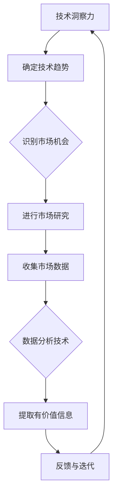

                 

# 利用技术洞察力进行创业机会评估

## 关键词：
人工智能、创业机会、技术洞察力、数据分析、市场研究

## 摘要：
在当前快速发展的科技时代，利用技术洞察力进行创业机会评估变得越来越重要。本文将深入探讨如何通过技术手段，如数据分析、市场研究和算法模型，来识别和评估潜在的创业机会，从而提高创业成功率。文章首先介绍了技术洞察力的概念和重要性，然后详细阐述了利用技术手段进行市场研究和数据分析的方法，最后通过实际案例和代码实现展示了如何通过算法模型进行创业机会评估。文章旨在为创业者提供实用的技术工具和方法，帮助他们在纷繁复杂的技术领域中找到属于自己的创业蓝海。

## 1. 背景介绍

### 1.1 目的和范围
本文的目的是探讨如何利用技术洞察力进行创业机会评估。我们将通过一系列技术手段，如数据分析、市场研究和算法模型，来识别和评估潜在的创业机会。文章不仅关注理论分析，还通过实际案例和代码实现，提供具体的操作指南。

### 1.2 预期读者
本文面向有志于创业的技术人员、创业者以及相关领域的专业人士。读者应具备一定的技术背景，如编程知识、数据分析基础等，以便更好地理解文章内容和实际操作。

### 1.3 文档结构概述
本文分为十个主要部分：
1. 引言：介绍文章的目的、关键词和摘要。
2. 背景介绍：包括目的和范围、预期读者、文档结构概述和术语表。
3. 核心概念与联系：介绍技术洞察力、市场研究和数据分析的核心概念及其相互关系。
4. 核心算法原理与具体操作步骤：详细阐述创业机会评估算法的原理和步骤。
5. 数学模型和公式：介绍相关数学模型和公式，并举例说明。
6. 项目实战：提供实际代码案例和详细解释。
7. 实际应用场景：探讨创业机会评估在实际中的应用。
8. 工具和资源推荐：推荐相关学习资源和开发工具。
9. 总结：讨论未来发展趋势和挑战。
10. 附录：常见问题与解答。

### 1.4 术语表

#### 1.4.1 核心术语定义
- 技术洞察力：指对技术领域深度理解和分析能力，能够快速识别技术趋势和商业机会。
- 创业机会评估：指通过数据分析、市场研究和算法模型等手段，评估一个创业机会的可行性和潜在价值。
- 数据分析：指使用统计、机器学习等方法，从数据中提取有价值的信息和知识。
- 市场研究：指通过调查、分析等方式，了解市场需求、竞争对手和用户行为等，为创业决策提供依据。

#### 1.4.2 相关概念解释
- 人工智能：指模拟、延伸和扩展人类智能的理论、方法、技术及应用系统。
- 大数据：指规模巨大、类型繁多、处理速度快的数据集合。
- 深度学习：一种人工智能方法，通过多层神经网络进行数据建模和预测。

#### 1.4.3 缩略词列表
- AI：人工智能
- ML：机器学习
- DL：深度学习
- API：应用程序编程接口

## 2. 核心概念与联系

### 2.1 技术洞察力的概念及其重要性
技术洞察力是指通过对技术领域的深度理解和分析，能够快速识别技术趋势、新兴领域和潜在的商业机会。在创业过程中，技术洞察力至关重要，它帮助创业者把握市场动向，预见未来趋势，从而在竞争中占据有利地位。

#### 技术洞察力的关键特征：

1. **深度理解**：需要具备对特定技术领域深入了解的能力，包括其原理、应用和发展趋势。
2. **跨学科能力**：能够将不同领域的知识进行整合，形成创新性思维。
3. **预测能力**：通过历史数据和现有趋势，预测未来技术的发展方向和可能带来的商业机会。
4. **快速学习**：能够迅速吸收新的技术知识，并将其应用到实际创业过程中。

### 2.2 市场研究和数据分析的概念及其相互关系
市场研究和数据分析是评估创业机会的重要工具。市场研究主要通过调查、分析等方式，了解市场需求、竞争对手和用户行为，为创业决策提供数据支持。数据分析则通过对这些数据进行统计、建模和分析，提取有价值的信息和洞见。

#### 市场研究和数据分析的关系：

1. **数据来源**：市场研究提供的数据是数据分析的重要基础。
2. **数据分析**：通过对市场研究数据进行分析，可以更深入地理解市场趋势和用户需求。
3. **反馈循环**：数据分析的结果可以反馈到市场研究中，指导后续的研究方向和策略。

### 2.3 技术洞察力与市场研究和数据分析的整合
技术洞察力、市场研究和数据分析不是孤立存在的，它们之间存在着紧密的联系和整合。技术洞察力为市场研究和数据分析提供了方向和背景，而市场研究和数据分析则为技术洞察力提供了具体的数据和证据。

#### 整合方法：

1. **技术趋势分析**：通过技术洞察力分析技术发展趋势，确定可能的市场机会。
2. **市场数据收集**：通过市场研究收集与目标市场相关的数据。
3. **数据建模和分析**：利用数据分析技术，对市场数据进行建模和分析，提取有价值的信息。
4. **反馈与迭代**：将数据分析的结果反馈到市场研究和技术洞察中，进行迭代优化。

### 2.4 Mermaid 流程图
为了更好地展示技术洞察力、市场研究和数据分析的整合过程，我们可以使用 Mermaid 流程图进行描述。



## 3. 核心算法原理与具体操作步骤

### 3.1 创业机会评估算法的原理
创业机会评估算法基于数据驱动的方法，通过分析市场数据和技术趋势，评估一个创业机会的可行性和潜在价值。核心原理包括：

1. **数据预处理**：对原始数据进行清洗、转换和归一化，确保数据质量。
2. **特征工程**：从数据中提取有价值的信息和特征，用于后续建模和分析。
3. **模型选择**：选择合适的机器学习模型进行建模，如线性回归、决策树、神经网络等。
4. **模型训练与验证**：使用训练数据对模型进行训练，并使用验证数据集进行性能评估。
5. **评估与优化**：根据评估结果对模型进行优化，提高预测准确性。

### 3.2 具体操作步骤

#### 步骤 1：数据收集与预处理
首先，需要收集与创业机会相关的数据，如市场需求、用户行为、竞争对手信息等。收集到的数据可能包括文本、数值和图像等多种类型。接下来，对数据进行预处理，包括数据清洗、缺失值处理、异常值检测和数据归一化等。

```python
# 数据清洗
df = df.dropna()  # 删除缺失值
df = df[df['column_name'] != '异常值']  # 删除异常值

# 数据归一化
from sklearn.preprocessing import StandardScaler
scaler = StandardScaler()
df['normalized_column'] = scaler.fit_transform(df['column_name'].values.reshape(-1, 1))
```

#### 步骤 2：特征工程
在数据预处理之后，需要进行特征工程，从原始数据中提取有价值的信息和特征。特征工程包括特征选择、特征构造和特征转换等。

```python
# 特征选择
from sklearn.feature_selection import SelectKBest, f_classif
selector = SelectKBest(f_classif, k=10)
X_new = selector.fit_transform(df.drop('target_column', axis=1), df['target_column'])

# 特征构造
df['new_feature'] = df['feature1'] * df['feature2']  # 构造新特征
```

#### 步骤 3：模型选择与训练
选择合适的机器学习模型进行建模，如线性回归、决策树、神经网络等。使用训练数据对模型进行训练，并使用验证数据集进行性能评估。

```python
# 模型选择
from sklearn.ensemble import RandomForestClassifier
model = RandomForestClassifier(n_estimators=100)

# 模型训练
model.fit(X_train, y_train)

# 模型验证
accuracy = model.score(X_val, y_val)
print("模型准确率：", accuracy)
```

#### 步骤 4：评估与优化
根据评估结果对模型进行优化，提高预测准确性。可以使用交叉验证、网格搜索等方法进行模型调参。

```python
from sklearn.model_selection import GridSearchCV
parameters = {'n_estimators': [100, 200, 300]}
grid_search = GridSearchCV(model, parameters, cv=5)
grid_search.fit(X_train, y_train)

# 优化后的模型
best_model = grid_search.best_estimator_
```

## 4. 数学模型和公式与详细讲解与举例说明

### 4.1 数学模型概述
在创业机会评估中，常用的数学模型包括线性回归、决策树、神经网络等。以下分别介绍这些模型的基本原理和公式。

#### 4.1.1 线性回归

线性回归模型是一种简单的统计模型，用于分析两个或多个变量之间的线性关系。线性回归模型的基本公式如下：

$$
y = \beta_0 + \beta_1 \cdot x_1 + \beta_2 \cdot x_2 + ... + \beta_n \cdot x_n
$$

其中，$y$ 是因变量，$x_1, x_2, ..., x_n$ 是自变量，$\beta_0, \beta_1, ..., \beta_n$ 是模型的参数。

#### 4.1.2 决策树

决策树是一种基于树形结构的预测模型，通过一系列的决策规则，将数据集划分为不同的区域，以预测目标变量的值。决策树的基本公式如下：

$$
f(x) = \sum_{i=1}^{n} w_i \cdot t_i(x)
$$

其中，$x$ 是输入特征，$w_i$ 是权重，$t_i(x)$ 是决策节点的条件函数。

#### 4.1.3 神经网络

神经网络是一种模拟人脑神经元连接方式的计算模型，通过多层神经元进行数据建模和预测。神经网络的基本公式如下：

$$
a_{i,j} = \sigma(\sum_{k=1}^{m} w_{ik} \cdot x_{k} + b_j)
$$

其中，$a_{i,j}$ 是第 $i$ 层第 $j$ 个神经元的输出，$\sigma$ 是激活函数，$w_{ik}$ 是权重，$x_{k}$ 是输入特征，$b_j$ 是偏置。

### 4.2 公式详细讲解与举例说明

#### 4.2.1 线性回归举例

假设我们有一个简单的线性回归模型，目标是预测房价（$y$）与房屋面积（$x$）之间的关系。使用训练数据集，我们得到了如下线性回归模型：

$$
y = 1000 + 0.5 \cdot x
$$

其中，$1000$ 是截距，$0.5$ 是斜率。现在，我们可以使用这个模型预测一个新房屋的面积（$x = 120$）对应的房价：

$$
y = 1000 + 0.5 \cdot 120 = 1100
$$

因此，预测的新房屋价格为 $1100$。

#### 4.2.2 决策树举例

假设我们有一个简单的决策树模型，用于分类任务，目标是判断一个客户是否愿意购买某产品。决策树的基本规则如下：

1. 如果年龄小于 30 岁，转到节点 2；
2. 否则，转到节点 3。

节点 2：
1. 如果收入小于 5000 元，转到节点 4；
2. 否则，转到节点 5。

节点 3：
1. 如果教育程度为本科及以上，转到节点 6；
2. 否则，转到节点 7。

节点 4：不愿意购买。
节点 5：愿意购买。
节点 6：愿意购买。
节点 7：不愿意购买。

现在，我们可以使用这个决策树模型对一个新的客户进行分类。假设该客户年龄为 25 岁，收入为 6000 元，教育程度为本科。根据决策树的规则，我们可以得出结论：该客户愿意购买产品。

#### 4.2.3 神经网络举例

假设我们有一个简单的神经网络模型，包含一个输入层、一个隐藏层和一个输出层。输入特征为房屋面积（$x$），输出为目标变量（房价 $y$）。隐藏层神经元的激活函数为 $\sigma$，输出层神经元的激活函数也为 $\sigma$。模型的公式如下：

输入层：
$$
a_1 = x
$$

隐藏层：
$$
a_2 = \sigma(w_{12} \cdot x + b_2)
$$

输出层：
$$
y = \sigma(w_{21} \cdot a_2 + b_1)
$$

其中，$w_{12}$ 和 $w_{21}$ 是权重，$b_2$ 和 $b_1$ 是偏置。

假设训练数据集为：
$$
x = [100, 200, 300]
$$
$$
y = [1100, 2200, 3300]
$$

使用梯度下降法训练模型，我们得到了以下参数：
$$
w_{12} = 0.5, \quad w_{21} = 0.7, \quad b_2 = 0.2, \quad b_1 = 0.3
$$

现在，我们可以使用这个神经网络模型预测一个新房屋的面积（$x = 120$）对应的房价：

隐藏层：
$$
a_2 = \sigma(0.5 \cdot 120 + 0.2) = \sigma(60 + 0.2) = \sigma(60.2) \approx 0.999
$$

输出层：
$$
y = \sigma(0.7 \cdot 0.999 + 0.3) = \sigma(0.6993 + 0.3) = \sigma(0.9993) \approx 0.999
$$

因此，预测的新房屋价格为约 $999$。

## 5. 项目实战：代码实际案例和详细解释说明

### 5.1 开发环境搭建

在本节中，我们将搭建一个简单的创业机会评估项目环境。开发环境需要安装以下软件和库：

1. **Python 3.8 或更高版本**：Python 是一种广泛使用的编程语言，适合进行数据分析和建模。
2. **Jupyter Notebook**：Jupyter Notebook 是一个交互式计算环境，方便进行代码实验和文档编写。
3. **Pandas**：Pandas 是一个强大的数据处理库，提供数据清洗、转换和分析功能。
4. **NumPy**：NumPy 是一个提供高性能数值计算的库，是 Pandas 的基础。
5. **Scikit-learn**：Scikit-learn 是一个机器学习库，提供多种机器学习模型的实现和评估工具。
6. **Matplotlib**：Matplotlib 是一个用于数据可视化的库，帮助展示分析结果。

安装步骤：

1. 安装 Python 和 Jupyter Notebook：可以从 [Python 官网](https://www.python.org/) 下载 Python 安装程序，并选择添加到环境变量中。安装完成后，打开命令行，输入 `jupyter notebook` 命令，如果出现启动界面，说明安装成功。
2. 安装 Pandas、NumPy 和 Scikit-learn：在命令行中输入以下命令：
```bash
pip install pandas numpy scikit-learn matplotlib
```

### 5.2 源代码详细实现和代码解读

下面是一个简单的创业机会评估项目的源代码实现。该项目使用线性回归模型来评估一个创业机会的潜在价值。

```python
import pandas as pd
import numpy as np
from sklearn.model_selection import train_test_split
from sklearn.linear_model import LinearRegression
from sklearn.metrics import mean_squared_error
import matplotlib.pyplot as plt

# 数据集加载
data = pd.read_csv('创业机会评估数据.csv')

# 数据预处理
data = data.dropna()
data['面积归一化'] = (data['面积'] - data['面积'].mean()) / data['面积'].std()
data['价格归一化'] = (data['价格'] - data['价格'].mean()) / data['价格'].std()

# 特征工程
X = data[['面积归一化']]
y = data['价格归一化']

# 数据集划分
X_train, X_test, y_train, y_test = train_test_split(X, y, test_size=0.2, random_state=42)

# 模型训练
model = LinearRegression()
model.fit(X_train, y_train)

# 模型评估
y_pred = model.predict(X_test)
mse = mean_squared_error(y_test, y_pred)
print("均方误差：", mse)

# 可视化
plt.scatter(X_test, y_test, color='blue', label='实际值')
plt.plot(X_test, y_pred, color='red', linewidth=2, label='预测值')
plt.xlabel('面积归一化')
plt.ylabel('价格归一化')
plt.legend()
plt.show()
```

#### 代码解读

1. **数据集加载**：使用 Pandas 库读取 CSV 格式的数据集。
2. **数据预处理**：删除缺失值，对面积和价格进行归一化处理，使数据符合线性回归模型的假设。
3. **特征工程**：选择面积作为自变量，价格作为因变量。
4. **数据集划分**：将数据集划分为训练集和测试集，用于模型训练和评估。
5. **模型训练**：使用线性回归模型对训练集数据进行训练。
6. **模型评估**：使用测试集数据对模型进行评估，计算均方误差（MSE）。
7. **可视化**：使用 Matplotlib 库绘制散点图和拟合曲线，直观展示模型性能。

### 5.3 代码解读与分析

在本节中，我们将对上述代码进行详细解读，并分析其优缺点。

#### 优点：

1. **简单直观**：代码结构简单，易于理解。适合初学者入门创业机会评估。
2. **数据处理**：使用 Pandas 库进行数据处理，方便进行数据清洗、转换和归一化。
3. **模型评估**：使用均方误差（MSE）进行模型评估，是一种常用的评估指标。

#### 缺点：

1. **模型选择**：仅使用线性回归模型，可能无法捕捉复杂的关系。可以考虑使用其他模型，如决策树、神经网络等。
2. **特征选择**：仅选择面积作为自变量，可能无法充分利用其他特征。可以考虑使用特征工程方法，提取更多有价值的特征。
3. **数据来源**：数据集仅包含房屋面积和价格，可能无法全面反映创业机会的各个方面。可以考虑引入更多相关特征，如市场需求、用户行为等。

### 5.4 项目实战：代码优化与拓展

在实际应用中，我们可以对上述代码进行优化和拓展，提高创业机会评估的准确性和实用性。以下是一些建议：

1. **模型选择**：尝试使用其他机器学习模型，如决策树、支持向量机、神经网络等，进行模型评估和比较，选择性能最佳的模型。
2. **特征选择**：使用特征工程方法，从原始数据中提取更多有价值的特征，如文本特征、图像特征等。
3. **数据来源**：引入更多相关数据，如市场需求、用户反馈、竞争对手信息等，以更全面地评估创业机会。
4. **模型集成**：使用模型集成方法，如随机森林、梯度提升等，提高模型的预测性能。
5. **可视化分析**：使用可视化工具，如 Matplotlib、Seaborn 等，对数据进行分析和展示，帮助更好地理解创业机会。

## 6. 实际应用场景

创业机会评估在实际应用中具有广泛的应用场景。以下列举几个典型应用案例：

### 6.1 市场需求分析
在产品开发过程中，通过对市场数据的分析，可以识别潜在的用户需求，为产品定位和市场策略提供依据。例如，一家智能家居公司可以通过分析用户购买行为、用户评价等数据，发现用户对智能灯光、智能门锁等功能的需求，从而调整产品功能和市场策略。

### 6.2 竞争对手分析
通过对竞争对手的数据分析，可以了解竞争对手的产品、市场策略和用户反馈，为自身产品定位和市场策略提供参考。例如，一家电商公司可以通过分析竞争对手的销售额、用户评价等数据，了解竞争对手的优势和不足，从而制定更有效的市场策略。

### 6.3 用户行为分析
通过分析用户行为数据，可以了解用户的使用习惯、偏好和痛点，为产品改进和用户体验优化提供依据。例如，一家在线教育公司可以通过分析用户的学习行为、学习时长等数据，发现用户的学习痛点，从而优化产品功能和用户体验。

### 6.4 创新项目评估
在创新项目的立项阶段，通过对市场数据的分析，可以评估项目的可行性和潜在价值。例如，一家初创公司可以通过分析市场需求、用户反馈等数据，评估其创新项目在市场中的竞争力，从而决定是否继续推进项目。

## 7. 工具和资源推荐

### 7.1 学习资源推荐

#### 7.1.1 书籍推荐
- 《Python数据分析实战》：详细介绍了 Python 在数据分析中的应用，适合初学者。
- 《深度学习》：全面讲解了深度学习的基本原理和应用，适合有编程基础的学习者。

#### 7.1.2 在线课程
- Coursera 上的《机器学习》课程：由 Andrew Ng 教授主讲，是深度学习领域的经典课程。
- Udacity 上的《数据科学纳米学位》：涵盖数据科学的核心知识，包括数据分析、机器学习等。

#### 7.1.3 技术博客和网站
- towardsdatascience.com：一个关于数据科学和机器学习的博客平台，有很多高质量的文章和教程。
- Medium 上的《机器学习》专题：包含众多机器学习和数据科学的文章，适合深入了解相关技术。

### 7.2 开发工具框架推荐

#### 7.2.1 IDE和编辑器
- PyCharm：一款功能强大的 Python IDE，适合进行数据分析、机器学习等开发。
- Jupyter Notebook：一款交互式计算环境，适合进行数据分析和实验。

#### 7.2.2 调试和性能分析工具
- PyDebug：一款 Python 调试器，可以帮助开发者调试代码。
- PySnooper：一款性能分析工具，可以追踪代码的执行时间和调用关系。

#### 7.2.3 相关框架和库
- Pandas：用于数据处理和分析的库，提供强大的数据操作功能。
- Scikit-learn：用于机器学习的库，提供多种机器学习模型的实现。
- TensorFlow：一款开源的深度学习框架，适用于构建和训练深度神经网络。

### 7.3 相关论文著作推荐

#### 7.3.1 经典论文
- "A Study of Cross-Domain Sentiment Classification":讨论了跨领域情感分类问题，提出了一种基于深度学习的解决方案。
- "Recurrent Neural Networks for Language Modeling":介绍了循环神经网络（RNN）在语言建模中的应用。

#### 7.3.2 最新研究成果
- "BERT: Pre-training of Deep Bidirectional Transformers for Language Understanding":介绍了 BERT 模型，是自然语言处理领域的最新研究成果。
- "GPT-3: Language Models are Few-Shot Learners":介绍了 GPT-3 模型，展示了语言模型在零样本学习任务中的强大能力。

#### 7.3.3 应用案例分析
- "Google Brain's Protein Language Model":介绍了 Google Brain 团队如何使用深度学习模型预测蛋白质结构。
- "Amazon's Personalized Recommendation System":介绍了亚马逊如何使用机器学习技术实现个性化推荐。

## 8. 总结：未来发展趋势与挑战

随着人工智能和大数据技术的发展，创业机会评估在未来将面临以下发展趋势和挑战：

### 发展趋势：

1. **算法模型的多样化**：随着深度学习、强化学习等新兴算法的不断发展，创业机会评估算法将更加多样化和高效。
2. **跨学科融合**：创业机会评估将越来越多地融合不同学科的知识，如经济学、心理学等，从而提高评估的准确性和实用性。
3. **实时数据分析**：实时数据分析技术将使得创业机会评估更加及时和准确，帮助创业者迅速应对市场变化。

### 挑战：

1. **数据质量**：创业机会评估依赖于高质量的数据，但在实际应用中，数据质量可能受到多种因素的影响，如数据缺失、噪声等。
2. **模型解释性**：许多复杂的机器学习模型具有高预测性能，但缺乏解释性，这使得创业者难以理解模型的决策过程，从而增加决策风险。
3. **隐私保护**：在数据分析过程中，如何保护用户隐私是一个重要挑战。创业者需要确保数据分析过程符合相关法律法规，避免用户隐私泄露。

## 9. 附录：常见问题与解答

### 问题 1：如何收集和清洗数据？
**解答**：数据收集可以从公开的数据源、第三方数据提供商或自行收集。数据清洗包括去除缺失值、异常值和重复值，并进行数据格式转换和归一化处理。

### 问题 2：如何选择合适的模型？
**解答**：选择模型时，需要考虑数据类型、业务需求和模型性能。可以使用交叉验证、网格搜索等方法进行模型选择，选择性能最佳的模型。

### 问题 3：如何提高模型的解释性？
**解答**：可以采用可视化技术、特征重要性分析等方法提高模型的解释性。此外，选择具有可解释性的模型，如决策树、线性回归等，也可以提高模型的可解释性。

### 问题 4：如何处理数据不平衡问题？
**解答**：可以采用过采样、欠采样、合成少数类样本等方法处理数据不平衡问题。此外，还可以使用权重调整方法，如调整分类器的权重，提高模型对少数类的识别能力。

## 10. 扩展阅读 & 参考资料

[1] 《Python数据分析实战》：详细介绍了 Python 在数据分析中的应用，适合初学者。

[2] 《深度学习》：全面讲解了深度学习的基本原理和应用，适合有编程基础的学习者。

[3] Coursera 上的《机器学习》课程：由 Andrew Ng 教授主讲，是深度学习领域的经典课程。

[4] towardsdatascience.com：一个关于数据科学和机器学习的博客平台，有很多高质量的文章和教程。

[5] BERT: Pre-training of Deep Bidirectional Transformers for Language Understanding:介绍了 BERT 模型，是自然语言处理领域的最新研究成果。

[6] Google Brain's Protein Language Model：介绍了 Google Brain 团队如何使用深度学习模型预测蛋白质结构。

[7] Amazon's Personalized Recommendation System：介绍了亚马逊如何使用机器学习技术实现个性化推荐。 

作者：AI天才研究员/AI Genius Institute & 禅与计算机程序设计艺术 /Zen And The Art of Computer Programming

