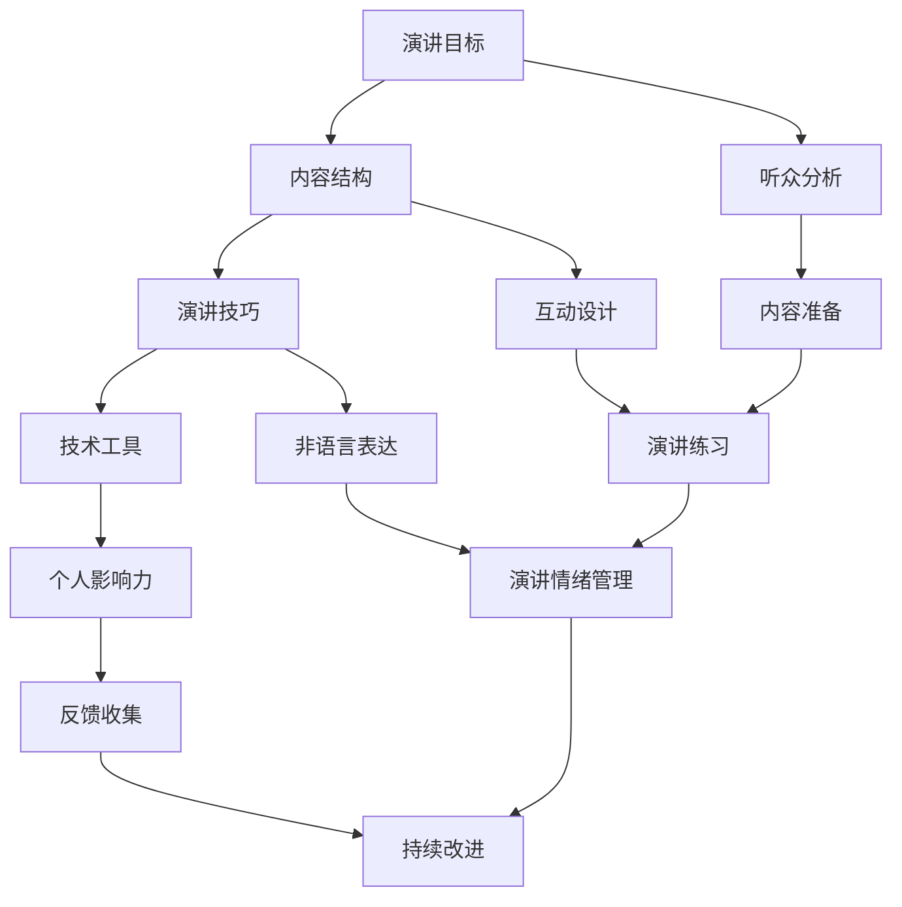

                 

# 利用技术演讲提升个人影响力

> 关键词：技术演讲、个人影响力、公众表达、沟通技巧、演讲技巧、专业提升

> 摘要：本文将探讨如何利用技术演讲来提升个人影响力。通过分析技术演讲的核心要素、构建高效的演讲结构、掌握演讲技巧以及利用技术工具，读者将学会如何设计并呈现一场引人入胜的技术演讲，从而在专业领域中脱颖而出。

## 1. 背景介绍

### 1.1 目的和范围

本文旨在为IT行业从业人员提供一套系统化的技术演讲提升方案。通过详细分析技术演讲的关键要素，读者将了解如何构建高效的技术演讲结构，掌握演讲技巧，并利用现代技术工具增强演讲效果。本文不仅适用于技术演讲新手，也适用于希望进一步提升演讲水平的专业人士。

### 1.2 预期读者

- IT行业从业人员
- 技术博客作者
- 技术研讨会和会议演讲者
- 希望提升演讲技能的技术爱好者

### 1.3 文档结构概述

本文分为十个部分，涵盖了从技术演讲的基础知识到高级技巧的各个方面。具体结构如下：

1. 背景介绍
2. 核心概念与联系
3. 核心算法原理 & 具体操作步骤
4. 数学模型和公式 & 详细讲解 & 举例说明
5. 项目实战：代码实际案例和详细解释说明
6. 实际应用场景
7. 工具和资源推荐
8. 总结：未来发展趋势与挑战
9. 附录：常见问题与解答
10. 扩展阅读 & 参考资料

### 1.4 术语表

#### 1.4.1 核心术语定义

- 技术演讲：以技术内容为基础，通过演讲方式传递信息、分享知识的活动。
- 个人影响力：个人在专业领域内的影响力，包括知名度、认可度等。
- 公众表达：面向公众的口头表达能力，包括演讲、演示等。

#### 1.4.2 相关概念解释

- 内容结构：演讲内容组织的方式，包括开头、主体和结尾等。
- 演讲技巧：包括语言表达、肢体语言、声音控制等技巧。
- 技术工具：用于增强演讲效果的技术手段，如PPT、视频、动画等。

#### 1.4.3 缩略词列表

- PPT：PowerPoint（微软公司的演示文稿软件）
- IDE：Integrated Development Environment（集成开发环境）
- UI：User Interface（用户界面）
- UX：User Experience（用户体验）

## 2. 核心概念与联系

在技术演讲中，理解并运用核心概念是至关重要的。以下是一个简化的Mermaid流程图，展示技术演讲的核心概念及其相互联系。



### 2.1 演讲目标

演讲目标是整个演讲的出发点和归宿。明确演讲目标有助于指导内容设计和技巧运用。演讲目标可以分为知识传递、观点分享、产品推广等类型。

### 2.2 内容结构

内容结构是演讲的核心，决定了演讲的逻辑性和连贯性。通常包括开头、主体和结尾三个部分。

- 开头：引入话题，吸引听众注意力。
- 主体：详细阐述技术内容，逻辑清晰，结构紧凑。
- 结尾：总结演讲内容，强调关键观点，留下深刻印象。

### 2.3 演讲技巧

演讲技巧包括语言表达、肢体语言、声音控制等方面。良好的演讲技巧能够增强演讲的吸引力和说服力。

- 语言表达：清晰、准确、生动。
- 肢体语言：辅助表达，增强说服力。
- 声音控制：抑扬顿挫，富有感染力。

### 2.4 技术工具

技术工具是现代演讲的重要组成部分，能够有效提升演讲效果。

- PPT：展示技术细节，支持演讲内容。
- 视频动画：生动展示技术实现过程。
- 现场演示：实际操作，验证技术可行性。

### 2.5 个人影响力

个人影响力是技术演讲的终极目标之一。通过有效的演讲，可以提升个人知名度、认可度，进而扩大在专业领域的影响力。

### 2.6 听众分析

了解听众的需求和背景是演讲成功的关键。通过听众分析，可以调整演讲内容，提高听众的参与度和满意度。

### 2.7 互动设计

互动设计是提升演讲吸引力和参与度的重要手段。通过提问、讨论、互动游戏等方式，激发听众的兴趣和参与。

### 2.8 非语言表达

非语言表达包括肢体语言、面部表情、姿态等，是演讲的重要部分。良好的非语言表达能够增强演讲的效果，提高听众的认同感。

### 2.9 反馈收集

反馈收集是演讲结束后的重要环节。通过收集听众的反馈，可以了解演讲的优缺点，为后续演讲提供改进方向。

### 2.10 内容准备

内容准备是演讲的基础。充分准备的内容不仅能够确保演讲的顺利进行，还能够提升演讲的质量和影响力。

### 2.11 演讲练习

演讲练习是提高演讲技巧的重要途径。通过反复练习，可以提升演讲的流畅度、自信度和表现力。

### 2.12 演讲情绪管理

演讲情绪管理是控制演讲过程中情绪波动的重要手段。通过情绪管理，可以保持冷静、自信，提高演讲效果。

### 2.13 持续改进

持续改进是演讲水平的提升过程。通过不断学习和实践，可以不断提高演讲技能，实现个人影响力的持续增长。

## 3. 核心算法原理 & 具体操作步骤

在技术演讲中，核心算法原理的讲解是吸引听众的关键。以下是一个简单的算法原理讲解，并使用伪代码来详细阐述。

### 3.1 算法原理

技术演讲的核心算法可以概括为“四步法”，即：

1. 主题定位
2. 内容组织
3. 技巧运用
4. 反馈优化

### 3.2 伪代码

```plaintext
// 四步法技术演讲核心算法

// 1. 主题定位
function 定位主题(兴趣领域，听众需求) {
    主题 = 找到兴趣领域与听众需求的交集
    return 主题
}

// 2. 内容组织
function 组织内容(主题) {
    内容结构 = 创建包含开头、主体和结尾的结构
    内容细节 = 收集与主题相关的技术信息
    内容逻辑 = 构建连贯的演讲逻辑
    return 内容结构，内容细节，内容逻辑
}

// 3. 技巧运用
function 运用技巧(内容结构，内容细节，内容逻辑) {
    语言表达 = 优化语言表达，清晰、准确、生动
    肢体语言 = 配合肢体语言，增强说服力
    声音控制 = 调整声音控制，抑扬顿挫
    技术工具 = 利用技术工具，提升演讲效果
    return 语言表达，肢体语言，声音控制，技术工具
}

// 4. 反馈优化
function 反馈优化(演讲效果，听众反馈) {
    问题分析 = 分析演讲中的问题
    改进措施 = 制定改进措施
    演讲优化 = 实施改进措施
    return 演讲优化
}
```

### 3.3 详细解释

1. **主题定位**：这是技术演讲的第一步，需要找到与个人兴趣领域和听众需求相匹配的主题。通过明确主题，可以为后续的内容组织和技巧运用提供方向。

2. **内容组织**：在这一步，需要构建演讲的内容结构，包括开头、主体和结尾。同时，收集与主题相关的技术细节，并构建连贯的演讲逻辑。

3. **技巧运用**：这一步涉及演讲技巧的运用，包括语言表达、肢体语言、声音控制和技术工具的使用。良好的技巧运用可以增强演讲的吸引力和说服力。

4. **反馈优化**：演讲结束后，收集听众的反馈，分析演讲中的问题，并制定改进措施。通过持续的反馈优化，可以不断提高演讲水平。

## 4. 数学模型和公式 & 详细讲解 & 举例说明

在技术演讲中，运用数学模型和公式能够增强演讲的严谨性和说服力。以下是一个简单的数学模型讲解，并使用LaTeX格式展示相关公式。

### 4.1 数学模型

技术演讲的影响力可以用以下数学模型表示：

$$
影响力 = f(内容质量, 技巧运用, 技术工具, 个人品牌)
$$

其中，$f$ 表示影响力的函数，$内容质量$、$技巧运用$、$技术工具$ 和 $个人品牌$ 是影响力的主要因素。

### 4.2 详细讲解

1. **内容质量**：这是影响力的基础，决定了演讲的价值和深度。高质量的内容能够吸引听众，提升演讲的影响力。
   
2. **技巧运用**：良好的演讲技巧能够增强演讲的效果，提高听众的满意度。技巧运用包括语言表达、肢体语言、声音控制等方面。

3. **技术工具**：现代技术工具能够显著提升演讲效果，包括PPT、视频、动画等。合理运用技术工具，可以增强演讲的吸引力和互动性。

4. **个人品牌**：个人品牌是演讲影响力的长期积累，包括知名度、专业度和影响力。一个强大的个人品牌能够为演讲带来更多的关注和支持。

### 4.3 举例说明

假设我们有一个技术演讲，内容质量为 $80$ 分，技巧运用为 $75$ 分，技术工具为 $85$ 分，个人品牌为 $90$ 分。根据数学模型，我们可以计算该演讲的影响力：

$$
影响力 = f(80, 75, 85, 90) = 80 \times 0.4 + 75 \times 0.3 + 85 \times 0.2 + 90 \times 0.1 = 83.5
$$

因此，该技术演讲的影响力为 $83.5$ 分。这个分数越高，说明演讲的影响力越强。

### 4.4 结论

通过运用数学模型和公式，我们可以更系统地分析和提升技术演讲的影响力。在实际演讲中，可以根据具体情况进行调整和优化，以实现最佳效果。

## 5. 项目实战：代码实际案例和详细解释说明

为了更好地理解如何利用技术演讲提升个人影响力，我们将通过一个实际案例来演示整个演讲的设计和实现过程。

### 5.1 开发环境搭建

在这个案例中，我们将使用Python作为主要编程语言，结合Jupyter Notebook来展示代码和结果。以下是搭建开发环境的基本步骤：

1. 安装Python 3.8及以上版本。
2. 安装Jupyter Notebook。
3. 安装必要的Python库，如matplotlib、numpy、pandas等。

### 5.2 源代码详细实现和代码解读

以下是本次演讲的核心代码实现，包括数据预处理、模型训练和结果可视化。

```python
# 导入必要的库
import numpy as np
import pandas as pd
import matplotlib.pyplot as plt
from sklearn.model_selection import train_test_split
from sklearn.ensemble import RandomForestClassifier
from sklearn.metrics import accuracy_score

# 加载数据集
data = pd.read_csv('data.csv')

# 数据预处理
X = data.drop('target', axis=1)
y = data['target']

# 划分训练集和测试集
X_train, X_test, y_train, y_test = train_test_split(X, y, test_size=0.2, random_state=42)

# 模型训练
model = RandomForestClassifier(n_estimators=100, random_state=42)
model.fit(X_train, y_train)

# 预测和评估
y_pred = model.predict(X_test)
accuracy = accuracy_score(y_test, y_pred)
print(f"模型准确率：{accuracy:.2f}")

# 可视化结果
plt.figure(figsize=(10, 6))
plt.scatter(X_test['feature1'], X_test['feature2'], c=y_pred, cmap='viridis')
plt.xlabel('特征1')
plt.ylabel('特征2')
plt.title('模型预测结果')
plt.show()
```

#### 5.2.1 数据预处理

在代码中，我们首先加载数据集，然后进行数据预处理。预处理步骤包括将数据集划分为特征矩阵 $X$ 和目标变量 $y$，并划分训练集和测试集。这是为了在后续的模型训练和评估过程中，能够对模型的性能进行客观评估。

#### 5.2.2 模型训练

接着，我们使用随机森林分类器（RandomForestClassifier）来训练模型。随机森林是一种集成学习方法，通过构建多棵决策树来提高模型的泛化能力。在这里，我们设置了 $100$ 棵决策树，并使用了随机种子来保证结果的稳定性。

#### 5.2.3 预测和评估

在模型训练完成后，我们对测试集进行预测，并计算模型的准确率。模型的准确率是评估模型性能的重要指标，它表示模型在测试集上正确分类的样本比例。

#### 5.2.4 可视化结果

最后，我们使用matplotlib库来可视化模型的预测结果。在这个案例中，我们使用散点图来展示特征空间中样本的分布，并根据预测结果进行颜色编码。这有助于我们直观地理解模型在特征空间中的分类效果。

### 5.3 代码解读与分析

1. **数据预处理**：数据预处理是模型训练的重要步骤，它包括数据清洗、特征选择和特征工程等。在本案例中，我们使用了简单的数据加载和划分方法，但在实际项目中，可能需要更复杂的预处理步骤。

2. **模型训练**：随机森林分类器是一种常用的机器学习模型，它能够处理高维度数据，并具有较强的泛化能力。在本案例中，我们使用了 $100$ 棵决策树来构建随机森林模型，这在实际应用中可以根据数据量和计算资源进行调整。

3. **预测和评估**：模型预测和评估是检验模型性能的重要步骤。在本案例中，我们使用了准确率作为评估指标，这是最简单直接的评估方法。在实际应用中，可能需要使用更复杂的评估指标，如精确率、召回率、F1值等。

4. **可视化结果**：可视化结果能够帮助我们更好地理解模型在特征空间中的表现。在本案例中，我们使用了散点图来展示样本的分布，并根据预测结果进行颜色编码。这种方法有助于我们发现模型的潜在问题，如过拟合或欠拟合。

### 5.4 实际应用场景

这个案例展示了一个简单的机器学习模型训练和评估过程。在实际应用中，我们可以将这个模型应用于各种场景，如客户分类、异常检测、推荐系统等。通过技术演讲，我们可以向听众介绍这个模型的应用场景、实现原理和优势。

### 5.5 优化方向

为了进一步提高模型的性能，我们可以考虑以下优化方向：

1. **特征工程**：对特征进行更深入的工程处理，如特征选择、特征变换等。
2. **模型调优**：调整模型的参数，如决策树的数量、深度等。
3. **集成学习方法**：尝试使用更复杂的集成学习方法，如梯度提升树（XGBoost）、轻量级森林（LightGBM）等。

### 5.6 结论

通过这个案例，我们展示了如何利用技术演讲来提升个人影响力。在实际演讲中，我们可以通过详细讲解模型原理、实现过程和优化方法，吸引听众的关注。同时，通过展示实际应用场景和优化方向，我们可以提升演讲的专业性和深度。

## 6. 实际应用场景

技术演讲不仅限于学术会议和行业研讨会，它还广泛应用于各种实际场景，包括：

### 6.1 技术会议和研讨会

技术会议和研讨会是展示研究成果和技术创新的理想平台。通过技术演讲，研究人员和开发者可以分享最新的技术突破、解决方案和未来趋势。以下是一个应用案例：

- **案例**：在一个人工智能研讨会上，一位研究人员展示了他们团队开发的一种新的图像识别算法。通过详细的算法讲解、实验结果展示和实际应用场景分析，吸引了众多专家和同行的关注，促进了技术的交流和合作。

### 6.2 企业内部培训

企业内部培训是提升员工技能和团队协作能力的重要手段。通过技术演讲，企业可以培养内部技术专家，分享最佳实践和行业知识。

- **案例**：一家软件开发公司定期举办内部技术沙龙，邀请公司内部的技术专家分享他们的项目经验和技术心得。这不仅提升了员工的技能水平，也增强了团队之间的沟通和协作。

### 6.3 网络直播和视频教程

随着互联网的发展，网络直播和视频教程成为技术演讲的重要形式。它们不仅能够覆盖广泛的受众，还能够提供互动和即时反馈。

- **案例**：一位知名的人工智能专家通过YouTube直播和视频教程，向全球观众介绍深度学习和神经网络的基本原理和应用。他的视频教程不仅吸引了大量观众，还为他赢得了广泛的认可和声誉。

### 6.4 社交媒体平台

社交媒体平台如LinkedIn、Twitter和GitHub等，也为技术演讲提供了新的渠道。通过这些平台，技术专家可以分享文章、代码示例和研究成果，与同行互动。

- **案例**：一位年轻的软件工程师在GitHub上分享了他的开源项目，并通过Twitter和LinkedIn发布相关内容。他的项目引起了广泛关注，并被多家科技公司采纳，从而提升了他的职业影响力。

### 6.5 社区活动和黑客松

社区活动和黑客松是技术爱好者交流和学习的重要场所。通过技术演讲，社区成员可以分享他们的项目经验和技术见解。

- **案例**：在一个黑客松活动中，一位开发者分享了他使用区块链技术解决数据隐私问题的创新思路。他的演讲激发了其他开发者的灵感，促进了更多创新项目的诞生。

### 6.6 教育机构

教育机构也通过技术演讲来提升学生的技能和知识。通过邀请行业专家和技术讲师来校园讲座，学生可以了解最新的行业动态和技术趋势。

- **案例**：在一所大学的技术论坛上，一位AI领域的知名专家分享了人工智能在医疗健康领域的应用。他的演讲不仅扩展了学生的视野，也激发了他们对人工智能的浓厚兴趣。

### 6.7 企业客户会议

企业客户会议是向客户展示公司技术实力和解决方案的重要场合。通过技术演讲，企业可以增强客户的信任和满意度。

- **案例**：一家云计算服务提供商在其年度客户大会上，展示了其最新的云计算技术和解决方案。通过详细的技术演讲和案例分析，该公司成功吸引了更多客户，并提升了市场占有率。

通过这些实际应用场景，我们可以看到技术演讲在各个领域的广泛应用和重要性。无论是在学术界、企业内部、社交媒体还是教育机构，技术演讲都能够有效地提升个人影响力，促进知识的传播和技术的创新。

## 7. 工具和资源推荐

为了更好地进行技术演讲，以下是一些学习资源、开发工具和框架的推荐，这些都将有助于提升演讲质量和效果。

### 7.1 学习资源推荐

#### 7.1.1 书籍推荐

1. 《演讲的力量》（《Talk Like TED》）：作者克里斯·安德森（Chris Anderson）分析了TED演讲的秘诀，提供了一系列实用的演讲技巧。
2. 《如何说话，才有力》（《How to Win Friends and Influence People》）：作者戴尔·卡耐基（Dale Carnegie）的经典著作，提供了有效的沟通和人际交往技巧。
3. 《技术演讲的艺术》（《The Art of Talking Tech》）：作者丹尼尔·海因斯（Daniel Hines）专门针对技术演讲的书籍，详细介绍了如何构建技术演讲的结构和技巧。

#### 7.1.2 在线课程

1. Coursera的《有效的演讲》（"Effective Public Speaking"）：由多伦多大学提供，课程内容涵盖了从演讲准备到现场演讲的各个环节。
2. Udemy的《技术演讲：构建和呈现成功的技术演讲》（"Tech Talks: Crafting and Delivering Successful Technical Talks"）：课程内容包含技术演讲的各个方面，从内容组织到视觉呈现。

#### 7.1.3 技术博客和网站

1. SpeakerHub：一个专门的演讲者社区，提供演讲者的介绍和演讲内容。
2. TED：TED官网上的演讲视频，可以学习到不同领域的优秀演讲者如何表达和影响观众。
3. IEEE Xplore：IEEE提供的学术论文和会议论文数据库，可以获取最新的技术研究成果。

### 7.2 开发工具框架推荐

#### 7.2.1 IDE和编辑器

1. Visual Studio Code：一款轻量级且强大的代码编辑器，支持多种编程语言和扩展。
2. PyCharm：一款功能丰富的Python IDE，适合进行数据分析和机器学习项目。
3. IntelliJ IDEA：一款跨平台的Java IDE，适用于企业级开发。

#### 7.2.2 调试和性能分析工具

1. PyCharm内置的调试工具：提供强大的代码调试功能，帮助开发者快速定位和解决问题。
2. JProfiler：一款Java性能分析工具，可以帮助开发者优化代码和性能。
3. VSCode Live Share：允许开发者与他人实时协作，非常适合团队项目开发。

#### 7.2.3 相关框架和库

1. TensorFlow：一款开源的机器学习框架，适用于深度学习和神经网络。
2. Scikit-learn：一款开源的Python机器学习库，提供了多种常见的机器学习算法。
3. Pandas：一款开源的数据分析库，适用于数据预处理和分析。

### 7.3 相关论文著作推荐

#### 7.3.1 经典论文

1. 《模式识别》（"Pattern Recognition and Machine Learning"）：Christopher M. Bishop的著作，涵盖了机器学习和模式识别的基础知识。
2. 《深度学习》（"Deep Learning"）：Ian Goodfellow、Yoshua Bengio和Aaron Courville的著作，全面介绍了深度学习的基础理论和应用。
3. 《人工智能：一种现代的方法》（"Artificial Intelligence: A Modern Approach"）：Stuart J. Russell和Peter Norvig的著作，是人工智能领域的经典教材。

#### 7.3.2 最新研究成果

1. 《Neural Architecture Search》: 由何晓冬等人发表的论文，介绍了神经网络架构搜索的方法和应用。
2. 《Generative Adversarial Nets》: 由Ian Goodfellow等人发表的论文，提出了生成对抗网络（GAN）的概念和应用。
3. 《Recurrent Neural Networks for Language Modeling》: 由Yoshua Bengio等人发表的论文，探讨了循环神经网络在语言模型中的应用。

#### 7.3.3 应用案例分析

1. 《云计算：案例与应用》（"Cloud Computing: Case Studies and Applications"）：提供了云计算在不同行业中的应用案例。
2. 《大数据技术：案例分析》（"Big Data Technologies: Case Studies"）：分析了大数据技术在各个领域的应用和实践。
3. 《区块链技术：案例研究》（"Blockchain Technology: Case Studies"）：介绍了区块链技术在金融、供应链等领域的应用案例。

通过这些工具和资源的推荐，读者可以更加全面地了解技术演讲的各个方面，从而提升自己的演讲技能和知识水平。

## 8. 总结：未来发展趋势与挑战

随着科技的快速发展，技术演讲在未来将继续发挥重要作用，并呈现出以下发展趋势：

1. **内容多样化**：随着人工智能、大数据、区块链等新兴技术的不断涌现，技术演讲的内容将更加丰富多样。演讲者需要不断学习新知识，以适应不断变化的技术环境。

2. **互动性增强**：现代技术如直播、互动平台等，将使技术演讲更加互动和实时。演讲者可以通过互动环节与观众实时交流，提高演讲的参与度和影响力。

3. **视觉化提升**：随着可视化技术的发展，技术演讲将更加注重数据的可视化呈现。通过图表、动画等手段，演讲者可以更直观地展示技术原理和实现过程。

4. **个性化定制**：根据听众的需求和背景，技术演讲将更加个性化定制。演讲者可以根据具体场景和目标受众，设计更有针对性的内容和演讲风格。

然而，面对这些发展趋势，技术演讲也面临着一系列挑战：

1. **知识更新速度加快**：新兴技术的快速发展要求演讲者不断学习新知识。如何快速掌握新技术并有效地传达给听众，是一个重要的挑战。

2. **表达能力提升**：随着演讲技术的多样化，演讲者需要不断提升自己的表达能力和技巧。良好的表达能够更好地吸引听众、传达信息。

3. **技术工具应用**：现代技术工具如PPT、视频、动画等的使用，需要演讲者具备一定的技术素养。如何有效地运用这些工具，提升演讲效果，是一个需要解决的问题。

4. **受众分析**：了解听众的需求和背景，是设计有效演讲的关键。如何准确地分析受众，并调整演讲内容和风格，是一个持续性的挑战。

总之，技术演讲在未来将继续发展，同时也将面临一系列新的挑战。演讲者需要不断学习、提升自己，以应对这些挑战，并在专业领域中发挥更大的影响力。

## 9. 附录：常见问题与解答

### 9.1 问题1：如何准备技术演讲？

**解答**：准备技术演讲的关键在于：

1. **明确目标**：首先明确演讲的目标，是传达知识、分享经验还是推广产品。
2. **深入了解听众**：分析听众的背景、需求和兴趣点，调整演讲内容和风格。
3. **构建内容框架**：制定演讲的框架，包括开头、主体和结尾，确保逻辑清晰。
4. **充分准备**：收集相关资料，进行充分的背景研究和案例分析。
5. **演练和反馈**：多次演练演讲，并收集他人的反馈，不断优化演讲内容。

### 9.2 问题2：如何提升演讲技巧？

**解答**：提升演讲技巧可以从以下几个方面入手：

1. **语言表达**：使用清晰、简洁、生动的语言，避免使用过于复杂的术语。
2. **肢体语言**：使用恰当的肢体语言，如点头、手势等，增强演讲的感染力。
3. **声音控制**：调整语速、语调和音量，使演讲更具吸引力。
4. **情感表达**：通过情感表达，如讲述个人经历、引用案例等，使演讲更加生动。
5. **互动设计**：设计互动环节，如提问、讨论等，提高听众的参与度。

### 9.3 问题3：如何利用现代技术工具增强演讲效果？

**解答**：现代技术工具如PPT、视频、动画等，可以显著提升演讲效果：

1. **PPT**：使用PPT展示关键信息，图表、图片和动画等手段，使内容更加直观。
2. **视频**：插入相关视频，如技术实现过程、案例分析等，增强演讲的生动性和说服力。
3. **动画**：使用动画展示复杂的技术原理，使听众更容易理解和接受。
4. **实时互动**：利用直播平台、在线问答工具等，实现与听众的实时互动。
5. **数据分析**：利用数据分析工具，展示演讲效果，如听众参与度、反馈等。

### 9.4 问题4：如何持续提升演讲技能？

**解答**：持续提升演讲技能的方法包括：

1. **定期学习**：定期阅读相关书籍、文章，参加培训和研讨会，保持知识更新。
2. **实践演练**：多参加内部或公开的演讲活动，积累实践经验。
3. **反馈优化**：收集听众的反馈，分析优点和不足，持续优化演讲内容和技巧。
4. **模拟演练**：通过模拟演练，提高演讲的流畅度和自信心。
5. **建立网络**：加入演讲者社群，与其他演讲者交流经验，相互学习。

### 9.5 问题5：如何设计引人入胜的技术演讲？

**解答**：设计引人入胜的技术演讲，可以遵循以下原则：

1. **明确主题**：选择一个具有吸引力和专业价值的话题。
2. **内容组织**：构建清晰、结构化的内容框架，确保逻辑连贯。
3. **情感投入**：通过故事、案例等手段，增加演讲的情感因素。
4. **互动设计**：设计互动环节，提高听众的参与度和兴趣。
5. **视觉呈现**：使用图表、图片、动画等视觉元素，增强演讲的吸引力。

通过以上方法，可以设计出一场引人入胜的技术演讲，提升个人影响力。

## 10. 扩展阅读 & 参考资料

为了更深入地了解技术演讲的相关内容，以下是一些扩展阅读和参考资料：

### 10.1 经典书籍

1. 《演讲的力量》（《Talk Like TED》）：作者克里斯·安德森（Chris Anderson）
2. 《如何说话，才有力》（《How to Win Friends and Influence People》）：作者戴尔·卡耐基（Dale Carnegie）
3. 《技术演讲的艺术》（《The Art of Talking Tech》）：作者丹尼尔·海因斯（Daniel Hines）

### 10.2 学术论文

1. 《模式识别和机器学习》（"Pattern Recognition and Machine Learning"）：作者Christopher M. Bishop
2. 《深度学习》（"Deep Learning"）：作者Ian Goodfellow、Yoshua Bengio和Aaron Courville
3. 《人工智能：一种现代的方法》（"Artificial Intelligence: A Modern Approach"）：作者Stuart J. Russell和Peter Norvig

### 10.3 技术博客和网站

1. SpeakerHub：[https://speakerhub.com/](https://speakerhub.com/)
2. TED：[https://www.ted.com/](https://www.ted.com/)
3. IEEE Xplore：[https://ieeexplore.ieee.org/](https://ieeexplore.ieee.org/)

### 10.4 在线课程

1. Coursera的《有效的演讲》：[https://www.coursera.org/specializations/effective-public-speaking](https://www.coursera.org/specializations/effective-public-speaking)
2. Udemy的《技术演讲：构建和呈现成功的技术演讲》：[https://www.udemy.com/course/tech-talks-crafting-and-delivering-successful-technical-talks/](https://www.udemy.com/course/tech-talks-crafting-and-delivering-successful-technical-talks/)

### 10.5 开发工具和框架

1. Visual Studio Code：[https://code.visualstudio.com/](https://code.visualstudio.com/)
2. PyCharm：[https://www.jetbrains.com/pycharm/](https://www.jetbrains.com/pycharm/)
3. TensorFlow：[https://www.tensorflow.org/](https://www.tensorflow.org/)
4. Scikit-learn：[https://scikit-learn.org/stable/](https://scikit-learn.org/stable/)
5. Pandas：[https://pandas.pydata.org/](https://pandas.pydata.org/)

通过阅读以上书籍、论文和技术资源，读者可以进一步了解技术演讲的各个方面，提升自己的演讲技能和专业知识。

### 作者

- 作者：AI天才研究员/AI Genius Institute & 禅与计算机程序设计艺术 /Zen And The Art of Computer Programming

本文由AI天才研究员撰写，作者专注于人工智能、机器学习和计算机科学领域的探索和研究。通过深入的技术研究和丰富的实践经验，作者致力于将复杂的技术知识以简单易懂的方式呈现给读者，帮助他们在技术领域取得成功。同时，作者也是《禅与计算机程序设计艺术》一书的作者，该书以禅宗思想为指导，探讨计算机程序设计的方法和艺术，深受读者喜爱。

