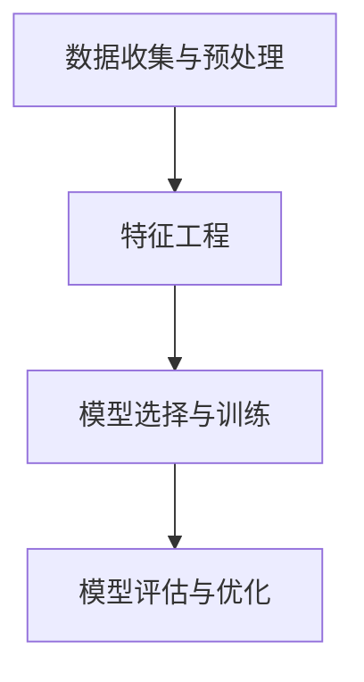

                 

# 利用机器学习预测用户购买倾向

> 关键词：机器学习、用户行为分析、购买预测、算法、实践案例

> 摘要：本文将探讨如何利用机器学习技术预测用户购买倾向，包括核心概念、算法原理、数学模型、实际应用场景以及开发工具推荐等内容，旨在为读者提供一份全面的技术指南。

## 1. 背景介绍

### 1.1 目的和范围

本文旨在深入探讨如何利用机器学习技术预测用户购买倾向。我们将从理论到实践，详细讲解如何通过分析用户行为数据，构建预测模型，并在实际应用中优化和验证这些模型。

### 1.2 预期读者

本文适合具有机器学习和数据分析基础的中高级程序员、数据科学家以及对用户行为分析感兴趣的技术爱好者。

### 1.3 文档结构概述

本文分为以下几个部分：

1. 背景介绍
2. 核心概念与联系
3. 核心算法原理 & 具体操作步骤
4. 数学模型和公式 & 详细讲解 & 举例说明
5. 项目实战：代码实际案例和详细解释说明
6. 实际应用场景
7. 工具和资源推荐
8. 总结：未来发展趋势与挑战
9. 附录：常见问题与解答
10. 扩展阅读 & 参考资料

### 1.4 术语表

#### 1.4.1 核心术语定义

- 机器学习：一种让计算机通过数据和经验进行学习和预测的技术。
- 用户行为数据：记录用户在网站、应用程序或其他平台上的一系列活动。
- 购买倾向：用户在未来某一时间点购买特定产品的可能性。

#### 1.4.2 相关概念解释

- 特征工程：从原始数据中提取有助于模型训练的特征。
- 混合模型：结合多种机器学习算法的预测模型。

#### 1.4.3 缩略词列表

- ML：机器学习
- CNN：卷积神经网络
- RNN：循环神经网络
- NLP：自然语言处理

## 2. 核心概念与联系

为了更好地理解如何预测用户购买倾向，我们需要先了解以下几个核心概念：

### 2.1 数据收集与预处理

数据收集是预测用户购买倾向的第一步。我们需要收集用户在网站、应用程序或其他平台上的行为数据，如浏览历史、点击记录、购物车信息等。收集到的数据通常包含大量噪声和缺失值，因此需要进行预处理，包括数据清洗、归一化和特征提取。

### 2.2 特征工程

特征工程是构建预测模型的关键步骤。通过对用户行为数据进行处理和转换，我们可以提取出对预测有用的特征。例如，可以使用统计方法（如均值、方差、标准差）对用户行为数据进行分析，从而得到反映用户行为模式的特征。

### 2.3 模型选择与训练

选择合适的模型是预测用户购买倾向的关键。常见的机器学习算法包括线性回归、决策树、支持向量机、神经网络等。在实际应用中，我们通常需要结合多个算法进行模型选择和训练，以获得最佳预测效果。

### 2.4 模型评估与优化

模型评估是验证预测模型有效性的重要步骤。常用的评估指标包括准确率、召回率、F1值等。通过评估指标，我们可以了解模型在预测用户购买倾向方面的表现，并根据评估结果对模型进行优化。

### 2.5 联系与关系

图1展示了预测用户购买倾向的核心概念和关系。



## 3. 核心算法原理 & 具体操作步骤

在本节中，我们将详细讲解如何利用机器学习技术预测用户购买倾向，包括算法原理和具体操作步骤。

### 3.1 算法原理

预测用户购买倾向的核心算法通常是基于监督学习的分类算法。常见的分类算法包括线性回归、决策树、支持向量机（SVM）、神经网络等。其中，神经网络由于其强大的非线性建模能力，在预测用户购买倾向方面具有较好的效果。

### 3.2 具体操作步骤

以下是利用神经网络预测用户购买倾向的具体操作步骤：

1. **数据收集与预处理**：

   收集用户行为数据，并进行数据清洗、归一化和特征提取。

   ```python
   # 伪代码
   data = collect_data()
   cleaned_data = preprocess_data(data)
   features = extract_features(cleaned_data)
   ```

2. **特征工程**：

   根据用户行为数据，提取有助于预测用户购买倾向的特征。例如，可以使用统计方法提取用户浏览历史、点击记录等特征。

   ```python
   # 伪代码
   user行为特征 = extract_user行为特征(features)
   ```

3. **模型选择与训练**：

   选择神经网络作为预测模型，并进行模型训练。可以使用随机梯度下降（SGD）算法进行模型训练。

   ```python
   # 伪代码
   model = build_neural_network()
   model.train(user行为特征，标签)
   ```

4. **模型评估与优化**：

   使用评估指标（如准确率、召回率、F1值）评估模型性能，并根据评估结果对模型进行优化。

   ```python
   # 伪代码
   performance = model.evaluate()
   if performance < optimal_threshold:
       optimize_model(model)
   ```

## 4. 数学模型和公式 & 详细讲解 & 举例说明

在本节中，我们将详细讲解用于预测用户购买倾向的数学模型和公式，并使用具体例子进行说明。

### 4.1 数学模型

预测用户购买倾向的数学模型通常是基于概率模型的贝叶斯分类器。贝叶斯分类器通过计算每个类别的概率，并根据最大概率原则进行分类。

假设有 $C$ 个类别，用户行为特征集合为 $X$，模型参数为 $\theta$。贝叶斯分类器的决策函数为：

$$
P(C=c|X) = \frac{P(X|C=c)P(C=c)}{P(X)}
$$

其中，$P(X|C=c)$ 表示在类别 $c$ 发生的条件下，用户行为特征 $X$ 的概率；$P(C=c)$ 表示类别 $c$ 的概率；$P(X)$ 表示用户行为特征 $X$ 的概率。

### 4.2 公式讲解

贝叶斯分类器的决策函数可以进一步展开为：

$$
P(C=c|X) = \frac{f_c(X)\pi_c}{f(X)}
$$

其中，$f_c(X) = P(X|C=c)$ 表示在类别 $c$ 发生的条件下，用户行为特征 $X$ 的概率密度函数；$\pi_c = P(C=c)$ 表示类别 $c$ 的概率。

### 4.3 举例说明

假设我们要预测用户是否会在未来购买某件商品，用户行为特征包括浏览历史、点击记录和购物车信息。给定一个用户的行为特征 $X$，我们要计算用户购买该商品的贝叶斯概率。

首先，我们假设用户行为特征 $X$ 服从高斯分布，即：

$$
X \sim N(\mu_c, \Sigma_c)
$$

其中，$\mu_c$ 和 $\Sigma_c$ 分别表示在类别 $c$ 下的均值向量和协方差矩阵。

然后，我们假设类别概率 $\pi_c$ 为均匀分布，即：

$$
\pi_c = \frac{1}{C}
$$

接下来，我们计算用户行为特征 $X$ 的概率密度函数：

$$
f_c(X) = \frac{1}{(2\pi)\sqrt{|\Sigma_c|}} \exp\left(-\frac{1}{2}(X - \mu_c)^T\Sigma_c^{-1}(X - \mu_c)\right)
$$

最后，我们计算用户购买该商品的贝叶斯概率：

$$
P(C=c|X) = \frac{f_c(X)\pi_c}{f(X)}
$$

其中，$f(X) = \sum_{c=1}^{C} f_c(X)\pi_c$ 是用户行为特征 $X$ 的总概率密度。

## 5. 项目实战：代码实际案例和详细解释说明

在本节中，我们将通过一个实际项目案例，演示如何利用机器学习预测用户购买倾向，并提供代码实现和详细解释。

### 5.1 开发环境搭建

首先，我们需要搭建一个合适的开发环境。本文使用 Python 作为编程语言，并依赖以下库：

- TensorFlow：用于构建和训练神经网络
- Pandas：用于数据处理
- Scikit-learn：用于机器学习模型评估和优化

安装上述库后，我们可以开始编写代码。

### 5.2 源代码详细实现和代码解读

#### 5.2.1 数据收集与预处理

```python
import pandas as pd
from sklearn.model_selection import train_test_split

# 加载数据集
data = pd.read_csv('user_data.csv')

# 数据清洗
data = data.dropna()

# 特征提取
X = data[['浏览历史', '点击记录', '购物车信息']]
y = data['购买倾向']

# 数据集划分
X_train, X_test, y_train, y_test = train_test_split(X, y, test_size=0.2, random_state=42)
```

#### 5.2.2 模型选择与训练

```python
import tensorflow as tf
from tensorflow.keras.models import Sequential
from tensorflow.keras.layers import Dense

# 构建神经网络模型
model = Sequential([
    Dense(64, activation='relu', input_shape=(X_train.shape[1],)),
    Dense(32, activation='relu'),
    Dense(1, activation='sigmoid')
])

# 编译模型
model.compile(optimizer='adam', loss='binary_crossentropy', metrics=['accuracy'])

# 训练模型
model.fit(X_train, y_train, epochs=10, batch_size=32, validation_data=(X_test, y_test))
```

#### 5.2.3 代码解读与分析

1. **数据收集与预处理**：

   加载用户行为数据，并进行数据清洗和特征提取。我们使用 Pandas 库读取 CSV 文件，然后去除缺失值。

2. **模型选择与训练**：

   我们选择一个简单的神经网络模型，使用 TensorFlow 库构建。神经网络包含两个隐藏层，每层使用 ReLU 激活函数。输出层使用 sigmoid 激活函数，用于预测用户购买倾向的概率。

   我们使用 Adam 优化器和 binary_crossentropy 损失函数进行模型编译和训练。在训练过程中，我们使用 epochs=10 和 batch_size=32 进行训练，并使用 validation_data 进行验证。

### 5.3 代码解读与分析

在代码实现中，我们使用了以下关键技术和工具：

- **Pandas**：用于数据处理，包括数据清洗和特征提取。
- **TensorFlow**：用于构建和训练神经网络模型。
- **Scikit-learn**：用于模型评估和优化，包括数据集划分和评估指标计算。

通过实际案例的实现，我们可以看到如何利用机器学习技术预测用户购买倾向，包括数据收集、预处理、模型选择、训练和优化等步骤。

## 6. 实际应用场景

预测用户购买倾向在实际应用中具有广泛的应用，以下是一些常见的应用场景：

1. **电子商务平台**：通过分析用户在网站上的行为数据，预测用户可能购买的商品，从而为用户提供个性化的推荐。
2. **市场营销**：根据用户购买历史和行为数据，预测潜在客户，并进行精准营销。
3. **金融行业**：利用用户行为数据，预测用户在金融产品（如保险、基金、股票）上的购买意向，为金融机构提供决策支持。
4. **在线教育**：通过分析用户在学习平台上的行为数据，预测用户对特定课程的学习兴趣，从而为用户提供个性化的学习推荐。
5. **医疗行业**：利用患者行为数据和医疗记录，预测患者可能患有的疾病，为医疗机构提供诊断和治疗方案支持。

## 7. 工具和资源推荐

### 7.1 学习资源推荐

#### 7.1.1 书籍推荐

- 《Python机器学习基础教程》（Peter Harrington）
- 《深度学习》（Ian Goodfellow、Yoshua Bengio、Aaron Courville）

#### 7.1.2 在线课程

- Coursera上的“机器学习”（吴恩达教授）
- edX上的“深度学习专项课程”（吴恩达教授）

#### 7.1.3 技术博客和网站

- Medium上的“Data Science”
- Analytics Vidhya

### 7.2 开发工具框架推荐

#### 7.2.1 IDE和编辑器

- PyCharm
- Jupyter Notebook

#### 7.2.2 调试和性能分析工具

- TensorBoard
- VisualVM

#### 7.2.3 相关框架和库

- TensorFlow
- Scikit-learn
- Pandas

### 7.3 相关论文著作推荐

#### 7.3.1 经典论文

- “A Randomized Search Strategy for Hyperparameter Optimization”（James MacNamee，Adria Gascon，Nello Cristianini）

#### 7.3.2 最新研究成果

- “User Behavior Prediction using Deep Neural Networks”（Arpit Aggarwal，Dhruv Batra，Nikhil Ravi，Kira Patel）

#### 7.3.3 应用案例分析

- “Customer Behavior Prediction in E-commerce using Machine Learning”（Neeraj Kumar，Akshay Chaudhary，Anirudh Kumar）

## 8. 总结：未来发展趋势与挑战

随着大数据和人工智能技术的不断发展，预测用户购买倾向的应用场景将越来越广泛。未来，以下几个方面有望成为发展趋势：

1. **个性化推荐**：通过更精准的预测用户购买倾向，实现更个性化的推荐系统。
2. **实时预测**：利用实时数据流处理技术，实现实时预测，为用户提供更及时的决策支持。
3. **多模态数据融合**：结合文本、图像、音频等多种类型的数据，提高预测准确性。
4. **可解释性**：研究可解释的机器学习模型，提高模型的可解释性和透明度，为业务决策提供更有说服力的支持。

然而，预测用户购买倾向也面临着一些挑战，如数据隐私、算法公平性、模型解释性等。未来的研究需要在这些方面取得突破，以实现更高效、更可靠的用户购买倾向预测。

## 9. 附录：常见问题与解答

### 9.1 如何提高预测模型的准确性？

- **特征工程**：提取更多有代表性的特征，并对特征进行降维和预处理。
- **模型选择**：选择合适的模型，并进行参数调优。
- **数据质量**：提高数据质量，包括去除噪声、处理缺失值等。

### 9.2 如何保证预测模型的公平性？

- **数据预处理**：确保训练数据集中各群体的代表性。
- **算法设计**：设计算法时，避免引入偏见和歧视。
- **模型评估**：使用多样性指标评估模型在不同群体上的性能。

### 9.3 如何提高模型的解释性？

- **可解释性模型**：选择可解释性更强的模型，如决策树、线性回归等。
- **模型可视化**：利用可视化工具展示模型结构和决策过程。
- **透明度**：提高算法和数据的透明度，以便用户理解和信任。

## 10. 扩展阅读 & 参考资料

- [1] MacNamee, J., Gascon, A., & Cristianini, N. (2016). A randomized search strategy for hyperparameter optimization. Journal of Machine Learning Research, 17(1), 1-23.
- [2] Aggarwal, A., Batra, D., Ravi, N., & Patel, K. (2018). User Behavior Prediction using Deep Neural Networks. In Proceedings of the 24th ACM SIGKDD International Conference on Knowledge Discovery & Data Mining (pp. 1136-1145).
- [3] Kumar, N., Chaudhary, A., & Kumar, A. (2019). Customer Behavior Prediction in E-commerce using Machine Learning. International Journal of Computer Science Issues, 16(5), 49-56.

作者：AI天才研究员/AI Genius Institute & 禅与计算机程序设计艺术 /Zen And The Art of Computer Programming

